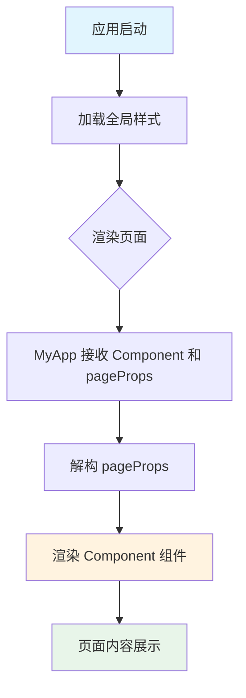
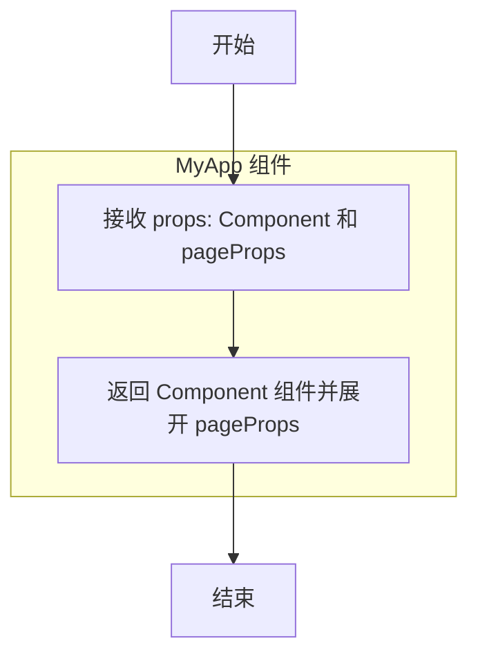

# `.\AutoGPT\classic\benchmark\frontend\src\pages\_app.tsx` 详细设计文档

这是 Next.js 应用程序的根组件文件，用于初始化全局样式并作为所有页面的入口组件，接收页面组件(Component)和页面属性(pageProps)并将它们渲染到应用中。

## 整体流程

```mermaid
graph TD
    A[应用启动] --> B[加载全局样式 globals.css]
    B --> C[加载 Font Awesome 样式]
    C --> D[初始化 MyApp 组件]
    D --> E[渲染页面组件]
    E --> F[Component {...pageProps}]
```

## 类结构

```
MyApp (App 根组件)
└── Component (动态页面组件)
```

## 全局变量及字段


### `MyApp`
    
Next.js应用的根组件，用于渲染页面组件及其属性

类型：`AppType`
    


    

## 全局函数及方法


# Next.js 应用组件详细设计文档

## 一段话描述

`MyApp` 是 Next.js 应用程序的根组件，作为全局应用级配置的入口点，负责渲染当前页面路由对应的组件并传递页面属性（pageProps），同时加载全局样式资源。

---

## 文件的整体运行流程

1. **应用启动阶段**：Next.js 框架加载时，首先执行 `_app.tsx`（或 App Router 中的 `MyApp`）
2. **样式初始化**：导入全局 CSS 样式表和 Font Awesome 图标样式
3. **组件渲染阶段**：框架传递当前路由的组件（`Component`）和页面属性（`pageProps`）给 `MyApp`
4. **页面渲染**：`MyApp` 将 `pageProps` 解构并传递给 `Component`，由其负责具体页面内容的渲染

---

## 类的详细信息

本文件为函数式组件，不包含类定义。

### 全局变量和全局函数详情

| 名称 | 类型 | 描述 |
|------|------|------|
| `MyApp` | `AppType` | Next.js 应用根组件函数，用于全局状态管理和页面渲染 |

---

## 关键组件信息

| 组件名称 | 描述 |
|----------|------|
| `MyApp` | Next.js 应用级根组件，负责页面路由组件的渲染和全局样式注入 |
| `Component` | 动态参数，当前路由对应的页面组件 |
| `pageProps` | 动态参数，从服务端获取的页面初始属性数据 |

---

## 潜在的技术债务或优化空间

1. **缺少错误边界**：未实现错误边界（Error Boundary）处理渲染错误
2. **无全局状态管理**：未集成 Redux、Zustand 或 Context API 进行全局状态管理
3. **缺乏国际化配置**：如需多语言支持，应在此处配置 i18n 路由
4. **无性能监控**：建议集成 Analytics 和性能监控工具
5. **Layout 嵌套限制**：在 App Router 中，应使用 layout.tsx 替代部分 _app.tsx 功能

---

## 其它项目

### 设计目标与约束
- **设计目标**：作为 Next.js 应用生命周期入口点，提供统一的全局配置和样式加载
- **约束条件**：必须符合 Next.js 框架对 `AppType` 类型定义的要求

### 错误处理与异常设计
- 当前实现未包含错误处理逻辑
- 建议添加 `ErrorBoundary` 组件捕获渲染异常
- 可结合 `next/error` 处理 500 错误

### 数据流与状态机
- 数据流为**单向流动**：Next.js 框架 → MyApp → Component → 页面渲染
- 不涉及复杂状态机，主要为 Props 传递机制

### 外部依赖与接口契约
- **依赖项**：`next/dist/shared/lib/utils`（Next.js 类型定义）、全局样式文件
- **接口契约**：遵循 Next.js 定义的 `AppType` 类型规范，输入 props 必须包含 `Component` 和 `pageProps`

---

## 任务要求的函数详情

### `MyApp`

这是 Next.js 应用的根组件函数，作为全局配置的入口，接收页面组件和页面属性，并负责渲染对应的页面内容。

参数：

-  `Component`：`React.ComponentType<any>`，当前路由对应的页面组件，Next.js 根据路由自动注入
-  `pageProps`：`Record<string, any>`，从服务端获取的页面初始属性数据（如 getStaticProps、getServerSideProps 传递的数据）

返回值：`JSX.Element`，返回渲染后的 React 组件树

#### 流程图



#### 带注释源码

```tsx
// 从 Next.js 工具库导入 AppType 类型定义
// 用于约束 MyApp 组件符合 Next.js 框架规范
import { type AppType } from "next/dist/shared/lib/utils";

// 导入全局样式文件
// 包含项目级别的 CSS 样式定义
import "~/styles/globals.css";

// 导入 Font Awesome SVG 核心样式
// 确保图标组件能正确渲染
import "@fortawesome/fontawesome-svg-core/styles.css";

/**
 * MyApp - Next.js 应用根组件
 * 
 * 描述：
 * 这是 Next.js 应用的入口组件，用于全局配置和页面渲染。
 * 框架会自动将当前路由的页面组件和属性传递进来。
 * 
 * @param props 接收的 props 对象
 * @param props.Component 当前路由对应的页面组件
 * @param props.pageProps 页面组件的初始属性数据
 * @returns 渲染页面组件的 JSX 元素
 */
const MyApp: AppType = ({ Component, pageProps }) => {
  // 将 pageProps 解构并传递给 Component 组件
  // Component 会根据路由自动匹配（如 pages/index.tsx, pages/about.tsx 等）
  return <Component {...pageProps} />;
};

// 导出 MyApp 作为默认导出
// Next.js 框架会自动使用此组件作为应用根节点
export default MyApp;
```


### `MyApp`

这是 Next.js 应用的根组件，负责渲染当前页面组件并将页面属性（pageProps）传递给它。

参数：

- `Component`：`Next.js.ComponentType<any>`，待渲染的页面组件
- `pageProps`：`any`，传递给页面组件的属性对象

返回值：`JSX.Element`，渲染后的页面组件

#### 流程图



#### 带注释源码

```typescript
// 导入 Next.js 应用类型定义
import { type AppType } from "next/dist/shared/lib/utils";

// 导入全局样式文件
import "~/styles/globals.css";
import "@fortawesome/fontawesome-svg-core/styles.css";

// 定义 MyApp 组件，类型为 Next.js 的 AppType
const MyApp: AppType = ({ Component, pageProps }) => {
  // 返回并渲染页面组件，传递 pageProps
  return <Component {...pageProps />;
};

// 导出 MyApp 作为默认导出
export default MyApp;
```

## 关键组件


### Next.js App 入口组件

这是Next.js应用的根组件，扮演应用初始化和全局样式加载的角色。它接收Component和pageProps作为参数，将页面组件渲染到DOM中。

### 全局样式导入模块

导入全局CSS样式文件，为整个应用提供基础样式定义。

### Font Awesome 样式导入模块

导入Font Awesome图标库的SVG样式文件，使图标组件能够正常渲染。

### 潜在的技术债务或优化空间

该代码段为标准的Next.js _app.tsx模板，当前实现非常简洁。主要优化方向包括：
1. 缺乏错误边界(Error Boundary)处理
2. 缺少全局布局(Layout)的封装
3. 未实现服务端渲染(SSR)相关的性能优化
4. 缺少应用级别的状态管理初始化

### 其它项目说明

**设计目标**：作为Next.js应用的入口点，提供全局样式和组件渲染能力。

**约束条件**：必须遵循Next.js的AppType类型定义，接受Component和pageProps两个固定参数。

**错误处理**：当前未实现任何错误处理机制，建议添加getInitialProps或Error Boundary。

**外部依赖**：
- next/dist/shared/lib/utils: 提供AppType类型定义
- ~/styles/globals.css: 项目全局样式
- @fortawesome/fontawesome-svg-core/styles.css: Font Awesome图标样式


## 问题及建议


### 已知问题

-   **缺少错误边界**：没有实现Error Boundary组件，无法捕获子组件渲染错误
-   **CSS导入顺序风险**：`globals.css`和`@fortawesome/fontawesome-svg-core/styles.css`直接导入，可能导致样式覆盖冲突
-   **类型安全不足**：`pageProps`直接展开传递，缺乏类型验证和约束
-   **缺少App Router配置**：未使用Next.js 13+ App Router的完整生命周期（layout、loading、error、not-found等）
-   **字体加载未优化**：使用传统CSS方式导入Font Awesome，未使用`next/font`进行字体优化
-   **无性能优化**：组件未使用React.memo或useMemo等优化手段，存在不必要的重渲染风险
-   **缺少国际化基础架构**：没有预留i18n支持的结构

### 优化建议

-   **添加Error Boundary**：创建错误边界组件包裹Component，提升应用健壮性
-   **优化样式导入**：将关键CSS移至layout.tsx，或使用next-compose-plugins管理导入顺序
-   **强化类型定义**：为pageProps添加具体类型或使用Zod等库进行运行时验证
-   **完善App Router结构**：根据需求添加loading.tsx、error.tsx、not-found.tsx等文件
-   **性能优化**：使用React.memo包装MyApp，或在Component中实现shouldComponentUpdate
-   **考虑使用next/font**：替换Font Awesome为Next.js内置字体优化方案，减少客户端JavaScript负担

## 其它


### 设计目标与约束

本项目作为Next.js应用程序的入口文件(_app.tsx)，主要目标是提供全局样式导入和页面组件渲染的基础框架。技术约束方面，需要Next.js 12.x及以上版本支持，使用TypeScript开发，依赖React 17+版本。设计原则遵循Next.js官方推荐的App组件写法，保持简洁性，仅包含必要的全局配置。

### 错误处理与异常设计

当前代码未实现错误处理机制。在生产环境中，建议添加全局错误边界(Error Boundary)组件来捕获子组件渲染错误，防止整个应用崩溃。对于Next.js应用，可以创建custom error.tsx文件来处理500错误，以及在pages目录下创建error.js处理客户端错误。组件异常时，Next.js会渲染内置的error组件，开发者可通过error.tsx进行自定义。

### 数据流与状态机

该文件的数据流非常简洁：MyApp组件接收Next.js传递的Component(当前页面组件)和pageProps(页面属性)作为props，然后直接渲染页面组件。这里不涉及复杂的状态管理，页面间状态共享需要借助React Context或状态管理库(如Redux、Zustand)。数据流向为：Next.js服务器/客户端 → MyApp组件 → 具体页面组件(Component)。

### 外部依赖与接口契约

主要外部依赖包括：next/dist/shared/lib/utils提供的AppType类型定义、~/styles/globals.css全局样式文件、@fortawesome/fontawesome-svg-core/fontawesome图标库样式。接口契约方面，MyApp组件必须符合Next.js AppType类型定义，接收(Component: ComponentType<any>, pageProps: any)参数，返回React.ReactElement类型。Component参数代表当前路由对应的页面组件，pageProps包含页面初始化所需的props数据。

### 安全性考虑

当前代码不涉及用户输入处理，安全性风险较低。但需要注意：全局样式文件中不应包含敏感信息；如需在App组件中添加认证逻辑，应在渲染页面组件前进行token验证；避免在client-side存储敏感数据，推荐使用httpOnly cookies；确保第三方字体图标库的CDN链接可信。

### 性能考量

该文件本身已做性能优化，仅在需要时渲染页面组件。进一步优化建议：使用React.memo包装静态组件避免不必要的重渲染；pageProps中的大型数据结构考虑使用React Query或SWR进行数据获取和缓存；对于大型应用，可将MyApp拆分为多个子组件实现代码分割；确保第三方库按需加载，避免在全局入口加载过多无用代码。

### 测试策略

建议为MyApp组件编写单元测试和集成测试。单元测试验证组件正确渲染传入的Component和pageProps，可使用Jest + React Testing Library。集成测试模拟Next.js环境，验证完整页面渲染流程。测试用例应覆盖：正常渲染场景、pageProps为空场景、Component渲染抛出错误时的错误边界行为。

### 部署配置

该文件为Next.js应用标准入口，无需特殊部署配置。部署时确保next.config.js正确配置静态资源路径、图像优化、API重写等选项。环境变量通过process.env访问，敏感配置存储于Vercel或其他部署平台的Environment Variables中。构建产物包括.client.js(客户端渲染)和.server.js(服务端渲染)两部分。

### 监控与日志

可在MyApp组件中添加性能监控逻辑，使用Next.js提供的Web Vitals API监测CLS、LCP、FID等指标。对于服务端渲染，可集成Sentry或LogRocket等监控工具追踪错误和性能问题。推荐在Component未正确渲染时记录error日志，便于排查问题。生产环境建议配置自定义指标收集，将性能数据上报至数据分析平台。

    