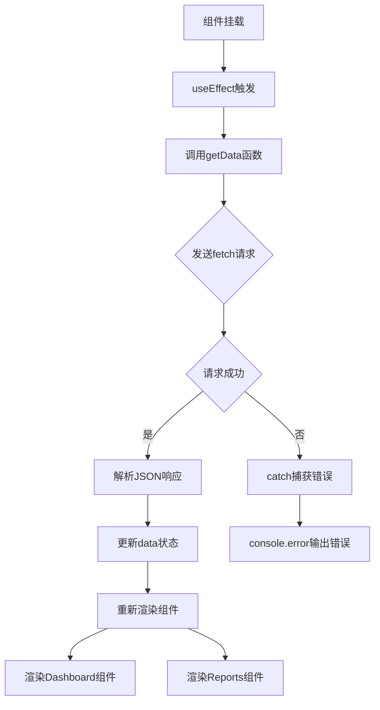
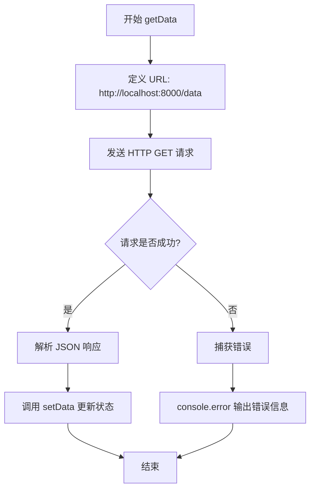
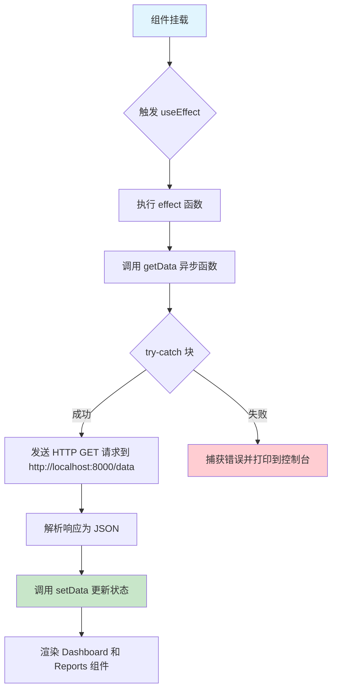
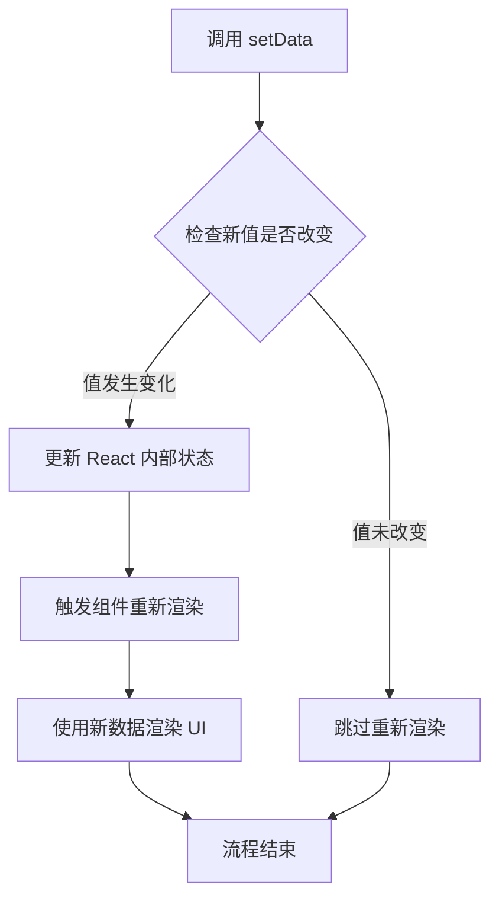
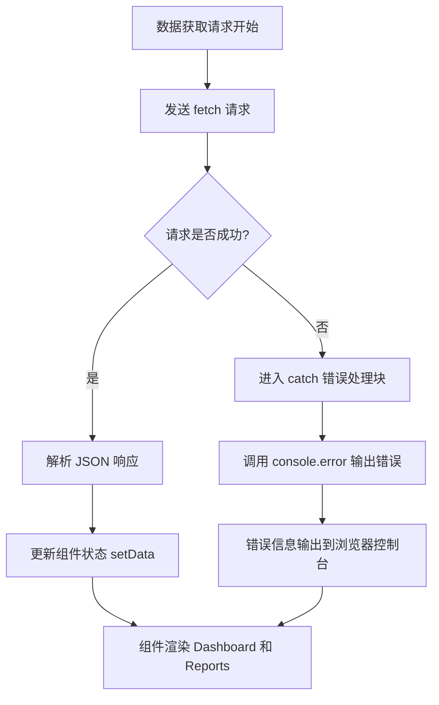
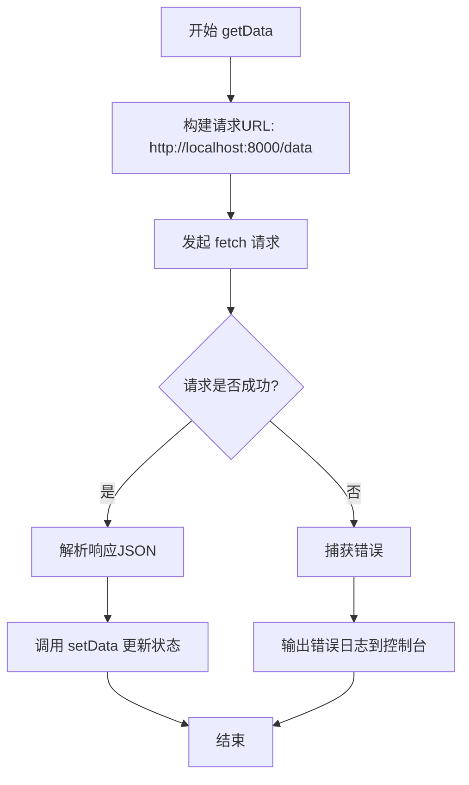

# `.\AutoGPT\classic\benchmark\frontend\src\pages\data.tsx` 详细设计文档

这是一个React数据展示页面组件，通过useEffect在组件挂载时从本地后端API获取数据，并将数据传递给Dashboard和Reports两个子组件进行可视化展示，同时使用tailwind-styled-components进行样式封装。

## 整体流程



## 类结构

```
DataPage (页面组件)
└── PageContainer (样式容器)
```

## 全局变量及字段


### `data`
    
存储从API获取的数据的状态变量

类型：`any[]`
    


### `response`
    
fetch API返回的响应对象

类型：`Response`
    


### `responseData`
    
从响应中解析的JSON数据

类型：`any`
    


### `error`
    
捕获的异常对象

类型：`any`
    


### `DataPage.data`
    
组件状态，用于存储从后端API获取的数据

类型：`any[]`
    
    

## 全局函数及方法


### `getData`

该函数是一个异步数据获取方法，用于从本地服务器获取数据并将结果存储到组件状态中。

参数：

- 无参数

返回值：`Promise<void>`，该函数为异步函数，但本身不返回有意义的值，主要通过调用 `setData` 更新组件状态

#### 流程图



#### 带注释源码

```
const getData = async () => {  // 异步函数定义，用于获取数据
  try {  // 开始错误处理块
    let url = `http://localhost:8000/data`;  // 定义后端 API 端点 URL
    const response = await fetch(url);  // 发送 HTTP GET 请求并等待响应
    const responseData = await response.json();  // 将响应体解析为 JSON 格式

    setData(responseData);  // 调用状态更新函数，将获取的数据存入组件状态
  } catch (error) {  // 捕获请求或解析过程中的错误
    console.error("There was an error fetching the data", error);  // 输出错误信息到控制台
  }
};
```


### `DataPage.useEffect`

该 useEffect 在组件挂载时自动触发，调用 getData 函数从后端 API 获取数据，并将响应数据存储到组件状态中。

参数：

- `effect`：`() => void`，副作用函数，在组件挂载时执行，调用 getData 函数获取数据
- `deps`：`readonly []`，依赖项数组，为空数组表示该 effect 仅在组件挂载时执行一次（componentDidMount）

返回值：`void`，该 useEffect 不返回任何清理函数

#### 流程图



#### 带注释源码

```tsx
useEffect(
  /**
   * effect 函数：副作用逻辑
   * 在组件挂载时执行一次，获取远程数据
   */
  () => {
    getData(); // 调用异步数据获取函数
  },
  /**
   * deps 依赖项数组
   * 空数组表示 effect 无依赖项，仅在组件挂载时执行一次
   * 相当于 class 组件的 componentDidMount 生命周期
   */
  []
);
```


### `getData` 函数中的 `fetch` 调用

在 `DataPage` 组件的 `getData` 异步函数中，使用 `fetch` API 从本地服务器获取数据。

参数：

- `url`：`string`，要获取资源的 URL 地址，这里为 `http://localhost:8000/data`

返回值：`Promise<Response>`，返回一个 Promise，解析为 Response 对象，表示 HTTP 响应

#### 流程图

```mermaid
flowchart TD
    A[开始 getData] --> B[构建 URL: http://localhost:8000/data]
    B --> C[调用 fetch(url) 发起网络请求]
    C --> D{请求是否成功?}
    D -->|是| E[获取 Response 对象]
    D -->|否| F[抛出错误]
    E --> G[调用 response.json() 解析 JSON 数据]
    G --> H[调用 setData 更新状态]
    H --> I[结束]
    F --> J[catch 捕获错误]
    J --> K[console.error 输出错误信息]
    K --> I
```

#### 带注释源码

```typescript
const getData = async () => {
  try {
    // 构建要请求的 URL 地址
    let url = `http://localhost:8000`;
    
    // 使用 fetch API 发起 HTTP GET 请求
    // 参数 url: 请求的资源地址
    // 返回 Promise<Response>: 包含 HTTP 响应对象
    const response = await fetch(url);
    
    // 将响应体解析为 JSON 格式
    // 返回解析后的 JavaScript 对象/数组
    const responseData = await response.json();
    
    // 使用 React 的 setState 更新组件状态
    // 将获取到的数据存储到 data 状态中
    setData(responseData);
  } catch (error) {
    // 捕获网络请求或数据解析过程中的错误
    // error: 错误对象，包含错误信息
    console.error("There was an error fetching the data", error);
  }
};
```


### `setData`

这是 React 函数组件中使用 `useState` 钩子返回的状态更新函数，用于更新组件内部的状态数据。该函数由 React 的状态管理机制提供，允许组件在数据变化时触发重新渲染。

参数：

- `newData`：`any`，要设置的新数据值，可以是任何类型的数据

返回值：`void`，无返回值（React 状态更新函数不返回值）

#### 流程图



#### 带注释源码

```typescript
// React useState 钩子返回的状态更新函数
// 语法：const [state, setState] = useState(initialValue)
// 
// 参数说明：
//   - newData: 任意类型的新数据值，用于更新组件状态
//   - React 会进行浅比较，如果值与当前状态相同，则不会触发重新渲染
//
// 工作原理：
//   1. 接收新数据作为参数
//   2. 更新组件内部的状态存储器
//   3. 标记组件需要重新渲染
//   4. 触发后续的 DOM 更新流程
//
// 注意事项：
//   - 这是异步更新，多个 setData 调用可能会被批处理
//   - 如果新状态依赖于前一个状态，建议使用函数式更新形式：setData(prevData => ...)
setData(responseData); // 将从 API 获取的响应数据更新到组件状态中
```


### `console.error`

`console.error` 是一个用于输出错误信息的标准 JavaScript 全局方法，在此代码中用于捕获并输出数据获取过程中的错误信息。

参数：

- `message`：`string`，错误描述信息，即 "There was an error fetching the data"
- `error`：`any`，捕获的异常对象，包含错误的详细堆栈信息

返回值：`void`，无返回值，仅作为副作用输出错误信息到控制台

#### 流程图



#### 带注释源码

```javascript
// console.error: 标准 JavaScript 全局方法，用于输出错误级别日志
// 参数1: string - 人类可读的错误描述信息
// 参数2: any - 捕获的 Error 对象，包含堆栈等详细信息
console.error("There was an error fetching the data", error);
```

---

### 附加上下文信息

#### 在 `getData` 函数中的调用流程

```javascript
const getData = async () => {
  try {
    // 1. 定义 API 端点 URL
    let url = `http://localhost:8000/data`;
    
    // 2. 发起异步 HTTP 请求
    const response = await fetch(url);
    
    // 3. 解析响应 JSON 数据
    const responseData = await response.json();

    // 4. 更新 React 组件状态
    setData(responseData);
  } catch (error) {
    // 5. 捕获网络错误或解析错误
    // 6. 输出错误信息到浏览器开发者控制台
    console.error("There was an error fetching the data", error);
  }
};
```

#### 技术债务与优化空间

1. **错误处理不够健壮**：仅使用 `console.error` 输出错误，未向用户展示友好的错误提示 UI
2. **硬编码 URL**：`http://localhost:8000/data` 硬编码在函数内部，应提取为配置或环境变量
3. **类型安全**：`data` 状态使用 `any` 类型，应定义具体的数据接口类型
4. **缺少加载状态**：未展示数据加载过程中的 loading 状态
5. **未处理 HTTP 错误状态**：即使响应不成功（如 404、500），代码仍会尝试解析 JSON


### `DataPage.getData`

这是一个异步函数，用于从本地服务器获取数据，并将响应数据更新到组件状态中。

参数：

- （无显式参数）

返回值：`Promise<void>`，该函数没有显式返回值（async 函数隐式返回 Promise resolve 为 undefined）

#### 流程图



#### 带注释源码

```typescript
const getData = async () => {
  // 使用 try-catch 块捕获可能发生的网络或解析错误
  try {
    // 定义数据请求的端点 URL
    let url = `http://localhost:8000/data`;
    
    // 使用 fetch API 发起 HTTP GET 请求
    const response = await fetch(url);
    
    // 将响应体解析为 JSON 格式
    const responseData = await response.json();

    // 将获取到的数据更新到 React 组件状态中
    setData(responseData);
  } catch (error) {
    // 发生错误时，在控制台输出错误信息便于调试
    console.error("There was an error fetching the data", error);
  }
};
```

#### 额外信息

| 项目 | 说明 |
|------|------|
| **定义位置** | React 函数组件 `DataPage` 内部 |
| **调用时机** | 在 `useEffect` 钩子中，组件挂载后自动调用一次 |
| **依赖项** | 无外部依赖参数，但内部依赖 `setData` 状态更新函数 |
| **错误处理** | 通过 try-catch 捕获异常并输出到控制台，但未向用户展示错误信息 |
| **潜在优化** | 1. 硬编码的 API 地址应提取到配置环境变量<br>2. 缺少 loading 状态管理<br>3. 缺少错误状态展示给用户的机制<br>4. 未处理 HTTP 响应非 200 状态码的情况 |


### `DataPage.useEffect`

该 Hook 用于在 `DataPage` 组件挂载（Mount）时触发一次副作用——即调用 `getData` 函数从后端获取数据，并更新组件的 `data` 状态。由于依赖数组为空 `[]`，它仅在组件首次渲染时执行。

参数：

-  `effect`: `React.EffectCallback`，副作用函数。在组件挂载时被调用，内部执行 `getData` 以触发数据请求。
-  `deps`: `React.DependencyList`，依赖数组。此处传入空数组 `[]`，确保副作用仅在组件“挂载”阶段执行一次，避免重复请求。

返回值：`void`，无返回值（React Hook 的标准返回类型）。

#### 流程图

```mermaid
graph TD
    A[组件挂载 / 首次渲染] --> B[React 检测到 useEffect]
    B --> C{依赖数组检查}
    C -->|空数组 []| D[执行 Effect 回调函数]
    D --> E[调用 getData 函数]
    E --> F[异步发起 HTTP 请求 fetch]
    F --> G[后端返回数据]
    G --> H[执行 setData 更新状态]
    H --> I[组件重新渲染]
```

#### 带注释源码

```javascript
  // 定义一个 Effect Hook
  useEffect(
    // 第一个参数：Effect 回调函数
    () => {
      getData(); // 调用在组件内部定义的异步数据获取函数
    }, 
    // 第二个参数：依赖数组
    // 传入空数组 [] 表示该 Effect 只在组件挂载时运行一次（Component Did Mount）
    []
  );
```


## 关键组件


### DataPage 组件

主页面组件，负责管理数据状态、在组件挂载时异步获取数据，并将数据传递给子组件进行展示。

### getData 异步函数

异步数据获取函数，通过fetch API从本地服务器获取JSON数据，并更新组件状态。

### data 状态

用于存储从服务器获取的数据，类型为任意类型数组，供Dashboard和Reports组件使用。

### PageContainer 样式容器

使用tailwind-styled-components定义的页面容器，包含宽度、高度、最小高度和背景色等样式属性。

### Dashboard 组件

数据展示子组件，接收data作为props，负责以仪表盘形式展示数据。

### Reports 组件

报告子组件，接收data作为props，负责以报告形式展示数据。


## 问题及建议


### 已知问题

-   **硬编码的API地址**：`http://localhost:8000/data` 硬编码在代码中，无法适配不同环境（开发、测试、生产）
-   **使用any类型**：`useState<any>([])` 使用了TypeScript的any类型，失去了类型安全性和代码提示
-   **缺少加载状态**：获取数据时没有loading状态，用户无法感知数据加载过程
-   **错误处理不完善**：仅在console输出错误，缺少用户友好的错误提示UI
-   **缺少请求取消机制**：组件卸载时若请求仍在进行，可能导致内存泄漏和警告
-   **依赖数组警告风险**：`useEffect`依赖空数组`[]`，如果`getData`使用不当可能触发ESLint的exhaustive-deps规则警告
-   **无数据缓存机制**：每次组件挂载都会重新请求数据，增加服务器压力
-   **缺少数据模型定义**：API返回的数据结构没有定义明确的TypeScript接口

### 优化建议

-   将API地址改为环境变量（如`process.env.REACT_APP_API_URL`或使用配置中心）
-   定义具体的数据类型接口替换any类型，如`interface DataItem { ... }`
-   添加`isLoading`和`error`状态，提供加载指示器和错误提示UI
-   使用`AbortController`在组件卸载时取消未完成的请求
-   考虑引入数据请求库（如React Query或SWR）实现缓存、重试、自动刷新等功能
-   将`getData`函数用`useCallback`包装并加入依赖数组，或将其提取到组件外部
-   定义API响应数据的TypeScript接口，增强类型安全
-   添加数据请求超时处理和重试逻辑，提升容错性

## 其它


### 设计目标与约束

本组件的核心设计目标是作为一个数据展示页面，通过从后端API获取数据并将其传递给子组件（Dashboard和Reports）进行可视化展示。主要约束包括：1）组件必须在客户端浏览器环境中运行；2）依赖外部API服务（http://localhost:8000/data）；3）使用Tailwind CSS进行样式管理；4）遵循React函数组件的最佳实践。

### 错误处理与异常设计

代码中实现了基础的错误处理机制，使用try-catch块捕获fetch请求过程中的异常，并通过console.error输出错误信息。但存在以下不足：1）错误状态未存储在组件状态中，无法在UI层面展示错误信息给用户；2）未区分不同类型的错误（如网络错误、服务器错误、解析错误）；3）缺少重试机制；4）未处理HTTP非200状态码的响应错误。建议增加错误状态管理、用户友好的错误提示UI、以及可选的重试逻辑。

### 数据流与状态机

数据流遵循单向数据流模式：1）组件初始化时通过useEffect触发getData函数；2）getData函数调用fetch API向localhost:8000/data发送GET请求；3）获取响应后通过setData更新组件状态；4）状态更新触发组件重新渲染；5）data状态通过props传递给Dashboard和Reports子组件。状态机相对简单，仅包含loading（初始空数组）、loading（请求中，未体现）、loaded（数据加载完成）三种隐含状态，缺少显式的loading状态管理。

### 外部依赖与接口契约

本组件依赖以下外部依赖：1）React库（useState、useEffect hooks）；2）tailwind-styled-components（tw对象用于样式定义）；3）Dashboard组件（~/components/data/Dashboard）；4）Reports组件（~/components/data/Reports）。外部API接口契约：请求URL为http://localhost:8000/data，请求方法为GET，期望响应格式为JSON数组。当前API URL硬编码为localhost，缺少环境配置机制。

### 性能考虑

当前实现存在以下性能优化空间：1）缺少数据获取的loading状态，用户无法感知数据加载过程；2）未实现数据缓存机制，组件重新挂载时会重复请求；3）未使用React.memo或useMemo优化子组件渲染；4）fetch请求未设置超时时间；5）未实现数据分页或虚拟化处理大量数据的场景。建议增加loading状态、数据缓存（可使用React Query或SWR）、请求超时配置等。

### 安全性考虑

当前实现存在安全隐患：1）API URL硬编码且使用HTTP协议（而非HTTPS），存在中间人攻击风险；2）未实现任何认证授权机制（如JWT token）；3）CORS配置依赖服务端，客户端无法控制；4）从接口返回的data类型为any，未进行类型安全验证；5）console.error可能泄露敏感信息到浏览器开发者工具。建议使用环境变量管理API地址、添加认证机制、对返回数据进行类型校验和清洗。

### 可测试性

组件的可测试性分析：1）逻辑主要封装在getData函数中，但该函数未单独导出，难以单独单元测试；2）fetch调用使用了实际的网络请求，单元测试应使用msw或jest-fetch-mock进行模拟；3）组件依赖子组件Dashboard和Reports，测试时需要进行mock；4）缺少对边界条件的测试（如空数据、网络错误、超时等）；5）useEffect的依赖数组为空数组，仅在挂载时执行一次，测试时需要特别注意act包装。建议将getData提取到自定义hook中以便测试，使用测试库（@testing-library/react）进行组件测试。

### 用户体验考量

当前实现对用户体验的支持不足：1）缺少loading状态指示，用户不知道数据是否正在加载；2）没有任何交互反馈机制；3）页面布局使用固定的内边距(px-12)和全屏高度，可能在不同设备上显示效果不佳；4）未实现数据刷新功能（虽然可通过重新挂载刷新）；5）组件未处理数据为空的状态。建议增加loading骨架屏、下拉刷新、响应式布局适配、空数据状态展示等。

### 代码组织与模块化

代码组织分析：1）组件文件包含样式定义（PageContainer）在同一文件中，符合React项目常见实践；2）组件同时承担了数据获取和UI渲染职责，职责不够单一；3）API URL硬编码在组件内部，缺少配置管理；4）data类型定义为any，缺少类型安全。建议将数据获取逻辑抽取到自定义hook（如useData）中，实现关注点分离；将API配置抽取到独立配置文件；定义明确的数据类型接口替代any。

### 浏览器兼容性

未体现浏览器兼容性相关的代码考虑。需要确认的目标浏览器包括：Chrome、Firefox、Safari、Edge等主流浏览器。需要验证的API兼容性：1）fetch API在IE11中不支持，需要polyfill；2）async/await语法需要Babel转译支持；3）Tailwind CSS的兼容性。建议添加package.json中的browserslist配置，并考虑为fetch添加polyfill（如whatwg-fetch）。

### 无障碍访问性

当前实现未包含任何无障碍访问（a11y）相关的属性和考虑：1）PageContainer缺少必要的语义化标签和role属性；2）Dashboard和Reports组件的传入未包含aria-label等辅助技术标签；3）loading状态缺失导致屏幕阅读器用户无法感知数据加载过程；4）颜色对比度未验证；5）键盘导航支持情况未知。建议增加语义化HTML、使用aria属性、提供loading状态通知、验证颜色对比度。

### 响应式设计

当前实现使用了Tailwind的响应式类，但仅配置了固定的px-12内边距，未体现响应式设计思想。在不同屏幕尺寸下：1）小屏幕设备上px-12的内边距可能过大；2）Dashboard和Reports组件的布局未明确定义（依赖子组件内部实现）；3）高度使用h-full和min-h-screen，在移动端可能表现不佳。建议根据屏幕尺寸调整内边距，使用响应式布局类（如md:、lg:），确保移动端良好体验。


    