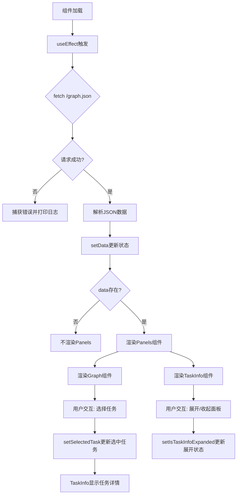
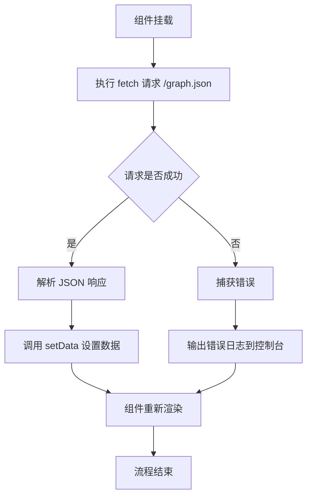
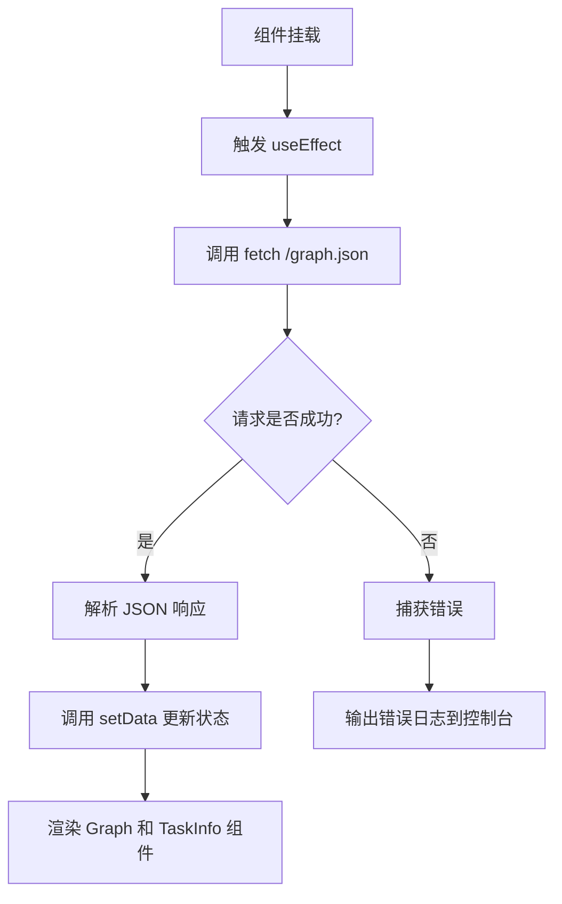
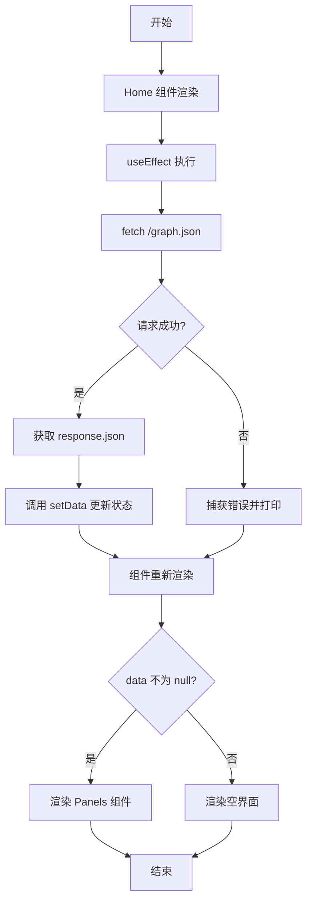
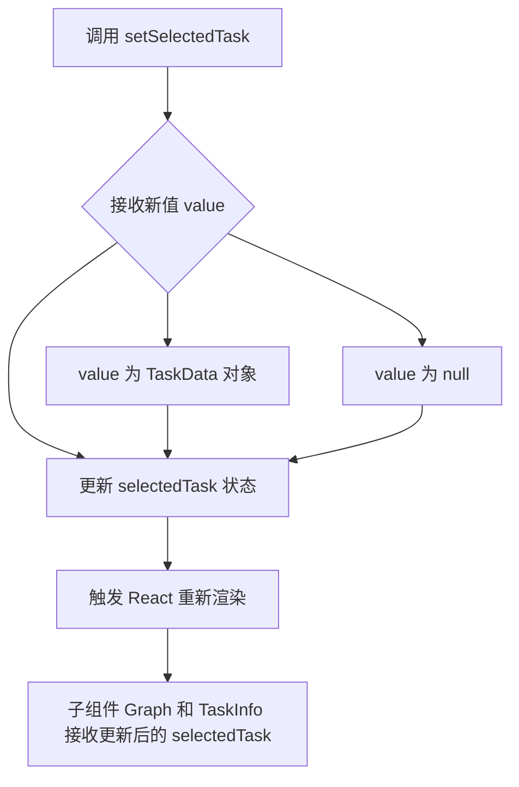
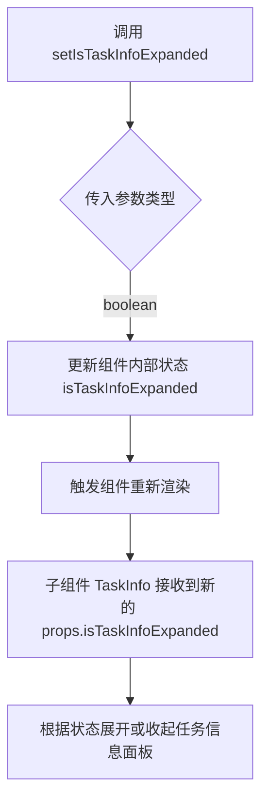
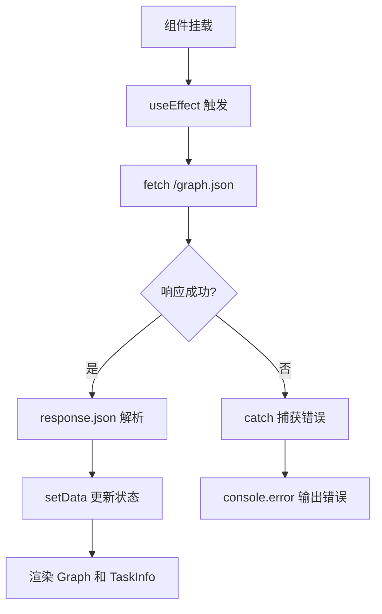
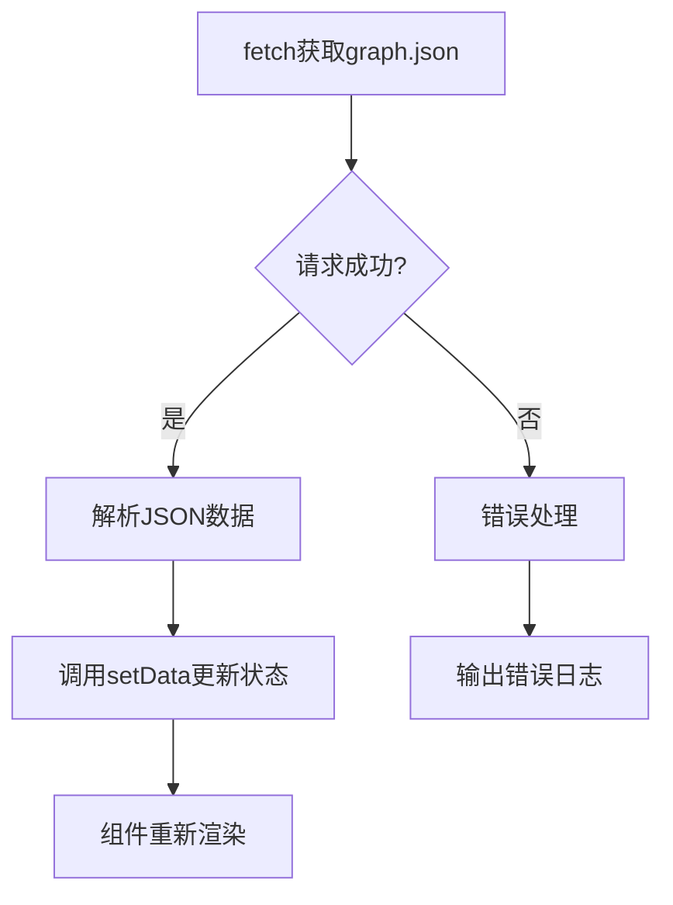
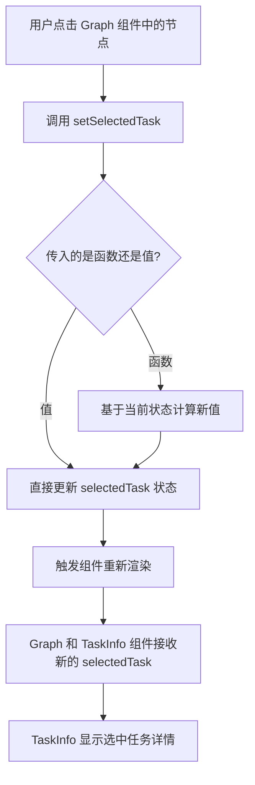
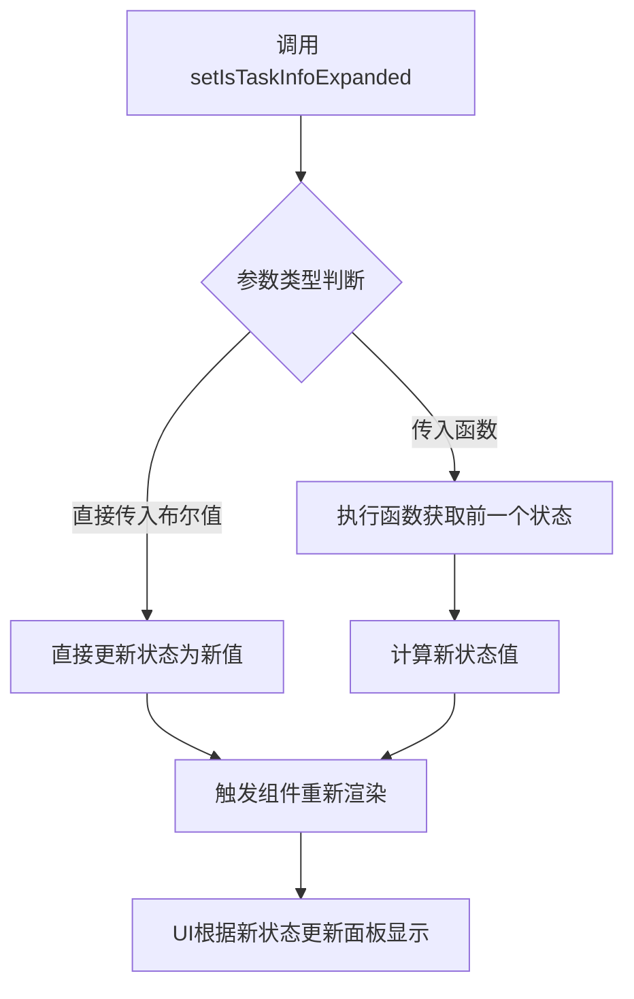

# `.\AutoGPT\classic\benchmark\frontend\src\pages\index.tsx` 详细设计文档

这是一个 Next.js 主页面组件，负责从 public 文件夹加载图数据JSON文件，并渲染两个核心子组件：Graph用于可视化和交互选择任务，TaskInfo用于展示选中任务的详细信息。组件通过 React Hooks 管理数据加载、任务选中状态和面板展开状态。

## 整体流程



## 类结构

```
Home (主页面组件)
├── Head (Next.js SEO头部组件)
├── main (页面主容器)
└── Panels (Tailwind样式面板容器)
    ├── Graph (图可视化组件)
    └── TaskInfo (任务信息展示组件)
```

## 全局变量及字段


### `Home.data`
    
存储从public文件夹加载的图JSON数据的状态

类型：`any (从graph.json加载的图数据对象)`
    


### `Home.selectedTask`
    
当前选中的任务对象，用于在TaskInfo面板中展示详情

类型：`TaskData | null`
    


### `Home.isTaskInfoExpanded`
    
控制任务信息面板是否展开的布尔状态

类型：`boolean`
    
    

## 全局函数及方法


### `Home` 组件中的 `useEffect`

该 `useEffect` 是 React 钩子函数，用于在 `Home` 组件挂载时从 `/graph.json` 文件获取图形数据，并将获取的数据通过 `setData` 状态更新函数存储到组件状态中，同时包含错误处理逻辑。

参数：

- 第一个参数（副作用函数）：`function`，该函数包含获取数据的逻辑，在组件挂载后执行
- 第二个参数（依赖数组）：`React.DependencyList`（空数组 `[]`），表示该 effect 仅在组件首次挂载时执行一次，后续渲染不重复执行

返回值：`void`，该 `useEffect` 没有返回清理函数（cleanup function）

#### 流程图



#### 带注释源码

```javascript
useEffect(() => {
  // 在组件挂载时从 public 文件夹加载 JSON 数据
  // 发起 HTTP GET 请求获取 graph.json 文件
  fetch("/graph.json")
    // 处理响应，将响应体转换为 JSON 格式
    .then((response) => response.json())
    // 数据获取成功后，使用 setData 更新组件状态
    .then((data) => {
      setData(data);
    })
    // 捕获任何在获取或处理数据过程中发生的错误
    .catch((error) => {
      // 将错误信息输出到控制台，便于调试
      console.error("Error fetching the graph data:", error);
    });
}, []); // 空依赖数组确保此 effect 仅在组件挂载时执行一次
```


### `Home` 组件中的数据获取逻辑

该代码片段是 React 函数组件 `Home` 中的数据获取逻辑，位于 `useEffect` 钩子内部，负责在组件挂载时从 `/graph.json` 文件异步加载图数据，并将获取的数据存储到组件状态中。

参数：此函数为匿名回调函数，无显式参数（隐式接收 `useEffect` 的空依赖数组，表示仅在挂载时执行一次）

返回值：`void`（无返回值，通过副作用 `setData` 更新状态）

#### 流程图



#### 带注释源码

```javascript
useEffect(() => {
  // Load the JSON data from the public folder
  fetch("/graph.json")  // 发起 HTTP GET 请求获取 graph.json 文件
    .then((response) => response.json())  // 将响应体解析为 JSON 格式
    .then((data) => {
      setData(data);  // 将解析后的数据存储到 data 状态中，触发组件重新渲染
    })
    .catch((error) => {
      console.error("Error fetching the graph data:", error);  // 捕获并输出任何网络或解析错误
    });
}, []);  // 空依赖数组确保此 effect 仅在组件首次挂载时执行一次
```


### `setData`

`setData` 是 React `useState` hook 返回的状态更新函数，用于更新组件内部的 `data` 状态变量。在数据获取流程中，它将 fetch 请求返回的 JSON 数据更新到组件状态中，从而触发组件重新渲染以显示图表和任务信息。

参数：

-  `value`：`any`（具体类型取决于 `useState` 的泛型参数，这里为 `data` 的类型），要设置的新状态值

返回值：`void`，无返回值

#### 流程图



#### 带注释源码

```javascript
const [data, setData] = useState(null);  // 使用 useState hook 初始化状态，setData 用于更新 data 状态

// ... 在 useEffect 中使用 setData 更新状态
useEffect(() => {
  fetch("/graph.json")
    .then((response) => response.json())
    .then((data) => {
      setData(data);  // 将获取到的 JSON 数据通过 setData 更新到组件状态
    })
    .catch((error) => {
      console.error("Error fetching the graph data:", error);
    });
}, []);

// ... 在 JSX 中使用 data 状态渲染 UI
{data && (
  <Panels>
    <Graph
      graphData={data}
      setSelectedTask={setSelectedTask}
      setIsTaskInfoExpanded={setIsTaskInfoExpanded}
    />
    <TaskInfo
      selectedTask={selectedTask}
      isTaskInfoExpanded={isTaskInfoExpanded}
      setIsTaskInfoExpanded={setIsTaskInfoExpanded}
      setSelectedTask={setSelectedTask}
    />
  </Panels>
)}
```


### `setSelectedTask`

`setSelectedTask` 是 React 组件 `Home` 中的一个状态更新函数，用于更新当前选中的任务数据。该函数由 `useState` hook 生成，接收新的任务数据（`TaskData` 类型或 `null`）作为参数，并触发组件重新渲染。

参数：

- `value`：`TaskData | null`，要设置的新任务数据对象，传入 `TaskData` 对象表示选中某个任务，传入 `null` 表示取消选中任何任务

返回值：`void`，该函数没有返回值，仅用于更新 React 组件的内部状态

#### 流程图



#### 带注释源码

```javascript
// setSelectedTask 是由 useState hook 生成的状态更新函数
// 原型：const [selectedTask, setSelectedTask] = useState<TaskData | null>(null);
const [selectedTask, setSelectedTask] = useState<TaskData | null>(null);

/**
 * 更新选中的任务数据
 * @param {TaskData | null} value - 新的任务数据，当传入 null 时表示清除选中状态
 * 
 * 使用示例：
 * // 选中一个任务
 * setSelectedTask({ id: 'task-1', name: 'Task 1', status: 'completed' });
 * 
 * // 清除选中状态
 * setSelectedTask(null);
 */
setSelectedTask(value);
```

---

**使用位置上下文**

该函数在组件中被传递给两个子组件使用：

```javascript
<Graph
  graphData={data}
  setSelectedTask={setSelectedTask}  // 传递给 Graph 组件
  setIsTaskInfoExpanded={setIsTaskInfoExpanded}
/>
<TaskInfo
  selectedTask={selectedTask}
  isTaskInfoExpanded={isTaskInfoExpanded}
  setIsTaskInfoExpanded={setIsTaskInfoExpanded}
  setSelectedTask={setSelectedTask}  // 传递给 TaskInfo 组件
/>
```

**调用来源**

- `Graph` 组件：当用户在图形界面上点击某个节点时调用
- `TaskInfo` 组件：当用户关闭任务信息面板或清除选中时调用


### `setIsTaskInfoExpanded`

该函数是 React 函数组件 `Home` 中使用 `useState` hook 定义的狀態更新函数，用于切换任务信息面板的展开/收起状态。

参数：

- `value`：`boolean`，要设置的任务信息展开状态值（true 为展开，false 为收起）

返回值：`void`，无返回值

#### 流程图



#### 带注释源码

```javascript
// 在 Home 组件内部使用 useState hook 定义状态
const [isTaskInfoExpanded, setIsTaskInfoExpanded] = useState(false);

// setIsTaskInfoExpanded 函数定义（React 自动生成的状态更新函数）
// 参数 value: boolean - 新的展开状态值
// 返回值: void - 无返回值
(value) => {
  // React 内部实现：更新状态变量 isTaskInfoExpanded 的值
  // 这会触发组件重新渲染，UI 会根据新的状态更新显示
}

// 使用示例（在 Graph 组件中调用）：
<Graph
  graphData={data}
  setSelectedTask={setSelectedTask}
  setIsTaskInfoExpanded={setIsTaskInfoExpanded}  // 传递给子组件
/>

// 或在 TaskInfo 组件中调用：
<TaskInfo
  selectedTask={selectedTask}
  isTaskInfoExpanded={isTaskInfoExpanded}
  setIsTaskInfoExpanded={setIsTaskInfoExpanded}
  setSelectedTask={setSelectedTask}
/>
```


### `Home.useEffect`

该方法是 React 组件 `Home` 中的副作用钩子，用于在组件首次渲染（挂载）时从服务器获取图数据（`graph.json`），并在数据获取成功后更新组件状态，若失败则输出错误信息。

参数：

- `effect`：`<anonymous function>`，类型：`Function` (React EffectCallback)，描述：包含具体副作用逻辑（网络请求）的匿名函数。
- `deps`：`<empty array>`，类型：`any[]`，描述：依赖数组。此处为空数组 `[]`，确保该副作用仅在组件挂载时执行一次（模拟类组件的 `componentDidMount`）。

返回值：`void`，`useEffect` 钩子本身无返回值；传入的副作用函数执行后也未返回任何值。

#### 流程图

```mermaid
graph TD
    A[组件挂载] --> B[执行 useEffect]
    B --> C[发起网络请求 fetch /graph.json]
    C --> D{请求是否成功}
    D -- 成功 --> E[解析 JSON 数据]
    E --> F[调用 setData(data) 更新状态]
    F --> G[流程结束]
    D -- 失败 --> H[捕获异常]
    H --> I[控制台输出错误 console.error]
    I --> G
```

#### 带注释源码

```javascript
useEffect(() => {
  // Load the JSON data from the public folder
  fetch("/graph.json")
    .then((response) => response.json()) // 1. 处理响应，将结果解析为 JSON
    .then((data) => {
      // 2. 数据解析成功后，调用 setData 更新组件状态
      setData(data);
    })
    .catch((error) => {
      // 3. 捕获任何网络或解析错误，并在控制台打印
      console.error("Error fetching the graph data:", error);
    });
}, []); // 依赖数组为空，表示该 effect 仅在挂载阶段运行一次
```


### Home.fetch

获取 JSON 数据并更新组件状态

参数：

- 无

返回值：`void`，无返回值（通过 setData 回调更新状态）

#### 流程图



#### 带注释源码

```javascript
useEffect(() => {
  // 组件挂载时触发，获取 public 文件夹中的 JSON 数据
  fetch("/graph.json")
    .then((response) => response.json()) // 将响应解析为 JSON
    .then((data) => {
      setData(data); // 更新 data 状态，触发组件重新渲染
    })
    .catch((error) => {
      console.error("Error fetching the graph data:", error); // 错误处理
    });
}, []); // 空依赖数组，仅在组件挂载时执行一次
```


### `setData`

设置图数据状态，用于更新React组件中的图数据状态变量。

参数：

- `data`：`any`，从服务器获取的图数据JSON对象，用于更新组件状态

返回值：`void`，无返回值，仅用于更新React状态

#### 流程图



#### 带注释源码

```javascript
// 从fetch的then块中获取解析后的数据
.then((data) => {
  // 调用setData更新React状态
  // 这将触发组件重新渲染，并更新Graph组件的graphData属性
  setData(data);
})
```

### 附加信息

在React函数组件中，`setData`是从`useState` hook返回的状态更新函数。它不是类方法，而是函数组件内部的闭包函数。该函数用于将获取到的图数据存储到组件状态中，从而触发UI更新以显示图数据。


### `Home.setSelectedTask`

该函数是 React `useState` hook 返回的状态更新函数，用于设置当前选中的任务数据。当用户点击图形节点时，会触发此函数将选中的任务信息保存到组件状态中，从而驱动 TaskInfo 组件显示相应的任务详情。

参数：

- `value`：`TaskData | null | ((prev: TaskData | null) => TaskData | null)`，要设置的任务数据对象，或取消选中时传入 `null`，也可传入函数基于前一状态计算新状态

返回值：`void`，无返回值（React setState 函数的典型特征）

#### 流程图



#### 带注释源码

```tsx
const Home = () => {
  // 使用 useState hook 管理选中任务的状态
  // selectedTask: 当前选中的任务数据
  // setSelectedTask: 状态更新函数，用于修改选中任务
  const [selectedTask, setSelectedTask] = useState<TaskData | null>(null);
  
  // ... 其他状态和逻辑
  
  return (
    // 将 setSelectedTask 作为 props 传递给 Graph 组件
    // 当用户在图形中点击节点时，Graph 组件会调用此函数更新状态
    <Graph
      graphData={data}
      setSelectedTask={setSelectedTask}
      setIsTaskInfoExpanded={setIsTaskInfoExpanded}
    />
    // 同时也传递给 TaskInfo 组件，用于清除选中状态
    <TaskInfo
      selectedTask={selectedTask}
      isTaskInfoExpanded={isTaskInfoExpanded}
      setIsTaskInfoExpanded={setIsTaskInfoExpanded}
      setSelectedTask={setSelectedTask}
    />
  );
};
```

#### 使用示例

```tsx
// 方式1: 直接设置任务数据
setSelectedTask({
  id: "task-001",
  name: "Example Task",
  status: "completed"
});

// 方式2: 清除选中状态
setSelectedTask(null);

// 方式3: 基于前一状态计算（函数式更新）
setSelectedTask((prevTask) => {
  if (prevTask?.id === "task-001") {
    return null; // 如果已选中则取消选中
  }
  return newTaskData;
});
```


### `Home.setIsTaskInfoExpanded`

设置面板展开状态的 React 状态更新函数，用于控制任务信息面板的显示与隐藏。

参数：

- `value`：`boolean | ((prevState: boolean) => boolean)`，新的展开状态值或基于前一个状态计算新状态的函数

返回值：`void`，无返回值，仅更新组件内部状态

#### 流程图



#### 带注释源码

```
// 这是从 useState hook 解构出来的状态更新函数
// 第一个元素 isTaskInfoExpanded 是当前状态值
// 第二个元素 setIsTaskInfoExpanded 是更新状态的函数
const [isTaskInfoExpanded, setIsTaskInfoExpanded] = useState(false);

/**
 * 设置任务信息面板的展开状态
 * @param {boolean | ((prevState: boolean) => boolean)} value - 新的展开状态或状态更新函数
 *   - 传入 true 表示展开面板
 *   - 传入 false 表示收起面板
 *   - 传入函数时，函数的参数是当前状态，返回值是新状态
 * @returns {void}
 * 
 * 使用示例：
 * setIsTaskInfoExpanded(true)     // 直接设置为展开
 * setIsTaskInfoExpanded(false)    // 直接设置为收起
 * setIsTaskInfoExpanded(prev => !prev)  // 切换当前状态
 */
```

## 关键组件


### 数据获取与状态管理

负责从服务器加载图数据并管理应用的核心状态，包括图数据、选中的任务和任务信息面板的展开状态。

### 图数据展示组件 (Graph)

接收图数据和管理状态的方法，渲染可视化图形并处理用户交互。

### 任务信息展示组件 (TaskInfo)

根据选中任务显示详细信息，支持面板展开/收起交互，管理任务选中状态。

### 条件渲染与惰性加载

通过数据存在性检查实现组件的惰性加载，确保数据加载完成后再渲染界面，提升用户体验。

### 面板布局组件 (Panels)

使用Tailwind CSS样式化的Flex容器，协调Graph和TaskInfo组件的布局展示。


## 问题及建议


### 已知问题

-   **缺少加载状态 UI**：在数据加载过程中没有向用户展示任何加载指示器或提示，用户界面会出现短暂的空白期
-   **错误处理不完善**：仅通过 `console.error` 记录错误，未向用户展示友好的错误提示信息，且未设置错误状态供组件使用
-   **数据类型安全缺失**：fetch 返回的 JSON 数据未定义类型（隐式 any），缺乏 TypeScript 类型检查保护
-   **数据缺乏验证**：从 `/graph.json` 获取的数据没有进行 Schema 验证，直接传递给子组件使用
-   **状态派生逻辑重复**：`selectedTask` 和 `isTaskInfoExpanded` 状态分散管理，逻辑上有耦合但未整合
-   **样式方案运行时开销**：`tailwind-styled-components` 相比纯 Tailwind CSS 存在额外的运行时开销

### 优化建议

-   添加 `isLoading` 和 `error` 状态，并在 UI 中渲染对应的加载指示器和错误提示组件
-   为 fetch 返回数据定义接口类型，例如 `interface GraphData { ... }`，并在使用前进行类型守卫检查
-   引入 Zod 或 Joi 等库对外部 JSON 数据进行 Schema 验证，确保数据符合预期格式后再使用
-   考虑将 `Panels` 组件改为纯 Tailwind className 方式，减少 styled-components 包裹带来的性能开销
-   将数据获取逻辑提取为自定义 Hook（如 `useGraphData`），实现关注点分离和逻辑复用
-   使用 `React.memo` 对 `Graph` 和 `TaskInfo` 组件进行包装，避免不必要的重渲染
-   将 API 路径提取为配置常量或环境变量，便于不同环境的灵活配置


## 其它


### 设计目标与约束

本页面是一个Next.js应用的主页面，核心设计目标是加载并可视化展示图数据（graph.json），同时支持用户选择任务并查看详细信息。技术栈约束：React 18+、Next.js、TypeScript、Tailwind CSS。必须使用客户端渲染（默认Next.js页面为服务端渲染，但此页面主要使用客户端状态）。

### 错误处理与异常设计

代码中通过fetch的catch块捕获网络错误，仅输出console.error。当数据加载失败时，页面不会渲染Graph和TaskInfo组件。异常设计建议：增加用户友好的错误提示UI、添加重试机制、考虑超时处理。

### 数据流与状态机

数据流为：graph.json → fetch → setData → 渲染Panels → Graph组件接收graphData → 用户交互Graph → setSelectedTask/setIsTaskInfoExpanded → TaskInfo组件更新。状态机：初始状态(data=null, selectedTask=null, isTaskInfoExpanded=false) → 加载中 → 加载完成(data有值) → 用户选中任务 → 展开TaskInfo。

### 外部依赖与接口契约

外部依赖：/graph.json（GET请求，返回JSON格式的图数据）、Graph组件、TaskInfo组件、TaskData类型。接口契约：graph.json需包含图数据结构和节点信息；TaskData类型需包含任务相关字段；Graph组件props包含graphData、setSelectedTask、setIsTaskInfoExpanded；TaskInfo组件props包含selectedTask、isTaskInfoExpanded、setIsTaskInfoExpanded、setSelectedTask。

### 性能考虑

当前代码在数据加载完成前不渲染任何内容，这是合理的。但建议：添加loading状态展示加载指示器、考虑使用React.memo优化Graph和TaskInfo组件、使用Suspense处理异步数据、考虑数据缓存策略。

### 安全考虑

当前代码直接从/public目录加载JSON文件，无用户输入验证。但建议：对fetch请求添加错误处理、对返回数据进行类型检查和schema验证、考虑CORS策略、如果数据来自用户输入需进行XSS防护。

### 可访问性

当前代码缺少可访问性支持。建议：为交互元素添加aria-label、为Graph和TaskInfo添加适当的语义化标签、为加载状态添加aria-live、为错误状态添加alert角色。

### 浏览器兼容性

Next.js默认支持现代浏览器。如需支持旧版浏览器，需配置babel预设。Tailwind CSS需配置postcss和autoprefixer。

### SEO考虑

代码中包含Head组件，设置title为"agbenchmark"、meta description为"The best way to evaluate your agents"、favicon引用。建议：增加og标签、完善meta信息、考虑服务端渲染Graph内容（如果SEO重要）。

### 测试策略

建议测试场景：数据加载成功时的渲染、数据加载失败时的错误处理、状态更新逻辑、组件props传递、fetch请求的mock测试。

### 部署配置

需将graph.json放置在public目录下。Next.js默认配置即可，无需特殊环境变量。如需部署到Vercel或其他平台，需确保public文件夹包含在构建输出中。

### 代码规范与项目结构

建议：抽取常量（如API路径）、抽取Types到独立文件、考虑将fetch逻辑移至自定义Hook（如useGraphData）、将Tailwind组件Panels移至单独文件、添加PropTypes或TypeScript完整类型定义。


    