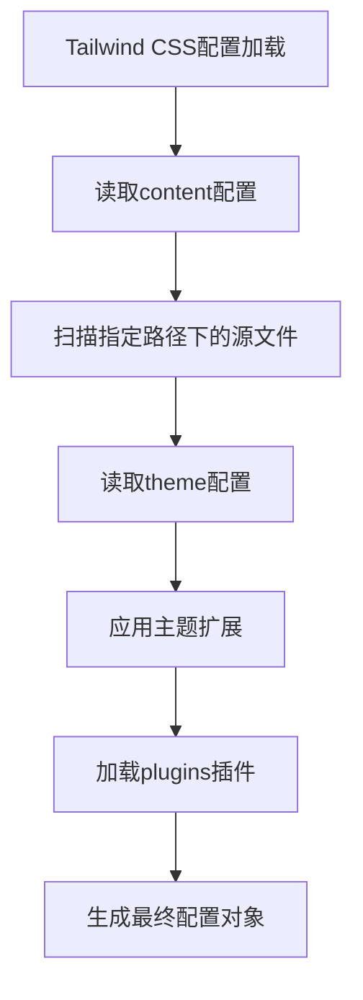

# `.\AutoGPT\classic\benchmark\frontend\tailwind.config.ts` 详细设计文档

这是一个Tailwind CSS框架的配置文件，定义了项目的内容扫描范围、主题扩展和插件集合，用于定制化Tailwind CSS的构建行为。

## 整体流程



## 类结构

```
Config (TypeScript类型定义)
└── 配置对象字面量
    ├── content (内容扫描配置)
    ├── theme (主题配置)
    │   └── extend (扩展配置)
    └── plugins (插件配置)
```

## 全局变量及字段


    

## 全局函数及方法


## 关键组件


### content 配置

指定 Tailwind CSS 扫描的文件路径模式，用于确定哪些文件包含需要处理的类名

### theme 配置

定义设计系统的设计 token，包括颜色、字体、间距等，默认值为空对象表示使用 Tailwind 内置主题

### plugins 配置

用于注册 Tailwind 插件以扩展功能，当前为空数组表示未使用任何插件

### Config 类型

TypeScript 类型定义，确保配置对象的结构符合 Tailwind CSS 要求的规范


## 问题及建议


### 已知问题

- **content 配置模式过于宽泛**：`./src/**/*.{js,ts,jsx,tsx}` 会扫描所有 JS/TS 文件，可能包含 node_modules、测试文件或不相关的文件，增加构建时的扫描开销
- **空配置结构冗余**：theme.extend 为空对象 {}，plugins 为空数组 []，这些空结构可以完全移除
- **缺乏环境差异化配置**：开发环境与生产环境使用相同配置，无法针对不同环境进行优化（如生产环境可缩小 content 扫描范围）
- **缺少 safelist 配置**：如果代码中存在动态拼接的 class 名称，Tailwind 可能无法扫描到，导致样式丢失
- **未配置 darkMode**：未指定暗色模式的实现方式，后续添加暗色功能时可能需要重构
- **无 prefix 配置**：未设置 prefix 前缀，无法避免与第三方库的类名冲突
- **缺少配置注释**：配置文件缺乏必要的注释说明，难以快速理解各配置项的用途

### 优化建议

- **优化 content 扫描范围**：改为更精确的模式，如 `['./src/**/*.{js,ts,jsx,tsx}', '!src/**/*.test.{js,ts}']`，排除测试文件
- **移除空配置结构**：删除空的 theme.extend 和 plugins（空数组可省略）
- **添加 safelist**：根据实际需求配置 safelist 防止动态类名丢失
- **明确 darkMode 配置**：如 `darkMode: 'class'` 或 `darkMode: 'media'`
- **考虑 prefix**：如项目中有冲突风险，添加 `prefix: 'tw-'` 等前缀
- **添加注释**：为关键配置项添加注释说明用途
- **分离环境配置**：使用 `tailwind.config.js` 结合环境变量或创建 `tailwind.config.prod.js` 等变体


## 其它


### 设计目标与约束

本配置文件的核心设计目标是定义 Tailwind CSS 的内容扫描范围、主题扩展能力和插件集成机制。约束条件包括：1) 仅支持 JavaScript 和 TypeScript 源文件；2) 主题扩展保持空对象，禁用自定义主题；3) 无插件集成需求。

### 错误处理与异常设计

该配置文件主要依赖 TypeScript 的类型检查机制。通过 `satisfies Config` 语法，在编译阶段验证配置对象的结构是否符合 Tailwind CSS 的 Config 类型定义。若配置不符合规范，IDE 和 TypeScript 编译器将报错。运行时不存在错误处理逻辑，因为该文件仅作为静态配置导出，不包含业务逻辑。

### 外部依赖与接口契约

主要外部依赖为 `tailwindcss` 包及其类型定义。接口契约方面，该文件导出符合 `Config` 类型定义的对象。导入方（如 PostCSS 配置、Tailwind CLI 或构建工具）期望获得包含 `content`、`theme` 和 `plugins` 属性的配置对象。

### 版本兼容性说明

当前配置基于 Tailwind CSS v3.x 架构设计。若升级到 v4.x，需注意版本间的配置格式差异。v4 引入了基于 CSS 的配置方式，可能需要对现有配置文件进行迁移。

### 性能考量

内容扫描路径 `"./src/**/*.{js,ts,jsx,tsx}"` 覆盖了 src 目录下所有源文件。在大型项目中，应考虑：1) 排除 node_modules 和构建产物目录以减少扫描时间；2) 对扫描路径进行精细化配置，避免不必要的文件解析。

### 可扩展性分析

当前配置具备良好的可扩展性：1) `theme.extend` 为空对象，便于后续添加自定义主题变量；2) `plugins` 数组支持按需引入第三方插件；3) `content` 数组可扩展多个路径模式以适应项目结构变化。

### 技术债务与优化建议

当前配置存在以下潜在技术债务：1) 未指定 Tailwind CSS 版本，可能导致与项目实际使用的版本不匹配；2) 内容扫描路径未排除测试文件和故事书文件，可能引入不必要的样式；3) 缺少自定义设计令牌，当前使用 Tailwind 默认设计系统。建议：添加注释说明适用的 Tailwind 版本；考虑添加 content 路径排除规则；根据项目品牌规范扩展 theme 配置。

    