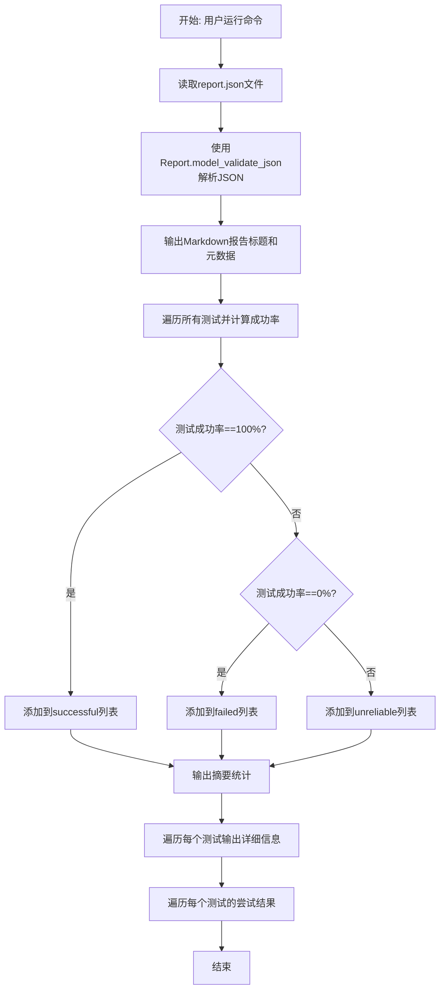
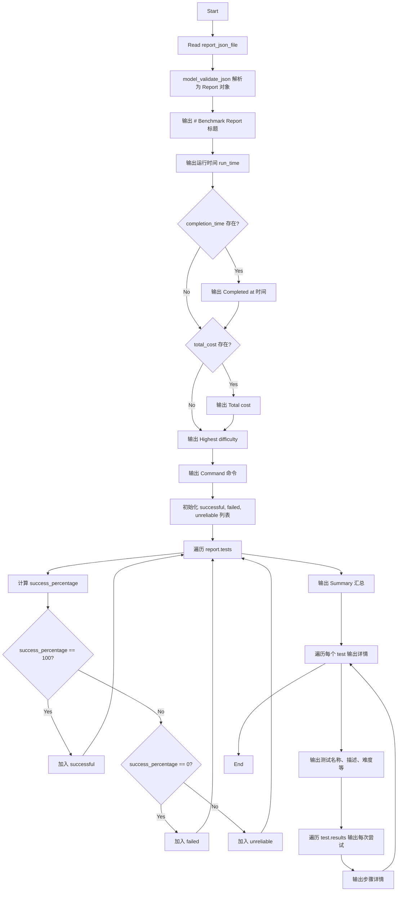
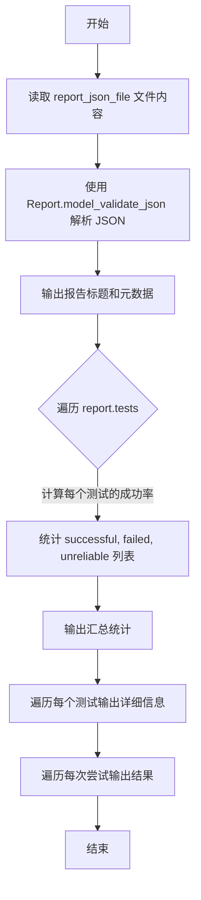

# `.\AutoGPT\classic\benchmark\reports\format.py` 详细设计文档

A CLI tool that generates a formatted Markdown report from a JSON report file, displaying benchmark results including run time, costs, difficulty, test success rates, and detailed attempt information with steps.

## 整体流程



## 类结构

```
模块: print_markdown_report.py
├── 全局函数: indent() - 文本缩进辅助函数
└── 全局函数: quantify() - 复数形式辅助函数
```

## 全局变量及字段


    

## 全局函数及方法


### `print_markdown_report`

该函数是 Click 命令行工具，用于将 report.json 文件解析为 Report 对象，并生成格式化的 Markdown 报告输出到标准输出。报告包含基准测试的运行时间、成本、最高难度、命令信息，以及所有测试的通过/失败/不稳定状态的汇总和详细结果。

参数：

- `report_json_file`：`Path`，report.json 文件的路径

返回值：`None`，该函数通过 `click.echo()` 将 Markdown 报告输出到标准输出，而非返回字符串（与文档字符串描述存在不一致）

#### 流程图



#### 带注释源码

```python
#!/usr/bin/env python3
# 导入标准库和第三方库
from pathlib import Path  # 用于处理文件路径

import click  # 用于构建命令行界面

# 从本地模块导入 Report 数据模型
from agbenchmark.reports.processing.report_types import Report


@click.command()
# 定义命令行参数：report_json_file，必须存在且不能是目录
@click.argument(
    "report_json_file", type=click.Path(exists=True, dir_okay=False, path_type=Path)
)
def print_markdown_report(report_json_file: Path):
    """
    Generates a Markdown report from a given report.json file.

    :param report_json_file: Path to the report.json file.
    :return: A string containing the Markdown formatted report.
    """
    # 读取 JSON 文件内容并解析为 Report 模型对象
    report = Report.model_validate_json(report_json_file.read_text())

    # ===== Header and metadata 部分 =====
    # 输出报告标题
    click.echo("# Benchmark Report")
    # 输出运行时间
    click.echo(f"- ⌛ **Run time:** `{report.metrics.run_time}`")
    # 输出开始时间（格式化：替换 T 为 ` `）
    click.echo(
        f"  - **Started at:** `{report.benchmark_start_time[:16].replace('T', '` `')}`"
    )
    # 如果有完成时间则输出
    if report.completion_time:
        click.echo(
            f"  - **Completed at:** `{report.completion_time[:16].replace('T', '` `')}`"
        )
    # 如果有总成本则输出（保留两位小数）
    if report.metrics.total_cost:
        click.echo(f"- 💸 **Total cost:** `${round(report.metrics.total_cost, 2)}`")
    # 输出最高难度
    click.echo(
        f"- 🏅 **Highest achieved difficulty:** `{report.metrics.highest_difficulty}`"
    )
    # 输出执行的命令
    click.echo(f"- ⚙️ **Command:** `{report.command}`")

    click.echo()  # spacing 空行

    # ===== Aggregate information 聚合信息 =====
    # 初始化三个分类列表
    successful, failed, unreliable = [], [], []
    # 遍历所有测试
    for test in report.tests.values():
        # 如果 success_percentage 为 None，则从 results 计算
        test.metrics.success_percentage = (
            rsp
            if (rsp := test.metrics.success_percentage) is not None
            else sum(float(r.success or 0) for r in test.results)
            * 100
            / len(test.results)
        )
        # 根据成功率分类到对应列表
        if test.metrics.success_percentage == 100.0:
            successful.append(test)
        elif test.metrics.success_percentage == 0.0:
            failed.append(test)
        else:
            unreliable.append(test)

    # ===== Summary 汇总部分 =====
    click.echo("## Summary")
    # 输出通过的测试数量和 emoji
    click.echo(f"- **`{len(successful)}` passed** {'✅'*len(successful)}")
    # 输出失败的测试数量和 emoji
    click.echo(f"- **`{len(failed)}` failed** {'❌'*len(failed)}")
    # 输出不稳定的测试数量和 emoji
    click.echo(f"- **`{len(unreliable)}` unreliable** {'⚠️'*len(unreliable)}")

    click.echo()  # spacing 空行

    # ===== Test results 测试结果部分 =====
    click.echo("## Challenges")
    # 遍历每个测试输出详细信息
    for test_name, test in report.tests.items():
        click.echo()  # spacing 空行

        # 根据成功率确定结果指示器 emoji
        result_indicator = (
            "✅"
            if test.metrics.success_percentage == 100.0
            else "⚠️"
            if test.metrics.success_percentage > 0
            else "❌"
        )
        # 输出测试标题（包含结果指示器或未尝试指示器）
        click.echo(
            f"### {test_name} {result_indicator if test.metrics.attempted else '❔'}"
        )
        # 输出测试描述
        click.echo(f"{test.description}")

        click.echo()  # spacing 空行

        # 输出测试尝试状态
        click.echo(f"- **Attempted:** {'Yes 👍' if test.metrics.attempted else 'No 👎'}")
        # 输出成功率（成功数/总数）
        click.echo(
            f"- **Success rate:** {round(test.metrics.success_percentage)}% "
            f"({len([r for r in test.results if r.success])}/{len(test.results)})"
        )
        # 输出难度
        click.echo(f"- **Difficulty:** `{test.difficulty}`")
        # 输出分类标签
        click.echo(f"- **Categories:** `{'`, `'.join(test.category)}`")
        # 输出可展开的任务和参考答案详情
        click.echo(
            f"<details>\n<summary><strong>Task</strong> (click to expand)</summary>\n\n"
            f"{indent('> ', test.task)}\n\n"
            f"Reference answer:\n{indent('> ', test.answer)}\n"
            "</details>"
        )

        click.echo()  # spacing 空行

        # ===== Attempts 每次尝试的详细结果 =====
        click.echo("\n#### Attempts")
        # 遍历每次尝试输出详情
        for i, attempt in enumerate(test.results, 1):
            # 输出尝试序号、通过/失败状态、运行时间、步数
            click.echo(
                f"\n{i}. **{'✅ Passed' if attempt.success else '❌ Failed'}** "
                f"in **{attempt.run_time}** "
                f"and **{quantify('step', attempt.n_steps)}**\n"
            )
            # 如果有成本则输出
            if attempt.cost is not None:
                click.echo(f"   - **Cost:** `${round(attempt.cost, 3)}`")
            # 如果有失败原因则输出
            if attempt.fail_reason:
                click.echo(
                    "   - **Failure reason:**\n"
                    + indent("      > ", attempt.fail_reason)
                    + "\n"
                )
            # 如果有步骤详情则输出（可展开的 details 块）
            if attempt.steps:
                click.echo(
                    indent(
                        3 * " ",
                        "<details>\n<summary><strong>Steps</strong></summary>\n",
                    )
                )
                # 遍历每个步骤输出
                for j, step in enumerate(attempt.steps, 1):
                    click.echo()
                    click.echo(
                        indent(3 * " ", f"{j}. {indent(3*' ', step.output, False)}")
                    )
                click.echo("\n</details>")


def indent(indent: str, text: str, prefix_indent: bool = True) -> str:
    """
    为文本添加缩进包装

    :param indent: 缩进字符串
    :param text: 要缩进的文本
    :param prefix_indent: 是否在文本前添加缩进
    :return: 缩进后的文本
    """
    return (indent if prefix_indent else "") + text.replace("\n", "\n" + indent)


def quantify(noun: str, count: int, plural_suffix: str = "s") -> str:
    """
    根据数量生成可数名词字符串

    :param noun: 名词单数形式
    :param count: 数量
    :param plural_suffix: 复数后缀，默认为 's'
    :return: 格式化的可数名词字符串
    """
    if count == 1:
        return f"{count} {noun}"
    return f"{count} {noun}{plural_suffix}"


if __name__ == "__main__":
    print_markdown_report()
```


### `print_markdown_report`

该函数是命令行入口，接收一个 report.json 文件路径，解析其中的报告数据，并以 Markdown 格式输出基准测试的运行时间、成本、最高难度、测试结果统计以及每个测试的详细信息（任务、答案、尝试次数、步骤等）。

参数：

- `report_json_file`：`Path`，报告 JSON 文件的路径，由 Click 框架提供

返回值：`None`，该函数通过 `click.echo` 直接输出内容，不返回数值

#### 流程图



#### 带注释源码

```python
#!/usr/bin/env python3
# 导入必要的标准库和第三方库
from pathlib import Path  # 用于处理文件路径

import click  # 用于创建命令行接口

# 从本地模块导入 Report 数据模型
from agbenchmark.reports.processing.report_types import Report


@click.command()
# 定义命令行参数：report_json_file，必须存在且为文件
@click.argument(
    "report_json_file", type=click.Path(exists=True, dir_okay=False, path_type=Path)
)
def print_markdown_report(report_json_file: Path):
    """
    Generates a Markdown report from a given report.json file.

    :param report_json_file: Path to the report.json file.
    :return: A string containing the Markdown formatted report.
    """
    # 读取 JSON 文件内容并解析为 Report 对象
    report = Report.model_validate_json(report_json_file.read_text())

    # ========== 报告头部和元数据 ==========
    click.echo("# Benchmark Report")  # 输出标题
    click.echo(f"- ⌛ **Run time:** `{report.metrics.run_time}`")  # 运行时间
    click.echo(
        f"  - **Started at:** `{report.benchmark_start_time[:16].replace('T', '` `')}`"
    )
    # 如果有完成时间则输出
    if report.completion_time:
        click.echo(
            f"  - **Completed at:** `{report.completion_time[:16].replace('T', '` `')}`"
        )
    # 如果有成本则输出
    if report.metrics.total_cost:
        click.echo(f"- 💸 **Total cost:** `${round(report.metrics.total_cost, 2)}`")
    click.echo(
        f"- 🏅 **Highest achieved difficulty:** `{report.metrics.highest_difficulty}`"
    )
    click.echo(f"- ⚙️ **Command:** `{report.command}`")

    click.echo()  # 空行分隔

    # ========== 聚合统计信息 ==========
    # 初始化三个列表：成功的、失败的、不稳定的测试
    successful, failed, unreliable = [], [], []
    for test in report.tests.values():
        # 计算成功率：如果已存在则使用，否则基于结果计算
        test.metrics.success_percentage = (
            rsp
            if (rsp := test.metrics.success_percentage) is not None
            else sum(float(r.success or 0) for r in test.results)
            * 100
            / len(test.results)
        )
        # 根据成功率分类测试
        if test.metrics.success_percentage == 100.0:
            successful.append(test)
        elif test.metrics.success_percentage == 0.0:
            failed.append(test)
        else:
            unreliable.append(test)

    # ========== 输出汇总部分 ==========
    click.echo("## Summary")
    click.echo(f"- **`{len(successful)}` passed** {'✅'*len(successful)}")
    click.echo(f"- **`{len(failed)}` failed** {'❌'*len(failed)}")
    click.echo(f"- **`{len(unreliable)}` unreliable** {'⚠️'*len(unreliable)}")

    click.echo()  # 空行分隔

    # ========== 输出每个测试的详细信息 ==========
    click.echo("## Challenges")
    for test_name, test in report.tests.items():
        click.echo()  # 空行分隔

        # 根据成功率选择结果指示符
        result_indicator = (
            "✅"
            if test.metrics.success_percentage == 100.0
            else "⚠️"
            if test.metrics.success_percentage > 0
            else "❌"
        )
        # 输出测试名称和状态指示符
        click.echo(
            f"### {test_name} {result_indicator if test.metrics.attempted else '❔'}"
        )
        click.echo(f"{test.description}")  # 测试描述

        click.echo()  # 空行分隔

        # 输出测试的元数据信息
        click.echo(f"- **Attempted:** {'Yes 👍' if test.metrics.attempted else 'No 👎'}")
        click.echo(
            f"- **Success rate:** {round(test.metrics.success_percentage)}% "
            f"({len([r for r in test.results if r.success])}/{len(test.results)})"
        )
        click.echo(f"- **Difficulty:** `{test.difficulty}`")
        click.echo(f"- **Categories:** `{'`, `'.join(test.category)}`")
        # 输出可折叠的任务和参考答案
        click.echo(
            f"<details>\n<summary><strong>Task</strong> (click to expand)</summary>\n\n"
            f"{indent('> ', test.task)}\n\n"
            f"Reference answer:\n{indent('> ', test.answer)}\n"
            "</details>"
        )

        click.echo()  # 空行分隔

        # ========== 输出每次尝试的详细信息 ==========
        click.echo("\n#### Attempts")
        for i, attempt in enumerate(test.results, 1):
            # 输出尝试编号、状态、运行时间、步数
            click.echo(
                f"\n{i}. **{'✅ Passed' if attempt.success else '❌ Failed'}** "
                f"in **{attempt.run_time}** "
                f"and **{quantify('step', attempt.n_steps)}**\n"
            )
            # 如果有成本则输出
            if attempt.cost is not None:
                click.echo(f"   - **Cost:** `${round(attempt.cost, 3)}`")
            # 如果有失败原因则输出
            if attempt.fail_reason:
                click.echo(
                    "   - **Failure reason:**\n"
                    + indent("      > ", attempt.fail_reason)
                    + "\n"
                )
            # 如果有步骤则输出可折叠的步骤详情
            if attempt.steps:
                click.echo(
                    indent(
                        3 * " ",
                        "<details>\n<summary><strong>Steps</strong></summary>\n",
                    )
                )
                for j, step in enumerate(attempt.steps, 1):
                    click.echo()
                    click.echo(
                        indent(3 * " ", f"{j}. {indent(3*' ', step.output, False)}")
                    )
                click.echo("\n</details>")


def indent(indent: str, text: str, prefix_indent: bool = True) -> str:
    """
    对文本进行缩进处理
    
    参数：
    - indent: str，缩进字符串
    - text: str，要缩进的文本
    - prefix_indent: bool，是否在文本前添加缩进
    
    返回值：str，缩进后的文本
    """
    return (indent if prefix_indent else "") + text.replace("\n", "\n" + indent)


def quantify(noun: str, count: int, plural_suffix: str = "s") -> str:
    """
    将可数名词转换为单复数形式
    
    参数：
    - noun: str，名词
    - count: int，数量
    - plural_suffix: str，复数后缀，默认为 's'
    
    返回值：str，例如 "1 step" 或 "3 steps"
    """
    if count == 1:
        return f"{count} {noun}"
    return f"{count} {noun}{plural_suffix}"


if __name__ == "__main__":
    print_markdown_report()
```


### `quantify`

该函数是一个简单的复数形式工具函数，根据数量返回正确的英语单复数表述，例如 "1 step" 或 "5 steps"。

参数：

-  `noun`：`str`，要使用的名词（单数形式）
-  `count`：`int`，数量值
-  `plural_suffix`：`str`，复数后缀（默认为 "s"）

返回值：`str`，包含数量和名词的字符串，根据数量自动处理单复数

#### 流程图

```mermaid
flowchart TD
    A[开始 quantify 函数] --> B{count == 1?}
    B -->|是| C[返回 f"{count} {noun}"]
    B -->|否| D[返回 f"{count} {noun}{plural_suffix}"]
    C --> E[结束]
    D --> E
```

#### 带注释源码

```python
def quantify(noun: str, count: int, plural_suffix: str = "s") -> str:
    """
    根据数量返回正确的英语单复数表述。
    
    参数:
        noun: str - 要使用的名词（单数形式）
        count: int - 数量值
        plural_suffix: str - 复数后缀，默认为 "s"
    
    返回:
        str - 格式化后的字符串，如 "1 step" 或 "5 steps"
    """
    # 如果数量为1，返回单数形式（不加复数后缀）
    if count == 1:
        return f"{count} {noun}"
    
    # 否则，返回复数形式（添加复数后缀）
    return f"{count} {noun}{plural_suffix}"
```

## 关键组件


### 命令行入口与报告生成

该脚本使用 Click 框架创建命令行工具，接收 report.json 文件路径，解析 Report 数据模型，生成格式化的 Markdown 基准测试报告，包含运行时间、成本、难度、测试结果等元数据。

### Report 数据模型验证

使用 Pydantic 的 model_validate_json 方法从 JSON 文件内容反序列化并验证 Report 对象，确保数据结构符合预期的类型和约束。

### 测试结果分类逻辑

遍历所有测试结果，根据 success_percentage 计算并分类到 successful（100%）、failed（0%）或 unreliable（其他）三个列表中，用于生成汇总统计信息。

### Markdown 报告输出

使用 click.echo 输出 Markdown 格式的各个部分：头部元数据、汇总统计、挑战详情（包括任务描述、答案、尝试步骤），并使用 emoji 符号表示状态。

### indent 辅助函数

用于格式化文本缩进，支持在文本每行前添加指定前缀字符串，方便生成 Markdown 引用块和嵌套结构。

### quantify 辅助函数

根据数量返回正确的名词单复数形式，自动处理复数后缀（默认为 "s"），用于生成自然的英文描述如 "1 step" 或 "3 steps"。


## 问题及建议


### 已知问题

- **除零错误风险**：在计算 `success_percentage` 时，如果 `test.results` 为空列表，`len(test.results)` 为 0，会导致 `ZeroDivisionError`
- **缺乏异常处理**：文件读取、JSON 解析、Pydantic 模型验证等操作均未捕获可能的异常，缺乏健壮性
- **魔法数字**：多处使用 `3 * " "` 作为缩进，建议提取为常量
- **字符串拼接效率**：使用多次 `click.echo()` 输出而非一次性构建字符串后再输出，可能影响性能
- **函数参数命名遮蔽**：`indent` 函数参数名与内置函数名 `indent` 可能产生混淆（虽然 Python 3.9+ 无内置）
- **类型注解缺失**：`report` 变量未显式声明类型，降低代码可读性
- **硬编码的时间处理**：`[:16].replace('T', '` `')` 的时间格式化逻辑重复出现

### 优化建议

- 添加空列表检查或使用 `max(len(test.results), 1)` 防止除零错误
- 为文件读取和 JSON 解析操作添加 try-except 异常处理
- 提取 `INDENT = "   "` 常量统一管理缩进
- 考虑将输出内容先构建为字符串列表，最后统一输出
- 为关键变量添加类型注解，如 `report: Report`
- 将时间格式化逻辑提取为独立的辅助函数以提高复用性

## 其它


### 设计目标与约束

该工具的核心设计目标是提供一个命令行接口，将JSON格式的基准测试报告转换为可读的Markdown格式文档。约束条件包括：输入必须是有效的report.json文件路径且文件必须存在；输出通过click.echo直接打印到标准输出；依赖agbenchmark.reports.processing.report_types模块中的Report数据模型进行JSON解析和验证。

### 错误处理与异常设计

代码主要依赖Click框架进行参数验证（exists=True确保文件存在）。Report.model_validate_json方法会抛出验证错误如果JSON格式不正确或缺少必需字段。文件读取操作（read_text）可能抛出IO异常。整体采用静默失败策略，仅在关键位置使用条件判断处理None值（如success_percentage的默认值计算）。

### 数据流与状态机

数据流为：读取JSON文件 → 解析为Report对象 → 遍历tests字典 → 按成功率分类（100%为successful，0%为failed，其余为unreliable）→ 格式化输出Markdown。无复杂状态机，仅根据metrics.attempted和success_percentage两个布尔/数值状态决定输出图标。

### 外部依赖与接口契约

主要依赖包括：click框架提供CLI命令装饰器；pathlib.Path处理文件路径；agbenchmark.reports.processing.report_types.Report作为数据模型入口。接口契约要求输入JSON必须符合Report模型定义的schema，包含metrics、tests、benchmark_start_time等必需字段。

### 安全性考虑

代码安全性较高，主要风险点为：文件路径通过click.Path验证存在性；JSON解析可能存在拒绝服务风险（超大文件）；输出内容未做转义处理，Markdown中的HTML/details标签依赖输入数据格式正确。

### 性能考虑

性能瓶颈主要集中在：读取整个JSON文件到内存；遍历所有测试结果计算成功率时使用了多次列表推导式；每次调用indent和quantify函数均有字符串操作开销。大规模报告（数千测试）时可能存在优化空间。

### 可维护性与扩展性

当前实现硬编码了Markdown输出格式，扩展性受限。indent和quantify为独立工具函数可复用。若需支持多种输出格式（HTML、PDF），建议将渲染逻辑抽象为独立的Formatter类。测试分类逻辑（100%/0%/其他）可通过配置参数化。

### 使用示例

```bash
# 基本用法
python print_markdown_report.py /path/to/report.json

# 输出重定向到文件
python print_markdown_report.py /path/to/report.json > benchmark_report.md
```

### 已知限制

1. 仅支持从文件读取，不支持从stdin或URL读取
2. 输出格式固定为Markdown，不支持自定义模板
3. 错误处理较为基础，异常信息不够友好
4. 未提供选项控制输出详细程度（如是否显示steps）
5. 对Report模型的结构有强依赖，模型变更会导致脚本不可用

    