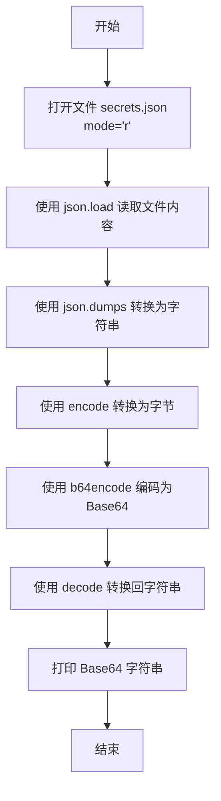
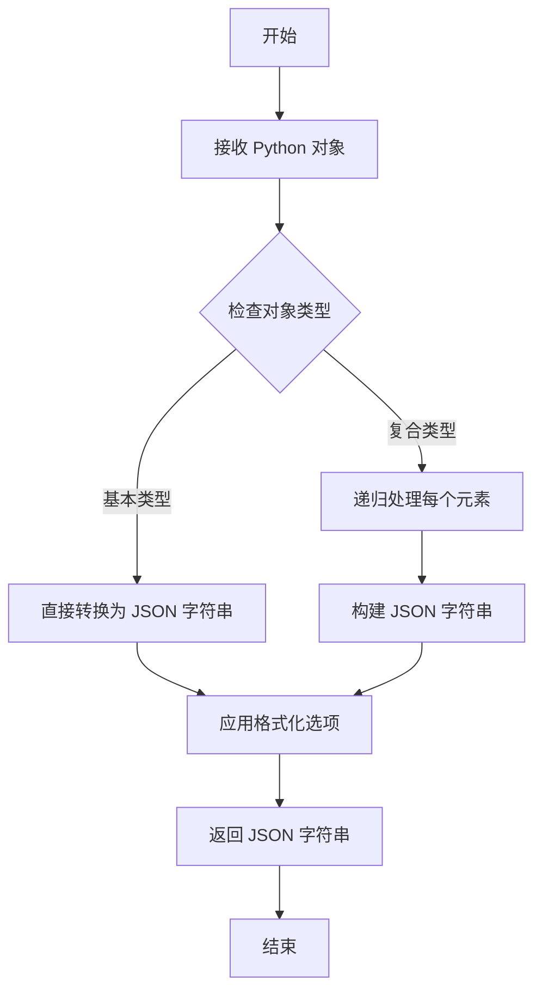
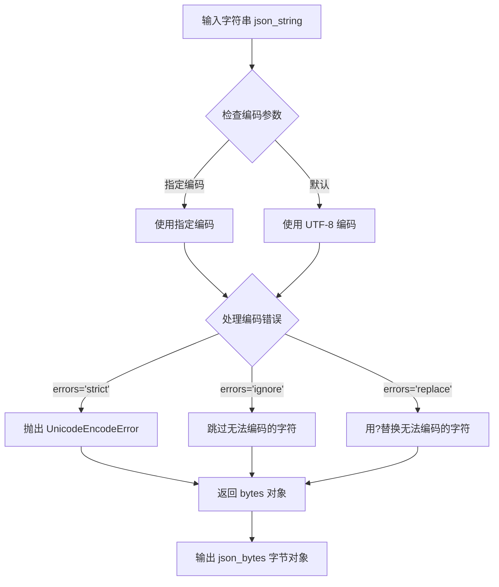
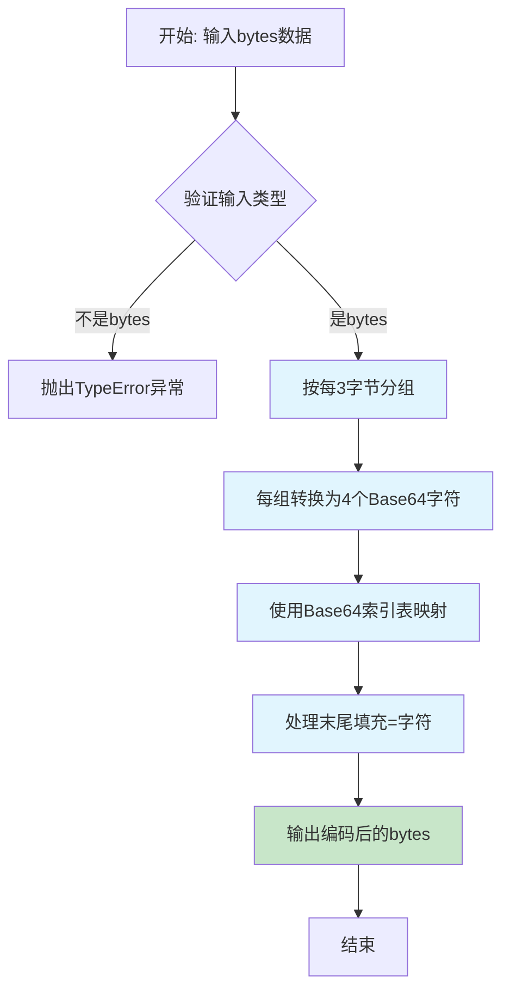
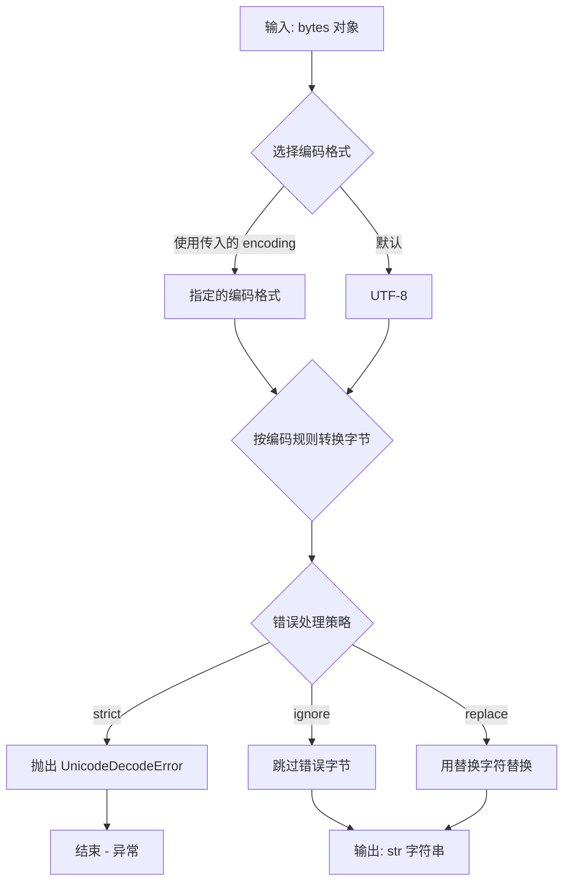

```mermaid
flowchart TD
    A[开始] --> B[接收文件对象 fp]
    B --> C[调用 fp.read&#40;&#41; 读取 JSON 文本]
    C --> D[调用 json.loads&#40;&#41; 解析文本]
    D --> E{解析成功?}
    E -->|是| F[返回 Python 对象]
    E -->|否| G[抛出 JSONDecodeError 异常]
    F --> H[结束]
    G --> H
```

# `.\AutoGPT\classic\benchmark\reports\json_to_base_64.py` 详细设计文档

该脚本从 secrets.json 文件中读取 JSON 配置数据，将其序列化为字符串，编码为 UTF-8 字节，最后转换为 Base64 编码的字符串并输出，用于配置文件的安全传输或存储。

## 整体流程

```mermaid
graph TD
A[开始] --> B[打开 secrets.json 文件]
B --> C[使用 json.load 读取 JSON 数据]
C --> D[使用 json.dumps 将 JSON 对象转换为字符串]
D --> E[使用 encode('utf-8') 将字符串转为字节]
E --> F[使用 base64.b64encode 编码字节]
F --> G[使用 decode('utf-8') 将结果转为字符串]
G --> H[打印 Base64 编码字符串]
H --> I[结束]
```

## 类结构

```
该脚本为扁平结构，无类定义，仅包含模块级代码
```

## 全局变量及字段


### `data`
    
从 secrets.json 读取的原始 JSON 对象

类型：`dict`
    


### `json_string`
    
JSON 对象的字符串表示

类型：`str`
    


### `json_bytes`
    
UTF-8 编码的字节数据

类型：`bytes`
    


### `base64_string`
    
Base64 编码的字符串结果

类型：`str`
    


    

## 全局函数及方法


### `open`

读取 `secrets.json` 文件并将其内容转换为 Base64 编码字符串输出的核心文件打开与处理函数。

参数：

- `file`：`str`，要打开的文件路径，此处为 `"secrets.json"`
- `mode`：`str`，文件打开模式，此处为 `"r"`（只读模式）

返回值：`TextIOWrapper`，返回文件对象，用于后续读取文件内容

#### 流程图



#### 带注释源码

```python
import base64
import json

# 使用 open 函数打开 secrets.json 文件，模式为只读 ('r')
# open 是 Python 内置的文件打开函数，返回一个文件对象
with open("secrets.json", "r") as f:
    # 使用 json.load 读取文件对象中的 JSON 数据
    data = json.load(f)

# 将 Python 对象转换为 JSON 字符串
json_string = json.dumps(data)

# 将字符串编码为 UTF-8 字节
json_bytes = json_string.encode("utf-8")

# 使用 base64 模块将字节编码为 Base64 字符串
base64_string = base64.b64encode(json_bytes).decode("utf-8")

# 打印最终的 Base64 编码结果
print(base64_string)
```


### `json.load`

解析 JSON 文件内容为 Python 对象。该函数是 Python 标准库 `json` 模块的核心函数之一，用于从文件对象中读取 JSON 格式的数据并将其转换为相应的 Python 数据结构（字典、列表、字符串、数字等）。

参数：

- `fp`：`file-like object`，必须是一个具有 `read()` 方法的文件对象，通常通过 `open()` 函数打开文件后获得

返回值：`object`，返回解析后的 Python 对象，通常是字典（dict）或列表（list），具体类型取决于 JSON 数据的结构

#### 流程图



#### 带注释源码

```python
def load(fp, *, cls=None, object_hook=None, parse_float=None,
        parse_int=None, object_pairs_hook=None, **kwds):
    """
    解析 JSON 文件为 Python 对象
    
    参数:
        fp: 文件对象，必须包含 read() 方法
        cls: 可选的 JSON 解析器类（自定义解码器）
        object_hook: 可选函数，用于转换解码后的对象
        parse_float: 可选函数，用于解析浮点数
        parse_int: 可选函数，用于解析整数
        object_pairs_hook: 可选函数，按顺序处理键值对
        **kwds: 传递给 cls 的额外关键字参数
    
    返回:
        解析后的 Python 对象（dict, list, str, int, float, bool, None）
    
    异常:
        JSONDecodeError: 如果 JSON 格式无效
    """
    # 读取整个文件内容
    # 如果 fp 是文本流，会先解码为字符串
    # 返回的是 JSON 格式的字符串
    s = fp.read()
    
    # 调用 loads 将 JSON 字符串解析为 Python 对象
    # 内部实现：
    # 1. 解析器扫描 JSON 字符串
    # 2. 识别token（{, }, [, ], :, , 等）
    # 3. 构建对应的 Python 对象
    #    - {} -> dict
    #    - [] -> list
    #    - string -> str
    #    - number -> int/float
    #    - true -> True
    #    - false -> False
    #    - null -> None
    return loads(s, **kwds)
```

#### 在上下文代码中的使用

```python
import base64
import json

# 使用 json.load 从文件读取 JSON 数据
# 参数：file object (通过 open() 获得)
# 返回值：Python 对象（通常是 dict）
with open("secrets.json", "r") as f:
    data = json.load(f)  # <--- 这里调用 json.load

# 后续处理
json_string = json.dumps(data)
json_bytes = json_string.encode("utf-8")
base64_string = base64.b64encode(json_bytes).decode("utf-8")
print(base64_string)
```

---

## 补充说明

| 项目 | 描述 |
|------|------|
| **设计目标** | 提供一种简单的方式将 JSON 文件内容转换为 Python 可直接操作的数据结构 |
| **约束条件** | 传入的 fp 必须支持 `read()` 方法；JSON 格式必须有效 |
| **错误处理** | 格式错误的 JSON 会抛出 `json.JSONDecodeError`；文件读取错误会抛出 `IOError` 或 `FileNotFoundError` |
| **数据流** | 文件 → 文本流 → JSON 字符串 → Python 对象 |
| **性能考量** | 大文件建议使用 `ijson` 增量解析，避免一次性加载到内存 |
| **安全注意** | 谨慎处理来自不可信来源的 JSON，可能存在拒绝服务攻击风险（解析过深的嵌套结构） |


### `json.dumps`

将 Python 对象序列化为 JSON 字符串，是 Python 标准库中用于将字典、列表等数据结构转换为 JSON 格式字符串的函数。

参数：

- `obj`：`any`，要序列化的 Python 对象（如 dict、list、str、int、float、bool、None）
- `skipkeys`：`bool`，可选，是否跳过非基本类型的键（默认 False）
- `ensure_ascii`：`bool`，可选，是否将非 ASCII 字符转义为 Unicode 转义序列（默认 True）
- `indent`：`int | str`，可选，缩进级别，用于美化输出（默认 None，表示紧凑输出）
- `separators`：`tuple`，可选，分隔符元组（如 (",", ":")）
- `sort_keys`：`bool`，可选，是否按键排序输出（默认 False）

返回值：`str`，返回 JSON 格式的字符串表示

#### 流程图



#### 带注释源码

```python
import json

# 假设有一个 Python 字典对象
data = {"name": "张三", "age": 30, "city": "北京"}

# 使用 json.dumps 将 Python 对象序列化为 JSON 字符串
# 参数说明：
#   - obj: 要序列化的对象（此处为字典）
#   - ensure_ascii=False: 不对中文字符进行 Unicode 转义
#   - indent=4: 使用 4 空格缩进美化输出
#   - sort_keys=True: 按键名排序
json_string = json.dumps(
    data,
    ensure_ascii=False,
    indent=4,
    sort_keys=True
)

print(json_string)
# 输出:
# {
#     "age": 30,
#     "city": "北京",
#     "name": "张三"
# }

# 在实际代码中的完整流程：
# 1. 从文件读取 JSON 数据（反序列化）
with open("secrets.json", "r") as f:
    data = json.load(f)

# 2. 将 Python 对象序列化为 JSON 字符串
json_string = json.dumps(data)

# 3. 将字符串编码为 UTF-8 字节
json_bytes = json_string.encode("utf-8")

# 4. 将字节转换为 base64 字符串（用于安全传输）
base64_string = base64.b64encode(json_bytes).decode("utf-8")

print(base64_string)
```


### `str.encode`

该方法是 Python 字符串对象的内置方法，用于将字符串编码为字节序列。在给定的代码中，它将 JSON 字符串转换为 UTF-8 编码的字节对象，是实现 Base64 编码的关键前置步骤。

参数：

- `encoding`：`str`，指定字符编码格式（如 "utf-8"、"utf-16"、"ascii" 等），默认为 'utf-8'
- `errors`：`str`，可选参数，控制编码错误处理策略（'strict'、'ignore'、'replace' 等），默认为 'strict'

返回值：`bytes`，返回编码后的字节对象

#### 流程图



#### 带注释源码

```python
# 假设 json_string 是已经通过 json.dumps() 转换的 JSON 字符串
# 例如：json_string = '{"username": "admin", "password": "123456"}'

# 调用字符串的 encode 方法将字符串编码为字节
# 参数 "utf-8" 指定使用 UTF-8 编码格式
json_bytes = json_string.encode("utf-8")

# 上述代码相当于：
# 1. 将字符串中的每个字符转换为 Unicode 码点
# 2. 根据 UTF-8 编码规则将码点转换为字节序列
# 3. 返回 bytes 类型对象

# 返回值示例：
# 输入: '{"username": "admin"}'
# 输出: b'{"username": "admin"}'  # 类型为 bytes

# 可选的 errors 参数示例：
# json_string.encode("utf-8", errors="ignore")  # 忽略无法编码的字符
# json_string.encode("utf-8", errors="replace") # 用?替换无法编码的字符
```


### `base64.b64encode`

Base64 编码函数，用于将二进制数据转换为 Base64 编码的 ASCII 字符串，是 Python 标准库 base64 模块的核心函数之一。

参数：

-  `s`：`bytes`，需要被编码的二进制数据（字节串）

返回值：`bytes`，返回 Base64 编码后的二进制数据（字节串）

#### 流程图



#### 带注释源码

```python
# base64.b64encode 函数的典型使用示例
# 该函数位于 Python 标准库的 base64 模块中

# 原始字节数据（通常来自文件、网络或加密操作）
json_bytes = json_string.encode("utf-8")

# 调用 base64.b64encode 进行编码
# 输入：任意字节串（bytes类型）
# 输出：编码后的字节串（bytes类型），每3字节数据编码为4个可见字符
base64_bytes = base64.b64encode(json_bytes)

# 转换为UTF-8字符串以便打印或传输
# （注意：b64encode返回的是bytes，需要decode才能得到字符串）
base64_string = base64_bytes.decode("utf-8")
```

#### 完整上下文源码

```python
import base64
import json

# Step 1: 从文件加载 JSON 数据
# ----------------------------------------
with open("secrets.json", "r") as f:
    data = json.load(f)

# Step 2: 将 JSON 对象转换为字符串
# ----------------------------------------
# json.dumps() 将 Python 对象序列化为 JSON 格式字符串
json_string = json.dumps(data)

# Step 3: 将字符串编码为字节
# ----------------------------------------
# .encode("utf-8") 将 Unicode 字符串转换为 UTF-8 字节序列
# 这是 base64.b64encode() 要求的输入类型
json_bytes = json_string.encode("utf-8")

# Step 4: 执行 Base64 编码
# ----------------------------------------
# base64.b64encode() 接受 bytes 类型输入
# 返回 bytes 类型的 Base64 编码结果
# 编码规则：每 3 字节 (24位) -> 4 个 Base64 字符 (6位/字符)
# 如需末尾填充，会添加 1-2 个 '=' 字符
base64_bytes = base64.b64encode(json_bytes)

# Step 5: 将结果解码为字符串
# ----------------------------------------
# b64encode 返回的是 bytes，需要 decode 才能得到可读字符串
base64_string = base64_bytes.decode("utf-8")

# Step 6: 输出结果
# ----------------------------------------
print(base64_string)
```

#### 技术细节说明

| 项目 | 说明 |
|------|------|
| **输入类型** | `bytes` - 必须是字节串类型，字符串需先编码 |
| **输出类型** | `bytes` - 返回的是编码后的字节，非字符串 |
| **编码表** | 使用标准的 Base64 字母表 (A-Z, a-z, 0-9, +, /) |
| **填充** | 输入字节数不是 3 的倍数时，末尾添加 '=' 填充字符 |
| **输出长度** | 公式：`4 * ceil(n / 3)`，其中 n 为输入字节数 |

#### 潜在优化点

1. **内存效率**：对于大文件，可考虑使用流式处理或分块编码
2. **错误处理**：当前代码缺少文件不存在、JSON 解析错误等异常处理
3. **性能**：频繁调用时，可考虑缓存编码结果


### `bytes.decode`

将字节对象（bytes）使用指定编码格式解码为字符串的方法。

参数：

- `encoding`：`str`，目标编码格式，默认为 `"utf-8"`，常用的还有 `"utf-16"`、`"gbk"`、`"ascii"` 等
- `errors`：`str`，编码错误处理策略，默认为 `"strict"`（抛出 UnicodeDecodeError），可选值包括 `"ignore"`（忽略错误字节）、`"replace"`（用 ? 替换）、`"backslashreplace"`（用转义序列替换）

返回值：`str`，解码后的字符串

#### 流程图



#### 带注释源码

```python
# 代码片段位置：base64_string = base64.b64encode(json_bytes).decode("utf-8")
# 这里的 .decode("utf-8") 即为 bytes.decode 方法的调用

# 示例用法说明：
json_bytes = b'{"name": "test", "value": 123}'  # 原始字节数据

# 调用 bytes.decode 方法将字节转换为字符串
decoded_string = json_bytes.decode("utf-8")     # 使用 UTF-8 编码解码
# 结果: '{"name": "test", "value": 123}'

# 使用不同的错误处理策略
decoded_ignore = json_bytes.decode("utf-8", errors="ignore")  # 忽略解码错误
decoded_replace = json_bytes.decode("utf-8", errors="replace") # 用 ? 替换无法解码的字节
```


## 关键组件


### 一段话描述

该代码是一个简单的数据转换工具，其核心功能是将JSON配置文件（secrets.json）的内容读取后，转换为Base64编码的字符串格式，主要用于配置数据的序列化或传输需求。

### 文件的整体运行流程

1. **文件读取阶段**：通过Python的`open()`函数以只读模式打开"secrets.json"文件
2. **JSON解析阶段**：使用`json.load()`将文件内容解析为Python字典对象
3. **字符串转换阶段**：使用`json.dumps()`将字典对象序列化为JSON字符串
4. **字节编码阶段**：使用`encode("utf-8")`将字符串转换为UTF-8字节序列
5. **Base64编码阶段**：使用`base64.b64encode()`将字节序列进行Base64编码
6. **输出阶段**：将最终结果解码为UTF-8字符串并打印

### 类的详细信息

该代码不包含任何类定义，为面向过程式编程风格。

### 全局变量和全局函数

| 名称 | 类型 | 描述 |
|------|------|------|
| data | dict | 从JSON文件加载的原始数据对象 |
| json_string | str | 序列化后的JSON字符串 |
| json_bytes | bytes | UTF-8编码的字节序列 |
| base64_string | str | 最终生成的Base64编码字符串 |
| f | file object | 文件句柄对象 |

### 关键组件信息

### 文件读取组件

负责从本地文件系统读取JSON配置文件，是整个数据处理流程的输入源头。

### JSON解析组件

将文件内容转换为Python可操作的数据结构，支持字典、列表等JSON基本类型。

### 数据序列化组件

将Python对象转换为JSON字符串格式，为后续编码做准备。

### Base64编码组件

将二进制数据转换为ASCII可打印字符格式，便于文本传输或存储。

### 潜在的技术债务或优化空间

1. **缺乏错误处理**：代码未对文件不存在、JSON格式错误、编码异常等情况进行处理
2. **硬编码文件名**：文件名"secrets.json"直接写在代码中，缺乏灵活性
3. **无日志记录**：缺少操作日志，难以追踪执行过程和调试问题
4. **资源未显式关闭**：虽然with语句会自动关闭文件，但缺乏显式的资源管理注释
5. **无配置外部化**：输出目标（print）硬编码，应考虑支持文件输出或返回值

### 其它项目

**设计目标与约束**：将JSON配置文件转换为Base64字符串，适用于配置数据的safe传输或存储场景。

**错误处理与异常设计**：未实现任何异常捕获机制，可能导致程序直接崩溃。

**数据流与状态机**：线性数据流，无状态机设计，流程为：文件 → JSON对象 → JSON字符串 → 字节 → Base64字符串。

**外部依赖与接口契约**：依赖Python标准库（json、base64、io），无第三方依赖；接口为标准输入（文件）和标准输出（打印）。


## 问题及建议


### 已知问题

-   **硬编码文件路径**：文件名 "secrets.json" 被硬编码，缺乏灵活性和可配置性
-   **缺少异常处理**：未处理文件不存在、JSON解析失败等潜在异常，可能导致程序直接崩溃
-   **缺乏日志记录**：没有任何日志输出，无法追踪执行过程和调试问题
-   **无命令行参数支持**：无法通过命令行指定输入文件或其他配置
-   **资源未复用**：读取文件后立即进行多次转换操作，中间变量未有效利用
-   **缺少类型注解**：代码中无类型提示，降低了可读性和IDE支持
-   **无返回值设计**：结果仅打印到控制台，无法被其他模块调用或集成

### 优化建议

-   将文件路径改为可配置的参数，支持命令行参数或配置文件传入
-   添加完善的异常处理机制，捕获 FileNotFoundError、json.JSONDecodeError 等异常
-   引入日志模块（logging），记录关键操作节点和错误信息
-   使用 argparse 或 click 等库实现命令行参数解析
-   添加类型注解（Type Hints），提升代码可维护性
-   将核心功能封装为函数或类，支持单元测试和返回值调用
-   考虑大文件场景，使用流式处理或生成器模式优化内存使用
-   添加配置管理，将敏感信息路径等配置外部化


## 其它


### 设计目标与约束

本代码的主要目标是将JSON配置文件（secrets.json）的内容转换为Base64编码的字符串格式，以便于在不支持直接JSON传输的环境中使用或作为配置注入的中间格式。约束条件包括：输入文件必须为有效的JSON格式文件，文件路径为硬编码的相对路径"secrets.json"，仅支持UTF-8编码处理。

### 错误处理与异常设计

代码缺少显式的错误处理机制，存在以下潜在异常场景需要考虑：文件不存在异常（FileNotFoundError）、JSON解析异常（JSONDecodeError）、文件读取权限异常（PermissionError）、编码异常（UnicodeEncodeError）。建议添加try-except块捕获相应异常并提供有意义的错误提示信息。

### 数据流与状态机

数据流遵循线性转换模式：File Input → JSON Parsing → String Serialization → UTF-8 Encoding → Base64 Encoding → Standard Output。无状态机设计，程序为一次性执行脚本，无状态保持需求。

### 外部依赖与接口契约

本代码依赖Python标准库三个模块：json（JSON解析与序列化）、base64（Base64编码）、builtins（文件操作与print函数）。接口契约要求输入文件secrets.json存在且格式为有效JSON，输出为Base64编码字符串到标准输出，无返回值。

### 安全性考虑

当前代码未包含敏感信息加密或访问控制机制。secrets.json文件名暗示可能包含敏感凭据信息，建议添加文件访问权限检查（建议600权限）、考虑加密存储方案、避免在日志或标准输出中打印敏感信息（当前实现会直接输出内容）。

### 性能考量

对于小型JSON文件（KB级别），当前实现性能可接受。潜在优化方向：流式处理大文件（使用ijson库）、避免中间字符串转换直接操作字节、使用ujson替代标准json库提升解析速度。

### 配置文件说明

当前代码无独立配置文件，所有配置硬编码。secrets.json作为输入数据文件而非配置文件。若需配置化，建议将输入文件名、编码类型等提取为配置参数。

### 测试考虑

建议添加单元测试覆盖：正常JSON文件处理、JSON解析错误场景、文件不存在场景、特殊字符处理（Unicode）、空JSON对象处理、大文件性能基准测试。

### 监控与日志

代码缺少日志记录机制。建议添加logging模块实现分级日志输出（INFO级别记录处理文件、DEBUG级别记录中间状态），便于问题排查和运行监控。

### 部署相关

本脚本适合作为容器ENTRYPOINT或CMD的一部分进行部署。建议添加环境变量支持自定义输入文件路径，添加版本标识输出，便于运维管理。

    