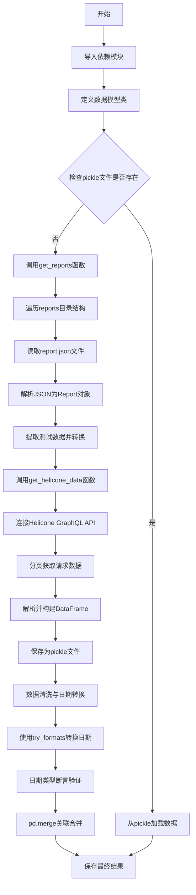
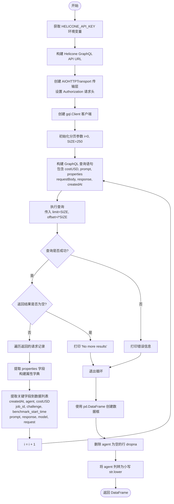
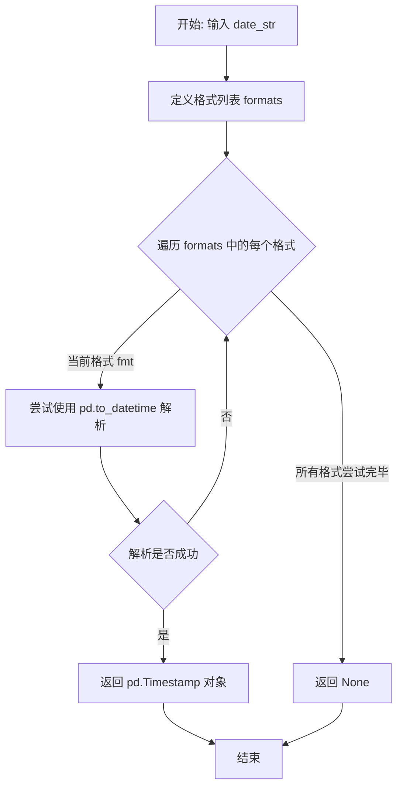

# `.\AutoGPT\classic\benchmark\reports\match_records.py` 详细设计文档

该代码是一个基准测试数据处理脚本，主要功能是从本地reports目录中读取多个AI agent的测试报告（JSON格式），同时从Helicone API获取AI模型调用的成本和使用数据，然后对这两个数据源进行清洗、日期格式转换和关联合并，最终生成一个包含测试结果和成本数据的DataFrame用于后续分析。

## 整体流程



## 类结构

```
数据模型层 (Pydantic BaseModel)
├── Metrics - 单个测试指标
├── MetricsOverall - 总体测试指标
├── Test - 单个测试数据
├── SuiteTest - 套件测试数据
└── Report - 完整报告数据

函数层
├── get_reports - 读取本地报告
├── get_helicone_data - 获取Helicone数据
└── try_formats - 日期格式解析
```

## 全局变量及字段


### `reports_df`
    
存储从本地reports目录读取的测试报告数据

类型：`pd.DataFrame`
    


### `helicone_df`
    
存储从Helicone API获取的请求和响应数据

类型：`pd.DataFrame`
    


### `df`
    
存储reports_df和helicone_df合并后的最终数据集

类型：`pd.DataFrame`
    


### `SIZE`
    
Helicone GraphQL API每次请求返回的记录数

类型：`int`
    


### `url`
    
Helicone GraphQL API的端点URL

类型：`str`
    


### `helicone_api_key`
    
Helicone API认证密钥，从环境变量HELICONE_API_KEY读取

类型：`str`
    


### `Metrics.difficulty`
    
测试难度等级

类型：`str`
    


### `Metrics.success`
    
测试是否成功

类型：`bool`
    


### `Metrics.success_percent`
    
成功百分比(带别名success_%)

类型：`float`
    


### `Metrics.run_time`
    
运行时间

类型：`Optional[str]`
    


### `Metrics.fail_reason`
    
失败原因

类型：`Optional[str]`
    


### `Metrics.attempted`
    
是否尝试

类型：`Optional[bool]`
    


### `MetricsOverall.run_time`
    
总运行时间

类型：`str`
    


### `MetricsOverall.highest_difficulty`
    
最高难度等级

类型：`str`
    


### `MetricsOverall.percentage`
    
成功百分比

类型：`Optional[float]`
    


### `Test.data_path`
    
数据文件路径

类型：`str`
    


### `Test.is_regression`
    
是否为回归测试

类型：`bool`
    


### `Test.answer`
    
正确答案

类型：`str`
    


### `Test.description`
    
测试描述

类型：`str`
    


### `Test.metrics`
    
测试指标

类型：`Metrics`
    


### `Test.category`
    
测试类别

类型：`List[str]`
    


### `Test.task`
    
任务名称

类型：`Optional[str]`
    


### `Test.reached_cutoff`
    
是否达到截止点

类型：`Optional[bool]`
    


### `SuiteTest.data_path`
    
数据文件路径

类型：`str`
    


### `SuiteTest.metrics`
    
总体指标

类型：`MetricsOverall`
    


### `SuiteTest.tests`
    
测试字典

类型：`Dict[str, Test]`
    


### `SuiteTest.category`
    
类别列表

类型：`Optional[List[str]]`
    


### `SuiteTest.task`
    
任务名称

类型：`Optional[str]`
    


### `SuiteTest.reached_cutoff`
    
是否达到截止点

类型：`Optional[bool]`
    


### `Report.command`
    
执行命令

类型：`str`
    


### `Report.completion_time`
    
完成时间

类型：`str`
    


### `Report.benchmark_start_time`
    
基准测试开始时间

类型：`str`
    


### `Report.metrics`
    
总体指标

类型：`MetricsOverall`
    


### `Report.tests`
    
测试字典

类型：`Dict[str, Union[Test, SuiteTest]]`
    


### `Report.config`
    
配置字典

类型：`Dict[str, str | dict[str, str]]`
    
    

## 全局函数及方法


### `get_reports`

该函数扫描reports目录，读取所有agent子目录中的report.json文件，解析JSON数据并根据测试类型（SuiteTest或Test）提取测试指标，最终返回包含所有测试数据的pandas DataFrame。

参数：
- 无参数

返回值：`pd.DataFrame`，返回包含所有测试报告数据的DataFrame，包含agent、benchmark_start_time、challenge、attempted、categories、task、success、difficulty、success_%、run_time、is_regression等字段。

#### 流程图

```mermaid
flowchart TD
    A[开始] --> B[获取当前工作目录]
    B --> C{当前目录是否以reports结尾?}
    C -->|是| D[设置reports_dir为"/"]
    C -->|否| E[设置reports_dir为"reports"]
    D --> F
    E --> F[遍历reports_dir下的所有agent目录]
    F --> G{遍历每个agent目录}
    G --> H{检查是否为目录}
    H -->|否| G
    H -->|是| I[获取agent下所有run目录]
    I --> J[构建每个run目录下的report.json路径]
    J --> K{遍历每个report.json文件}
    K --> L{report.json是否存在?}
    L -->|否| K
    L -->|是| M[打开并读取JSON文件]
    M --> N[使用Report.model_validate验证JSON数据]
    N --> O{遍历report.tests中的每个测试}
    O --> P{测试数据是否为SuiteTest类型?}
    P -->|是| Q{是否有category字段?}
    Q -->|是| R[提取same task测试数据]
    Q -->|否| S[提取separate tasks测试数据]
    P -->|否| T[提取普通Test测试数据]
    R --> U
    S --> U
    T --> U[构建test_json字典]
    U --> V[将test_json添加到report_data列表]
    V --> O
    O --> W{所有测试处理完成?}
    W -->|否| O
    W -->|是| K
    K --> X{所有report文件处理完成?}
    X -->|否| K
    X -->|是| G
    G --> Y{所有agent处理完成?}
    Y -->|否| G
    Y -->|是| Z[将report_data列表转换为DataFrame]
    Z --> AA[返回DataFrame]
```

#### 带注释源码

```python
def get_reports():
    """
    扫描reports目录，读取所有agent的report.json文件，
    解析并返回测试数据DataFrame
    """
    # 初始化一个空列表用于存储报告数据
    report_data = []

    # 获取当前工作目录
    current_dir = os.getcwd()

    # 检查当前目录是否以'reports'结尾
    if current_dir.endswith("reports"):
        # 如果当前已在reports目录，则使用根目录
        reports_dir = "/"
    else:
        # 否则使用相对路径"reports"
        reports_dir = "reports"

    # 遍历reports目录下的所有agent目录
    for agent_name in os.listdir(reports_dir):
        if agent_name is None:
            continue
        # 构建agent目录的完整路径
        agent_dir = os.path.join(reports_dir, agent_name)

        # 检查是否为目录（agent目录）
        if os.path.isdir(agent_dir):
            # 获取agent目录下的所有条目（目录和文件）
            run_dirs = glob.glob(os.path.join(agent_dir, "*"))

            # 为每个run目录构建report.json的路径
            # 仅包含实际为目录的路径
            report_files = [
                os.path.join(run_dir, "report.json")
                for run_dir in run_dirs
                if os.path.isdir(run_dir)
            ]
            
            # 遍历每个report.json文件
            for report_file in report_files:
                # 检查report.json文件是否存在
                if os.path.isfile(report_file):
                    # 打开并读取JSON文件
                    with open(report_file, "r") as f:
                        # 从文件中加载JSON数据
                        json_data = json.load(f)
                        print(f"Processing {report_file}")
                        # 使用Pydantic模型验证JSON数据
                        report = Report.model_validate(json_data)

                        # 遍历报告中的所有测试
                        for test_name, test_data in report.tests.items():
                            # 初始化测试JSON字典，包含agent名称和基准开始时间
                            test_json = {
                                "agent": agent_name.lower(),
                                "benchmark_start_time": report.benchmark_start_time,
                            }

                            # 判断测试数据类型
                            if isinstance(test_data, SuiteTest):
                                # 如果是SuiteTest类型
                                if test_data.category:
                                    # 同一任务测试（same task test）
                                    test_json["challenge"] = test_name
                                    # 从第一个测试中获取attempted状态
                                    test_json["attempted"] = test_data.tests[
                                        list(test_data.tests.keys())[0]
                                    ].metrics.attempted
                                    # 合并categories为字符串
                                    test_json["categories"] = ", ".join(
                                        test_data.category
                                    )
                                    test_json["task"] = test_data.task
                                    test_json["success"] = test_data.metrics.percentage
                                    test_json["difficulty"] = test_data.metrics.highest_difficulty
                                    test_json["success_%"] = test_data.metrics.percentage
                                    test_json["run_time"] = test_data.metrics.run_time
                                    # 从第一个测试获取is_regression标志
                                    test_json["is_regression"] = test_data.tests[
                                        list(test_data.tests.keys())[0]
                                    ].is_regression
                                else:
                                    # 分离任务测试（separate tasks in 1 suite）
                                    for suite_test_name, suite_data in test_data.tests.items():
                                        test_json["challenge"] = suite_test_name
                                        test_json["attempted"] = suite_data.metrics.attempted
                                        test_json["categories"] = ", ".join(suite_data.category)
                                        test_json["task"] = suite_data.task
                                        # 根据成功与否设置成功率为100或0
                                        test_json["success"] = (
                                            100.0 if suite_data.metrics.success else 0
                                        )
                                        test_json["difficulty"] = suite_data.metrics.difficulty
                                        test_json["success_%"] = suite_data.metrics.success_percentage
                                        test_json["run_time"] = suite_data.metrics.run_time
                                        test_json["is_regression"] = suite_data.is_regression
                            else:
                                # 普通Test类型（非SuiteTest）
                                test_json["challenge"] = test_name
                                test_json["attempted"] = test_data.metrics.attempted
                                test_json["categories"] = ", ".join(test_data.category)
                                test_json["task"] = test_data.task
                                test_json["success"] = (
                                    100.0 if test_data.metrics.success else 0
                                )
                                test_json["difficulty"] = test_data.metrics.difficulty
                                test_json["success_%"] = test_data.metrics.success_percentage
                                test_json["run_time"] = test_data.metrics.run_time
                                test_json["is_regression"] = test_data.is_regression

                            # 将测试JSON添加到报告数据列表
                            report_data.append(test_json)

    # 将报告数据列表转换为DataFrame并返回
    return pd.DataFrame(report_data)
```


### `get_helicone_data`

该函数通过连接Helicone GraphQL API，使用分页方式循环获取AI请求的详细数据（包括成本、提示词、响应内容等），并将所有记录整理为pandas DataFrame返回，同时对数据进行清洗（去除agent为空的行并将agent名称统一转为小写）。

参数： 无

返回值：`pd.DataFrame`，返回包含AI请求成本、提示词、响应内容、模型信息等字段的DataFrame

#### 流程图



#### 带注释源码

```python
def get_helicone_data():
    """
    连接 Helicone GraphQL API，分页获取 AI 请求数据，
    返回包含成本、提示、响应等信息的 DataFrame
    """
    
    # 从环境变量获取 Helicone API 密钥
    helicone_api_key = os.getenv("HELICONE_API_KEY")

    # Helicone GraphQL API 端点 URL
    url = "https://www.helicone.ai/api/graphql"
    
    # 创建 AIOHTTP 传输层，携带 Bearer Token 认证头
    transport = AIOHTTPTransport(
        url=url, headers={"authorization": f"Bearer {helicone_api_key}"}
    )

    # 初始化 gql 客户端，开启从传输层获取 schema
    client = Client(transport=transport, fetch_schema_from_transport=True)

    # 每页获取的记录数
    SIZE = 250

    # 分页偏移量计数器
    i = 0

    # 用于存储所有请求数据的列表
    data = []
    print("Fetching data from Helicone")
    
    # 循环分页获取数据
    while True:
        # 构建 GraphQL 查询语句
        # 查询 heliconeRequest 表的字段：
        # - costUSD: 美元成本
        # - prompt: 提示词
        # - properties: 自定义属性列表 (name-value 对)
        # - requestBody: 请求体 (包含 model 等)
        # - response: 响应内容
        # - createdAt: 创建时间
        query = gql(
            """
            query ExampleQuery($limit: Int, $offset: Int){
                heliconeRequest(
                    limit: $limit
                    offset: $offset
                ) {
                    costUSD
                    prompt
                    properties{
                        name
                        value
                    }
                    
                    requestBody
                    response
                    createdAt

                }

                }
        """
        )
        
        # 打印当前获取的记录范围
        print(f"Fetching {i * SIZE} to {(i + 1) * SIZE} records")
        
        try:
            # 执行 GraphQL 查询，传入分页变量
            result = client.execute(
                query, variable_values={"limit": SIZE, "offset": i * SIZE}
            )
        except Exception as e:
            # 捕获异常并打印错误信息
            print(f"Error occurred: {e}")
            result = None

        # 分页计数器递增
        i += 1

        # 如果查询成功且有返回数据
        if result:
            # 遍历每条请求记录
            for item in result["heliconeRequest"]:
                # 将 properties 列表转换为字典
                # 例如: [{"name": "agent", "value": "xxx"}] -> {"agent": "xxx"}
                properties = {
                    prop["name"]: prop["value"] for prop in item["properties"]
                }
                
                # 提取关键字段组成字典并添加到数据列表
                data.append(
                    {
                        "createdAt": item["createdAt"],                          # 创建时间
                        "agent": properties.get("agent"),                        # 代理名称
                        "costUSD": item["costUSD"],                              # 美元成本
                        "job_id": properties.get("job_id"),                      # 任务ID
                        "challenge": properties.get("challenge"),                # 挑战名称
                        "benchmark_start_time": properties.get("benchmark_start_time"),  # 基准开始时间
                        "prompt": item["prompt"],                                # 提示词
                        "response": item["response"],                            # 响应内容
                        "model": item["requestBody"].get("model"),              # 模型名称
                        "request": item["requestBody"].get("messages"),         # 请求消息
                    }
                )

        # 如果结果为空或没有更多数据，退出循环
        if not result or (len(result["heliconeRequest"]) == 0):
            print("No more results")
            break

    # 将数据列表转换为 pandas DataFrame
    df = pd.DataFrame(data)
    
    # 删除 agent 字段为空的行
    df = df.dropna(subset=["agent"])

    # 将 agent 名称转换为小写，保持一致性
    df["agent"] = df["agent"].str.lower()

    # 返回清洗后的 DataFrame
    return df
```


### `try_formats`

该函数用于尝试使用多种预定义的日期时间格式解析输入的日期字符串，如果成功匹配则返回对应的 pandas Timestamp 对象，否则返回 None。

参数：

- `date_str`：`str`，需要解析的日期时间字符串

返回值：`Optional[pd.Timestamp]`，成功解析时返回 `pd.Timestamp` 对象，解析失败时返回 `None`

#### 流程图



#### 带注释源码

```python
def try_formats(date_str):
    """
    尝试用多种日期格式解析日期字符串
    
    参数:
        date_str: 需要解析的日期时间字符串
        
    返回:
        成功解析返回 pd.Timestamp 对象，失败返回 None
    """
    # 定义要尝试的日期时间格式列表
    # 格式1: "%Y-%m-%d-%H:%M" -> 例如 "2023-12-31-23:59"
    # 格式2: "%Y-%m-%dT%H:%M:%S%z" -> 例如 "2023-12-31T23:59:00+0000"
    formats = ["%Y-%m-%d-%H:%M", "%Y-%m-%dT%H:%M:%S%z"]
    
    # 遍历每种格式尝试解析
    for fmt in formats:
        try:
            # 尝试使用当前格式解析日期字符串
            # pd.to_datetime 会根据 format 参数严格解析
            return pd.to_datetime(date_str, format=fmt)
        except ValueError:
            # 如果当前格式解析失败，静默继续尝试下一个格式
            pass
    
    # 所有格式都尝试后仍无法解析，返回 None
    return None
```

## 关键组件


### Pydantic 数据模型

用于定义基准测试报告的数据结构和验证，包括 Metrics、MetricsOverall、Test、SuiteTest 和 Report 五个嵌套模型类，通过 Pydantic BaseModel 实现数据校验和别名处理。

### get_reports() 函数

从本地 reports 目录遍历代理报告文件，解析 JSON 格式的基准测试结果，将不同类型的测试（Test 或 SuiteTest）统一转换为平铺的 DataFrame 结构，包含代理名称、挑战名称、成功率、难度等关键指标。

### get_helicone_data() 函数

通过 GraphQL 查询 Helicon e AI 的 API，使用分页机制批量获取请求数据，提取成本、提示词、响应内容、模型信息及自定义属性，转换为 pandas DataFrame 并进行数据清洗（去除无代理记录、转换为小写）。

### 数据持久化缓存

使用 pickle 格式缓存原始报告数据和 Helicone 数据到本地文件（raw_reports.pkl、raw_helicone.pkl），避免重复网络请求和文件读取，提升脚本重复执行效率。

### 时间格式处理

try_formats() 函数尝试多种日期时间格式（"%Y-%m-%d-%H:%M" 和 "%Y-%m-%dT%H:%M:%S%z"）进行解析，处理不同来源数据的时间格式差异，确保 datetime 类型一致性。

### 数据合并与输出

将 Helicone 数据与本地报告数据通过 benchmark_start_time、agent、challenge 三个键进行内连接合并，最终输出到 df.pkl 文件，形成包含完整基准测试信息的统一数据集。


## 问题及建议


### 已知问题

-   **硬编码路径逻辑**：`get_reports()`函数中使用`if current_dir.endswith("reports")`进行路径判断，这种逻辑脆弱且不可移植
-   **魔法数字**：`SIZE = 250`没有任何解释说明，且作为分页大小可能需要可配置
-   **重复代码**：处理`SuiteTest`和`Test`类型时存在大量重复的字段映射逻辑，违反了DRY原则
-   **类型不安全访问**：使用`list(test_data.tests.keys())[0]`访问字典第一个元素，假设键存在且有序，缺乏健壮性
-   **缺失错误处理**：文件读取、JSON解析、GraphQL请求等关键操作缺少适当的异常捕获和处理
-   **模块级副作用**：主流程代码在模块加载时直接执行（读取pickle或调用API），影响代码的可测试性和可导入性
-   **未使用的导入**：`glob`模块被导入但未实际使用
-   **环境变量无验证**：`HELICONE_API_KEY`直接使用，无存在性检查，缺失时会导致不明确的错误
-   **日期格式僵化**：`try_formats()`仅支持两种固定格式，扩展性差
-   **print调试**：使用`print`语句而非日志框架，不利于生产环境调试
-   **pickle安全风险**：使用`to_pickle`存储数据，pickle存在反序列化安全漏洞，且文件无压缩
-   **GraphQL查询内联**：查询字符串直接写在代码中，无查询名称或变量类型定义
-   **注释代码遗留**：存在大量注释掉的代码（如`old_report_files`等），增加维护负担
-   **缺乏类型提示**：`get_reports()`和`get_helicone_data()`函数缺少返回类型注解

### 优化建议

-   将日期格式列表和分页大小等常量提取为配置模块或环境变量
-   抽取重复的字段映射逻辑为独立方法或使用数据类/函数式转换
-   使用`logging`模块替代print语句，并配置适当的日志级别
-   为环境变量添加检查并提供清晰的错误提示
-   将主流程代码封装在`if __name__ == "__main__":`块中
-   考虑使用`orjson`替代标准json库提升性能，或使用parquet替代pickle提升安全性和互操作性
-   添加类型注解和文档字符串提升代码可读性
-   清理注释掉的代码和使用`ruff`或`black`等工具格式化代码
-   考虑使用`tenacity`等库为GraphQL请求添加重试机制和超时控制

## 其它


### 设计目标与约束

本代码的设计目标是将来自本地报告文件（report.json）和Helicone API的基准测试数据整合成一个统一的DataFrame，以便进行后续的数据分析和可视化。约束条件包括：需要Helicone API密钥、环境变量HELICONE_API_KEY必须设置、本地reports目录结构必须符合特定格式（每个agent目录下包含多个run目录，每个run目录下有report.json文件）。

### 错误处理与异常设计

代码中的错误处理主要体现在以下几个方面：1) get_helicone_data()函数中使用try-except捕获GraphQL查询异常，打印错误信息并将result设为None；2) 使用os.path.exists()检查文件是否存在；3) 使用pd.dropna()处理缺失值；4) 使用try_formats()函数尝试多种日期格式解析；5) 使用assert语句验证数据类型正确性。异常设计相对简单，仅打印错误信息并继续执行，可能需要更完善的错误恢复机制和日志记录。

### 数据流与状态机

数据流主要分为三个阶段：第一阶段是数据获取，包括get_reports()读取本地JSON报告文件和get_helicone_data()调用Helicone GraphQL API获取请求数据；第二阶段是数据预处理，包括日期格式转换、时区处理、缺失值删除和数据类型验证；第三阶段是数据合并，使用pd.merge()基于benchmark_start_time、agent和challenge三个键进行内连接，最终输出到df.pkl文件。状态转换依赖于外部文件的存在性（raw_reports.pkl和raw_helicone.pkl）以实现缓存机制。

### 外部依赖与接口契约

主要外部依赖包括：1) gql库用于GraphQL客户端通信；2) AIOHTTPTransport用于HTTP传输；3) pandas用于数据处理；4) pydantic用于数据模型验证；5) glob和os用于文件系统操作；6) json用于JSON解析。Helicone API接口采用GraphQL协议，需要有效的API密钥认证，返回的数据包含costUSD、prompt、properties、requestBody、response和createdAt等字段。

### 性能考虑与优化

当前实现存在以下性能优化空间：1) 使用pickle缓存机制避免重复API调用；2) 分页获取Helicone数据（每页250条记录）；3) 使用游标-based分页而非offset分页可以提高效率；4) get_reports()函数中os.listdir()和glob操作可以优化；5) 合并操作使用inner join可能丢失数据，考虑使用outer join保留更多信息；6) 日期解析使用apply效率较低，可考虑向量化操作。

### 安全性考虑

代码涉及以下安全考量：1) Helicone API密钥通过环境变量HELICONE_API_KEY获取，避免硬编码；2) 读取本地report.json文件存在路径遍历风险，应验证agent_name和文件路径；3) 建议添加输入验证和消毒处理；4) 敏感数据（如API密钥）不应写入日志或pickle文件。

### 配置管理

当前代码的配置主要通过环境变量（HELICONE_API_KEY）和硬编码常量（SIZE=250）实现。建议将以下内容提取为配置文件：1) Helicone API URL；2) 分页大小；3) 日期格式列表；4) pickle缓存路径；5) reports目录路径。这些配置可以整合到单独的配置模块或环境变量中。

### 测试策略

当前代码缺少单元测试和集成测试。建议添加：1) 单元测试验证各Pydantic模型的数据验证逻辑；2) 模拟Helicone API响应进行get_helicone_data()测试；3) 使用临时目录测试get_reports()的文件系统操作；4) 测试try_formats()的多种日期格式解析；5) 测试数据合并逻辑的正确性；6) 集成测试验证完整的数据处理流程。

### 部署和环境要求

运行环境要求：1) Python 3.8+；2) 依赖包：gql、pandas、pydantic、aiohttp；3) 必须设置HELICONE_API_KEY环境变量；4) 工作目录需要包含reports目录或从reports目录运行；5) 需要网络连接访问Helicone API。建议使用虚拟环境管理依赖，并提供requirements.txt或pyproject.toml文件。

### 未来的扩展性

代码的扩展方向包括：1) 支持更多数据源（如其他APM工具、数据库）；2) 添加数据导出格式支持（CSV、Excel、Parquet）；3) 实现增量更新而非全量重新加载；4) 添加数据验证和质量检查步骤；5) 支持配置化的数据合并策略；6) 添加缓存失效机制；7) 支持并行处理多个agent目录；8) 添加数据可视化或报告生成功能。
    