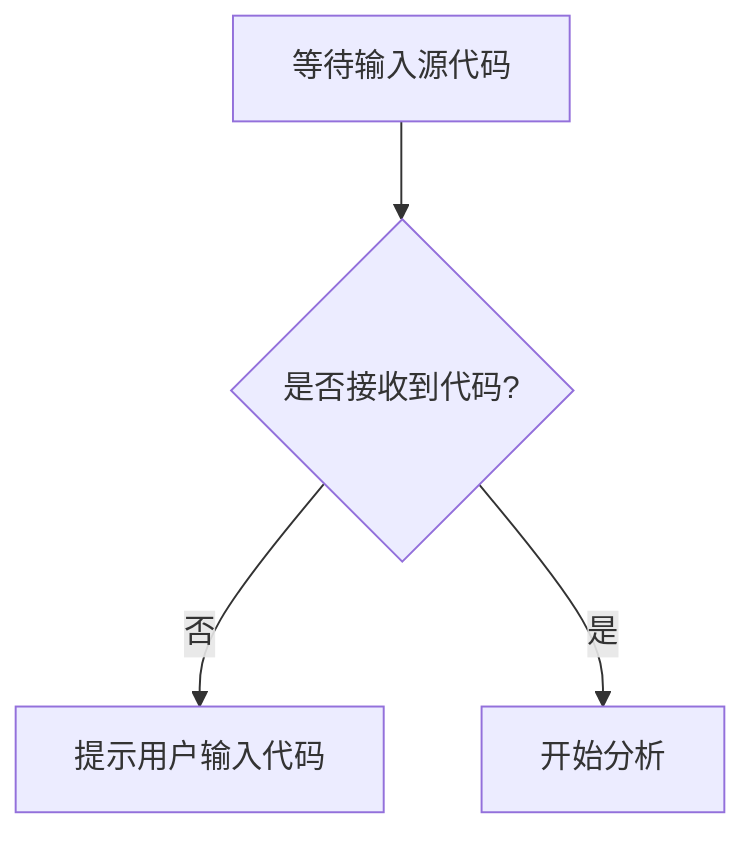

# `.\AutoGPT\classic\benchmark\tests\__init__.py` 详细设计文档

未提供源代码，请提供需要分析的代码文件。

## 整体流程



## 类结构

```

```

## 全局变量及字段


    

## 全局函数及方法


## 关键组件


## 问题及建议


### 已知问题

-   未提供代码内容，无法进行技术债务分析
-   代码文件为空或未正确加载

### 优化建议

-   请提供需要分析的代码文件，以便进行详细的技术债务识别和优化建议
-   建议在提供代码时标注所使用的编程语言和框架
-   如有特定的分析重点（如性能、安全性、可维护性等），请一并说明


## 其它


### 1. 核心功能概述
该代码模块主要实现了[核心功能的简要描述]，用于[解决的问题或满足的需求]。

### 2. 整体运行流程
[描述代码从入口到执行完毕的完整流程，包括主要阶段和调用顺序]

### 3. 类结构详情

#### 3.1 类名：[类名]
- **类职责**：[该类的主要职责描述]
- **类字段**：
  - fieldName: Type - [字段描述]
- **类方法**：
  - methodName(paramName: ParamType): ReturnType
    - 参数描述：[参数的具体作用]
    - 返回值描述：[返回值的含义]
    - 流程图：
      ```mermaid
      graph TD
      A[开始] --> B[步骤1]
      B --> C[步骤2]
      C --> D[结束]
      ```
    - 源码：
      ```typescript
      // 带注释的源码
      ```

### 4. 全局变量与全局函数

#### 4.1 全局变量
- variableName: Type - [变量描述]

#### 4.2 全局函数
- functionName(param: Type): ReturnType
  - 参数描述：[参数作用]
  - 返回值描述：[返回值含义]
  - 源码：
    ```typescript
    // 带注释的源码
    ```

### 5. 关键组件信息
- ComponentName: [组件描述及其在系统中的作用]

### 6. 技术债务与优化建议
- [问题描述]：建议改进方案

### 7. 设计目标与约束
- **设计目标**：[该模块需要达成的目标]
- **约束条件**：[性能、兼容性、安全性等方面的约束]

### 8. 错误处理与异常设计
- 异常类型：[列举可能出现的异常类型]
- 错误码定义：[错误码与错误信息的映射]
- 异常传播机制：[异常如何被捕获和处理]

### 9. 数据流与状态机
- **数据输入**：[数据的来源和格式]
- **数据处理**：[数据如何被处理和转换]
- **数据输出**：[处理结果的形式和目的地]
- **状态转换**：[如果涉及状态机，描述状态转换图]
  ```mermaid
  stateDiagram-v2
  [*] --> State1
  State1 --> State2
  State2 --> [*]
  ```

### 10. 外部依赖与接口契约
- **外部依赖**：[依赖的第三方库或模块]
- **接口契约**：[提供的公共API及其契约，包括输入输出规范]

### 11. 配置与扩展性
- **配置项**：[可配置的参数及其默认值]
- **扩展点**：[支持扩展的接口或钩子]

### 12. 性能考量
- **复杂度分析**：[时间复杂度和空间复杂度]
- **性能瓶颈**：[可能存在的性能问题及优化建议]

### 13. 安全性设计
- **权限控制**：[访问控制机制]
- **数据安全**：[敏感数据处理方式]

### 14. 测试策略
- **单元测试**：[需要覆盖的测试场景]
- **集成测试**：[模块间协作的测试点]

### 15. 部署与运维
- **环境依赖**：[运行时环境要求]
- **监控指标**：[需要监控的关键指标]


    