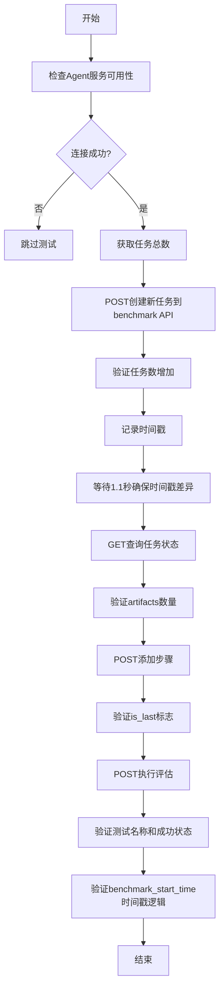
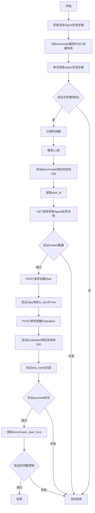
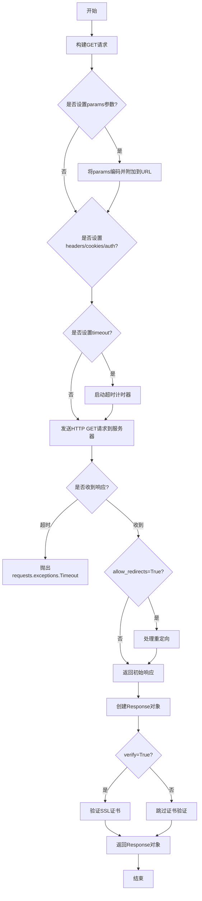
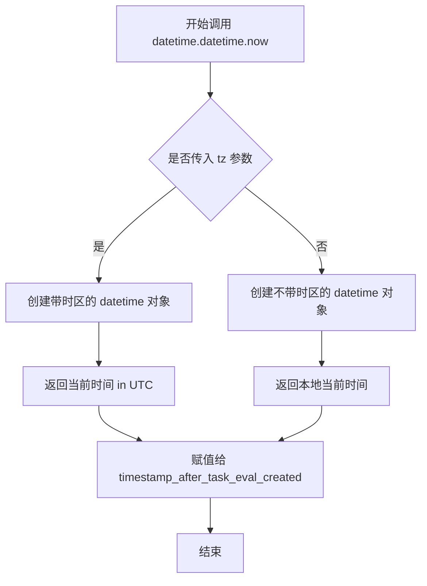
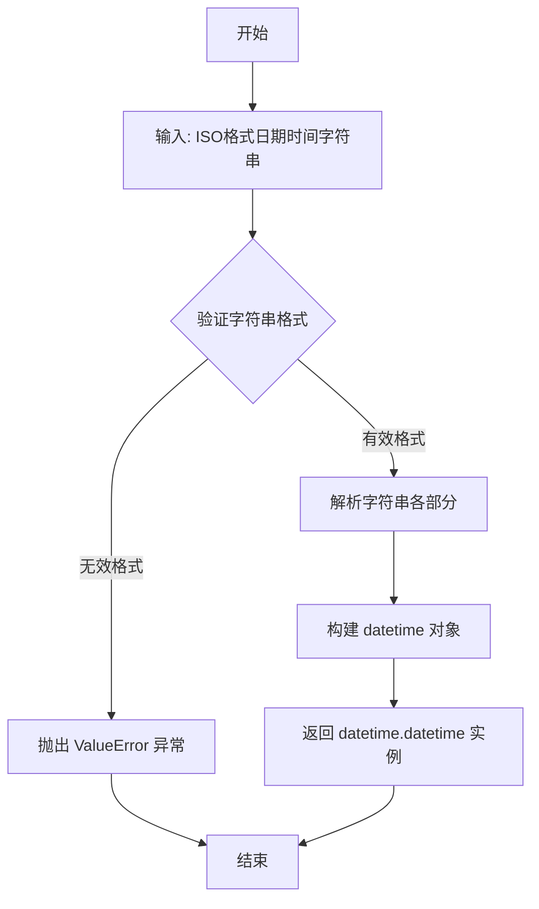
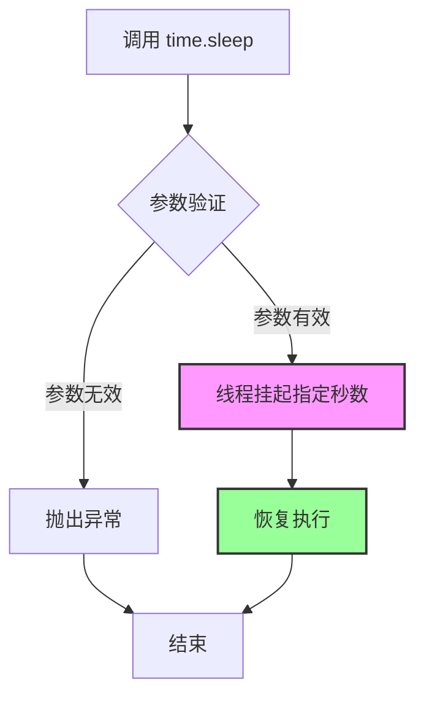

# `.\AutoGPT\classic\benchmark\tests\test_benchmark_workflow.py` 详细设计文档

这是一个pytest集成测试文件，用于测试AI代理任务工作流程。它通过HTTP请求与本地运行的benchmark API (8080端口) 和 agent API (8000端口) 进行交互，验证任务的创建、步骤执行、评估等完整流程是否正常工作。

## 整体流程



## 类结构

```
测试模块 (无类定义)
├── 模块级变量
│   ├── URL_BENCHMARK
│   └── URL_AGENT
└── 测试函数
    └── test_entire_workflow (参数化测试)
```

## 全局变量及字段


### `URL_BENCHMARK`
    
基准测试服务器的基URL，指向本地8080端口的API v1端点

类型：`str`
    


### `URL_AGENT`
    
代理服务器的基URL，指向本地8000端口的API v1端点

类型：`str`
    


    

## 全局函数及方法


### `test_entire_workflow`

该函数是一个完整的端到端集成测试，验证了从任务创建、任务执行、步骤处理到最终评估的整个工作流程。测试通过向 Benchmark 服务和 Agent 服务发送 HTTP 请求，验证任务创建、Artifact 数量、Step 执行以及 Evaluation 结果的正确性，并确保时间戳逻辑符合预期。

参数：

- `eval_id`：`str`，评估的唯一标识符，用于指定要执行的评估任务
- `input_text`：`str`，用户输入的任务描述文本，如"Write the word 'Washington' to a .txt file"
- `expected_artifact_length`：`int`，期望返回的 Artifact 数量，用于验证任务执行结果
- `test_name`：`str`，测试的名称，用于验证评估结果中的测试名称是否匹配
- `should_be_successful`：`bool`，预期评估是否应该成功，用于验证评估指标中的成功标志

返回值：`None`，该函数为 pytest 测试函数，无显式返回值，通过 assert 断言进行验证

#### 流程图



#### 带注释源码

```python
import datetime
import time

import pytest
import requests

# 定义Benchmark和Agent服务的基地址
URL_BENCHMARK = "http://localhost:8080/ap/v1"
URL_AGENT = "http://localhost:8000/ap/v1"

# 尝试连接Agent服务，若连接失败则跳过整个模块的测试
try:
    response = requests.get(f"{URL_AGENT}/agent/tasks")
except requests.exceptions.ConnectionError:
    pytest.skip("No agent available to test against", allow_module_level=True)


# 参数化测试，定义多个测试用例
@pytest.mark.parametrize(
    "eval_id, input_text, expected_artifact_length, test_name, should_be_successful",
    [
        # 测试用例1：写文件任务
        (
            "021c695a-6cc4-46c2-b93a-f3a9b0f4d123",
            "Write the word 'Washington' to a .txt file",
            0,
            "WriteFile",
            True,
        ),
        # 测试用例2：读文件任务（预期失败）
        (
            "f219f3d3-a41b-45a9-a3d0-389832086ee8",
            "Read the file called file_to_read.txt "
            "and write its content to a file called output.txt",
            1,
            "ReadFile",
            False,
        ),
    ],
)
def test_entire_workflow(
    eval_id: str,
    input_text: str,
    expected_artifact_length: int,
    test_name: str,
    should_be_successful: bool,
):
    """端到端测试整个任务评估工作流程"""
    
    # 构建任务请求体
    task_request = {"eval_id": eval_id, "input": input_text}
    
    # 获取当前Agent任务总数（创建任务前）
    response = requests.get(f"{URL_AGENT}/agent/tasks")
    task_count_before = response.json()["pagination"]["total_items"]
    
    # 第一次POST请求：向Benchmark服务创建任务
    task_response_benchmark = requests.post(
        URL_BENCHMARK + "/agent/tasks", json=task_request
    )
    
    # 再次获取Agent任务总数（创建任务后）
    response = requests.get(f"{URL_AGENT}/agent/tasks")
    task_count_after = response.json()["pagination"]["total_items"]
    
    # 断言：验证任务数增加了1
    assert task_count_after == task_count_before + 1

    # 记录任务创建后的时间戳
    timestamp_after_task_eval_created = datetime.datetime.now(datetime.timezone.utc)
    
    # 等待1.1秒以确保用于比较的两个时间戳不同
    time.sleep(1.1)
    
    # 断言：验证Benchmark响应状态码为200
    assert task_response_benchmark.status_code == 200
    task_response_benchmark = task_response_benchmark.json()
    
    # 断言：验证返回的input与请求的input一致
    assert task_response_benchmark["input"] == input_text

    # 从响应中提取task_id
    task_response_benchmark_id = task_response_benchmark["task_id"]

    # GET请求：获取Agent任务详情
    response_task_agent = requests.get(
        f"{URL_AGENT}/agent/tasks/{task_response_benchmark_id}"
    )
    assert response_task_agent.status_code == 200
    response_task_agent = response_task_agent.json()
    
    # 断言：验证Artifact数量符合预期
    assert len(response_task_agent["artifacts"]) == expected_artifact_length

    # 构建Step请求体
    step_request = {"input": input_text}

    # POST请求：创建Step
    step_response = requests.post(
        URL_BENCHMARK + "/agent/tasks/" + task_response_benchmark_id + "/steps",
        json=step_request,
    )
    assert step_response.status_code == 200
    step_response = step_response.json()
    
    # 断言：验证is_last为True（假设is_last总是True）
    assert step_response["is_last"] is True

    # POST请求：创建Evaluation
    eval_response = requests.post(
        URL_BENCHMARK + "/agent/tasks/" + task_response_benchmark_id + "/evaluations",
        json={},
    )
    assert eval_response.status_code == 200
    eval_response = eval_response.json()
    
    # 打印评估响应（用于调试）
    print("eval_response")
    print(eval_response)
    
    # 断言：验证test_name匹配
    assert eval_response["run_details"]["test_name"] == test_name
    # 断言：验证success标志符合预期
    assert eval_response["metrics"]["success"] == should_be_successful
    
    # 从响应中提取benchmark_start_time并转换为datetime对象
    benchmark_start_time = datetime.datetime.fromisoformat(
        eval_response["run_details"]["benchmark_start_time"]
    )

    # 断言：验证benchmark_start_time早于任务创建后的时间戳
    assert benchmark_start_time < timestamp_after_task_eval_created
```


### `requests.get`

`requests.get` 是 `requests` 库中用于发送 HTTP GET 请求的函数，该函数支持传递 URL、查询参数、请求头、认证信息等，并返回一个 `Response` 对象包含服务器响应的状态码、内容、元数据等信息。

参数：

- `url`：`str`，要请求的目标 URL 地址
- `params`：`dict` 或 `tuple`，（可选）URL 查询参数，会自动编码到 URL 中
- `headers`：`dict`，（可选）HTTP 请求头，用于指定请求的元数据
- `cookies`：`dict` 或 `RequestsCookieJar`，（可选）随请求发送的 cookies
- `auth`：`Tuple[str, str]` 或 `Auth` 对象，（可选）HTTP 认证信息
- `timeout`：`float`、`tuple` 或 `None`，（可选）请求超时时间，单位为秒
- `allow_redirects`：`bool`，（可选）是否允许重定向，默认为 `True`
- `proxies`：`dict`，（可选）代理服务器配置
- `verify`：`bool` 或 `str`，（可选）是否验证 SSL 证书，默认为 `True`
- `stream`：`bool`，（可选）是否流式下载响应内容，默认为 `False`
- `cert`：`str` 或 `tuple`，（可选）客户端 SSL 证书路径

返回值：`requests.Response`，服务器响应的 Response 对象，包含 status_code（状态码）、text（响应文本）、json()（JSON 解析）、headers（响应头）、cookies（响应 cookies）等属性和方法。

#### 流程图



#### 带注释源码

```python
def get(url, params=None, **kwargs):
    """
    发送HTTP GET请求并返回Response对象
    
    参数:
        url: 请求的URL地址
        params: 可选的查询参数字典,会自动编码到URL中
        **kwargs: 其他可选参数如headers, cookies, auth, timeout等
    
    返回:
        Response对象,包含服务器响应的所有信息
    """
    # kwargs中包含所有可选参数
    # method参数设置为'GET'
    kwargs.setdefault('allow_redirects', True)
    
    # 返回请求函数的结果
    return request('get', url, **kwargs)
```


### `requests.post` (创建任务)

在 `test_entire_workflow` 函数中，向 Benchmark 服务发送 POST 请求以创建新的评估任务。

参数：

-  `url`：`str`，目标 URL，值为 `URL_BENCHMARK + "/agent/tasks"`
-  `json`：`dict`，请求体，包含 `eval_id` 和 `input` 字段的任务请求对象

返回值：`requests.Response`，HTTP 响应对象，包含任务创建的响应数据

#### 流程图

```mermaid
flowchart TD
    A[开始 POST 请求] --> B[构建 URL: http://localhost:8080/ap/v1/agent/tasks]
    B --> C[封装 JSON 请求体: {eval_id, input}]
    C --> D{网络连接}
    D -->|成功| E[接收 HTTP 200 响应]
    D -->|失败| F[抛出 ConnectionError]
    E --> G[返回 Response 对象]
    G --> H[提取 JSON 数据: task_id, input 等]
```

#### 带注释源码

```python
# 构建任务请求对象，包含评估ID和输入文本
task_request = {"eval_id": eval_id, "input": input_text}

# 向 Benchmark 服务的 /agent/tasks 端点发送 POST 请求
# URL_BENCHMARK = "http://localhost:8080/ap/v1"
# 最终 URL: http://localhost:8080/ap/v1/agent/tasks
task_response_benchmark = requests.post(
    URL_BENCHMARK + "/agent/tasks",  # 目标端点
    json=task_request  # 请求体（JSON 格式）
)

# 验证响应状态码为 200（成功）
assert task_response_benchmark.status_code == 200

# 解析响应 JSON，获取任务信息
task_response_benchmark = task_response_benchmark.json()
# 包含字段: task_id, input, created_at 等
assert task_response_benchmark["input"] == input_text

# 提取创建的任务 ID，用于后续步骤和评估
task_response_benchmark_id = task_response_benchmark["task_id"]
```

---

### `requests.post` (创建步骤)

在 `test_entire_workflow` 函数中，向 Benchmark 服务发送 POST 请求以创建任务的执行步骤。

参数：

-  `url`：`str`，目标 URL，格式为 `URL_BENCHMARK + "/agent/tasks/{task_id}/steps"`
-  `json`：`dict`，请求体，包含 `input` 字段的步骤请求对象

返回值：`requests.Response`，HTTP 响应对象，包含步骤创建的响应数据

#### 流程图

```mermaid
flowchart TD
    A[开始 POST 请求] --> B[构建 URL: http://localhost:8080/ap/v1/agent/tasks/{task_id}/steps]
    B --> C[封装 JSON 请求体: {input}]
    C --> D{网络连接}
    D -->|成功| E[接收 HTTP 200 响应]
    D -->|失败| F[抛出 ConnectionError]
    E --> G[返回 Response 对象]
    G --> H[提取 JSON 数据: is_last, step_id 等]
```

#### 带注释源码

```python
# 构建步骤请求对象，包含相同的输入文本
step_request = {"input": input_text}

# 向特定任务的 /steps 端点发送 POST 请求
# URL_BENCHMARK + "/agent/tasks/" + task_response_benchmark_id + "/steps"
# 最终 URL: http://localhost:8080/ap/v1/agent/tasks/{task_id}/steps
step_response = requests.post(
    URL_BENCHMARK + "/agent/tasks/" + task_response_benchmark_id + "/steps",
    json=step_request  # 请求体（JSON 格式）
)

# 验证响应状态码为 200（成功）
assert step_response.status_code == 200

# 解析响应 JSON，获取步骤信息
step_response = step_response.json()
# 包含字段: step_id, is_last, output 等

# 验证步骤是否为最后一个步骤（假设 is_last 始终为 True）
assert step_response["is_last"] is True
```

---

### `requests.post` (创建评估)

在 `test_entire_workflow` 函数中，向 Benchmark 服务发送 POST 请求以创建任务的评估。

参数：

-  `url`：`str`，目标 URL，格式为 `URL_BENCHMARK + "/agent/tasks/{task_id}/evaluations"`
-  `json`：`dict`，请求体，此处为空字典 `{}`

返回值：`requests.Response`，HTTP 响应对象，包含评估的响应数据

#### 流程图

```mermaid
flowchart TD
    A[开始 POST 请求] --> B[构建 URL: http://localhost:8080/ap/v1/agent/tasks/{task_id}/evaluations]
    B --> C[封装 JSON 请求体: {}]
    C --> D{网络连接}
    D -->|成功| E[接收 HTTP 200 响应]
    D -->|失败| F[抛出 ConnectionError]
    E --> G[返回 Response 对象]
    G --> H[提取 JSON 数据: run_details, metrics 等]
```

#### 带注释源码

```python
# 向特定任务的 /evaluations 端点发送 POST 请求
# 使用空的请求体 {}，因为评估参数可能由服务端配置决定
# 最终 URL: http://localhost:8080/ap/v1/agent/tasks/{task_id}/evaluations
eval_response = requests.post(
    URL_BENCHMARK + "/agent/tasks/" + task_response_benchmark_id + "/evaluations",
    json={}  # 空请求体
)

# 验证响应状态码为 200（成功）
assert eval_response.status_code == 200

# 解析响应 JSON，获取评估结果
eval_response = eval_response.json()
# 包含字段: run_details{test_name, benchmark_start_time}, metrics{success} 等

# 打印评估响应用于调试
print("eval_response")
print(eval_response)

# 验证测试名称匹配预期
assert eval_response["run_details"]["test_name"] == test_name

# 验证评估成功状态匹配预期
assert eval_response["metrics"]["success"] == should_be_successful

# 提取基准开始时间，用于后续时间戳比较
benchmark_start_time = datetime.datetime.fromisoformat(
    eval_response["run_details"]["benchmark_start_time"]
)
```


### `datetime.datetime.now`

获取当前本地时间或指定时区的当前时间。

参数：

- `tz`：`datetime.timezone`，可选参数，指定时区。如果提供，返回带时区的 datetime 对象（aware datetime）；如果为 `None` 或省略，返回不带时区的 datetime 对象（naive datetime）。在代码中使用 `datetime.timezone.utc` 作为参数。

返回值：`datetime.datetime`，返回表示当前时间的 datetime 对象。

#### 流程图



#### 带注释源码

```python
# 获取当前的 UTC 时间（带时区信息）
# tz 参数指定为 datetime.timezone.utc，表示返回的时间是协调世界时
timestamp_after_task_eval_created = datetime.datetime.now(datetime.timezone.utc)

# 完整调用等价于:
# datetime.datetime.now(tz=datetime.timezone.utc)
# 
# 这个调用会返回一个 datetime 对象，其属性包括:
# - year, month, day: 日期部分
# - hour, minute, second, microsecond: 时间部分
# - tzinfo: 时区信息 (这里是 UTC)
# 
# 用途: 记录任务评估创建后的时间戳，用于后续与基准测试开始时间进行比较
# 在代码中用于断言: assert benchmark_start_time < timestamp_after_task_eval_created
```


### `datetime.datetime.fromisoformat`

将符合 ISO 8601 格式的日期时间字符串解析为 `datetime` 对象。这是 Python `datetime` 类的类方法（classmethod），专门用于处理标准化的日期时间格式字符串。

参数：

- `date_string`：`str`，符合 ISO 8601 格式的日期时间字符串（例如："2023-01-01T12:00:00+00:00"）

返回值：`datetime.datetime`，解析后的日期时间对象

#### 流程图



#### 带注释源码

```python
# 从 eval_response 中获取 ISO 8601 格式的基准开始时间字符串
# run_details.benchmark_start_time 是类似 "2023-01-01T12:00:00+00:00" 的字符串
benchmark_start_time_string = eval_response["run_details"]["benchmark_start_time"]

# 调用 datetime.datetime.fromisoformat 类方法
# 该方法将 ISO 8601 格式的字符串解析为 datetime 对象
# 参数: date_string - ISO 格式的日期时间字符串
# 返回值: datetime.datetime 对象
benchmark_start_time = datetime.datetime.fromisoformat(
    benchmark_start_time_string  # 要解析的 ISO 格式日期时间字符串
)

# 验证解析后的时间早于任务创建后的时间戳
# 用于确保基准测试开始时间的时间逻辑正确性
assert benchmark_start_time < timestamp_after_task_eval_created
```


### `time.sleep`

`time.sleep` 是 Python 标准库中的函数，用于暂停调用线程的执行指定秒数。在该代码中，它被用于确保两个时间戳比较时能够产生差异，以便验证任务评估创建时间的逻辑正确性。

参数：

- `seconds`：`float`，表示暂停执行的秒数，可以是整数或浮点数

返回值：`None`，该函数不返回任何值

#### 流程图



#### 带注释源码

```python
import time  # 导入 Python 标准库 time 模块

# 在代码中的实际使用：
timestamp_after_task_eval_created = datetime.datetime.now(datetime.timezone.utc)
time.sleep(1.1)  # 暂停执行 1.1 秒，确保两个时间戳之间存在差异
# 注释说明：此延迟用于确保后续的时间戳比较能够验证 benchmark_start_time 
# 小于任务评估创建时间的逻辑正确性

# time.sleep 函数签名：
# time.sleep(secs: float) -> None
#
# 参数说明：
# - secs: 浮点数，表示暂停的秒数。可以是 0 表示不暂停，或抛出异常
#
# 返回值：
# - 无返回值（返回 None）
#
# 注意事项：
# - 参数可以是 0 或负数，负数会抛出 ValueError
# - 如果被信号中断，可能实际睡眠时间会少于指定时间
# - 在多线程环境中，只暂停调用该函数的线程，不影响其他线程
```

#### 技术债务与优化空间

- **硬编码延迟时间**：1.1 秒的延迟是硬编码的，可能在不同环境下不够稳定
- **缺乏动态等待机制**：建议使用更智能的等待方式，如轮询检查任务状态而非固定延迟
- **测试稳定性**：固定延迟可能导致测试在不同性能的机器上运行时间不一致

#### 外部依赖

- **Python 标准库 `time`**：无需额外安装，是 Python 内置模块


## 关键组件


### 任务创建与验证组件

负责向Benchmark服务发送POST请求创建任务，并验证任务是否成功创建，同时检查任务计数是否增加。

### Agent任务查询组件

用于获取Agent服务的任务列表，通过GET请求查询当前任务总数，验证任务创建前后数量变化。

### 步骤执行组件

向Benchmark服务的步骤端点发送POST请求，执行任务的单个步骤，并验证返回的`is_last`标志。

### 评估执行组件

向Benchmark服务的评估端点发送POST请求，触发对任务的评估，并验证评估结果中的测试名称和成功状态。

### 时间戳验证组件

负责记录任务创建的时间戳，并验证返回的`benchmark_start_time`早于任务创建时间，确保时间逻辑正确。

### 测试参数化组件

使用`pytest.mark.parametrize`定义多个测试场景，包括不同的eval_id、输入文本、预期产物数量、测试名称和预期成功状态。

### 连接检查与跳过机制

在测试开始前尝试连接Agent服务，如果发生连接错误则使用`pytest.skip`跳过整个模块的测试。

### HTTP请求封装组件

封装了所有与Benchmark和Agent服务交互的HTTP请求，包括GET和POST方法，用于任务创建、查询、执行和评估。


## 问题及建议


### 已知问题

-   **硬编码的URL配置**：URL_BENCHMARK和URL_AGENT使用硬编码的localhost地址，缺乏灵活的环境配置机制，不支持多环境部署
-   **魔法数字**：time.sleep(1.1)中的1.1秒等待时间没有注释说明其业务意义，难以理解和维护
-   **缺少Mock依赖**：测试直接依赖外部HTTP服务，没有使用mock或stub，导致测试执行缓慢且不稳定，容易受网络和服务状态影响
-   **重复代码**：多次调用requests.get(f"{URL_AGENT}/agent/tasks")获取任务数量的逻辑重复，可以提取为辅助函数
-   **URL字符串拼接不规范**：使用+号拼接URL路径（如URL_BENCHMARK + "/agent/tasks/" + task_response_benchmark_id + "/steps"），而不是使用f-string或pathlib，代码可读性较差
-   **测试假设过于绝对**：假设is_last总是True（assert step_response["is_last"] is True），缺乏对实际业务逻辑的验证
-   **断言信息不详细**：所有assert语句都没有自定义错误消息，测试失败时难以快速定位问题根因
-   **测试数据硬编码**：eval_id、input_text等测试数据直接内联在代码中，缺乏测试数据管理机制
-   **缺少资源清理**：测试创建了任务资源但没有清理机制，可能导致测试数据残留
-   **缺少超时控制**：requests请求没有设置timeout参数，可能导致测试无限期挂起
-   **print语句用于调试**：代码中保留了print("eval_response")用于调试，不应在生产测试代码中使用

### 优化建议

-   **引入配置管理**：使用环境变量或配置文件管理URL，支持不同环境的灵活配置
-   **使用pytest fixtures**：创建session级别的fixture来管理测试配置和连接检查
-   **添加Mock对象**：使用unittest.mock或requests-mock来模拟HTTP响应，提高测试速度和稳定性
-   **提取常量与函数**：将等待时间定义为常量，将重复的HTTP调用封装为辅助函数
-   **改进URL构建**：使用f-string或urllib构建URL，提高可读性和安全性
-   **增强断言信息**：为关键断言添加详细的错误消息，如assert response.status_code == 200, f"Expected 200, got {response.status_code}"
-   **参数化测试数据**：将测试数据移至独立的YAML或JSON配置文件，提高可维护性
-   **添加资源清理**：使用pytest的fixture teardown或yield模式清理测试创建的资源
-   **设置请求超时**：为所有requests调用添加timeout参数，避免无限等待
-   **移除调试代码**：删除print语句，使用pytest的capfd fixture或日志框架进行输出捕获
-   **添加错误场景测试**：补充负面测试用例，如网络超时、服务错误响应等边界情况

## 其它


### 设计目标与约束

本测试代码的设计目标是验证一个完整的代理任务执行工作流程，包括任务创建、步骤执行和评估结果验证。约束条件包括：1）依赖两个本地运行的HTTP服务（基准测试服务在localhost:8080，代理服务在localhost:8000）；2）测试必须按顺序执行以确保状态正确；3）时间相关断言要求至少1.1秒的时间差。

### 错误处理与异常设计

代码中使用try-except捕获requests.exceptions.ConnectionError，当代理服务不可用时调用pytest.skip跳过整个测试模块。测试中的断言用于验证API响应状态码和返回数据是否符合预期，任何不符合预期的情况都会导致测试失败。基准测试服务连接失败会导致后续所有请求失败。

### 数据流与状态机

数据流从测试参数开始，经过以下状态：1）初始状态获取任务总数；2）创建任务请求发送到基准测试服务，状态转为"已创建"；3）验证任务已添加到代理服务；4）发送步骤请求执行实际任务；5）发送评估请求获取测试结果；6）最终验证success和test_name字段。状态转换依赖HTTP请求的顺序执行。

### 外部依赖与接口契约

主要外部依赖包括：1）requests库用于HTTP通信；2）pytest和pytest.mark.parametrize用于测试框架；3）datetime和time用于时间戳处理。接口契约方面：基准测试服务提供/agent/tasks（POST创建任务）、/agent/tasks/{id}/steps（POST执行步骤）、/agent/tasks/{id}/evaluations（POST评估）三个端点；代理服务提供/agent/tasks（GET查询任务列表）和/agent/tasks/{id}（GET查询任务详情）端点。

### 性能考虑

代码中存在硬编码的time.sleep(1.1)用于确保时间戳比较的有效性，这会影响测试执行速度。建议改为使用mock时间或更精确的时间比较逻辑。此外，测试串行执行多个HTTP请求，每次请求都有网络延迟开销。

### 安全性考虑

测试代码直接使用localhost地址，存在信息泄露风险。代码中未包含任何认证凭证，但实际生产环境应添加API密钥或Bearer Token认证。测试数据中包含硬编码的UUID和具体的输入文本，生产环境应使用脱敏数据或测试数据生成器。

### 测试策略

采用pytest的标记化参数测试（parametrize）实现数据驱动测试，允许通过不同参数组合运行相同测试逻辑。测试覆盖两种场景：文件写入任务（WriteFile）和文件读取任务（ReadFile）。测试验证三个核心指标：任务数量增加、产物数量正确、评估结果符合预期。

### 监控和日志

代码中使用print语句输出eval_response内容用于调试。建议添加结构化日志记录，包含请求URL、响应状态码、耗时等信息。测试失败时应记录完整的请求-响应对以便于问题排查。

### 配置文件

URL配置采用硬编码方式（URL_BENCHMARK和URL_AGENT），建议抽取到配置文件或环境变量。测试参数（eval_id、input_text、expected_artifact_length等）也应支持外部配置以提高测试灵活性。

### 并发和线程安全

测试代码未考虑并发执行场景，多个测试实例同时运行可能导致任务计数不准确。共享的全局变量（如URL_BENCHMARK和URL_AGENT）在并发场景下可能产生竞态条件。

### 重试机制

HTTP请求未实现重试逻辑，网络波动或服务短暂不可用会导致测试失败。建议为关键请求（如任务创建、评估）添加指数退避重试机制。

### 数据隔离

测试使用固定的eval_id和输入文本，多次运行会产生副作用。建议每个测试运行使用唯一标识符或在测试前后清理测试数据。

    