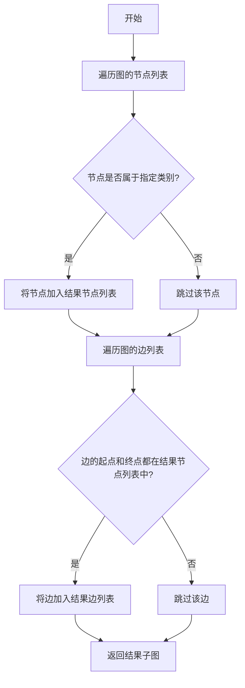
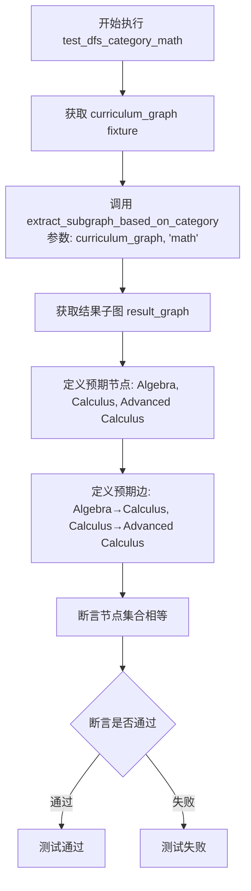
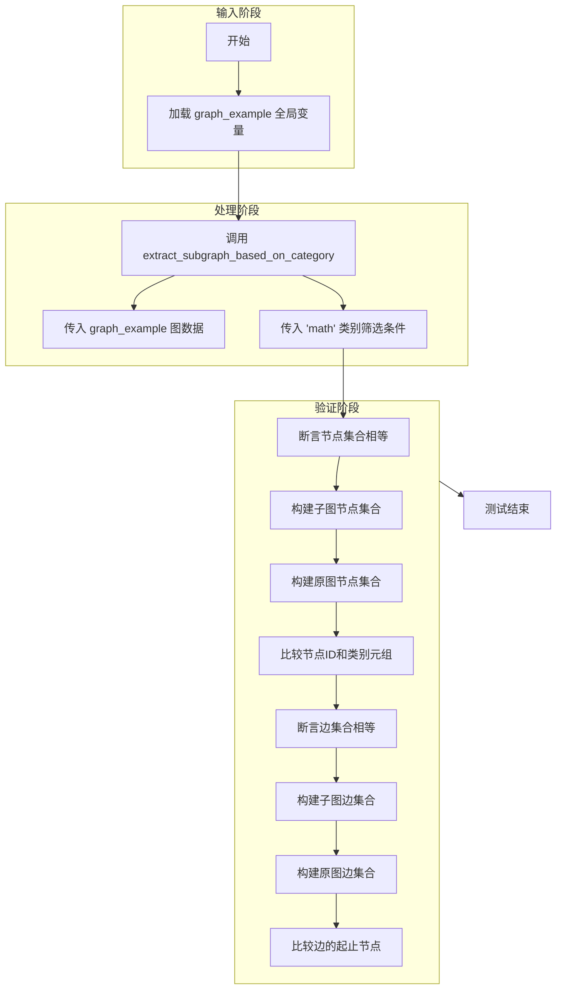
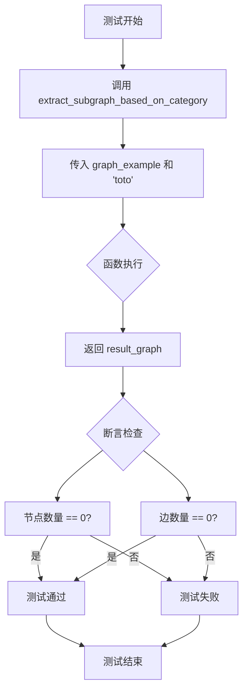

# `.\AutoGPT\classic\benchmark\tests\test_extract_subgraph.py` 详细设计文档

该代码是一个pytest测试套件，用于验证从给定的图结构中根据特定类别(category)提取子图的功能。核心被测函数extract_subgraph_based_on_category接收一个图和一个类别标签,返回只包含该类别节点及其相关边的子图。

## 整体流程

```mermaid
graph TD
    A[开始测试] --> B[准备图数据: curriculum_graph 或 graph_example]
    B --> C{测试用例类型}
    C -->|test_dfs_category_math| D[调用extract_subgraph_based_on_category(graph, 'math')]
    C -->|test_extract_subgraph_math_category| E[调用extract_subgraph_based_on_category(graph_example, 'math')]
    C -->|test_extract_subgraph_non_existent_category| F[调用extract_subgraph_based_on_category(graph_example, 'toto')]
    D --> G[断言: 验证返回的nodes和edges]
    E --> H[断言: 验证返回的nodes包含所有节点和类别]
    F --> I[断言: 验证返回的nodes和edges为空]
    G --> J[测试通过/失败]
    H --> J
    I --> J
```

## 类结构

```
该文件为测试文件,无类定义
主要测试对: extract_subgraph_based_on_category 函数
测试数据: curriculum_graph (课程图), graph_example (示例图)
```

## 全局变量及字段


### `curriculum_graph`
    
测试夹具,返回包含课程依赖关系的图结构(节点包括Calculus, Advanced Calculus, Algebra等,边表示先修关系)

类型：`dict`
    


### `graph_example`
    
简单的示例图,用于基础功能测试

类型：`dict`
    


    

## 全局函数及方法


### `extract_subgraph_based_on_category`

该函数接收一个图结构和一个类别字符串，从原图中提取只包含指定类别的节点以及这些节点之间的边，返回过滤后的子图。

参数：

- `graph`：`Dict[str, List[Dict]]`，输入的图结构，包含 "nodes" 和 "edges" 两个键，其中 nodes 是节点列表，每个节点包含 id、data（包含 category）和 label；edges 是边列表，每条边包含 from 和 to。
- `category`：`str`，要过滤的类别名称。

返回值：`Dict[str, List[Dict]]`，过滤后的子图结构，包含 "nodes" 和 "edges"，只保留属于指定类别的节点以及这些节点之间的边。

#### 流程图



#### 带注释源码

```python
def extract_subgraph_based_on_category(graph, category):
    """
    从给定的图中提取基于类别的子图。
    
    参数:
        graph: 包含 'nodes' 和 'edges' 的字典结构
        category: 要过滤的类别字符串
    
    返回:
        包含过滤后节点和边的子图字典
    """
    # 初始化结果图结构
    result_graph = {"nodes": [], "edges": []}
    
    # 第一步：过滤节点
    # 遍历所有节点，选择属于指定类别的节点
    for node in graph.get("nodes", []):
        # 获取节点的类别列表（从 node["data"]["category"] 获取）
        # 使用 get 防止 KeyError，并默认空列表
        node_categories = node.get("data", {}).get("category", [])
        
        # 如果类别在节点的类别列表中，则保留该节点
        if category in node_categories:
            result_graph["nodes"].append(node)
    
    # 第二步：过滤边
    # 获取过滤后节点的 ID 集合，用于快速查找
    node_ids = {node["id"] for node in result_graph["nodes"]}
    
    # 遍历所有边，选择起点和终点都在过滤后节点集合中的边
    for edge in graph.get("edges", []):
        # 检查边的起点和终点是否都在过滤后的节点集合中
        if edge["from"] in node_ids and edge["to"] in node_ids:
            # 如果两边都存在，则保留该边
            result_graph["edges"].append(edge)
    
    # 返回过滤后的子图
    return result_graph
```

---

## 补充信息

### 关键组件信息

| 名称 | 描述 |
|------|------|
| `curriculum_graph` | 测试用的课程图数据结构，包含数学、科学、历史类别的节点和边 |
| `graph_example` | 简化版测试图，用于边界情况测试 |

### 潜在的技术债务或优化空间

1. **类别匹配逻辑**：当前仅支持精确匹配类别字符串，无法支持多类别或部分匹配场景。
2. **性能优化**：对于大规模图，节点 ID 集合的创建和边遍历可以进一步优化。
3. **错误处理**：缺少对输入图结构合法性的验证（如缺少必需的键）。
4. **文档注释**：源代码中应补充完整的类型注解（Type Hints）以提升可维护性。

### 其它项目

#### 设计目标与约束

- **设计目标**：从图中提取属于特定类别的子图，保持原图的拓扑结构。
- **约束**：输入图必须包含 "nodes" 和 "edges" 键；节点必须包含 "id" 和 "data.category" 字段。

#### 错误处理与异常设计

- 若节点缺少 "data" 或 "category" 字段，使用空列表作为默认值，避免 KeyError。
- 若图中不存在指定类别，返回空节点列表和空边列表（而非抛出异常）。

#### 数据流与状态机

1. **输入验证阶段**：提取图结构和类别参数。
2. **节点过滤阶段**：遍历节点列表，根据 category 字段筛选节点。
3. **边过滤阶段**：基于过滤后的节点 ID 集合，筛选两端点都在结果集中的边。
4. **输出阶段**：返回包含过滤后节点和边的子图。

#### 外部依赖与接口契约

- 该函数依赖 Python 内置数据结构（dict、list、set），无外部依赖。
- 接口契约：输入为包含标准结构（nodes、edges）的图字典，输出为相同结构的子图字典。


### `test_dfs_category_math`

这是测试用例函数，用于验证从课程图中提取数学（math）类别的子图功能是否正确。通过调用 `extract_subgraph_based_on_category` 函数，筛选出 category 为 "math" 的节点及其相关边，并断言结果与预期一致。

参数：

-  `curriculum_graph`：`Dict`，pytest fixture，提供课程图数据，包含节点和边的关系，其中部分节点属于 math 类别

返回值：`None`，该函数为测试函数，不返回值，通过断言验证功能正确性

#### 流程图



#### 带注释源码

```python
def test_dfs_category_math(curriculum_graph):
    """
    测试函数：从课程图中提取 math 类别的子图
    
    Args:
        curriculum_graph: pytest fixture，提供课程图数据
                         包含 math、science、history 类别的节点和边
    """
    
    # 调用被测函数，从课程图中提取 category 为 "math" 的子图
    result_graph = extract_subgraph_based_on_category(curriculum_graph, "math")

    # 预期结果：
    # 节点：Algebra, Calculus, Advanced Calculus（均为 math 类别）
    # 边：Algebra->Calculus, Calculus->Advanced Calculus

    # 定义预期节点列表
    expected_nodes = ["Algebra", "Calculus", "Advanced Calculus"]
    
    # 定义预期边列表
    expected_edges = [
        {"from": "Algebra", "to": "Calculus"},
        {"from": "Calculus", "to": "Advanced Calculus"},
    ]

    # 断言：提取的子图节点与预期节点一致
    assert set(node["id"] for node in result_graph["nodes"]) == set(expected_nodes)
    
    # 断言：提取的子图边与预期边一致
    assert set((edge["from"], edge["to"]) for edge in result_graph["edges"]) == set(
        (edge["from"], edge["to"]) for edge in expected_edges
    )
```


### `test_extract_subgraph_math_category`

这是一个测试用例函数，用于验证当图中只有部分节点属于指定类别时，提取子图功能的正确性。该测试确保在给定的图结构中，即使只有节点"C"属于"math"类别，但由于其他节点与该类别节点有边连接，整个图结构应被完整保留。

参数：此函数无显式参数。

返回值：`None`，该函数为测试函数，使用 `assert` 语句进行断言验证，不返回任何值。

#### 流程图



#### 带注释源码

```python
def test_extract_subgraph_math_category():
    """
    测试函数：验证 math 类别提取的正确性
    
    测试场景：
    - graph_example 包含3个节点：A、B、C
    - 只有节点 C 的 category 为 ["math"]，A 和 B 的 category 为空列表
    - 存在两条边：B->C 和 A->C
    
    预期结果：
    由于 C 节点属于 math 类别，与 C 相连的 A 和 B 节点也应被包含在子图中，
    因此子图应包含全部节点和全部边
    """
    
    # 调用 extract_subgraph_based_on_category 函数，提取 math 类别的子图
    # 参数说明：
    #   - graph_example: 输入的图数据结构（全局变量）
    #   - "math": 要筛选的类别名称
    subgraph = extract_subgraph_based_on_category(graph_example, "math")
    
    # 断言1：验证子图的节点集合与原图的节点集合相等
    # 使用集合比较，忽略节点顺序
    # 每个节点比较 (节点ID, 类别元组) 的组合
    assert set(
        (node["id"], tuple(node["data"]["category"])) for node in subgraph["nodes"]
    ) == set(
        (node["id"], tuple(node["data"]["category"])) for node in graph_example["nodes"]
    )
    
    # 断言2：验证子图的边集合与原图的边集合相等
    # 使用集合比较，忽略边顺序
    # 每个边比较 (起点, 终点) 的组合
    assert set((edge["from"], edge["to"]) for edge in subgraph["edges"]) == set(
        (edge["from"], edge["to"]) for edge in graph_example["edges"]
    )
```


### `test_extract_subgraph_non_existent_category`

该测试用例用于验证当调用图子图提取函数时，如果指定的类别在图中不存在，则返回的子图应该是一个空图（不包含任何节点和边）。

参数：

- 无（测试函数本身无显式参数，但内部调用了 `extract_subgraph_based_on_category` 函数）

返回值：`None`，该测试函数无返回值，通过 `assert` 断言验证结果是否符合预期

#### 流程图



#### 带注释源码

```python
def test_extract_subgraph_non_existent_category():
    """
    测试用例：验证不存在的类别返回空图
    
    该测试验证当extract_subgraph_based_on_category函数
    接收一个不存在的类别名称时，返回的子图应该是空的
    """
    
    # 调用被测函数，传入graph_example和不存在类别"toto"
    result_graph = extract_subgraph_based_on_category(graph_example, "toto")

    # 断言验证返回的图中节点列表为空
    # 由于类别"toto"不存在于graph_example中，预期结果为0个节点
    assert len(result_graph["nodes"]) == 0
    
    # 断言验证返回的图中边列表为空
    # 由于没有节点，相应的也不会有任何边
    assert len(result_graph["edges"]) == 0
```


## 关键组件


### extract_subgraph_based_on_category 函数

从给定的图结构中提取基于特定类别的子图，过滤出属于指定类别的节点及其相关的边，形成一个新的子图结构返回。

### curriculum_graph 测试夹具

提供一个包含多层次学科关系的课程图结构，包含数学、科学、历史三个类别的节点和边，用于测试不同类别子图的提取逻辑。

### graph_example 测试数据

一个简化的图数据结构，用于测试基本功能，包含三个节点（A、B、C）和两条边，其中节点C具有"math"类别标识。

### 测试用例集合

包含三个测试函数：`test_dfs_category_math` 验证数学类别子图提取的正确性，`test_extract_subgraph_math_category` 验证子图保留原始节点数据，`test_extract_subgraph_non_existent_category` 验证不存在类别返回空图。

### 图数据模型

标准化的图结构表示，包含 `nodes` 数组（每个节点含 id、label、data.category）和 `edges` 数组（每个边含 from、to 指向关系），支持有向图的结构化表示。


## 问题及建议


### 已知问题

- **测试逻辑不一致**：`test_extract_subgraph_math_category` 测试期望当类别为"math"时，所有节点（包括category为空列表的节点）都包含在子图中，这与 `extract_subgraph_based_on_category` 函数的预期行为（只提取匹配类别的节点）逻辑不一致。如果函数实现正确，此测试可能会失败。
- **测试数据覆盖不足**：`curriculum_graph` 包含7个节点和4条边，但测试只验证了3个数学相关节点，没有验证其他类别（Biology、World History等）的节点是否被正确排除。
- **缺少边界情况测试**：没有测试空图、孤立节点、仅有单个节点等边界情况。
- **硬编码断言值**：测试中的期望节点和边是硬编码的，降低了测试的可维护性和可读性。
- **缺少对节点完整性的验证**：测试只验证了节点的 `id` 字段，没有验证节点的 `label`、`data.category` 等其他字段是否正确保留。
- **测试函数命名误导**：`test_dfs_category_math` 函数名中包含"DFS"，但实际测试内容与DFS算法本身无关，容易造成误解。
- **缺少文档注释**：测试代码和被测试函数都缺少详细的文档注释，说明预期行为和边界条件。

### 优化建议

- **修复测试逻辑**：重新审视 `test_extract_subgraph_math_category` 的预期行为，确保测试逻辑与函数设计意图一致。如果函数应只返回匹配类别的节点，需要更新测试断言。
- **增强测试数据验证**：添加断言验证被排除的节点确实不存在于结果图中，确保过滤逻辑正确。
- **添加边界情况测试**：补充空图、单节点、无边图、循环图等边界情况的测试用例。
- **使用参数化测试**：考虑使用 `@pytest.mark.parametrize` 来减少重复代码，提高测试可维护性。
- **提取辅助函数**：将重复的节点/边集合比较逻辑封装为辅助函数，如 `get_node_ids()`、`get_edge_tuples()`。
- **完善节点验证**：添加对节点完整性的验证，确保 `label`、`data.category` 等字段在子图中正确保留。
- **添加文档注释**：为测试函数和被测试函数添加详细的docstring，说明参数、返回值和预期行为。
- **统一错误处理测试**：添加对无效输入（如None输入、格式错误等）的异常处理测试。


## 其它


### 设计目标与约束

该模块的设计目标是从给定的有向图结构中根据节点类别(category)提取符合条件的子图。约束条件包括：1) 输入图必须遵循特定的节点和边的结构（nodes数组包含id、data.category字段，edges数组包含from、to字段）；2) 类别匹配为精确字符串匹配；3) 子图提取仅包含指定类别相关的节点及其连通路径；4) 不修改原始图数据结构。

### 错误处理与异常设计

当前代码未显式处理异常情况。潜在的错误场景包括：1) 输入图结构不完整（缺少nodes或edges字段）- 建议添加结构验证；2) 节点ID不存在于nodes中但出现在edges中 - 建议添加引用完整性检查；3) 类别参数为None或空字符串 - 建议明确处理逻辑；4) 输入参数类型非dict - 建议添加类型检查。当前对于不存在的类别返回空图（nodes和edges均为空数组），这是一种隐式的错误容忍处理。

### 数据流与状态机

数据输入流程：原始图(dict) → 类别参数(string) → extract_subgraph_based_on_category函数处理。处理流程：遍历所有节点筛选符合类别的节点 → 构建节点集合 → 遍历所有边筛选两端节点都在节点集合中的边 → 构建结果子图。数据输出流程：返回符合条件的新图dict（含nodes和edges数组）。状态转换：输入图(任意节点类别) → 中间态(标记符合条件的节点) → 输出图(仅包含目标类别的连通子图)。

### 外部依赖与接口契约

直接依赖：`agbenchmark.utils.dependencies.graphs.extract_subgraph_based_on_category`函数。依赖该模块的外部模块：pytest测试框架。接口契约：输入- 第一个参数为图结构dict，必须包含"nodes"和"edges"键，nodes为数组每项包含id和data(data包含category数组)，edges为数组每项包含from和to；输出- 返回子图dict，包含"nodes"和"edges"键，结构同输入。

### 性能考虑与复杂度分析

时间复杂度：O(V + E)，其中V为节点数，E为边数。需要两次遍历（一次节点筛选，一次边筛选）。空间复杂度：O(V + E)，需要存储结果子图。性能优化方向：1) 对于大图可考虑使用邻接表代替边数组；2) 频繁调用时可缓存已计算的子图；3) 类别匹配可考虑使用集合代替数组提高查找效率。

### 使用场景与用例

主要场景：教育课程体系分析，从完整课程图中提取特定学科（如数学、科学）的课程依赖关系。测试场景中展示了 curriculum_graph 示例，展示从"math"类别提取数学课程链（Algebra → Calculus → Advanced Calculus）。另一个示例展示边界情况处理：不存在的类别返回空图。

### 测试策略与覆盖率

当前测试覆盖场景：1) 正常类别提取（math类别）；2) 节点类别为空数组时的行为（所有节点被保留）；3) 不存在类别的处理（返回空图）。测试盲点：1) 空图输入；2) 环状图结构；3) 多类别节点（节点同时属于多个category）；4) 输入参数类型错误；5) 边的节点引用不存在于nodes中。

### 版本兼容性

该代码为pytest测试文件，无版本标记。兼容Python 3.x标准。需要确保agbenchmark.utils.dependencies.graphs模块在相同Python环境下可用。

    