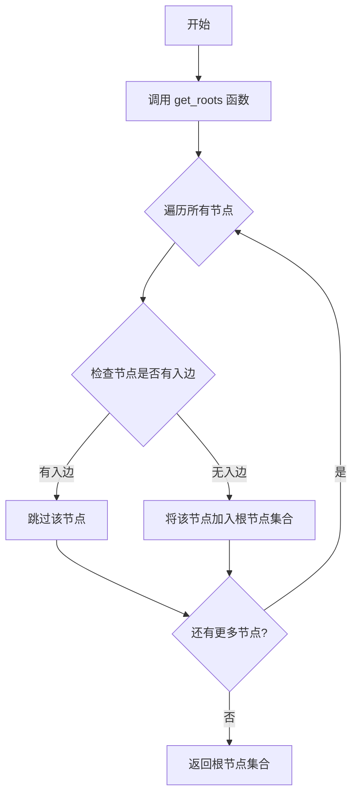
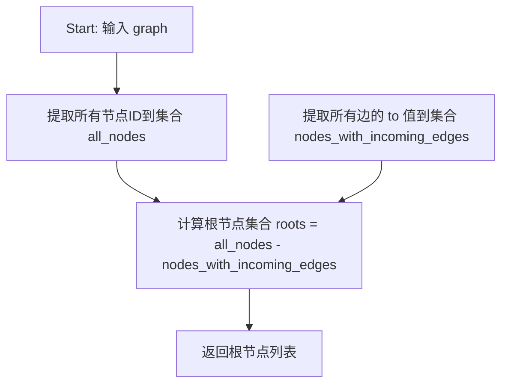
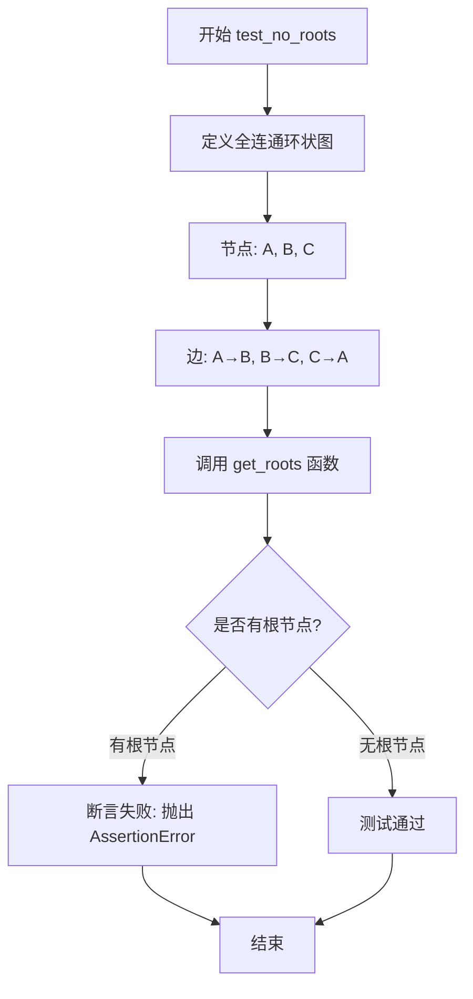

# `.\AutoGPT\classic\benchmark\tests\test_get_roots.py` 详细设计文档

该代码是一个测试模块，用于测试 `agbenchmark.utils.dependencies.graphs` 模块中的 `get_roots` 函数，该函数用于从有向图中找出根节点（没有任何入边的节点）。

## 整体流程



## 类结构

```
该文件为测试模块，无类定义
仅有测试函数：test_get_roots, test_no_roots
```

## 全局变量及字段


### `graph`
    
测试用有向图数据结构，包含节点列表和边列表，用于测试get_roots函数的基本功能

类型：`dict`
    


### `fully_connected_graph`
    
测试用全连通有向图，所有节点形成一个环，用于测试没有根节点的情况

类型：`dict`
    


### `result`
    
存储get_roots函数的返回结果，包含图中所有根节点的集合

类型：`set`
    


    

## 全局函数及方法


### `get_roots`

获取有向图中的根节点（入度为0的节点，即没有任何边指向的节点）。

参数：

- `graph`：`dict`，有向图结构，包含 `nodes`（节点列表）和 `edges`（边列表）。`nodes` 中每个元素包含 `id` 和 `data`；`edges` 中每个元素包含 `from`（源节点）和 `to`（目标节点）。

返回值：`list`，根节点 ID 列表，即没有任何入边的节点。

#### 流程图



#### 带注释源码

```python
def get_roots(graph):
    """
    获取有向图中的根节点（入边为0的节点）。
    
    参数:
        graph: 包含 'nodes' 和 'edges' 的字典
            - nodes: 节点列表，每个节点包含 'id' 和 'data'
            - edges: 边列表，每条边包含 'from' 和 'to'
    
    返回:
        根节点 ID 列表（没有入边的节点）
    """
    # 步骤1: 提取所有节点的 ID
    all_nodes = {node["id"] for node in graph.get("nodes", [])}
    
    # 步骤2: 提取所有有入边的节点（即边的 'to' 端点）
    nodes_with_incoming_edges = {edge["to"] for edge in graph.get("edges", [])}
    
    # 步骤3: 根节点 = 所有节点 - 有入边的节点
    # 根节点的定义：在有向图中，没有任何边指向该节点
    roots = all_nodes - nodes_with_incoming_edges
    
    # 步骤4: 转换为列表返回
    return list(roots)
```


### `test_get_roots`

该测试函数用于验证在正常情况下，`get_roots` 函数能够正确地从有向无环图（DAG）中识别出根节点（即没有任何入边的节点）。

参数： 无

返回值：无（测试函数无返回值，通过断言验证功能）

#### 流程图

```mermaid
flowchart TD
    A[开始测试] --> B[定义测试图结构]
    B --> C[设置4个节点: A, B, C, D]
    C --> D[设置2条边: A→B, B→C]
    D --> E[调用 get_roots 函数]
    E --> F[获取返回值 result]
    F --> G{result == {A, D}?}
    G -->|是| H[测试通过]
    G -->|否| I[测试失败并抛出断言错误]
```

#### 带注释源码

```python
def test_get_roots():
    """
    测试正常情况下获取根节点功能
    验证 get_roots 函数能正确识别图中没有入边的节点
    """
    # 定义一个有向无环图 (DAG) 结构
    # 节点 A: 没有入边，应该是根节点
    # 节点 B: 有来自 A 的入边，不是根节点
    # 节点 C: 有来自 B 的入边，不是根节点
    # 节点 D: 没有任何入边，应该是根节点
    graph = {
        "nodes": [
            {"id": "A", "data": {"category": []}},
            {"id": "B", "data": {"category": []}},
            {"id": "C", "data": {"category": []}},
            {"id": "D", "data": {"category": []}},
        ],
        "edges": [
            {"from": "A", "to": "B"},  # A -> B 表示 A 指向 B，B 有来自 A 的入边
            {"from": "B", "to": "C"},  # B -> C 表示 B 指向 C，C 有来自 B 的入边
        ],
    }

    # 调用被测试的 get_roots 函数，传入图结构
    result = get_roots(graph)
    
    # 断言验证结果：根节点应该是 A 和 D
    # A: 没有入边（edges 中没有指向 A 的边）
    # D: 没有入边（edges 中没有指向 D 的边）
    assert set(result) == {
        "A",
        "D",
    }, f"Expected roots to be 'A' and 'D', but got {result}"
```


### `test_no_roots`

测试全连通环状图（A→B→C→A）没有根节点的情况，验证在环状完全连通图中不存在入度为0的根节点。

参数： 无

返回值：`None`，该测试函数通过断言验证结果，不返回具体值

#### 流程图



#### 带注释源码

```
def test_no_roots():
    """
    测试全连通环状图（A→B→C→A）没有根节点的情况
    
    该测试验证在完全连通的环状图中，
    由于每个节点都有入边（A被C指向，B被A指向，C被B指向），
    因此不存在入度为0的根节点。
    """
    # 定义一个全连通环状图：节点A、B、C，边形成A→B→C→A的环
    fully_connected_graph = {
        "nodes": [
            {"id": "A", "data": {"category": []}},
            {"id": "B", "data": {"category": []}},
            {"id": "C", "data": {"category": []}},
        ],
        "edges": [
            {"from": "A", "to": "B"},
            {"from": "B", "to": "C"},
            {"from": "C", "to": "A"},
        ],
    }

    # 调用 get_roots 函数获取图的根节点
    result = get_roots(fully_connected_graph)
    
    # 断言：期望结果为空（没有根节点），因为每个节点都有入边
    assert not result, "Expected no roots, but found some"
```

## 关键组件


### get_roots 函数

该函数从给定的图结构中识别并返回根节点。根节点定义为没有任何入边的节点，即没有其他节点通过边指向该节点。函数接收一个包含节点和边的图字典，并返回一个包含根节点ID的列表。

### 图数据结构

图数据以字典形式呈现，包含"nodes"和"edges"两个键。nodes是一个列表，每个节点是一个包含"id"和"data"属性的字典；edges是一个列表，每条边是一个包含"from"和"to"属性的字典，表示从源节点到目标节点的有向边。

### 测试用例

测试文件包含两个主要的测试函数和一个被注释掉的测试。test_get_roots验证了在有向无环图中正确识别根节点（A和D）；test_no_roots验证了在全连通环状图中没有根节点的情况。被注释掉的测试可能用于测试更复杂的场景，但目前未启用。


## 问题及建议


### 已知问题

-   **测试覆盖不足**：缺少对空图、单节点图、孤立节点等边界条件的测试用例
-   **异常处理缺失**：未测试图结构不完整（如缺少 `nodes` 或 `edges` 键）时的行为
-   **注释代码存在拼写错误**：第30行的注释 `test_no_rcoots` 拼写错误（应为 `test_no_roots`），且该测试用例被永久注释而非完成
-   **断言信息不够清晰**：断言失败时的错误信息可以更详细，如显示图的实际结构
-   **假设未经验证**：代码假设 `node["data"]["category"]` 存在且为列表，但未进行验证
-   **返回值类型不明确**：未明确 `get_roots` 的返回类型是列表还是其他集合类型

### 优化建议

-   增加边界条件测试用例：空图 `{}`、空节点列表 `{"nodes": [], "edges": []}`、只有孤立节点的图
-   添加异常输入测试：如缺少必需键、节点ID不存在、边引用不存在的节点等
-   完成并启用注释掉的测试用例，或直接删除
-   考虑在测试中添加类型注解，提高代码可读性
-   增强断言的错误信息，包含更多调试上下文

## 其它


### 设计目标与约束

该代码的设计目标是验证`get_roots`函数能够正确识别有向图中的根节点。根节点的定义是没有入边的节点（即没有其他节点指向该节点）。测试用例覆盖了两种场景：存在根节点的情况（A和D）和不存在根节点的循环图情况。约束条件包括：输入必须是符合特定格式的图结构（包含nodes和edges数组），edges中的from和to引用必须对应nodes中存在的id。

### 错误处理与异常设计

测试代码主要通过断言来验证函数行为，而非显式的异常处理。预期的异常场景包括：空的nodes数组应返回空列表；edges中引用的不存在节点id可能导致意外行为；图结构格式不正确时函数可能抛出KeyError或TypeError。当前测试用例未覆盖非法输入的异常处理，建议在生产代码中添加输入验证。

### 数据流与状态机

数据流从输入的图字典开始，流经get_roots函数的处理逻辑，最终输出根节点列表。状态机概念体现在图的遍历过程中：节点分为已访问和未访问状态，边的处理决定节点的入度计数。测试数据流为：输入graph结构 → 解析nodes和edges → 计算每个节点的入度 → 筛选出入度为0的节点 → 返回根节点列表。

### 外部依赖与接口契约

主要外部依赖是`agbenchmark.utils.dependencies.graphs`模块中的`get_roots`函数。接口契约要求：输入参数graph必须是字典类型，包含`nodes`键（数组，每个元素有`id`和`data`字段）和`edges`键（数组，每个元素有`from`和`to`字段）；返回值应为列表类型，包含所有根节点的id。如果输入不符合预期格式，函数行为未定义。

### 性能考虑

当前测试用例规模较小，未涉及性能测试。对于大规模图（数千个节点和边），get_roots函数的时间复杂度应为O(V+E)，其中V为节点数，E为边数。空间复杂度为O(V)，用于存储入度计数和节点集合。建议在文档中明确性能要求，以便在图规模增长时进行性能基准测试。

### 安全性考虑

当前测试代码不涉及用户输入处理或敏感数据操作，安全性风险较低。但需注意：如果get_roots函数处理来自外部的图数据，应验证输入的nodes和edges数组格式，防止恶意构造的深嵌套或大规模数据结构导致内存溢出或拒绝服务攻击。

### 可测试性

测试代码结构良好，使用了清晰的断言和描述性的测试函数名称。test_get_roots和test_no_roots两个用例覆盖了核心功能路径。test_no_rcoots被注释掉，可能是待完成或已废弃的测试用例。建议添加边界条件测试：空图、单节点图、孤立节点等情况。

### 配置信息

测试代码无外部配置文件依赖。所有测试数据直接嵌入在测试函数中。这种方式的优点是测试自包含，缺点是如果需要使用不同的图结构进行测试，需要修改代码。建议未来将测试数据提取为常量或配置。

### 版本兼容性

代码使用了Python 3的字典字面量语法，兼容Python 3.7+版本。依赖的agbenchmark包版本需要与get_roots函数的接口匹配。建议在文档中注明Python版本要求和依赖包版本范围。

### 许可证和版权

测试文件本身未包含许可证或版权信息。作为agbenchmark项目的一部分，应遵循项目的整体许可证。需在文档中注明参考项目的主许可证。


    