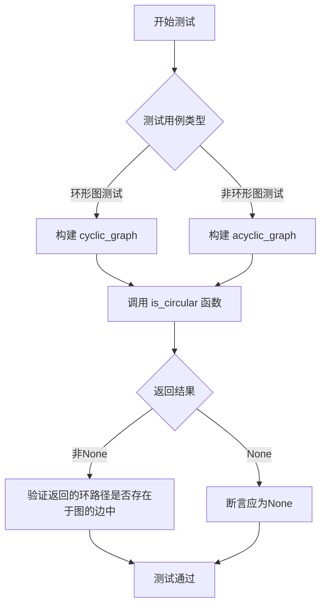
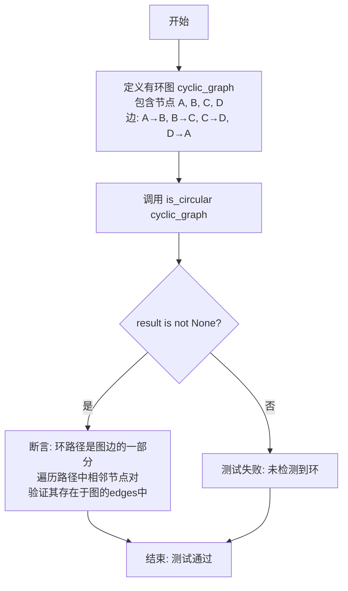
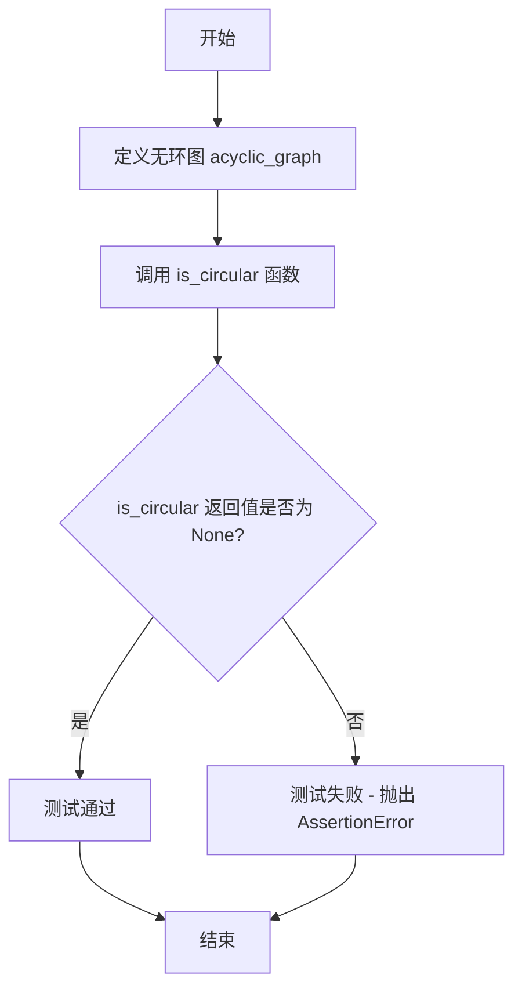
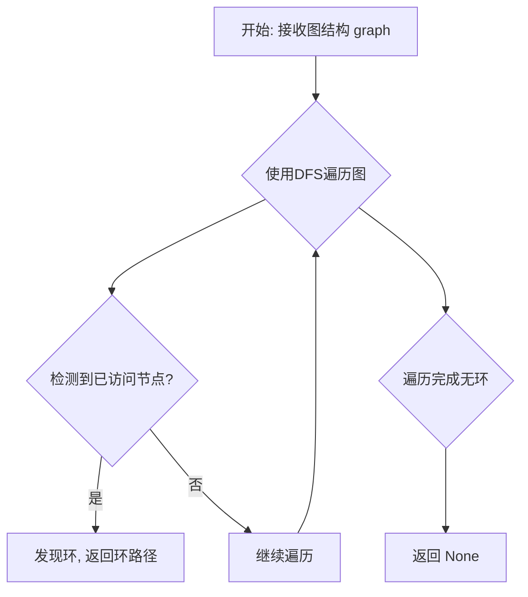

# `.\AutoGPT\classic\benchmark\tests\test_is_circular.py` 详细设计文档

该代码是一个测试文件，用于验证图论中的环检测功能，通过调用 is_circular 函数来判断给定的图结构是否为环形图，并使用多个测试用例（环形图和非环形图）来验证函数的正确性。

## 整体流程



## 类结构

```
测试模块 (无类)
├── test_is_circular (测试函数)
└── test_is_not_circular (测试函数)

被测模块: agbenchmark.utils.dependencies.graphs
└── is_circular (被导入的函数)
```

## 全局变量及字段


### `cyclic_graph`
    
包含节点和边的环形图测试数据，用于测试 is_circular 函数是否能正确检测出循环

类型：`dict`
    


### `acyclic_graph`
    
包含节点和边的非环形图测试数据，用于测试 is_circular 函数在无环图情况下返回 None

类型：`dict`
    


### `result`
    
is_circular 函数的返回值，用于存储检测结果，可能是循环路径列表或 None

类型：`any`
    


### `i`
    
for循环中的索引变量，用于遍历 result 列表以验证检测到的循环路径是否属于图的边

类型：`int`
    


    

## 全局函数及方法


### `test_is_circular`

测试函数，验证 is_circular 能正确检测环形图并返回环路径

参数：

- 该函数无参数

返回值：`None`，无返回值（通过断言验证 is_circular 函数的正确性）

#### 流程图



#### 带注释源码

```
def test_is_circular():
    # 定义一个包含循环的图结构
    # 节点 A -> B -> C -> D -> A 形成一个环
    cyclic_graph = {
        "nodes": [
            {"id": "A", "data": {"category": []}},
            {"id": "B", "data": {"category": []}},
            {"id": "C", "data": {"category": []}},
            {"id": "D", "data": {"category": []}},  # 新增节点
        ],
        "edges": [
            {"from": "A", "to": "B"},
            {"from": "B", "to": "C"},
            {"from": "C", "to": "D"},
            {"from": "D", "to": "A"},  # 这条边创建了循环
        ],
    }

    # 调用 is_circular 函数检测图中是否存在环
    result = is_circular(cyclic_graph)
    
    # 断言1: 确保检测到了环（结果不为 None）
    assert result is not None, "Expected a cycle, but none was detected"
    
    # 断言2: 验证返回的环路径确实是图的边的一部分
    # 遍历路径中的每对相邻节点，检查它们是否存在于原始图的 edges 中
    assert all(
        (
            (result[i], result[i + 1])
            in [(x["from"], x["to"]) for x in cyclic_graph["edges"]]
        )
        for i in range(len(result) - 1)
    ), "The detected cycle path is not part of the graph's edges"
```


### `test_is_not_circular`

测试函数，验证 is_circular 对非环形图返回 None

参数：

- 该函数没有参数

返回值：`None`，测试函数本身不返回值，通过 assert 断言验证 is_circular(acyclic_graph) 返回 None

#### 流程图



#### 带注释源码

```
def test_is_not_circular():
    # 定义一个无环图（acyclic graph）
    # 节点: A, B, C, D
    # 边: A->B, B->C, C->D （没有从 D 返回的边，所以无环）
    acyclic_graph = {
        "nodes": [
            {"id": "A", "data": {"category": []}},
            {"id": "B", "data": {"category": []}},
            {"id": "C", "data": {"category": []}},
            {"id": "D", "data": {"category": []}},  # 新节点
        ],
        "edges": [
            {"from": "A", "to": "B"},
            {"from": "B", "to": "C"},
            {"from": "C", "to": "D"},
            # 没有从 D 指向任何节点的边，因此图保持无环
        ],
    }

    # 断言：is_circular 函数对无环图应返回 None
    # 如果返回非 None 值，则测试失败并抛出 AssertionError
    assert is_circular(acyclic_graph) is None, "Detected a cycle in an acyclic graph"
```


### `is_circular`

检测给定图中是否存在环，并返回构成环的节点路径；如果图中无环则返回 None。

参数：

- `graph`：`Dict`，输入的图结构，包含 `nodes`（节点列表）和 `edges`（边列表）。`nodes` 中的每个节点是包含 `id` 和 `data`（含 `category` 字段）的字典；`edges` 中的每条边是包含 `from`（起始节点 ID）和 `to`（目标节点 ID）的字典。

返回值：`Optional[List[str]]`，如果存在环，返回一个列表，表示环中节点的顺序（如 `["A", "B", "C", "D", "A"]`）；如果不存在环，返回 `None`。

#### 流程图



#### 带注释源码

```
# 由于 is_circular 是从外部模块 agbenchmark.utils.dependencies.graphs 导入的
# 下面是基于测试用例推断的可能实现逻辑

from typing import Dict, List, Optional, Set

def is_circular(graph: Dict) -> Optional[List[str]]:
    """
    检测图中是否存在环
    
    参数:
        graph: 包含 'nodes' 和 'edges' 的字典
            - nodes: 节点列表, 每个节点有 'id' 和 'data'
            - edges: 边列表, 每条边有 'from' 和 'to'
    
    返回:
        环路径列表或 None
    """
    # 构建邻接表
    adjacency = {node["id"]: [] for node in graph["nodes"]}
    for edge in graph["edges"]:
        adjacency[edge["from"]].append(edge["to"])
    
    # DFS 递归检测环
    # 使用三种状态: 0=未访问, 1=正在访问(在当前递归栈中), 2=已完成
    state: Dict[str, int] = {node["id"]: 0 for node in graph["nodes"]}
    path: List[str] = []
    
    def dfs(node: str, current_path: List[str]) -> Optional[List[str]]:
        """
        深度优先搜索检测环
        
        参数:
            node: 当前节点ID
            current_path: 当前递归路径
        
        返回:
            环路径或 None
        """
        state[node] = 1  # 标记为正在访问
        current_path.append(node)
        
        for neighbor in adjacency[node]:
            if state[neighbor] == 1:
                # 发现环: 从当前节点回到路径中的节点
                cycle_start = current_path.index(neighbor)
                return current_path[cycle_start:] + [neighbor]
            elif state[neighbor] == 0:
                result = dfs(neighbor, current_path)
                if result:
                    return result
        
        current_path.pop()  # 回溯
        state[node] = 2  # 标记为已完成
        return None
    
    # 遍历所有节点(处理非连通图)
    for node_id in graph["nodes"]:
        node = node_id["id"]
        if state[node] == 0:
            result = dfs(node, [])
            if result:
                return result
    
    return None
```


## 关键组件


### is_circular 函数

用于检测给定图结构中是否存在循环的函数，通过接收包含节点和边的图数据，返回循环路径或 None

### 循环图测试用例 (test_is_circular)

用于验证 is_circular 函数能够正确检测出包含循环的图，构造了一个 A->B->C->D->A 的循环图

### 非循环图测试用例 (test_is_not_circular)

用于验证 is_circular 函数对无环图返回 None，构造了 A->B->C->D 的线性图结构

### 图数据结构

包含 nodes（节点列表，每个节点有 id 和 data 属性）和 edges（边列表，每条边有 from 和 to 属性）的字典结构

### 循环路径验证逻辑

通过检查返回的循环路径中相邻节点对是否都存在于原始图的边集合中，确保检测结果的正确性


## 问题及建议


### 已知问题

-   **测试数据重复定义**：两个测试函数中的 `nodes` 列表完全相同（A、B、C、D），造成代码冗余，维护时需要同时修改多处
-   **缺乏边界条件测试**：未覆盖空图、单节点图、自环、多重边、不连通图等边界情况
-   **断言逻辑过于复杂**：第二个测试中的断言使用了嵌套的列表推导式和 `all()` 函数，可读性差，难以快速理解验证逻辑
-   **测试覆盖不足**：仅用两个测试用例覆盖循环图和非循环图两种场景，缺乏更多图结构的测试
-   **硬编码测试数据**：图结构直接写在测试函数中，未使用参数化测试或测试数据工厂模式

### 优化建议

-   提取共享的测试数据（如 nodes 列表）为模块级常量或 pytest fixture
-   简化复杂断言，将其拆分为多个独立的断言语句，每个断言对应一个验证点
-   添加边界条件测试用例：空图 `{}`、单节点无边的图、自环图（D->D）、平行边等
-   考虑使用 pytest 的 `@pytest.mark.parametrize` 装饰器来参数化测试用例，减少重复代码
-   增加更多图结构的测试，如多环图、复杂连通图等
-   改进错误消息，使其包含更多上下文信息，便于调试


## 其它


### 设计目标与约束

该模块的核心设计目标是提供一个高效的算法来检测有向图中是否存在环。约束条件包括：输入必须为符合特定JSON结构的有向图（包含nodes和edges数组），其中nodes数组中每个元素需包含id和data字段，edges数组中每个元素需包含from和to字段表示有向边的起点和终点。算法时间复杂度应控制在O(V+E)以内，其中V为节点数，E为边数。

### 错误处理与异常设计

函数应处理以下异常情况：输入参数为None或空字典时返回None；输入图中缺少nodes或edges字段时抛出KeyError；edges中引用的节点不在nodes中时应忽略该边或返回None；当图中存在自环（节点指向自身）时应正确检测为环。

### 数据流与状态机

is_circular函数的数据流如下：输入图结构 → 解析节点和边 → 使用深度优先搜索（DFS）进行环检测 → 返回环路径或None。状态机包含两个状态：遍历状态（VISITING）和已访问状态（VISITED），通过颜色标记机制避免重复访问和正确检测回边。

### 外部依赖与接口契约

该函数位于agbenchmark.utils.dependencies.graphs模块中。外部依赖包括Python标准库（可能使用collections.deque用于BFS或递归栈）。接口契约：输入为dict类型，包含nodes（list）和edges（list）；输出为list类型（环路径节点ID序列）或None（无环）。

### 性能要求与基准

算法应能在包含数千个节点和边的图上在毫秒级时间内完成检测。空间复杂度为O(V)，用于存储访问状态标记。测试用例应覆盖：小型图（<10节点）、中型图（10-100节点）、大型图（>100节点）、稀疏图和密集图。

### 安全性考虑

输入验证应防止恶意构造的超大图导致内存溢出或计算资源耗尽。建议对节点数和边数设置上限（如10000个节点），并对输入结构进行深度检查以防止序列化攻击。

### 兼容性设计

该函数应兼容Python 3.8及以上版本。保持接口向后兼容，不得改变现有返回值结构。图的JSON结构应与前端或外部系统保持一致，建议提供版本号字段以便未来扩展。

### 测试策略

测试策略应包括：单元测试（基础环检测功能）、边界测试（空图、单节点图、只有一条边的图）、异常输入测试（无效结构、None输入）、性能基准测试（不同规模图的执行时间）。测试覆盖率应达到90%以上。

### 配置说明

当前版本无外部配置项。图的输入结构通过代码注释和文档说明。后续可能添加的配置项包括：最大节点数限制、递归深度限制、是否返回完整环路径等。

### 术语表

环（Cycle）：在有向图中，从某节点出发沿边可以回到该节点形成的路径。自环（Self-loop）：节点指向自身的边。环路径（Cycle Path）：构成环的节点序列。DAG（有向无环图）：Directed Acyclic Graph的缩写。

### 参考资料

图算法相关：环检测通常使用DFS或Floyd判圈算法。测试文件位置：tests/utils/test_graphs.py（推测）。相关模块：agbenchmark.utils.dependencies（依赖图分析工具集）。


    