# `.\AutoGPT\classic\cli.py` 详细设计文档

这是一个基于 Click 库构建的轻量级命令行工具（CLI），用于自动化管理 AutoGPT 项目的代理生命周期（包括创建、启动、停止和列表查看）以及执行基准测试。

## 整体流程

```mermaid
graph TD
    Start([用户执行命令]) --> Root{cli.py}
    Root --> Setup[setup 命令]
    Root --> Agent[agent 子命令]
    Root --> Benchmark[benchmark 子命令]
    %% Agent Flow %%
    Agent --> Create[agent create]
    Create --> CheckName{名称正则?}
    CheckName -- 失败 --> CreateErr[提示错误]
    CheckName -- 成功 --> CopyForge[复制 ./forge 模板]
    Agent --> Start[agent start]
    Start --> CheckAgent{Agent存在?}
    CheckAgent -- 否 --> StartErr[提示不存在]
    CheckAgent -- 是 --> RunSetup[执行 setup]
    RunSetup --> RunScript[执行 ./run]
    RunSetup --> WaitPort[wait_until_conn_ready(8000)]
    Agent --> Stop[agent stop]
    Stop --> Kill8000[kill port 8000]
    Stop --> Kill8080[kill port 8080]
    Agent --> List[agent list]
    List --> ScanDir[扫描 ./agents 目录]
    %% Benchmark Flow %%
    Benchmark --> BenchStart[benchmark start]
    Benchmark --> BenchCats[benchmark categories]
    Benchmark --> BenchTests[benchmark tests]
    BenchCats --> GlobJson[递归查找 data.json]
    BenchTests --> GlobJson2[递归查找 data.json]
    BenchTests --> ParseJson[解析 JSON 获取详情]
```

## 类结构

```
cli (根命令组)
├── setup (安装命令)
├── agent (代理管理子组)
│   ├── create (创建代理)
│   ├── start (启动代理)
│   ├── stop (停止代理)
│   └── list (列出代理)
└── benchmark (基准测试子组)
    ├── start (运行基准测试)
    ├── categories (分类子组)
    │   └── list (列出分类)
    └── tests (测试子组)
        ├── list (列出测试)
        └── details (测试详情)
```

## 全局变量及字段


### `script_dir`
    
当前脚本目录路径

类型：`str`
    


### `setup_script`
    
setup.sh 完整路径

类型：`str`
    


### `install_error`
    
布尔值，标记安装是否出错

类型：`bool`
    


### `new_agent_dir`
    
新代理的目标目录

类型：`str`
    


### `agent_dir`
    
代理运行的目录

类型：`str`
    


### `run_command`
    
代理运行脚本路径

类型：`str`
    


### `pids`
    
进程ID列表，用于停止进程

类型：`bytes`
    


    

## 全局函数及方法


### `cli`

这是使用 Click 库定义的命令行接口（CLI）的根命令组，作为所有子命令的入口点，没有任何实际操作，仅用于挂载子命令。

参数：無

返回值：`None`，因为函数体只有 `pass`，不返回任何值。

#### 流程图

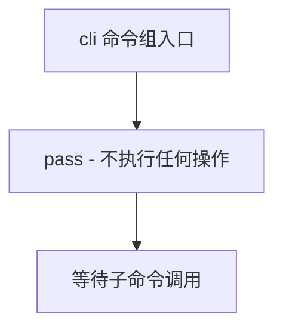

#### 带注释源码

```python
@click.group()
def cli():
    """
    命令行接口的根命令组。
    使用 Click 库的 @click.group() 装饰器将 cli 函数定义为一个命令组。
    该命令组本身不执行任何操作，仅作为容器来注册和组织子命令（如 setup、agent、benchmark 等）。
    """
    pass
```


### `setup`

该函数是 AutoGPT 项目的 CLI 工具中的一个命令，用于在用户的系统上安装项目所需的依赖项。它通过检查并执行项目根目录下的 `setup.sh` 脚本来完成安装过程，并提供详细的进度和错误提示信息。

参数： 无

返回值：`None`，无返回值，仅执行副作用操作

#### 流程图

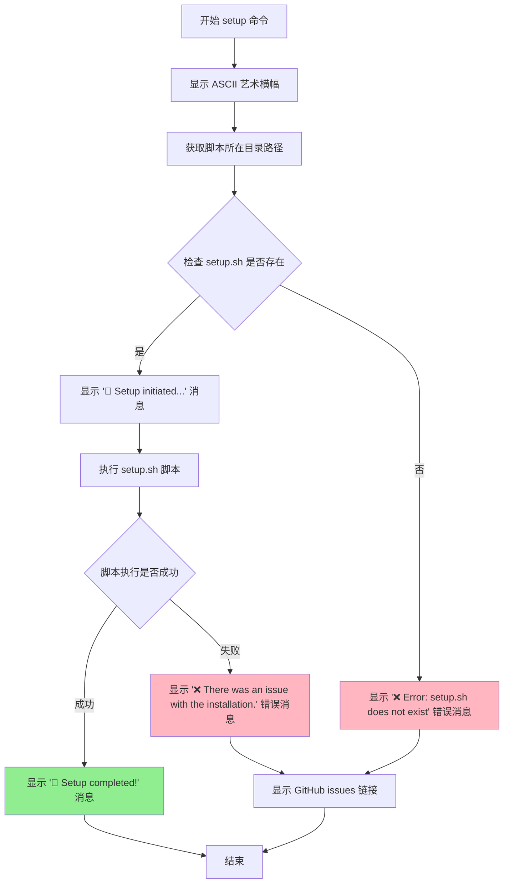

#### 带注释源码

```python
@cli.command()
def setup():
    """
    Installs dependencies needed for your system. Works with Linux, MacOS and Windows WSL.
    """
    import os
    import subprocess

    # 打印 ASCII 艺术横幅，使用绿色前景色
    click.echo(
        click.style(
            """
       d8888          888             .d8888b.  8888888b. 88888888888 
      d88888          888            d88P  Y88b 888   Y88b    888     
     d88P888          888            888    888 888    888    888     
    d88P 888 888  888 888888 .d88b.  888        888   d88P    888     
   d88P  888 888  888 888   d88""88b 888  88888 8888888P"     888     
  d88P   888 888  888 888   888  888 888    888 888           888     
 d8888888888 Y88b 888 Y88b. Y88..88P Y88b  d88P 888           888     
d88P     888  "Y88888  "Y888 "Y88P"   "Y8888P88 888           888     
                                                                                                                                       
""",
            fg="green",
        )
    )

    # 获取当前脚本所在的目录路径
    script_dir = os.path.dirname(os.path.realpath(__file__))
    # 拼接 setup.sh 脚本的完整路径
    setup_script = os.path.join(script_dir, "setup.sh")
    # 初始化安装错误标志
    install_error = False
    
    # 检查 setup.sh 文件是否存在
    if os.path.exists(setup_script):
        # 显示启动消息
        click.echo(click.style("🚀 Setup initiated...\n", fg="green"))
        try:
            # 执行 setup.sh 脚本
            subprocess.check_call([setup_script], cwd=script_dir)
        except subprocess.CalledProcessError:
            # 捕获执行失败异常，显示错误消息
            click.echo(
                click.style("❌ There was an issue with the installation.", fg="red")
            )
            install_error = True
    else:
        # setup.sh 不存在时显示错误
        click.echo(
            click.style(
                "❌ Error: setup.sh does not exist in the current directory.", fg="red"
            )
        )
        install_error = True

    # 根据安装是否出错显示相应消息
    if install_error:
        # 显示帮助信息，引导用户去 GitHub 提 issue
        click.echo(
            click.style(
                "\n\n🔴 If you need help, please raise a ticket on GitHub at https://github.com/Significant-Gravitas/AutoGPT/issues\n\n",
                fg="magenta",
                bold=True,
            )
        )
    else:
        # 安装成功完成
        click.echo(click.style("🎉 Setup completed!\n", fg="green"))
```


### `agent`

Commands to create, start and stop agents

参数：

- 无

返回值：`None`，Click 命令组本身不返回值

#### 流程图

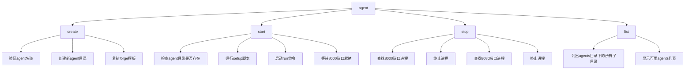

#### 带注释源码

```python
@cli.group()
def agent():
    """Commands to create, start and stop agents"""
    pass
```

---

**补充说明：**

`agent` 是一个 Click 命令组（Command Group），它本身不执行任何具体操作，而是作为一个容器来组织相关的子命令。该命令组包含以下四个子命令：

| 子命令 | 功能描述 |
|--------|----------|
| `create` | 创建一个新的 agent，从 `./forge` 模板复制并创建 `./agents/{agent_name}` 目录 |
| `start` | 启动指定的 agent，运行其目录下的 `./setup` 和 `./run` 脚本 |
| `stop` | 停止正在运行的 agent，终止占用 8000 和 8080 端口的进程 |
| `list` | 列出所有可用的 agents |


### `agent.create`

该函数是 CLI 命令 `agent create` 的实现，用于根据提供的名称创建新的 agent 项目。它首先验证 agent 名称是否符合规范（仅允许字母、数字和下划线），然后将 `./forge` 模板目录复制到 `./agents/{agent_name}` 来创建新 agent。

参数：

- `agent_name`：`str`，要创建的 agent 名称，作为命令行参数传入

返回值：`None`，该函数通过 Click 的 `click.echo` 输出结果，不返回任何值

#### 流程图

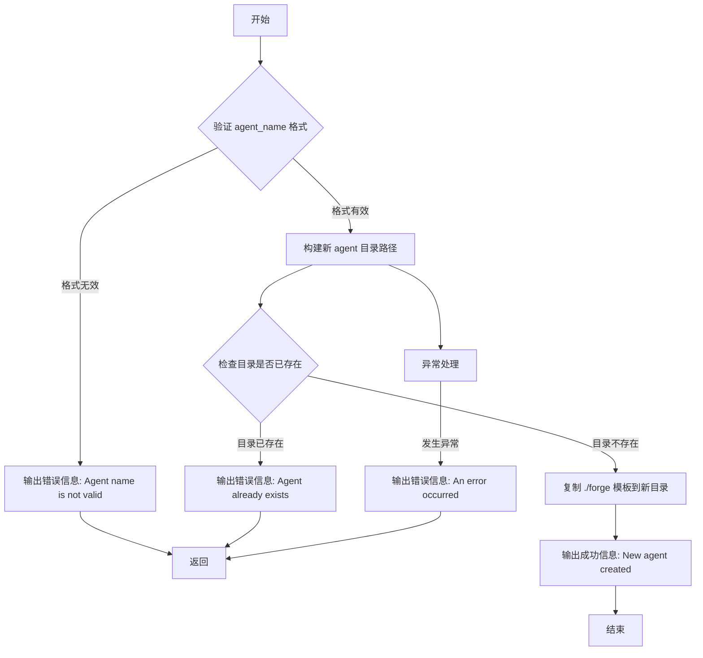

#### 带注释源码

```python
@agent.command()
@click.argument("agent_name")
def create(agent_name: str):
    """Create's a new agent with the agent name provided"""
    # 导入所需的模块
    import os
    import re
    import shutil

    # 验证 agent 名称是否合法：只允许字母、数字和下划线
    if not re.match(r"\w*$", agent_name):
        # 名称不合法，输出错误信息并提前返回
        click.echo(
            click.style(
                f"😞 Agent name '{agent_name}' is not valid. It should not contain spaces or special characters other than -_",
                fg="red",
            )
        )
        return
    
    try:
        # 构建新 agent 的目录路径
        new_agent_dir = f"./agents/{agent_name}"
        # 构建新 agent 的配置文件名（虽然定义了但未使用）
        new_agent_name = f"{agent_name.lower()}.json"

        # 检查目标目录是否已存在
        if not os.path.exists(new_agent_dir):
            # 目录不存在，从 forge 模板复制创建新 agent
            shutil.copytree("./forge", new_agent_dir)
            # 输出成功信息
            click.echo(
                click.style(
                    f"🎉 New agent '{agent_name}' created. The code for your new agent is in: agents/{agent_name}",
                    fg="green",
                )
            )
        else:
            # 目录已存在，输出错误信息
            click.echo(
                click.style(
                    f"😞 Agent '{agent_name}' already exists. Enter a different name for your agent, the name needs to be unique regardless of case",
                    fg="red",
                )
            )
    except Exception as e:
        # 捕获所有异常并输出错误信息
        click.echo(click.style(f"😢 An error occurred: {e}", fg="red"))
```


### `agent.start`

该函数是 AutoGPT CLI 工具中的一个命令，用于启动指定的代理（agent）。它会检查代理目录和必要的运行脚本是否存在，如果存在则执行 setup 脚本（除非设置了 `--no-setup` 标志），然后启动代理应用并等待其就绪。

参数：

- `agent_name`：`str`，要启动的代理名称
- `no_setup`：`bool`，一个布尔标志，指定是否跳过运行 setup 脚本

返回值：`None`，该函数没有返回值，通过 `click.echo` 输出信息到控制台

#### 流程图

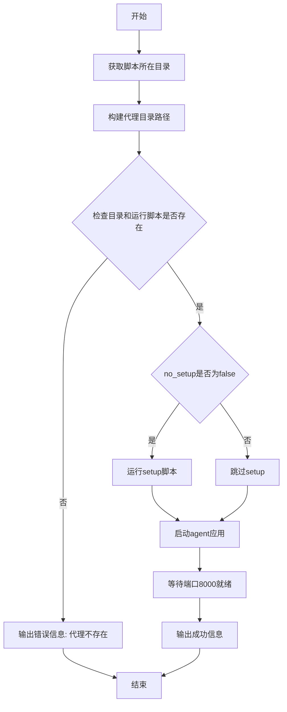

#### 带注释源码

```python
@agent.command()
@click.argument("agent_name")
@click.option(
    "--no-setup",
    is_flag=True,
    help="Disables running the setup script before starting the agent",
)
def start(agent_name: str, no_setup: bool):
    """Start agent command"""
    # 导入所需的模块
    import os
    import subprocess

    # 获取当前脚本所在的目录路径
    script_dir = os.path.dirname(os.path.realpath(__file__))
    
    # 根据agent_name构建代理目录的完整路径
    # 如果agent_name不是"original_autogpt"或"forge"，则使用agents/{agent_name}路径
    agent_dir = os.path.join(
        script_dir,
        f"agents/{agent_name}"
        if agent_name not in ["original_autogpt", "forge"]
        else agent_name,
    )
    
    # 构建run和run_benchmark脚本的完整路径
    run_command = os.path.join(agent_dir, "run")
    run_bench_command = os.path.join(agent_dir, "run_benchmark")
    
    # 检查代理目录、run和run_benchmark文件是否都存在
    if (
        os.path.exists(agent_dir)
        and os.path.isfile(run_command)
        and os.path.isfile(run_bench_command)
    ):
        # 切换到代理目录
        os.chdir(agent_dir)
        
        # 如果no_setup为False，则运行setup脚本
        if not no_setup:
            click.echo(f"⌛ Running setup for agent '{agent_name}'...")
            setup_process = subprocess.Popen(["./setup"], cwd=agent_dir)
            setup_process.wait()  # 等待setup完成
            click.echo()

        # 注意: benchmark服务器启动代码被注释掉了
        # FIXME: Doesn't work: Command not found: agbenchmark
        # subprocess.Popen(["./run_benchmark", "serve"], cwd=agent_dir)
        # click.echo("⌛ (Re)starting benchmark server...")
        # wait_until_conn_ready(8080)
        # click.echo()

        # 启动agent应用
        subprocess.Popen(["./run"], cwd=agent_dir)
        click.echo(f"⌛ (Re)starting agent '{agent_name}'...")
        
        # 等待agent在8000端口就绪
        wait_until_conn_ready(8000)
        
        # 输出成功信息
        click.echo("✅ Agent application started and available on port 8000")
    
    # 如果代理目录不存在
    elif not os.path.exists(agent_dir):
        click.echo(
            click.style(
                f"😞 Agent '{agent_name}' does not exist. Please create the agent first.",
                fg="red",
            )
        )
    
    # 如果目录存在但run命令不存在
    else:
        click.echo(
            click.style(
                f"😞 Run command does not exist in the agent '{agent_name}' directory.",
                fg="red",
            )
        )
```


### `agent.stop`

该函数是 Click 命令行工具中的一个子命令，用于停止在特定端口（8000 和 8080）上运行的代理进程。它通过调用 `lsof` 命令查找占用这些端口的进程，然后使用 `SIGTERM` 信号终止这些进程。

参数：

- （无参数）

返回值：`None`，无返回值（Click 命令的回调函数）

#### 流程图

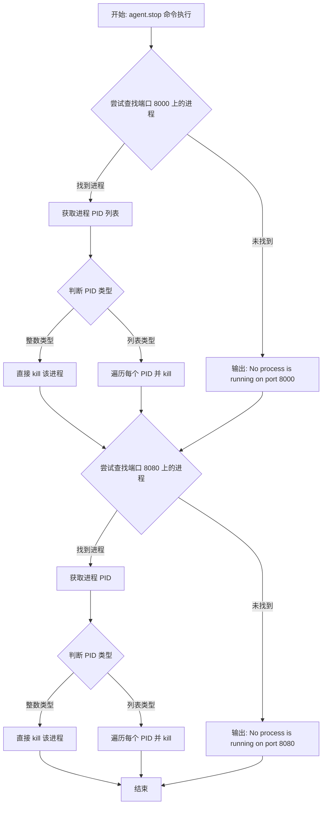

#### 带注释源码

```python
@agent.command()
def stop():
    """Stop agent command"""
    # 导入所需的系统级模块
    import os
    import signal
    import subprocess

    # 尝试停止端口 8000 上的进程
    try:
        # 使用 lsof 命令查找占用端口 8000 的进程 PID
        # -t: 只输出 PID
        # -i: 指定网络接口/端口
        pids = subprocess.check_output(["lsof", "-t", "-i", ":8000"]).split()
        
        # 检查返回的 PID 类型
        if isinstance(pids, int):
            # 如果是单个整数 PID，直接终止该进程
            os.kill(int(pids), signal.SIGTERM)
        else:
            # 如果是多个 PID（字节串列表），遍历并终止每个进程
            for pid in pids:
                os.kill(int(pid), signal.SIGTERM)
                
    except subprocess.CalledProcessError:
        # 如果 lsof 未找到占用端口 8000 的进程，捕获异常并提示用户
        click.echo("No process is running on port 8000")

    # 尝试停止端口 8080 上的进程
    try:
        # 使用 lsof 命令查找占用端口 8080 的进程 PID
        pids = int(subprocess.check_output(["lsof", "-t", "-i", ":8080"]))
        
        # 检查返回的 PID 类型
        if isinstance(pids, int):
            # 如果是单个整数 PID，直接终止该进程
            os.kill(int(pids), signal.SIGTERM)
        else:
            # 如果是多个 PID（字节串列表），遍历并终止每个进程
            for pid in pids:
                os.kill(int(pid), signal.SIGTERM)
                
    except subprocess.CalledProcessError:
        # 如果 lsof 未找到占用端口 8080 的进程，捕获异常并提示用户
        click.echo("No process is running on port 8080")
```

---

### 潜在技术债务与优化空间

1. **类型检查逻辑错误**：在第二个 try 块中，`subprocess.check_output()` 返回的是字节串，`int()` 转换会失败，因为第一次已经用了 `.split()` 返回列表，第二次直接用 `int()` 转换字节串会导致 `TypeError`。

2. **平台依赖性**：该函数依赖 `lsof` 命令，这是 Unix/Linux 系统的工具，在 Windows 上不可用。

3. **缺少错误处理**：如果 `os.kill()` 失败（例如进程已退出或权限不足），没有对应的异常处理。

4. **信号量使用**：可以考虑使用 `SIGKILL` 作为后备方案，或者先发送 `SIGTERM` 等待一段时间后再发送 `SIGKILL` 确保进程终止。

5. **重复代码**：两个端口的处理逻辑几乎相同，可以提取为单独的函数以提高代码复用性。


### `agent.list`

该命令用于列出所有可用的代理（agents），包括用户创建的代理和原始的 autogpt 代理。

参数：

- 该函数没有参数

返回值：`None`，无返回值，仅通过命令行输出代理列表信息

#### 流程图

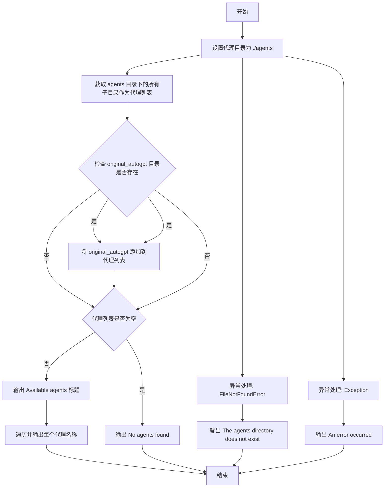

#### 带注释源码

```python
@agent.command()
def list():
    """List agents command"""
    import os  # 导入 os 模块用于文件系统操作

    try:
        # 设置代理目录路径
        agents_dir = "./agents"
        
        # 获取 agents 目录下的所有子目录（代理）
        agents_list = [
            d
            for d in os.listdir(agents_dir)
            if os.path.isdir(os.path.join(agents_dir, d))
        ]
        
        # 检查 original_autogpt 目录是否存在，如存在则添加到列表
        if os.path.isdir("./original_autogpt"):
            agents_list.append("original_autogpt")
        
        # 如果代理列表不为空，遍历输出所有代理名称
        if agents_list:
            click.echo(click.style("Available agents: 🤖", fg="green"))
            for agent in agents_list:
                click.echo(click.style(f"\t🐙 {agent}", fg="blue"))
        else:
            # 代理列表为空时输出提示信息
            click.echo(click.style("No agents found 😞", fg="red"))
            
    except FileNotFoundError:
        # 处理 agents 目录不存在的异常
        click.echo(click.style("The agents directory does not exist 😢", fg="red"))
    except Exception as e:
        # 处理其他可能的异常
        click.echo(click.style(f"An error occurred: {e} 😢", fg="red"))
```


### `benchmark`

这是 CLI 的一个命令组（group），用于管理基准测试相关操作，包含启动基准测试、列出测试类别和测试用例等子命令。

参数：
- 无（该函数为 CLI 装饰器定义的命令组，不接受任何参数）

返回值：`None`，该函数为 Click 命令组的入口点，使用 `pass` 语句，不返回任何值

#### 流程图

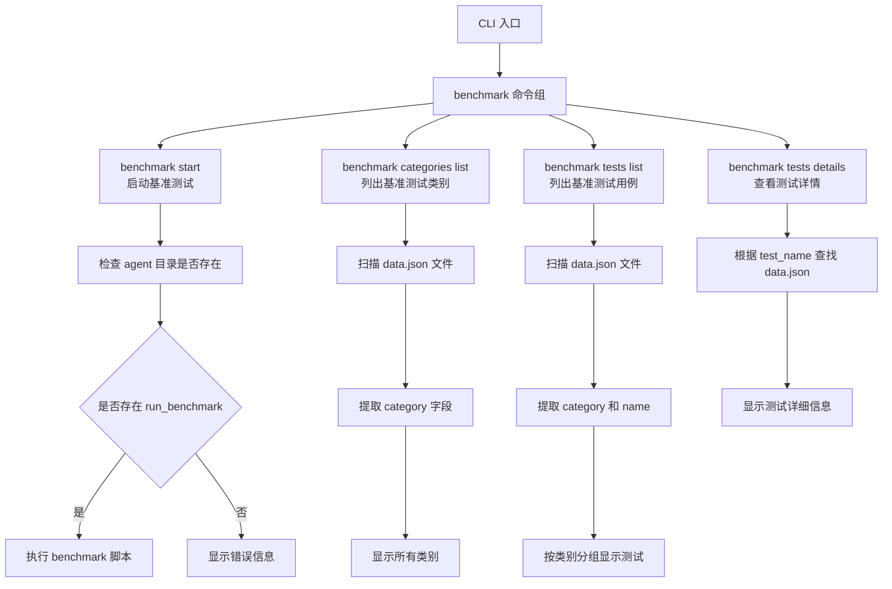

#### 带注释源码

```python
@cli.group()
def benchmark():
    """
    Commands to start the benchmark and list tests and categories
    
    这是一个 Click 命令组（group），作为基准测试的父命令。
    使用 @cli.group() 装饰器定义，允许包含多个子命令。
    该命令本身不执行任何逻辑，仅作为子命令的容器。
    
    子命令包括：
    - start: 启动指定 agent 的基准测试
    - categories list: 列出所有基准测试类别
    - tests list: 列出所有基准测试用例
    - tests details: 显示特定测试的详细信息
    """
    pass
```


### `benchmark.start`

该命令用于启动指定代理的基准测试。它接受代理名称和可选的子进程参数，验证代理目录和基准测试脚本是否存在，然后通过子进程执行基准测试脚本。

参数：

- `agent_name`：`str`，要启动基准测试的代理名称
- `subprocess_args`：`tuple`，传递给基准测试脚本的子进程参数（可变长度参数）

返回值：`None`，该命令不返回任何值，仅通过 `click.echo` 输出状态信息

#### 流程图

```mermaid
flowchart TD
    A[开始] --> B[获取脚本所在目录]
    B --> C{agent_name是否为<br>'original_autogpt'或'forge'}
    C -->|是| D[agent_dir = agent_name]
    C -->|否| E[agent_dir = agents/{agent_name}]
    D --> F[构造benchmark_script路径]
    E --> F
    F --> G{agent_dir存在<br>且benchmark_script是文件}
    G -->|是| H[切换到agent_dir目录]
    G -->|否| I[输出错误信息: 代理不存在]
    H --> J[使用subprocess.Popen<br>执行benchmark_script]
    J --> K[输出成功信息]
    K --> L[结束]
    I --> L
```

#### 带注释源码

```python
@benchmark.command(
    context_settings=dict(
        ignore_unknown_options=True,  # 允许传递未知选项给子进程
    )
)
@click.argument("agent_name")  # 第一个参数：代理名称
@click.argument("subprocess_args", nargs=-1, type=click.UNPROCESSED)  # 剩余参数作为子进程参数
def start(agent_name, subprocess_args):
    """Starts the benchmark command"""
    import os
    import subprocess

    # 获取当前脚本所在目录的绝对路径
    script_dir = os.path.dirname(os.path.realpath(__file__))
    
    # 根据代理名称确定代理目录路径
    # 如果是 'original_autogpt' 或 'forge'，则直接在脚本目录下
    # 否则在 agents 子目录下
    agent_dir = os.path.join(
        script_dir,
        f"agents/{agent_name}"
        if agent_name not in ["original_autogpt", "forge"]
        else agent_name,
    )
    
    # 构建基准测试脚本的完整路径
    benchmark_script = os.path.join(agent_dir, "run_benchmark")
    
    # 检查代理目录是否存在以及基准测试脚本是否为有效文件
    if os.path.exists(agent_dir) and os.path.isfile(benchmark_script):
        # 切换到代理目录
        os.chdir(agent_dir)
        
        # 使用子进程启动基准测试脚本，传递额外参数
        subprocess.Popen([benchmark_script, *subprocess_args], cwd=agent_dir)
        
        # 输出成功启动信息，使用绿色样式
        click.echo(
            click.style(
                f"🚀 Running benchmark for '{agent_name}' with subprocess arguments: {' '.join(subprocess_args)}",
                fg="green",
            )
        )
    else:
        # 代理不存在，输出错误信息，使用红色样式
        click.echo(
            click.style(
                f"😞 Agent '{agent_name}' does not exist. Please create the agent first.",
                fg="red",
            )
        )
```


### `benchmark_categories`

这是一个 Click 命令组的定义函数，用于创建 `benchmark` 命令下的 `categories` 子命令组。该函数没有直接的功能实现，仅作为子命令的容器，用于组织 `benchmark categories list` 等子命令，实现命令行接口的层次结构。

参数：
- 无显式参数（Click 命令组隐式接收上下文参数）

返回值：`None`，因为这是 Click 命令组的定义函数，不直接执行功能。

#### 流程图

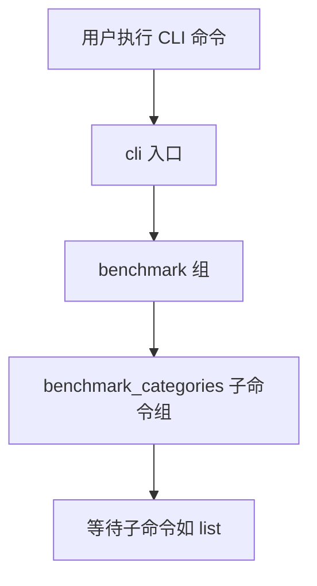

#### 带注释源码

```python
@benchmark.group(name="categories")
def benchmark_categories():
    """Benchmark categories group command"""
    pass
```

**注释说明：**
- `@benchmark.group(name="categories")`：装饰器，将此函数注册为 `benchmark` 命令的子命令组，名称为 `categories`
- `def benchmark_categories():`：函数定义，作为 Click 命令组的入口点
- `"""Benchmark categories group command"""`：函数的文档字符串，描述此命令组的用途
- `pass`：空函数体，因为此函数仅用于定义命令结构，不包含实际执行逻辑


### `benchmark_categories_list`

该函数是一个 Click 命令，用于列出所有可用的基准测试类别。它通过递归扫描 `benchmark/agbenchmark/challenges` 目录下的 `data.json` 文件（排除 deprecated 目录），从每个 JSON 文件中提取 "category" 字段，将所有类别收集到集合中（去重），然后打印出来。

参数：无

返回值：`None`，该函数不返回值，仅通过 `click.echo` 输出类别列表到控制台

#### 流程图

```mermaid
flowchart TD
    A[开始] --> B[获取当前文件所在目录 this_dir]
    B --> C[构建 glob 路径模式<br/>/benchmark/agbenchmark/challenges/**/[!deprecated]*/data.json]
    C --> D[初始化空集合 categories]
    D --> E{遍历 glob 匹配的文件}
    E -->|对于每个 data_file| F{检查文件是否包含 deprecated}
    F -->|不包含| G[打开并读取 JSON 文件]
    F -->|包含| E
    G --> H{尝试解析 JSON}
    H -->|成功| I[从 data 中获取 category 列表<br/>data.getcategory]
    I --> J[将类别添加到 categories 集合]
    H -->|JSONDecodeError| K[打印错误信息<br/>data_file 不是有效 JSON]
    H -->|IOError| L[打印 IOError 信息<br/>文件无法读取]
    K --> E
    L --> E
    J --> E
    E --> M{是否存在 categories}
    M -->|是| N[打印 Available categories 标题]
    M -->|否| O[打印 No categories found]
    N --> P[遍历 categories 集合]
    P --> Q[打印每个类别名称]
    Q --> R[结束]
    O --> R
```

#### 带注释源码

```python
@benchmark_categories.command(name="list")
def benchmark_categories_list():
    """List benchmark categories command"""
    import glob
    import json
    import os

    categories = set()  # 使用集合存储类别，自动去重

    # 获取当前脚本文件所在目录的绝对路径
    this_dir = os.path.dirname(os.path.abspath(__file__))

    # 构建 glob 匹配路径：
    # 递归匹配 benchmark/agbenchmark/challenges 目录下所有子目录中的 data.json
    # [!deprecated] 表示排除名称中包含 'deprecated' 的目录
    glob_path = os.path.join(
        this_dir,
        "./benchmark/agbenchmark/challenges/**/[!deprecated]*/data.json",
    )
    # 遍历所有匹配的文件路径，recursive=True 启用递归匹配
    for data_file in glob.glob(glob_path, recursive=True):
        if "deprecated" not in data_file:  # 再次检查确保排除 deprecated 目录
            with open(data_file, "r") as f:
                try:
                    data = json.load(f)  # 尝试解析 JSON 数据
                    # 从 data 中获取 category 字段（可能是一个列表）
                    # 使用 update 将所有类别添加到集合中
                    categories.update(data.get("category", []))
                except json.JSONDecodeError:
                    # 处理 JSON 解析错误
                    print(f"Error: {data_file} is not a valid JSON file.")
                    continue
                except IOError:
                    # 处理文件读取 IO 错误
                    print(f"IOError: file could not be read: {data_file}")
                    continue

    # 检查是否找到任何类别
    if categories:
        # 使用 click 库打印绿色标题
        click.echo(click.style("Available categories: 📚", fg="green"))
        # 遍历并打印每个类别名称
        for category in categories:
            click.echo(click.style(f"\t📖 {category}", fg="blue"))
    else:
        # 没有找到类别时打印红色提示信息
        click.echo(click.style("No categories found 😞", fg="red"))
```


### `benchmark_tests`

这是一个 Click 命令组函数，用于在 CLI 中注册 `benchmark tests` 子命令，允许多个子命令如 `list` 和 `details` 挂载在该组下。

参数：无

返回值：`None`，该函数仅注册命令组，不返回任何值。

#### 流程图

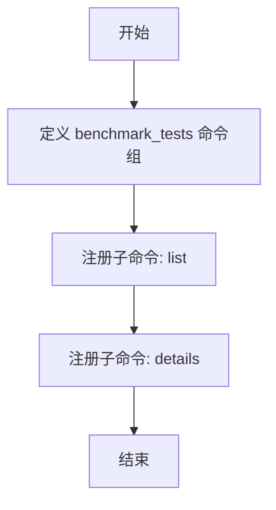

#### 带注释源码

```python
@benchmark.group(name="tests")
def benchmark_tests():
    """
    Benchmark tests group command
    
    这是一个 Click 命令组，用于组织与基准测试相关的子命令。
    该函数本身不执行任何逻辑，仅作为子命令的容器。
    """
    pass
```


### `benchmark_tests_list`

列出所有可用的基准测试，并以分类形式展示测试名称。

参数：

- 该函数无参数

返回值：`None`，该函数通过 `click.echo` 直接输出到控制台，无返回值

#### 流程图

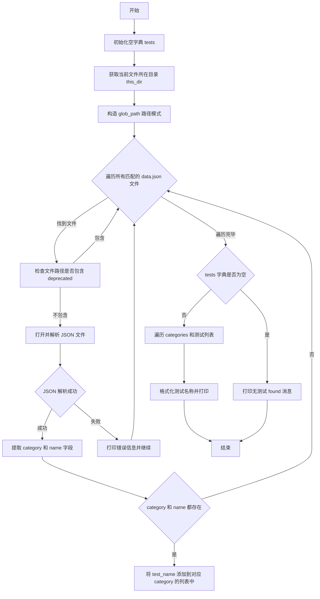

#### 带注释源码

```python
@benchmark_tests.command(name="list")
def benchmark_tests_list():
    """List benchmark tests command"""
    # 导入必要的标准库模块
    import glob
    import json
    import os
    import re

    # 初始化存储测试的字典，键为分类名，值为测试名列表
    tests = {}

    # 获取当前文件所在的目录路径
    this_dir = os.path.dirname(os.path.abspath(__file__))

    # 构造 glob 匹配路径，查找所有非 deprecated 目录下的 data.json 文件
    glob_path = os.path.join(
        this_dir,
        "./benchmark/agbenchmark/challenges/**/[!deprecated]*/data.json",
    )
    # 使用递归 glob 模式遍历匹配的文件，排除 deprecated 目录
    for data_file in glob.glob(glob_path, recursive=True):
        if "deprecated" not in data_file:
            # 以只读模式打开 JSON 文件
            with open(data_file, "r") as f:
                try:
                    # 解析 JSON 数据
                    data = json.load(f)
                    # 获取分类信息（可能为列表）
                    category = data.get("category", [])
                    # 获取测试名称
                    test_name = data.get("name", "")
                    # 仅当分类和测试名称都存在时处理
                    if category and test_name:
                        # 如果分类不存在于字典中，初始化为空列表
                        if category[0] not in tests:
                            tests[category[0]] = []
                        # 将测试名添加到对应分类的列表中
                        tests[category[0]].append(test_name)
                except json.JSONDecodeError:
                    # 处理无效 JSON 文件的情况
                    print(f"Error: {data_file} is not a valid JSON file.")
                    continue
                except IOError:
                    # 处理文件无法读取的 IO 错误
                    print(f"IOError: file could not be read: {data_file}")
                    continue

    # 检查是否找到任何测试
    if tests:
        # 使用绿色样式打印可用测试标题
        click.echo(click.style("Available tests: 📚", fg="green"))
        # 遍历每个分类及其测试列表
        for category, test_list in tests.items():
            # 打印分类名称（蓝色）
            click.echo(click.style(f"\t📖 {category}", fg="blue"))
            # 遍历并排序测试列表
            for test in sorted(test_list):
                # 使用正则表达式将驼峰命名转换为空格分隔的字符串
                test_name = (
                    " ".join(word for word in re.split("([A-Z][a-z]*)", test) if word)
                    .replace("_", "")
                    .replace("C L I", "CLI")
                    .replace("  ", " ")
                )
                # 对测试名称进行左对齐填充（宽度40）
                test_name_padded = f"{test_name:<40}"
                # 打印测试名称和原始名称（青色）
                click.echo(click.style(f"\t\t🔬 {test_name_padded} - {test}", fg="cyan"))
    else:
        # 未找到测试时打印提示信息（红色）
        click.echo(click.style("No tests found 😞", fg="red"))
```


### `benchmark_tests_details`

该函数是 CLI 命令，用于显示指定基准测试的详细信息，包括测试名称、类别、任务描述、依赖项、截止时间、测试条件（答案、应包含/不应包含的内容、文件、评估类型）以及元信息（难度、描述、副作用）。

参数：

- `test_name`：`str`，要查询详细信息的基准测试名称

返回值：`None`，该函数无返回值，仅通过 `click.echo` 输出信息到控制台

#### 流程图

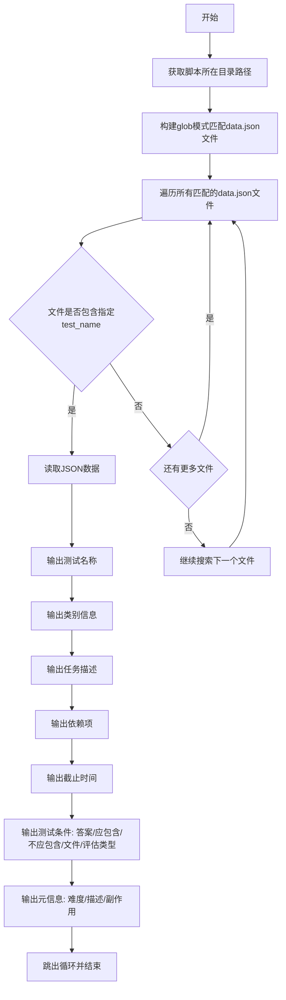

#### 带注释源码

```python
@benchmark_tests.command(name="details")
@click.argument("test_name")
def benchmark_tests_details(test_name):
    """Benchmark test details command"""
    import glob
    import json
    import os

    # 获取当前脚本文件所在的目录路径
    this_dir = os.path.dirname(os.path.abspath(__file__))

    # 构建glob模式，匹配benchmark目录下所有非deprecated的data.json文件
    glob_path = os.path.join(
        this_dir,
        "./benchmark/agbenchmark/challenges/**/[!deprecated]*/data.json",
    )
    # 使用glob递归查找所有匹配的data.json文件，排除deprecated目录
    for data_file in glob.glob(glob_path, recursive=True):
        with open(data_file, "r") as f:
            try:
                data = json.load(f)
                # 检查当前文件的测试名称是否匹配用户输入的test_name
                if data.get("name") == test_name:
                    # 输出测试名称（带分隔线）
                    click.echo(
                        click.style(
                            f"\n{data.get('name')}\n{'-'*len(data.get('name'))}\n",
                            fg="blue",
                        )
                    )
                    # 输出类别信息（可能有多个类别，用逗号分隔）
                    click.echo(
                        click.style(
                            f"\tCategory:  {', '.join(data.get('category'))}",
                            fg="green",
                        )
                    )
                    # 输出任务描述
                    click.echo(click.style(f"\tTask:  {data.get('task')}", fg="green"))
                    # 输出依赖项（如有则用逗号分隔，否则显示None）
                    click.echo(
                        click.style(
                            f"\tDependencies:  {', '.join(data.get('dependencies')) if data.get('dependencies') else 'None'}",
                            fg="green",
                        )
                    )
                    # 输出截止时间
                    click.echo(
                        click.style(f"\tCutoff:  {data.get('cutoff')}\n", fg="green")
                    )
                    
                    # 输出测试条件标题
                    click.echo(click.style("\tTest Conditions\n\t-------", fg="magenta"))
                    # 输出正确答案
                    click.echo(
                        click.style(
                            f"\t\tAnswer: {data.get('ground').get('answer')}",
                            fg="magenta",
                        )
                    )
                    # 输出应该包含的内容
                    click.echo(
                        click.style(
                            f"\t\tShould Contain: {', '.join(data.get('ground').get('should_contain'))}",
                            fg="magenta",
                        )
                    )
                    # 输出不应该包含的内容
                    click.echo(
                        click.style(
                            f"\t\tShould Not Contain: {', '.join(data.get('ground').get('should_not_contain'))}",
                            fg="magenta",
                        )
                    )
                    # 输出相关文件列表
                    click.echo(
                        click.style(
                            f"\t\tFiles: {', '.join(data.get('ground').get('files'))}",
                            fg="magenta",
                        )
                    )
                    # 输出评估类型
                    click.echo(
                        click.style(
                            f"\t\tEval: {data.get('ground').get('eval').get('type')}\n",
                            fg="magenta",
                        )
                    )
                    
                    # 输出信息标题
                    click.echo(click.style("\tInfo\n\t-------", fg="yellow"))
                    # 输出难度等级
                    click.echo(
                        click.style(
                            f"\t\tDifficulty: {data.get('info').get('difficulty')}",
                            fg="yellow",
                        )
                    )
                    # 输出测试描述
                    click.echo(
                        click.style(
                            f"\t\tDescription: {data.get('info').get('description')}",
                            fg="yellow",
                        )
                    )
                    # 输出副作用列表
                    click.echo(
                        click.style(
                            f"\t\tSide Effects: {', '.join(data.get('info').get('side_effects'))}",
                            fg="yellow",
                        )
                    )
                    # 找到匹配项后跳出循环
                    break

            except json.JSONDecodeError:
                print(f"Error: {data_file} is not a valid JSON file.")
                continue
            except IOError:
                print(f"IOError: file could not be read: {data_file}")
                continue
```


### `wait_until_conn_ready`

该函数通过轮询方式检测本地指定端口是否已打开连接，在超时时间内等待端口就绪，超时则抛出 TimeoutError 异常。

参数：

- `port`：`int`，待检测的端口号，默认为 8000
- `timeout`：`int`，等待超时时间（秒），默认为 30

返回值：`None`，无返回值；超时时会抛出 `TimeoutError` 异常

#### 流程图

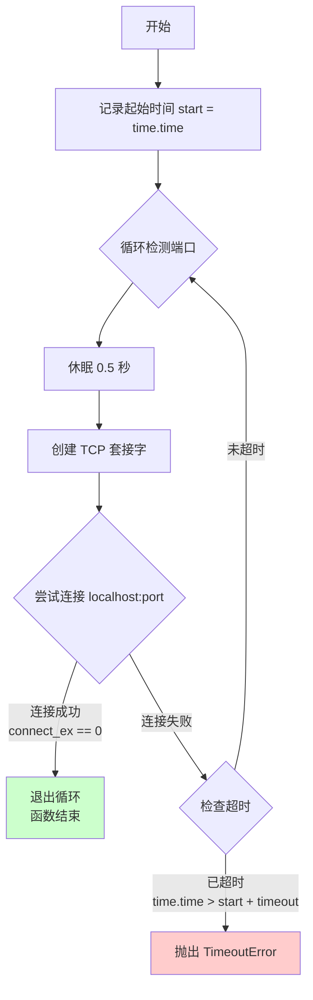

#### 带注释源码

```python
def wait_until_conn_ready(port: int = 8000, timeout: int = 30):
    """
    Polls localhost:{port} until it is available for connections

    Params:
        port: The port for which to wait until it opens
        timeout: Timeout in seconds; maximum amount of time to wait

    Raises:
        TimeoutError: If the timeout (seconds) expires before the port opens
    """
    import socket  # 导入 socket 模块用于网络连接检测
    import time    # 导入 time 模块用于时间计算

    start = time.time()  # 记录函数调用时的起始时间
    while True:          # 进入无限循环，持续检测端口状态
        time.sleep(0.5)  # 每次检测后休眠 0.5 秒，避免频繁检测
        
        # 创建 TCP IPv4 套接字
        with socket.socket(socket.AF_INET, socket.SOCK_STREAM) as s:
            # connect_ex 返回 0 表示连接成功，非 0 表示连接失败
            if s.connect_ex(("localhost", port)) == 0:
                break  # 端口已就绪，退出循环
        
        # 检查是否已超过超时时间
        if time.time() > start + timeout:
            # 抛出超时异常
            raise TimeoutError(f"Port {port} did not open within {timeout} seconds")
```

## 关键组件


### CLI命令行框架

基于Click框架构建的命令行界面，作为整个工具的入口点，提供主命令组和子命令组的组织结构。

### Agent管理模块

负责Agent的创建、启动、停止和列表查看功能，支持通过命令行参数指定agent名称和配置选项。

### Benchmark测试系统

包含benchmark启动、测试列表、分类列表和测试详情查看等功能，支持递归扫描JSON配置文件获取测试元数据。

### Setup安装模块

执行系统依赖安装脚本，支持Linux、MacOS和Windows WSL环境，提供安装过程的状态反馈和错误处理。

### 进程与端口管理模块

通过lsof命令查找并终止运行在8000和8080端口的进程，实现agent和benchmark服务的停止功能。

### Socket连接等待模块

轮询本地指定端口直到连接可用，提供超时控制机制，确保服务完全启动后再继续执行后续操作。

### 文件系统操作模块

处理目录创建、文件复制、路径解析和存在性检查等操作，支持agent目录结构的创建和验证。

### JSON配置解析模块

递归扫描benchmark挑战数据文件，提取分类、测试名称、任务描述、依赖项和评估条件等信息。

## 问题及建议


### 已知问题

-   **导入处理不当**：使用`os.system("pip3 install click")`自动安装依赖不是最佳实践，可能导致权限问题、安全风险和不可预测的行为
-   **路径遍历风险**：`agent_name`参数直接用于构建文件路径（如`f"./agents/{agent_name}"`），未进行安全校验，可能导致路径遍历攻击
-   **目录切换副作用**：`agent start`命令中使用`os.chdir(agent_dir)`改变当前工作目录，会影响后续操作，且未恢复原目录
-   **异常处理不完善**：大多数命令的异常捕获过于宽泛（如`except Exception as e`），缺乏针对性处理和错误分类
-   **重复导入模块**：多个函数内部重复导入相同模块（`os`, `subprocess`, `glob`, `json`等），增加运行开销且降低可维护性
-   **硬编码端口和路径**：端口号8000、8080以及路径`./agents/`, `./forge`等硬编码在多处，不利于配置管理
-   **进程终止逻辑错误**：`agent stop`命令中`subprocess.check_output`返回的是字节串，`isinstance(pids, int)`判断永远为False
-   **类型注解不一致**：`wait_until_conn_ready`函数的`timeout`参数未在函数签名中注解类型
-   **代码重复**：多个benchmark相关命令中存在重复的目录遍历和JSON解析逻辑
-   **缺乏日志记录**：仅使用`click.echo`输出信息，无统一的日志记录机制，不利于调试和问题追踪

### 优化建议

-   将依赖安装说明移至文档或requirements.txt，移除自动安装代码，使用结构化的异常处理
-   对所有用户输入的`agent_name`进行严格验证，使用白名单或正则`^[a-zA-Z0-9_-]+$`限制字符集
-   避免使用`os.chdir`，改用绝对路径或传递参数方式执行命令，保存并恢复原始工作目录
-   为不同类型的异常提供专门处理（如`FileNotFoundError`, `PermissionError`, `JSONDecodeError`）
-   将共用模块导入移至文件顶部，遵循Python最佳实践
-   将端口号、路径等配置提取为常量或配置文件（如`config.py`或`.env`）
-   修正`agent stop`中的字节串处理逻辑，使用`pids = subprocess.check_output(...).decode().split()`
-   统一函数签名风格，添加完整的类型注解和文档字符串
-   抽取通用的目录遍历和JSON解析逻辑为独立函数，减少代码重复
-   引入标准日志模块（`logging`），区分INFO、WARNING、ERROR级别，提供可配置的日志输出

## 其它


### 设计目标与约束

本CLI工具旨在为用户提供一个统一的管理界面，用于创建、启动、停止AutoGPT agents，以及运行基准测试。设计约束包括：仅使用Python标准库或click等通用依赖；确保跨平台兼容性（Linux、MacOS、Windows WSL）；保持脚本的轻量级和可移植性。

### 错误处理与异常设计

代码采用try-except块进行基本错误捕获，如ImportError、subprocess.CalledProcessError、FileNotFoundError、JSONDecodeError等。对于关键操作（如setup安装、agent创建、进程终止），均提供用户友好的错误提示信息，使用click.style输出彩色错误消息。但整体错误处理粒度较粗，缺乏统一的异常类层次结构和日志记录机制。

### 数据流与状态机

CLI命令执行遵循典型的事件驱动流程：用户输入命令 → 参数解析与校验 → 业务逻辑处理 → 结果输出。Agent的生命周期状态包括：不存在 → 已创建（created） → 已启动（running） → 已停止（stopped）。Benchmark执行状态相对简单，主要为就绪和运行中。端口8000和8080分别用于agent服务和基准测试服务。

### 外部依赖与接口契约

核心依赖为click框架，用于CLI命令解析和输出格式化。外部接口包括：文件系统（setup.sh脚本、agents目录、run/run_benchmark可执行文件）、进程管理（subprocess调用、lsof查询端口占用）、网络通信（socket端口检测）。对外部脚本和文件的路径依赖较强，缺乏灵活的插件化扩展机制。

### 安全性考虑

当前代码存在一定安全风险：agent_name参数仅使用简单正则\w*$验证，未做路径遍历防护；subprocess调用直接使用用户输入拼接路径；使用os.system进行pip安装。建议增加输入白名单验证、路径规范化检查（防止../攻击）、使用shlex进行命令参数转义。

### 性能考虑与优化空间

每次命令执行时动态导入模块，虽符合"按需导入"原则但影响首次调用响应速度。wait_until_conn_ready使用0.5秒固定轮询间隔，可考虑指数退避策略。端口检测和进程终止操作可并行化处理。部分字符串拼接可使用os.path.join或pathlib.Path提高可读性和跨平台兼容性。

### 兼容性考虑

代码声明支持Linux、MacOS、Windows WSL环境。依赖外部命令lsof进行进程查询，该命令在部分Windows环境不可用（代码未做处理）。setup.sh脚本的执行假定POSIX兼容Shell，Windows原生环境需额外处理。端口号硬编码（8000、8080），缺乏灵活配置能力。

### 可维护性与代码质量

代码未包含类型注解（除少数函数参数）、单元测试覆盖率未知、缺乏文档字符串（除核心函数）。setup命令输出的大型ASCII艺术logo增加代码长度但不影响功能。可考虑将大型ASCII art外部化或提供配置开关。FIXME注释表明benchmark相关功能未完成。

    