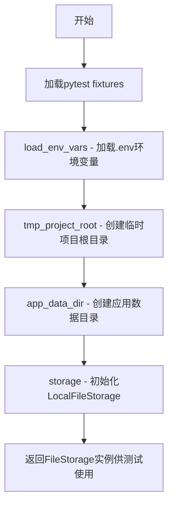
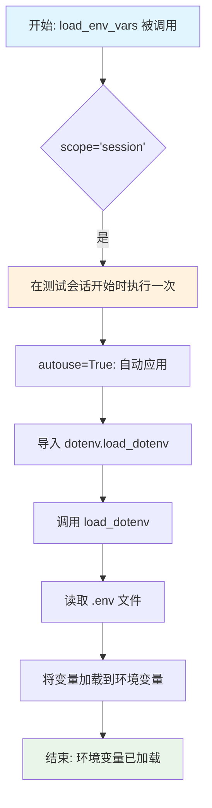
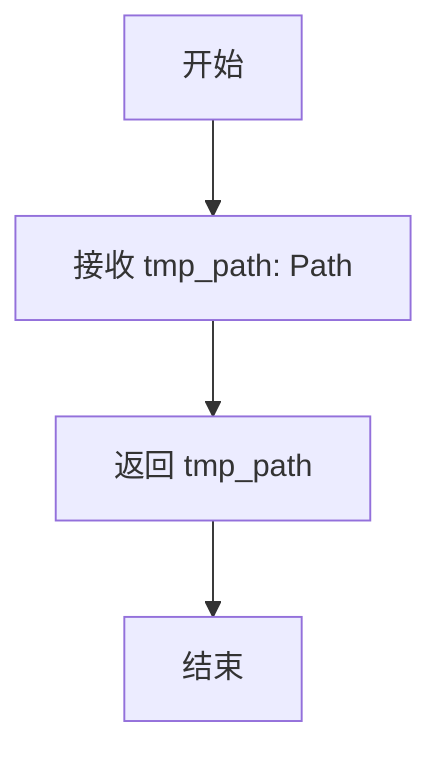
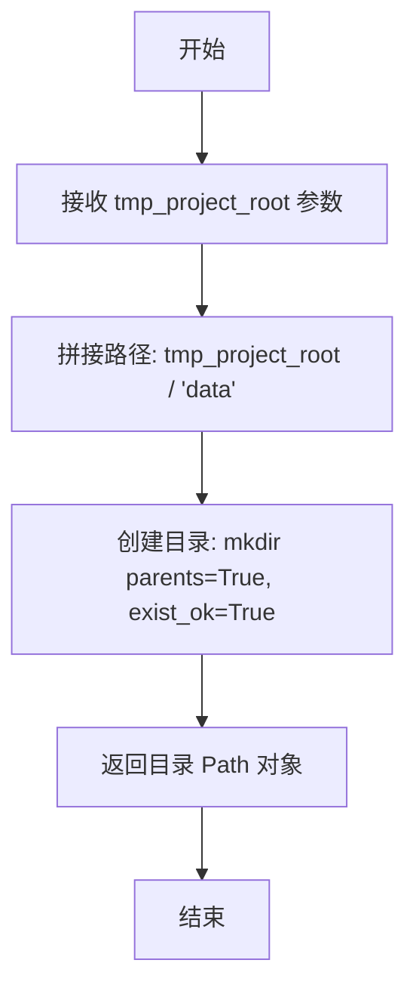

# `.\AutoGPT\classic\forge\conftest.py` 详细设计文档

这是一个pytest测试文件，主要功能是为文件存储模块提供测试fixtures，包括加载环境变量、创建临时项目目录、初始化应用数据目录以及配置本地文件存储实例，用于后续的文件存储功能测试。

## 整体流程



## 类结构

```
无自定义类（纯pytest fixtures测试文件）
├── 测试fixtures
│   ├── load_env_vars (session级fixture)
│   ├── tmp_project_root (function级fixture)
│   ├── app_data_dir (function级fixture)
│   └── storage (function级fixture)
└── 外部依赖类
    ├── FileStorage (抽象基类)
    ├── FileStorageConfiguration (配置类)
    └── LocalFileStorage (本地存储实现类)
```

## 全局变量及字段


### `pytest_plugins`
    
配置 pytest 使用的插件列表，此处使用 tests.vcr 插件用于录制和回放 HTTP 请求

类型：`List[str]`
    


### `uuid`
    
Python 标准库 uuid 模块，用于生成通用唯一标识符

类型：`module`
    


### `Path`
    
pathlib 模块中的 Path 类，用于跨平台处理文件系统路径

类型：`class`
    


### `pytest`
    
Python 单元测试框架，用于编写和运行测试用例

类型：`module`
    


### `FileStorage`
    
文件存储抽象基类，定义了文件存储的标准接口

类型：`class`
    


### `FileStorageConfiguration`
    
文件存储配置类，用于配置文件存储的各种参数如根路径和访问限制

类型：`class`
    


### `LocalFileStorage`
    
本地文件存储实现类，继承自 FileStorage，用于在本地文件系统上存储文件

类型：`class`
    


    

## 全局函数及方法


### `load_env_vars`

该函数是一个 pytest fixture，用于在测试会话开始前自动加载 `.env` 文件中的环境变量，使得应用程序配置可以在测试环境中使用。

参数：
- 无参数

返回值：`None`，无返回值（该函数通过副作用加载环境变量）

#### 流程图



#### 带注释源码

```python
@pytest.fixture(scope="session", autouse=True)
def load_env_vars():
    """
    Pytest fixture: load_env_vars
    
    用途：在测试会话开始前自动加载 .env 文件中的环境变量。
    - scope='session': 整个测试会话只执行一次
    - autouse=True: 自动应用于所有测试，无需显式引用
    """
    # 动态导入 dotenv 模块的 load_dotenv 函数
    # 延迟导入可以避免在不需要时引入依赖
    from dotenv import load_dotenv

    # 执行加载操作，读取项目根目录下的 .env 文件
    # 并将其中的键值对设置到当前进程的环境变量中
    load_dotenv()
```

#### 额外信息

| 项目 | 描述 |
|------|------|
| **fixture 类型** | pytest fixture |
| **作用域 (scope)** | session - 整个测试会话只执行一次 |
| **自动应用 (autouse)** | True - 无需显式声明即可自动运行 |
| **依赖模块** | dotenv |
| **配置方式** | 读取项目根目录下的 `.env` 文件 |
| **使用场景** | 为集成测试提供运行时配置，如 API 密钥、数据库连接字符串等 |


### `tmp_project_root`

这是一个 pytest fixture 函数，用于创建一个临时的项目根目录。它接收 pytest 内置的 `tmp_path` fixture 作为参数，并直接将其作为返回值传递给测试用例使用。

参数：

- `tmp_path`：`Path`，pytest 内置 fixture，提供一个唯一的临时目录路径

返回值：`Path`，返回临时目录的路径，供测试用例使用

#### 流程图



#### 带注释源码

```python
@pytest.fixture()
def tmp_project_root(tmp_path: Path) -> Path:
    """
    创建一个临时的项目根目录供测试使用。
    
    Args:
        tmp_path: pytest 内置 fixture，自动提供的临时目录路径
        
    Returns:
        返回临时目录的 Path 对象
    """
    return tmp_path
```


### `app_data_dir`

这是一个 pytest fixture，用于在测试环境中创建一个临时应用数据目录，并返回该目录的 Path 对象。

参数：

- `tmp_project_root`：`Path`，临时项目根目录，由另一个 fixture 提供

返回值：`Path`，返回创建的应用数据目录路径

#### 流程图



#### 带注释源码

```python
@pytest.fixture()
def app_data_dir(tmp_project_root: Path) -> Path:
    """
    创建一个临时应用数据目录的 fixture
    
    Args:
        tmp_project_root: 临时项目根目录路径
        
    Returns:
        创建的应用数据目录的 Path 对象
    """
    # 拼接临时项目根目录下的 "data" 子目录路径
    dir = tmp_project_root / "data"
    # 创建目录，如果父目录不存在则创建父目录，
    # 如果目录已存在则不抛出异常
    dir.mkdir(parents=True, exist_ok=True)
    # 返回创建完成的目录路径
    return dir
```


### `storage`

这是一个 pytest fixture，用于创建并初始化一个本地文件存储实例，提供测试所需的文件存储功能。

参数：

- `app_data_dir`：`Path`，应用数据目录，用于构建文件存储的根路径

返回值：`FileStorage`，已初始化的本地文件存储实例

#### 流程图

```mermaid
flowchart TD
    A[开始] --> B[接收 app_data_dir 参数]
    B --> C[生成唯一UUID]
    C --> D[构建存储根路径: Path(app_data_dir/uuid)]
    D --> E[创建 FileStorageConfiguration<br/>root=存储根路径<br/>restrict_to_root=False]
    E --> F[创建 LocalFileStorage 实例]
    F --> G[调用 storage.initialize 初始化]
    G --> H[返回 storage 实例]
```

#### 带注释源码

```python
@pytest.fixture()
def storage(app_data_dir: Path) -> FileStorage:
    """
    创建并初始化本地文件存储实例的 fixture
    
    参数:
        app_data_dir: Path, 应用数据目录路径
        
    返回值:
        FileStorage: 已初始化的本地文件存储实例
    """
    # 使用 uuid 生成唯一目录名，避免测试间冲突
    storage = LocalFileStorage(
        FileStorageConfiguration(
            root=Path(f"{app_data_dir}/{str(uuid.uuid4())}"),  # 构建唯一根路径
            restrict_to_root=False  # 允许访问根目录外的文件
        )
    )
    storage.initialize()  # 初始化存储后端
    return storage  # 返回存储实例供测试使用
```

## 关键组件


### pytest fixtures 和测试环境设置

代码定义了一系列pytest fixtures，用于构建测试环境。`load_env_vars` 在会话级别加载环境变量，`tmp_project_root` 创建临时项目根目录，`app_data_dir` 创建应用数据目录，`storage` 创建并初始化 LocalFileStorage 实例。这些fixtures共同构成了测试所需的依赖注入基础设施。

### FileStorage 抽象基类

从 `forge.file_storage.base` 导入的抽象基类，定义了文件存储的标准接口契约。所有文件存储实现（如LocalFileStorage）都必须继承此类并实现其抽象方法。

### LocalFileStorage 本地文件存储实现

从 `forge.file_storage.local` 导入的具体实现类，负责在本地文件系统上进行文件操作。配置中启用了 `restrict_to_root=False`，允许访问配置根目录之外的文件。

### FileStorageConfiguration 配置类

从 `forge.file_storage.base` 导入的配置类，用于初始化 FileStorage。包含 `root` 路径和 `restrict_to_root` 权限控制参数。

### UUID 生成机制

使用 `uuid.uuid4()` 为每个测试会话生成唯一的存储根目录名称，确保测试之间的隔离性，避免文件冲突。

### dotenv 环境变量加载

使用 `load_dotenv()` 在测试会话开始时自动加载 `.env` 文件中的环境变量，支持配置外部依赖和敏感信息。


## 问题及建议


### 已知问题

-   **路径构造方式不一致**：使用 `Path(f"{app_data_dir}/{str(uuid.uuid4())}")` 混合了 f-string 和 Path 对象，应改为 `app_data_dir / str(uuid.uuid4())` 以保持代码风格一致
-   **硬编码配置参数**：`restrict_to_root=False` 被硬编码在 fixture 中，缺乏灵活性，应考虑通过参数化或环境变量配置
-   **资源清理不完整**：虽然使用了 `tmp_path`，但通过 uuid 生成的子目录在测试结束后可能未正确清理
-   **缺少文档注释**：所有 fixture 都缺少 docstring，降低了代码可维护性和可读性
-   **重复导入**：`load_dotenv` 在 fixture 内部导入，每次调用都会执行，建议移至文件顶部
-   **类型提示不完整**：`load_env_vars` fixture 缺少返回类型注解
-   **VCR 插件未使用**：配置了 `pytest_plugins = ["tests.vcr"]` 但代码中未见任何使用 VCR 的测试函数
-   **storage fixture scope 为 function**：每次测试都创建新的存储实例，可能影响测试执行效率

### 优化建议

-   将 `load_dotenv` 移至文件顶部导入，并添加错误处理（捕获 `FileNotFoundError`）
-   为 `storage` fixture 改用 `scope="session"` 或 `scope="module"` 以复用实例提升性能
-   添加显式的资源清理逻辑，在 fixture 中注册 `yield` 后的 teardown 代码确保临时目录被删除
-   为所有 fixtures 添加详细的 docstring，说明其用途、返回值和副作用
-   将 `restrict_to_root` 等配置参数化，允许调用方指定或通过环境变量覆盖
-   如不需要 VCR 功能，移除未使用的 pytest_plugins 配置
-   考虑为 `storage.initialize()` 添加异常处理和日志记录
-   使用 `tmp_path` 的 `.mkdir(parents=True, exist_ok=True)` 时可简化 `app_data_dir` 的创建逻辑


## 其它


### 设计目标与约束

本测试模块的目标是为FileStorage接口提供可复用的测试fixtures，支撑本地文件存储功能的单元测试与集成测试。设计约束包括：使用临时目录避免污染真实文件系统，通过session级fixture加载环境变量确保测试隔离性，依赖pytest框架的自动清理机制管理资源生命周期。

### 错误处理与异常设计

代码本身未显式处理异常，主要依赖pytest框架的断言机制和fixture的资源清理能力。FileStorage初始化时可能抛出权限或路径相关异常，由调用方负责捕获。临时目录创建失败时pytest会自动报告错误。

### 数据流与状态机

数据流遵循以下路径：load_env_vars (session级) → tmp_project_root → app_data_dir → storage (function级)。状态转换：临时目录创建 → 数据目录初始化 → 存储实例化 → initialize()调用 → 就绪状态。storage fixture为function级别，每次测试函数调用时创建新实例。

### 外部依赖与接口契约

核心依赖包括：uuid模块生成唯一目录名、pathlib.Path处理路径操作、pytest框架提供fixture机制、dotenv加载环境变量、forge.file_storage.base模块定义FileStorage和FileStorageConfiguration接口、forge.file_storage.local模块提供LocalFileStorage实现。LocalFileStorage必须实现FileStorage接口的initialize()方法。

### 测试配置与环境要求

测试环境要求Python 3.x、pytest框架、dotenv库。VCR插件用于录制/回放HTTP交互（tests.vcr）。环境变量通过.env文件加载，需在测试根目录配置。

### Fixture依赖关系图

storage依赖app_data_dir，app_data_dir依赖tmp_project_root，tmp_project_root为独立fixture。load_env_vars为session级无依赖fixture。

### 资源生命周期管理

tmp_project_root、app_data_dir为临时路径，由pytest的tmp_path自动管理生命周期。storage实例在每个测试函数结束后自动清理（tmp_path的自动清理机制）。VCR插件的HTTP交互录制由插件自身管理。

### 潜在的技术债务

1. 硬编码restrict_to_root=False参数，缺乏配置灵活性
2. 动态路径拼接使用f-string而非Path.joinpath()
3. 缺少对storage.initialize()调用失败的测试覆盖
4. 未提供多存储实例共存的测试场景
5. 依赖隐式的tmp_path清理，未显式验证资源释放

### 改进建议

建议将FileStorageConfiguration的部分参数（如restrict_to_root）提取为可选fixture参数；添加explicit的teardown验证逻辑确保存储实例正确关闭；考虑添加session级共享存储实例以优化性能；增加错误场景的fixture用于测试异常处理逻辑。


    