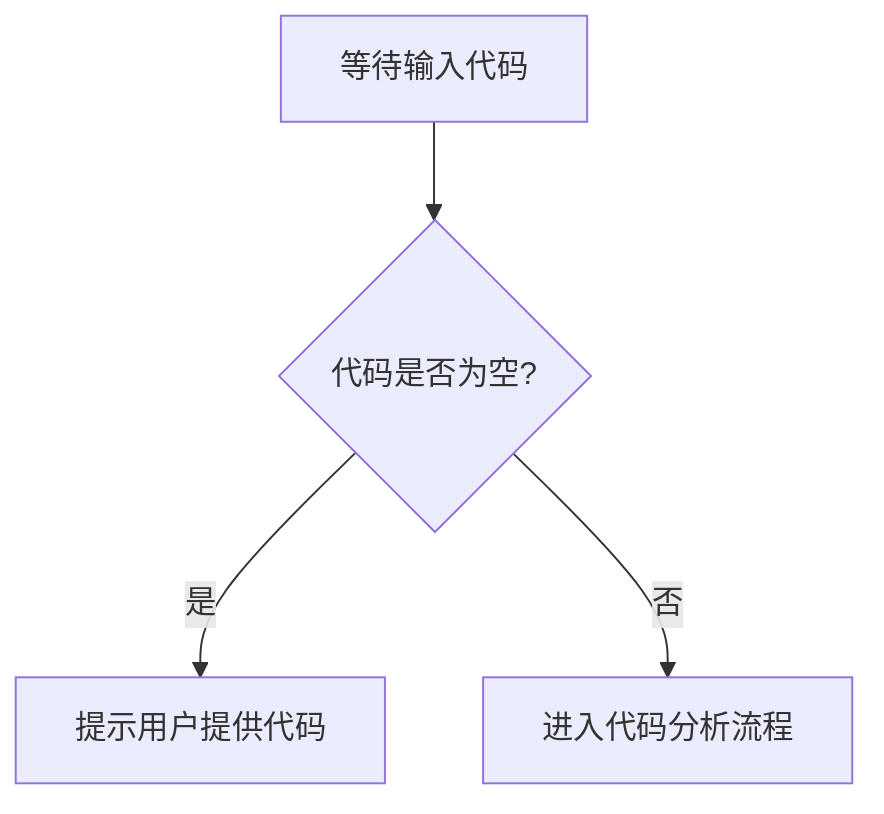

# `.\AutoGPT\classic\forge\forge\__init__.py` 详细设计文档

未提供源代码文件，无法进行分析。请提供需要分析的代码。

## 整体流程



## 类结构

```

```

## 全局变量及字段


    

## 全局函数及方法


## 关键组件


### 错误说明

未提供源代码进行分析。请提供需要分析的代码，以便生成详细设计文档。


## 问题及建议


### 已知问题

-   代码为空：未提供待分析的源代码，无法进行技术债务或优化空间的识别

### 优化建议

-   请提供需要分析的代码，以便进行详细的技术评估和优化建议


## 其它


### 一段话描述

由于未提供代码，无法进行具体分析。本文档为空白代码的占位模板，实际使用时需根据真实代码进行填充。

### 文件的整体运行流程

由于未提供代码，无法描述具体运行流程。

### 类的详细信息

由于未提供代码，无法提供类的详细信息。

#### 类字段

由于未提供代码，无法提供类字段信息。

#### 类方法

由于未提供代码，无法提供类方法信息。

### 关键组件信息

由于未提供代码，无法提供关键组件信息。

### 潜在的技术债务或优化空间

由于未提供代码，无法识别技术债务或优化空间。

### 设计目标与约束

- **功能目标**：描述代码需要实现的核心业务功能
- **性能约束**：如响应时间、吞吐量、资源占用等要求
- **兼容性约束**：支持的平台、浏览器、SDK版本等
- **安全要求**：数据加密、访问控制、审计日志等安全需求

### 错误处理与异常设计

- **异常类型定义**：业务异常、系统异常、第三方异常等分类
- **异常传播机制**：异常如何向上传递和处理
- **错误码体系**：错误码与错误信息的映射关系
- **降级策略**：异常发生时的业务降级方案
- **日志记录**：错误日志的级别、内容和存储策略

### 数据流与状态机

- **数据输入来源**：外部API、数据库、用户输入等
- **数据处理流程**：数据转换、验证、加工的完整链路
- **数据输出目标**：存储、响应返回、下游系统等
- **状态定义**：业务状态及其转换规则
- **状态转换触发条件**：事件、动作与状态变更的映射

### 外部依赖与接口契约

- **依赖的外部服务**：第三方API、中间件、数据库等
- **接口协议**：RESTful、gRPC、消息队列等通信协议
- **接口请求/响应格式**：JSON、XML、Protobuf等数据格式
- **超时与重试策略**：调用超时时间、重试次数、退避算法
- **版本兼容性**：接口版本管理和向后兼容策略

### 安全性设计

- **认证机制**：JWT、OAuth、API Key等认证方式
- **授权策略**：基于角色或属性的访问控制(RBAC/ABAC)
- **数据脱敏**：敏感信息的加密存储和传输
- **防护措施**：防SQL注入、XSS、CSRF等安全措施

### 配置管理

- **配置项分类**：环境配置、业务配置、系统配置
- **配置获取方式**：配置文件、环境变量、配置中心
- **配置变更策略**：热更新、灰度发布、回滚机制
- **敏感配置保护**：密钥、凭证的加密存储

### 性能与监控

- **性能指标**：QPS、响应延迟、错误率等关键指标
- **监控点**：关键方法和链路的埋点
- **告警策略**：阈值设置、告警级别、通知方式
- **日志规范**：日志格式、级别、使用规范

### 测试策略

- **单元测试覆盖率目标**：核心业务逻辑的测试覆盖要求
- **集成测试场景**：模块间交互的测试用例
- **端到端测试**：业务流程的完整验证
- **性能测试**：压力测试、负载测试计划

### 部署与运维

- **部署架构**：服务数量、集群配置、负载均衡策略
- **容器化方案**：Dockerfile、编排配置
- **健康检查**：存活探针、就绪探针的配置
- **扩容策略**：自动扩缩容的触发条件

### 附录

- **术语表**：专业术语解释
- **参考资料**：相关文档、API文档、架构设计文档链接
- **变更历史**：文档版本和修改记录


    