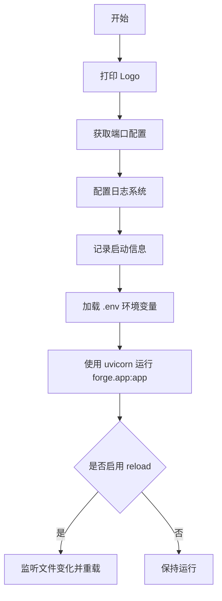
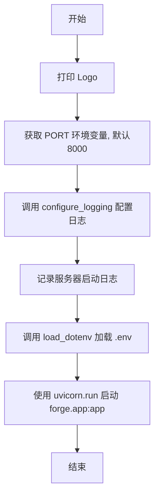

# `.\AutoGPT\classic\forge\forge\__main__.py` 详细设计文档

这是 AgentForge 框架的入口脚本，负责启动一个基于 uvicorn 的 Web 服务器，提供 Agent 服务，监听本地端口并支持代码和环境文件的热重载。

## 整体流程



## 类结构

```
无类层次结构（脚本文件）
```

## 全局变量及字段


### `logger`
    
用于记录应用运行日志的日志记录器对象

类型：`logging.Logger`
    


### `logo`
    
存储应用ASCII艺术Logo的多行字符串常量，包含版本号v0.2.0

类型：`str`
    


    

## 全局函数及方法


### `__main__`（脚本入口）

这是该脚本的主入口块，负责启动 Agent 服务器。它首先打印应用 Logo，然后配置日志系统、加载环境变量，最后通过 uvicorn 启动 forge 应用。

参数：无

返回值：无

#### 流程图



#### 带注释源码

```
# 导入标准库和第三方库
import logging
import os

import uvicorn
from dotenv import load_dotenv

# 导入项目内部的日志配置模块
from forge.logging.config import configure_logging

# 获取当前模块的日志记录器
logger = logging.getLogger(__name__)

# 定义应用的 ASCII Art Logo，包含版本号 v0.2.0
logo = """..."

# 程序入口点
if __name__ == "__main__":
    # 1. 打印 Logo 到控制台
    print(logo)
    
    # 2. 从环境变量获取端口，未设置则默认为 8000
    port = os.getenv("PORT", 8000)
    
    # 3. 初始化日志系统
    configure_logging()
    
    # 4. 记录服务器启动信息
    logger.info(f"Agent server starting on http://localhost:{port}")
    
    # 5. 加载 .env 文件中的环境变量
    load_dotenv()

    # 6. 使用 uvicorn 运行 ASGI 应用
    uvicorn.run(
        "forge.app:app",                    # 应用入口字符串
        host="localhost",                   # 监听地址
        port=int(port),                     # 监听端口
        log_level="error",                  # 日志级别设为 error
        reload=True,                        # 启用热重载
        reload_dirs=os.path.dirname(os.path.dirname(__file__)),  # 监控目录
        reload_excludes="*.py",             # 排除 Python 文件
        reload_includes=[                   # 包含文件模式
            f"{os.path.basename(os.path.dirname(__file__))}/**/*.py",
            ".*",
            ".env",
        ],
    )
```

## 关键组件


### Uvicorn服务器

使用uvicorn作为ASGI服务器来运行FastAPI应用，配置了本地主机地址、端口号、日志级别、自动重载等功能

### 环境变量加载

使用dotenv库从.env文件加载环境变量，支持配置化设置（如PORT等）

### 日志系统

通过configure_logging()函数配置日志系统，并在启动时输出info级别日志记录服务器启动信息

### 应用入口

通过uvicorn.run()动态导入并运行"forge.app:app"模块中的FastAPI应用实例

### 端口配置

从环境变量读取PORT配置，默认为8000端口，支持灵活部署配置

### 重载配置

配置了代码热重载功能，监控特定目录和文件类型的变化，支持.py文件和.env文件的变更检测


## 问题及建议


### 已知问题

-   **日志配置顺序错误**：`load_dotenv()` 在 `configure_logging()` 之后调用，导致`.env`中的环境变量在日志配置时不可用，如果日志级别由环境变量控制，将无法生效
-   **日志级别不匹配**：`uvicorn.run()` 的 `log_level="error"` 仅显示error及以上级别，但代码中使用了 `logger.info()` 记录启动信息，该信息实际上不会被输出
-   **缺少错误处理**：端口转换 `int(port)` 缺乏异常捕获，若环境变量 `PORT` 设置为非数字字符串，程序将以不友好的方式崩溃
-   **reload配置逻辑混乱**：`reload_excludes="*.py"` 排除所有Python文件，但 `reload_includes` 中又通过 `**/*.py` 重新包含，逻辑冗余且容易混淆
-   **硬编码host**：host固定为 `"localhost"`，不支持通过环境变量配置，降低了部署灵活性

### 优化建议

-   调整代码执行顺序：先调用 `load_dotenv()`，再调用 `configure_logging()`，确保环境变量尽早加载
-   统一日志级别：要么将 `log_level` 改为 `"info"`，要么改用 `logger.error()`，保持日志行为一致
-   添加端口解析错误处理：使用 `try/except` 捕获 `ValueError`，提供友好的错误提示
-   简化reload配置：移除相互矛盾的exclude/includes规则，或使用更清晰的配置方式
-   支持配置化host：添加 `HOST` 环境变量支持，如 `os.getenv("HOST", "localhost")`
-   添加启动前健康检查：验证关键配置有效性，提前暴露配置错误

## 其它


### 设计目标与约束

本代码作为应用入口点，核心目标是提供一个可配置、可热重载的ASGI服务器启动脚本。设计约束包括：必须支持通过环境变量配置端口；日志系统需在应用启动前初始化；.env文件用于本地开发环境配置；热重载机制应排除Python源文件以避免频繁重启，同时包含.env文件以支持配置变更感知。

### 错误处理与异常设计

代码层面的错误处理较为基础，主要依赖uvicorn框架自身的异常捕获机制。潜在异常场景包括：环境变量PORT格式非法导致int()转换失败、.env文件缺失或格式错误、forge.app模块导入失败、日志配置失败等。建议的异常设计思路为：对PORT解析添加try-except捕获ValueError；模块导入失败时打印明确错误信息并以非零状态码退出；日志初始化失败时应回退到基础logging配置。

### 外部依赖与接口契约

本代码依赖以下外部组件：uvicorn（ASGI服务器）、dotenv（环境变量加载）、forge.logging模块（内部）、forge.app模块（应用入口）。接口契约方面：forge.app模块必须导出名为app的ASGI应用实例；configure_logging函数不接受参数且无返回值要求；.env文件中PORT变量为可选配置。

### 配置管理

配置通过环境变量和.env文件双重管理。主配置项PORT定义服务监听端口，默认值为8000；其他潜在配置项可通过load_dotenv()加载至环境变量供下游模块使用。日志级别、uvicorn的host和reload参数在此层级硬编码，若需灵活配置建议迁移至配置中心或.env文件。

### 部署与运维考量

当前配置适用于本地开发环境。生产部署建议：关闭reload=True以避免性能开销和不确定性；将log_level从"error"调整为"info"以获取必要运行时信息；host应配置为"0.0.0.0"以支持容器化部署；reload_dirs和reload_includes在生产环境应移除。端口配置应通过容器环境变量或Kubernetes ConfigMap注入。

### 安全性设计

代码本身安全风险较低，主要安全考量在下游应用。热重载配置中reload_includes包含".*"正则可能带来轻微的信息泄露风险，建议生产环境移除。.env文件包含敏感信息的可能性需由使用者确保不会被提交至版本控制系统。

### 可测试性设计

本入口模块可直接测试的逻辑有限，主要包括：PORT默认值验证、环境变量解析逻辑、logo字符串输出。可通过mock os.getenv和os.path相关函数进行单元测试，验证默认值回退逻辑和路径构建正确性。

### 日志与监控

日志系统由forge.logging.config模块控制，本文件通过logging.getLogger(__name__)获取命名日志器。启动时记录服务器地址信息，uvicorn自身日志通过log_level配置仅输出error级别。监控层面建议：添加应用启动成功指标、记录启动耗时、集成健康检查端点。

    