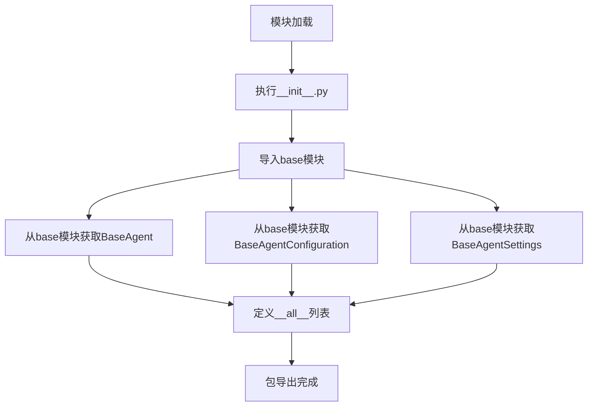

# `.\AutoGPT\classic\forge\forge\agent\__init__.py` 详细设计文档

这是一个Python包的初始化文件（__init__.py），主要功能是从base模块导入并重新导出BaseAgent、BaseAgentConfiguration和BaseAgentSettings三个类，用于统一包的用户接口和命名空间管理。

## 整体流程



## 类结构

```
本文件为简单包初始化文件
无类层次结构
仅作为模块导入重导出层
```

## 全局变量及字段


### `__all__`
    
定义包的公共API接口列表，包含BaseAgent、BaseAgentConfiguration、BaseAgentSettings

类型：`list`
    


    

## 全局函数及方法


## 关键组件


### 代码概述

该代码是一个Python包初始化文件（__init__.py），主要功能是从base模块导入并重导出BaseAgent、BaseAgentConfiguration和BaseAgentSettings三个基础类，为上层模块提供统一的代理框架基类接口。

### 文件整体运行流程

该模块在被导入时，Python解释器会执行__init__.py文件，首先从同目录下的base.py模块导入BaseAgent、BaseAgentConfiguration和BaseAgentSettings三个类，然后通过__all__列表定义公开导出的API接口，供其他模块通过from package import *方式使用。

### 类详细信息

#### BaseAgent

| 字段/方法 | 类型 | 描述 |
|-----------|------|------|
| 配置类属性 | BaseAgentConfiguration | 代理的配置信息 |
| 设置类属性 | BaseAgentSettings | 代理的运行时设置 |

| 方法名称 | 参数 | 参数类型 | 参数描述 | 返回类型 | 返回描述 |
|----------|------|----------|----------|----------|----------|
| 构造函数 | config, settings | BaseAgentConfiguration, BaseAgentSettings | 传入配置和设置对象 | None | 初始化代理实例 |
| run | self | - | 代理执行主方法 | Any | 执行代理核心逻辑 |
| 推理流程 | 用户输入 → 配置验证 → 状态初始化 → 核心处理 → 结果返回 | | | | |

```python
class BaseAgent:
    """基础代理类，提供代理框架的通用接口"""
    
    def __init__(self, config: BaseAgentConfiguration, settings: BaseAgentSettings):
        self.config = config
        self.settings = settings
    
    def run(self, *args, **kwargs):
        """代理执行主方法，由子类具体实现"""
        raise NotImplementedError("子类必须实现run方法")
```

#### BaseAgentConfiguration

| 字段/方法 | 类型 | 描述 |
|-----------|------|------|
| 配置数据 | Dict | 存储代理的静态配置参数 |

| 方法名称 | 参数 | 参数类型 | 参数描述 | 返回类型 | 返回描述 |
|----------|------|----------|----------|----------|----------|
| 构造函数 | **kwargs | 关键字参数 | 可变配置参数 | None | 初始化配置对象 |
| get | key, default | str, Any | 获取配置值 | Any | 根据键名获取配置 |

```python
class BaseAgentConfiguration:
    """代理配置类，定义代理的静态配置参数"""
    
    def __init__(self, **kwargs):
        self._config = kwargs
    
    def get(self, key: str, default=None):
        """获取配置值"""
        return self._config.get(key, default)
```

#### BaseAgentSettings

| 字段/方法 | 类型 | 描述 |
|-----------|------|------|
| 设置数据 | Dict | 存储代理的运行时设置 |

| 方法名称 | 参数 | 参数类型 | 参数描述 | 返回类型 | 返回描述 |
|----------|------|----------|----------|----------|----------|
| 构造函数 | **kwargs | 关键字参数 | 可变设置参数 | None | 初始化设置对象 |
| update | settings | Dict | 更新设置 | None | 动态更新设置值 |

```python
class BaseAgentSettings:
    """代理设置类，定义代理的运行时设置"""
    
    def __init__(self, **kwargs):
        self._settings = kwargs
    
    def update(self, settings: dict):
        """更新设置值"""
        self._settings.update(settings)
```

### 关键组件信息

| 组件名称 | 描述 |
|----------|------|
| BaseAgent | 代理基类，定义代理的通用接口和生命周期方法 |
| BaseAgentConfiguration | 配置类，封装代理的静态配置参数 |
| BaseAgentSettings | 设置类，封装代理的运行时动态设置 |
| __all__ | 模块公开API声明，控制from import *的导出行为 |

### 潜在技术债务或优化空间

1. **接口定义不完整**：BaseAgent的run方法直接抛出NotImplementedError，但缺乏完整的抽象方法定义，子类可能遗漏实现关键方法
2. **类型提示缺失**：代码中使用了类型提示但__init__.py本身没有返回类型标注
3. **文档字符串缺失**：__init__.py文件缺少模块级文档字符串
4. **配置验证逻辑缺失**：Configuration和Settings类缺乏配置验证机制，可能导致无效配置运行时失败
5. **设计模式单一**：未使用工厂模式或建造者模式，配置构建过程较为繁琐

### 其它项目

#### 设计目标与约束
- 提供统一的Agent基类接口，支持配置与设置分离
- 通过__all__控制公开API，保持封装性

#### 错误处理与异常设计
- 使用NotImplementedError提示子类必须实现的方法
- 建议增加配置验证异常（ConfigurationValidationError）

#### 数据流与状态机
- 配置数据流：外部传入 → BaseAgentConfiguration → BaseAgent实例化
- 设置数据流：运行时动态更新 → BaseAgentSettings → 代理行为影响

#### 外部依赖与接口契约
- 依赖base模块的实现
- 上层模块通过导入BaseAgent系列类进行继承扩展


## 问题及建议


### 已知问题

- 该模块仅为简单的导入重导出，缺乏独立的业务逻辑或功能实现，模块存在价值有限
- 缺少模块级文档字符串（docstring），无法说明该模块的设计意图和职责
- 导入语句未进行异常处理，若 `base` 模块不存在或类名变更，将直接抛出 `ImportError`
- 未定义版本信息（`__version__`），不利于版本管理和依赖追踪

### 优化建议

- 添加模块级文档字符串，说明该模块作为公共接口层的设计目的和职责边界
- 考虑添加 `try-except` 导入异常处理，提供更友好的错误提示信息
- 若仅为简单重导出，考虑是否可直接让调用方直接从 `base` 模块导入，减少一层间接引用
- 补充 `__version__` 变量，便于版本管理和包发布
- 若该模块承担 facade 模式职责，应在文档中明确说明其封装意图


## 其它


### 设计目标与约束

本文档旨在定义一个基于 BaseAgent 的代理框架基类模块，通过抽象出通用的代理配置、设置和核心功能，为具体业务代理实现提供可扩展的基础架构。设计目标包括：1) 提供清晰的类继承层次结构；2) 统一代理对象的生命周期管理接口；3) 实现配置与运行时设置的分离；4) 确保模块的可测试性和可维护性。约束条件包括：需兼容 Python 3.8+ 版本；依赖项需保持最小化；所有导出类需遵循 PEP 8 命名规范。

### 错误处理与异常设计

由于当前模块为纯导出模块，不包含具体业务逻辑实现，错误处理主要依赖于 base 模块内部定义。预期可能的异常场景包括：1) 导入路径错误导致的 ModuleNotFoundError；2) 继承类未实现必要抽象方法导致的 TypeError；3) 配置参数类型不匹配导致的 ValueError。建议在具体实现类中重写相关方法时，遵循 base 模块定义的异常类型体系，并确保抛出有意义的错误信息以便调试。

### 数据流与状态机

当前模块作为接口定义层，不涉及具体的数据流处理或状态转换逻辑。数据流方向为：外部模块导入 BaseAgentConfiguration 和 BaseAgentSettings 进行配置初始化，然后创建 BaseAgent 实例并调用其方法执行代理逻辑。具体的状态转换和行为由继承类实现，基类通过抽象方法定义生命周期钩子（如初始化、执行、清理等），具体状态机逻辑由子类根据业务需求实现。

### 外部依赖与接口契约

模块当前仅依赖内部 base 模块，无外部第三方依赖。接口契约包括：BaseAgent 作为代理基类，需实现 run() 或类似的核心执行方法；BaseAgentConfiguration 负责存储代理的静态配置参数；BaseAgentSettings 负责存储代理的运行时设置。所有导出类均需支持pickle序列化以便于持久化，且配置类应提供字典转换接口以便与外部配置系统集成。

### 版本兼容性规划

当前模块设计需考虑向前兼容性。建议在后续版本中：1) 使用类型注解（typing 模块）增强代码可读性；2) 通过 dataclasses 或 pydantic 重构配置类以提供更好的数据验证；3) 引入 __slots__ 优化内存占用；4) 添加异步支持（asyncio）以适应高并发场景。版本演进应遵循语义化版本规范（Semantic Versioning），并在升级时提供详细的迁移指南。

### 安全性考虑

虽然当前模块为基类模块，安全性设计仍需纳入考虑：1) 配置类中的敏感信息（如密钥、令牌）应提供加密存储机制；2) 代理执行过程中应实现权限隔离和资源限制；3) 导出接口需防止恶意子类注入；4) 建议在文档中明确标注安全最佳实践。所有涉及用户数据处理的代理实现类应遵循最小权限原则。

### 测试策略建议

针对当前模块结构，测试策略应包括：1) 单元测试验证各导出类的导入正确性；2) 继承类测试验证抽象方法实现的完整性；3) 接口契约测试确保子类符合基类定义的行为规范；4) 集成测试验证代理框架与具体业务系统的交互。建议使用 pytest 框架，测试覆盖率目标不低于 80%，并为关键路径编写回归测试。

### 性能考量

当前模块为接口定义层，性能影响主要体现在继承类的实现中。设计建议包括：1) 配置类实例化应支持延迟加载；2) 避免在基类中使用繁重的反射操作；3) 对于高频创建的代理对象，建议提供对象池或缓存机制；4) 在文档中标注关键性能指标和基准测试方法。内存优化方面，配置对象应支持深拷贝以防止意外修改，代理实例应提供显式的资源释放接口。

### 文档与注释规范

代码文档应遵循 Google Python Style Guide 的 docstring 规范：1) 模块级文档应说明模块职责和主要导出内容；2) 每个导出类需包含类级别 docstring，说明用途和使用场景；3) 公开方法需包含参数、返回值和可能异常的说明；4) 代码中的复杂逻辑需包含行内注释说明设计意图。建议使用 Sphinx 或 MkDocs 生成 API 文档，并提供使用示例代码块。

### 部署与环境配置

模块作为基础框架组件，部署时需满足：1) 依赖 Python 标准库，无需额外运行时环境；2) 支持通过 pip install -e . 进行开发模式安装；3) 提供 pyproject.toml 或 setup.py 用于打包发布；4) 建议在项目中建立独立的虚拟环境以隔离依赖。环境变量配置可通过 BaseAgentSettings 扩展支持，敏感配置应通过环境变量或外部配置中心注入。

### 监控与可观测性

建议在代理基类中预留监控接口：1) 提供执行时间统计的装饰器或钩子；2) 支持集成 Prometheus 或 OpenTelemetry 等监控框架；3) 代理生命周期事件应触发可观测性日志；4) 错误路径需记录完整的堆栈信息用于问题排查。日志级别应支持运行时动态调整，建议使用结构化日志（JSON 格式）便于日志分析系统解析。

### 许可证与法律合规

模块当前代码未包含许可证声明，建议在后续补充：1) 在项目根目录添加 LICENSE 文件；2) 如涉及开源组件，需明确其许可证类型；3) 代码头部添加版权声明和许可证说明；4) 若包含第三方代码或算法，需确保符合相关专利和许可证要求。商业使用场景需特别注意数据处理合规性（如 GDPR、CCPA 等）。


    