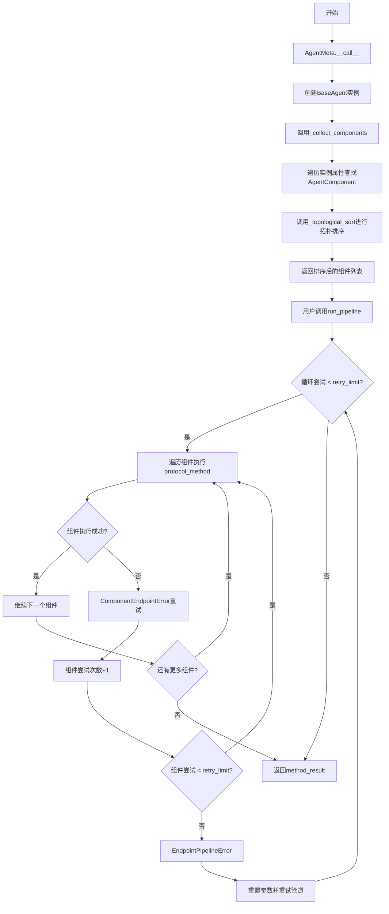
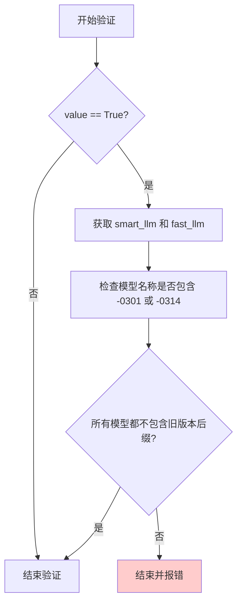
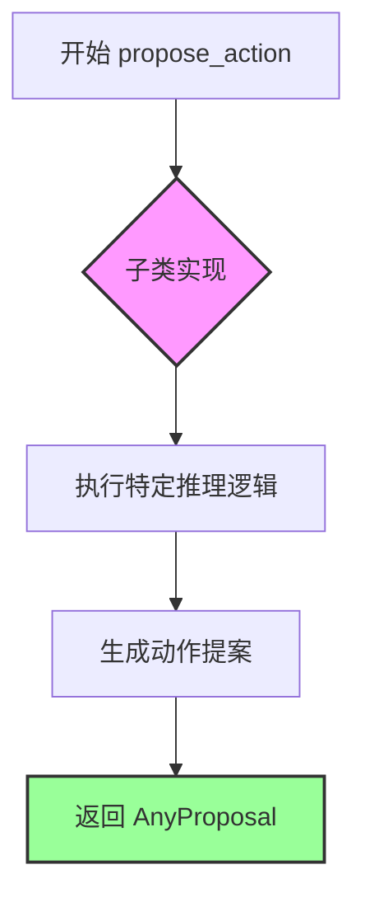
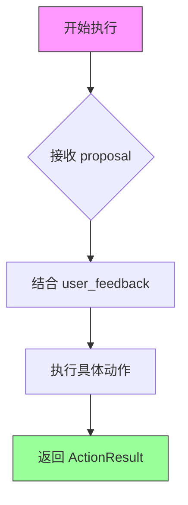
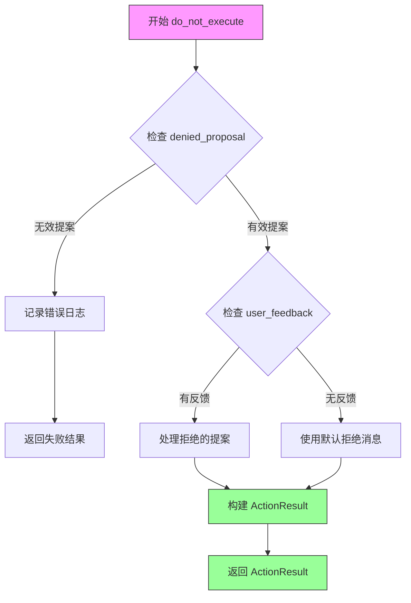
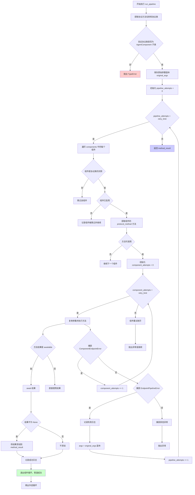
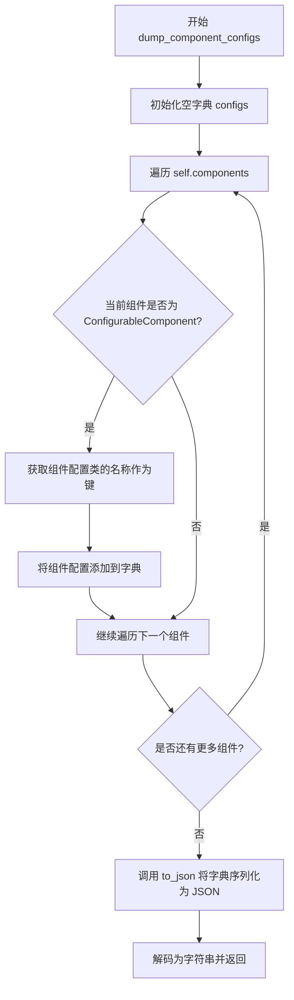
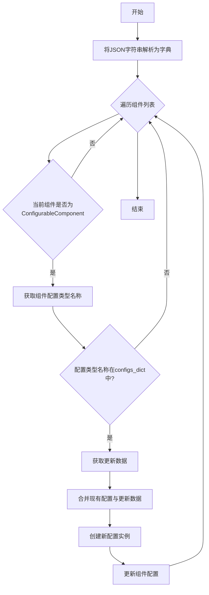
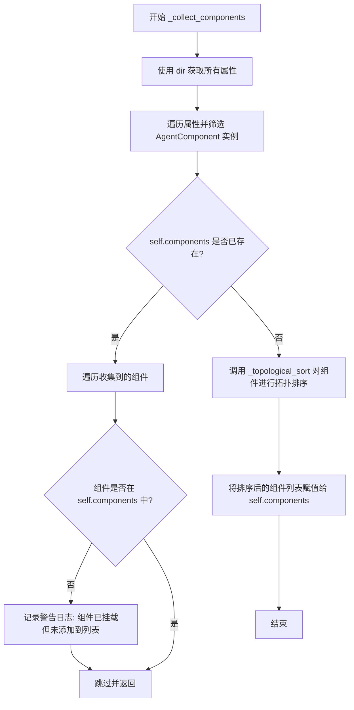
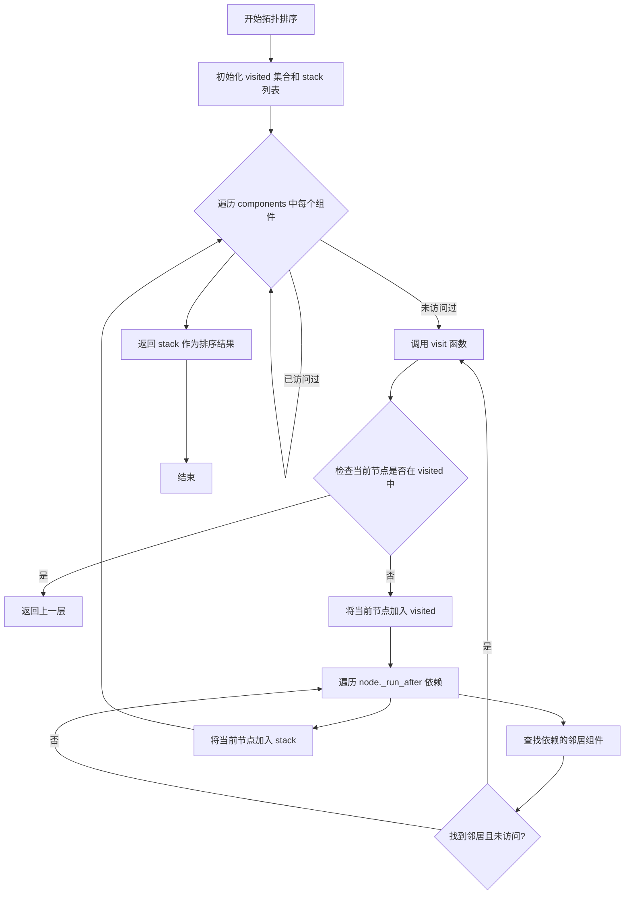

# `.\AutoGPT\classic\forge\forge\agent\base.py` 详细设计文档

这是一个多代理系统的核心框架，提供了代理的配置管理、组件生命周期管理、管道执行以及拓扑排序等功能，支持通过元类自动收集和排序组件，实现了灵活的可扩展代理架构。

## 整体流程



## 类结构

```
SystemConfiguration (基类)
├── BaseAgentConfiguration
SystemSettings (基类)
├── BaseAgentSettings
ABCMeta (元类)
├── AgentMeta
BaseAgent (泛型类)
├── components: list[AgentComponent]
│   ├── 依赖拓扑排序
│   └── 管道执行机制
```

## 全局变量及字段


### `DEFAULT_TRIGGERING_PROMPT`
    
默认触发提示词

类型：`str`
    


### `T`
    
泛型类型变量

类型：`TypeVar`
    


### `P`
    
参数规格类型变量

类型：`ParamSpec`
    


### `BaseAgentConfiguration.allow_fs_access`
    
是否允许文件系统访问

类型：`bool`
    


### `BaseAgentConfiguration.fast_llm`
    
快速LLM模型名称

类型：`ModelName`
    


### `BaseAgentConfiguration.smart_llm`
    
智能LLM模型名称

类型：`ModelName`
    


### `BaseAgentConfiguration.use_functions_api`
    
是否使用Functions API

类型：`bool`
    


### `BaseAgentConfiguration.default_cycle_instruction`
    
思考周期默认指令

类型：`str`
    


### `BaseAgentConfiguration.big_brain`
    
是否使用智能LLM

类型：`bool`
    


### `BaseAgentConfiguration.cycle_budget`
    
代理无监督运行周期数

类型：`Optional[int]`
    


### `BaseAgentConfiguration.cycles_remaining`
    
剩余周期数

类型：`int`
    


### `BaseAgentConfiguration.cycle_count`
    
已运行周期数

类型：`int`
    


### `BaseAgentConfiguration.send_token_limit`
    
提示构建的token限制

类型：`Optional[int]`
    


### `BaseAgentSettings.agent_id`
    
代理唯一标识

类型：`str`
    


### `BaseAgentSettings.ai_profile`
    
AI人格配置

类型：`AIProfile`
    


### `BaseAgentSettings.directives`
    
指令集

类型：`AIDirectives`
    


### `BaseAgentSettings.task`
    
用户任务描述

类型：`str`
    


### `BaseAgentSettings.config`
    
代理配置

类型：`BaseAgentConfiguration`
    


### `BaseAgent.state`
    
代理状态

类型：`BaseAgentSettings`
    


### `BaseAgent.components`
    
组件列表

类型：`list[AgentComponent]`
    


### `BaseAgent.config`
    
配置引用

类型：`BaseAgentConfiguration`
    


### `BaseAgent._trace`
    
执行追踪日志

类型：`list[str]`
    
    

## 全局函数及方法


### `BaseAgentConfiguration.validate_openai_functions`

验证 OpenAI Functions 模型兼容性，确保当启用 `use_functions_api` 时，smart_llm 和 fast_llm 都不是不支持 Functions 的旧版本模型（如 -0301 或 -0314 后缀的模型）。

参数：

- `value`：`bool`，传入的 `use_functions_api` 字段值，表示是否启用 OpenAI Functions API
- `info`：`ValidationInfo`，Pydantic 的验证上下文，包含当前模型的所有字段数据（`info.data`）

返回值：`bool`，验证通过后返回原始值 `value`

#### 流程图



#### 带注释源码

```python
@field_validator("use_functions_api")
def validate_openai_functions(cls, value: bool, info: ValidationInfo):
    """
    验证 OpenAI Functions 模型兼容性
    
    当 use_functions_api 启用时，确保 smart_llm 和 fast_llm
    都不是不支持 OpenAI Functions 的旧版本模型
    """
    # 只有当启用 functions API 时才进行验证
    if value:
        # 从验证信息中获取 smart_llm 和 fast_llm 的配置值
        smart_llm = info.data["smart_llm"]
        fast_llm = info.data["fast_llm"]
        
        # 断言检查：确保两个模型都不包含旧版本后缀
        # 旧版本模型（如 gpt-4-0314）不支持 Functions API
        assert all(
            [
                not any(s in name for s in {"-0301", "-0314"})
                for name in {smart_llm, fast_llm}
            ]
        ), (
            f"Model {smart_llm} does not support OpenAI Functions. "
            "Please disable OPENAI_FUNCTIONS or choose a suitable model."
        )
    
    # 验证通过后返回原始值
    return value
```


### `AgentMeta.__call__`

元类 `AgentMeta` 的 `__call__` 方法是一个元类钩子，在创建 `BaseAgent` 或其子类实例时自动被调用。它首先通过父类 `ABCMeta` 的 `__call__` 创建实例，然后立即调用实例的 `_collect_components()` 方法自动收集并排序所有已注册的代理组件，最后返回完全初始化好的实例。

参数：

- `cls`：`type`，元类本身，Python 元类机制自动传递
- `*args`：`tuple[Any, ...]`，可变位置参数，用于传递给 `BaseAgent.__init__`
- `**kwargs`：`dict[str, Any]`，可变关键字参数，用于传递给 `BaseAgent.__init__`

返回值：`BaseAgent`，返回创建并初始化好的代理实例

#### 流程图

```mermaid
flowchart TD
    A[开始: cls.__call__] --> B{接收 *args, **kwargs}
    B --> C[调用 super().__call__(*args, **kwargs)]
    C --> D[创建 BaseAgent/Agent 实例]
    D --> E[调用 instance._collect_components]
    E --> F[自动收集所有 AgentComponent]
    F --> G[拓扑排序组件]
    G --> H[返回实例]
```

#### 带注释源码

```python
class AgentMeta(ABCMeta):
    def __call__(cls, *args, **kwargs):
        """
        元类 __call__ 钩子，在类实例化时自动执行
        
        当创建 BaseAgent 或其子类（如 Agent）的实例时，
        Python 会调用元类的 __call__ 方法而不是直接调用 __new__ 和 __init__
        """
        # 步骤1: 通过父类 ABCMeta 的 __call__ 创建实例
        # 这会先调用 __new__ 创建对象，再调用 __init__ 初始化
        instance = super().__call__(*args, **kwargs)
        
        # 步骤2: 实例创建完成后，自动收集所有组件
        # _collect_components 会扫描实例的所有属性，找出 AgentComponent 类型
        # 的属性并进行拓扑排序，确保组件按依赖顺序执行
        instance._collect_components()
        
        # 步骤3: 返回完全初始化好的实例
        return instance
```


### `BaseAgent.propose_action`

抽象方法，提出下一步动作。该方法是 `BaseAgent` 的抽象接口，由子类实现，用于基于当前状态和上下文生成下一个执行提案（Action Proposal）。

参数：
- 无（仅 `self` 隐式参数）

返回值：`AnyProposal`，返回代理根据当前任务状态、目标和历史执行记录生成的下一个动作提案。

#### 流程图



#### 带注释源码

```python
@abstractmethod
async def propose_action(self) -> AnyProposal:
    """
    抽象方法：提出下一步动作
    
    由子类实现的抽象方法，用于：
    1. 分析当前代理状态（任务进度、上下文信息）
    2. 结合 AI 模型的推理能力生成下一步动作
    3. 返回一个动作提案 (AnyProposal) 供执行阶段使用
    
    Returns:
        AnyProposal: 包含建议动作的提案对象，包含动作名称和参数
        
    Note:
        这是一个抽象方法，子类必须实现具体的推理逻辑
        典型的实现会调用 LLM 并解析其响应来生成提案
    """
    ...
```


### `BaseAgent.execute`

抽象方法，执行由代理提出的动作。根据传入的 proposal（行动建议）执行相应的动作，并可选地结合用户反馈进行操作。返回动作执行的结果。

参数：

- `proposal`：`AnyProposal`，要执行的行动建议
- `user_feedback`：`str`，用户反馈，默认为空字符串

返回值：`ActionResult`，动作执行后的结果

#### 流程图



#### 带注释源码

```python
@abstractmethod
async def execute(
    self,
    proposal: AnyProposal,
    user_feedback: str = "",
) -> ActionResult:
    """
    抽象方法：执行由代理提出的动作。
    
    参数:
        proposal: AnyProposal - 建议执行的动作
        user_feedback: str - 用户反馈，可用于影响执行行为
    
    返回:
        ActionResult - 动作执行结果
    """
    ...
```


### `BaseAgent.do_not_execute`

抽象方法，拒绝执行动作。当用户拒绝某个提案时，此方法被调用来处理被拒绝的提案并返回执行结果。

参数：

- `self`：隐含的 `BaseAgent` 实例，代表调用此方法的代理对象
- `denied_proposal`：`AnyProposal` 类型，被用户拒绝的提案
- `user_feedback`：`str` 类型，用户提供的拒绝原因或反馈信息

返回值：`ActionResult`，表示执行结果，包含动作执行的状态和信息

#### 流程图



#### 带注释源码

```python
@abstractmethod
async def do_not_execute(
    self,
    denied_proposal: AnyProposal,
    user_feedback: str,
) -> ActionResult:
    """
    抽象方法，拒绝执行动作。
    
    当用户拒绝某个提案时，此方法被调用来处理被拒绝的提案
    并返回执行结果。该方法的具体实现由子类提供。
    
    参数:
        denied_proposal: 被用户拒绝的提案，类型为 AnyProposal
        user_feedback: 用户提供的拒绝原因或反馈信息
    
    返回值:
        ActionResult: 包含执行结果的 ActionResult 对象
    """
    ...
```


### `BaseAgent.run_pipeline`

执行组件管道，支持重试机制。该方法通过协议名称匹配组件，遍历组件列表执行相应的方法，并在遇到 `ComponentEndpointError` 时重试当前组件，遇到 `EndpointPipelineError` 时重置整个管道。

参数：

- `protocol_method`：`Callable[P, Iterator[T] | None | Awaitable[None]]`，协议方法（可以是生成器或异步方法）
- `*args`：可变位置参数，传递给协议方法的参数
- `retry_limit`：`int`，重试次数限制，默认为 3

返回值：`list[T] | list[None]`，所有成功执行的组件返回结果的列表

#### 流程图



#### 带注释源码

```python
@overload
async def run_pipeline(
    self, protocol_method: Callable[P, Iterator[T]], *args, retry_limit: int = 3
) -> list[T]:
    """重载版本：处理返回 Iterator[T] 的协议方法"""
    ...

@overload
async def run_pipeline(
    self,
    protocol_method: Callable[P, None | Awaitable[None]],
    *args,
    retry_limit: int = 3,
) -> list[None]:
    """重载版本：处理返回 None 或 Awaitable[None] 的协议方法"""
    ...

async def run_pipeline(
    self,
    protocol_method: Callable[P, Iterator[T] | None | Awaitable[None]],
    *args,
    retry_limit: int = 3,
) -> list[T] | list[None]:
    """执行组件管道，支持重试机制"""
    # 获取协议方法的名称
    method_name = protocol_method.__name__
    # 从方法的全限定名中提取协议名称
    protocol_name = protocol_method.__qualname__.split(".")[0]
    # 从 protocols 模块中获取协议类
    protocol_class = getattr(protocols, protocol_name)
    
    # 验证协议类是否是 AgentComponent 的子类
    if not issubclass(protocol_class, AgentComponent):
        raise TypeError(f"{repr(protocol_method)} is not a protocol method")

    # 克隆参数以便在失败时回滚
    original_args = self._selective_copy(args)
    # 管道尝试次数计数器
    pipeline_attempts = 0
    # 存储方法执行结果的列表
    method_result: list[T] = []
    # 记录执行跟踪信息
    self._trace.append(f"⬇️  {Fore.BLUE}{method_name}{Fore.RESET}")

    # 外层循环：管道级别的重试
    while pipeline_attempts < retry_limit:
        try:
            # 遍历所有组件
            for component in self.components:
                # 跳过其他协议
                if not isinstance(component, protocol_class):
                    continue

                # 跳过已禁用的组件
                if not component.enabled:
                    self._trace.append(
                        f"   {Fore.LIGHTBLACK_EX}"
                        f"{component.__class__.__name__}{Fore.RESET}"
                    )
                    continue

                # 获取组件对应的协议方法
                method = cast(
                    Callable[..., Iterator[T] | None | Awaitable[None]] | None,
                    getattr(component, method_name, None)
                )
                if not callable(method):
                    continue

                # 组件级别的重试计数器
                component_attempts = 0
                # 内层循环：组件级别的重试
                while component_attempts < retry_limit:
                    try:
                        # 为组件复制参数
                        component_args = self._selective_copy(args)
                        # 执行方法
                        result = method(*component_args)
                        # 如果是协程则等待结果
                        if inspect.isawaitable(result):
                            result = await result
                        # 如果有结果则添加到结果列表
                        if result is not None:
                            method_result.extend(result)
                        # 更新 args 为组件处理后的参数
                        args = component_args
                        # 记录成功日志
                        self._trace.append(f"✅ {component.__class__.__name__}")

                    except ComponentEndpointError:
                        # 记录组件端点错误
                        self._trace.append(
                            f"❌ {Fore.YELLOW}{component.__class__.__name__}: "
                            f"ComponentEndpointError{Fore.RESET}"
                        )
                        # 在 ComponentEndpointError 时重试同一组件
                        component_attempts += 1
                        continue
                    # 成功的组件执行
                    break
            # 成功的管道执行
            break
            
        except EndpointPipelineError as e:
            # 记录管道端点错误
            self._trace.append(
                f"❌ {Fore.LIGHTRED_EX}{e.triggerer.__class__.__name__}: "
                f"EndpointPipelineError{Fore.RESET}"
            )
            # 在 EndpointPipelineError 时从头开始重启
            # 回滚到原始参数
            args = self._selective_copy(original_args)
            pipeline_attempts += 1
            continue  # 重新开始循环
            
        except Exception as e:
            # 其他异常直接抛出
            raise e
            
    # 返回所有成功执行的结果
    return method_result
```


### `BaseAgent.dump_component_configs`

该方法遍历代理中的所有组件，将实现了 `ConfigurableComponent` 接口的组件配置收集到一个字典中，然后使用 Pydantic Core 的 `to_json` 函数将配置序列化为 JSON 格式的字符串返回。

参数：
- （无额外参数，`self` 为隐含参数）

返回值：`str`，返回包含所有可配置组件配置的 JSON 字符串，格式为 `{"ConfigTypeName": {...config...}, ...}`

#### 流程图



#### 带注释源码

```python
def dump_component_configs(self) -> str:
    """
    导出所有可配置组件的当前配置为 JSON 字符串。
    
    该方法遍历代理中的所有组件，筛选出实现了 ConfigurableComponent
    接口的组件，并将其配置收集到一个字典中，最后序列化为 JSON 格式返回。
    
    Returns:
        str: 包含所有组件配置的 JSON 字符串，键为配置类名，值为配置对象
    """
    # 初始化用于存储组件配置的字典
    # 键为配置类型名称，值为配置对象
    configs: dict[str, Any] = {}
    
    # 遍历代理中的所有组件
    for component in self.components:
        # 检查组件是否实现了 ConfigurableComponent 接口
        if isinstance(component, ConfigurableComponent):
            # 获取配置类的名称作为字典的键
            config_type_name = component.config.__class__.__name__
            # 将配置对象添加到字典中
            configs[config_type_name] = component.config
    
    # 使用 pydantic_core 的 to_json 将字典序列化为 JSON 字节串
    # 然后解码为字符串返回
    return to_json(configs).decode()
```


### `BaseAgent.load_component_configs`

该方法从JSON字符串加载并更新代理组件的配置，通过合并现有配置与新配置数据来动态更新可配置组件的设置。

参数：

- `self`：BaseAgent 实例，当前代理对象
- `serialized_configs`：`str`，JSON 格式的序列化配置字符串，包含要加载的组件配置数据

返回值：`None`，该方法直接修改组件配置，无返回值

#### 流程图



#### 带注释源码

```python
def load_component_configs(self, serialized_configs: str):
    """
    从JSON字符串加载并更新代理组件的配置
    
    参数:
        serialized_configs: JSON格式的序列化配置字符串
    """
    # 使用pydantic_core的from_json将JSON字符串解析为字典
    # 字典结构: {配置类型名称: {配置字段: 值}}
    configs_dict: dict[str, dict[str, Any]] = from_json(serialized_configs)

    # 遍历代理的所有组件
    for component in self.components:
        # 跳过不可配置的组件
        if not isinstance(component, ConfigurableComponent):
            continue
        
        # 获取组件当前配置的类型
        config_type = type(component.config)
        config_type_name = config_type.__name__
        
        # 检查该配置类型是否在加载的配置字典中
        if config_type_name in configs_dict:
            # 获取要更新的数据
            updated_data = configs_dict[config_type_name]
            
            # 合并配置：现有配置作为基础，更新数据覆盖
            # 使用model_dump()获取现有配置的字典形式
            data = {**component.config.model_dump(), **updated_data}
            
            # 使用合并后的数据创建新配置实例并更新组件
            component.config = component.config.__class__(**data)
```


### `BaseAgent._collect_components`

该方法用于收集并注册 AgentComponent 组件。它通过遍历 Agent 实例的所有属性，筛选出 `AgentComponent` 类型的实例，并根据组件间的依赖关系进行拓扑排序，最终将排序后的组件列表存储在 `self.components` 中。

参数：

- `self`：`BaseAgent`，执行该方法的 BaseAgent 实例本身

返回值：`None`，该方法无显式返回值，结果直接存储在实例的 `self.components` 属性中

#### 流程图



#### 带注释源码

```python
def _collect_components(self):
    """
    收集并注册 AgentComponent 组件。
    遍历 Agent 实例的所有属性，筛选出 AgentComponent 类型的实例，
    并根据 _run_after 依赖关系进行拓扑排序。
    """
    # 使用 dir(self) 获取实例的所有属性（包括继承的属性）
    components = [
        getattr(self, attr)  # 获取属性值
        for attr in dir(self)  # 遍历所有属性名
        # 筛选出类型为 AgentComponent 的属性
        if isinstance(getattr(self, attr), AgentComponent)
    ]

    # 检查 components 列表是否已存在（已初始化）
    if self.components:
        # 检查是否有组件被添加到 Agent 但未添加到 components 列表
        for component in components:
            if component not in self.components:
                # 记录警告日志，提示组件配置问题
                logger.warning(
                    f"Component {component.__class__.__name__} "
                    "is attached to an agent but not added to components list"
                )
        # 如果排序已明确完成，则跳过收集和排序，直接返回
        return
    
    # 执行拓扑排序并更新 self.components
    self.components = self._topological_sort(components)
```


### `BaseAgent._topological_sort`

该方法实现了基于深度优先搜索（DFS）的拓扑排序算法，用于确定 Agent 组件的执行顺序。通过分析每个组件的 `_run_after` 依赖关系，确保依赖的组件在其依赖者之前执行。

参数：

- `self`：`BaseAgent`，当前 BaseAgent 实例
- `components`：`list[AgentComponent]` ，需要进行拓扑排序的组件列表

返回值：`list[AgentComponent]`，排序后的组件列表，按依赖顺序（从无依赖到强依赖）排列

#### 流程图



#### 带注释源码

```python
def _topological_sort(
    self, components: list[AgentComponent]
) -> list[AgentComponent]:
    """
    对组件列表进行拓扑排序，确定组件的执行顺序。
    
    该方法基于深度优先搜索（DFS）算法实现，通过分析组件的 _run_after 
    属性来确定执行顺序。如果组件A在组件B的 _run_after 列表中，
    则A必须在B之前执行。
    
    参数:
        components: 需要排序的 AgentComponent 实例列表
        
    返回值:
        排序后的组件列表，顺序为：先执行无依赖的组件，最后执行依赖最多的组件
    """
    # 已访问节点的集合，用于记录已经处理过的组件，避免重复处理
    visited = set()
    # 栈结构，用于存储排序后的结果（后进先出）
    stack = []

    def visit(node: AgentComponent):
        """
        递归访问节点的内部函数（DFS 深度优先搜索）
        
        参数:
            node: 当前要访问的 AgentComponent 节点
        """
        # 如果节点已经访问过，直接返回，避免循环依赖导致的无限递归
        if node in visited:
            return
        # 将当前节点标记为已访问
        visited.add(node)
        
        # 遍历当前节点的所有后继依赖（_run_after 表示该组件需要在哪些组件之后运行）
        for neighbor_class in node._run_after:
            # 在组件列表中查找属于 neighbor_class 的组件实例
            neighbor = next(
                (m for m in components if isinstance(m, neighbor_class)), None
            )
            # 如果找到邻居组件且该组件尚未被访问，则递归访问邻居
            if neighbor and neighbor not in visited:
                visit(neighbor)
        
        # 当前节点及其所有依赖都已处理完毕，将其加入结果栈
        # 由于是后进先出结构，最终 stack 中的顺序是：先处理的结果在后面
        stack.append(node)

    # 对列表中的每个组件进行访问（处理可能存在的多个独立依赖链）
    for component in components:
        visit(component)

    # 返回排序后的组件列表
    return stack
```


### `BaseAgent._selective_copy`

该方法用于对传入的参数元组进行选择性深拷贝，根据参数类型采用不同的拷贝策略：列表和字典使用浅拷贝，Pydantic BaseModel 使用深度拷贝，其他对象使用深拷贝，以确保在管道执行失败时能够恢复到原始参数状态。

参数：

- `args`：`tuple[Any, ...]`，需要拷贝的参数元组

返回值：`tuple[Any, ...]`，拷贝后的参数元组

#### 流程图

```mermaid
flowchart TD
    A[开始 _selective_copy] --> B[初始化空列表 copied_args]
    B --> C{args 中还有未处理的元素?}
    C -->|是| D[取出一个元素 item]
    D --> E{item 是 list 类型?}
    E -->|是| F[使用切片浅拷贝 item[:]]
    E -->|否| G{item 是 dict 类型?}
    G -->|是| H[使用 copy 方法浅拷贝 item.copy()]
    G -->|否| I{item 是 BaseModel 类型?}
    I -->|是| J[使用 model_copy 深度拷贝]
    I -->|否| K[使用 copy.deepcopy 深度拷贝]
    F --> L[将拷贝结果添加到 copied_args]
    H --> L
    J --> L
    K --> L
    L --> C
    C -->|否| M[将 copied_args 转为 tuple]
    M --> N[返回拷贝后的元组]
```

#### 带注释源码

```python
def _selective_copy(self, args: tuple[Any, ...]) -> tuple[Any, ...]:
    """
    对参数元组进行选择性深拷贝，根据类型采用不同的拷贝策略
    
    参数:
        args: 需要拷贝的参数元组
        
    返回:
        拷贝后的参数元组
    """
    copied_args = []
    for item in args:
        if isinstance(item, list):
            # 列表类型使用切片进行浅拷贝
            copied_item = item[:]
        elif isinstance(item, dict):
            # 字典类型使用 copy 方法进行浅拷贝
            copied_item = item.copy()
        elif isinstance(item, BaseModel):
            # Pydantic BaseModel 使用 model_copy 深度拷贝
            # deep=True 确保嵌套的模型也会被递归拷贝
            copied_item = item.model_copy(deep=True)
        else:
            # 其他对象使用 copy.deepcopy 进行深拷贝
            copied_item = copy.deepcopy(item)
        copied_args.append(copied_item)
    # 转换为元组返回
    return tuple(copied_args)
```

## 关键组件


### BaseAgentConfiguration

代理的基础配置类，定义了LLM模型选择、循环预算、token限制等核心运行参数，支持用户配置的默认值设置和OpenAI Functions验证。

### BaseAgentSettings

代理的运行时设置类，包含AI人格配置、指令 directives、任务描述和代理配置实例，用于初始化代理的完整状态。

### BaseAgent

核心代理基类，抽象了代理的行为接口。实现了组件管道执行机制（run_pipeline），支持组件的自动收集、拓扑排序和重试逻辑，具备配置序列化/反序列化能力。

### AgentMeta

代理元类，在实例创建后自动调用组件收集方法（_collect_components），实现了组件的自动注册和初始化流程。

### run_pipeline

管道执行方法，遍历代理组件列表，按协议类型筛选目标组件并执行对应方法。实现了重试机制（retry_limit）、异常处理（ComponentEndpointError、EndpointPipelineError）和参数回滚功能，支持迭代器和异步方法的统一处理。

### _collect_components

组件收集方法，通过反射遍历代理实例属性，识别所有AgentComponent类型的组件，并调用拓扑排序进行执行顺序排列。

### _topological_sort

拓扑排序算法，根据组件的_run_after依赖关系确定执行顺序，确保依赖组件先于当前组件执行。

### dump_component_configs / load_component_configs

配置序列化/反序列化方法，支持将代理组件的配置导出为JSON字符串，以及从JSON字符串恢复组件配置，实现配置的持久化和迁移。

### _selective_copy

参数选择性复制方法，对管道执行方法的输入参数进行深拷贝或浅拷贝（根据类型决定），支持列表浅拷贝、字典浅拷贝、Pydantic模型深拷贝和其他对象深拷贝，用于实现参数回滚。


## 问题及建议


### 已知问题

-   **验证器使用assert语句**：`validate_openai_functions`方法使用`assert`进行模型验证，在Python优化模式下（python -O）会被忽略，应改为显式抛出`ValueError`异常
-   **FIXME占位符**：`BaseAgentSettings.task`字段硬编码为"Terminate immediately"，存在FIXME注释标记，表明这是临时占位符
-   **不一致的复制策略**：`_selective_copy`方法对不同类型采用不同的复制策略（list/dict浅拷贝，BaseModel深拷贝，其他对象深拷贝），可能导致意外的副作用和数据不一致
-   **递归拓扑排序风险**：`_topological_sort`使用递归实现，在组件数量较多时可能触发Python递归深度限制
-   **使用dir()遍历属性**：`_collect_components`使用`dir(self)`遍历所有属性，包括魔法方法和继承属性，性能较低且可能包含非组件对象
-   **类型安全问题**：`run_pipeline`中大量使用`getattr`和`cast`进行类型转换，缺乏运行时类型检查
-   **cycles_remaining初始化问题**：`cycles_remaining`直接赋值为`cycle_budget`的默认值1，但字段定义顺序在`cycle_budget`之后，可能导致初始化顺序问题
-   **无限循环风险**：`run_pipeline`中的重试逻辑在某些异常情况下可能产生意外行为，特别是当组件持续抛出`ComponentEndpointError`时

### 优化建议

-   将`validate_openai_functions`中的`assert`语句改为显式的`raise ValueError()`，确保验证逻辑在任何情况下都生效
-   移除或替换`task`字段的FIXME占位符，可使用`Optional[str]`类型并设置合理的默认值或要求必需
-   统一`_selective_copy`的复制策略，建议全部使用深拷贝或根据调用场景明确指定复制深度
-   将`_topological_sort`改为迭代实现，使用显式的栈或队列结构避免递归深度问题
-   优化`_collect_components`的实现，使用`__class__.__mro__`或组件注册机制替代`dir(self)`反射
-   增强`run_pipeline`的类型安全性，可考虑使用Protocol和泛型约束替代动态属性访问
-   调整类字段定义顺序，确保`cycles_remaining`在`cycle_budget`之后正确初始化
-   在`run_pipeline`中添加最大重试次数保护，防止无限重试
-   考虑使用`dataclasses`或`attrs`简化配置类的定义，减少样板代码

## 其它


### 设计目标与约束

**设计目标**：
- 提供一个通用的、可扩展的Agent基类框架，支持组件化架构设计
- 支持多种LLM模型（fast_llm和smart_llm），允许灵活切换
- 通过组件（AgentComponent）机制实现功能模块化，支持拓扑排序执行顺序
- 提供配置管理和状态追踪能力，支持管道式（pipeline）执行和重试机制

**约束条件**：
- 必须继承自Generic[AnyProposal]和ABCMeta元类，以实现抽象基类和组件自动收集
- 配置必须使用Pydantic的BaseModel进行验证和类型检查
- 组件类必须实现AgentComponent接口
- LLM模型必须从CHAT_MODELS中选取，且使用functions_api时必须排除旧版本模型（-0301, -0314）
- cycle_budget为None时表示无限制运行，为0时表示立即停止

### 错误处理与异常设计

**异常类型**：
- `ComponentEndpointError`：单个组件执行过程中出现的错误，触发同一组件重试
- `EndpointPipelineError`：管道级别的错误，触发整个管道从头重试
- `TypeError`：当protocol_method不是有效的AgentComponent协议方法时抛出

**错误处理策略**：
- **组件级重试**：当ComponentEndpointError发生时，在同一组件内进行重试（component_attempts < retry_limit）
- **管道级重试**：当EndpointPipelineError发生时，重置参数并从第一个组件重新开始（pipeline_attempts < retry_limit）
- **参数恢复**：使用`_selective_copy`方法复制参数，失败时恢复到原始参数状态
- **追踪机制**：通过`_trace`列表记录每一步的执行状态，包括成功✅和失败❌标记

### 数据流与状态机

**主要数据流**：
1. 用户创建BaseAgent实例，传入BaseAgentSettings配置
2. AgentMeta元类在`__call__`中自动调用`_collect_components`收集所有AgentComponent
3. 调用`run_pipeline`方法驱动组件按拓扑排序顺序执行
4. 每个组件实现特定的protocol_method（如propose_action、execute等）
5. 组件执行结果通过Iterator累积返回

**状态变量**：
- `cycle_budget`：允许运行的周期数（None无限，1需用户审批，0停止）
- `cycles_remaining`：剩余可运行周期数
- `cycle_count`：已运行的周期数
- `config.big_brain`：是否使用smart_llm（True使用smart，False使用fast）
- `_trace`：执行追踪记录列表

**状态转换**：
- 初始化：cycles_remaining = cycle_budget，cycle_count = 0
- 每执行一个周期：cycles_remaining -= 1，cycle_count += 1
- cycles_remaining为0时触发停止条件

### 外部依赖与接口契约

**内部依赖**：
- `forge.agent.protocols`：协议定义，protocol_method必须来自此模块
- `forge.agent.components`：AgentComponent、ConfigurableComponent、ComponentEndpointError、EndpointPipelineError
- `forge.config.ai_directives.AIDirectives`：AI指令配置
- `forge.config.ai_profile.AIProfile`：AI人格配置
- `forge.llm.providers`：LLM提供者，包含CHAT_MODELS字典和ModelName枚举
- `forge.models.action`：ActionResult、AnyProposal
- `forge.models.config`：SystemConfiguration、SystemSettings、UserConfigurable

**外部依赖**：
- `pydantic`：配置验证、序列化（BaseModel、Field、field_validator）
- `pydantic_core`：JSON转换（from_json、to_json）
- `colorama`：终端彩色输出（Fore）
- `typing`：类型提示（Generic、TypeVar、ParamSpec等）
- `inspect`：可等待对象检查（isawaitable）

**接口契约**：
- AgentComponent必须实现特定的协议方法（如propose_action、execute等）
- ConfigurableComponent必须具有config属性
- protocol_method通过`__qualname__`获取协议类名，必须是AgentComponent的子类

### 并发与异步处理

**异步模型**：
- 基于async/await的协程模型
- 使用`inspect.isawaitable`判断方法返回值是否为协程
- 支持异步组件方法（Awaitable[None]）和同步迭代器方法（Iterator[T]）

**并发控制**：
- 无多线程或asyncio.gather并发执行
- 组件按拓扑顺序串行执行，每个组件内部同步处理
- 重试机制在单线程内通过循环实现

### 安全性考虑

**访问控制**：
- `allow_fs_access`：控制是否允许Agent访问文件系统
- `use_functions_api`：仅在支持的模型上启用OpenAI Functions

**输入验证**：
- 使用Pydantic的field_validator验证配置合法性
- 验证LLM模型名称不支持的版本（-0301, -0314）

### 性能考量

**优化策略**：
- 使用`_selective_copy`进行参数复制，对不同类型采用不同策略（list浅拷贝、dict浅拷贝、BaseModel深拷贝、其他对象深拷贝）
- 组件拓扑排序确保依赖组件先执行
- token限制计算：send_token_limit默认为llm.max_tokens的75%

**潜在瓶颈**：
- 每次重试都进行参数复制，可能影响性能
- 深度拷贝可能在大对象情况下造成性能问题

### 配置管理

**配置层次**：
- BaseAgentConfiguration：运行时配置（llm选择、cycle_budget等）
- BaseAgentSettings：基础设置（agent_id、ai_profile、directives、task）
- Component级别配置：通过ConfigurableComponent管理

**序列化支持**：
- `dump_component_configs`：将组件配置序列化为JSON字符串
- `load_component_configs`：从JSON字符串反序列化并更新组件配置

### 版本兼容性

**Python版本要求**：
- 代码使用`from __future__ import annotations`，需要Python 3.7+

**类型注解**：
- 使用泛型（Generic、TypeVar、ParamSpec）支持类型安全
- 使用Pydantic v2的API（model_copy而非copy）

**废弃标记**：
- task字段标注为`# FIXME: placeholder for forge.sdk.schema.Task`，表示当前为占位符

### 模块划分与职责

**核心模块**：
- `BaseAgentConfiguration`：Agent运行参数配置类
- `BaseAgentSettings`：Agent基础状态和配置类
- `BaseAgent`：Agent抽象基类，实现组件管理和管道执行
- `AgentMeta`：元类，负责实例创建后自动收集组件

**关键方法职责**：
- `run_pipeline`：管道执行入口，协调组件按序执行和重试
- `_collect_components`：自动发现并收集AgentComponent
- `_topological_sort`：基于依赖关系排序组件执行顺序
- `_selective_copy`：参数复制，支持状态恢复
- `dump_component_configs`/`load_component_configs`：配置持久化


    