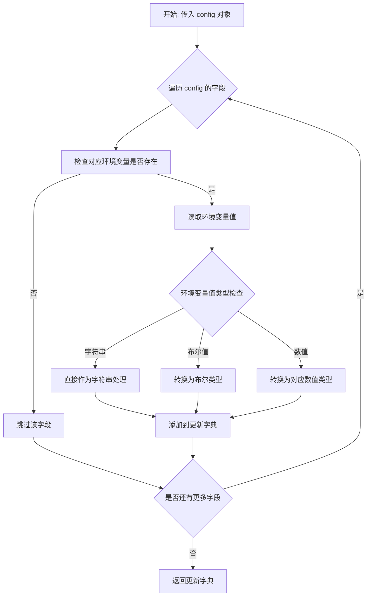
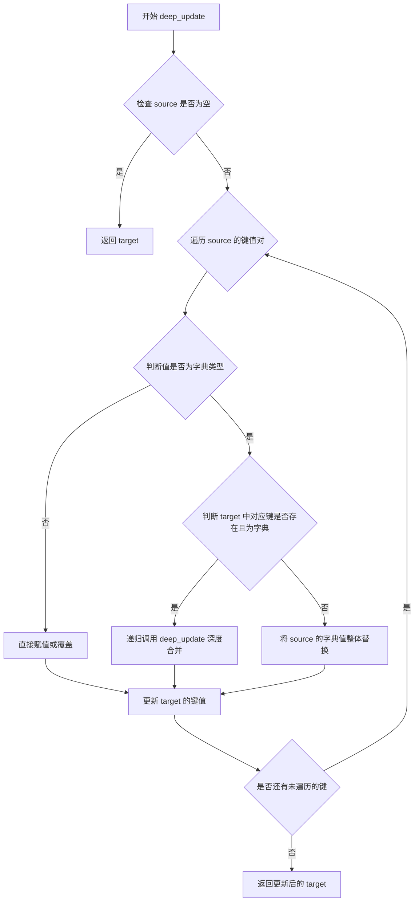
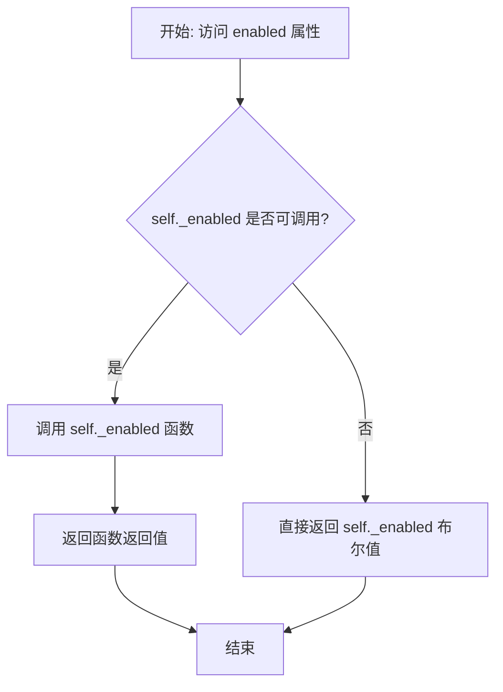
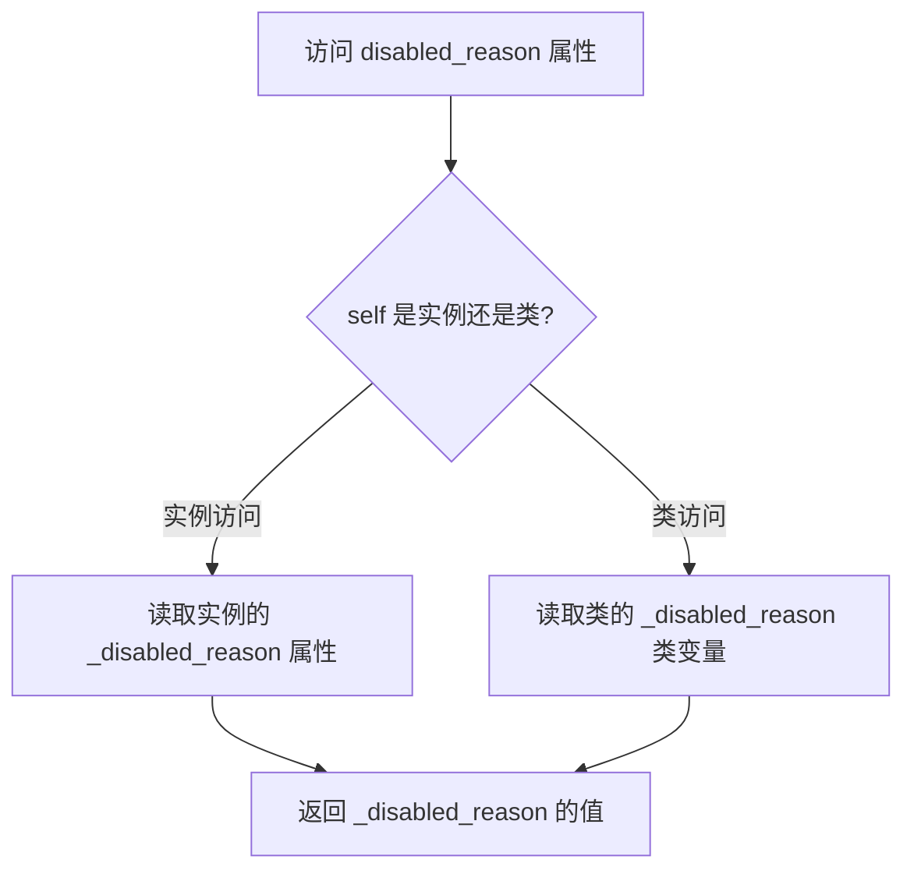
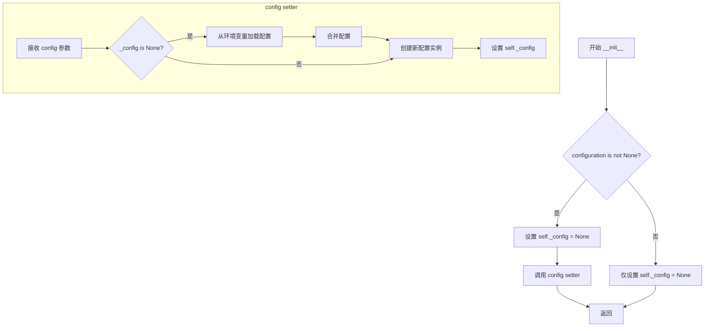
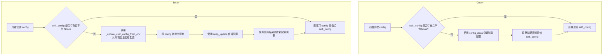
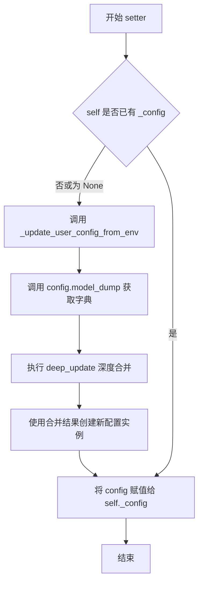

# `.\AutoGPT\classic\forge\forge\agent\components.py` 详细设计文档

这是一个组件框架的基础模块，定义了Agent组件的抽象基类、可配置组件的通用模式，以及分层级的异常处理体系，支持组件依赖排序和基于Pydantic模型的配置管理。

## 整体流程

```mermaid
graph TD
    A[模块加载] --> B[定义TypeVar泛型]
    B --> C[定义AgentComponent抽象基类]
    C --> D[定义ConfigurableComponent抽象基类]
    D --> E[定义异常类层次结构]
    E --> F[ComponentEndpointError]
    E --> G[EndpointPipelineError继承ComponentEndpointError]
    G --> H[ComponentSystemError继承EndpointPipelineError]
    C --> I[组件运行时检查]
    I --> J{_enabled是否为Callable?}
    J -- 是 --> K[调用_enabled()返回布尔值]
    J -- 否 --> L[直接返回_enabled值]
    D --> M[配置初始化流程]
    M --> N{configuration是否为空?}
    N -- 是 --> O[使用默认config_class创建实例]
    N -- 否 --> P[从环境变量加载配置并合并]
    P --> Q[创建_config实例]
```

## 类结构

```
Exception (内置)
└── ComponentEndpointError
    └── EndpointPipelineError
        └── ComponentSystemError

ABC (abc模块)
├── AgentComponent
└── ConfigurableComponent (Generic[BM])
```

## 全局变量及字段


### `AC`
    
类型变量，用于约束AgentComponent及其子类的类型

类型：`TypeVar`
    


### `BM`
    
类型变量，用于约束ConfigurableComponent的配置模型类型，必须继承自BaseModel

类型：`TypeVar`
    


### `_update_user_config_from_env`
    
从环境变量更新用户配置的外部函数

类型：`Callable`
    


### `deep_update`
    
深度更新字典的外部函数

类型：`Callable`
    


### `AgentComponent._run_after`
    
类变量，存储该组件应该在其之后运行的组件类型列表

类型：`list[type[AgentComponent]]`
    


### `AgentComponent._enabled`
    
类变量，控制组件是否启用的标志，可以是布尔值或返回布尔值的可调用对象

类型：`Callable[[], bool] | bool`
    


### `AgentComponent._disabled_reason`
    
类变量，存储组件被禁用的原因描述

类型：`str`
    


### `ConfigurableComponent.config_class`
    
类变量，定义配置模型的类型，必须在子类中指定

类型：`ClassVar[type[BM]]`
    


### `ConfigurableComponent._config`
    
实例变量，存储当前配置实例，可为空

类型：`Optional[BM]`
    


### `ComponentEndpointError.message`
    
错误消息字符串

类型：`str`
    


### `ComponentEndpointError.triggerer`
    
触发该错误的AgentComponent实例

类型：`AgentComponent`
    
    

## 全局函数及方法


### `_update_user_config_from_env`

从环境变量更新用户配置信息的函数。该函数读取环境变量并将其映射到配置对象的相应字段，实现配置的热更新机制。

**注意**：当前提供的代码片段中仅包含对该函数的导入和调用，函数的具体实现源码（位于 `forge.models.config` 模块中）未在当前代码片段中呈现。以下信息基于对该函数的调用方式推断得出。

参数：

-  `config`：`BaseModel`（具体类型由 `ConfigurableComponent` 的泛型参数 `BM` 决定），需要从环境变量更新的配置对象

返回值：`dict`，从环境变量提取的键值对字典，用于更新原始配置

#### 流程图



#### 调用位置与上下文

```
文件: forge/components.py (当前代码片段)
类: ConfigurableComponent
方法: config setter

def config(self, config: BM):
    if not hasattr(self, "_config") or self._config is None:
        # Load configuration from environment variables
        updated = _update_user_config_from_env(config)
        config = self.config_class(**deep_update(config.model_dump(), updated))
    self._config = config
```

#### 带注释源码

```python
# 注意：以下为基于调用方式的推断代码，实际实现可能有所不同
# 实际源码位于 forge.models.config 模块中

def _update_user_config_from_env(config: BaseModel) -> dict:
    """
    从环境变量中读取配置值并更新用户配置。
    
    该函数通常遵循以下逻辑：
    1. 获取配置模型的所有字段
    2. 将字段名转换为环境变量格式（通常为大写和下划线分隔）
    3. 检查对应的环境变量是否存在
    4. 如果存在，读取并转换其值
    5. 返回包含所有环境变量更新的字典
    """
    # 推断的实现逻辑（实际代码可能不同）
    updates = {}
    for field_name, field_info in config.model_fields.items():
        # 构建环境变量名称，例如: database_url -> DATABASE_URL
        env_var_name = field_name.upper()
        
        # 检查环境变量是否存在
        import os
        env_value = os.environ.get(env_var_name)
        
        if env_value is not None:
            # 根据字段类型进行值转换
            # 例如：布尔值转换、整数转换等
            try:
                # 类型推断和转换逻辑
                if field_info.annotation is bool:
                    # 布尔类型转换
                    updates[field_name] = env_value.lower() in ('true', '1', 'yes')
                elif field_info.annotation in (int, float):
                    # 数值类型转换
                    updates[field_name] = field_info.annotation(env_value)
                else:
                    # 字符串类型
                    updates[field_name] = env_value
            except (ValueError, TypeError):
                # 转换失败时保留原值或跳过
                pass
    
    return updates
```

#### 相关函数：`deep_update`

在调用 `_update_user_config_from_env` 后，代码使用 `deep_update` 函数进行深度合并：

```python
from forge.models.config import _update_user_config_from_env, deep_update

# 使用示例
updated = _update_user_config_from_env(config)
config = self.config_class(**deep_update(config.model_dump(), updated))
```

- `config.model_dump()`：将 Pydantic 模型转换为字典
- `deep_update`：深度合并两个字典，优先使用 `updated` 中的值
- `self.config_class(**...)`：使用合并后的字典重新创建配置对象

#### 设计意图

该函数实现了一个配置热更新机制，允许用户通过环境变量覆盖或补充代码中的默认配置，无需修改代码即可调整组件行为。


### `deep_update`

深度更新字典的函数，用于合并两个嵌套字典，将第二个字典的值递归地合并到第一个字典中，常用于配置更新场景。

参数：

- `target`：`dict`，目标字典，将被更新的字典
- `source`：`dict`，源字典，包含要合并到目标字典的值

返回值：`dict`，返回合并后的新字典

#### 流程图



#### 带注释源码

```
# deep_update 函数源码（位于 forge.models.config 模块中）
def deep_update(target: dict, source: dict) -> dict:
    """
    深度更新目标字典。
    
    该函数递归地将源字典中的值合并到目标字典中。
    如果源字典中的值是字典类型，且目标字典中对应键的值也是字典，
    则进行深度递归合并；否则直接覆盖。
    
    参数:
        target: 目标字典，将被更新的字典
        source: 源字典，包含要合并到目标字典的值
    
    返回值:
        返回合并后的字典
    """
    # 遍历源字典的所有键值对
    for key, value in source.items():
        # 如果值是字典类型
        if isinstance(value, dict):
            # 获取目标字典中对应键的值
            target_value = target.get(key)
            # 如果目标值存在且也是字典，递归合并
            if isinstance(target_value, dict):
                # 递归调用深度更新
                target[key] = deep_update(target_value, value)
            else:
                # 否则直接用源字典的值覆盖
                target[key] = value
        else:
            # 非字典类型，直接赋值或覆盖
            target[key] = value
    
    # 返回更新后的目标字典
    return target
```

#### 在代码中的使用示例

在 `ConfigurableComponent` 类中的实际调用：

```python
@config.setter
def config(self, config: BM):
    if not hasattr(self, "_config") or self._config is None:
        # Load configuration from environment variables
        updated = _update_user_config_from_env(config)
        # 使用 deep_update 合并配置：updated 会覆盖 config.model_dump() 中的同名键
        config = self.config_class(**deep_update(config.model_dump(), updated))
    self._config = config
```

#### 注意事项

- 函数定义位于 `forge.models.config` 模块，当前代码文件仅导入并使用
- 这是一个**纯函数**，直接修改并返回目标字典（in-place 修改）
- 递归深度取决于字典嵌套层级，需要注意性能影响
- 该函数常用于应用配置的场景，允许环境变量覆盖默认配置


### `AgentComponent.enabled`

该属性用于判断当前组件是否启用。如果 `_enabled` 是可调用对象（函数），则调用它并返回结果；否则直接返回 `_enabled` 的布尔值。

参数：无（此属性不需要额外参数）

返回值：`bool`，返回组件的启用状态

#### 流程图



#### 带注释源码

```python
@property
def enabled(self) -> bool:
    """判断组件是否启用。
    
    如果 _enabled 是可调用对象，则调用它并返回结果；
    否则直接返回 _enabled 的布尔值。
    这允许组件的启用状态可以是静态的（布尔值）或动态的（函数）。
    """
    if callable(self._enabled):
        return self._enabled()
    return self._enabled
```

---

### 关联信息

#### 相关字段

| 名称 | 类型 | 描述 |
|------|------|------|
| `_enabled` | `Callable[[], bool] \| bool` | 类变量，控制组件是否启用，可以是静态布尔值或动态检查函数 |
| `_disabled_reason` | `str` | 类变量，存储组件被禁用的原因 |
| `_run_after` | `list[type[AgentComponent]]` | 类变量，存储该组件应在哪些组件之后运行的依赖关系 |

#### 技术债务与优化空间

1. **缺少缓存机制**：每次访问 `enabled` 属性时，如果 `_enabled` 是可调用对象，都会重新计算。在高频调用场景下可能存在性能问题，可考虑增加缓存逻辑。
2. **错误处理缺失**：当 `_enabled` 是可调用对象但调用抛出异常时，没有异常处理机制，可能导致程序中断。

#### 设计目标与约束

- **设计目标**：提供灵活的组件启用/禁用机制，支持静态配置和动态检查两种方式。
- **约束**：`_enabled` 必须为布尔值或返回布尔值的无参数可调用对象。

#### 错误处理与异常设计

当前实现没有对 `_enabled` 相关的错误进行处理。若 `_enabled` 为可调用对象且调用失败，异常会直接向上传播。建议在生产环境中添加异常处理，以提供更友好的错误信息。


### `AgentComponent.disabled_reason`

该属性返回组件被禁用的原因，通过返回类变量 `_disabled_reason` 的值来告知用户该组件不可用的具体原因。

参数：无

返回值：`str`，返回组件被禁用的描述信息，如果组件未被禁用则返回空字符串。

#### 流程图



#### 带注释源码

```python
@property
def disabled_reason(self) -> str:
    """Return the reason this component is disabled."""
    return self._disabled_reason
```


### `AgentComponent.run_after`

设置当前组件应在哪些组件之后运行的依赖关系，支持链式调用。

参数：

- `self: AC`：AgentComponent 实例本身，AC 为 AgentComponent 的子类型
- `*components: type[AgentComponent] | AgentComponent`：可变数量参数，接受组件类类型或组件实例

返回值：`AC`，返回实例本身（支持链式调用）

#### 流程图

```mermaid
flowchart TD
    A[开始 run_after] --> B{遍历 components 参数}
    B -->|有未处理组件| C{component 是类型?}
    C -->|是| D[t = component]
    C -->|否| E[t = type(component)]
    D --> F{t 在 self._run_after 中?}
    E --> F
    F -->|是| G[跳过该组件]
    F -->|否| H{t 是 self.__class__?}
    H -->|是| G
    H -->|否| I[将 t 添加到 self._run_after]
    G --> B
    I --> B
    B -->|全部处理完毕| J[返回 self]
```

#### 带注释源码

```python
def run_after(self: AC, *components: type[AgentComponent] | AgentComponent) -> AC:
    """Set the components that this component should run after."""
    # 遍历传入的所有组件（类型或实例）
    for component in components:
        # 判断传入的是类型还是实例，获取对应的类型
        t = component if isinstance(component, type) else type(component)
        # 只有当该类型不在列表中，且不是自身类时才添加
        if t not in self._run_after and t is not self.__class__:
            self._run_after.append(t)
    # 返回 self 以支持链式调用
    return self
```


### `ConfigurableComponent.__init__`

这是 `ConfigurableComponent` 类的初始化方法，用于接收并存储一个可选的 Pydantic 配置模型实例。如果提供了配置，则通过 setter 方法进行处理，可能涉及从环境变量加载配置。

参数：

- `configuration`：`Optional[BM]`（泛型类型 BM 的可选实例），用于初始化组件的配置对象。如果为 None，则使用默认配置。

返回值：无（`None`），`__init__` 方法不返回值。

#### 流程图



#### 带注释源码

```python
def __init__(self, configuration: Optional[BM]):
    """
    初始化 ConfigurableComponent 实例。
    
    参数:
        configuration: 可选的配置对象，类型为泛型 BM (必须是 Pydantic BaseModel 的子类)
    """
    # 1. 初始化私有配置属性为 None
    #    使用 ClassVar 定义的 config_class 需要在子类中实现
    self._config: Optional[BM] = None
    
    # 2. 如果传入了配置对象，则通过 setter 方法设置配置
    #    注意：不直接赋值，而是通过 config 属性 setter
    #    setter 会自动处理环境变量和配置合并
    if configuration is not None:
        self.config = configuration
```


### ConfigurableComponent.__init_subclass__

在子类被定义时自动调用的特殊方法，用于验证子类是否定义了必需的`config_class`类属性，确保所有ConfigurableComponent的子类都具备配置能力。

参数：

- `cls`：`type`，当前正在创建的子类类型
- `**kwargs`：`dict`，传递给父类的额外关键字参数

返回值：`None`，无返回值，仅进行验证和抛出异常

#### 流程图

```mermaid
flowchart TD
    A[子类定义触发] --> B[调用super().__init_subclass__]
    B --> C{检查config_class属性是否存在}
    C -->|存在| D[验证通过]
    C -->|不存在| E[抛出NotImplementedError]
    D --> F[子类定义成功]
    E --> G[阻止子类定义]
```

#### 带注释源码

```python
def __init_subclass__(cls, **kwargs):
    """
    子类定义时自动调用的特殊方法。
    
    当一个类继承ConfigurableComponent时，Python会自动调用此方法。
    该方法确保子类定义了config_class类属性，否则抛出异常。
    """
    # 调用父类的__init_subclass__方法，保持继承链的完整性
    super().__init_subclass__(**kwargs)
    
    # 检查子类是否定义了config_class类属性
    if getattr(cls, "config_class", None) is None:
        # 如果未定义，抛出NotImplementedError并提示开发者
        raise NotImplementedError(
            f"ConfigurableComponent subclass {cls.__name__} "
            "must define config_class class attribute."
        )
```

#### 设计说明

该方法实现了Python的`__init_subclass__`钩子机制，在类定义阶段进行验证而非实例化阶段，这样可以更早地发现配置缺失问题，符合"快速失败"（Fail Fast）设计原则。


### `ConfigurableComponent.config`

这是一个可配置组件的配置属性（property），用于获取或设置组件的配置对象。该属性在首次访问时若未设置配置，会自动创建默认配置实例；在设置配置时，若配置尚未初始化，会自动从环境变量加载并合并配置。

参数：

- `self`：无，隐式传递的实例引用
- `config`：`BM`（泛型类型），待设置的配置模型实例

返回值：`BM`，配置模型实例

#### 流程图



#### 带注释源码

```python
@property
def config(self) -> BM:
    """获取配置属性，若未设置则创建默认配置实例。
    
    首次访问时，如果 _config 为 None，则自动使用 config_class
    创建默认配置并返回。
    """
    # 检查 _config 属性是否存在或是否为 None
    if not hasattr(self, "_config") or self._config is None:
        # 创建默认配置实例
        self.config = self.config_class()
    # 返回当前配置对象
    return self._config  # type: ignore


@config.setter
def config(self, config: BM):
    """设置配置属性，支持从环境变量加载配置并合并。
    
    当配置尚未初始化时，会先从环境变量读取同名配置项，
    与传入配置进行深度合并后创建最终配置对象。
    """
    # 检查 _config 属性是否存在或是否为 None
    if not hasattr(self, "_config") or self._config is None:
        # 从环境变量加载配置更新
        updated = _update_user_config_from_env(config)
        # 将当前配置转换为字典，并与环境变量配置深度合并
        config = self.config_class(**deep_update(config.model_dump(), updated))
    # 将配置对象存储到实例属性
    self._config = config
```


### `ConfigurableComponent.config` (setter)

这是 `ConfigurableComponent` 类的配置属性 setter 方法，用于设置组件的配置对象。它接受一个泛型 `BM` 类型的配置模型，如果配置尚未初始化，则会从环境变量加载额外的配置参数并进行深度合并，最后将配置存储到实例属性中。

参数：

- `config`：`BM`，Pydantic 配置模型实例，要设置的组件配置对象

返回值：`None`，无返回值（Python setter 方法不返回值，仅执行配置赋值操作）

#### 流程图



#### 带注释源码

```python
@config.setter
def config(self, config: BM):
    """
    设置组件的配置。
    
    如果配置尚未初始化（self._config 为 None），则从环境变量加载
    额外的配置参数，与传入的配置进行深度合并后再存储。
    
    参数:
        config: BM 类型的 Pydantic BaseModel 配置实例
    """
    # 检查是否需要初始化配置（首次设置或尚未初始化）
    if not hasattr(self, "_config") or self._config is None:
        # 从环境变量加载配置更新
        # _update_user_config_from_env 会读取以组件名开头的环境变量
        updated = _update_user_config_from_env(config)
        
        # 将配置对象转为字典，与环境变量更新进行深度合并
        # deep_update 会递归合并嵌套的字典/模型结构
        config = self.config_class(**deep_update(config.model_dump(), updated))
    
    # 将最终配置存储到实例属性
    self._config = config
```


### `ComponentEndpointError.__init__`

该方法是 `ComponentEndpointError` 异常类的构造函数，用于创建一个组件端点错误实例，封装错误消息和触发该错误的组件信息。

参数：

- `message`：`str`，错误描述信息，说明具体发生了什么错误
- `component`：`AgentComponent`，触发此错误的组件实例，用于关联错误与具体组件

返回值：`None`，该方法为构造函数，不返回任何值

#### 流程图

```mermaid
flowchart TD
    A[开始 __init__] --> B[设置 self.message = message]
    B --> C[设置 self.triggerer = component]
    C --> D[调用 super().__init__(message)]
    D --> E[结束]
```

#### 带注释源码

```python
def __init__(self, message: str, component: AgentComponent):
    """
    初始化 ComponentEndpointError 异常实例。
    
    Args:
        message: 错误的描述信息，用于说明具体发生了什么错误。
        component: 触发此错误的 AgentComponent 实例，用于在异常中关联错误来源的组件。
    """
    # 将错误消息存储到实例属性中
    self.message = message
    # 存储触发错误的组件引用，便于后续错误追踪和处理
    self.triggerer = component
    # 调用父类 Exception 的初始化方法，完成异常对象的构建
    super().__init__(message)
```

## 关键组件


### AgentComponent

代理组件的抽象基类，提供了组件启用/禁用控制、执行顺序管理、禁用原因追踪等基础能力。

### ConfigurableComponent

可配置的组件抽象基类，基于 Pydantic 模型实现配置管理，支持从环境变量动态加载配置。

### ComponentEndpointError

单个组件端点/协议方法的错误异常类，包含错误消息和触发组件的引用。

### EndpointPipelineError

端点管道错误，继承自 ComponentEndpointError，用于表示整个端点管道执行过程中的错误。

### ComponentSystemError

组件系统错误，继承自 EndpointPipelineError，用于表示跨多个端点管道的系统级错误。

### _update_user_config_from_env

从环境变量更新用户配置的函数，用于实现配置的环境变量覆盖机制。

### deep_update

深度更新字典的函数，用于合并配置字典，支持嵌套结构的配置更新。


## 问题及建议


### 已知问题

-   **可变类变量导致的潜在状态共享问题**：`AgentComponent._run_after` 使用类变量 `[]` 作为默认值，这在 Python 中是一个常见的反模式。所有子类实例会共享同一个列表引用，可能导致意外的副作用和数据污染。
-   **config 属性递归调用风险**：`ConfigurableComponent.config` 属性的 getter 中调用 `self.config = self.config_class()`，虽然通过 `hasattr` 检查避免了无限递归，但这种自引用模式逻辑脆弱，容易在子类重写或复杂继承场景下产生意外行为。
-   **混合类型设计增加复杂性**：`AgentComponent._enabled` 同时支持 `bool` 和 `Callable[[], bool]` 两种类型，虽然提供了灵活性，但增加了调用方的类型判断成本和运行时开销。
-   **外部依赖隐式依赖**：`ConfigurableComponent.config` setter 中调用了 `forge.models.config` 模块的 `_update_user_config_from_env` 和 `deep_update` 函数，但这些函数未在此代码中定义，形成隐式外部依赖，降低了代码的自包含性。
-   **异常类未充分利用参数**：`ComponentEndpointError.__init__` 接收 `component` 参数但仅保存为 `triggerer`，直接传入的 `component` 参数未被使用，造成参数冗余。
-   **类型注解不完整**：多处使用 `# type: ignore` 抑制类型检查，如 `config_class: ClassVar[type[BM]]` 和 `return self._config  # type: ignore`，表明类型系统设计存在缺陷。
-   **run_after 方法修改类变量**：`run_after` 方法直接修改类变量 `self._run_after`，这会影响所有实例，可能导致意外的跨实例状态耦合。

### 优化建议

-   **修复可变类变量**：将 `_run_after` 改为在 `__init__` 或类方法中初始化，避免使用可变默认参数。可以通过元类或 `__init_subclass__` 为每个子类创建独立的列表副本。
-   **简化 config 属性逻辑**：重构 `config` 属性，移除 getter 中的递归 setter 调用，改用独立的初始化方法或在 `__init__` 中处理配置默认值。
-   **明确类型边界**：为 `_enabled` 使用 Union 类型或泛型约束，提供明确的类型守卫逻辑，避免运行时类型不确定性。
-   **显式化外部依赖**：在模块顶部添加类型注解或存根文件，明确 `_update_user_config_from_env` 和 `deep_update` 的接口契约，减少隐式依赖。
-   **清理异常类参数**：统一异常类的参数使用，要么直接使用 `component` 要么移除未使用的参数定义。
-   **完善类型注解**：通过泛型约束或 Protocol 定义替代 `# type: ignore`，提升类型安全性和代码可维护性。
-   **解耦 run_after 逻辑**：考虑将 `_run_after` 从类变量改为实例变量，或提供更明确的生命周期管理接口，避免跨实例状态污染。


## 其它


### 设计目标与约束

本代码定义了一个可扩展的Agent组件系统框架，核心目标是提供统一的组件基类和支持配置管理的抽象基类。设计约束包括：组件必须继承AgentComponent或ConfigurableComponent；ConfigurableComponent的子类必须定义config_class类属性；组件通过_run_after属性声明执行依赖关系；配置支持从环境变量动态更新。

### 错误处理与异常设计

代码定义了三个层级的异常类，形成从单个组件方法错误到整个系统错误的异常体系。ComponentEndpointError表示单个组件的端点方法错误，包含message和triggerer组件引用；EndpointPipelineError继承自ComponentEndpointError，表示整个管道执行错误；ComponentSystemError进一步表示多端点管道组的系统级错误。异常设计采用层级结构，便于调用方根据错误级别进行差异化处理。

### 数据流与状态机

组件系统通过run_after方法建立执行顺序依赖图。组件启用状态由_enabled属性控制，支持布尔值或无参 callable 两种形式。ConfigurableComponent的配置加载流程为：初始化时检查configuration参数，若不为空则触发配置 setter，在 setter 中依次执行环境变量更新(_update_user_config_from_env)和深度合并(deep_update)，最终生成最终配置对象。

### 外部依赖与接口契约

本代码依赖以下外部模块：pydantic.BaseModel用于配置模型；typing模块的TypeVar/Generic/ClassVar/Optional/Callable用于泛型支持；abc.ABC用于抽象基类；forge.models.config模块的_update_user_config_from_env和deep_update函数。ConfigurableComponent要求子类必须实现config_class类属性，该属性必须是BaseModel的子类。AgentComponent的_enabled属性必须为布尔值或返回布尔值的无参函数。

### 泛型设计说明

代码使用两个TypeVar：AC约束为AgentComponent类型，用于run_after方法的返回类型注解，实现链式调用；BM约束为BaseModel类型，用于ConfigurableComponent的泛型参数，确保配置类型安全。泛型设计使得子类可以保留类型信息，支持IDE的类型推断和静态检查。

### 继承体系设计

类继承层次为：AgentComponent → ConfigurableComponent(多继承ABC和Generic[BM])。AgentComponent提供组件启用/禁用机制和执行顺序管理；ConfigurableComponent在此基础上增加配置管理能力，通过__init_subclass__钩子强制子类定义config_class。双重继承使用ABCMeta元类，ABC确保抽象方法存在，Generic提供参数化类型支持。

### 配置管理机制

配置管理流程包含三个关键点：初始化时可传入配置对象；若未传入配置，访问config属性时自动使用config_class()创建默认配置；配置 setter 中会合并环境变量更新和用户配置。deep_update函数执行深度合并策略，允许配置对象中的嵌套字典和字典列表进行递归合并。_update_user_config_from_env函数负责从环境变量读取配置覆盖值。

### 安全与边界条件

代码存在以下边界条件处理：hasattr(self, "_config")检查用于判断配置属性是否已初始化；self._config is None检查区分未设置配置和显式设置为None的情况；run_after方法中通过isinstance和type判断参数类型，并排除自引用(self.__class__)。配置合并使用model_dump()将Pydantic模型转字典后再进行深度合并。


    