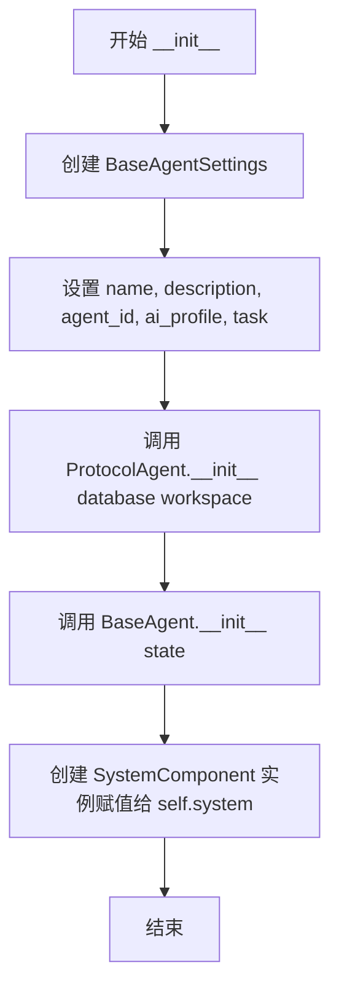
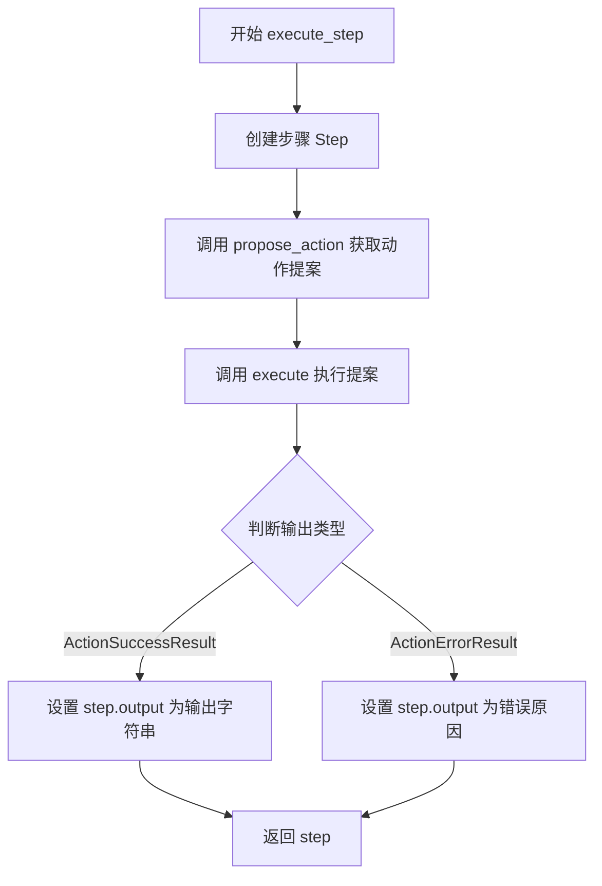
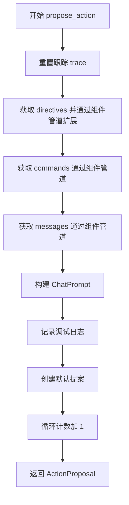
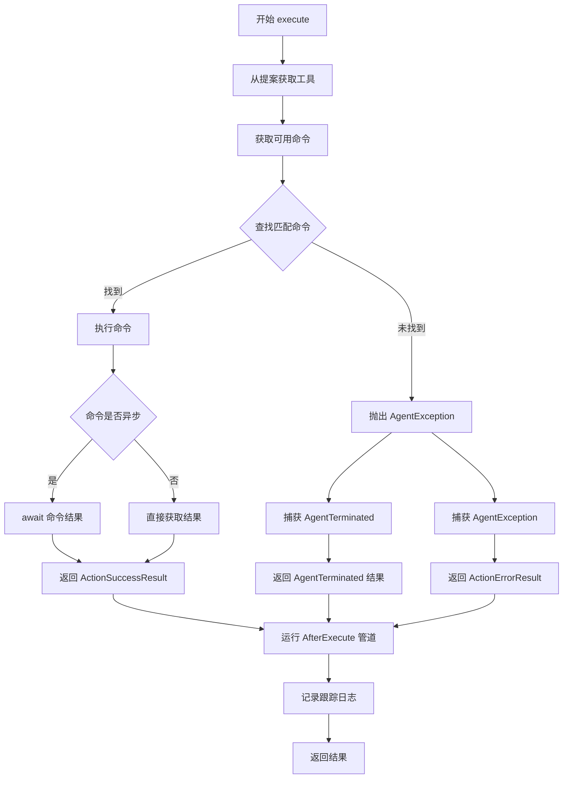
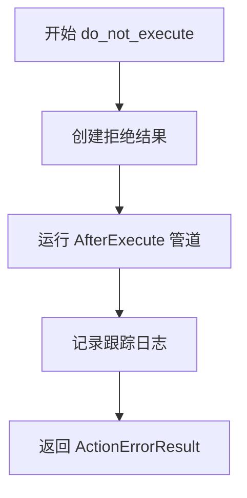
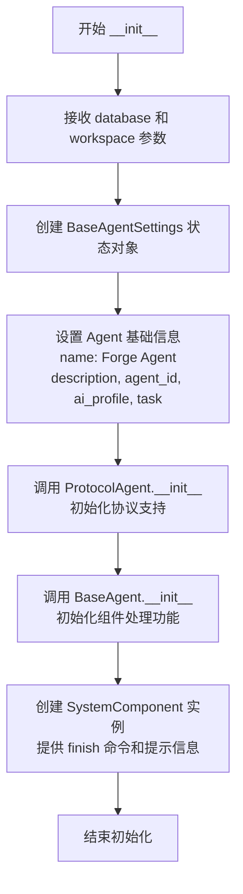
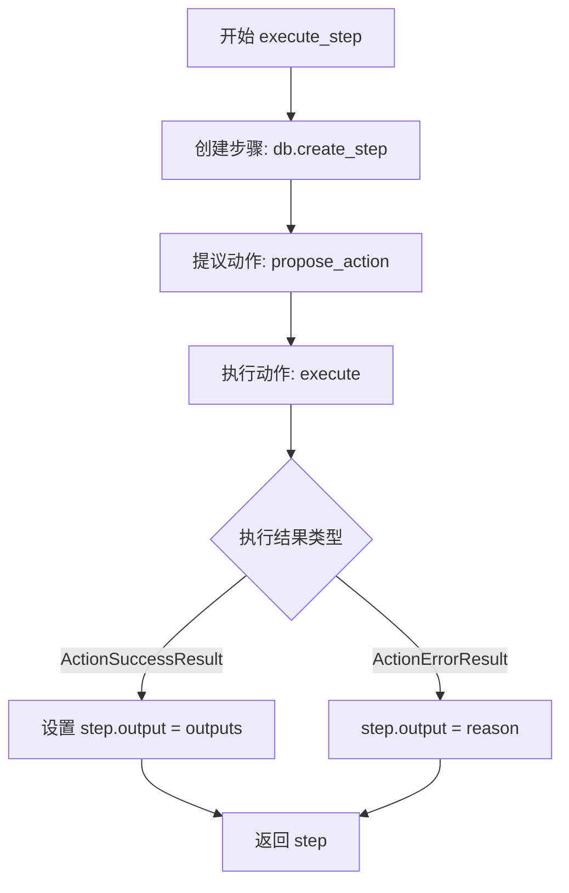
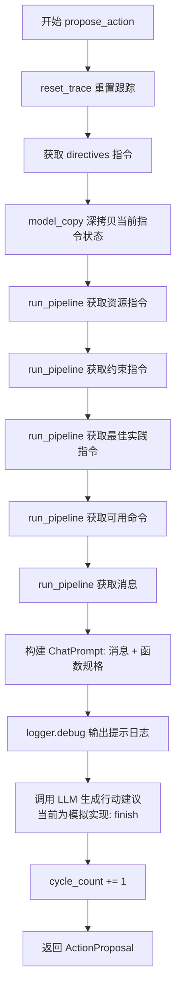
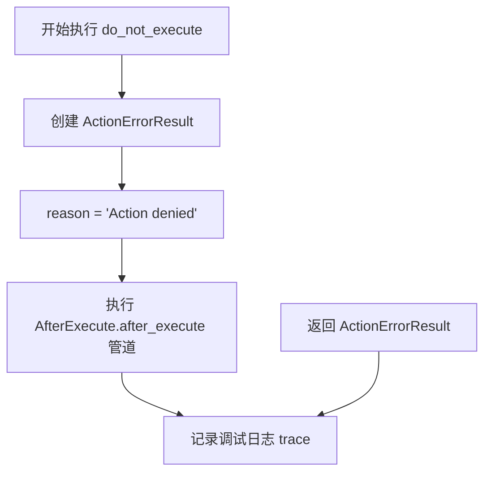

# `.\AutoGPT\classic\forge\forge\agent\forge_agent.py` 详细设计文档

ForgeAgent 是一个通用任务求解代理，继承自 ProtocolAgent 和 BaseAgent，提供组件化架构支持、任务/步骤管理、动作提案与执行等核心功能，旨在简化代理设计并处理 Agent Protocol 的标准工作流程。

## 整体流程

```mermaid
graph TD
    A[客户端请求] --> B{请求类型?}
    B -->|create_task| C[调用 create_task 方法]
    C --> C1[super().create_task 创建任务]
    C1 --> C2[记录日志并返回 Task]
    B -->|execute_step| D[调用 execute_step 方法]
    D --> D1[db.create_step 创建步骤]
    D1 --> D2[propose_action 提案动作]
    D2 --> D3[execute 执行动作]
    D3 --> D4[更新步骤输出]
    D4 --> D5[返回 Step]
    E[propose_action] --> E1[reset_trace 重置跟踪]
    E1 --> E2[获取 directives/commands/messages]
    E2 --> E3[构建 ChatPrompt]
    E3 --> E4[调用 LLM 获取提案]
    E4 --> E5[cycle_count 计数加一]
    E5 --> E6[返回 ActionProposal]
    F[execute] --> F1[获取 commands]
    F1 --> F2[查找匹配 command]
    F2 --> F3{找到?}
    F3 -->|是| F4[执行 command]
    F3 -->|否| F5[抛出 AgentException]
    F4 --> F6{异步?}
    F6 -->|是| F7[await 执行]
    F6 -->|否| F8[直接执行]
    F7 --> F9[返回 ActionSuccessResult]
    F8 --> F9
    F5 --> F10[返回 ActionErrorResult]
```

## 类结构

```
object
├── ProtocolAgent (混合类)
├── BaseAgent (混合类)
└── ForgeAgent (主类)
```

## 全局变量及字段


### `logger`
    
模块级日志记录器

类型：`logging.Logger`
    


### `ForgeAgent.system`
    
系统组件，提供 finish 命令和提示信息

类型：`SystemComponent`
    
    

## 全局函数及方法


## 1. 代码核心功能概述

ForgeAgent 是一个基于 Agent Protocol 的智能体框架核心类，通过集成 BaseAgent 的组件系统和 ProtocolAgent 的协议功能，实现任务的创建、执行步骤、动作建议和执行的核心逻辑，支持通过组件扩展智能体行为。

## 2. 文件整体运行流程

```
┌─────────────────────────────────────────────────────────────────┐
│                     ForgeAgent 初始化流程                        │
├─────────────────────────────────────────────────────────────────┤
│  1. 创建 BaseAgentSettings (name, description, agent_id,        │
│     ai_profile, task)                                           │
│  2. 调用 ProtocolAgent.__init__(database, workspace)            │
│  3. 调用 BaseAgent.__init__(state)                              │
│  4. 初始化 SystemComponent 系统组件                              │
└─────────────────────────────────────────────────────────────────┘
                              │
                              ▼
┌─────────────────────────────────────────────────────────────────┐
│                      任务处理主流程                               │
├─────────────────────────────────────────────────────────────────┤
│  create_task() → execute_step() → propose_action() → execute()  │
│                                                                  │
│  Step 1: create_task(task_request) → 创建任务并记录日志          │
│  Step 2: execute_step(task_id, step_request)                   │
│          ├─ 创建步骤                                             │
│          ├─ propose_action() → 获取指令、命令、消息              │
│          │   └─ 构建 ActionProposal                             │
│          └─ execute(proposal) → 执行命令并返回结果               │
└─────────────────────────────────────────────────────────────────┘
```

## 3. 类详细信息

### 3.1 类字段

| 字段名称 | 类型 | 描述 |
|---------|------|------|
| `system` | `SystemComponent` | 系统组件，提供"finish"命令和提示信息 |

### 3.2 类方法

#### 带注释源码

```
import inspect
import logging
from typing import Any, Optional
from uuid import uuid4

from forge.agent.base import BaseAgent, BaseAgentSettings
from forge.agent.protocols import (
    AfterExecute,
    CommandProvider,
    DirectiveProvider,
    MessageProvider,
)
from forge.agent_protocol.agent import ProtocolAgent
from forge.agent_protocol.database.db import AgentDB
from forge.agent_protocol.models.task import (
    Step,
    StepRequestBody,
    Task,
    TaskRequestBody,
)
from forge.command.command import Command
from forge.components.system.system import SystemComponent
from forge.config.ai_profile import AIProfile
from forge.file_storage.base import FileStorage
from forge.llm.prompting.schema import ChatPrompt
from forge.llm.prompting.utils import dump_prompt
from forge.llm.providers.schema import AssistantChatMessage, AssistantFunctionCall
from forge.llm.providers.utils import function_specs_from_commands
from forge.models.action import (
    ActionErrorResult,
    ActionProposal,
    ActionResult,
    ActionSuccessResult,
)
from forge.utils.exceptions import AgentException, AgentTerminated

logger = logging.getLogger(__name__)


class ForgeAgent(ProtocolAgent, BaseAgent):
    """
    The goal of the Forge is to take care of the boilerplate code,
    so you can focus on agent design.

    There is a great paper surveying the agent landscape: https://arxiv.org/abs/2308.11432
    Which I would highly recommend reading as it will help you understand the possibilities.

    ForgeAgent provides component support; https://docs.agpt.co/classic/forge/components/introduction/
    Using Components is a new way of building agents that is more flexible and easier to extend.
    Components replace some agent's logic and plugins with a more modular and composable system.
    """  # noqa: E501

    def __init__(self, database: AgentDB, workspace: FileStorage):
        """
        The database is used to store tasks, steps and artifact metadata.
        The workspace is used to store artifacts (files).
        """

        # An example agent information; you can modify this to suit your needs
        state = BaseAgentSettings(
            name="Forge Agent",
            description="The Forge Agent is a generic agent that can solve tasks.",
            agent_id=str(uuid4()),
            ai_profile=AIProfile(
                ai_name="ForgeAgent", ai_role="Generic Agent", ai_goals=["Solve tasks"]
            ),
            task="Solve tasks",
        )

        # ProtocolAgent adds the Agent Protocol (API) functionality
        ProtocolAgent.__init__(self, database, workspace)
        # BaseAgent provides the component handling functionality
        BaseAgent.__init__(self, state)

        # AGENT COMPONENTS
        # Components provide additional functionality to the agent
        # There are NO components added by default in the BaseAgent
        # You can create your own components or add existing ones
        # Built-in components:
        #   https://docs.agpt.co/classic/forge/components/built-in-components/

        # System component provides "finish" command and adds some prompt information
        self.system = SystemComponent()

    async def create_task(self, task_request: TaskRequestBody) -> Task:
        """
        The agent protocol, which is the core of the Forge,
        works by creating a task and then executing steps for that task.
        This method is called when the agent is asked to create a task.

        We are hooking into function to add a custom log message.
        Though you can do anything you want here.
        """
        task = await super().create_task(task_request)
        logger.info(
            f"📦 Task created with ID: {task.task_id} and "
            f"input: {task.input[:40]}{'...' if len(task.input) > 40 else ''}"
        )
        return task

    async def execute_step(self, task_id: str, step_request: StepRequestBody) -> Step:
        """
        Preffered method to add agent logic is to add custom components:
        https://docs.agpt.co/classic/forge/components/creating-components/

        Outdated tutorial on how to add custom logic:
        https://aiedge.medium.com/autogpt-forge-e3de53cc58ec

        The agent protocol, which is the core of the Forge, works by creating a task and then
        executing steps for that task. This method is called when the agent is asked to execute
        a step.

        The task that is created contains an input string, for the benchmarks this is the task
        the agent has been asked to solve and additional input, which is a dictionary and
        could contain anything.

        If you want to get the task use:

        ```
        task = await self.db.get_task(task_id)
        ```

        The step request body is essentially the same as the task request and contains an input
        string, for the benchmarks this is the task the agent has been asked to solve and
        additional input, which is a dictionary and could contain anything.

        You need to implement logic that will take in this step input and output the completed step
        as a step object. You can do everything in a single step or you can break it down into
        multiple steps. Returning a request to continue in the step output, the user can then decide
        if they want the agent to continue or not.
        """  # noqa: E501

        step = await self.db.create_step(
            task_id=task_id, input=step_request, is_last=False
        )

        proposal = await self.propose_action()

        output = await self.execute(proposal)

        if isinstance(output, ActionSuccessResult):
            step.output = str(output.outputs)
        elif isinstance(output, ActionErrorResult):
            step.output = output.reason

        return step

    async def propose_action(self) -> ActionProposal:
        self.reset_trace()

        # Get directives
        directives = self.state.directives.model_copy(deep=True)
        directives.resources += await self.run_pipeline(DirectiveProvider.get_resources)
        directives.constraints += await self.run_pipeline(
            DirectiveProvider.get_constraints
        )
        directives.best_practices += await self.run_pipeline(
            DirectiveProvider.get_best_practices
        )

        # Get commands
        self.commands = await self.run_pipeline(CommandProvider.get_commands)

        # Get messages
        messages = await self.run_pipeline(MessageProvider.get_messages)

        prompt: ChatPrompt = ChatPrompt(
            messages=messages, functions=function_specs_from_commands(self.commands)
        )

        logger.debug(f"Executing prompt:\n{dump_prompt(prompt)}")

        # Call the LLM and parse result
        # THIS NEEDS TO BE REPLACED WITH YOUR LLM CALL/LOGIC
        # Have a look at classic/original_autogpt/agents/agent.py
        # for an example (complete_and_parse)
        proposal = ActionProposal(
            thoughts="I cannot solve the task!",
            use_tool=AssistantFunctionCall(
                name="finish", arguments={"reason": "Unimplemented logic"}
            ),
            raw_message=AssistantChatMessage(
                content="finish(reason='Unimplemented logic')"
            ),
        )

        self.config.cycle_count += 1

        return proposal

    async def execute(self, proposal: Any, user_feedback: str = "") -> ActionResult:
        tool = proposal.use_tool

        # Get commands
        self.commands = await self.run_pipeline(CommandProvider.get_commands)

        # Execute the command
        try:
            command: Optional[Command] = None
            for c in reversed(self.commands):
                if tool.name in c.names:
                    command = c

            if command is None:
                raise AgentException(f"Command {tool.name} not found")

            command_result = command(**tool.arguments)
            if inspect.isawaitable(command_result):
                command_result = await command_result

            result = ActionSuccessResult(outputs=command_result)
        except AgentTerminated:
            result = ActionSuccessResult(outputs="Agent terminated or finished")
        except AgentException as e:
            result = ActionErrorResult.from_exception(e)
            logger.warning(f"{tool} raised an error: {e}")

        await self.run_pipeline(AfterExecute.after_execute, result)

        logger.debug("\n".join(self.trace))

        return result

    async def do_not_execute(
        self, denied_proposal: Any, user_feedback: str
    ) -> ActionResult:
        result = ActionErrorResult(reason="Action denied")

        await self.run_pipeline(AfterExecute.after_execute, result)

        logger.debug("\n".join(self.trace))

        return result
```

### 3.3 全局变量和全局函数

| 名称 | 类型 | 描述 |
|------|------|------|
| `logger` | `logging.Logger` | 模块级日志记录器，用于记录调试和信息日志 |

## 4. 方法详细信息

### `ForgeAgent.__init__`

类的构造函数，初始化 ForgeAgent 实例。

参数：

- `database`：`AgentDB`，用于存储任务、步骤和工件元数据的数据库
- `workspace`：`FileStorage`，用于存储工件（文件）的工作空间

返回值：无

#### 流程图



#### 带注释源码

```python
def __init__(self, database: AgentDB, workspace: FileStorage):
    """
    The database is used to store tasks, steps and artifact metadata.
    The workspace is used to store artifacts (files).
    """

    # 创建基础智能体设置对象
    state = BaseAgentSettings(
        name="Forge Agent",
        description="The Forge Agent is a generic agent that can solve tasks.",
        agent_id=str(uuid4()),  # 生成唯一智能体ID
        ai_profile=AIProfile(
            ai_name="ForgeAgent", ai_role="Generic Agent", ai_goals=["Solve tasks"]
        ),
        task="Solve tasks",
    )

    # ProtocolAgent 添加 Agent Protocol (API) 功能
    ProtocolAgent.__init__(self, database, workspace)
    # BaseAgent 提供组件处理功能
    BaseAgent.__init__(self, state)

    # 系统组件提供 "finish" 命令和提示信息
    self.system = SystemComponent()
```

---

### `ForgeAgent.create_task`

创建任务并记录日志。

参数：

- `task_request`：`TaskRequestBody`，任务请求体，包含任务输入和额外输入

返回值：`Task`，创建的任务对象

#### 流程图

```mermaid
flowchart TD
    A[开始 create_task] --> B[调用父类 super().create_task task_request]
    B --> C[记录任务创建日志]
    C --> D[返回 Task 对象]
```

#### 带注释源码

```python
async def create_task(self, task_request: TaskRequestBody) -> Task:
    """
    The agent protocol, which is the core of the Forge,
    works by creating a task and then executing steps for that task.
    This method is called when the agent is asked to create a task.

    We are hooking into function to add a custom log message.
    Though you can do anything you want here.
    """
    # 调用父类方法创建任务
    task = await super().create_task(task_request)
    # 记录任务创建日志，包含任务ID和输入摘要
    logger.info(
        f"📦 Task created with ID: {task.task_id} and "
        f"input: {task.input[:40]}{'...' if len(task.input) > 40 else ''}"
    )
    return task
```

---

### `ForgeAgent.execute_step`

执行智能体步骤的核心方法。

参数：

- `task_id`：`str`，任务ID
- `step_request`：`StepRequestBody`，步骤请求体，包含步骤输入和额外输入

返回值：`Step`，执行完成的步骤对象

#### 流程图



#### 带注释源码

```python
async def execute_step(self, task_id: str, step_request: StepRequestBody) -> Step:
    """
    Preffered method to add agent logic is to add custom components:
    ...
    """

    # 创建步骤记录
    step = await self.db.create_step(
        task_id=task_id, input=step_request, is_last=False
    )

    # 获取动作提案
    proposal = await self.propose_action()

    # 执行提案
    output = await self.execute(proposal)

    # 根据执行结果设置步骤输出
    if isinstance(output, ActionSuccessResult):
        step.output = str(output.outputs)
    elif isinstance(output, ActionErrorResult):
        step.output = output.reason

    return step
```

---

### `ForgeAgent.propose_action`

通过运行组件管道获取指令、命令和消息，生成动作提案。

参数：无

返回值：`ActionProposal`，动作提案对象

#### 流程图



#### 带注释源码

```python
async def propose_action(self) -> ActionProposal:
    # 重置跟踪信息
    self.reset_trace()

    # 获取并扩展指令（资源、约束、最佳实践）
    directives = self.state.directives.model_copy(deep=True)
    directives.resources += await self.run_pipeline(DirectiveProvider.get_resources)
    directives.constraints += await self.run_pipeline(
        DirectiveProvider.get_constraints
    )
    directives.best_practices += await self.run_pipeline(
        DirectiveProvider.get_best_practices
    )

    # 获取可用命令
    self.commands = await self.run_pipeline(CommandProvider.get_commands)

    # 获取消息
    messages = await self.run_pipeline(MessageProvider.get_messages)

    # 构建提示对象
    prompt: ChatPrompt = ChatPrompt(
        messages=messages, functions=function_specs_from_commands(self.commands)
    )

    logger.debug(f"Executing prompt:\n{dump_prompt(prompt)}")

    # 调用 LLM 并解析结果
    # 注意：这里需要替换为实际的 LLM 调用逻辑
    proposal = ActionProposal(
        thoughts="I cannot solve the task!",
        use_tool=AssistantFunctionCall(
            name="finish", arguments={"reason": "Unimplemented logic"}
        ),
        raw_message=AssistantChatMessage(
            content="finish(reason='Unimplemented logic')"
        ),
    )

    # 循环计数加 1
    self.config.cycle_count += 1

    return proposal
```

---

### `ForgeAgent.execute`

执行给定的动作提案。

参数：

- `proposal`：`Any`，动作提案对象
- `user_feedback`：`str`，用户反馈，默认为空字符串

返回值：`ActionResult`，执行结果

#### 流程图



#### 带注释源码

```python
async def execute(self, proposal: Any, user_feedback: str = "") -> ActionResult:
    # 从提案中获取工具调用
    tool = proposal.use_tool

    # 获取可用命令
    self.commands = await self.run_pipeline(CommandProvider.get_commands)

    # 执行命令
    try:
        command: Optional[Command] = None
        # 倒序遍历命令列表，查找匹配的工具名称
        for c in reversed(self.commands):
            if tool.name in c.names:
                command = c

        # 未找到命令则抛出异常
        if command is None:
            raise AgentException(f"Command {tool.name} not found")

        # 执行命令并处理异步结果
        command_result = command(**tool.arguments)
        if inspect.isawaitable(command_result):
            command_result = await command_result

        # 返回成功结果
        result = ActionSuccessResult(outputs=command_result)
    except AgentTerminated:
        # 智能体被终止
        result = ActionSuccessResult(outputs="Agent terminated or finished")
    except AgentException as e:
        # 处理智能体异常
        result = ActionErrorResult.from_exception(e)
        logger.warning(f"{tool} raised an error: {e}")

    # 运行执行后处理管道
    await self.run_pipeline(AfterExecute.after_execute, result)

    logger.debug("\n".join(self.trace))

    return result
```

---

### `ForgeAgent.do_not_execute`

处理被拒绝的动作提案。

参数：

- `denied_proposal`：`Any`，被拒绝的提案
- `user_feedback`：`str`，用户反馈

返回值：`ActionResult`，错误结果

#### 流程图



#### 带注释源码

```python
async def do_not_execute(
    self, denied_proposal: Any, user_feedback: str
) -> ActionResult:
    # 创建拒绝结果
    result = ActionErrorResult(reason="Action denied")

    # 运行执行后处理管道
    await self.run_pipeline(AfterExecute.after_execute, result)

    logger.debug("\n".join(self.trace))

    return result
```

---

## 5. 关键组件信息

| 组件名称 | 描述 |
|---------|------|
| `SystemComponent` | 提供"finish"命令和系统提示信息 |
| `BaseAgent` | 提供组件处理功能 |
| `ProtocolAgent` | 提供 Agent Protocol (API) 功能 |
| `AgentDB` | 存储任务、步骤和工件元数据 |
| `FileStorage` | 存储工件（文件） |

## 6. 潜在的技术债务或优化空间

1. **LLM 调用未实现**：`propose_action()` 方法中的 LLM 调用逻辑只是返回硬编码的默认值，需要实现真正的 LLM 调用
2. **命令查找效率低**：使用倒序遍历查找命令，可以考虑使用字典优化查找效率
3. **错误处理不完善**：部分异常未被捕获，可能导致未处理异常
4. **日志输出格式**：调试日志输出 trace 可能是大段文本，需要优化日志级别和格式
5. **组件系统未充分利用**：目前只添加了 SystemComponent，未展示组件的扩展能力

## 7. 其它项目

### 7.1 设计目标与约束

- **目标**：提供一个通用的智能体框架，处理任务创建、步骤执行和命令调用的样板代码
- **约束**：依赖 `forge` 框架的其他模块，需要实现特定的接口

### 7.2 错误处理与异常设计

- `AgentException`：命令未找到时抛出
- `AgentTerminated`：智能体被终止时捕获并返回成功结果
- `ActionErrorResult.from_exception(e)`：将异常转换为错误结果

### 7.3 数据流与状态机

```
TaskRequestBody → create_task() → Task
                                    ↓
Task + StepRequestBody → execute_step() → Step
                                          ↓
                               propose_action() → ActionProposal
                                          ↓
                               execute() → ActionResult
```

### 7.4 外部依赖与接口契约

- `AgentDB`：数据库接口
- `FileStorage`：文件存储接口
- `BaseAgentSettings`：智能体配置
- `CommandProvider`、`DirectiveProvider`、`MessageProvider`：组件管道提供者
- `AfterExecute`：执行后处理接口


### `ForgeAgent.__init__`

这是 ForgeAgent 类的初始化方法，负责设置代理的核心状态、初始化协议支持、基础代理功能和系统组件。

参数：

- `database`：`AgentDB`，用于存储任务、步骤和工件元数据的数据库实例
- `workspace`：`FileStorage`，用于存储工件（文件）的工作区实例

返回值：`None`，因为 `__init__` 方法不返回值，仅用于对象初始化

#### 流程图



#### 带注释源码

```python
def __init__(self, database: AgentDB, workspace: FileStorage):
    """
    The database is used to store tasks, steps and artifact metadata.
    The workspace is used to store artifacts (files).
    """

    # 创建一个示例代理信息配置，可根据需求修改
    state = BaseAgentSettings(
        name="Forge Agent",
        description="The Forge Agent is a generic agent that can solve tasks.",
        agent_id=str(uuid4()),  # 生成唯一的代理ID
        ai_profile=AIProfile(
            ai_name="ForgeAgent", ai_role="Generic Agent", ai_goals=["Solve tasks"]
        ),
        task="Solve tasks",
    )

    # ProtocolAgent 添加代理协议 (API) 功能
    # 负责处理 Agent Protocol 的核心逻辑
    ProtocolAgent.__init__(self, database, workspace)
    # BaseAgent 提供组件处理功能
    # 支持组件化的代理扩展机制
    BaseAgent.__init__(self, state)

    # AGENT COMPONENTS
    # 组件为代理提供额外的功能
    # BaseAgent 默认不添加任何组件
    # 可以创建自定义组件或添加现有组件
    # 内置组件参考:
    #   https://docs.agpt.co/classic/forge/components/built-in-components/

    # SystemComponent 提供 "finish" 命令并添加一些提示信息
    self.system = SystemComponent()
```


### `ForgeAgent.create_task`

创建任务的异步方法，通过调用父类方法创建任务并添加自定义日志记录。

参数：

-  `task_request`：`TaskRequestBody`，任务请求体，包含创建任务所需的输入数据

返回值：`Task`，创建完成的任务对象，包含任务ID和输入内容

#### 流程图

```mermaid
flowchart TD
    A[开始 create_task] --> B[接收 task_request 参数]
    B --> C[调用父类 super().create_task 创建任务]
    C --> D[await super().create_task task_request]
    D --> E{任务创建成功?}
    E -->|是| F[记录任务日志]
    E -->|否| G[抛出异常]
    F --> H[返回 Task 对象]
    G --> H
```

#### 带注释源码

```python
async def create_task(self, task_request: TaskRequestBody) -> Task:
    """
    The agent protocol, which is the core of the Forge,
    works by creating a task and then executing steps for that task.
    This method is called when the agent is asked to create a task.

    We are hooking into function to add a custom log message.
    Though you can do anything you want here.
    """
    # 调用父类的 create_task 方法创建任务
    task = await super().create_task(task_request)
    
    # 记录任务创建日志，包含任务ID和输入内容（前40个字符）
    logger.info(
        f"📦 Task created with ID: {task.task_id} and "
        f"input: {task.input[:40]}{'...' if len(task.input) > 40 else ''}"
    )
    
    # 返回创建的任务对象
    return task
```


### `ForgeAgent.execute_step`

该方法是 Forge Agent 的核心执行方法，负责接收任务 ID 和步骤请求体，创建步骤实例，通过提议动作、执行动作来处理输入，并将执行结果填充到步骤输出中返回。

参数：

- `task_id`：`str`，任务的唯一标识符，用于关联要执行的步骤
- `step_request`：`StepRequestBody`，步骤请求体，包含步骤的输入数据

返回值：`Step`，执行完成后的步骤对象，包含输出结果

#### 流程图



#### 带注释源码

```python
async def execute_step(self, task_id: str, step_request: StepRequestBody) -> Step:
    """
    首选的添加代理逻辑的方式是添加自定义组件：
    https://docs.agpt.co/classic/forge/components/creating-components/

    过时的添加自定义逻辑教程：
    https://aiedge.medium.com/autogpt-forge-e3de53cc58ec

    代理协议是 Forge 的核心，它通过创建任务然后为该任务执行步骤来工作。
    当代理被要求执行步骤时调用此方法。

    创建的任务包含一个输入字符串，对于基准测试来说，这是代理被要求解决的任务，
    还有附加输入，是一个字典，可以包含任何内容。

    如果你想获取任务，使用：
    task = await self.db.get_task(task_id)

    步骤请求体本质上与任务请求相同，包含一个输入字符串，对于基准测试来说，
    这是代理被要求解决的任务，还有附加输入，是一个字典，可以包含任何内容。

    你需要实现逻辑来接收这个步骤输入并输出完成的步骤对象。
    你可以在单个步骤中完成一切，也可以将其分解为多个步骤。
    在步骤输出中返回继续请求，用户可以决定是否继续代理。
    """

    # 第一步：在数据库中创建步骤记录
    # 使用 task_id 关联任务，is_last=False 表示这不是最后一步
    step = await self.db.create_step(
        task_id=task_id, input=step_request, is_last=False
    )

    # 第二步：提议动作
    # 通过 LLM 或其他逻辑生成要执行的动作提案
    proposal = await self.propose_action()

    # 第三步：执行提议的动作
    # 执行提案中指定的工具/命令并获取结果
    output = await self.execute(proposal)

    # 第四步：处理执行结果并设置步骤输出
    # 根据输出类型（成功或错误）填充 step.output 字段
    if isinstance(output, ActionSuccessResult):
        step.output = str(output.outputs)
    elif isinstance(output, ActionErrorResult):
        step.output = output.reason

    # 返回完成的步骤对象
    return step
```


### `ForgeAgent.propose_action`

该方法通过运行指令提供程序、命令提供程序和消息提供程序的管道来收集代理执行所需的信息，构建包含指令、命令和消息的提示，然后调用LLM（目前为模拟实现）生成行动建议（ActionProposal），并增加周期计数。

参数：

- 无

返回值：`ActionProposal`，表示代理根据当前状态和上下文提出的行动建议，包含思考过程、要使用的工具/命令以及原始消息。

#### 流程图



#### 带注释源码

```python
async def propose_action(self) -> ActionProposal:
    """
    提出行动建议的核心方法。
    通过收集指令、命令和消息，构建提示后调用LLM生成行动建议。
    """
    # 重置执行跟踪器，用于记录本次执行的详细信息
    self.reset_trace()

    # --- 获取指令 (Directives) ---
    # 指令包含资源、约束和最佳实践，用于指导代理行为
    # 深拷贝当前指令状态，避免修改原始状态
    directives = self.state.directives.model_copy(deep=True)
    
    # 从 DirectiveProvider 管道获取资源指令（可能来自多个组件）
    directives.resources += await self.run_pipeline(DirectiveProvider.get_resources)
    
    # 从 DirectiveProvider 管道获取约束指令
    directives.constraints += await self.run_pipeline(
        DirectiveProvider.get_constraints
    )
    
    # 从 DirectiveProvider 管道获取最佳实践指令
    directives.best_practices += await self.run_pipeline(
        DirectiveProvider.get_best_practices
    )

    # --- 获取命令 (Commands) ---
    # 命令是代理可以执行的操作，通过 CommandProvider 管道获取
    self.commands = await self.run_pipeline(CommandProvider.get_commands)

    # --- 获取消息 (Messages) ---
    # 消息用于构建 LLM 提示的对话历史
    messages = await self.run_pipeline(MessageProvider.get_messages)

    # --- 构建提示 ---
    # 将消息和命令的函数规格组合成 ChatPrompt
    prompt: ChatPrompt = ChatPrompt(
        messages=messages, 
        functions=function_specs_from_commands(self.commands)
    )

    # 调试日志：输出完整的提示内容
    logger.debug(f"Executing prompt:\n{dump_prompt(prompt)}")

    # --- 调用 LLM ---
    # 注意：当前实现是硬编码的模拟返回
    # 实际使用时需要替换为真正的 LLM 调用
    # 参考: classic/original_autogpt/agents/agent.py 中的 complete_and_parse 方法
    proposal = ActionProposal(
        thoughts="I cannot solve the task!",  # LLM 的思考过程
        use_tool=AssistantFunctionCall(
            name="finish",  # 使用的工具/命令名称
            arguments={"reason": "Unimplemented logic"}  # 工具参数
        ),
        raw_message=AssistantChatMessage(
            content="finish(reason='Unimplemented logic')"  # 原始消息
        ),
    )

    # 增加周期计数，用于跟踪代理执行的循环次数
    self.config.cycle_count += 1

    # 返回行动建议，供 execute 方法执行
    return proposal
```


### `ForgeAgent.execute`

该方法负责执行 Agent 根据 LLM 推理结果提出的动作提案（ActionProposal），通过命令注册表查找并调用对应的 Command，同时处理执行过程中的各类异常并返回标准化的执行结果。

参数：

- `proposal`：`Any`，代表 Agent 根据当前状态和上下文推理得到的动作提案，包含要执行的工具名称（use_tool.name）和参数（use_tool.arguments）
- `user_feedback`：`str = ""`，可选的用户反馈，当动作被拒绝或需要用户确认时使用，当前版本中未在实际逻辑中使用，仅保留接口扩展性

返回值：`ActionResult`，动作执行的结果对象，成功时返回 `ActionSuccessResult`（包含 outputs 字段），失败时返回 `ActionErrorResult`（包含 reason 字段）

#### 流程图

```mermaid
flowchart TD
    A[开始 execute] --> B[获取 proposal.use_tool]
    B --> C[运行 CommandProvider.get_commands 管道获取命令列表]
    C --> D[逆向遍历命令列表]
    D --> E{找到匹配的 Command?}
    E -->|是| F[获取 Command 对象]
    E -->|否| G[抛出 AgentException: Command not found]
    F --> H[执行 command(**tool.arguments)]
    H --> I{命令结果是否可等待?}
    I -->|是| J[await command_result]
    I -->|否| K[直接使用结果]
    J --> L[封装为 ActionSuccessResult]
    K --> L
    G --> M[捕获 AgentTerminated 异常]
    M --> N[返回 Agent terminated 成功结果]
    L --> O[异常处理: 捕获 AgentException]
    O --> P[记录警告日志]
    P --> Q[返回 ActionErrorResult]
    N --> R[运行 AfterExecute.after_execute 管道]
    Q --> R
    R --> S[记录 trace 日志]
    S --> T[返回 ActionResult]
```

#### 带注释源码

```python
async def execute(self, proposal: Any, user_feedback: str = "") -> ActionResult:
    """
    执行 Agent 提出的动作提案
    
    参数:
        proposal: ActionProposal 对象，包含 use_tool 字段定义要执行的工具
        user_feedback: 用户反馈字符串，保留用于扩展（当前未使用）
    
    返回:
        ActionResult: 执行结果，成功或错误
    """
    # 从提案中提取要执行的工具信息
    tool = proposal.use_tool

    # 通过组件管道获取当前可用的命令列表
    # CommandProvider 是组件接口，run_pipeline 会调用所有注册的 CommandProvider
    self.commands = await self.run_pipeline(CommandProvider.get_commands)

    # 执行命令的核心逻辑
    try:
        command: Optional[Command] = None
        # 逆向遍历命令列表（后注册的同名命令优先级更高）
        for c in reversed(self.commands):
            if tool.name in c.names:
                command = c

        # 如果未找到对应命令，抛出异常
        if command is None:
            raise AgentException(f"Command {tool.name} not found")

        # 使用工具参数调用命令
        command_result = command(**tool.arguments)
        # 如果命令是异步函数（返回协程），则等待其完成
        if inspect.isawaitable(command_result):
            command_result = await command_result

        # 成功执行，封装结果
        result = ActionSuccessResult(outputs=command_result)
    except AgentTerminated:
        # Agent 被终止的异常处理（通常由 finish 命令触发）
        result = ActionSuccessResult(outputs="Agent terminated or finished")
    except AgentException as e:
        # 其他 Agent 相关异常的通用处理
        result = ActionErrorResult.from_exception(e)
        logger.warning(f"{tool} raised an error: {e}")

    # 执行后置处理管道（AfterExecute 组件）
    await self.run_pipeline(AfterExecute.after_execute, result)

    # 记录执行跟踪信息
    logger.debug("\n".join(self.trace))

    return result
```


### `ForgeAgent.do_not_execute`

当用户拒绝执行某个提案时调用此方法，用于处理被拒绝的操作并记录相关日志。

参数：

- `denied_proposal`：`Any`，被用户拒绝的提案对象，包含用户不同意的操作信息
- `user_feedback`：`str`，用户提供的反馈信息，说明拒绝的原因

返回值：`ActionResult`，返回错误结果对象，包含拒绝原因

#### 流程图



#### 带注释源码

```python
async def do_not_execute(
    self, denied_proposal: Any, user_feedback: str
) -> ActionResult:
    """
    处理被用户拒绝执行的提案。
    
    参数:
        denied_proposal: 被拒绝的提案对象
        user_feedback: 用户提供的拒绝原因或反馈
    
    返回:
        ActionResult: 包含拒绝原因的错误结果
    """
    # 创建一个错误结果，标记操作被拒绝
    result = ActionErrorResult(reason="Action denied")

    # 运行 after_execute 管道，执行后续处理逻辑
    await self.run_pipeline(AfterExecute.after_execute, result)

    # 记录调试日志，输出完整的执行追踪信息
    logger.debug("\n".join(self.trace))

    # 返回拒绝执行的结果
    return result
```

## 关键组件


### ForgeAgent

核心代理类，继承自ProtocolAgent和BaseAgent，负责管理任务生命周期、步骤执行、组件系统和LLM交互。

### Task Management (任务管理)

通过create_task方法实现，负责创建任务并记录日志，包含任务ID生成和输入记录功能。

### Step Execution (步骤执行)

execute_step方法是核心执行逻辑，负责为任务创建步骤、提议动作、执行动作并返回结果，包含成功和错误处理。

### Action Proposal (动作提议)

propose_action方法实现LLM交互前的准备工作，包括获取指令约束、命令列表和消息历史，构建提示词供LLM调用。

### Action Execution (动作执行)

execute方法负责执行选定的命令，通过命令名称查找对应命令对象，支持同步和异步命令执行，处理执行结果和异常。

### Component System (组件系统)

基于run_pipeline方法实现的组件化架构，支持DirectiveProvider、CommandProvider、MessageProvider和AfterExecute等组件接口，便于扩展代理功能。

### Directive Providers (指令提供者)

提供资源、约束和最佳实践三类指令，通过pipeline机制聚合多个提供者的内容，用于构建LLM提示词的约束条件。

### Command Handling (命令处理)

通过CommandProvider获取可用命令列表，支持命令的异步执行和结果返回，包含命令查找和参数传递机制。

### Database Integration (数据库集成)

AgentDB实例负责持久化存储任务、步骤和工件元数据，提供create_task、create_step等数据库操作接口。

### Workspace (工作空间)

FileStorage实例用于存储和管理工件文件，提供文件读写和持久化能力。

### SystemComponent (系统组件)

内置组件，提供finish命令和提示词信息，是代理系统级功能的基础组件。

### Error Handling (错误处理)

包含AgentException和AgentTerminated异常处理，支持ActionSuccessResult和ActionErrorResult两种结果类型，实现完整的异常捕获和日志记录。

## 问题及建议


### 已知问题

- **未实现的 LLM 调用逻辑**：在 `propose_action` 方法中，LLM 调用被硬编码为返回固定的失败结果，注释明确指出 "THIS NEEDS TO BE REPLACED WITH YOUR LLM CALL/LOGIC"，这是一个核心功能的占位符实现。
- **类型注解使用 Any**：在 `execute` 和 `do_not_execute` 方法中，参数 `proposal` 和 `denied_proposal` 的类型注解为 `Any`，应该使用 `ActionProposal` 类型以提供类型安全。
- **未使用的参数**：`execute` 和 `do_not_execute` 方法中的 `user_feedback` 参数被传入但从未使用。
- **异常处理不完整**：`execute` 方法中捕获 `AgentTerminated` 异常后直接返回成功结果，逻辑不够严谨；同时 `tool.arguments` 直接解包传递给命令，没有验证其类型是否为字典。
- **代码重复**：`execute` 和 `do_not_execute` 方法中存在重复的代码模式（调用 `run_pipeline`、日志记录、返回结果），可以通过提取公共方法减少重复。
- **硬编码的 Agent 配置**：`BaseAgentSettings` 的初始化使用硬编码值（如 "Forge Agent"、AI 目标等），缺乏灵活性。
- **资源管理缺失**：数据库 `AgentDB` 和工作空间 `FileStorage` 在构造函数中传入，但没有对应的生命周期管理（如 `close` 方法或上下文管理器支持）。
- **循环变量命名不规范**：在 `execute` 方法中使用单字母变量 `c` 作为循环变量，应使用更具描述性的名称如 `command` 或 `cmd`。

### 优化建议

- **实现完整的 LLM 调用逻辑**：参考经典实现（如 `classic/original_autogpt/agents/agent.py` 中的 `complete_and_parse` 方法）替换当前的占位符实现。
- **强化类型注解**：将 `proposal` 参数类型从 `Any` 改为 `ActionProposal`，并考虑使用 `TypedDict` 或 Pydantic 模型验证 `tool.arguments` 的结构。
- **提取公共方法**：将 `execute` 和 `do_not_execute` 中的共同逻辑抽取为私有方法，如 `_finalize_result`。
- **添加资源管理**：实现 `async def close()` 方法或支持异步上下文管理器，确保数据库连接等资源被正确释放。
- **配置外部化**：允许通过构造函数参数或配置文件注入 Agent 名称、描述、AI 目标等配置，而非硬编码。
- **增强日志与追踪**：在关键路径添加更多日志记录（如 `logger.info` 在 `execute` 方法中记录执行结果），并考虑添加性能指标追踪。
- **完善异常处理**：重新评估 `AgentTerminated` 异常的处理逻辑，确保与系统状态机一致；添加对命令执行结果类型的验证。

## 其它


### 设计目标与约束

**设计目标：**
- 提供一个通用的Agent框架，处理任务创建、步骤执行和动作执行的完整流程
- 支持组件化架构，允许灵活扩展Agent功能
- 集成Agent Protocol标准，实现标准化的Agent通信接口

**设计约束：**
- 依赖ProtocolAgent和BaseAgent两个基类，需遵循其接口契约
- LLM调用逻辑需由使用者自行实现（当前为占位实现）
- 命令执行采用同步/异步混合模式，需处理awaitable结果

### 错误处理与异常设计

**异常类型：**
- `AgentException`：通用Agent异常，用于命令未找到等情况
- `AgentTerminated`：Agent被终止或完成时触发

**错误处理策略：**
- 命令查找失败抛出`AgentException`
- 命令执行结果需检查是否为awaitable并正确处理
- 动作执行结果分为`ActionSuccessResult`和`ActionErrorResult`两种
- 异常被捕获后转换为错误结果而非直接抛出，确保流程继续

### 数据流与状态机

**主要数据流：**
1. 任务创建流：`TaskRequestBody` → `create_task()` → `Task`
2. 步骤执行流：`StepRequestBody` → `execute_step()` → `Step`
3. 动作提议流：`propose_action()` → `ActionProposal`（包含thoughts和use_tool）
4. 动作执行流：`ActionProposal` → `execute()` → `ActionResult`

**状态管理：**
- `cycle_count`：记录执行周期数
- `trace`：记录执行跟踪信息
- `commands`：缓存当前可用命令列表

### 外部依赖与接口契约

**核心依赖：**
- `ProtocolAgent`：提供Agent Protocol (API)功能
- `BaseAgent`：提供组件处理功能
- `AgentDB`：任务、步骤和工件元数据的存储
- `FileStorage`：工件（文件）的存储

**接口契约：**
- `create_task(task_request: TaskRequestBody) -> Task`：创建任务
- `execute_step(task_id: str, step_request: StepRequestBody) -> Step`：执行步骤
- `propose_action() -> ActionProposal`：提议动作
- `execute(proposal: Any, user_feedback: str = "") -> ActionResult`：执行动作
- `do_not_execute(denied_proposal: Any, user_feedback: str) -> ActionResult`：拒绝执行

### 安全性考虑

- 命令参数直接通过`(**tool.arguments)`传递，存在潜在注入风险
- LLM返回的原始消息(`raw_message`)直接使用，需验证其合法性
- workspace文件存储需考虑路径遍历等安全问题

### 性能考虑

- `run_pipeline()`可能被多次调用（获取directives、commands、messages），存在优化空间
- 命令查找采用线性遍历(`reversed(self.commands)`)，可考虑建立索引
- 缺少缓存机制，相同请求可能重复处理

### 配置与可扩展性

**可扩展点：**
- 组件系统：可通过添加自定义Component扩展功能
- 命令系统：CommandProvider可提供自定义命令
- LLM逻辑：当前为占位实现，需替换为实际LLM调用

### 测试策略

- 单元测试：针对各方法进行独立测试
- 集成测试：测试与AgentDB、FileStorage的交互
- 模拟测试：模拟LLM响应测试动作执行流程

### 版本兼容性

- Python版本需支持async/await语法
- 依赖库版本需兼容`typing.Any`和`typing.Optional`
- 需确保与Agent Protocol规范的版本兼容

    