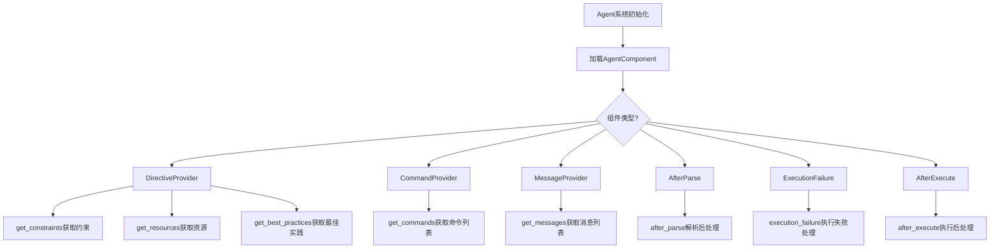
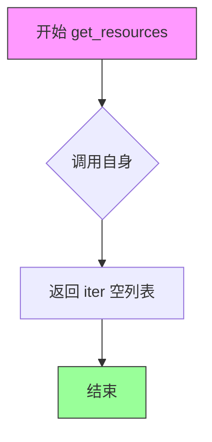

# `.\AutoGPT\classic\forge\forge\agent\protocols.py` 详细设计文档

定义了Agent系统的组件接口规范，包括指令提供器、命令提供器、消息提供器、解析后处理、执行失败处理和执行后处理等抽象基类，用于规范化和扩展Agent的行为能力

## 整体流程



## 类结构

```
AgentComponent (基类)
├── DirectiveProvider
│   ├── get_constraints()
│   ├── get_resources()
│   └── get_best_practices()
├── CommandProvider
│   └── get_commands()
├── MessageProvider
│   └── get_messages()
├── AfterParse<AnyProposal>
│   └── after_parse()
├── ExecutionFailure
│   └── execution_failure()
└── AfterExecute
    └── after_execute()
```

## 全局变量及字段


    

## 全局函数及方法


### `DirectiveProvider.get_constraints`

该方法用于获取代理（Agent）的约束条件列表，返回一个字符串迭代器。当前实现返回空迭代器，子类可重写此方法以提供具体的约束条件。

参数：无（仅含隐式参数 `self`）

返回值：`Iterator[str]`，返回约束条件字符串的迭代器

#### 流程图

```mermaid
flowchart TD
    A[调用 get_constraints] --> B{self 对象}
    B --> C[创建空迭代器 iter([])]
    C --> D[返回 Iterator[str]]
```

#### 带注释源码

```python
def get_constraints(self) -> Iterator[str]:
    """
    获取代理的约束条件列表
    
    该方法返回一个迭代器，包含代理在执行过程中需要遵守的约束条件。
    子类可以重写此方法以提供具体的约束条件。
    
    参数:
        无（仅含隐式参数 self）
    
    返回值:
        Iterator[str]: 约束条件字符串的迭代器
    """
    return iter([])  # 返回空迭代器，子类可重写以提供实际约束
```


### `DirectiveProvider.get_resources`

该方法定义在 `DirectiveProvider` 类中，用于返回可供 Agent 使用的外部资源列表。目前实现为返回空迭代器，子类可重写以提供具体的资源约束。

参数：

- 无（除隐式 `self` 参数）

返回值：`Iterator[str]` ，返回一个字符串类型的迭代器，用于遍历资源约束列表

#### 流程图



#### 带注释源码

```python
def get_resources(self) -> Iterator[str]:
    """
    获取可供 Agent 使用的资源约束列表。
    
    该方法返回一个迭代器，包含一系列字符串形式的资源描述。
    子类可以重写此方法以提供具体的资源列表，例如：
    - 文件系统路径
    - API 端点
    - 环境变量
    - 外部工具或服务
    
    Returns:
        Iterator[str]: 资源约束的字符串迭代器，当前实现返回空迭代器
    """
    return iter([])
```


### `DirectiveProvider.get_best_practices`

获取当前智能体（Agent）在执行任务时应遵循的最佳实践列表。该方法返回一个迭代器，包含一系列字符串形式的最佳实践指导原则，供 Agent 在生成响应或执行动作时参考。

**参数：**  
该方法没有参数。

**返回值：** `Iterator[str]`，返回一个字符串迭代器，包含 Agent 应该遵循的最佳实践。当前实现返回空迭代器。

#### 流程图

```mermaid
flowchart TD
    A[开始 get_best_practices] --> B{调用 iter([])}
    B --> C[返回空迭代器]
    C --> D[结束]
```

#### 带注释源码

```python
def get_best_practices(self) -> Iterator[str]:
    """
    获取智能体应遵循的最佳实践列表。
    
    该方法返回一个迭代器，包含一系列字符串形式的最佳实践。
    子类可以重写此方法以提供具体的最佳实践内容。
    
    返回:
        Iterator[str]: 包含最佳实践字符串的迭代器。当前返回空迭代器。
    """
    return iter([])
```


### `CommandProvider.get_commands`

获取该 Agent 可用的命令列表，由具体实现类提供具体的命令实现。

参数：

- `self`：`CommandProvider`，调用此方法的 CommandProvider 实例本身

返回值：`Iterator[Command]`，返回一个迭代器，用于遍历该 Agent 所支持的所有 Command 对象

#### 流程图

```mermaid
flowchart TD
    A[开始] --> B{调用 get_commands}
    B --> C[返回 Iterator[Command] 对象]
    C --> D[调用方遍历迭代器获取 Command]
    D --> E[结束]
    
    style B fill:#f9f,stroke:#333
    style C fill:#ff9,stroke:#333
```

#### 带注释源码

```python
class CommandProvider(AgentComponent):
    """
    命令提供者抽象基类
    
    继承自 AgentComponent，用于提供 Agent 可执行的命令集合。
    具体实现类需要实现 get_commands 方法来定义实际的命令。
    """
    
    @abstractmethod
    def get_commands(self) -> Iterator["Command"]:
        """
        获取该 Agent 支持的所有命令
        
        这是一个抽象方法，由子类实现。
        实现类应该返回一个迭代器，该迭代器产生当前 Agent
        能够执行的所有 Command 对象。
        
        Returns:
            Iterator[Command]: 一个迭代器，用于遍历所有可用的命令对象
        """
        ...
        # 注意：此方法为抽象方法，具体实现由子类提供
        # 子类实现示例：
        # def get_commands(self) -> Iterator["Command"]:
        #     yield CommandA()
        #     yield CommandB()
```


### `MessageProvider.get_messages`

获取聊天消息的迭代器，用于提供需要发送给语言模型的系统消息或上下文消息。

参数：

- （无参数）

返回值：`Iterator[ChatMessage]`，返回一个 ChatMessage 对象的迭代器，用于生成需要传递给语言模型的消息列表。

#### 流程图

```mermaid
flowchart TD
    A[开始] --> B{调用 get_messages}
    B --> C[返回 Iterator[ChatMessage] 迭代器]
    C --> D[迭代生成 ChatMessage 对象]
    D --> E[结束]
    
    style B fill:#f9f,stroke:#333,stroke-width:2px
    style C fill:#ff9,stroke:#333,stroke-width:2px
```

#### 带注释源码

```python
class MessageProvider(AgentComponent):
    """
    消息提供者抽象基类
    
    该类用于定义获取聊天消息的接口，由具体实现类提供
    聊天消息的内容，如系统提示、上下文信息等
    """
    
    @abstractmethod
    def get_messages(self) -> Iterator["ChatMessage"]:
        """
        获取聊天消息的迭代器
        
        这是一个抽象方法，子类必须实现此方法以提供
        具体的消息生成逻辑。该方法返回一个迭代器，
        用于遍历生成需要发送给语言模型的消息。
        
        Returns:
            Iterator[ChatMessage]: 聊天消息的迭代器，
            每次迭代返回一个 ChatMessage 对象
        """
        ...
```


### `AfterParse.after_parse`

这是一个抽象方法，定义在 `AfterParse` 泛型抽象类中，用于在解析完成后执行回调处理逻辑。该方法可以同步或异步执行，返回 `None` 或 `Awaitable[None]`。

参数：

- `result`：`AnyProposal`，解析结果对象，包含解析器处理后的提案数据

返回值：`None | Awaitable[None]`，无返回值或异步空返回值，表示处理完成后的回调操作

#### 流程图

```mermaid
flowchart TD
    A[调用 after_parse] --> B{result 是否有效?}
    B -->|是| C[执行业务逻辑]
    B -->|否| D[返回 None]
    C --> E{需要异步处理?}
    E -->|是| F[返回 Awaitable[None]]
    E -->|否| G[返回 None]
    D --> H[结束]
    F --> H
    G --> H
    
    style C fill:#f9f,stroke:#333
    style F fill:#9f9,stroke:#333
```

#### 带注释源码

```python
class AfterParse(AgentComponent, Generic[AnyProposal]):
    """解析后处理的抽象基类"""
    
    @abstractmethod
    def after_parse(self, result: AnyProposal) -> None | Awaitable[None]:
        """
        在解析完成后调用的回调方法
        
        参数:
            result: 解析结果，包含解析器处理后的提案数据
            
        返回值:
            None: 同步执行完成
            Awaitable[None]: 异步执行返回一个协程对象
            
        注意:
            - 这是一个抽象方法，需要子类实现具体逻辑
            - 可以选择同步或异步实现
            - result 的类型由泛型参数 AnyProposal 指定
        """
        ...
```


### `ExecutionFailure.execution_failure`

该方法定义了代理组件在执行过程中遇到错误时的回调处理逻辑，允许子类实现自定义的错误处理行为，如日志记录、错误恢复或状态更新等。

参数：

- `self`：`ExecutionFailure`，表示调用该方法的实例对象本身
- `error`：`Exception`，执行过程中捕获的异常对象，包含了错误的详细信息

返回值：`None | Awaitable[None]`，同步情况下返回 None，异步情况下返回 Awaitable[None]，用于支持同步和异步两种错误处理模式

#### 流程图

```mermaid
flowchart TD
    A[执行任务] --> B{是否发生异常?}
    B -->|是| C[调用 execution_failure]
    C --> D[传入 Exception 对象]
    D --> E{子类实现?}
    E -->|同步处理| F[执行同步错误处理逻辑]
    E -->|异步处理| G[执行异步错误处理逻辑]
    B -->|否| H[继续正常流程]
    F --> I[返回 None]
    G --> J[返回 Awaitable[None]]
```

#### 带注释源码

```python
class ExecutionFailure(AgentComponent):
    """
    执行失败回调抽象基类
    
    继承自 AgentComponent，用于定义代理组件在执行失败时的行为。
    子类可以实现具体的错误处理逻辑，如日志记录、错误恢复等。
    """
    
    @abstractmethod
    def execution_failure(self, error: Exception) -> None | Awaitable[None]:
        """
        执行失败时的回调方法
        
        这是一个抽象方法，子类必须实现具体的错误处理逻辑。
        支持同步和异步两种实现方式。
        
        参数:
            error: Exception - 执行过程中捕获的异常对象
            
        返回:
            None | Awaitable[None] - 同步处理返回 None，异步处理返回 awaitable 对象
        """
        ...
```


### `AfterExecute.after_execute`

这是一个抽象方法，定义了在动作执行完成后需要进行的回调操作。该方法接收执行结果作为参数，支持同步和异步两种执行方式，由具体的实现类提供实际逻辑。

参数：

- `result`：`ActionResult`，表示动作执行后的结果对象，包含执行状态、数据或错误信息

返回值：`None | Awaitable[None]`，无返回值，如果是异步实现则返回 awaitable 对象

#### 流程图

```mermaid
flowchart TD
    A[开始 after_execute] --> B{接收 ActionResult}
    B --> C[由子类实现具体逻辑]
    C --> D{是否异步方法?}
    D -->|是| E[返回 Awaitable[None]]
    D -->|否| F[返回 None]
    E --> G[结束]
    F --> G
```

#### 带注释源码

```python
class AfterExecute(AgentComponent):
    """执行后回调抽象基类，定义动作执行完成后的回调接口"""
    
    @abstractmethod
    def after_execute(self, result: "ActionResult") -> None | Awaitable[None]:
        """
        在动作执行完成后调用的回调方法
        
        参数:
            result: ActionResult - 动作执行的结果对象，包含执行状态、输出数据或错误信息
            
        返回值:
            None | Awaitable[None] - 同步执行时返回 None，异步执行时返回可等待的空对象
        """
        ...
```

## 关键组件


### DirectiveProvider

指令提供者组件，用于向Agent提供约束条件、资源信息和最佳实践。通过Iterator接口惰性加载各类指令，支持张量索引式的按需获取。

### CommandProvider

命令提供者抽象接口，定义了获取可执行命令的契约。支持动态命令注册和惰性加载机制，返回Iterator以实现高效迭代。

### MessageProvider

消息提供者抽象接口，负责生成聊天消息流。实现了惰性加载模式，支持按需获取消息内容，便于与外部消息系统集成。

### AfterParse

解析后处理钩子接口，通用型设计支持任意Proposal类型。在Agent解析完成后触发，允许对解析结果进行后处理或验证。

### ExecutionFailure

执行失败处理钩子接口，当Agent执行过程中发生异常时调用。提供了统一的错误处理入口，支持同步或异步的错误恢复逻辑。

### AfterExecute

执行后处理钩子接口，在ActionResult生成后触发。允许对执行结果进行后续处理，如日志记录、状态更新或结果转换。

### AgentComponent

所有组件的基类，定义了组件的通用接口和行为规范。作为插件系统的基座，支持多种组件类型的扩展和组合。


## 问题及建议


### 已知问题

- **泛型使用不当**：`AfterParse` 类中 `Generic[AnyProposal]` 的用法不正确。`AnyProposal` 是一个具体类型而非类型变量，不应作为泛型参数使用，这会导致类型检查工具的警告或错误。
- **类型提示不完整**：`AnyProposal` 在 `TYPE_CHECKING` 块外部被使用（`AfterParse` 类的泛型参数），但实际导入在非 TYPE_CHECKING 块中，可能导致运行时导入问题或类型解析不一致。
- **抽象方法与返回类型不匹配**：`AfterParse`、`ExecutionFailure`、`AfterExecute` 中的抽象方法返回 `None | Awaitable[None]`，但没有使用 `async def` 定义。这允许实现类以同步方式实现，但返回值类型声明为可等待对象，设计上存在歧义。
- **缺少具体类型定义**：`ActionResult` 在 `AfterExecute.after_execute` 方法参数中使用，但没有导入（仅在 `forge.models.action` 中定义），需要确保使用方能正确解析此类型。
- **设计模式不明确**：多个类都继承自 `AgentComponent`，但 `AgentComponent` 的定义未在代码中展示，无法确认其接口契约是否与这些提供者类一致。
- **空迭代器作为默认实现**：`DirectiveProvider` 的三个方法返回 `iter([])`，虽然功能正确，但这种硬编码的空迭代器可能不适合作为默认实现，考虑使用 `tuple()` 或明确的可迭代空对象。

### 优化建议

- **修复泛型定义**：将 `AfterParse` 改为 `Generic[T]`，并在实际使用时传入具体的提案类型作为类型参数，例如 `AfterParse[Proposal]`。
- **明确异步方法定义**：对于返回 `Awaitable[None]` 的方法，统一要求使用 `async def` 定义，避免同步实现导致的混淆，或提供更清晰的文档说明两种实现方式的适用场景。
- **统一类型导入方式**：将所有类型提示（包括 `ActionResult`、`Command`、`ChatMessage`、`AnyProposal`）放入 `TYPE_CHECKING` 块中，避免运行时不必要的导入。
- **添加类型参数约束**：为泛型 `T` 添加约束，例如 `Generic[T]` 可以限制为 `Protocol` 或基类，提高类型安全性。
- **重构空迭代器返回**：考虑使用 `yield from` 配合空生成器函数，或定义一个类级别的空迭代器常量，提高代码可读性和一致性。
- **补充文档注释**：为每个抽象类和抽象方法添加文档字符串，说明其职责、使用场景和实现要求。
- **考虑使用 Protocol**：如果这些类不需要共享实现，只是定义结构相似的方法集合，考虑使用 `Protocol` 替代继承 `AgentComponent`，以提供更灵活的类型检查。


## 其它


### 设计目标与约束

本模块采用抽象基类（ABC）设计模式，定义了一套可扩展的Agent组件接口契约。其核心设计目标包括：1）解耦Agent核心逻辑与扩展功能，通过抽象接口实现职责分离；2）提供统一的组件生命周期管理框架；3）支持同步/异步两种执行模式，通过返回类型注解`None | Awaitable[None]`实现灵活适配；4）遵循开闭原则，允许在不修改现有代码的情况下新增组件实现。

主要设计约束：所有组件类必须继承自`AgentComponent`基类；使用`Iterator`而非`List`以支持惰性求值和内存效率；通过`TYPE_CHECKING`避免运行时循环导入。

### 错误处理与异常设计

本代码片段为接口定义，未包含具体异常处理逻辑。但定义了`ExecutionFailure`抽象方法作为错误处理扩展点，该方法接收`Exception`参数，允许具体实现类自定义错误处理策略（如日志记录、重试机制、降级处理等）。

建议的错误处理原则：1）具体实现类应捕获并处理内部异常，避免向上传播；2）对于可恢复错误，应实现重试逻辑；3）对于不可恢复错误，应记录完整上下文后抛出；4）异步方法中需妥善处理`asyncio.CancelledError`。

### 数据流与状态机

本模块定义了Agent系统的扩展点接口，数据流如下：
1. `DirectiveProvider`提供约束、资源、最佳实践（指令型数据）
2. `CommandProvider`提供可用命令列表
3. `MessageProvider`提供聊天消息历史
4. `AfterParse`在提案解析后执行自定义逻辑
5. `AfterExecute`在动作执行后执行自定义逻辑
6. `ExecutionFailure`在执行失败时执行自定义逻辑

状态机视角：Agent生命周期可抽象为Parse→Validate→Execute→Feedback四个状态，各扩展点在不同状态转换时被调用。

### 外部依赖与接口契约

本模块依赖以下外部组件：
1. `forge.models.action.ActionResult` - 动作执行结果模型
2. `forge.models.action.AnyProposal` - 任意提案类型（泛型支持）
3. `forge.command.command.Command` - 命令对象（仅在类型检查时导入）
4. `forge.llm.providers.ChatMessage` - 聊天消息模型（仅在类型检查时导入）
5. `.components.AgentComponent` - 组件基类

接口契约规定：
- 所有Provider类的`get_*`方法必须返回`Iterator`类型
- 所有`*Provider`类必须实现`AgentComponent`
- 异步方法返回类型为`None | Awaitable[None]`，允许实现类灵活选择同步/异步实现

### 扩展点与插件机制

本模块采用策略模式+模板方法模式提供扩展点：
1. **指令扩展** - 通过`DirectiveProvider`的三个方法分别提供约束、资源、最佳实践
2. **命令扩展** - 通过`CommandProvider.get_commands()`暴露可用命令
3. **消息扩展** - 通过`MessageProvider.get_messages()`注入上下文消息
4. **生命周期钩子** - AfterParse、AfterExecute、ExecutionFailure提供执行流程的插入点

插件注册机制由具体实现类通过依赖注入框架完成，具体实现类应实现对应的抽象方法并注册到Agent系统中。

### 并发与异步处理设计

本模块支持同步/异步双模式：
1. 方法返回类型`None | Awaitable[None]`允许实现类根据场景选择
2. 使用`TYPE_CHECKING`避免循环导入的同时保持类型安全
3. `Iterator`类型确保惰性求值，避免一次性加载大量数据

异步使用规范：实现类若方法包含异步操作，应返回`Awaitable[None]`；调用方需使用`await`调用异步方法，对于返回`None`的方法应直接调用。

### 性能考量

1. **内存优化** - 使用`Iterator`替代`List`，支持大数据集流式处理
2. **惰性求值** - 各Provider方法在迭代时才执行具体逻辑
3. **类型检查分离** - `TYPE_CHECKING`避免运行时导入开销

潜在优化空间：可考虑添加缓存机制避免重复计算；可引入`__slots__`减少内存开销；可添加异步批处理支持。

### 安全性设计

本模块为纯接口定义，无敏感数据处理。具体实现类应遵循：
1. 命令执行前验证权限
2. 消息注入时过滤敏感信息
3. 资源访问遵循最小权限原则
4. 异常信息脱敏处理

### 测试策略

测试建议：
1. **单元测试** - 验证各抽象类的具体实现类能否正确实例化
2. **接口合规性测试** - 验证实现类是否实现了所有抽象方法
3. **异步兼容性测试** - 验证异步方法能正确处理同步/异步两种返回类型
4. **集成测试** - 验证各组件在Agent系统中的协作

### 配置与可维护性

设计决策：
1. 所有配置通过实现类构造函数注入，保持接口简洁
2. 使用泛型`Generic[AnyProposal]`支持多样化Proposal类型
3. 文档字符串应包含在具体实现类中

维护建议：
1. 新增扩展点时应考虑向后兼容性
2. 避免在接口中添加默认实现，保持职责单一
3. 定期审查并清理未使用的扩展点

    