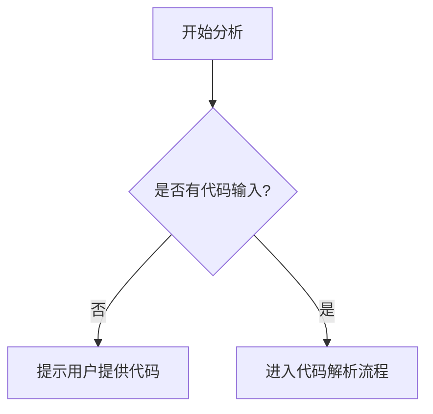

# `.\AutoGPT\classic\forge\forge\agent_protocol\__init__.py` 详细设计文档

未提供源代码进行分析，请提供需要分析的代码文件。

## 整体流程



## 类结构

```
无有效代码结构
```

## 全局变量及字段


    

## 全局函数及方法


## 关键组件


由于您提供的代码部分为空，我无法识别任何关键组件。请提供需要分析的源代码。


## 问题及建议


### 已知问题

-   未提供待分析的代码，无法进行具体的技术债务和优化空间分析

### 优化建议

-   请提供需要分析的源代码，以便进行详细的技术债务识别和优化建议


## 其它


### 核心功能概述

（待代码提供后填写：简要描述该代码的核心功能和业务目标）

### 整体运行流程

（待代码提供后填写：描述代码从入口到执行完毕的完整流程）

### 类结构详情

#### 类名：（待填写）

##### 类字段

| 字段名 | 类型 | 描述 |
|--------|------|------|
| （待填写） | （待填写） | （待填写） |

##### 类方法

| 方法名 | 参数 | 返回值类型 | 功能描述 |
|--------|------|------------|----------|
| （待填写） | （待填写） | （待填写） | （待填写） |

### 全局变量和全局函数

#### 全局变量

| 变量名 | 类型 | 描述 |
|--------|------|------|
| （待填写） | （待填写） | （待填写） |

#### 全局函数

| 函数名 | 参数 | 返回值类型 | 功能描述 |
|--------|------|------------|----------|
| （待填写） | （待填写） | （待填写） | （待填写） |

### 关键组件信息

| 组件名称 | 功能描述 |
|----------|----------|
| （待填写） | （待填写） |

### 技术债务与优化空间

（待代码提供后填写：分析代码中可能存在的技术债务和可优化的点）

### 设计目标与约束

（待代码提供后填写：说明设计目标、性能约束、兼容性要求等）

### 错误处理与异常设计

（待代码提供后填写：描述错误处理机制、异常类型定义、容错策略等）

### 数据流与状态机

（待代码提供后填写：描述数据流向、状态转换、状态机定义等）

### 外部依赖与接口契约

（待代码提供后填写：列出外部依赖库、API接口定义、接口调用约定等）

### 性能考虑

（待代码提供后填写：分析性能瓶颈、优化建议、资源使用情况等）

### 安全考虑

（待代码提供后填写：描述安全防护措施、权限控制、数据加密等）

### 测试考虑

（待代码提供后填写：说明单元测试策略、集成测试方案、测试覆盖目标等）


    