# `.\AutoGPT\classic\forge\forge\agent_protocol\agent.py` 详细设计文档

AutoGPT Forge的核心应用文件，定义了ProtocolAgent类来管理Agent任务、步骤和工件的完整生命周期，并提供FastAPI Web服务器以支持CORS、静态文件服务以及基于Agent Protocol的RESTful API端点。

## 整体流程

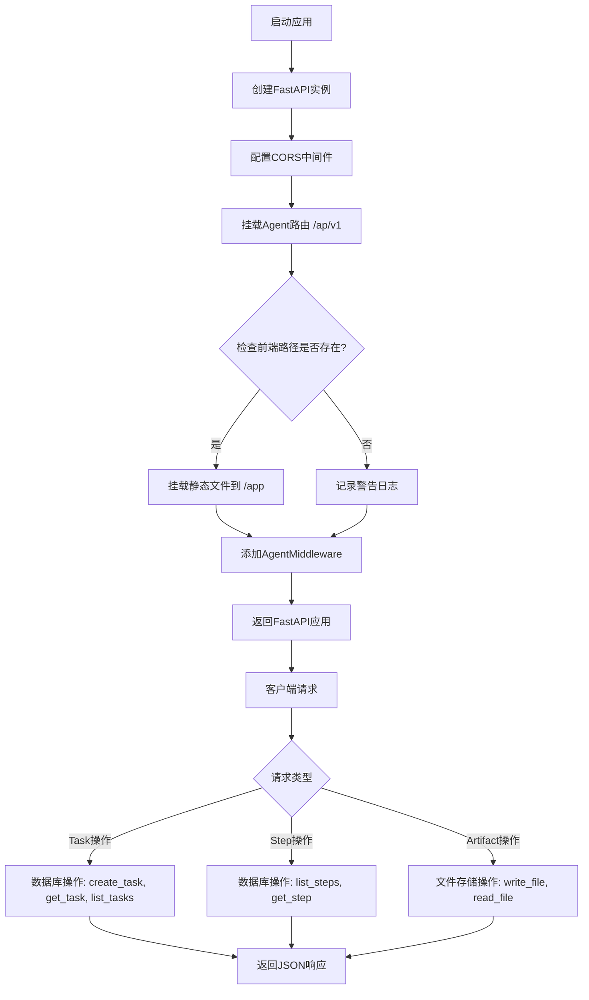

## 类结构

```
ProtocolAgent (主应用类)
├── __init__(database, workspace)
├── get_agent_app(router)
├── start(port)
├── create_task(task_request)
├── list_tasks(page, pageSize)
├── get_task(task_id)
├── list_steps(task_id, page, pageSize)
├── execute_step(task_id, step_request)
├── get_step(task_id, step_id)
├── list_artifacts(task_id, page, pageSize)
├── create_artifact(task_id, file, relative_path)
└── get_artifact(task_id, artifact_id)
```

## 全局变量及字段


### `logger`
    
日志记录器，用于记录应用运行状态和警告信息

类型：`logging.Logger`
    


### `ProtocolAgent.db`
    
数据库实例，用于任务、步骤和工件持久化

类型：`AgentDB`
    


### `ProtocolAgent.workspace`
    
文件存储实例，用于读写工件文件

类型：`FileStorage`
    
    

## 全局函数及方法


### `ProtocolAgent.create_artifact` 中的 `uuid4` 使用

在 `create_artifact` 方法中，`uuid4()` 用于在上传文件缺少文件名时生成唯一的文件标识符。

参数：
- 无参数（`uuid4()` 为无参数函数调用）

返回值：`str`，返回 32 位的十六进制字符串（UUID v4 格式），例如 `"a1b2c3d4-e5f6-4a5b-8c9d-0e1f2a3b4c5d"`

#### 流程图

```mermaid
flowchart TD
    A[开始] --> B{file.filename 存在?}
    B -->|是| C[使用原始文件名]
    B -->|否| D[调用 uuid4 生成唯一标识符]
    D --> E[str(uuid4()) 转换为字符串]
    C --> F[拼接相对路径]
    E --> F
    F --> G[写入文件到 workspace]
    G --> H[在数据库创建 artifact 记录]
    H --> I[返回 artifact 对象]
```

#### 带注释源码

```python
async def create_artifact(
    self, task_id: str, file: UploadFile, relative_path: str = ""
) -> Artifact:
    """
    Create an artifact for the task.
    """
    # 如果上传文件有文件名则使用，否则调用 uuid4() 生成唯一标识符
    # uuid4() 生成随机 UUID，确保文件名唯一性
    file_name = file.filename or str(uuid4())
    
    data = b""
    # 读取文件内容（每次读取 1MB）
    while contents := file.file.read(1024 * 1024):
        data += contents
    
    # 检查相对路径是否已包含文件名
    if relative_path.endswith(file_name):
        file_path = relative_path
    else:
        # 拼接相对路径和文件名
        file_path = os.path.join(relative_path, file_name)

    # 将文件写入工作区存储
    await self.workspace.write_file(file_path, data)

    # 在数据库中创建 artifact 记录
    artifact = await self.db.create_artifact(
        task_id=task_id,
        file_name=file_name,
        relative_path=relative_path,
        agent_created=False,
    )
    return artifact
```

---

### `uuid4` 函数详细信息

函数名称：`uuid4`（来自 Python 标准库 `uuid` 模块）

参数：
- 无参数

返回值：`UUID` 对象，通过 `str()` 转换为 32 位十六进制字符串

描述：
- `uuid4()` 生成随机 UUID（版本 4），基于随机数生成
- 在此代码中用于确保即使上传文件没有提供文件名，也能生成一个全局唯一的文件标识符
- UUID 格式：`xxxxxxxx-xxxx-4xxx-yxxx-xxxxxxxxxxxx`（其中 x 为任意十六进制位，y 为 8、9、A 或 B）


### `os.path.dirname`

获取给定路径的目录部分，即去除文件名后的父目录路径。

参数：

- `path`：`str`，需要获取目录的路径（在此代码中传入的是 `os.path.realpath(__file__)` 的结果）

返回值：`str`，返回路径的目录部分（即去掉文件名后的父目录路径）

#### 流程图

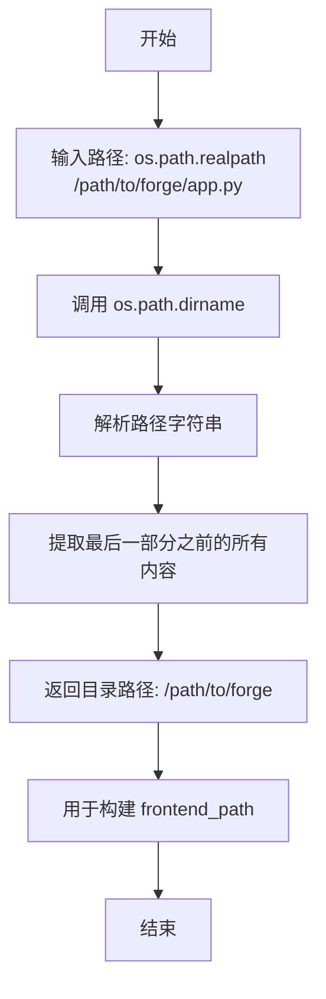

#### 带注释源码

```python
# 在 ProtocolAgent 类的 get_agent_app 方法中
# 获取当前脚本文件所在的目录路径
script_dir = os.path.dirname(os.path.realpath(__file__))
# os.path.realpath(__file__) 返回当前文件的绝对路径
# 例如: /path/to/project/forge/agent_protocol/api.py
# os.path.dirname() 提取目录部分
# 例如: /path/to/project/forge/agent_protocol

# 使用获取到的 script_dir 构建前端资源的完整路径
frontend_path = pathlib.Path(
    os.path.join(script_dir, "../../../classic/frontend/build/web")
).resolve()
# 通过相对路径 ../../../ 从 api.py 目录向上查找三层
# 最终指向项目根目录下的 classic/frontend/build/web
```

---

### `{函数名}` 输出格式示例（针对用户请求的函数）

根据代码中 `os.path.dirname` 的实际使用情况：

| 项目 | 内容 |
|------|------|
| **函数名** | `os.path.dirname` |
| **参数名称** | `path` |
| **参数类型** | `str` |
| **参数描述** | 需要获取目录的路径字符串（代码中传入 `os.path.realpath(__file__)` 的结果） |
| **返回值类型** | `str` |
| **返回值描述** | 返回输入路径的目录部分，即去掉文件名后的父目录路径 |
| **代码位置** | `ProtocolAgent.get_agent_app` 方法内，第 61 行 |
| **使用目的** | 获取当前 Python 脚本所在的目录，以便构建前端资源的相对路径 |


### `os.path.realpath`

获取脚本的绝对路径，解析并规范化文件路径，消除其中的符号链接。

参数：

- `path`：`str`，传入的是 `__file__`，表示当前模块的文件路径

返回值：`str`，返回文件的绝对路径（规范路径），消除了任何符号链接

#### 流程图

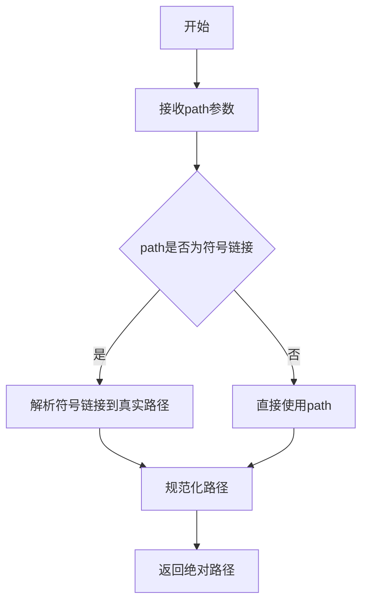

#### 带注释源码

```python
# 在代码中的实际使用：
script_dir = os.path.dirname(os.path.realpath(__file__))
# os.path.realpath(__file__) 返回当前脚本文件的绝对路径
# os.path.dirname() 提取该文件所在的目录路径
# 最终结果赋值给 script_dir 变量，用于构建前端静态文件的路径
```


# os.path.join 在代码中的使用分析

根据提供的代码，`os.path.join` 被用于两个主要方法中来实现路径拼接。下面详细分析这两个方法。

---

### ProtocolAgent.create_artifact

该方法用于为任务创建一个新的artifact（工件），包括处理文件上传并将文件写入工作区存储。

参数：
- `task_id`：`str`，任务ID，用于关联要创建artifact的任务
- `file`：`UploadFile`，从FastAPI上传的文件对象，包含文件内容
- `relative_path`：`str`，可选参数，文件相对路径，默认为空字符串

返回值：`Artifact`，创建成功的artifact对象，包含文件元数据

#### 流程图

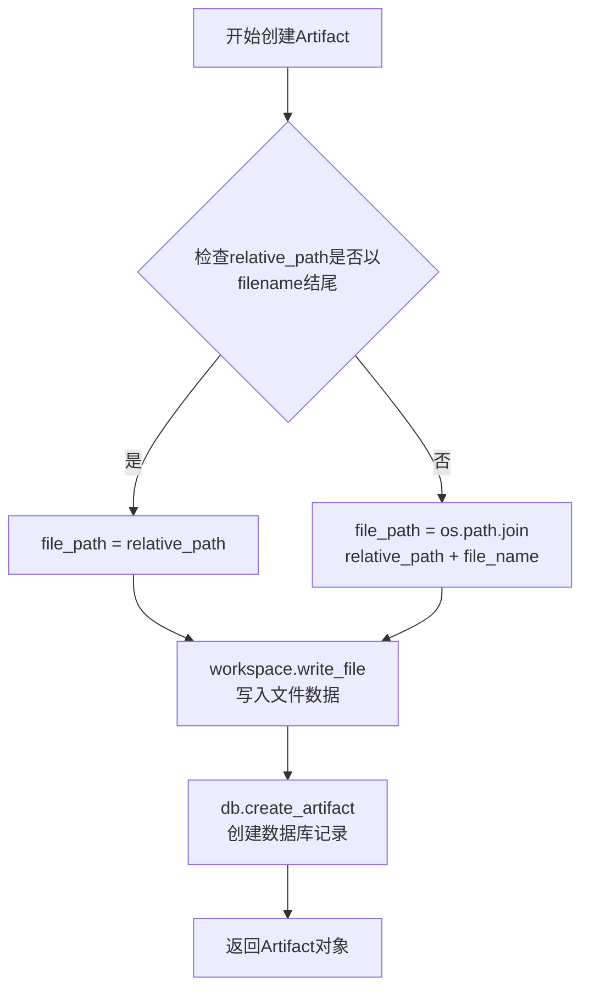

#### 带注释源码

```python
async def create_artifact(
    self, task_id: str, file: UploadFile, relative_path: str = ""
) -> Artifact:
    """
    Create an artifact for the task.
    """
    # 生成文件名，如果file.filename为None则使用UUID
    file_name = file.filename or str(uuid4())
    
    # 初始化空字节数组用于存储文件内容
    data = b""
    
    # 分块读取文件内容（每块1MB），避免内存溢出
    while contents := file.file.read(1024 * 1024):
        data += contents
    
    # 检查相对路径是否已包含文件名
    # 如果relative_path以文件名结尾，说明路径已完整
    if relative_path.endswith(file_name):
        file_path = relative_path  # 直接使用传入的路径
    else:
        # 使用os.path.join拼接路径：relative_path + file_name
        # os.path.join会自动处理不同操作系统的路径分隔符
        file_path = os.path.join(relative_path, file_name)

    # 将文件数据写入工作区存储
    await self.workspace.write_file(file_path, data)

    # 在数据库中创建artifact记录
    artifact = await self.db.create_artifact(
        task_id=task_id,
        file_name=file_name,
        relative_path=relative_path,
        agent_created=False,
    )
    return artifact
```

---

### ProtocolAgent.get_artifact

该方法用于根据artifact ID获取并下载对应的文件内容。

参数：
- `task_id`：`str`，任务ID，用于关联要获取的artifact所属任务
- `artifact_id`：`str`，artifact的唯一标识符

返回值：`StreamingResponse`，FastAPI流式响应，用于下载文件

#### 流程图

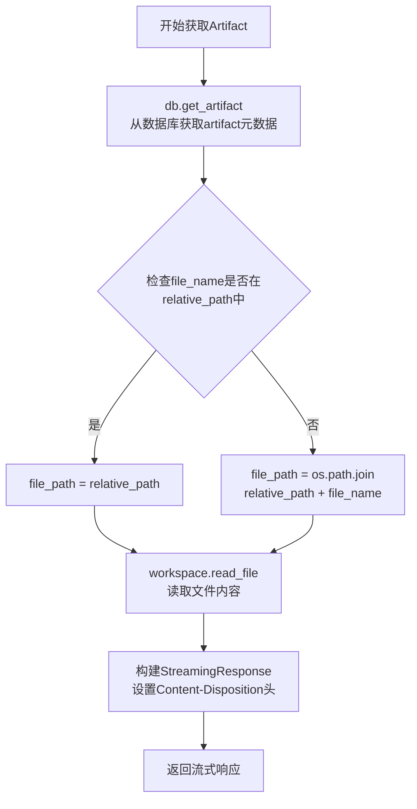

#### 带注释源码

```python
async def get_artifact(self, task_id: str, artifact_id: str) -> StreamingResponse:
    """
    Get an artifact by ID.
    """
    # 从数据库获取artifact的元数据信息
    artifact = await self.db.get_artifact(artifact_id)
    
    # 检查文件名是否已包含在相对路径中
    # 如果file_name不在relative_path中，需要拼接路径
    if artifact.file_name not in artifact.relative_path:
        # 使用os.path.join拼接：artifact.relative_path + artifact.file_name
        # 确保跨平台路径兼容性
        file_path = os.path.join(artifact.relative_path, artifact.file_name)
    else:
        file_path = artifact.relative_path
    
    # 从工作区存储读取文件内容（二进制模式）
    retrieved_artifact = self.workspace.read_file(file_path, binary=True)

    # 返回流式响应，设置媒体类型和下载文件名
    return StreamingResponse(
        BytesIO(retrieved_artifact),
        media_type="application/octet-stream",
        headers={
            "Content-Disposition": f"attachment; filename={artifact.file_name}"
        },
    )
```

---

## os.path.join 函数说明

### 基本信息

`os.path.join` 是Python标准库os模块中的函数，用于拼接路径组件。

参数：
- `path`：`str`，一个或多个路径组件

返回值：`str`，拼接后的完整路径

### os.path.join 的作用

```python
# 在不同操作系统上的行为：
# Windows: os.path.join("a", "b") -> "a\\b"
# Linux/Mac: os.path.join("a", "b") -> "a/b"

# 代码中的实际使用示例：
file_path = os.path.join(relative_path, file_name)
# 将 relative_path 和 file_name 安全地拼接成完整路径
```

### 设计优势

1. **跨平台兼容性**：自动处理Windows和Unix/Linux系统的路径分隔符差异
2. **智能拼接**：自动处理路径中的多余分隔符
3. **安全可靠**：避免手动字符串拼接导致的路径错误


### `os.path.exists`

检查指定的文件或目录路径是否存在，返回布尔值以表示路径的有效性。

参数：

- `path`：`str` 或 `path-like object`，要检查的文件或目录路径

返回值：`bool`，如果路径存在返回 `True`，否则返回 `False`

#### 流程图

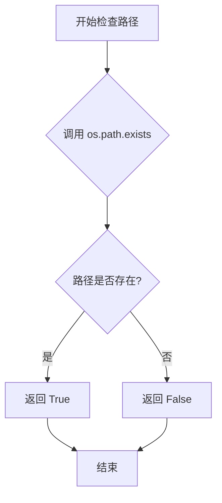

#### 带注释源码

```python
# 第61行：在 ProtocolAgent.get_agent_app 方法中使用
if os.path.exists(frontend_path):
    # 如果前端路径存在，则挂载静态文件服务
    app.mount("/app", StaticFiles(directory=frontend_path), name="app")

    @app.get("/", include_in_schema=False)
    async def root():
        return RedirectResponse(url="/app/index.html", status_code=307)

else:
    # 如果前端路径不存在，记录警告日志
    logger.warning(
        f"Frontend not found. {frontend_path} does not exist. "
        "The frontend will not be served."
    )
```

#### 附加说明

- **函数来源**：`os.path.exists` 是 Python 标准库函数，不是本项目定义的函数
- **使用场景**：用于判断前端构建目录是否存在，以决定是否启动静态文件服务器
- **路径解析**：该调用前已对 `frontend_path` 进行了 `pathlib.Path.resolve()` 处理，确保获得绝对路径
- **错误处理**：如果路径不存在，代码通过 `logger.warning` 记录警告，但不会中断应用启动，属于**优雅降级**设计


### `ProtocolAgent.get_agent_app` 中的 `pathlib.Path` 路径对象处理

在 `ProtocolAgent` 类的 `get_agent_app` 方法中，使用 `pathlib.Path` 来解析和规范化前端静态文件的路径。

参数：
- 此用法为方法内部实现，无直接外部参数传递

返回值：`pathlib.Path`，返回解析后的绝对路径对象

#### 流程图

```mermaid
flowchart TD
    A[开始路径处理] --> B[获取当前脚本目录<br/>script_dir = os.path.dirname<br/>(os.path.realpath(__file__))]
    B --> C[构建相对路径<br/>'../../../classic/frontend/build/web']
    C --> D[使用pathlib.Path<br/>封装路径字符串]
    D --> E[调用.resolve()<br/>解析为绝对路径]
    E --> F{检查路径是否存在?}
    F -->|是| G[挂载静态文件目录<br/>app.mount]
    F -->|否| H[记录警告日志<br/>Frontend not found]
    G --> I[返回FastAPI app对象]
    H --> I
```

#### 带注释源码

```python
# 获取当前脚本文件的目录路径
# __file__ 表示当前Python文件 (forge/app.py)
# os.path.realpath(__file__) 获取文件的绝对路径
# os.path.dirname() 获取文件所在目录
script_dir = os.path.dirname(os.path.realpath(__file__))

# 使用 os.path.join 拼接路径组件
# ../../.. 表示从当前目录向上三级
# 指向项目根目录下的 classic/frontend/build/web 目录
frontend_path = pathlib.Path(
    os.path.join(script_dir, "../../../classic/frontend/build/web")
).resolve()

# .resolve() 方法的作用：
# 1. 将相对路径转换为绝对路径
# 2. 解析所有符号链接
# 3. 规范化路径（移除多余的 . 和 ..）
# 返回一个 pathlib.Path 对象
```

#### 详细说明

| 项目 | 说明 |
|------|------|
| **路径构建目标** | 定位前端构建产物目录 |
| **路径类型** | 相对路径 → 绝对路径的转换 |
| **依赖模块** | `pathlib.Path` (Python 3.4+标准库) |
| **关键方法** | `.resolve()` - 返回规范化的绝对路径 |

#### 技术要点

1. **为什么使用 `pathlib.Path`**：
   - 提供面向对象的路径操作API
   - 跨平台路径处理（Windows/Linux/Mac）
   - `.resolve()` 确保获得绝对路径，避免相对路径歧义

2. **路径层级说明**：
   - 从 `forge/app.py` 位置向上三级到达项目根目录
   - 然后进入 `classic/frontend/build/web` 找到前端构建产物

3. **潜在优化点**：
   - 路径硬编码在代码中，可考虑配置化
   - 未处理路径不存在时的更多错误场景


### `ProtocolAgent.__init__`

初始化 ProtocolAgent 实例，接受数据库和文件存储实例，并将其存储为实例属性。

参数：

- `self`：隐式参数，类的实例本身
- `database`：`AgentDB`，用于存储任务、步骤和工件的数据库实例
- `workspace`：`FileStorage`，用于管理工作区文件的文件存储实例

返回值：`None`，构造函数，不返回任何值

#### 流程图

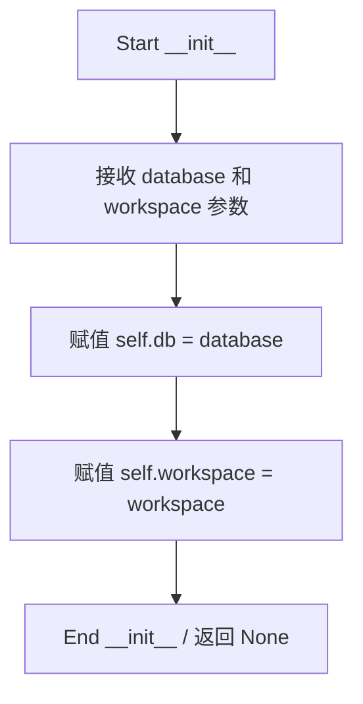

#### 带注释源码

```python
def __init__(self, database: AgentDB, workspace: FileStorage):
    """
    初始化 ProtocolAgent。
    
    参数:
        database: 用于存储任务、步骤和工件的数据库实例。
        workspace: 用于管理工作区文件的文件存储实例。
    """
    # 将数据库实例赋值给实例属性 self.db
    self.db = database
    # 将文件存储实例赋值给实例属性 self.workspace
    self.workspace = workspace
```


### `ProtocolAgent.get_agent_app`

该方法用于初始化并返回一个配置完整的 FastAPI 应用实例，包含 CORS 中间件、API 路由挂载、前端静态文件服务挂载以及自定义的 Agent 中间件。

参数：

- `router`：`APIRouter`，可选，默认值为 `base_router`，用于挂载 API 路由，默认为 `forge.agent_protocol.api_router` 中的基础路由

返回值：`FastAPI`，返回配置完成的 FastAPI 应用实例

#### 流程图

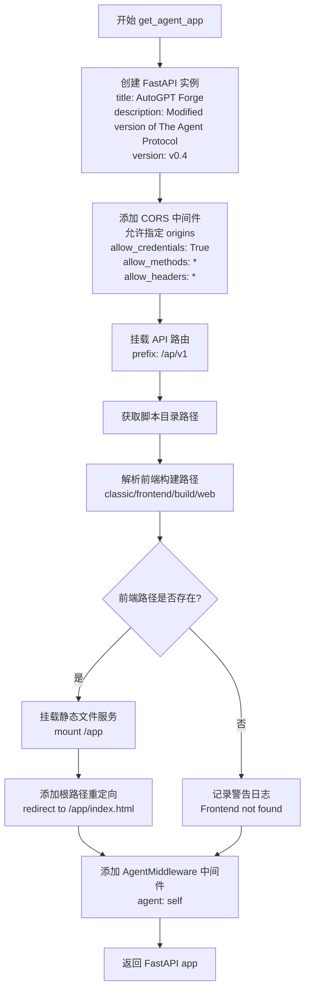

#### 带注释源码

```python
def get_agent_app(self, router: APIRouter = base_router):
    """
    Start the agent server.
    """

    # 创建 FastAPI 应用实例，配置标题、描述和版本
    app = FastAPI(
        title="AutoGPT Forge",
        description="Modified version of The Agent Protocol.",
        version="v0.4",
    )

    # 定义允许跨域访问的源列表
    origins = [
        "http://localhost:5000",
        "http://127.0.0.1:5000",
        "http://localhost:8000",
        "http://127.0.0.1:8000",
        "http://localhost:8080",
        "http://127.0.0.1:8080",
        # Add any other origins you want to whitelist
    ]

    # 添加 CORS 中间件，允许跨域请求
    app.add_middleware(
        CORSMiddleware,
        allow_origins=origins,
        allow_credentials=True,
        allow_methods=["*"],
        allow_headers=["*"],
    )

    # 将传入的路由器包含到应用中，添加 /ap/v1 前缀
    app.include_router(router, prefix="/ap/v1")
    
    # 获取当前脚本所在目录路径
    script_dir = os.path.dirname(os.path.realpath(__file__))
    # 解析前端构建文件的绝对路径（相对于脚本目录向上查找 classic/frontend/build/web）
    frontend_path = pathlib.Path(
        os.path.join(script_dir, "../../../classic/frontend/build/web")
    ).resolve()

    # 检查前端构建目录是否存在
    if os.path.exists(frontend_path):
        # 挂载静态文件服务到 /app 路径
        app.mount("/app", StaticFiles(directory=frontend_path), name="app")

        # 定义根路径处理函数，重定向到前端 index.html
        @app.get("/", include_in_schema=False)
        async def root():
            return RedirectResponse(url="/app/index.html", status_code=307)

    else:
        # 前端不存在时记录警告日志
        logger.warning(
            f"Frontend not found. {frontend_path} does not exist. "
            "The frontend will not be served."
        )
    
    # 添加 Agent 中间件，注入 agent 实例用于请求处理
    app.add_middleware(AgentMiddleware, agent=self)

    # 返回配置完成的 FastAPI 应用实例
    return app
```


### `ProtocolAgent.start`

该方法用于启动 uvicorn 服务器，将 ProtocolAgent 自身作为一个 FastAPI 应用运行在指定端口上，提供 Agent 协议的 HTTP 服务接口。

参数：

- `port`：`int`，指定服务器监听的网络端口号

返回值：`None`，该方法直接运行服务器阻塞当前线程，无返回值

#### 流程图

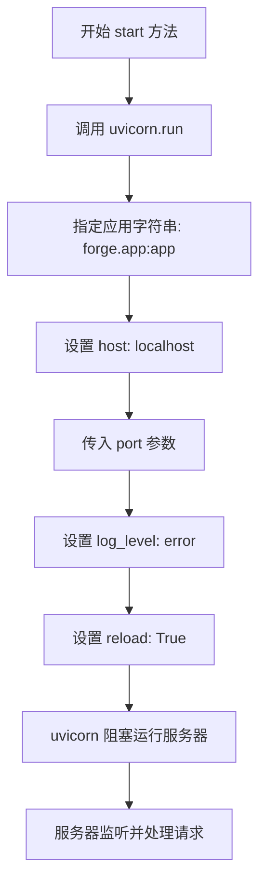

#### 带注释源码

```python
def start(self, port):
    """
    启动 Agent 服务器。
    
    该方法使用 uvicorn 启动 FastAPI 应用服务器，使 Agent 能够
    通过 HTTP 接口处理 Agent Protocol 规范的请求。
    
    注意：这是一个同步阻塞方法，会一直运行直到服务器关闭。
    """
    # 使用 uvicorn 运行应用，"forge.app:app" 指向上层配置的 FastAPI 应用实例
    # host 固定为 localhost，仅接受本机连接
    # port 接收外部传入的端口参数
    # log_level="error" 仅记录错误级别日志，减少输出噪音
    # reload=True 启用热重载，开发环境下代码变更会自动重启服务器
    uvicorn.run(
        "forge.app:app", 
        host="localhost", 
        port=port, 
        log_level="error", 
        reload=True
    )
```

---

### 补充说明

#### 技术债务与优化空间

1. **硬编码的应用路径**：使用字符串 `"forge.app:app"` 作为应用引用，如果项目结构变更可能导致运行失败
2. **固定的主机地址**：host 硬编码为 `"localhost"`，不支持配置外部访问地址
3. **同步阻塞调用**：`uvicorn.run()` 是同步阻塞操作，建议使用 `uvicorn.Server` 配合 `asyncio` 实现更优雅的启动/关闭控制
4. **热重载生产环境风险**：`reload=True` 不适合生产环境，应根据运行环境动态配置

#### 其它项目

- **设计目标**：提供符合 Agent Protocol 规范的 HTTP 服务入口
- **错误处理**：当前方法未捕获 `uvicorn.run()` 可能抛出的异常（如端口被占用）
- **外部依赖**：依赖 `uvicorn` 和 `forge.app` 模块中定义的 FastAPI 应用实例


### `ProtocolAgent.create_task`

该方法接收一个任务请求对象，调用数据库层创建新任务，并返回创建后的任务实体。

参数：

- `task_request`：`TaskRequestBody`，包含任务输入数据和额外输入配置的对象

返回值：`Task`，创建成功后的任务实体，包含任务ID、状态、输入等相关信息

#### 流程图

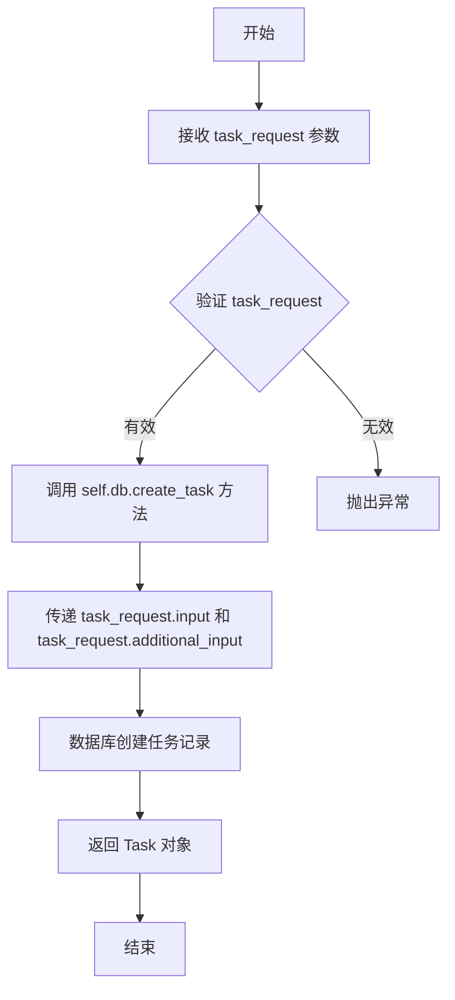

#### 带注释源码

```python
async def create_task(self, task_request: TaskRequestBody) -> Task:
    """
    Create a task for the agent.
    
    该方法负责创建一个新的任务实体。它接收一个包含任务输入数据的请求对象，
    将输入数据传递给数据库层进行持久化，并返回创建完成的任务对象。
    
    参数:
        task_request: TaskRequestBody 类型，包含任务的输入数据(input)和额外输入(additional_input)
    
    返回:
        Task: 创建成功后的任务对象，包含任务ID、创建时间、状态等信息
    
    异常:
        可能抛出数据库相关的异常，如连接失败、数据验证错误等
    """
    # 调用数据库层的create_task方法，传入任务请求的输入和额外输入参数
    task = await self.db.create_task(
        input=task_request.input,
        additional_input=task_request.additional_input,
    )
    # 返回创建完成的任务对象
    return task
```


### `ProtocolAgent.list_tasks`

列出代理已创建的所有任务，支持分页查询。

参数：

- `page`：`int`，页码，默认为1，用于指定返回结果的页数
- `pageSize`：`int`，每页大小，默认为10，用于指定每页返回的任务数量

返回值：`TaskListResponse`，包含任务列表和分页信息的响应对象

#### 流程图

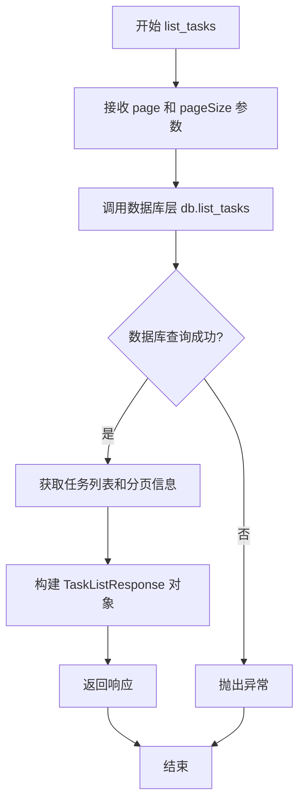

#### 带注释源码

```python
async def list_tasks(self, page: int = 1, pageSize: int = 10) -> TaskListResponse:
    """
    List all tasks that the agent has created.
    """
    # 调用数据库层的 list_tasks 方法，传入页码和每页大小
    tasks, pagination = await self.db.list_tasks(page, pageSize)
    
    # 构建响应对象，包含任务列表和分页信息
    response = TaskListResponse(tasks=tasks, pagination=pagination)
    
    # 返回响应对象
    return response
```


### `ProtocolAgent.get_task`

该方法是一个异步方法，用于根据指定的任务ID从数据库中检索并返回对应的任务对象。它是ProtocolAgent类提供的核心查询功能之一，允许客户端通过任务ID获取单个任务的详细信息。

参数：

- `task_id`：`str`，任务唯一标识符，用于指定要获取的任务

返回值：`Task`，返回从数据库中检索到的任务对象，包含任务的完整信息

#### 流程图

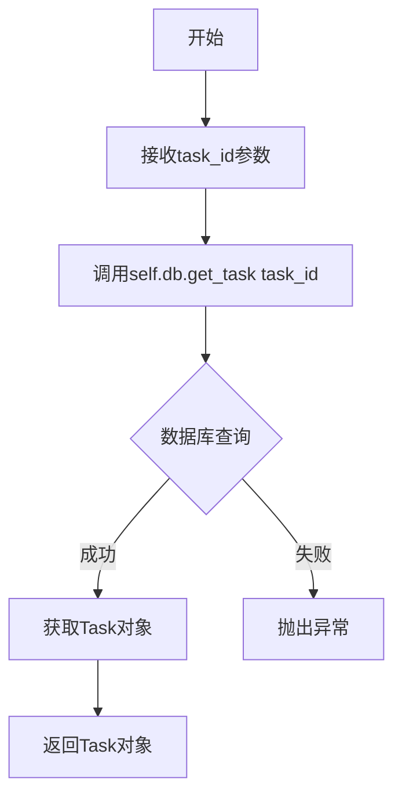

#### 带注释源码

```python
async def get_task(self, task_id: str) -> Task:
    """
    Get a task by ID.
    
    从数据库中根据task_id获取对应的任务对象。
    
    参数:
        task_id (str): 任务的唯一标识符
        
    返回:
        Task: 包含任务完整信息的Task对象
    """
    # 调用数据库层的get_task方法，传入task_id进行查询
    task = await self.db.get_task(task_id)
    # 返回查询到的任务对象
    return task
```


### `ProtocolAgent.list_steps`

该方法用于列出指定任务的所有步骤，支持分页查询，返回任务步骤列表响应对象。

参数：

- `self`：ProtocolAgent，类的实例本身
- `task_id`：`str`，任务ID，用于指定要查询步骤的任务
- `page`：`int`，页码，默认为1，用于分页查询
- `pageSize`：`int`，每页大小，默认为10，控制每页返回的步骤数量

返回值：`TaskStepsListResponse`，包含步骤列表和分页信息的响应对象

#### 流程图

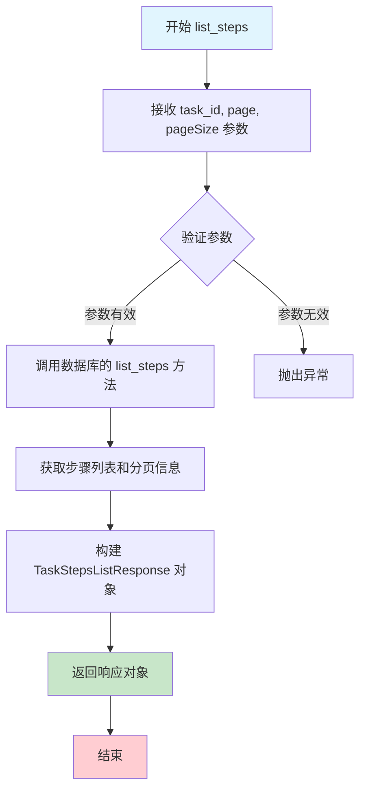

#### 带注释源码

```python
async def list_steps(
    self, task_id: str, page: int = 1, pageSize: int = 10
) -> TaskStepsListResponse:
    """
    List the IDs of all steps that the task has created.
    """
    # 调用数据库层的list_steps方法，获取指定任务的步骤列表和分页信息
    steps, pagination = await self.db.list_steps(task_id, page, pageSize)
    
    # 构造TaskStepsListResponse响应对象，包含步骤列表和分页信息
    response = TaskStepsListResponse(steps=steps, pagination=pagination)
    
    # 返回响应对象
    return response
```


### `ProtocolAgent.execute_step`

该方法用于在指定任务中创建一个新的执行步骤，是 Agent Protocol 中执行任务步骤的核心接口，目前作为抽象方法抛出未实现异常，等待子类具体实现。

参数：

- `task_id`：`str`，任务唯一标识符，用于指定步骤所属的任务
- `step_request`：`StepRequestBody`，步骤请求体，包含步骤的输入参数和配置信息

返回值：`Step`，返回创建完成的步骤对象，包含步骤ID、状态、输入输出等详细信息

#### 流程图

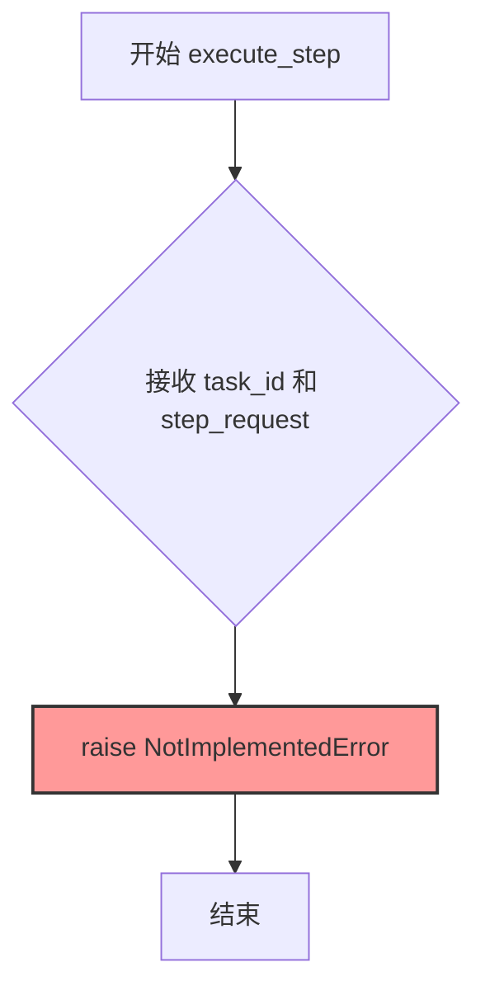

#### 带注释源码

```python
async def execute_step(self, task_id: str, step_request: StepRequestBody) -> Step:
    """
    Create a step for the task.
    
    该方法用于在指定的任务中创建一个新的执行步骤。
    子类需要重写此方法以实现具体的步骤执行逻辑。
    
    参数:
        task_id: 任务的唯一标识符
        step_request: 步骤请求体，包含步骤的输入数据
    
    返回:
        Step: 创建的步骤对象
    
    异常:
        NotImplementedError: 当方法未被重写时抛出
    """
    # 目前该方法为抽象方法，仅抛出未实现异常
    # 子类需要实现具体的步骤执行逻辑
    raise NotImplementedError
```

#### 技术债务与优化空间

1. **未实现功能**：该方法是核心业务逻辑的占位符，需要根据实际业务需求实现具体的步骤执行逻辑
2. **缺乏错误处理**：作为抽象方法，应考虑添加基础的错误处理和参数验证
3. **返回值类型**：应明确返回的 Step 对象包含哪些字段，如步骤状态、输出结果等


### `ProtocolAgent.get_step`

获取指定任务下的指定步骤对象。

参数：

- `task_id`：`str`，任务ID，用于定位步骤所属的任务
- `step_id`：`str`，步骤ID，用于定位具体的步骤

返回值：`Step`，返回找到的步骤对象

#### 流程图

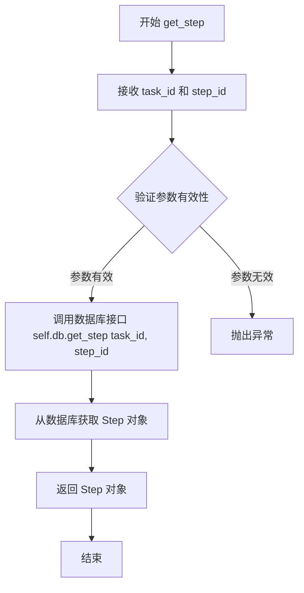

#### 带注释源码

```python
async def get_step(self, task_id: str, step_id: str) -> Step:
    """
    Get a step by ID.
    """
    # 调用数据库层的 get_step 方法，传入任务ID和步骤ID
    # 数据库层负责从持久化存储中检索对应的 Step 记录
    step = await self.db.get_step(task_id, step_id)
    # 将检索到的 Step 对象返回给调用者
    return step
```


### `ProtocolAgent.list_artifacts`

该方法用于列出与特定任务关联的所有产物（artifacts），支持分页查询。它通过调用数据库层的 `list_artifacts` 方法获取产物列表和分页信息，并返回一个包含产物列表和分页元数据的响应对象。

参数：

- `task_id`：`str`，任务的唯一标识符，用于指定要查询的任务
- `page`：`int`，分页的页码，默认为 1，表示查询第一页数据
- `pageSize`：`int`，每页返回的记录数，默认为 10

返回值：`TaskArtifactsListResponse`，包含查询到的产物列表以及分页信息（如总页数、当前页码等）的响应对象

#### 流程图

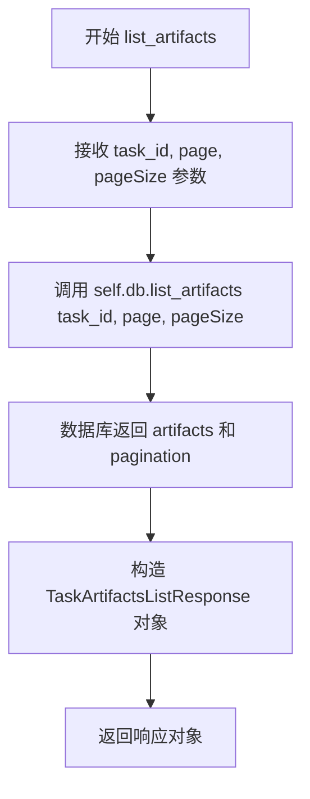

#### 带注释源码

```python
async def list_artifacts(
    self, task_id: str, page: int = 1, pageSize: int = 10
) -> TaskArtifactsListResponse:
    """
    List the artifacts that the task has created.
    
    Args:
        task_id: 任务的唯一标识符
        page: 分页的页码，默认为1
        pageSize: 每页的记录数，默认为10
        
    Returns:
        TaskArtifactsListResponse: 包含产物列表和分页信息的响应对象
    """
    # 调用数据库层的list_artifacts方法，传入任务ID和分页参数
    # 返回产物列表和分页信息
    artifacts, pagination = await self.db.list_artifacts(task_id, page, pageSize)
    
    # 使用返回的产物列表和分页信息构造响应对象并返回
    return TaskArtifactsListResponse(artifacts=artifacts, pagination=pagination)
```


### `ProtocolAgent.create_artifact`

该方法用于为指定任务创建一个新的产物（artifact），它接收任务ID、上传的文件和相对路径，将文件内容写入工作区存储，并在数据库中创建相应的产物记录。

参数：

- `task_id`：`str`，任务ID，指定要关联产物的任务
- `file`：`UploadFile`，上传的文件，FastAPI 的文件上传对象
- `relative_path`：`str`，相对路径（默认为空字符串），文件在工作区中的存储路径

返回值：`Artifact`，创建的产物对象，包含产物 ID、文件名、路径等信息

#### 流程图

```mermaid
flowchart TD
    A[开始 create_artifact] --> B[获取文件名<br/>file.filename 或 UUID]
    B --> C[初始化空字节数据 data]
    C --> D[循环读取文件内容<br/>每次读取 1MB]
    D --> E{文件内容读取完成?}
    E -->|否| D
    E -->|是| F{relative_path<br/>以 file_name 结尾?}
    F -->|是| G[file_path = relative_path]
    F -->|否| H[file_path = os.path.join<br/>(relative_path, file_name)]
    G --> I[写入文件到工作区<br/>workspace.write_file]
    H --> I
    I --> J[创建数据库产物记录<br/>db.create_artifact]
    J --> K[返回 Artifact 对象]
```

#### 带注释源码

```python
async def create_artifact(
    self, task_id: str, file: UploadFile, relative_path: str = ""
) -> Artifact:
    """
    Create an artifact for the task.
    """
    # 获取文件名，如果上传文件没有名称则生成 UUID 作为文件名
    file_name = file.filename or str(uuid4())
    
    # 初始化空字节数据用于存储文件内容
    data = b""
    # 循环读取上传文件内容，每次读取 1MB，避免内存溢出
    while contents := file.file.read(1024 * 1024):
        data += contents
    
    # 检查相对路径是否已经包含文件名
    # 如果 relative_path 已经以 file_name 结尾，则直接使用它作为文件路径
    # 否则，将 relative_path 和 file_name 进行拼接
    if relative_path.endswith(file_name):
        file_path = relative_path
    else:
        file_path = os.path.join(relative_path, file_name)

    # 将文件内容写入工作区存储
    await self.workspace.write_file(file_path, data)

    # 在数据库中创建产物记录
    # agent_created=False 表示该产物由用户上传而非 Agent 自动创建
    artifact = await self.db.create_artifact(
        task_id=task_id,
        file_name=file_name,
        relative_path=relative_path,
        agent_created=False,
    )
    
    # 返回创建的产物对象
    return artifact
```


### `ProtocolAgent.get_artifact`

该方法用于根据任务ID和制品ID从工作区检索并返回指定的制品文件，通过数据库查询制品元数据后，从文件存储中读取对应的二进制文件内容，并以流式响应的形式返回给客户端，支持文件下载功能。

参数：

- `task_id`：`str`，任务ID，用于标识所属任务
- `artifact_id`：`str`，制品ID，用于唯一标识要检索的制品

返回值：`StreamingResponse`，FastAPI流式响应对象，包含二进制文件内容以及`Content-Disposition`头，用于触发浏览器下载行为

#### 流程图

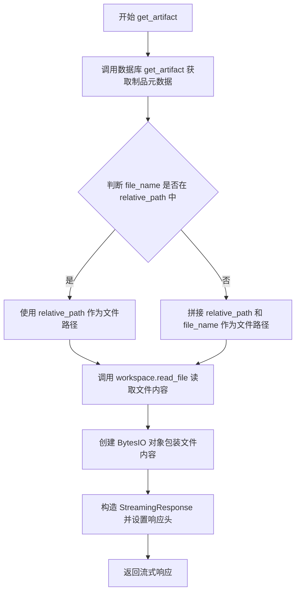

#### 带注释源码

```python
async def get_artifact(self, task_id: str, artifact_id: str) -> StreamingResponse:
    """
    Get an artifact by ID.
    """
    # 根据artifact_id从数据库获取制品的元数据信息（包含file_name、relative_path等）
    artifact = await self.db.get_artifact(artifact_id)
    
    # 检查file_name是否已包含在relative_path中
    # 如果relative_path已经包含完整的文件路径，则直接使用；否则需要拼接
    if artifact.file_name not in artifact.relative_path:
        # 拼接相对路径和文件名形成完整文件路径
        file_path = os.path.join(artifact.relative_path, artifact.file_name)
    else:
        # relative_path已包含完整路径，直接使用
        file_path = artifact.relative_path
    
    # 从工作区文件存储中读取文件内容，binary=True表示以二进制模式读取
    retrieved_artifact = self.workspace.read_file(file_path, binary=True)

    # 返回流式响应，包含文件内容和下载相关的HTTP头
    return StreamingResponse(
        BytesIO(retrieved_artifact),  # 将字节数据包装为BytesIO对象用于流式传输
        media_type="application/octet-stream",  # 设置媒体类型为八进制流（通用二进制类型）
        headers={
            # 设置Content-Disposition头，指示浏览器以下载方式处理响应内容
            "Content-Disposition": f"attachment; filename={artifact.file_name}"
        },
    )
```

## 关键组件


### ProtocolAgent 类

ProtocolAgent类是整个应用的核心类，负责管理Agent的生命周期、任务处理、步骤执行和产物管理。它集成了FastAPI服务器、数据库操作和文件存储功能，提供完整的Agent Protocol实现。

### FastAPI 应用配置

通过`get_agent_app`方法构建FastAPI应用，配置了CORS中间件允许跨域请求，挂载了前端静态文件，并集成了API路由。应用标题为"AutoGPT Forge"，版本为v0.4。

### 任务管理组件

负责创建、列出和获取任务。`create_task`方法接收任务请求体创建新任务；`list_tasks`方法支持分页列出所有任务；`get_task`方法根据任务ID获取任务详情。任务数据通过AgentDB数据库层进行持久化。

### 步骤管理组件

管理任务的执行步骤。`list_steps`方法列出指定任务的所有步骤；`get_step`方法获取特定步骤详情；`execute_step`方法目前抛出NotImplementedError，表示步骤执行逻辑需要由子类实现。

### 产物管理组件

处理任务产物的创建和检索。`create_artifact`方法接收上传文件并保存到工作区，同时在数据库中创建产物记录；`list_artifacts`方法分页列出任务的产物；`get_artifact`方法从文件存储中读取产物并通过StreamingResponse返回。

### 数据库交互层 (AgentDB)

通过`self.db`属性访问数据库抽象层，负责任务的CRUD操作、步骤管理、产物存储以及分页查询。数据库交互采用异步模式。

### 文件存储层 (FileStorage)

通过`self.workspace`属性访问文件系统抽象，提供`write_file`和`read_file`方法用于二进制文件的读写操作。产物文件存储在相对路径指定的位置。

### 中间件组件

配置了CORS中间件允许指定源（localhost:5000/8000/8080和127.0.0.1对应端口）的跨域请求；同时集成了AgentMiddleware用于处理Agent相关的请求拦截和响应处理。

### 前端静态文件服务

当前端构建目录存在时，将classic/frontend/build/web目录挂载到"/app"路径，并配置根路径"/"重定向到"/app/index.html"，实现前后端一体化服务。

### Uvicorn 服务器启动

`start`方法使用uvicorn启动ASGI服务器，监听指定端口，默认配置为localhost、error日志级别和热重载模式。


## 问题及建议


### 已知问题

-   **硬编码的CORS来源**：CORS中间件的origins列表硬编码在代码中，缺乏灵活性，应改为从配置文件或环境变量读取
-   **端口参数未使用**：`start`方法接收`port`参数但未实际使用，服务器始终运行在固定端口
-   **未实现的方法**：`execute_step`方法直接抛出`NotImplementedError`，导致功能不完整
-   **同步文件操作在异步上下文中**：`create_artifact`和`get_artifact`方法中使用同步方式读写文件，可能阻塞事件循环，应使用异步文件操作
-   **内存占用问题**：`create_artifact`方法将整个文件内容一次性加载到内存（`data += contents`），大文件可能导致内存溢出
-   **缺少错误处理**：数据库操作和文件存储操作缺乏try-except异常捕获，可能导致未处理的异常传播
-   **日志级别硬编码**：日志级别硬编码为"error"，无法动态调整
-   **生产环境配置不当**：使用`reload=True`在生产环境中运行可能导致性能问题和不稳定
-   **文件大小和类型无验证**：文件上传接口未对文件大小和类型进行验证，存在安全风险
-   **导入路径耦合**：`uvicorn.run`中使用硬编码字符串`"forge.app:app"`，假设了特定的模块结构，降低了代码的可移植性
-   **路径处理混用**：同时使用`os.path`和`pathlib`两种路径处理方式，应统一使用`pathlib`
-   **响应参数命名不一致**：数据库查询使用`pageSize`而FastAPI标准惯例应为`page_size`

### 优化建议

-   将CORS来源、端口号、日志级别等配置抽取到配置文件或环境变量中
-   实现`execute_step`方法或将其定义为抽象方法，由子类实现
-   使用`aiofiles`等异步文件库重写文件读写操作
-   对大文件上传采用流式处理或分块写入，避免一次性加载到内存
-   为所有数据库和文件操作添加完善的异常处理和错误恢复机制
-   在生产环境中移除`reload=True`，或提供开发/生产环境的配置切换
-   对上传文件添加大小限制和类型白名单验证
-   统一使用`pathlib.Path`进行路径操作，提高代码可读性和跨平台兼容性
-   使用`pydantic`模型验证请求参数，确保参数命名符合API规范（如`page_size`）

## 其它


### 设计目标与约束

本项目旨在实现一个基于 Agent Protocol 的自动化任务处理框架，核心目标是提供一个可扩展的任务管理和执行平台。设计约束包括：必须遵循 Agent Protocol v0.4 规范；支持 RESTful API 接口；支持 CORS 跨域请求；支持文件上传和下载；支持任务、步骤和制品的 CRUD 操作；前端静态文件可选择性地挂载。技术栈限制为 Python 3.8+，依赖 FastAPI、uvicorn、SQLAlchemy 等。

### 错误处理与异常设计

错误处理采用分层设计：数据库层通过 AgentDB 捕获并抛出数据库相关异常；业务层通过 NotImplementedError 标识未实现的方法（如 execute_step）；API 层通过 FastAPI 的异常处理器统一返回标准错误响应。关键异常包括：TaskNotFoundError、StepNotFoundError、ArtifactNotFoundError 等，均返回 404 状态码；文件不存在时返回 404；数据库连接失败时返回 500 状态码并记录日志。未实现的 execute_step 方法抛出 NotImplementedError，提醒子类必须实现该方法。

### 数据流与状态机

数据流遵循以下路径：客户端请求 → FastAPI 路由 → AgentMiddleware 中间件 → 业务方法 → AgentDB 数据库 → FileStorage 文件存储。任务状态机包含：created（创建）、in_progress（进行中）、completed（完成）、failed（失败）四种状态。步骤状态机包含：created、completed、failed 三种状态。制品（Artifact）状态为只读，创建后不可修改。数据流转时，数据库事务确保原子性，文件上传先写入 FileStorage，再创建制品记录。

### 外部依赖与接口契约

核心依赖包括：FastAPI（Web 框架）、uvicorn（ASGI 服务器）、SQLAlchemy（数据库 ORM）、pydantic（数据验证）、python-multipart（文件上传）。内部依赖包括：forge.agent_protocol.api_router（API 路由）、forge.agent_protocol.database.db.AgentDB（数据库抽象层）、forge.agent_protocol.middlewares.AgentMiddleware（中间件）、forge.file_storage.base.FileStorage（文件存储抽象）。外部服务接口契约：AgentDB 必须实现 create_task、list_tasks、get_task、create_step、list_steps、get_step、create_artifact、list_artifacts、get_artifact 等方法；FileStorage 必须实现 write_file、read_file 方法。

### 安全性考虑

安全措施包括：CORS 中间件配置白名单 origins，仅允许指定的 localhost 和 127.0.0.1 地址；allow_credentials 设为 True 但配合严格的 origins 限制；allow_methods 和 allow_headers 设为 "*" 但仅用于开发环境；文件上传通过 UploadFile 类型限制，避免路径遍历攻击（relative_path 应进行安全校验）；数据库操作使用参数化查询防止 SQL 注入。生产环境建议：限制 CORS origins、添加身份认证、限制文件上传大小、添加请求速率限制。

### 性能考虑

性能优化点包括：文件上传采用分块读取（1024 * 1024 字节），避免一次性加载大文件导致内存溢出；数据库查询支持分页（page、pageSize 参数），避免全量加载；静态文件使用 StaticFiles 挂载，支持浏览器缓存；使用 async/await 异步处理数据库和文件 I/O。潜在瓶颈：execute_step 方法未实现，无法评估实际执行性能；文件存储的 read_file 可能产生阻塞 I/O；数据库连接池配置需根据实际负载调整。

### 部署和配置

部署方式：使用 uvicorn.run 启动应用，支持 reload 模式用于开发；生产环境应禁用 reload，使用 gunicorn 或 uvicorn 的 worker 模式。配置项包括：port（服务器端口，默认需外部指定）、frontend_path（前端静态文件路径）、CORS origins（跨域白名单）。部署目录结构建议：经典架构将前端 build/web 放在项目根目录的 classic/frontend/build/web；应用入口为 forge.app:app。环境变量：可添加 LOG_LEVEL、DB_URL、STORAGE_PATH 等配置。

### 测试策略

测试层次包括：单元测试（测试 ProtocolAgent 类的各个方法）、集成测试（测试 API 端点与数据库的交互）、端到端测试（模拟完整的工作流）。测试重点：任务创建和查询、步骤列表和详情、制品上传和下载、文件路径处理（relative_path 与 file_name 的拼接逻辑）。Mock 对象：使用 unittest.mock 模拟 AgentDB 和 FileStorage。覆盖率目标：核心业务逻辑应达到 80% 以上覆盖率。

### 监控和日志

日志配置：使用 Python 标准库 logging，logger 名称为 __name__；日志级别可通过 uvicorn 的 log_level 参数配置；关键操作（如文件上传、任务创建）应记录 info 级别日志；异常和错误记录 warning 或 error 级别日志。监控指标建议：请求响应时间、任务创建频率、文件上传大小分布、错误率。可集成 Prometheus 或 OpenTelemetry 进行指标收集。

### 扩展性考虑

扩展点包括：execute_step 方法为抽象方法，子类可实现自定义的任务执行逻辑；AgentMiddleware 允许添加自定义中间件处理请求/响应；FileStorage 接口可扩展支持 S3、Azure Blob Storage 等云存储；AgentDB 接口可扩展支持 PostgreSQL、MongoDB 等数据库。插件机制：可基于 router prefix (/ap/v1) 扩展更多 API 端点；可在 ProtocolAgent 中添加更多生命周期钩子（如任务开始、任务结束）。


    