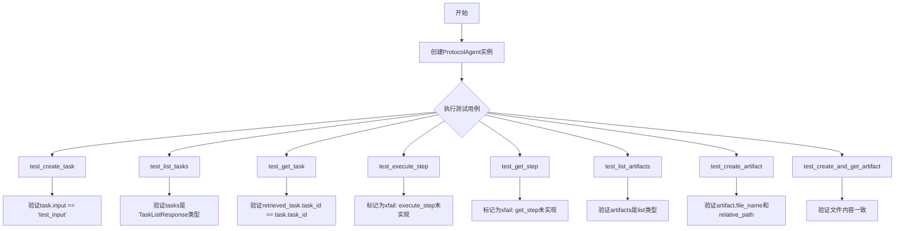
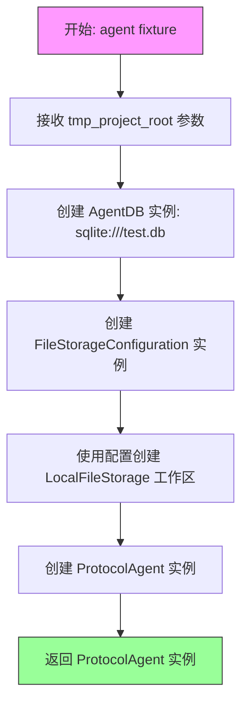
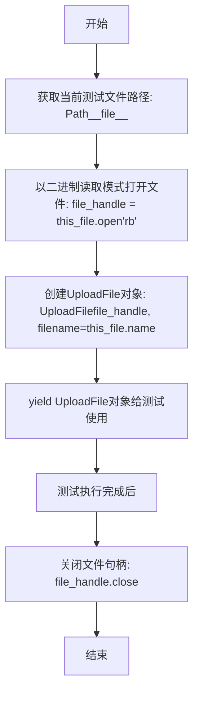
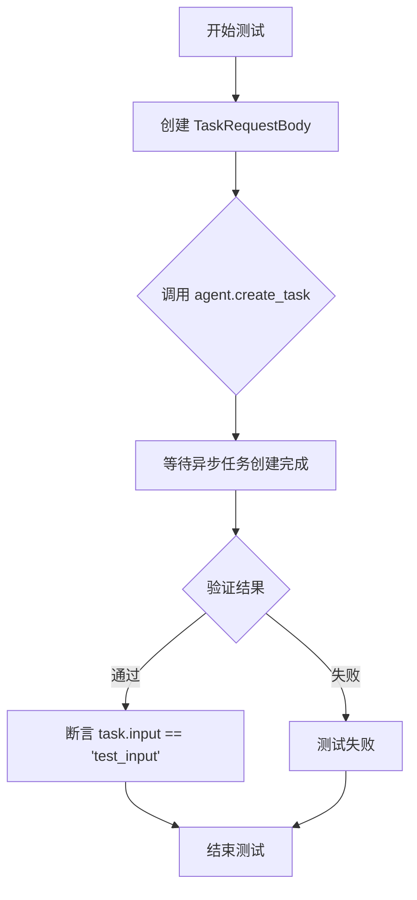
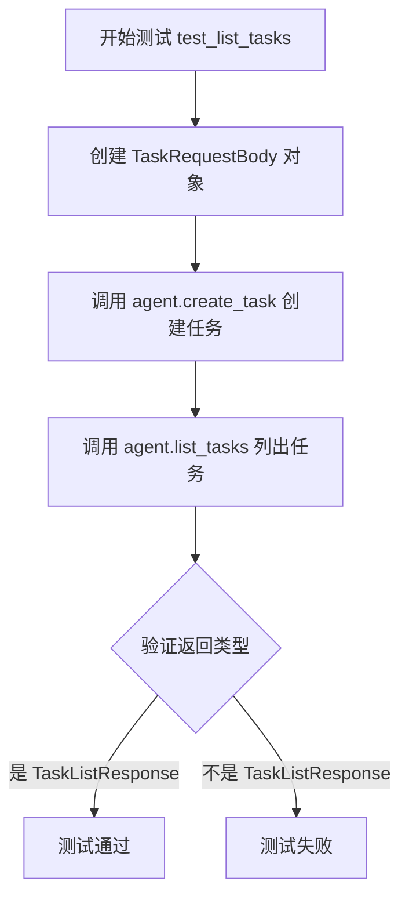
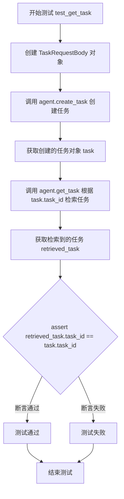
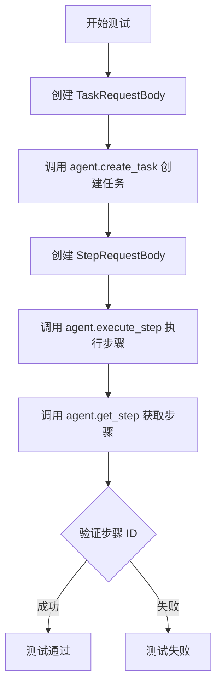
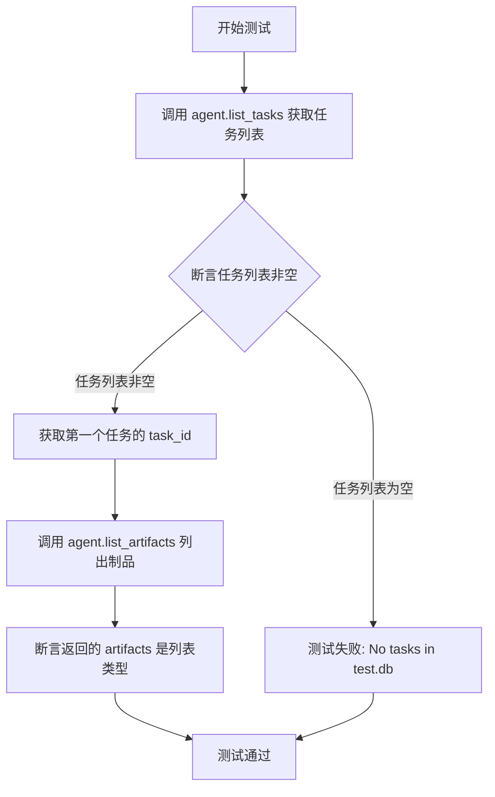
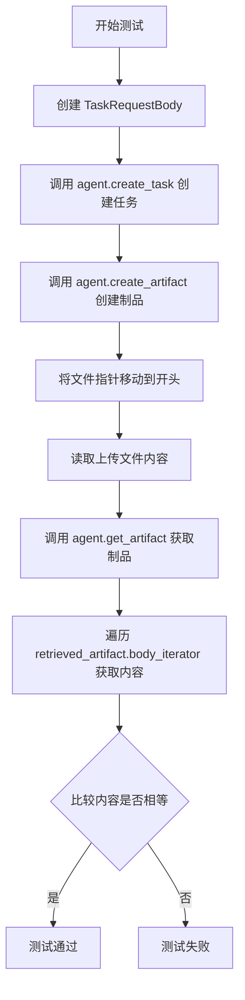

# `.\AutoGPT\classic\forge\forge\agent_protocol\agent_test.py` 详细设计文档

这是一个关于ProtocolAgent的单元测试文件，测试了ProtocolAgent的创建任务、列出任务、获取任务、执行步骤、获取步骤、创建制品、列出制品、获取制品等核心功能。

## 整体流程



## 类结构

```
测试模块
├── Fixtures
│   ├── agent (创建ProtocolAgent实例)
│   └── file_upload (创建UploadFile模拟)
└── 测试函数
    ├── test_create_task
    ├── test_list_tasks
    ├── test_get_task
    ├── test_execute_step (xfail)
    ├── test_get_step (xfail)
    ├── test_list_artifacts
    ├── test_create_artifact
    └── test_create_and_get_artifact
```

## 全局变量及字段


### `tmp_project_root`
    
临时项目根目录

类型：`Path`
    


### `db`
    
代理数据库实例

类型：`AgentDB`
    


### `config`
    
文件存储配置

类型：`FileStorageConfiguration`
    


### `workspace`
    
本地文件存储工作区

类型：`LocalFileStorage`
    


### `agent`
    
协议代理实例

类型：`ProtocolAgent`
    


### `this_file`
    
当前测试文件路径

类型：`Path`
    


### `file_handle`
    
文件句柄

类型：`file`
    


### `file_upload`
    
上传文件模拟

类型：`UploadFile`
    


### `task_request`
    
任务请求体

类型：`TaskRequestBody`
    


### `task`
    
任务实例

类型：`Task`
    


### `tasks`
    
任务列表响应

类型：`TaskListResponse`
    


### `step_request`
    
步骤请求体

类型：`StepRequestBody`
    


### `step`
    
步骤实例

类型：`Step`
    


### `artifacts`
    
制品列表

类型：`ArtifactListResponse`
    


### `artifact`
    
制品实例

类型：`Artifact`
    


### `file_upload_content`
    
上传文件内容

类型：`bytes`
    


### `retrieved_artifact`
    
获取的制品实例

类型：`StreamingResponse`
    


### `retrieved_artifact_content`
    
获取的制品内容

类型：`bytearray`
    


    

## 全局函数及方法


### `agent` (pytest fixture)

该 fixture 用于创建并返回一个 `ProtocolAgent` 实例，配置了内存 SQLite 数据库和本地文件存储工作区，主要用于测试环境中模拟 ProtocolAgent 的完整功能。

参数：

- `tmp_project_root`：`Path`，pytest 内置 fixture，提供临时项目根目录路径，用于配置本地文件存储的根路径

返回值：`ProtocolAgent`，配置好的 ProtocolAgent 实例，包含数据库和文件存储工作区

#### 流程图



#### 带注释源码

```python
@pytest.fixture
def agent(tmp_project_root: Path):
    """
    创建并返回 ProtocolAgent 实例的 pytest fixture
    
    该 fixture 用于测试环境，创建一个配置好的 ProtocolAgent 实例：
    - 使用内存 SQLite 数据库（test.db）进行数据持久化
    - 使用临时目录作为文件存储工作区
    
    Args:
        tmp_project_root: pytest 内置 fixture，提供临时项目根目录路径
        
    Returns:
        ProtocolAgent: 配置好的 Agent 实例，用于后续测试
    """
    # 创建 AgentDB 实例，使用 SQLite 数据库（测试用）
    db = AgentDB("sqlite:///test.db")
    
    # 配置本地文件存储，使用临时项目根目录
    config = FileStorageConfiguration(root=tmp_project_root)
    
    # 创建本地文件存储工作区
    workspace = LocalFileStorage(config)
    
    # 创建并返回 ProtocolAgent 实例，注入数据库和工作区依赖
    return ProtocolAgent(db, workspace)
```


### `file_upload`

这是一个 pytest fixture，用于创建并返回一个模拟的 `UploadFile` 对象，以便在测试环境中模拟文件上传场景。该 fixture 会打开当前测试文件作为二进制文件，并将其包装为 FastAPI 的 `UploadFile` 对象供测试使用。

参数：- 无显式参数（fixture 依赖通过 pytest 机制注入）

返回值：`UploadFile`，返回模拟的文件上传对象，用于测试文件上传相关的功能

#### 流程图



#### 带注释源码

```python
@pytest.fixture
def file_upload():
    """
    创建并返回一个模拟的UploadFile对象，用于测试文件上传功能。
    
    该fixture执行以下操作：
    1. 获取当前测试文件(__file__)的路径
    2. 以二进制读取模式打开该文件
    3. 创建FastAPI的UploadFile对象，封装文件句柄和文件名
    4. yield该对象供测试函数使用
    5. 测试完成后关闭文件句柄
    """
    # 获取当前测试文件的路径对象
    this_file = Path(__file__)
    
    # 以二进制读取模式('rb')打开当前测试文件
    # 这模拟了从客户端上传的文件
    file_handle = this_file.open("rb")
    
    # 创建FastAPI的UploadFile对象
    # 参数file_handle: 文件句柄，用于读取文件内容
    # 参数filename: 文件名，使用当前测试文件的名称
    yield UploadFile(file_handle, filename=this_file.name)
    
    # 测试完成后确保关闭文件句柄，释放资源
    file_handle.close()
```


### `test_create_task`

该测试函数用于验证 ProtocolAgent 的任务创建功能，通过构建 TaskRequestBody 并调用 create_task 方法，验证任务输入是否正确保存。

参数：

- `agent`：`ProtocolAgent`，测试夹具提供的代理实例，用于执行任务创建操作

返回值：`Task`，创建成功的任务对象，包含输入参数中定义的数据

#### 流程图



#### 带注释源码

```python
@pytest.mark.asyncio
async def test_create_task(agent: ProtocolAgent):
    # 创建任务请求体，包含输入文本和额外输入数据
    task_request = TaskRequestBody(
        input="test_input", additional_input={"input": "additional_test_input"}
    )
    # 调用代理的 create_task 方法异步创建任务
    task: Task = await agent.create_task(task_request)
    # 验证任务输入与请求中的输入一致
    assert task.input == "test_input"
```

---

### 文件整体运行流程

本测试文件包含多个异步测试用例，用于验证 ProtocolAgent 的各项功能。整体运行流程如下：

1. **测试夹具初始化**：通过 `@pytest.fixture` 装饰器创建 `agent` 夹具，初始化 AgentDB（SQLite 内存数据库）和 LocalFileStorage（本地文件存储）
2. **测试用例执行**：按顺序执行各个 `@pytest.mark.asyncio` 标记的异步测试函数
3. **数据验证**：每个测试通过断言验证返回结果的正确性

**测试用例清单**：
| 测试函数 | 功能描述 | 状态 |
|---------|---------|------|
| test_create_task | 测试创建任务 | 正常 |
| test_list_tasks | 测试任务列表查询 | 正常 |
| test_get_task | 测试单个任务获取 | 正常 |
| test_execute_step | 测试步骤执行 | 预期失败 |
| test_get_step | 测试步骤获取 | 预期失败 |
| test_list_artifacts | 测试制品列表 | 正常 |
| test_create_artifact | 测试制品创建 | 正常 |
| test_create_and_get_artifact | 测试制品创建并获取 | 正常 |

---

### 全局变量和导入

| 名称 | 类型 | 描述 |
|-----|------|------|
| `Path` | 类 | pathlib 模块的文件路径处理类 |
| `pytest` | 模块 | Python 单元测试框架 |
| `UploadFile` | 类 | FastAPI 上传文件对象 |
| `FileStorageConfiguration` | 类 | 文件存储配置类 |
| `LocalFileStorage` | 类 | 本地文件系统存储实现 |
| `ProtocolAgent` | 类 | 协议代理主类 |
| `AgentDB` | 类 | 代理数据库访问类 |
| `TaskRequestBody`, `Task`, `TaskListResponse`, `StepRequestBody` | 类 | 数据模型类 |

---

### 关键组件信息

| 组件名称 | 描述 |
|---------|------|
| ProtocolAgent | 核心代理类，提供任务创建、查询、执行等能力 |
| AgentDB | SQLite 数据库封装，负责数据持久化 |
| LocalFileStorage | 本地文件系统存储，用于管理制品文件 |
| TaskRequestBody | 任务请求数据模型 |
| Task | 任务数据模型 |
| TaskListResponse | 任务列表响应模型 |
| StepRequestBody | 步骤请求数据模型 |

---

### 潜在技术债务与优化空间

1. **数据库资源未清理**：测试使用 SQLite 文件 `test.db`，未在测试后自动清理，建议使用内存数据库 `sqlite://:memory:` 或添加 teardown 清理逻辑
2. **硬编码测试数据**：测试输入使用硬编码字符串，建议提取为测试常量或使用 Faker 生成
3. **重复的 TaskRequestBody 创建**：多个测试中重复创建相同的 `task_request` 对象，可提取为共享 fixture
4. **缺少异常场景测试**：当前仅覆盖正常路径，未测试边界条件（如空输入、特殊字符、超长文本等）
5. **file_upload fixture 未复用**：虽然存在 file_upload fixture，但部分测试未使用

---

### 其它项目

**设计目标与约束**：
- 使用异步 I/O（pytest-asyncio）确保测试效率
- 测试隔离：每个测试独立创建数据，不依赖其他测试的执行顺序
- 文件存储使用临时目录（tmp_project_root），避免污染真实文件系统

**错误处理与异常设计**：
- `test_execute_step` 和 `test_get_step` 使用 `@pytest.mark.xfail` 标记，预期功能未实现
- 测试中的异步操作均通过 `await` 等待完成，确保时序正确

**数据流与状态机**：
- 任务创建流程：TaskRequestBody → ProtocolAgent.create_task() → AgentDB 持久化 → 返回 Task 对象
- 制品管理流程：文件上传 → LocalFileStorage 保存 → 元数据存储 → 支持查询和下载

**外部依赖与接口契约**：
- 依赖 fastapi 的 UploadFile 类型
- 依赖 forge.file_storage 模块的 FileStorageConfiguration 和 LocalFileStorage
- 依赖本地 SQLite 数据库（通过 SQLAlchemy）


### `test_list_tasks`

描述：测试 ProtocolAgent 的 list_tasks 方法功能，验证能否正确列出已创建的任务，并确保返回值类型为 TaskListResponse。

参数：

- `agent`：`ProtocolAgent`，ProtocolAgent 实例，用于执行任务相关的操作

返回值：`None`，测试函数无显式返回值，通过 assert 验证返回类型

#### 流程图



#### 带注释源码

```python
@pytest.mark.asyncio
async def test_list_tasks(agent: ProtocolAgent):
    """
    测试列出任务功能
    
    该测试函数验证 ProtocolAgent 的 list_tasks 方法能够：
    1. 创建任务后正确列出所有任务
    2. 返回 TaskListResponse 类型的对象
    """
    # 创建任务请求对象，包含输入和额外输入
    task_request = TaskRequestBody(
        input="test_input", additional_input={"input": "additional_test_input"}
    )
    
    # 调用 agent 的 create_task 方法创建任务
    # 这一步确保数据库中至少有一个任务可供列出
    await agent.create_task(task_request)
    
    # 调用 agent 的 list_tasks 方法获取所有任务列表
    tasks = await agent.list_tasks()
    
    # 断言验证返回的对象是 TaskListResponse 类型
    # TaskListResponse 通常包含 tasks 列表属性
    assert isinstance(tasks, TaskListResponse)
```


### `test_get_task`

该测试函数用于验证 ProtocolAgent 的任务获取功能，通过创建一个任务后根据任务ID检索任务，并断言检索到的任务ID与创建的任务ID一致，以确保 `get_task` 方法能正确返回已有任务。

参数：

- `agent`：`ProtocolAgent`，测试代理实例，提供 create_task 和 get_task 方法

返回值：`None`，该函数为测试函数，使用 assert 断言验证功能，不返回具体值

#### 流程图



#### 带注释源码

```python
# 使用 pytest.mark.asyncio 标记为异步测试
@pytest.mark.asyncio
async def test_get_task(agent: ProtocolAgent):
    """
    测试获取任务功能
    
    Args:
        agent: ProtocolAgent 实例，用于执行任务操作
    """
    # 1. 构建任务请求体，包含输入和额外输入
    task_request = TaskRequestBody(
        input="test_input", 
        additional_input={"input": "additional_test_input"}
    )
    
    # 2. 调用 agent 的 create_task 方法创建新任务
    task = await agent.create_task(task_request)
    
    # 3. 调用 agent 的 get_task 方法根据任务ID获取任务
    retrieved_task = await agent.get_task(task.task_id)
    
    # 4. 断言检索到的任务ID与创建的任务ID一致，验证 get_task 功能正确性
    assert retrieved_task.task_id == task.task_id
```


### `test_execute_step`

该测试函数用于验证 `ProtocolAgent` 类的 `execute_step` 方法的基本功能，通过创建任务后执行步骤，并断言返回步骤的输入和额外输入字段是否与请求一致。当前该测试被标记为预期失败，原因是 `execute_step` 方法尚未实现。

参数：

- `agent`：`ProtocolAgent`，测试用的协议代理实例，包含数据库和文件存储等依赖

返回值：无（`async def` 测试函数，通过 pytest 断言验证行为）

#### 流程图

```mermaid
flowchart TD
    A[开始测试] --> B[创建 TaskRequestBody]
    B --> C[调用 agent.create_task 创建任务]
    C --> D[创建 StepRequestBody]
    D --> E[调用 agent.execute_step 执行步骤]
    E --> F{步骤是否执行成功}
    F -->|是| G[断言 step.input == 'step_input']
    G --> H[断言 step.additional_input == {'input': 'additional_test_input'}]
    H --> I[测试通过]
    F -->|否| J[测试失败 - 方法未实现]
```

#### 带注释源码

```python
# 该测试被标记为预期失败，原因见下
@pytest.mark.xfail(reason="execute_step is not implemented")
# 标记为异步测试，由 pytest-asyncio 运行
@pytest.mark.asyncio
async def test_execute_step(agent: ProtocolAgent):
    """
    测试 ProtocolAgent 的 execute_step 方法功能
    验证点：
    1. 能够为已有任务创建新的步骤
    2. 返回的步骤包含正确的 input 字段
    3. 返回的步骤包含正确的 additional_input 字段
    """
    # 第一步：构造任务请求对象，包含输入和额外输入
    task_request = TaskRequestBody(
        input="test_input", additional_input={"input": "additional_test_input"}
    )
    # 第二步：调用 agent 的 create_task 方法创建任务
    # 返回的 task 对象应包含 task_id 等信息
    task = await agent.create_task(task_request)
    
    # 第三步：构造步骤请求对象
    step_request = StepRequestBody(
        input="step_input", additional_input={"input": "additional_test_input"}
    )
    
    # 第四步：调用 agent 的 execute_step 方法执行步骤
    # 传入任务ID和步骤请求，返回步骤对象
    step = await agent.execute_step(task.task_id, step_request)
    
    # 第五步：断言验证返回的步骤对象
    # 验证 input 字段是否与请求中的 input 一致
    assert step.input == "step_input"
    # 验证 additional_input 字段是否与请求中的 additional_input 一致
    assert step.additional_input == {"input": "additional_test_input"}
```


### `test_get_step`

测试获取步骤功能，该测试用例标记为预期失败（xfail），因为 `execute_step` 方法尚未实现。

参数：

- `agent`：`ProtocolAgent`，测试代理实例，通过 pytest fixture 注入

返回值：无（测试函数无显式返回值）

#### 流程图



#### 带注释源码

```python
@pytest.mark.xfail(reason="execute_step is not implemented")  # 标记为预期失败，原因：execute_step 未实现
@pytest.mark.asyncio  # 标记为异步测试
async def test_get_step(agent: ProtocolAgent):
    # 创建任务请求体，包含输入和额外输入
    task_request = TaskRequestBody(
        input="test_input", 
        additional_input={"input": "additional_test_input"}
    )
    
    # 通过 agent 创建任务
    task = await agent.create_task(task_request)
    
    # 创建步骤请求体
    step_request = StepRequestBody(
        input="step_input", 
        additional_input={"input": "additional_test_input"}
    )
    
    # 执行步骤（预期未实现）
    step = await agent.execute_step(task.task_id, step_request)
    
    # 获取刚创建的步骤
    retrieved_step = await agent.get_step(task.task_id, step.step_id)
    
    # 断言获取的步骤 ID 与创建的步骤 ID 一致
    assert retrieved_step.step_id == step.step_id
```


### `test_list_artifacts`

测试列出制品功能，验证能够正确列出指定任务下的所有制品。

参数：

- `agent`：`ProtocolAgent`，测试使用的协议代理实例，用于执行任务相关操作

返回值：`None`，该函数为测试函数，无返回值，通过断言验证功能正确性

#### 流程图



#### 带注释源码

```python
@pytest.mark.asyncio  # 标记为异步测试函数
async def test_list_artifacts(agent: ProtocolAgent):
    """测试列出制品功能"""
    # 获取当前所有的任务列表
    tasks = await agent.list_tasks()
    # 断言确保数据库中存在任务，否则无法测试制品列出功能
    assert tasks.tasks, "No tasks in test.db"

    # 使用第一个任务的 task_id 来列出该任务下的所有制品
    artifacts = await agent.list_artifacts(tasks.tasks[0].task_id)
    # 断言返回的 artifacts 是列表类型，验证接口返回格式正确
    assert isinstance(artifacts.artifacts, list)
```


### `test_create_artifact`

该测试函数用于验证 ProtocolAgent 创建制品（artifact）的功能。首先创建一个测试任务，然后上传一个文件作为制品，最后验证返回的制品对象包含正确的文件名和相对路径。

参数：

- `agent`：`ProtocolAgent`，测试用的代理实例，通过 fixture 注入
- `file_upload`：`UploadFile`，待上传的文件对象，通过 fixture 注入

返回值：无（测试函数无返回值，通过 assert 断言验证）

#### 流程图

```mermaid
flowchart TD
    A[Start: test_create_artifact] --> B[创建 TaskRequestBody]
    B --> C[调用 agent.create_task 创建任务]
    C --> D[调用 agent.create_artifact 上传文件]
    D --> E{验证 artifact.file_name}
    E -->|等于 file_upload.filename| F{验证 artifact.relative_path}
    E -->|不等于| G[断言失败: 文件名不匹配]
    F -->|等于 f"a_dir/{file_upload.filename}"| H[测试通过]
    F -->|不等于| I[断言失败: 路径不匹配]
    H --> J[End: 测试完成]
```

#### 带注释源码

```python
@pytest.mark.asyncio
async def test_create_artifact(agent: ProtocolAgent, file_upload: UploadFile):
    """
    测试创建制品功能
    
    测试步骤：
    1. 准备任务请求数据
    2. 创建任务
    3. 调用 create_artifact 创建制品
    4. 断言验证制品属性
    """
    # 准备任务请求参数
    task_request = TaskRequestBody(
        input="test_input", 
        additional_input={"input": "additional_test_input"}
    )
    
    # 调用 agent 的 create_task 方法创建任务
    # 返回值: Task 对象，包含 task_id 等信息
    task = await agent.create_task(task_request)
    
    # 调用 agent 的 create_artifact 方法创建制品
    # 参数:
    #   - task_id: 任务ID，关联到对应的任务
    #   - file: UploadFile 对象，包含上传的文件内容
    #   - relative_path: 文件在制品存储中的相对路径
    # 返回值: Artifact 对象，包含 artifact_id, file_name, relative_path 等信息
    artifact = await agent.create_artifact(
        task_id=task.task_id,
        file=file_upload,
        relative_path=f"a_dir/{file_upload.filename}",
    )
    
    # 断言验证返回的制品对象包含正确的文件名
    assert artifact.file_name == file_upload.filename
    
    # 断言验证返回的制品对象包含正确的相对路径
    assert artifact.relative_path == f"a_dir/{file_upload.filename}"
```


### `test_create_and_get_artifact`

该测试函数验证了 ProtocolAgent 的制品创建和获取功能。首先创建一个任务，然后上传文件作为制品，接着读取上传的文件内容，再通过 task_id 和 artifact_id 获取该制品，最后断言获取到的制品内容与原始上传文件内容一致，确保制品的创建和检索流程正常工作。

参数：

- `agent`：`ProtocolAgent`，ProtocolAgent 实例，用于创建任务、创建制品和获取制品
- `file_upload`：`UploadFile`，要上传作为制品的文件

返回值：无（测试函数，通过断言验证功能）

#### 流程图



#### 带注释源码

```python
@pytest.mark.asyncio
async def test_create_and_get_artifact(agent: ProtocolAgent, file_upload: UploadFile):
    # 构造任务请求体，包含输入和额外输入
    task_request = TaskRequestBody(
        input="test_input", additional_input={"input": "additional_test_input"}
    )
    # 调用 agent 创建任务
    task = await agent.create_task(task_request)

    # 调用 agent 创建制品，传入任务ID、文件和相对路径
    artifact = await agent.create_artifact(
        task_id=task.task_id,
        file=file_upload,
        relative_path=f"b_dir/{file_upload.filename}",
    )
    # 将文件指针移动到开头，以便重新读取
    await file_upload.seek(0)
    # 读取上传文件的全部内容
    file_upload_content = await file_upload.read()

    # 通过任务ID和制品ID获取制品
    retrieved_artifact = await agent.get_artifact(task.task_id, artifact.artifact_id)
    # 使用字节数组收集制品内容
    retrieved_artifact_content = bytearray()
    # 异步迭代制品的内容迭代器
    async for b in retrieved_artifact.body_iterator:
        retrieved_artifact_content.extend(b)  # type: ignore
    # 断言获取的制品内容与原始文件内容一致
    assert retrieved_artifact_content == file_upload_content
```

## 关键组件


### ProtocolAgent

核心代理类，负责管理任务、步骤和工件的完整生命周期。提供任务创建、列表查询、详情获取、步骤执行以及工件的上传下载等功能。

### AgentDB

数据库接口类，负责任务的持久化存储。使用SQLite数据库（测试场景），封装了任务数据的增删改查操作。

### LocalFileStorage

本地文件系统存储实现类，配合FileStorageConfiguration配置管理工件的物理文件存储路径。

### Task / TaskRequestBody / TaskListResponse

任务相关数据模型。Task表示任务实体，TaskRequestBody用于创建任务的请求体，TaskListResponse用于返回任务列表。

### StepRequestBody

步骤请求模型，包含步骤的输入数据和额外输入参数，用于execute_step操作。

### AgentDB Fixture

测试夹具，负责初始化AgentDB数据库实例，提供测试所需的数据库环境。

### LocalFileStorage Fixture

测试夹具，基于临时目录初始化LocalFileStorage实例，为测试提供隔离的文件存储环境。

### ProtocolAgent Fixture

测试夹具，整合AgentDB和LocalFileStorage创建ProtocolAgent实例，是所有测试用例的入口点。

### FileUpload Fixture

测试夹具，负责创建模拟的文件上传对象，用于测试工件创建功能。

### test_create_task

测试用例，验证ProtocolAgent.create_task()方法能够正确创建任务并返回包含正确输入的Task对象。

### test_list_tasks

测试用例，验证任务列表查询功能，返回TaskListResponse对象。

### test_get_task

测试用例，验证根据task_id获取任务详情的功能。

### test_execute_step

测试用例（标记为xfail），验证步骤执行功能，当前未实现。

### test_get_step

测试用例（标记为xfail），验证根据task_id和step_id获取步骤详情的功能。

### test_list_artifacts

测试用例，验证列出指定任务下所有工件的功能。

### test_create_artifact

测试用例，验证创建工件功能，包括文件上传和相对路径设置。

### test_create_and_get_artifact

测试用例，验证工件的完整上传下载流程，确保上传内容与下载内容一致。


## 问题及建议


### 已知问题

- **测试数据重复**：每个测试函数都重复创建相同的 `TaskRequestBody` 对象，应抽取为共享的 fixture
- **资源清理不完整**：`file_upload` fixture 使用 `yield` 但只关闭了 `file_handle`，UploadFile 对象本身未正确清理；`agent` fixture 未使用 yield 语法，无法确保数据库连接等资源被正确释放
- **数据库状态未隔离**：测试使用硬编码的 `sqlite:///test.db`，多个测试共享同一数据库文件，可能导致测试间相互影响且测试后未清理数据库文件
- **测试依赖不明确**：`test_list_artifacts` 依赖前面的测试创建任务数据，测试之间存在隐式依赖，破坏了测试的独立性
- **文件指针处理问题**：`test_create_and_get_artifact` 中调用 `await file_upload.seek(0)` 后直接读取，但没有验证文件是否真正可重复读取
- **类型安全问题**：第117行 `retrieved_artifact_content.extend(b)` 存在类型不匹配风险（`b` 可能为 `None` 或非字节类型）
- **缺少错误场景测试**：没有对边界条件、异常输入、并发访问等场景的测试覆盖
- **未实现的测试用例**：`test_execute_step` 和 `test_get_step` 被标记为 xfail，表明核心功能未完成，属于已知的技术债务

### 优化建议

- 将重复的 `task_request` 抽取为 pytest fixture（如 `@pytest.fixture def task_request(): return TaskRequestBody(...)`）
- 为 `agent` fixture 添加 teardown 逻辑，使用 `yield` 并在结束后清理数据库连接和临时文件
- 为每个测试使用唯一的数据库文件（如使用 `tmp_path` 或 `tmp_project_root` 生成临时数据库路径），或使用内存数据库 `sqlite:///:memory:`
- 确保测试之间完全独立，避免依赖执行顺序，每个测试应自行准备所需数据
- 在 `test_create_and_get_artifact` 中使用 context manager 或确保 UploadFile 正确关闭
- 添加类型检查或使用 `typing.cast` 明确类型，如 `retrieved_artifact_content.extend(b)  # type: ignore` 可改为更安全的类型处理
- 添加负面测试用例，如测试无效的任务ID、文件路径冲突、并发创建任务等场景
- 在实现 `execute_step` 和 `get_step` 后，移除 xfail 标记并添加相应的测试覆盖
</think>


## 其它


### 设计目标与约束

本测试套件旨在验证ProtocolAgent的核心功能，包括任务管理、步骤执行和制品管理。设计约束包括：使用SQLite内存数据库进行测试隔离；临时文件存储使用tmp_project_root确保测试环境清洁；异步测试使用pytest-asyncio插件；部分功能（execute_step）标记为xfail表示尚未实现。

### 错误处理与异常设计

测试代码中使用了pytest的xfail标记来处理未实现功能的预期失败。数据库操作可能抛出SQLite相关异常，文件操作可能抛出IO异常。测试通过assert语句验证返回对象的属性一致性，制品内容验证采用字节流对比方式确保数据完整性。

### 数据流与状态机

任务创建流程：输入TaskRequestBody -> ProtocolAgent.create_task() -> 生成Task对象（含task_id） -> 存储至AgentDB。制品上传流程：输入file和relative_path -> ProtocolAgent.create_artifact() -> 文件存储至LocalFileStorage -> 生成Artifact元数据 -> 关联至Task。状态转换：Task（pending -> running -> completed）、Step（pending -> running -> completed）、Artifact（created -> available）。

### 外部依赖与接口契约

核心依赖包括：pytest（测试框架）、pytest-asyncio（异步测试支持）、fastapi（UploadFile类型）、pathlib（Path路径处理）。被测系统依赖：ProtocolAgent类、AgentDB数据库类、LocalFileStorage文件存储类、FileStorageConfiguration配置类、Task/TaskRequestBody/TaskListResponse/StepRequestBody等数据模型类。

### 性能考虑

测试使用内存数据库sqlite:///test.db避免磁盘IO开销。制品内容验证采用流式读取（async for chunk in body_iterator）避免大文件占用过多内存。测试间通过fixture共享agent实例减少初始化开销。

### 安全考虑

测试使用临时目录（tmp_project_root）避免污染真实文件系统。文件句柄在fixture中正确关闭（file_handle.close()）。UploadFile使用with语句确保资源释放。数据库使用内存模式避免持久化敏感测试数据。

### 测试覆盖

当前测试覆盖：create_task、list_tasks、get_task、execute_step（xfail）、get_step（xfail）、list_artifacts、create_artifact、create_and_get_artifact。未覆盖场景：任务删除、任务状态更新、并发任务创建、大文件上传、数据库迁移、文件存储异常处理。

### 配置管理

测试配置通过fixture注入：AgentDB使用sqlite:///test.db连接字符串；FileStorageConfiguration使用tmp_project_root作为root路径；agent fixture依赖workspace fixture确保正确的文件存储配置。

### 并发与异步设计

所有测试方法标记为@pytest.mark.asyncio支持异步执行。agent方法（create_task、list_tasks等）返回协程对象。文件上传使用async for流式读取。测试顺序独立，可并行执行。

### 部署与环境

测试依赖Python 3.7+环境。需安装的包：pytest、pytest-asyncio、fastapi、pathlib（标准库）。运行命令：pytest test_agent.py -v。CI/CD应包含测试阶段确保代码变更不影响核心功能。


    