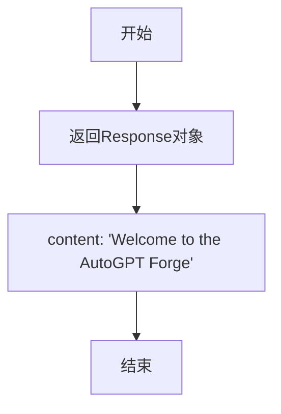
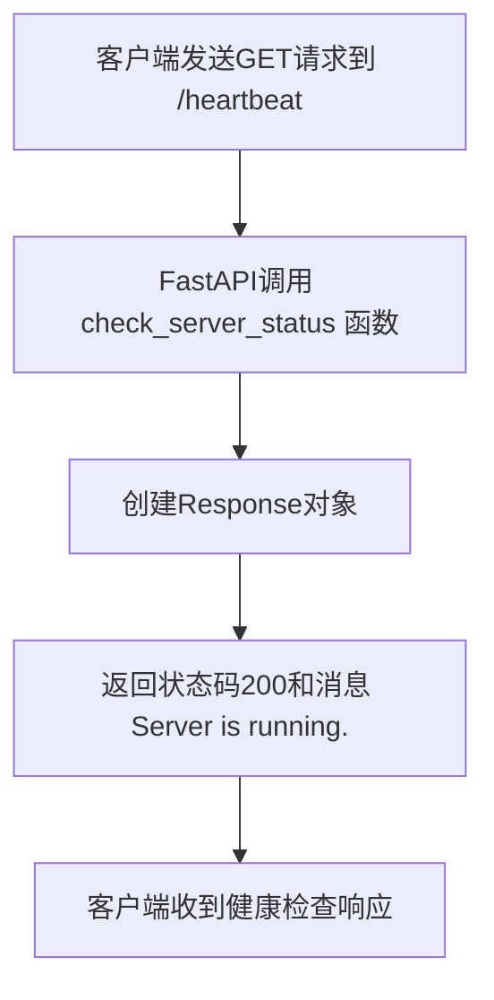
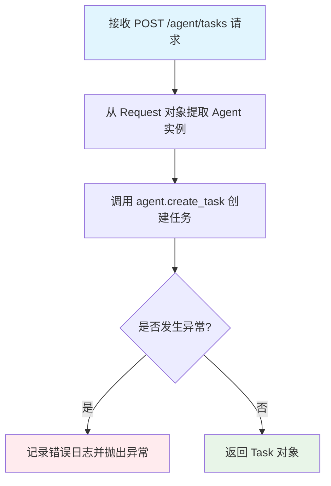
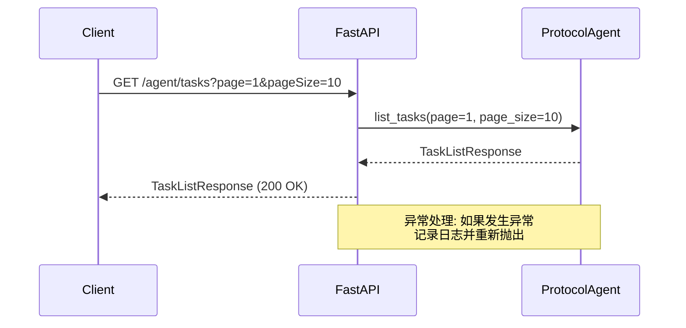

# `.\AutoGPT\classic\forge\forge\agent_protocol\api_router.py` 详细设计文档

这是 Agent 服务的 API 路由模块，定义了一系列基于 FastAPI 的 RESTful 端点，用于创建、管理和执行 Agent 任务，包括任务的增删改查、步骤执行、以及产物的上传下载功能。

## 整体流程

```mermaid
graph TD
    A[客户端请求] --> B{请求类型}
    B -->|GET /| C[root]
    B -->|GET /heartbeat D[check_server_status]
    B -->|POST /agent/tasks E[create_agent_task]
    B -->|GET /agent/tasks F[list_agent_tasks]
    B -->|GET /agent/tasks/{task_id} G[get_agent_task]
    B -->|GET /agent/tasks/{task_id}/steps H[list_agent_task_steps]
    B -->|POST /agent/tasks/{task_id}/steps I[execute_agent_task_step]
    B -->|GET /agent/tasks/{task_id}/steps/{step_id} J[get_agent_task_step]
    B -->|GET /agent/tasks/{task_id}/artifacts K[list_agent_task_artifacts]
    B -->|POST /agent/tasks/{task_id}/artifacts L[upload_agent_task_artifacts]
    B -->|GET /agent/tasks/{task_id}/artifacts/{artifact_id} M[download_agent_task_artifact]
    C --> N[返回欢迎消息]
    D --> O[返回服务器运行状态]
    E --> P[调用 agent.create_task]
    F --> Q[调用 agent.list_tasks]
    G --> R[调用 agent.get_task]
    H --> S[调用 agent.list_steps]
    I --> T[调用 agent.execute_step]
    J --> U[调用 agent.get_step]
    K --> V[调用 agent.list_artifacts]
    L --> W[调用 agent.create_artifact]
    M --> X[调用 agent.get_artifact]
```

## 类结构

```
APIRouter (base_router)
└── 路由端点集
    ├── root (GET /)
    ├── check_server_status (GET /heartbeat)
    ├── create_agent_task (POST /agent/tasks)
    ├── list_agent_tasks (GET /agent/tasks)
    ├── get_agent_task (GET /agent/tasks/{task_id})
    ├── list_agent_task_steps (GET /agent/tasks/{task_id}/steps)
    ├── execute_agent_task_step (POST /agent/tasks/{task_id}/steps)
    ├── get_agent_task_step (GET /agent/tasks/{task_id}/steps/{step_id})
    ├── list_agent_task_artifacts (GET /agent/tasks/{task_id}/artifacts)
    ├── upload_agent_task_artifacts (POST /agent/tasks/{task_id}/artifacts)
    └── download_agent_task_artifact (GET /agent/tasks/{task_id}/artifacts/{artifact_id})
```

## 全局变量及字段


### `base_router`
    
FastAPI路由实例，用于定义Agent服务的API端点

类型：`APIRouter`
    


### `logger`
    
模块级日志记录器，用于记录路由模块的错误和调试信息

类型：`logging.Logger`
    


### `TYPE_CHECKING`
    
typing模块的特殊标记，用于在类型检查时导入可选依赖，避免运行时循环导入

类型：`typing.ModuleType`
    


    

## 全局函数及方法


### `root`

Root endpoint that returns a welcome message.

参数：

- 无参数

返回值：`Response`，返回一个包含"Welcome to the AutoGPT Forge"消息的响应对象

#### 流程图



#### 带注释源码

```python
@base_router.get("/", tags=["root"])
async def root():
    """
    Root endpoint that returns a welcome message.
    """
    return Response(content="Welcome to the AutoGPT Forge")
```


### `check_server_status`

这是一个简单的健康检查端点，通过返回固定的响应消息来确认服务器是否正在运行。

参数： 无

返回值：`Response`，返回一个包含"Server is running."消息的HTTP响应，状态码为200。

#### 流程图



#### 带注释源码

```python
@base_router.get("/heartbeat", tags=["server"])
async def check_server_status():
    """
    Check if the server is running.
    这是一个健康检查端点，用于验证服务器是否正常运行。
    通常由监控系统或负载均衡器定期调用。
    """
    return Response(content="Server is running.", status_code=200)
```


### `create_agent_task`

创建任务端点，接收任务请求体并通过 Agent 实例创建新任务，返回包含任务 ID、输入和附加输入的 Task 对象。

参数：

- `request`：`Request`，FastAPI 请求对象，用于获取请求上下文中的 Agent 实例
- `task_request`：`TaskRequestBody`，任务请求体，包含创建任务所需的输入数据

返回值：`Task`，新创建的任务对象，包含 task_id、input、additional_input 和 artifacts 字段

#### 流程图



#### 带注释源码

```python
@base_router.post("/agent/tasks", tags=["agent"], response_model=Task)
async def create_agent_task(request: Request, task_request: TaskRequestBody) -> Task:
    """
    Creates a new task using the provided TaskRequestBody and returns a Task.

    Args:
        request (Request): FastAPI request object.
        task (TaskRequestBody): The task request containing input data.

    Returns:
        Task: A new task with task_id, input, and additional_input set.

    Example:
        Request (TaskRequestBody defined in schema.py):
            {
                "input": "Write the words you receive to the file 'output.txt'.",
                "additional_input": "python/code"
            }

        Response (Task defined in schema.py):
            {
                "task_id": "50da533e-3904-4401-8a07-c49adf88b5eb",
                "input": "Write the word 'Washington' to a .txt file",
                "additional_input": "python/code",
                "artifacts": [],
            }
    """
    # 从请求对象中提取 Agent 实例（通过中间件注入）
    agent: "ProtocolAgent" = request["agent"]

    try:
        # 调用 Agent 实例的方法创建任务
        task = await agent.create_task(task_request)
        # 返回创建成功的任务对象
        return task
    except Exception:
        # 记录异常日志并重新抛出，供上层异常处理器处理
        logger.exception(f"Error whilst trying to create a task: {task_request}")
        raise
```


### `list_agent_tasks`

该函数是 FastAPI 路由处理程序，用于检索分页的任务列表。它接收分页参数（页码和每页大小），从 ProtocolAgent 获取任务列表，并以 TaskListResponse 的形式返回给客户端。

参数：

- `request`：`Request`，FastAPI 请求对象，用于获取附加在请求中的 agent 实例
- `page`：`int`，分页的页码，默认值为 1，最小值为 1
- `page_size`：`int`，每页的任务数量，默认值为 10，最小值为 1

返回值：`TaskListResponse`，包含任务列表和分页详情的响应对象

#### 流程图



#### 带注释源码

```python
@base_router.get("/agent/tasks", tags=["agent"], response_model=TaskListResponse)
async def list_agent_tasks(
    request: Request,
    page: int = Query(1, ge=1),
    page_size: int = Query(10, ge=1),
) -> TaskListResponse:
    """
    Retrieves a paginated list of all tasks.

    Args:
        request (Request): FastAPI request object.
        page (int, optional): Page number for pagination. Default: 1
        page_size (int, optional): Number of tasks per page for pagination. Default: 10

    Returns:
        TaskListResponse: A list of tasks, and pagination details.

    Example:
        Request:
            GET /agent/tasks?page=1&pageSize=10

        Response (TaskListResponse defined in schema.py):
            {
                "items": [
                    {
                        "input": "Write the word 'Washington' to a .txt file",
                        "additional_input": null,
                        "task_id": "50da533e-3904-4401-8a07-c49adf88b5eb",
                        "artifacts": [],
                        "steps": []
                    },
                    ...
                ],
                "pagination": {
                    "total": 100,
                    "pages": 10,
                    "current": 1,
                    "pageSize": 10
                }
            }
    """
    # 从请求对象中提取 ProtocolAgent 实例
    agent: "ProtocolAgent" = request["agent"]
    
    try:
        # 调用 agent 的 list_tasks 方法获取分页任务列表
        tasks = await agent.list_tasks(page, page_size)
        return tasks
    except Exception:
        # 记录异常日志并重新抛出，供 FastAPI 错误处理器处理
        logger.exception("Error whilst trying to list tasks")
        raise
```


### `get_agent_task`

获取指定 ID 的任务详情。

参数：

-  `request`：`Request`，FastAPI 请求对象，包含代理实例
-  `task_id`：`str`，任务的唯一标识符

返回值：`Task`，包含任务 ID、输入、额外输入、产物列表和步骤列表的任务对象

#### 流程图

```mermaid
flowchart TD
    A[接收 GET /agent/tasks/{task_id} 请求] --> B[从请求中提取 agent 实例]
    B --> C{尝试获取任务}
    C -->|成功| D[返回 Task 对象]
    C -->|失败| E[记录错误日志并抛出异常]
```

#### 带注释源码

```python
@base_router.get("/agent/tasks/{task_id}", tags=["agent"], response_model=Task)
async def get_agent_task(request: Request, task_id: str) -> Task:
    """
    Gets the details of a task by ID.

    Args:
        request (Request): FastAPI request object.
        task_id (str): The ID of the task.

    Returns:
        Task: The task with the given ID.
    """
    # 从请求对象中获取 ProtocolAgent 实例
    agent: "ProtocolAgent" = request["agent"]
    
    try:
        # 调用 agent 的 get_task 方法获取任务详情
        task = await agent.get_task(task_id)
        return task
    except Exception:
        # 记录异常日志并重新抛出
        logger.exception(f"Error whilst trying to get task: {task_id}")
        raise
```


### `list_agent_task_steps`

该函数是一个FastAPI路由处理器，用于检索与特定任务关联的步骤列表，并支持分页功能。它从请求中获取Agent实例，然后调用Agent的list_steps方法返回分页后的步骤列表。

参数：

- `request`：`Request`，FastAPI请求对象，用于获取Agent实例
- `task_id`：`str`，任务的唯一标识符
- `page`：`int`，可选，默认值为1，分页的页码
- `page_size`：`int`，可选，默认值为10，每页的步骤数量（别名pageSize）

返回值：`TaskStepsListResponse`，包含步骤列表和分页详情

#### 流程图

```mermaid
flowchart TD
    A[接收GET请求 /agent/tasks/{task_id}/steps] --> B{验证参数}
    B -->|参数合法| C[从request获取ProtocolAgent实例]
    B -->|参数非法| D[FastAPI自动返回422验证错误]
    C --> E{try块}
    E -->|成功| F[调用agent.list_steps task_id, page, page_size]
    F --> G[返回TaskStepsListResponse]
    E -->|失败| H[记录异常日志]
    H --> I[抛出异常]
    G --> J[响应给客户端]
    I --> J
```

#### 带注释源码

```python
@base_router.get(
    "/agent/tasks/{task_id}/steps",
    tags=["agent"],
    response_model=TaskStepsListResponse,
)
async def list_agent_task_steps(
    request: Request,
    task_id: str,
    page: int = Query(1, ge=1),
    page_size: int = Query(10, ge=1, alias="pageSize"),
) -> TaskStepsListResponse:
    """
    Retrieves a paginated list of steps associated with a specific task.

    Args:
        request (Request): FastAPI request object.
        task_id (str): The ID of the task.
        page (int, optional): The page number for pagination. Defaults to 1.
        page_size (int, optional): Number of steps per page for pagination. Default: 10.

    Returns:
        TaskStepsListResponse: A list of steps, and pagination details.

    Example:
        Request:
            GET /agent/tasks/50da533e-3904-4401-8a07-c49adf88b5eb/steps?page=1&pageSize=10

        Response (TaskStepsListResponse defined in schema.py):
            {
                "items": [
                    {
                        "task_id": "50da533e-3904-4401-8a07-c49adf88b5eb",
                        "step_id": "step1_id",
                        ...
                    },
                    ...
                ],
                "pagination": {
                    "total": 100,
                    "pages": 10,
                    "current": 1,
                    "pageSize": 10
                }
            }
    """  # noqa: E501
    # 从请求对象中获取ProtocolAgent实例
    agent: "ProtocolAgent" = request["agent"]
    try:
        # 调用Agent的list_steps方法获取分页的步骤列表
        steps = await agent.list_steps(task_id, page, page_size)
        return steps
    except Exception:
        # 记录异常日志并重新抛出
        logger.exception("Error whilst trying to list steps")
        raise
```


### `execute_agent_task_step`

执行指定任务的下一个步骤，根据当前任务状态返回已执行的步骤及额外的反馈字段（output 和 additional_output）。这是 Agent 实际执行工作的核心端点。

参数：

- `request`：`Request`，FastAPI 请求对象，用于获取关联的 agent 实例
- `task_id`：`str`，任务的唯一标识符
- `step_request`：`Optional[StepRequestBody]`，执行步骤的请求体，包含输入数据；若为空则表示继续执行（默认 "y"）

返回值：`Step`，已执行步骤的详细信息，包含 output（主要反馈）和 additional_output（补充信息）

#### 流程图

```mermaid
flowchart TD
    A[接收 POST /agent/tasks/{task_id}/steps 请求] --> B{step_request 是否为空}
    B -->|是| C[创建默认 StepRequestBody input='y']
    B -->|否| D[使用提供的 step_request]
    C --> E[调用 agent.execute_step]
    D --> E
    E --> F{执行成功?}
    F -->|是| G[返回 Step 对象]
    F -->|否| H[记录异常日志]
    H --> I[抛出异常]
```

#### 带注释源码

```python
@base_router.post("/agent/tasks/{task_id}/steps", tags=["agent"], response_model=Step)
async def execute_agent_task_step(
    request: Request, task_id: str, step_request: Optional[StepRequestBody] = None
) -> Step:
    """
    Executes the next step for a specified task based on the current task status and
    returns the executed step with additional feedback fields.

    This route is significant because this is where the agent actually performs work.
    The function handles executing the next step for a task based on its current state,
    and it requires careful implementation to ensure all scenarios (like the presence
    or absence of steps or a step marked as `last_step`) are handled correctly.

    Depending on the current state of the task, the following scenarios are possible:
    1. No steps exist for the task.
    2. There is at least one step already for the task, and the task does not have a
       completed step marked as `last_step`.
    3. There is a completed step marked as `last_step` already on the task.

    In each of these scenarios, a step object will be returned with two additional
    fields: `output` and `additional_output`.
    - `output`: Provides the primary response or feedback to the user.
    - `additional_output`: Supplementary information or data. Its specific content is
      not strictly defined and can vary based on the step or agent's implementation.

    Args:
        request (Request): FastAPI request object.
        task_id (str): The ID of the task.
        step (StepRequestBody): The details for executing the step.

    Returns:
        Step: Details of the executed step with additional feedback.

    Example:
        Request:
            POST /agent/tasks/50da533e-3904-4401-8a07-c49adf88b5eb/steps
            {
                "input": "Step input details...",
                ...
            }

        Response:
            {
                "task_id": "50da533e-3904-4401-8a07-c49adf88b5eb",
                "step_id": "step1_id",
                "output": "Primary feedback...",
                "additional_output": "Supplementary details...",
                ...
            }
    """
    # 从请求对象中提取 agent 实例
    agent: "ProtocolAgent" = request["agent"]
    try:
        # 空步骤请求表示继续执行的确认命令（yes）
        if not step_request:
            step_request = StepRequestBody(input="y")

        # 调用 agent 的 execute_step 方法执行步骤
        step = await agent.execute_step(task_id, step_request)
        return step
    except Exception:
        # 记录异常日志并重新抛出
        logger.exception(f"Error whilst trying to execute a task step: {task_id}")
        raise
```


### `get_agent_task_step`

该函数是一个FastAPI路由处理器，负责根据任务ID和步骤ID获取特定步骤的详细信息。它从请求对象中提取Agent实例，然后调用Agent的get_step方法来检索步骤数据，最后返回Step对象。如果在执行过程中发生异常，函数会记录错误日志并重新抛出异常。

参数：

- `request`：`Request`，FastAPI请求对象，包含应用上下文和Agent实例
- `task_id`：`str`，任务的唯一标识符
- `step_id`：`str`，步骤的唯一标识符

返回值：`Step`，特定步骤的详细信息

#### 流程图

```mermaid
flowchart TD
    A[接收GET请求 /agent/tasks/{task_id}/steps/{step_id}] --> B[从request中提取agent实例]
    B --> C{尝试获取步骤}
    C -->|成功| D[返回Step对象]
    C -->|异常| E[记录错误日志]
    E --> F[重新抛出异常]
    D --> G[结束]
    F --> G
```

#### 带注释源码

```python
@base_router.get(
    "/agent/tasks/{task_id}/steps/{step_id}", tags=["agent"], response_model=Step
)
async def get_agent_task_step(request: Request, task_id: str, step_id: str) -> Step:
    """
    Retrieves the details of a specific step for a given task.

    Args:
        request (Request): FastAPI request object.
        task_id (str): The ID of the task.
        step_id (str): The ID of the step.

    Returns:
        Step: Details of the specific step.

    Example:
        Request:
            GET /agent/tasks/50da533e-3904-4401-8a07-c49adf88b5eb/steps/step1_id

        Response:
            {
                "task_id": "50da533e-3904-4401-8a07-c49adf88b5eb",
                "step_id": "step1_id",
                ...
            }
    """
    # 从FastAPI请求对象中获取ProtocolAgent实例
    agent: "ProtocolAgent" = request["agent"]
    
    try:
        # 调用agent的get_step方法获取指定任务下的特定步骤
        step = await agent.get_step(task_id, step_id)
        return step
    except Exception:
        # 记录异常日志并重新抛出以便FastAPI处理
        logger.exception(f"Error whilst trying to get step: {step_id}")
        raise
```


### `list_agent_task_artifacts`

该函数是一个FastAPI端点，用于检索与特定任务关联的工件（artifacts）的分页列表。它从请求中获取agent实例，并根据提供的分页参数调用agent的list_artifacts方法来返回任务工件列表。

参数：

- `request`：`Request`，FastAPI请求对象，用于获取agent实例
- `task_id`：`str`，任务的唯一标识符
- `page`：`int`，可选，页码，默认为1，用于分页
- `page_size`：`int`，可选，每页项目数，默认为10，用于分页

返回值：`TaskArtifactsListResponse`，包含工件列表和分页详情

#### 流程图

```mermaid
flowchart TD
    A[接收GET请求 /agent/tasks/{task_id}/artifacts] --> B[从request获取agent实例]
    B --> C[调用agent.list_artifacts方法]
    C --> D{是否发生异常?}
    D -->|是| E[记录错误日志并抛出异常]
    D -->|否| F[返回TaskArtifactsListResponse]
    E --> G[HTTPException]
```

#### 带注释源码

```python
@base_router.get(
    "/agent/tasks/{task_id}/artifacts",  # 定义路由路径，包含task_id参数
    tags=["agent"],                       # API文档标签
    response_model=TaskArtifactsListResponse,  # 响应模型
)
async def list_agent_task_artifacts(
    request: Request,                    # FastAPI请求对象
    task_id: str,                         # 任务ID路径参数
    page: int = Query(1, ge=1),          # 页码查询参数，最小值为1
    page_size: int = Query(10, ge=1, alias="pageSize"),  # 每页大小参数，别名为pageSize
) -> TaskArtifactsListResponse:
    """
    Retrieves a paginated list of artifacts associated with a specific task.

    获取与特定任务关联的工件的分页列表

    Args:
        request (Request): FastAPI request object. FastAPI请求对象
        task_id (str): The ID of the task. 任务ID
        page (int, optional): The page number for pagination. Defaults to 1. 页码，默认1
        page_size (int, optional): Number of items per page for pagination. Default: 10. 每页项目数，默认10

    Returns:
        TaskArtifactsListResponse: A list of artifacts, and pagination details. 工件列表和分页详情

    Example:
        Request:
            GET /agent/tasks/50da533e-3904-4401-8a07-c49adf88b5eb/artifacts?page=1&pageSize=10

        Response:
            {
                "items": [
                    {"artifact_id": "artifact1_id", ...},
                    {"artifact_id": "artifact2_id", ...},
                ],
                "pagination": {
                    "total": 100,
                    "pages": 10,
                    "current": 1,
                    "pageSize": 10
                }
            }
    """
    agent: "ProtocolAgent" = request["agent"]  # 从请求中获取agent实例
    try:
        # 调用agent的list_artifacts方法获取工件列表
        artifacts = await agent.list_artifacts(task_id, page, page_size)
        return artifacts  # 返回TaskArtifactsListResponse对象
    except Exception:
        # 记录异常日志并重新抛出
        logger.exception("Error whilst trying to list artifacts")
        raise
```


### `upload_agent_task_artifacts`

该函数是一个FastAPI端点，用于将文件（ artifact）作为任务的相关产物上传到系统中。它接收任务ID、上传的文件和相对路径，调用Agent的create_artifact方法创建产物记录，并返回产物的元数据信息。

参数：

- `request`：`Request`，FastAPI请求对象，包含应用上下文和Agent实例
- `task_id`：`str`，要上传产物关联的任务ID
- `file`：`UploadFile`，要上传的文件对象
- `relative_path`：`str`，文件的相对路径，默认为空字符串

返回值：`Artifact`，上传文件的元数据对象，包含artifact_id、创建时间、修改时间、agent_created标志、relative_path和file_name等属性

#### 流程图

```mermaid
flowchart TD
    A[接收POST请求 /agent/tasks/{task_id}/artifacts] --> B{检查file参数是否为None}
    B -->|是| C[抛出HTTPException 400错误: File must be specified]
    B -->|否| D[从request获取ProtocolAgent实例]
    D --> E[调用agent.create_artifact创建产物]
    E --> F{是否抛出异常}
    F -->|是| G[记录错误日志并重新抛出异常]
    F -->|否| H[返回Artifact对象]
    
    C --> I[结束]
    G --> I
    H --> I
```

#### 带注释源码

```python
@base_router.post(
    "/agent/tasks/{task_id}/artifacts", tags=["agent"], response_model=Artifact
)
async def upload_agent_task_artifacts(
    request: Request, task_id: str, file: UploadFile, relative_path: str = ""
) -> Artifact:
    """
    This endpoint is used to upload an artifact (file) associated with a specific task.

    Args:
        request (Request): The FastAPI request object.
        task_id (str): The ID of the task for which the artifact is being uploaded.
        file (UploadFile): The file being uploaded as an artifact.
        relative_path (str): The relative path for the file. This is a query parameter.

    Returns:
        Artifact: Metadata object for the uploaded artifact, including its ID and path.

    Example:
        Request:
            POST /agent/tasks/50da533e-3904-4401-8a07-c49adf88b5eb/artifacts?relative_path=my_folder/my_other_folder
            File: <uploaded_file>

        Response:
            {
                "artifact_id": "b225e278-8b4c-4f99-a696-8facf19f0e56",
                "created_at": "2023-01-01T00:00:00Z",
                "modified_at": "2023-01-01T00:00:00Z",
                "agent_created": false,
                "relative_path": "/my_folder/my_other_folder/",
                "file_name": "main.py"
            }
    """  
    # 从请求对象中获取Agent实例，该实例由依赖注入提供
    agent: "ProtocolAgent" = request["agent"]

    # 验证文件是否提供，如果未提供则返回400错误
    if file is None:
        raise HTTPException(status_code=400, detail="File must be specified")
    
    try:
        # 调用Agent的create_artifact方法创建产物记录
        artifact = await agent.create_artifact(task_id, file, relative_path)
        return artifact
    except Exception:
        # 记录异常日志并重新抛出，供上层异常处理器处理
        logger.exception(f"Error whilst trying to upload artifact: {task_id}")
        raise
```


### `download_agent_task_artifact`

该函数是FastAPI路由处理器，用于从指定任务中下载特定的产物文件。它接收任务ID和产物ID作为路径参数，通过agent实例调用`get_artifact`方法获取产物文件，并以流式响应的方式返回给客户端。

参数：

- `request`：`Request`，FastAPI请求对象，用于获取agent实例
- `task_id`：`str`，任务ID，标识要下载产物的任务
- `artifact_id`：`str`，产物ID，标识要下载的具体产物

返回值：`StreamingResponse`，包含产物文件内容的流式响应

#### 流程图

```mermaid
flowchart TD
    A[接收GET请求 /agent/tasks/{task_id}/artifacts/{artifact_id}] --> B[从request对象获取agent实例]
    B --> C[调用agent.get_artifact task_id, artifact_id]
    C --> D{是否抛出异常?}
    D -->|是| E[记录错误日志并重新抛出异常]
    D -->|否| F[返回StreamingResponse产物文件流]
    E --> G[FastAPI统一异常处理]
```

#### 带注释源码

```python
@base_router.get(
    # 定义路由路径：/agent/tasks/{task_id}/artifacts/{artifact_id}
    "/agent/tasks/{task_id}/artifacts/{artifact_id}",
    tags=["agent"],
    # 响应模型为str，实际返回StreamingResponse对象
    response_model=str,
)
async def download_agent_task_artifact(
    request: Request, task_id: str, artifact_id: str
) -> StreamingResponse:
    """
    Downloads an artifact associated with a specific task.

    Args:
        request (Request): FastAPI request object.
        task_id (str): The ID of the task.
        artifact_id (str): The ID of the artifact.

    Returns:
        FileResponse: The downloaded artifact file.

    Example:
        Request:
            GET /agent/tasks/50da533e-3904-4401-8a07-c49adf88b5eb/artifacts/artifact1_id

        Response:
            <file_content_of_artifact>
    """
    # 从FastAPI请求对象中获取agent实例（由依赖注入提供）
    agent: "ProtocolAgent" = request["agent"]
    try:
        # 调用agent的get_artifact方法获取产物文件流
        return await agent.get_artifact(task_id, artifact_id)
    except Exception:
        # 记录异常日志并重新抛出，由FastAPI统一处理
        logger.exception(f"Error whilst trying to download artifact: {task_id}")
        raise
```

## 关键组件


### 任务路由 (Task Routes)

提供任务的创建、列表查询、详情获取等核心功能，支持通过 `TaskRequestBody` 创建任务，并通过分页参数实现任务列表的浏览。

### 步骤路由 (Step Routes)

管理任务的执行步骤，包括执行新步骤、列出任务步骤、获取特定步骤详情，是 Agent 实际执行工作的核心入口。

### 制品路由 (Artifact Routes)

处理与任务关联的制品（文件）上传、列表查询和下载，支持相对路径指定，实现任务产物的持久化管理。

### 分页组件 (Pagination Support)

通过 `page` 和 `page_size` (alias: `pageSize`) 查询参数实现列表资源的分页返回，统一响应格式包含 `items` 和 `pagination` 字段。

### ProtocolAgent 依赖注入

从 FastAPI Request 对象中提取 `ProtocolAgent` 实例，作为所有业务逻辑的委托执行者，隐藏底层实现细节。

### 根路由与心跳检测

`/` 根路径返回欢迎消息，`/heartbeat` 提供服务器存活检测，用于服务健康状态监控。

### 统一错误处理模式

所有路由使用 try/except 块捕获异常，通过日志记录详细错误信息，并统一向上抛出，支持系统级错误追踪。


## 问题及建议


### 已知问题

-   **异常处理过于宽泛**：所有路由均使用`except Exception`捕获后直接重新抛出，导致客户端只能收到通用500错误，无法区分业务异常（如任务不存在、参数验证失败等），降低了API的可用性和调试效率。
-   **类型标注不一致**：`agent: "ProtocolAgent" = request["agent"]`使用字符串形式的类型提示来避免循环导入，但代码已导入`TYPE_CHECKING`却未利用该机制实现类型安全。
-   **参数验证不完整**：路径参数`task_id`、`step_id`、`artifact_id`均为字符串类型，缺乏UUID格式验证；文件上传端点`upload_agent_task_artifacts`缺少文件大小限制，可能导致DoS攻击。
-   **API设计不一致**：`list_agent_tasks`使用`page_size`作为查询参数，而`list_agent_task_steps`和`list_agent_task_artifacts`使用`pageSize`（alias），这种命名差异会增加客户端开发者的认知负担。
-   **冗余的参数检查**：`upload_agent_task_artifacts`中对`file is None`的检查是多余的，因为FastAPI会将缺失的必需参数在更早阶段拒绝，而非传递到路由函数。
-   **日志记录可能泄露敏感信息**：`logger.exception(f"Error whilst trying to create a task: {task_request}")`直接记录了完整的请求对象，可能包含用户敏感输入。
-   **响应模型标注错误**：`download_agent_task_artifact`返回类型为`StreamingResponse`，但`response_model=str`与实际返回类型不匹配。

### 优化建议

-   **实现分层异常处理**：定义自定义异常类（如`TaskNotFoundError`），在路由中捕获特定异常并转换为对应的HTTP状态码（如404），使API返回有意义的错误信息。
-   **统一参数验证方式**：使用Pydantic的`Field`或`Path`为路径参数添加正则表达式验证（如`task_id: str = Path(..., pattern="^[0-9a-f-]{36}$")`），并为文件上传添加`max_file_size`限制。
-   **统一分页参数命名**：将所有列表端点的分页参数统一为`page`和`page_size`，移除不一致的alias配置。
-   **改进日志记录策略**：只记录非敏感的调试信息（如任务ID），避免记录完整请求体，或在记录前对敏感字段进行脱敏处理。
-   **提取公共逻辑**：将`request["agent"]`的提取逻辑封装为FastAPI依赖注入函数（如`get_agent(request: Request) -> ProtocolAgent`），消除代码重复。
-   **修正响应模型标注**：将`download_agent_task_artifact`的`response_model`调整为`StreamingResponse`或直接移除，由FastAPI根据实际返回类型推断。

## 其它


### 设计目标与约束

本模块的设计目标是为Agent Service提供完整的RESTful API接口，支持任务的创建、查询、执行和工件管理。约束条件包括：使用FastAPI框架、遵循现有的ProtocolAgent接口契约、支持分页查询、保持与现有路由风格一致。API设计遵循RESTful原则，使用标准的HTTP方法（GET、POST）进行资源操作。

### 错误处理与异常设计

全局异常处理采用try-except块捕获所有异常，通过logger.exception记录完整堆栈信息，并使用FastAPI的HTTPException向上层传递错误。关键端点（如execute_agent_task_step）包含特定的业务逻辑验证，如step_request为空时自动转换为确认继续命令"y"。当前错误处理较为简单，仅记录日志后直接raise，建议增加具体的错误码和用户友好的错误信息返回。

### 数据流与状态机

任务状态转换流程：创建任务(Task) → 添加步骤(Step) → 执行步骤 → 标记最后步骤(is_last=true) → 任务完成。步骤状态包括pending、running、completed、failed。工件(Artifact)与任务和步骤关联，可由Agent或用户创建。API支持分页查询tasks、steps、artifacts列表，实现基于页码和页面大小的分页机制。

### 外部依赖与接口契约

核心依赖包括：FastAPI框架、ProtocolAgent实例（通过Request对象传入）、Pydantic模型（Task、Step、Artifact及其请求/响应模型）。ProtocolAgent必须实现以下方法：create_task、list_tasks、get_task、list_steps、execute_step、get_step、list_artifacts、create_artifact、get_artifact。所有Agent方法均为异步函数(async)，返回对应的Pydantic模型实例或StreamingResponse。

### 安全性考虑

当前实现缺少认证和授权机制，所有端点均可公开访问。文件上传端点(upload_agent_task_artifacts)仅验证file参数是否存在，未进行文件类型限制、大小限制或恶意文件扫描。建议：添加API密钥或JWT认证、实现请求频率限制、对上传文件进行类型和大小验证、考虑CSRF防护。

### 性能考虑

分页查询通过page和page_size参数控制返回数据量，避免大量数据一次性返回。文件下载使用StreamingResponse流式传输，适合大文件场景。建议：考虑添加响应缓存机制、对频繁查询的端点实施缓存、数据库查询优化（关注page参数的性能）。

### 监控和日志

使用Python标准logging模块，logger名称为模块名(__name__)。关键操作（创建任务、列表查询、执行步骤、文件上传下载）均记录异常日志，包含任务ID或步骤ID便于追踪。当前日志级别为默认INFO，建议在关键路径添加DEBUG级别日志以便问题诊断。

### 测试策略

建议为每个端点编写单元测试和集成测试。单元测试验证路由函数的参数解析和响应模型匹配；集成测试需要模拟ProtocolAgent实现，验证完整的数据流。关键测试场景包括：任务创建流程、步骤执行的不同场景（无步骤、有步骤但非最后、已完成最后步骤）、分页边界条件、文件上传下载流程。

### 配置管理

当前代码无硬编码配置，但以下配置项应考虑外部化：日志级别、默认分页大小(page_size默认值10)、最大上传文件大小限制、请求超时时间。建议使用环境变量或配置文件管理这些参数，使系统更灵活适应不同部署环境。

### API版本管理

当前API无版本标识，所有端点直接使用固定路径（如/agent/tasks）。建议：采用URL路径版本化（如/v1/agent/tasks）或Accept头版本化，以便未来API演进时保持向后兼容。

### 认证授权

当前实现从Request对象获取agent实例（request["agent"]），说明认证逻辑在更上层（如中间件）处理。但本模块未明确定义认证要求和授权规则。建议：明确文档说明认证机制、在路由层添加依赖项声明认证要求、考虑添加基于角色的访问控制(RBAC)。

### 请求/响应格式

请求体使用Pydantic模型验证：TaskRequestBody、StepRequestBody。响应遵循统一的分页格式（TaskListResponse、TaskStepsListResponse、TaskArtifactsListResponse），包含items数组和pagination对象。错误响应使用FastAPI默认的JSON格式，包含detail字段。建议：制定统一的API响应包装格式、建立OpenAPI/Swagger文档。

### 限流和配额

当前未实现请求限流机制。建议：添加基于IP或API密钥的速率限制、考虑对不同端点设置不同的限流策略（如文件上传端点可能需要更严格的限制）、添加配额管理防止资源滥用。

### 缓存策略

当前无缓存实现。建议：对只读端点（GET请求）添加缓存头(ETag/Last-Modified)、考虑使用Redis缓存频繁访问的数据（如热门任务列表）、实现缓存失效策略确保数据一致性。

### 数据校验与约束

分页参数使用Query约束(ge=1)确保正数，task_id和step_id作为路径参数未做格式验证（应为UUID格式）。文件上传未验证文件类型。建议：添加更多输入验证（如task_id格式检查）、对relative_path进行路径遍历防护、实现文件类型白名单机制。

### 并发与异步处理

所有Agent方法调用均为await异步操作，文件上传使用StreamingResponse流式处理。建议：评估数据库连接池配置确保并发性能、考虑使用asyncio.gather批量处理多个独立任务、监控异步任务的超时情况。


    