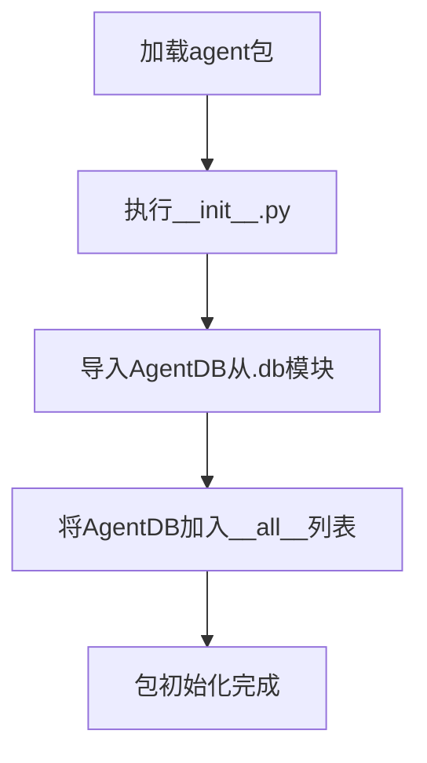

# `.\AutoGPT\classic\forge\forge\agent_protocol\database\__init__.py` 详细设计文档

该文件是agent包的初始化文件，通过从同目录下的db模块导入AgentDB类，并利用__all__列表声明公共接口，使得外部代码可以直接通过from agent import AgentDB使用该类。

## 整体流程



## 类结构

```
无本地类定义
└── AgentDB (由.db模块导入的类)
```

## 全局变量及字段


### `__all__`
    
定义模块的公共接口，指定使用 from module import * 时允许导入的属性

类型：`list[str]`
    


    

## 全局函数及方法


## 关键组件


### 一段话描述

该代码是一个Python模块的入口文件，通过相对导入从同目录下的`db`模块中引入`AgentDB`类，并将其添加到模块的公共接口列表`__all__`中，作为对外暴露的唯一导出对象。

### 文件的整体运行流程

该模块文件在Python导入时被加载执行。当其他模块通过`from . import AgentDB`或`from module_name import AgentDB`方式导入时，Python解释器会执行该文件中的导入语句，从`.db`模块中获取`AgentDB`类的引用。由于仅包含导入逻辑，该文件本身不包含任何可执行的业务流程或状态管理逻辑。

### 类的详细信息

由于该代码文件仅包含导入语句，未定义任何类或函数，因此不适用。

### 关键组件信息

### AgentDB

从`.db`模块导入的AgentDB类，根据模块命名规范推断，该类可能负责与数据库交互相关的功能，用于管理Agent实体的持久化数据操作，如创建、读取、更新、删除等CRUD操作。

### 潜在的技术债务或优化空间

1. **模块粒度问题**：该入口文件仅重导出了单一类，如果后续AgentDB功能扩展，可能需要考虑模块拆分或提供更多导出接口
2. **缺少文档字符串**：模块级别缺少模块级文档字符串来说明该模块的用途和AgentDB的业务场景
3. **类型注解缺失**：未使用`from __future__ import annotations`或类型注解来增强代码的可读性和IDE支持

### 其它项目

**设计目标与约束**：该文件遵循Python模块的`__all__`约定，明确控制公共API的暴露范围，符合Python社区的模块设计规范

**错误处理与异常设计**：由于仅包含导入语句，异常处理依赖于`.db`模块中AgentDB类的实现，导入失败时将抛出`ModuleNotFoundError`或`ImportError`

**数据流与状态机**：该文件不涉及数据流处理或状态管理，作为纯粹的接口导出层

**外部依赖与接口契约**：主要依赖`.db`模块中AgentDB类的接口定义，需要确保AgentDB类的API稳定性以保证兼容性


## 问题及建议


### 已知问题

- **过度简单的模块结构**：该文件仅作为 `AgentDB` 的重导出（re-export）入口，缺乏实际业务逻辑，功能完全依赖于 `db` 模块
- **无文档和类型注解**：缺少模块级文档字符串（docstring）和类型注解，降低了代码可读性和 IDE 智能提示支持
- **单一导出点**：仅导出 `AgentDB` 类，若后续需导出其他组件（如配置类、工具函数），需修改 `__all__` 列表
- **隐式依赖**：`AgentDB` 的可用性完全取决于 `db` 模块的内部实现，无抽象层保护

### 优化建议

- **添加模块文档**：在文件顶部添加模块级 docstring，说明该模块的职责和主要导出内容
- **引入类型注解**：添加显式的类型注解（如 `from .db import AgentDB as AgentDB` 可显式标注类型）
- **扩展导出列表**：若 `db` 模块中存在其他公共组件（如配置类、异常类），考虑一并导出并更新 `__all__`
- **添加异常处理**：若导入可能失败，可考虑在模块级别添加 try-except 包装，提供更友好的导入错误信息
- **考虑代理模式**：若后续需要添加代理逻辑或中间层，可将此处作为统一的导出入口，便于后续扩展


## 其它


### 设计目标与约束

本模块作为AgentDB的导出模块，提供统一的对外接口访问。其设计目标是简化AgentDB类的导入方式，遵循Python模块封装最佳实践，通过__all__明确导出接口。约束包括仅支持Python 3.x环境，需确保db模块存在且AgentDB类已正确定义。

### 错误处理与异常设计

本模块本身不涉及复杂业务逻辑，错误主要来源于导入阶段。若db模块不存在或AgentDB类未定义，会抛出ImportError或AttributeError。建议在导入处使用try-except包装，以便提供更友好的错误提示。调用方应处理可能的导入异常。

### 数据流与状态机

本模块为代理模块，不涉及数据流处理和状态机设计。数据流依赖于AgentDB类的具体实现，调用方通过导入的AgentDB类实例进行数据库操作。

### 外部依赖与接口契约

本模块依赖同包下的db模块，需确保项目结构中存在from .db import AgentDB的导入路径。接口契约为导出AgentDB类，调用方通过from agent_db_module import AgentDB方式导入使用，其中agent_db_module为本模块所在包名。

### 配置与初始化

本模块无特殊配置需求。初始化行为由AgentDB类本身决定，调用方需参考AgentDB的构造函数文档进行实例化。

### 安全性考虑

本模块为纯导入导出模块，无敏感数据处理。安全性依赖于AgentDB类的实现，需确保数据库连接凭证等敏感信息的妥善管理。

### 性能考量

本模块在导入时执行一次，引入微小的一次性开销。性能瓶颈主要在AgentDB类的数据库操作上，需根据具体实现进行优化。

### 测试策略

由于模块功能简单，主要测试聚焦于导入路径正确性和__all__导出完整性。可通过import测试验证模块可用性，单元测试由AgentDB类自身覆盖。

### 版本兼容性

本模块遵循标准Python模块规范，兼容Python 3.6及以上版本。需确保AgentDB类与Python版本兼容。

### 部署与运维

本模块作为项目内部模块，无独立部署需求。运维关注点在于保证db模块的可用性和AgentDB类的正常工作。

    