# `.\AutoGPT\classic\forge\forge\agent_protocol\database\db.py` 详细设计文档

这是一个基于SQLite和SQLAlchemy的Agent Protocol数据库实现，提供了对Task（任务）、Step（步骤）和Artifact（产物）的增删改查（CRUD）操作，并负责在数据库模型和领域模型之间进行转换。注意：代码中明确标注该实现仅用于开发目的，不建议用于生产环境。

## 整体流程

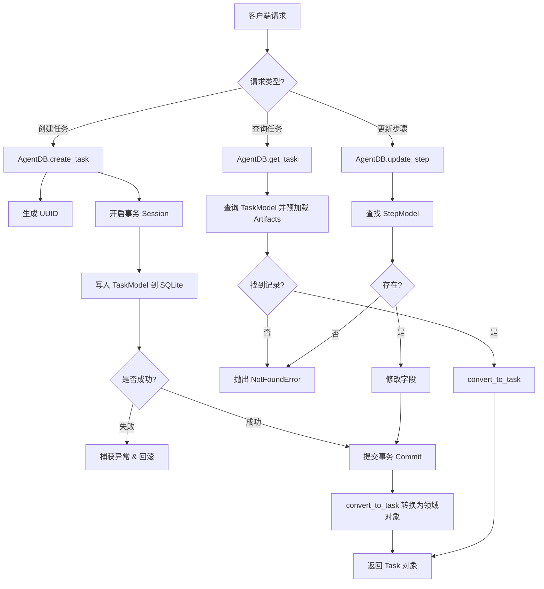

## 类结构

```
Base (SQLAlchemy DeclarativeBase)
├── TaskModel (ORM表: tasks)
│   └── Relationship: artifacts (1:N)
├── StepModel (ORM表: steps)
│   ├── Relationship: artifacts (1:N)
│   └── ForeignKey: task_id -> TaskModel
└── ArtifactModel (ORM表: artifacts)
    ├── ForeignKey: task_id -> TaskModel
    └── ForeignKey: step_id -> StepModel
---
AgentDB (业务逻辑层)
```

## 全局变量及字段


### `convert_to_task`
    
将TaskModel转换为Task领域对象

类型：`function`
    


### `convert_to_step`
    
将StepModel转换为Step领域对象

类型：`function`
    


### `convert_to_artifact`
    
将ArtifactModel转换为Artifact领域对象

类型：`function`
    


### `Base`
    
SQLAlchemy声明式基类，配置字典类型映射到JSON类型

类型：`class`
    


### `TaskModel.task_id`
    
任务唯一标识符，主键

类型：`str`
    


### `TaskModel.input`
    
任务输入内容

类型：`str`
    


### `TaskModel.additional_input`
    
任务的额外输入参数

类型：`dict[str, Any]`
    


### `TaskModel.created_at`
    
任务创建时间

类型：`datetime`
    


### `TaskModel.modified_at`
    
任务最后修改时间

类型：`datetime`
    


### `TaskModel.artifacts`
    
与任务关联的产物列表

类型：`relationship`
    


### `StepModel.step_id`
    
步骤唯一标识符，主键

类型：`str`
    


### `StepModel.task_id`
    
所属任务的外键引用

类型：`str`
    


### `StepModel.name`
    
步骤名称

类型：`str`
    


### `StepModel.input`
    
步骤输入内容

类型：`str`
    


### `StepModel.status`
    
步骤状态

类型：`str`
    


### `StepModel.output`
    
步骤输出内容

类型：`Optional[str]`
    


### `StepModel.is_last`
    
标记是否为任务最后一步

类型：`bool`
    


### `StepModel.created_at`
    
步骤创建时间

类型：`datetime`
    


### `StepModel.modified_at`
    
步骤最后修改时间

类型：`datetime`
    


### `StepModel.additional_input`
    
步骤的额外输入参数

类型：`dict[str, Any]`
    


### `StepModel.additional_output`
    
步骤的额外输出参数

类型：`Optional[dict[str, Any]]`
    


### `StepModel.artifacts`
    
与步骤关联的产物列表

类型：`relationship`
    


### `ArtifactModel.artifact_id`
    
产物唯一标识符，主键

类型：`str`
    


### `ArtifactModel.task_id`
    
所属任务的外键引用

类型：`str`
    


### `ArtifactModel.step_id`
    
可选的关联步骤外键

类型：`Optional[str]`
    


### `ArtifactModel.agent_created`
    
标记产物是否由Agent创建

类型：`bool`
    


### `ArtifactModel.file_name`
    
产物文件名

类型：`str`
    


### `ArtifactModel.relative_path`
    
产物相对路径

类型：`str`
    


### `ArtifactModel.created_at`
    
产物创建时间

类型：`datetime`
    


### `ArtifactModel.modified_at`
    
产物最后修改时间

类型：`datetime`
    


### `ArtifactModel.step`
    
反向关联到StepModel

类型：`relationship`
    


### `ArtifactModel.task`
    
反向关联到TaskModel

类型：`relationship`
    


### `AgentDB.engine`
    
数据库连接引擎

类型：`SQLAlchemy Engine`
    


### `AgentDB.Session`
    
数据库会话工厂

类型：`sessionmaker`
    


### `AgentDB.debug_enabled`
    
调试模式开关，控制日志输出

类型：`bool`
    
    

## 全局函数及方法


### `convert_to_task`

将数据库模型 `TaskModel` 转换为领域模型 `Task`，用于将持久层的任务数据映射到业务层使用的对象。

参数：

- `task_obj`：`TaskModel`，SQLAlchemy ORM 模型，包含从数据库查询到的任务数据
- `debug_enabled`：`bool`，可选参数，默认值为 `False`，控制是否输出调试日志

返回值：`Task`，领域模型，表示业务层使用的任务对象

#### 流程图

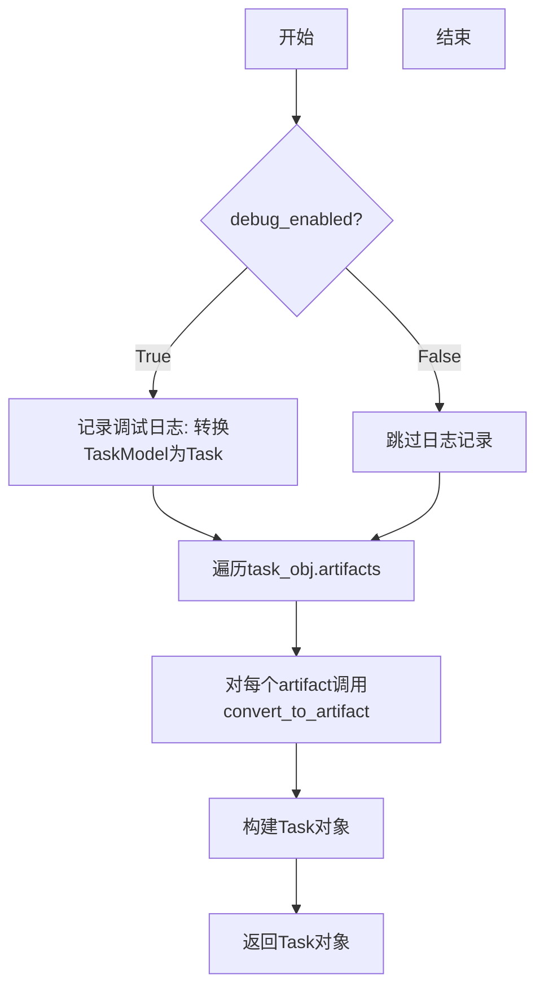

#### 带注释源码

```python
def convert_to_task(task_obj: TaskModel, debug_enabled: bool = False) -> Task:
    """
    将数据库模型 TaskModel 转换为领域模型 Task
    
    参数:
        task_obj: SQLAlchemy ORM 模型，对应数据库中的 tasks 表
        debug_enabled: 是否启用调试日志，默认 False
    
    返回:
        Task: 领域模型对象，用于业务层
    """
    # 如果启用调试模式，记录转换开始
    if debug_enabled:
        logger.debug(f"Converting TaskModel to Task for task_id: {task_obj.task_id}")
    
    # 将关联的 ArtifactModel 列表转换为 Artifact 领域模型列表
    # 这里使用了列表推导式，调用 convert_to_artifact 逐个转换
    task_artifacts = [convert_to_artifact(artifact) for artifact in task_obj.artifacts]
    
    # 构建并返回 Task 领域模型对象
    # 将 TaskModel 的属性映射到 Task 的属性
    return Task(
        task_id=task_obj.task_id,              # 任务唯一标识
        created_at=task_obj.created_at,        # 创建时间
        modified_at=task_obj.modified_at,      # 修改时间
        input=task_obj.input,                  # 任务输入
        additional_input=task_obj.additional_input,  # 额外输入参数
        artifacts=task_artifacts,              # 关联的产物列表
    )
```


### `convert_to_step`

该函数是一个数据转换（Mapper）函数，负责将数据库持久化层的数据模型（`StepModel`）转换为应用领域层的数据模型（`Step`）。它处理了状态字符串到枚举的映射、布尔值的处理以及关联数据（制品）的递归转换。

参数：

-  `step_model`：`StepModel`，数据库 ORM 模型实例，包含从 SQLite 数据库查询出的原始数据。
-  `debug_enabled`：`bool`，可选参数，默认为 False。用于控制是否输出详细的调试日志。

返回值：`Step`，领域业务模型。返回一个封装好的领域对象，用于上层业务逻辑调用，与数据库结构解耦。

#### 流程图

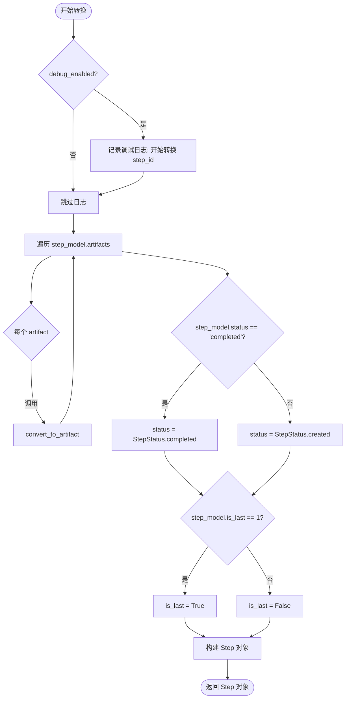

#### 带注释源码

```python
def convert_to_step(step_model: StepModel, debug_enabled: bool = False) -> Step:
    """
    将数据库模型 StepModel 转换为领域模型 Step。
    
    参数:
        step_model (StepModel): 来自数据库的 ORM 对象。
        debug_enabled (bool): 是否打印调试日志。
    
    返回:
        Step: 转换后的领域模型对象。
    """
    # 1. 调试日志：如果开启了调试模式，记录当前正在转换的步骤ID，便于追踪问题。
    if debug_enabled:
        logger.debug(f"Converting StepModel to Step for step_id: {step_model.step_id}")
    
    # 2. 关联数据转换：遍历该步骤关联的制品（ArtifactModel）列表，
    #    使用 convert_to_artifact 函数将每个数据库模型转换为领域模型。
    step_artifacts = [
        convert_to_artifact(artifact) for artifact in step_model.artifacts
    ]
    
    # 3. 状态映射：数据库中存储的是字符串状态（如 "completed", "created"），
    #    需要根据业务逻辑映射为强类型的 StepStatus 枚举。
    status = (
        StepStatus.completed if step_model.status == "completed" else StepStatus.created
    )
    
    # 4. 构建返回对象：构造领域模型 Step。
    #    注意：is_last 在 SQLite 中通常存储为整型 (0 或 1)，因此需要与 1 进行比较来获取布尔值。
    return Step(
        task_id=step_model.task_id,
        step_id=step_model.step_id,
        created_at=step_model.created_at,
        modified_at=step_model.modified_at,
        name=step_model.name,
        input=step_model.input,
        status=status,
        output=step_model.output,
        artifacts=step_artifacts,
        is_last=step_model.is_last == 1,
        additional_input=step_model.additional_input,
        additional_output=step_model.additional_output,
    )
```


### `convert_to_artifact`

将数据库模型 `ArtifactModel` 转换为领域对象 `Artifact` 的转换函数，用于解耦数据库持久化层与应用领域层。

参数：

- `artifact_model`：`ArtifactModel`，从数据库查询获得的工件持久化模型对象

返回值：`Artifact`，转换后的应用领域层工件对象

#### 流程图

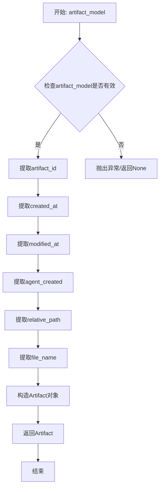

#### 带注释源码

```python
def convert_to_artifact(artifact_model: ArtifactModel) -> Artifact:
    """
    将数据库模型 ArtifactModel 转换为领域对象 Artifact
    
    参数:
        artifact_model: ArtifactModel - 从数据库查询获得的工件持久化模型对象
        
    返回值:
        Artifact - 转换后的应用领域层工件对象
    """
    # 直接将模型属性映射到领域对象的构造参数
    # 这是一个简单的属性复制转换，不包含复杂的业务逻辑
    return Artifact(
        artifact_id=artifact_model.artifact_id,      # 工件唯一标识符
        created_at=artifact_model.created_at,        # 工件创建时间戳
        modified_at=artifact_model.modified_at,      # 工件最后修改时间戳
        agent_created=artifact_model.agent_created,  # 标识是否由Agent创建
        relative_path=artifact_model.relative_path,  # 相对路径
        file_name=artifact_model.file_name,          # 文件名
    )
```


### `AgentDB.close`

关闭数据库连接，释放 SQLAlchemy 会话和引擎资源。

参数：

- 无（除隐含的 `self` 参数）

返回值：`None`，无返回值描述，仅执行清理操作无结果返回。

#### 流程图

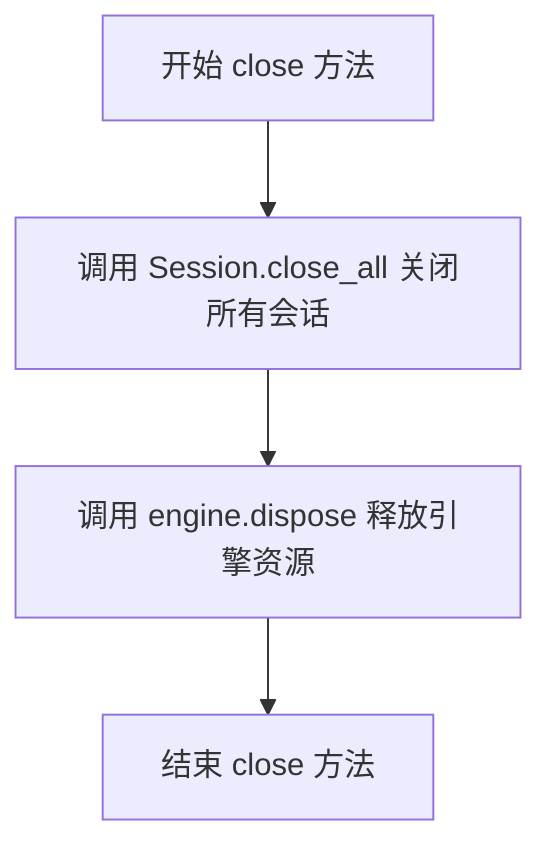

#### 带注释源码

```python
def close(self) -> None:
    """
    关闭数据库连接并释放所有相关资源。
    
    该方法执行两个关键操作：
    1. 关闭所有由 sessionmaker 创建的会话连接
    2. 释放 SQLAlchemy 引擎持有的所有数据库连接池资源
    """
    # 关闭所有已创建的会话，确保未提交的事务被回滚
    self.Session.close_all()
    
    # 释放引擎持有的连接池，关闭所有底层数据库连接
    self.engine.dispose()
```


### `AgentDB.create_task`

该方法用于在数据库中创建一个新的任务记录。它接收任务输入和可选的额外输入参数，生成唯一的任务ID，并将任务持久化到SQLite数据库中，最终返回转换后的Task对象。

**参数：**

- `input`：`Optional[str]`，任务的输入内容，描述任务的主要输入数据
- `additional_input`：`Optional[dict]`，可选的额外输入参数，以字典形式存储任务的其他输入信息，默认为空字典

**返回值：** `Task`，返回创建成功后的任务对象，包含任务ID、创建时间、输入内容等信息

#### 流程图

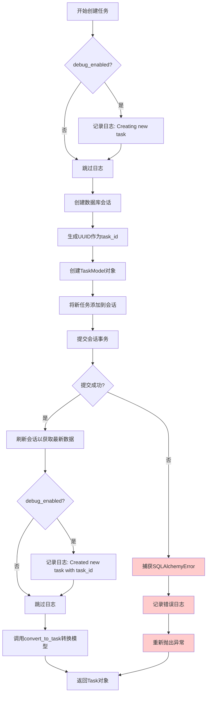

#### 带注释源码

```python
async def create_task(
    self, input: Optional[str], additional_input: Optional[dict] = {}
) -> Task:
    """
    在数据库中创建新任务
    
    参数:
        input: 任务的输入内容
        additional_input: 额外的输入参数，默认为空字典
    
    返回:
        Task: 创建成功的任务对象
    """
    # 如果启用了调试模式，记录开始创建任务的日志
    if self.debug_enabled:
        logger.debug("Creating new task")

    try:
        # 创建新的数据库会话
        with self.Session() as session:
            # 创建新的任务模型对象
            new_task = TaskModel(
                task_id=str(uuid.uuid4()),  # 生成唯一的UUID作为任务ID
                input=input,  # 设置任务输入
                additional_input=additional_input if additional_input else {},  # 处理额外的输入参数
            )
            # 将新任务添加到会话中（暂存）
            session.add(new_task)
            # 提交事务，将更改持久化到数据库
            session.commit()
            # 刷新会话以获取数据库生成的值（如自增ID）
            session.refresh(new_task)
            
            # 如果启用了调试模式，记录创建成功的日志
            if self.debug_enabled:
                logger.debug(f"Created new task with task_id: {new_task.task_id}")
            
            # 将ORM模型转换为领域模型并返回
            return convert_to_task(new_task, self.debug_enabled)
    
    # 捕获SQLAlchemy相关的数据库错误
    except SQLAlchemyError as e:
        logger.error(f"SQLAlchemy error while creating task: {e}")
        raise  # 重新抛出异常，让上层调用者处理
    
    # 捕获其他未知异常
    except Exception as e:
        logger.error(f"Unexpected error while creating task: {e}")
        raise  # 重新抛出异常
```


### `AgentDB.create_step`

该方法用于在数据库中创建一个新的步骤（Step）记录。它接收任务ID、步骤请求体、可选的最后一个步骤标志和额外的输入数据，生成唯一的步骤ID，将步骤信息存储到SQLite数据库中，并返回转换后的Step对象。

参数：

- `task_id`：`str`，关联的任务ID
- `input`：`StepRequestBody`，步骤的输入数据
- `is_last`：`bool`，可选参数，表示是否为当前任务的最后一个步骤，默认为False
- `additional_input`：`Optional[Dict[str, Any]]`，可选参数，额外的输入数据字典，默认为空字典

返回值：`Step`，创建的步骤对象，包含步骤ID、任务ID、名称、输入、状态等信息

#### 流程图

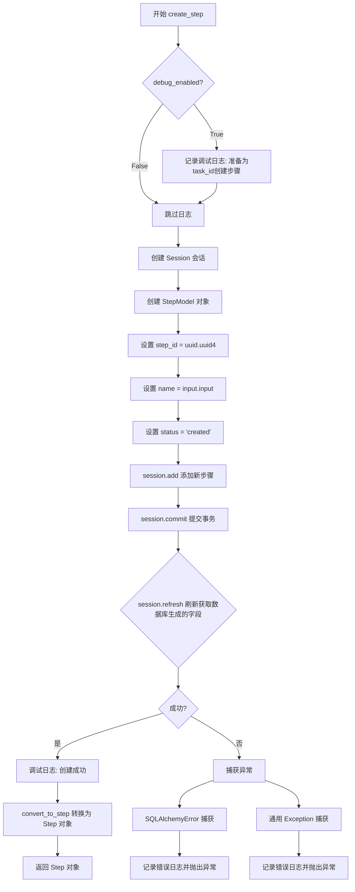

#### 带注释源码

```python
async def create_step(
    self,
    task_id: str,
    input: StepRequestBody,
    is_last: bool = False,
    additional_input: Optional[Dict[str, Any]] = {},
) -> Step:
    """
    在数据库中创建新的步骤记录
    
    参数:
        task_id: 关联的任务ID
        input: 步骤请求体，包含步骤输入数据
        is_last: 可选参数，标记是否为最后一个步骤
        additional_input: 可选参数，额外的输入数据字典
    
    返回:
        Step: 创建的步骤对象
    
    异常:
        SQLAlchemyError: 数据库操作失败时抛出
        Exception: 其他未知错误时抛出
    """
    # 如果启用调试模式，记录创建步骤的日志
    if self.debug_enabled:
        logger.debug(f"Creating new step for task_id: {task_id}")
    
    try:
        # 创建数据库会话
        with self.Session() as session:
            # 创建新的步骤模型对象
            new_step = StepModel(
                task_id=task_id,                    # 关联的任务ID
                step_id=str(uuid.uuid4()),         # 生成唯一的步骤ID
                name=input.input,                  # 步骤名称（使用输入内容）
                input=input.input,                 # 步骤输入数据
                status="created",                  # 初始状态为"created"
                is_last=is_last,                   # 是否为最后一个步骤
                additional_input=additional_input, # 额外的输入数据
            )
            # 将新步骤添加到会话
            session.add(new_step)
            # 提交事务，保存到数据库
            session.commit()
            # 刷新对象以获取数据库生成的字段（如自增ID、时间戳等）
            session.refresh(new_step)
            
            # 如果启用调试模式，记录成功创建步骤的日志
            if self.debug_enabled:
                logger.debug(f"Created new step with step_id: {new_step.step_id}")
            
            # 将 StepModel 转换为 Step 对象并返回
            return convert_to_step(new_step, self.debug_enabled)
    
    # 捕获 SQLAlchemy 数据库错误
    except SQLAlchemyError as e:
        logger.error(f"SQLAlchemy error while creating step: {e}")
        raise
    # 捕获其他未知异常
    except Exception as e:
        logger.error(f"Unexpected error while creating step: {e}")
        raise
```


### `AgentDB.create_artifact`

创建或获取一个 Artifact 对象。如果指定的 task_id、file_name 和 relative_path 的组合已存在，则返回现有 artifact；否则创建新的 artifact 并返回。

参数：

- `task_id`：`str`，关联的任务ID，指定artifact属于哪个任务
- `file_name`：`str`，artifact的文件名
- `relative_path`：`str`，artifact的相对路径
- `agent_created`：`bool`，可选，默认为 False，表示artifact是否由agent创建
- `step_id`：`str | None`，可选，默认为 None，关联的步骤ID

返回值：`Artifact`，返回创建的或已存在的 Artifact 对象

#### 流程图

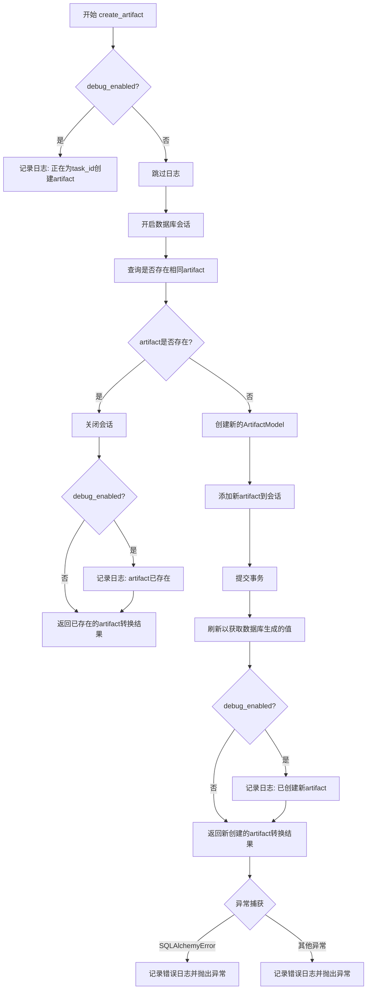

#### 带注释源码

```python
async def create_artifact(
    self,
    task_id: str,
    file_name: str,
    relative_path: str,
    agent_created: bool = False,
    step_id: str | None = None,
) -> Artifact:
    """
    创建或获取一个 Artifact 对象。
    
    如果指定的 task_id、file_name 和 relative_path 的组合已存在，
    则返回现有 artifact；否则创建新的 artifact 并返回。
    
    参数:
        task_id: 关联的任务ID
        file_name: artifact的文件名
        relative_path: artifact的相对路径
        agent_created: 是否由agent创建，默认为False
        step_id: 关联的步骤ID，可选
    
    返回:
        Artifact: 创建的或已存在的 Artifact 对象
    """
    # 如果启用调试模式，记录日志
    if self.debug_enabled:
        logger.debug(f"Creating new artifact for task_id: {task_id}")
    
    try:
        # 开启数据库会话
        with self.Session() as session:
            # 查询是否已存在相同的artifact（根据task_id, file_name, relative_path）
            if (
                existing_artifact := session.query(ArtifactModel)
                .filter_by(
                    task_id=task_id,
                    file_name=file_name,
                    relative_path=relative_path,
                )
                .first()
            ):
                # 如果已存在，关闭会话并返回已存在的artifact
                session.close()
                if self.debug_enabled:
                    logger.debug(
                        f"Artifact {file_name} already exists at {relative_path}/"
                    )
                return convert_to_artifact(existing_artifact)

            # 如果不存在，创建新的ArtifactModel实例
            new_artifact = ArtifactModel(
                artifact_id=str(uuid.uuid4()),  # 生成唯一的artifact ID
                task_id=task_id,                  # 关联任务ID
                step_id=step_id,                  # 关联步骤ID（可选）
                agent_created=agent_created,      # 是否由agent创建
                file_name=file_name,              # 文件名
                relative_path=relative_path,       # 相对路径
            )
            # 添加到会话并提交事务
            session.add(new_artifact)
            session.commit()
            # 刷新以获取数据库生成的值（如时间戳）
            session.refresh(new_artifact)
            
            if self.debug_enabled:
                logger.debug(
                    f"Created new artifact with ID: {new_artifact.artifact_id}"
                )
            # 返回转换后的Artifact对象
            return convert_to_artifact(new_artifact)
    
    # 捕获SQLAlchemy相关异常
    except SQLAlchemyError as e:
        logger.error(f"SQLAlchemy error while creating step: {e}")
        raise
    # 捕获其他意外异常
    except Exception as e:
        logger.error(f"Unexpected error while creating step: {e}")
        raise
```


### `AgentDB.get_task`

获取指定任务ID的任务对象，如果未找到则抛出 `NotFoundError` 异常。

参数：

- `task_id`：`str`，任务唯一标识符

返回值：`Task`，返回找到的任务对象，如果任务不存在则抛出 `NotFoundError` 异常

#### 流程图

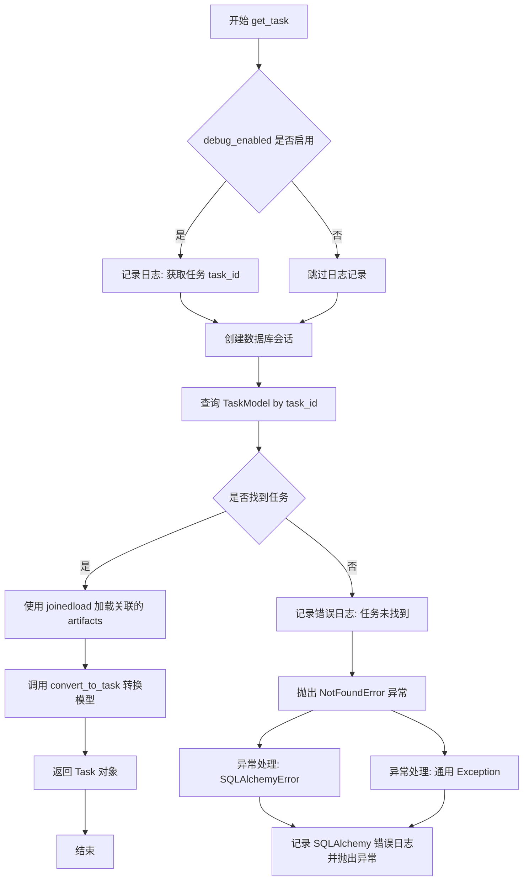

#### 带注释源码

```python
async def get_task(self, task_id: str) -> Task:
    """Get a task by its id"""
    # 如果调试模式启用，记录获取任务的日志
    if self.debug_enabled:
        logger.debug(f"Getting task with task_id: {task_id}")
    try:
        # 使用上下文管理器创建数据库会话，确保会话正确关闭
        with self.Session() as session:
            # 查询任务模型，使用 joinedload 预加载关联的 artifacts 避免 N+1 查询问题
            if task_obj := (
                session.query(TaskModel)
                .options(joinedload(TaskModel.artifacts))
                .filter_by(task_id=task_id)
                .first()
            ):
                # 找到任务，将其转换为 Task 对象并返回
                return convert_to_task(task_obj, self.debug_enabled)
            else:
                # 未找到任务，记录错误日志
                logger.error(f"Task not found with task_id: {task_id}")
                # 抛出 NotFoundError 异常
                raise NotFoundError("Task not found")
    # 捕获 SQLAlchemy 数据库异常
    except SQLAlchemyError as e:
        logger.error(f"SQLAlchemy error while getting task: {e}")
        raise
    # 捕获其他未知异常
    except Exception as e:
        logger.error(f"Unexpected error while getting task: {e}")
        raise
```


### `AgentDB.get_step`

获取指定任务下的特定步骤详情

参数：

- `task_id`：`str`，任务的唯一标识符
- `step_id`：`str`，步骤的唯一标识符

返回值：`Step`，检索到的步骤对象，如果未找到则抛出 `NotFoundError`

#### 流程图

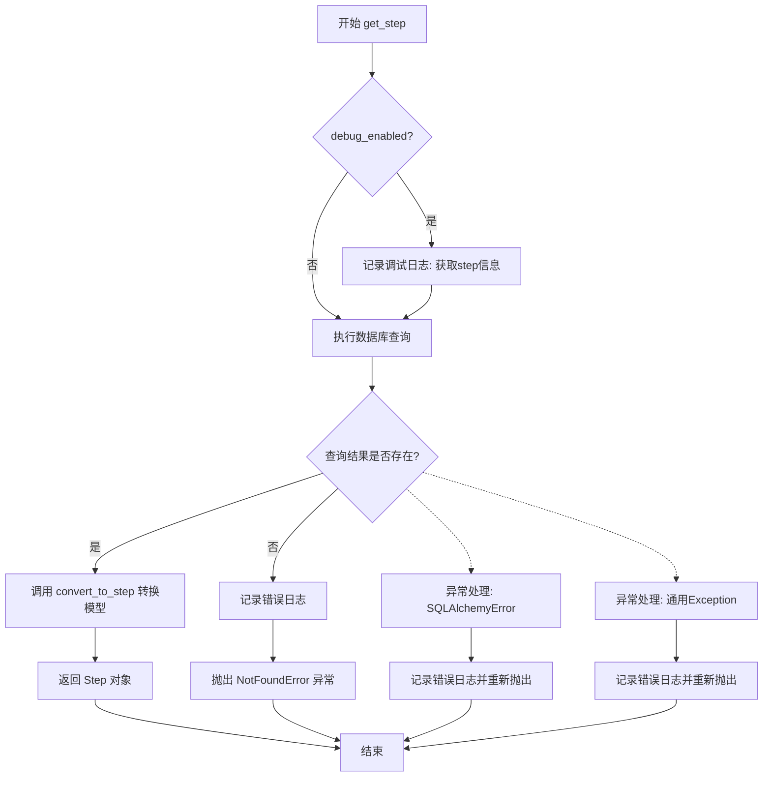

#### 带注释源码

```python
async def get_step(self, task_id: str, step_id: str) -> Step:
    """
    获取指定任务下的特定步骤详情
    
    参数:
        task_id: 任务的唯一标识符
        step_id: 步骤的唯一标识符
    
    返回:
        Step: 检索到的步骤对象
    
    异常:
        NotFoundError: 当步骤不存在时抛出
        SQLAlchemyError: 数据库操作异常
    """
    # 如果启用调试模式，记录获取步骤的日志
    if self.debug_enabled:
        logger.debug(f"Getting step with task_id: {task_id} and step_id: {step_id}")
    
    try:
        # 创建数据库会话
        with self.Session() as session:
            # 使用 joinedload 预加载关联的 artifacts，避免 N+1 查询问题
            if step := (
                session.query(StepModel)
                .options(joinedload(StepModel.artifacts))
                .filter(StepModel.step_id == step_id)
                .first()
            ):
                # 将 StepModel 转换为业务模型 Step 并返回
                return convert_to_step(step, self.debug_enabled)

            else:
                # 步骤不存在，记录错误日志并抛出 NotFoundError
                logger.error(
                    f"Step not found with task_id: {task_id} and step_id: {step_id}"
                )
                raise NotFoundError("Step not found")
    
    # 捕获 SQLAlchemy 数据库异常
    except SQLAlchemyError as e:
        logger.error(f"SQLAlchemy error while getting step: {e}")
        raise
    
    # 捕获其他未知异常
    except Exception as e:
        logger.error(f"Unexpected error while getting step: {e}")
        raise
```


### `AgentDB.get_artifact`

该方法用于从数据库中根据artifact_id获取特定的Artifact对象，支持调试模式日志记录，并通过异常处理机制确保错误能够被正确传播。

参数：

- `artifact_id`：`str`，要获取的Artifact的唯一标识符

返回值：`Artifact`，返回找到的Artifact领域对象，如果未找到则抛出`NotFoundError`异常

#### 流程图

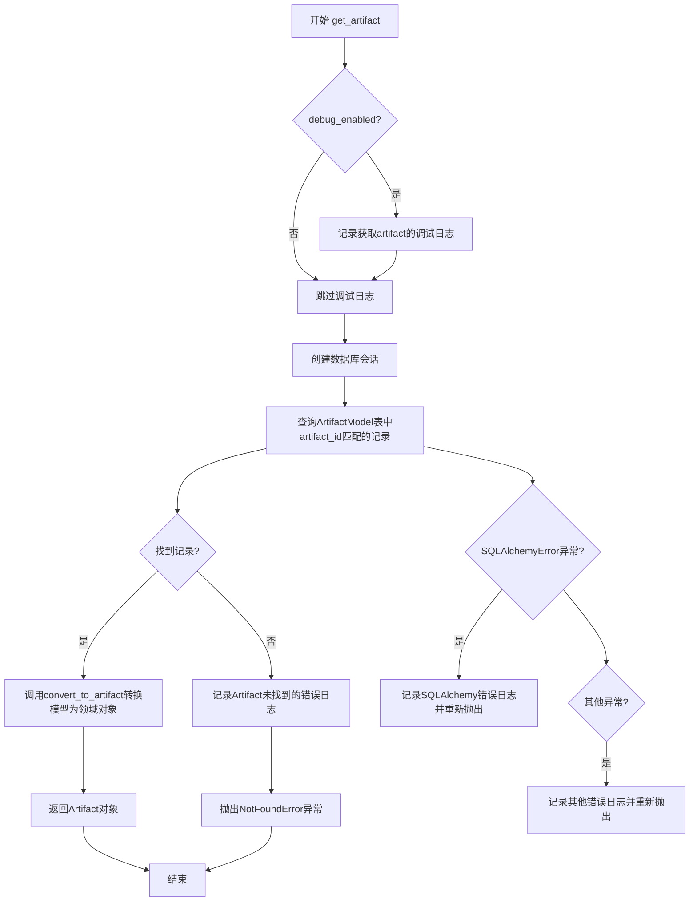

#### 带注释源码

```python
async def get_artifact(self, artifact_id: str) -> Artifact:
    """
    根据artifact_id从数据库获取Artifact对象
    
    参数:
        artifact_id: str, 要获取的Artifact的唯一标识符
    
    返回:
        Artifact: 返回找到的Artifact领域对象
    
    异常:
        NotFoundError: 当指定artifact_id的Artifact不存在时抛出
        SQLAlchemyError: 数据库操作发生错误时抛出
    """
    # 如果启用调试模式，记录获取artifact的日志
    if self.debug_enabled:
        logger.debug(f"Getting artifact with and artifact_id: {artifact_id}")
    
    try:
        # 创建数据库会话
        with self.Session() as session:
            # 查询数据库中匹配artifact_id的ArtifactModel记录
            if (
                artifact_model := session.query(ArtifactModel)
                .filter_by(artifact_id=artifact_id)
                .first()
            ):
                # 找到记录，将其转换为Artifact领域对象并返回
                return convert_to_artifact(artifact_model)
            else:
                # 未找到对应记录，记录错误日志并抛出NotFoundError
                logger.error(
                    f"Artifact not found with and artifact_id: {artifact_id}"
                )
                raise NotFoundError("Artifact not found")
    except SQLAlchemyError as e:
        # 捕获SQLAlchemy相关数据库错误，记录日志并重新抛出
        logger.error(f"SQLAlchemy error while getting artifact: {e}")
        raise
    except Exception as e:
        # 捕获其他未知异常，记录日志并重新抛出
        logger.error(f"Unexpected error while getting artifact: {e}")
        raise
```


### `AgentDB.update_step`

该方法用于更新指定任务下的步骤信息，支持更新步骤的状态、输出、额外输入和额外输出。方法首先查询目标步骤是否存在，然后根据传入的参数更新对应字段，提交事务后返回更新后的步骤对象。如果步骤不存在则抛出 `NotFoundError`，数据库操作异常会被捕获并重新抛出。

参数：

- `task_id`：`str`，任务 ID，用于定位步骤所属的任务
- `step_id`：`str`，步骤 ID，用于定位需要更新的步骤
- `status`：`Optional[str]`，可选参数，步骤的新状态（如 "completed"、"created" 等）
- `output`：`Optional[str]`，可选参数，步骤的执行输出结果
- `additional_input`：`Optional[Dict[str, Any]]`，可选参数，步骤的额外输入数据
- `additional_output`：`Optional[Dict[str, Any]]`，可选参数，步骤的额外输出数据

返回值：`Step`，返回更新后的 Step 对象，包含更新后的所有字段值

#### 流程图

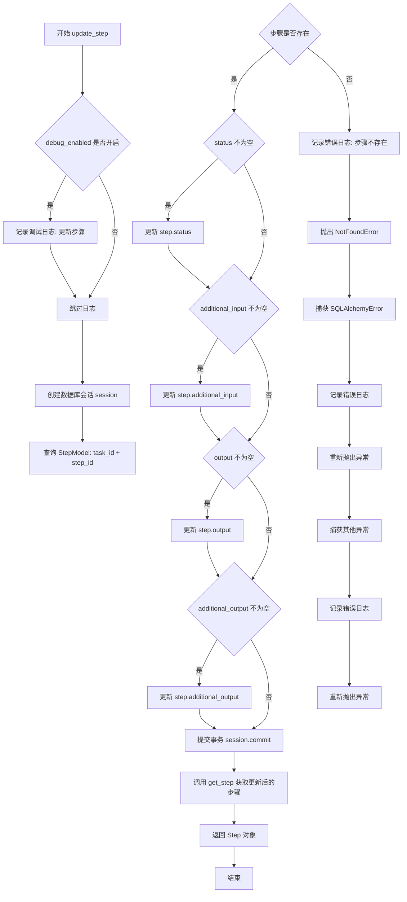

#### 带注释源码

```python
async def update_step(
    self,
    task_id: str,
    step_id: str,
    status: Optional[str] = None,
    output: Optional[str] = None,
    additional_input: Optional[Dict[str, Any]] = None,
    additional_output: Optional[Dict[str, Any]] = None,
) -> Step:
    """
    更新指定任务下的步骤信息
    
    参数:
        task_id: 任务ID，用于定位步骤所属的任务
        step_id: 步骤ID，用于定位需要更新的步骤
        status: 可选，新的步骤状态
        output: 可选，步骤的执行输出
        additional_input: 可选，额外的输入数据
        additional_output: 可选，额外的输出数据
    
    返回:
        Step: 更新后的步骤对象
    
    异常:
        NotFoundError: 当步骤不存在时抛出
        SQLAlchemyError: 数据库操作失败时抛出
    """
    # 如果开启了调试模式，记录更新步骤的日志
    if self.debug_enabled:
        logger.debug(
            f"Updating step with task_id: {task_id} and step_id: {step_id}"
        )
    
    try:
        # 创建数据库会话
        with self.Session() as session:
            # 查询目标步骤是否存在
            if (
                step := session.query(StepModel)
                .filter_by(task_id=task_id, step_id=step_id)
                .first()
            ):
                # 根据传入的参数更新对应的字段
                if status is not None:
                    step.status = status
                if additional_input is not None:
                    step.additional_input = additional_input
                if output is not None:
                    step.output = output
                if additional_output is not None:
                    step.additional_output = additional_output
                
                # 提交事务保存更改
                session.commit()
                
                # 返回更新后的步骤对象
                return await self.get_step(task_id, step_id)
            else:
                # 步骤不存在，记录错误日志并抛出异常
                logger.error(
                    "Can't update non-existent Step with "
                    f"task_id: {task_id} and step_id: {step_id}"
                )
                raise NotFoundError("Step not found")
    
    # 捕获 SQLAlchemy 数据库相关异常
    except SQLAlchemyError as e:
        logger.error(f"SQLAlchemy error while getting step: {e}")
        raise
    
    # 捕获其他未知异常
    except Exception as e:
        logger.error(f"Unexpected error while getting step: {e}")
        raise
```


### `AgentDB.update_artifact`

该方法用于更新指定 ID 的工件（Artifact）的属性信息，包括文件名、相对路径和是否由代理创建。它通过查询数据库中的 `ArtifactModel` 记录，根据传入的参数更新相应字段，提交更改后返回更新后的工件对象。如果未找到对应 ID 的工件，则抛出 `NotFoundError` 异常。

参数：

- `artifact_id`：`str`，工件的唯标识符，用于定位需要更新的工件记录
- `file_name`：`str`（关键字参数，默认值为 `""`），可选参数，用于更新工件的名称
- `relative_path`：`str`（关键字参数，默认值为 `""`），可选参数，用于更新工件的相对路径
- `agent_created`：`Optional[Literal[True]]`（关键字参数，默认值为 `None`），可选参数，用于标记该工件是否由代理创建

返回值：`Artifact`，返回更新后的工件对象

#### 流程图

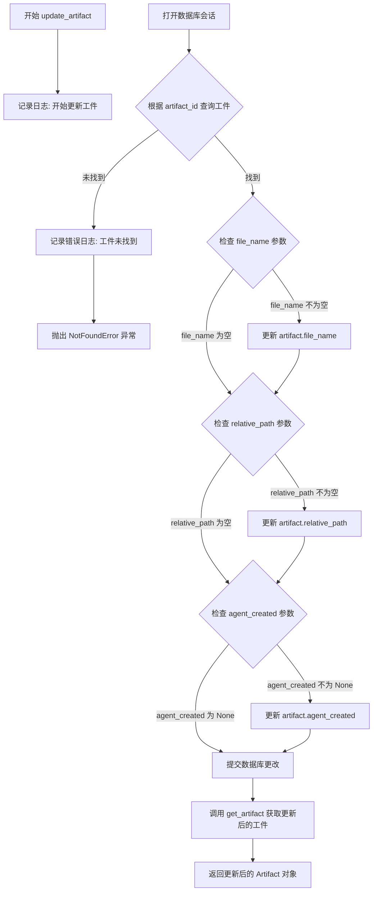

#### 带注释源码

```python
async def update_artifact(
    self,
    artifact_id: str,
    *,
    file_name: str = "",
    relative_path: str = "",
    agent_created: Optional[Literal[True]] = None,
) -> Artifact:
    """
    更新指定 artifact 的属性信息
    
    参数:
        artifact_id: 工件的唯一标识符
        file_name: 新的文件名（可选，关键字参数）
        relative_path: 新的相对路径（可选，关键字参数）
        agent_created: 是否由代理创建（可选，关键字参数，仅接受 True）
    
    返回:
        更新后的 Artifact 对象
    
    异常:
        NotFoundError: 当指定的 artifact_id 不存在时抛出
    """
    # 记录调试日志，标识开始更新操作
    logger.debug(f"Updating artifact with artifact_id: {artifact_id}")
    
    # 创建数据库会话上下文
    with self.Session() as session:
        # 查询指定 artifact_id 的工件记录
        if (
            artifact := session.query(ArtifactModel)
            .filter_by(artifact_id=artifact_id)
            .first()
        ):
            # 如果传入了 file_name 且不为空，则更新文件名
            if file_name:
                artifact.file_name = file_name
            
            # 如果传入了 relative_path 且不为空，则更新相对路径
            if relative_path:
                artifact.relative_path = relative_path
            
            # 如果传入了 agent_created（不为 None），则更新代理创建标记
            if agent_created:
                artifact.agent_created = agent_created
            
            # 提交所有更改到数据库
            session.commit()
            
            # 调用 get_artifact 方法获取更新后的工件并返回
            return await self.get_artifact(artifact_id)
        else:
            # 未找到对应工件，记录错误日志
            logger.error(f"Artifact not found with artifact_id: {artifact_id}")
            
            # 抛出自定义 NotFoundError 异常
            raise NotFoundError("Artifact not found")
```


### `AgentDB.list_tasks`

获取任务列表，支持分页查询，返回任务列表和分页信息。

参数：

- `page`：`int`，页码，默认为1
- `per_page`：`int`，每页返回的任务数量，默认为10

返回值：`Tuple[List[Task], Pagination]`，返回转换后的任务对象列表和分页信息对象

#### 流程图

```mermaid
flowchart TD
    A([开始]) --> B{debug_enabled?}
    B -->|是| C[记录日志: "Listing tasks"]
    B -->|否| D[跳过日志]
    C --> E[开始 try 块]
    D --> E
    E --> F[创建数据库会话]
    F --> G[查询 TaskModel 列表<br/>offset = (page - 1) * per_page<br/>limit = per_page]
    G --> H[查询 TaskModel 总数]
    H --> I[计算总页数: math.ceil(total / per_page)]
    I --> J[创建 Pagination 对象<br/>total_items, total_pages, current_page, page_size]
    J --> K[遍历 tasks 列表<br/>调用 convert_to_task 转换每个任务]
    K --> L[返回 (task_list, pagination)]
    L --> M([结束])
    
    E --> N{发生 SQLAlchemyError?}
    N -->|是| O[记录错误日志<br/>抛出异常]
    O --> P([异常结束])
    N --> Q{发生其他异常?}
    Q -->|是| R[记录错误日志<br/>抛出异常]
    R --> P
    
    style C fill:#f9f,stroke:#333
    style O fill:#f96,stroke:#333
    style R fill:#f96,stroke:#333
```

#### 带注释源码

```python
async def list_tasks(
    self, page: int = 1, per_page: int = 10
) -> Tuple[List[Task], Pagination]:
    """获取任务列表，支持分页
    
    参数:
        page: 页码，从1开始，默认为1
        per_page: 每页返回的任务数量，默认为10
    
    返回:
        Tuple[List[Task], Pagination]: 任务列表和分页信息
    """
    # 如果启用调试模式，记录日志
    if self.debug_enabled:
        logger.debug("Listing tasks")
    
    try:
        # 创建数据库会话
        with self.Session() as session:
            # 查询任务列表，使用分页参数
            tasks = (
                session.query(TaskModel)
                .offset((page - 1) * per_page)  # 计算偏移量
                .limit(per_page)                # 限制返回数量
                .all()
            )
            
            # 查询任务总数
            total = session.query(TaskModel).count()
            
            # 计算总页数
            pages = math.ceil(total / per_page)
            
            # 创建分页对象
            pagination = Pagination(
                total_items=total,        # 总记录数
                total_pages=pages,        # 总页数
                current_page=page,        # 当前页
                page_size=per_page,       # 每页大小
            )
            
            # 将 TaskModel 转换为 Task 对象并返回
            return [
                convert_to_task(task, self.debug_enabled) for task in tasks
            ], pagination
    
    # 捕获 SQLAlchemy 数据库异常
    except SQLAlchemyError as e:
        logger.error(f"SQLAlchemy error while listing tasks: {e}")
        raise
    
    # 捕获其他未知异常
    except Exception as e:
        logger.error(f"Unexpected error while listing tasks: {e}")
        raise
```


### `AgentDB.list_steps`

该方法用于根据指定的 `task_id` 分页查询对应的步骤列表，并返回步骤对象集合及分页信息。

参数：

- `task_id`：`str`，任务ID，用于过滤属于该任务的步骤
- `page`：`int`，分页页码，默认为 1
- `per_page`：`int`，每页返回的记录数，默认为 10

返回值：`Tuple[List[Step], Pagination]`，包含步骤对象列表和分页信息

#### 流程图

```mermaid
flowchart TD
    A[开始 list_steps] --> B{debug_enabled?}
    B -->|是| C[记录日志: 列出任务task_id的步骤]
    B -->|否| D[跳过日志]
    C --> D
    D --> E[打开数据库会话 Session]
    E --> F[查询 StepModel - filter_by task_id]
    F --> G[应用分页: offset 和 limit]
    G --> H[执行查询获取步骤列表 steps]
    H --> I[统计满足条件的总步骤数 total]
    I --> J[计算总页数: math.ceil]
    J --> K[构建 Pagination 对象]
    K --> L[遍历 steps 列表，调用 convert_to_step 转换为 Step 对象]
    L --> M[返回 Tuple[List[Step], Pagination]]
    
    E --> N{异常处理?}
    N -->|SQLAlchemyError| O[记录错误日志并抛出异常]
    N -->|Exception| P[记录错误日志并抛出异常]
    O --> Q[结束]
    P --> Q
    M --> Q
```

#### 带注释源码

```python
async def list_steps(
    self, task_id: str, page: int = 1, per_page: int = 10
) -> Tuple[List[Step], Pagination]:
    """
    根据 task_id 分页查询步骤列表
    
    参数:
        task_id: 任务ID，用于过滤步骤
        page: 分页页码，默认为1
        per_page: 每页记录数，默认为10
        
    返回:
        Tuple[List[Step], Pagination]: 步骤列表和分页信息
    """
    # 如果开启调试模式，记录日志
    if self.debug_enabled:
        logger.debug(f"Listing steps for task_id: {task_id}")
    
    try:
        # 使用 SQLAlchemy 会话执行数据库查询
        with self.Session() as session:
            # 查询指定 task_id 的步骤，支持分页
            steps = (
                session.query(StepModel)
                .filter_by(task_id=task_id)          # 按 task_id 过滤
                .offset((page - 1) * per_page)      # 计算偏移量实现分页
                .limit(per_page)                     # 限制每页返回数量
                .all()                               # 获取所有匹配的步骤
            )
            
            # 统计满足条件的总步骤数
            total = session.query(StepModel).filter_by(task_id=task_id).count()
            
            # 计算总页数
            pages = math.ceil(total / per_page)
            
            # 构建分页对象
            pagination = Pagination(
                total_items=total,        # 总记录数
                total_pages=pages,        # 总页数
                current_page=page,        # 当前页码
                page_size=per_page,       # 每页大小
            )
            
            # 将 StepModel 列表转换为 Step 对象列表
            return [
                convert_to_step(step, self.debug_enabled) for step in steps
            ], pagination
            
    except SQLAlchemyError as e:
        # 捕获 SQLAlchemy 相关异常，记录错误日志并重新抛出
        logger.error(f"SQLAlchemy error while listing steps: {e}")
        raise
    except Exception as e:
        # 捕获其他未知异常，记录错误日志并重新抛出
        logger.error(f"Unexpected error while listing steps: {e}")
        raise
```


### `AgentDB.list_artifacts`

该方法用于根据指定的 `task_id` 分页查询对应的工件列表，并返回工件集合以及分页信息。

参数：

- `task_id`：`str`，用于过滤只返回属于该任务的工件
- `page`：`int`，分页的页码，默认为 1
- `per_page`：`int`，每页返回的工件数量，默认为 10

返回值：`Tuple[List[Artifact], Pagination]`，返回包含 Artifact 对象列表的元组，以及分页元数据

#### 流程图

```mermaid
flowchart TD
    A[开始 list_artifacts] --> B{debug_enabled?}
    B -->|是| C[记录日志: 列出 task_id 对应的工件]
    B -->|否| D[跳过日志记录]
    C --> D
    D --> E[打开数据库会话]
    E --> F[查询 ArtifactModel]
    F --> G[按 task_id 过滤]
    G --> H[使用 offset 和 limit 分页]
    H --> I[获取所有匹配的工件]
    J[统计总数] --> K[计算总页数]
    K --> L[构建 Pagination 对象]
    I --> M[将每个 ArtifactModel 转换为 Artifact 对象]
    L --> N[返回 (List[Artifact], Pagination) 元组]
    M --> N
    N --> O{是否发生异常?}
    O -->|SQLAlchemyError| P[记录 SQLAlchemy 错误日志并抛出异常]
    O -->|Exception| Q[记录通用错误日志并抛出异常]
    O -->|无异常| R[结束]
```

#### 带注释源码

```python
async def list_artifacts(
    self, task_id: str, page: int = 1, per_page: int = 10
) -> Tuple[List[Artifact], Pagination]:
    """
    根据 task_id 分页查询工件列表
    
    参数:
        task_id: str - 工件所属的任务ID，用于过滤结果
        page: int - 页码，默认为1
        per_page: int - 每页数量，默认为10
    
    返回:
        Tuple[List[Artifact], Pagination] - 工件列表和分页信息
    """
    # 如果启用调试模式，记录查询日志
    if self.debug_enabled:
        logger.debug(f"Listing artifacts for task_id: {task_id}")
    
    try:
        # 创建数据库会话
        with self.Session() as session:
            # 查询属于指定 task_id 的工件，并应用分页
            artifacts = (
                session.query(ArtifactModel)
                .filter_by(task_id=task_id)          # 按 task_id 过滤
                .offset((page - 1) * per_page)       # 计算偏移量实现分页
                .limit(per_page)                      # 限制每页返回数量
                .all()                                # 获取所有匹配的记录
            )
            
            # 统计满足条件的工件总数
            total = session.query(ArtifactModel).filter_by(task_id=task_id).count()
            
            # 计算总页数
            pages = math.ceil(total / per_page)
            
            # 构建分页元数据对象
            pagination = Pagination(
                total_items=total,      # 总记录数
                total_pages=pages,     # 总页数
                current_page=page,     # 当前页码
                page_size=per_page,    # 每页大小
            )
            
            # 将 ORM 模型转换为业务对象并返回
            return [
                convert_to_artifact(artifact) for artifact in artifacts
            ], pagination
            
    # 捕获数据库操作异常
    except SQLAlchemyError as e:
        logger.error(f"SQLAlchemy error while listing artifacts: {e}")
        raise
    # 捕获其他未知异常
    except Exception as e:
        logger.error(f"Unexpected error while listing artifacts: {e}")
        raise
```

## 关键组件


### TaskModel

任务数据库模型，对应SQLite中的tasks表，存储任务的ID、输入、额外输入、创建时间和修改时间，与ArtifactModel存在一对多关系。

### StepModel

步骤数据库模型，对应SQLite中的steps表，存储步骤的ID、所属任务ID、名称、输入、状态、输出、是否为最后一步、创建时间和修改时间，与ArtifactModel存在一对多关系。

### ArtifactModel

产物数据库模型，对应SQLite中的artifacts表，存储产物的ID、所属任务ID、所属步骤ID、是否由Agent创建、文件名、相对路径、创建时间和修改时间，与TaskModel和StepModel存在多对一关系。

### AgentDB

主数据库操作类，负责管理SQLite数据库连接和所有CRUD操作。提供任务、步骤、产物的创建、查询、更新和列表功能，支持分页和调试模式。

### convert_to_task

将TaskModel转换为Task领域模型的全局函数，接收TaskModel对象和调试标志参数，返回Task对象，同时转换关联的ArtifactModel列表。

### convert_to_step

将StepModel转换为Step领域模型的全局函数，接收StepModel对象和调试标志参数，返回Step对象，同时转换关联的ArtifactModel列表。

### convert_to_artifact

将ArtifactModel转换为Artifact领域模型的全局函数，接收ArtifactModel对象参数，返回Artifact对象。

### create_task

AgentDB类的异步方法，用于创建新任务。接收可选的输入字符串和额外输入字典，生成唯一任务ID，保存到数据库并返回转换后的Task对象。

### create_step

AgentDB类的异步方法，用于为指定任务创建新步骤。接收任务ID、StepRequestBody对象、是否为最后一步标记和额外输入参数，生成唯一步骤ID并保存到数据库。

### create_artifact

AgentDB类的异步方法，用于创建新产物。接收任务ID、文件名、相对路径、Agent创建标志和可选步骤ID参数，支持检查重复产物功能。

### get_task

AgentDB类的异步方法，根据任务ID查询任务。使用joinedload预加载关联的ArtifactModel对象，如果未找到则抛出NotFoundError异常。

### get_step

AgentDB类的异步方法，根据任务ID和步骤ID查询步骤。使用joinedload预加载关联的ArtifactModel对象，如果未找到则抛出NotFoundError异常。

### get_artifact

AgentDB类的异步方法，根据产物ID查询产物，如果未找到则抛出NotFoundError异常。

### update_step

AgentDB类的异步方法，用于更新步骤的状态、输出、额外输入和额外输出。接收任务ID、步骤ID和多个可选参数，更新后返回更新后的Step对象。

### update_artifact

AgentDB类的异步方法，用于更新产物的文件名、相对路径和Agent创建标志。接收产物ID和多个可选命名参数，更新后返回更新后的Artifact对象。

### list_tasks

AgentDB类的异步方法，用于分页列出任务。接收页码和每页数量参数，返回Task对象列表和Pagination分页信息对象。

### list_steps

AgentDB类的异步方法，用于分页列出指定任务的步骤。接收任务ID、页码和每页数量参数，返回Step对象列表和Pagination分页信息对象。

### list_artifacts

AgentDB类的异步方法，用于分页列出指定任务的产物。接收任务ID、页码和每页数量参数，返回Artifact对象列表和Pagination分页信息对象。

### Base (DeclarativeBase)

SQLAlchemy声明性基类，定义了字典类型到JSON类型的映射，用于支持JSON类型字段的存储。


## 问题及建议


### 已知问题

-   **异步/同步混用问题**：类方法声明为 `async`（如 `async def create_task`），但内部使用同步的 SQLAlchemy 操作（`session.commit()`, `session.query()`），这会阻塞事件循环，不符合异步编程最佳实践
-   **可变默认参数陷阱**：`create_task`、`create_step` 等方法中使用 `additional_input: Optional[dict] = {}`，这是 Python 中常见的不良实践，会导致默认参数在调用间共享
-   **错误处理不一致**：`update_artifact` 方法缺少 `try-except` 块，而其他方法都有完整的异常处理；且多处日志信息与实际操作的上下文不符（如在 `update_step` 的异常处理中记录"while getting step"）
-   **数据库会话管理不当**：`close()` 方法调用 `Session.close_all()`，但正确的做法是对每个 `Session` 实例调用 `close()`
-   **类型比较问题**：`StepModel.is_last` 定义为 `Boolean` 类型，但转换函数中使用 `step_model.is_last == 1` 进行整数比较，在不同数据库后端可能不可靠
-   **重复代码模式**：`list_tasks`、`list_steps`、`list_artifacts` 方法中分页逻辑几乎完全重复，未提取为通用方法
-   **N+1 查询风险**：虽然使用了 `joinedload` 加载关联的 artifacts，但在 `list_steps` 等方法中未对关联数据进行预加载，可能导致 N+1 查询问题
-   **调试标志实现不优雅**：通过 `debug_enabled` 参数在每个方法中传递调试开关，增加了方法签名的复杂性
-   **缺失数据库索引**：虽然 `task_id` 和 `step_id` 有索引，但对于经常查询的字段（如 `StepModel.status`、`ArtifactModel.task_id`）缺少复合索引

### 优化建议

-   将所有数据库操作改为真正的异步实现，使用 `sqlalchemy.ext.asyncio` 的 `AsyncSession` 和 `async_sessionmaker`，或移除方法前的 `async` 关键字改为同步调用
-   将所有可变默认参数 `{}` 改为 `None`，在方法内部进行默认值处理
-   统一所有方法的错误处理逻辑，修正日志信息确保与实际操作一致
-   提取公共的分页查询逻辑为独立方法（如 `_paginate_query`），减少代码重复
-   在需要频繁关联查询的列表方法中添加 `joinedload` 或 `selectinload`
-   考虑使用 Python 标准库的日志配置或结构化日志框架，替代手动传递的 `debug_enabled` 标志
-   根据实际查询需求添加适当的数据库索引，如 `(task_id, status)` 的复合索引
-   在 `update_artifact` 方法中添加缺失的异常处理逻辑

## 其它


### 设计目标与约束

本模块旨在为Agent Protocol提供一个轻量级、开发用的SQLite数据库实现，用于存储任务、步骤和产物数据。设计约束包括：仅适用于开发/测试环境，不推荐用于生产环境；使用SQLite作为存储后端；通过SQLAlchemy ORM实现数据库操作；支持基本的CRUD操作及分页查询。

### 错误处理与异常设计

本模块采用分层异常处理策略：1) 数据库层面使用SQLAlchemyError捕获SQL操作异常；2) 业务层面使用自定义NotFoundError处理资源不存在情况；3) 通用异常捕获确保所有错误均被记录。所有数据库操作均使用try-except块包装，错误发生时记录日志并向上抛出，由调用方决定最终处理方式。

### 数据流与状态机

Task状态流转：created → processing → completed/failed
Step状态流转：created → submitted → completed/failed
Artifact无显式状态机，仅通过agent_created布尔字段区分人工创建和Agent生成。数据流向：外部请求 → AgentDB方法 → Session事务 → ORM模型 → SQLite数据库

### 外部依赖与接口契约

核心依赖包括：sqlalchemy（ORM框架）、sqlite3（数据库驱动）、forge.utils.exceptions.NotFoundError（自定义异常）、..models模块（Task/Step/Artifact/Pagination领域模型）。接口契约：所有方法返回领域模型对象而非数据库模型；分页方法返回元组(列表, Pagination)；创建类方法接受可选参数并返回新创建对象。

### 事务管理策略

每个数据库操作使用独立的Session上下文管理器（with self.Session() as session），确保操作完成后自动提交或回滚。事务边界与方法级别一致，不支持跨方法的长事务。session.commit()在操作成功后显式调用，异常发生时自动回滚。

### 并发与线程安全性

SQLite本身对并发写入支持有限，高并发场景下可能出现数据库锁。本模块未实现连接池锁或重试机制，在多线程环境下需谨慎使用。建议生产环境使用PostgreSQL等支持并发的数据库。

### 安全性考虑

当前实现未对输入进行SQL注入防护（依赖SQLAlchemy参数化查询）；未实现用户认证与授权机制；数据库文件本身无加密保护。敏感数据存储需额外加密层。

### 性能优化空间

1) 可添加数据库索引优化查询（如task_id、step_id、artifact_id）；2) 分页查询使用COUNT(*)而非SELECT COUNT(*)提高性能；3) 大数据量场景考虑添加缓存层；4) 批量操作可使用bulk_insert_mappings提升效率。

### 测试策略建议

建议补充单元测试覆盖：1) 各模型CRUD操作；2) 分页逻辑正确性；3) 异常场景（资源不存在、数据库错误）；4) 并发场景压力测试；5) 转换函数边界条件测试。

### 配置与部署说明

数据库连接字符串格式：sqlite:///database_name，可通过AgentDB构造函数传入。初始化时自动创建所有表（Base.metadata.create_all），部署时需确保数据库文件目录可写。

### 监控与可观测性

当前实现使用Python标准logging模块记录debug/info/error级别日志。建议生产环境添加：1) 数据库连接池监控；2) 慢查询日志；3) 关键指标（创建/查询/更新操作计数）采集。

### 数据迁移策略

使用SQLAlchemy的Alembic进行数据库版本管理。当前模型变更需手动处理：1) 修改模型类；2) 生成迁移脚本；3) 执行升级。建议在生产环境部署前建立完整的迁移流程。

    