# `.\AutoGPT\classic\forge\forge\agent_protocol\database\db_test.py` 详细设计文档

This file contains pytest-based integration tests for the AgentDB database layer, verifying CRUD operations for Tasks, Steps, and Artifacts, as well as schema validation and conversion functions between database models and domain models.

## 整体流程

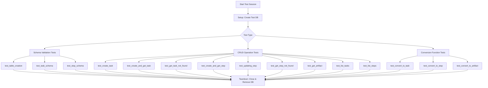

## 类结构

```
Test Module (test_db.py)
├── Fixtures
│   ├── agent_db (AgentDB instance)
│   └── raw_db_connection (sqlite3 Connection)
├── Schema Tests
│   ├── test_table_creation
│   ├── test_task_schema
│   └── test_step_schema
├── Conversion Tests
test_convert_to_task
test_convert_to_step
test_convert_to_artifact
└── CRUD Tests
    ├── test_create_task
    ├── test_create_and_get_task
    ├── test_get_task_not_found
    ├── test_create_and_get_step
    ├── test_updating_step
    ├── test_get_step_not_found
    ├── test_get_artifact
    ├── test_list_tasks
    └── test_list_steps
```

## 全局变量及字段


### `TEST_DB_FILENAME`
    
测试数据库文件名，用于SQLite测试数据库的持久化

类型：`str`
    


### `TEST_DB_URL`
    
测试数据库的SQLite连接URL，格式为sqlite:///test_db.sqlite3

类型：`str`
    


    

## 全局函数及方法


### `test_table_creation`

该测试函数用于验证 SQLite 数据库中是否正确创建了三个核心表（tasks、steps、artifacts），通过直接查询数据库系统表来确认表的存在性。

参数：

- `raw_db_connection`：`sqlite3.Connection`，提供对 SQLite 数据库的直接连接，用于执行 SQL 查询以验证表结构

返回值：`None`，测试函数无返回值，通过 pytest 的断言机制验证结果

#### 流程图

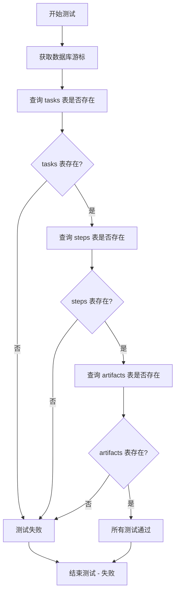

#### 带注释源码

```python
def test_table_creation(raw_db_connection: sqlite3.Connection):
    """
    测试函数：验证数据库中是否创建了所需的核心表
    
    参数:
        raw_db_connection: sqlite3.Connection - 数据库连接对象
    """
    # 获取数据库游标，用于执行 SQL 语句
    cursor = raw_db_connection.cursor()

    # 测试 tasks 表是否存在
    # 使用 SQLite 系统表 sqlite_master 查询表名
    cursor.execute("SELECT name FROM sqlite_master WHERE type='table' AND name='tasks'")
    # 断言 tasks 表必须存在
    assert cursor.fetchone() is not None

    # 测试 steps 表是否存在
    cursor.execute("SELECT name FROM sqlite_master WHERE type='table' AND name='steps'")
    # 断言 steps 表必须存在
    assert cursor.fetchone() is not None

    # 测试 artifacts 表是否存在
    cursor.execute(
        "SELECT name FROM sqlite_master WHERE type='table' AND name='artifacts'"
    )
    # 断言 artifacts 表必须存在
    assert cursor.fetchone() is not None
```


### `test_task_schema`

该测试函数用于验证 `Task` 模型的数据结构是否正确，包括任务 ID、输入内容以及工件列表的初始化和属性值。

参数：
- 无参数

返回值：`None`，该函数为测试函数，通过 `assert` 语句进行断言验证，不返回具体值。

#### 流程图

```mermaid
flowchart TD
    A[开始测试] --> B[创建 datetime 对象 now]
    B --> C[实例化 Task 对象]
    C --> D[设置 task_id 为 '50da533e-3904-4401-8a07-c49adf88b5eb']
    D --> E[设置 input 为 'Write the words you receive to the file output.txt.']
    E --> F[创建 Artifact 对象并添加到 artifacts 列表]
    F --> G[断言 task.task_id == '50da533e-3904-4401-8a07-c49adf88b5eb']
    G --> H[断言 task.input == 'Write the words you receive to the file output.txt.']
    H --> I[断言 len(task.artifacts) == 1]
    I --> J[断言 task.artifacts[0].artifact_id == 'b225e278-8b4c-4f99-a696-8facf19f0e56']
    J --> K[测试结束]
```

#### 带注释源码

```python
@pytest.mark.asyncio
async def test_task_schema():
    """测试 Task 模型的数据结构是否正确"""
    # 获取当前时间戳，用于设置创建和修改时间
    now = datetime.now()
    
    # 创建 Task 对象，包含完整的任务信息
    task = Task(
        task_id="50da533e-3904-4401-8a07-c49adf88b5eb",  # 任务唯一标识符
        input="Write the words you receive to the file 'output.txt'.",  # 任务输入指令
        created_at=now,  # 任务创建时间
        modified_at=now,  # 任务最后修改时间
        artifacts=[  # 任务关联的工件列表
            Artifact(
                artifact_id="b225e278-8b4c-4f99-a696-8facf19f0e56",  # 工件唯一标识符
                agent_created=True,  # 标记是否由 Agent 创建
                file_name="main.py",  # 工件文件名
                relative_path="python/code/",  # 工件相对路径
                created_at=now,  # 工件创建时间
                modified_at=now,  # 工件修改时间
            )
        ],
    )
    
    # 验证任务 ID 是否正确
    assert task.task_id == "50da533e-3904-4401-8a07-c49adf88b5eb"
    
    # 验证任务输入内容是否正确
    assert task.input == "Write the words you receive to the file 'output.txt'."
    
    # 验证工件列表长度是否为 1
    assert len(task.artifacts) == 1
    
    # 验证第一个工件的 ID 是否正确
    assert task.artifacts[0].artifact_id == "b225e278-8b4c-4f99-a696-8facf19f0e56"
```


### `test_step_schema`

该测试函数用于验证 `Step` 模型的属性和数据结构是否正确，包括任务 ID、步骤 ID、名称、状态、输出以及关联的产物等信息。

参数： 无

返回值： `None`，该函数为测试函数，不返回任何值，仅通过断言验证数据模型的正确性

#### 流程图

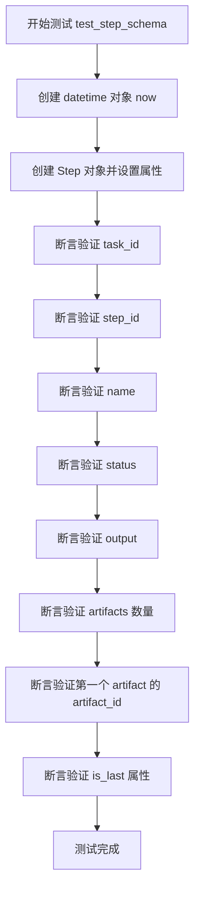

#### 带注释源码

```python
@pytest.mark.asyncio
async def test_step_schema():
    """
    测试 Step 模型的数据结构和属性是否正确
    
    该测试创建一个完整的 Step 对象，并验证其所有属性
    是否与预期值匹配，包括基本属性、关联的 Artifact 以及布尔标志
    """
    # 获取当前时间戳，用于设置创建和修改时间
    now = datetime.now()
    
    # 创建 Step 对象，包含完整的属性信息
    step = Step(
        task_id="50da533e-3904-4401-8a07-c49adf88b5eb",  # 关联的任务ID
        step_id="6bb1801a-fd80-45e8-899a-4dd723cc602e",  # 步骤唯一标识
        created_at=now,   # 创建时间
        modified_at=now,  # 修改时间
        name="Write to file",  # 步骤名称
        input="Write the words you receive to the file 'output.txt'.",  # 输入内容
        status=StepStatus.created,  # 步骤状态
        output=(  # 输出内容，包含执行的命令信息
            "I am going to use the write_to_file command and write Washington "
            "to a file called output.txt <write_to_file('output.txt', 'Washington')>"
        ),
        artifacts=[  # 关联的产物列表
            Artifact(
                artifact_id="b225e278-8b4c-4f99-a696-8facf19f0e56",  # 产物ID
                file_name="main.py",  # 文件名
                relative_path="python/code/",  # 相对路径
                created_at=now,  # 创建时间
                modified_at=now,  # 修改时间
                agent_created=True,  # 是否由代理创建
            )
        ],
        is_last=False,  # 是否为最后一步
    )
    
    # ========== 以下为断言验证部分 ==========
    
    # 验证任务ID正确
    assert step.task_id == "50da533e-3904-4401-8a07-c49adf88b5eb"
    
    # 验证步骤ID正确
    assert step.step_id == "6bb1801a-fd80-45e8-899a-4dd723cc602e"
    
    # 验证步骤名称正确
    assert step.name == "Write to file"
    
    # 验证步骤状态正确
    assert step.status == StepStatus.created
    
    # 验证输出内容正确
    assert step.output == (
        "I am going to use the write_to_file command and write Washington "
        "to a file called output.txt <write_to_file('output.txt', 'Washington')>"
    )
    
    # 验证产物列表长度为1
    assert len(step.artifacts) == 1
    
    # 验证第一个产物的ID正确
    assert step.artifacts[0].artifact_id == "b225e278-8b4c-4f99-a696-8facf19f0e56"
    
    # 验证 is_last 标志为 False
    assert step.is_last is False
```


### `test_convert_to_task`

这是一个异步测试函数，用于验证 `convert_to_task` 函数能够正确地将数据库模型 `TaskModel` 转换为领域模型 `Task`。

参数：
- 该测试函数没有显式参数（使用 pytest fixture `agent_db` 但未在此函数中直接使用）

返回值：
- 该测试函数没有返回值（返回类型为 `None`），通过 pytest 断言验证转换结果的正确性

#### 流程图

```mermaid
flowchart TD
    A[开始测试] --> B[创建 datetime 对象 now]
    B --> C[创建 TaskModel 实例]
    C --> D[包含 task_id, input, artifacts 等字段]
    D --> E[调用 convert_to_task 函数]
    E --> F{转换是否成功}
    F -->|是| G[验证 task.task_id]
    G --> H[验证 task.input]
    H --> I[验证 task.artifacts 数量]
    I --> J[验证 task.artifacts[0].artifact_id]
    J --> K[测试通过]
    F -->|否| L[测试失败]
```

#### 带注释源码

```python
@pytest.mark.asyncio
async def test_convert_to_task():
    """
    测试 convert_to_task 函数将 TaskModel 转换为 Task 的功能
    """
    # 创建当前时间戳，用于填充模型的时间字段
    now = datetime.now()
    
    # 构建 TaskModel 对象，模拟从数据库查询到的任务数据
    task_model = TaskModel(
        task_id="50da533e-3904-4401-8a07-c49adf88b5eb",  # 任务的唯一标识符
        created_at=now,                                  # 任务创建时间
        modified_at=now,                                 # 任务最后修改时间
        input="Write the words you receive to the file 'output.txt'.",  # 任务输入指令
        additional_input={},                             # 额外的输入参数（空字典）
        artifacts=[
            # 任务关联的产物列表
            ArtifactModel(
                artifact_id="b225e278-8b4c-4f99-a696-8facf19f0e56",  # 产物唯一标识
                created_at=now,                                       # 产物创建时间
                modified_at=now,                                      # 产物修改时间
                relative_path="file:///path/to/main.py",              # 产物相对路径
                agent_created=True,                                   # 是否由 Agent 创建
                file_name="main.py",                                   # 文件名
            )
        ],
    )
    
    # 调用 convert_to_task 函数，将 TaskModel 转换为 Task
    task = convert_to_task(task_model)
    
    # 断言验证转换结果的正确性
    assert task.task_id == "50da533e-3904-4401-8a07-c49adf88b5eb"  # 验证任务 ID
    assert task.input == "Write the words you receive to the file 'output.txt'."  # 验证任务输入
    assert len(task.artifacts) == 1  # 验证产物列表长度为 1
    assert task.artifacts[0].artifact_id == "b225e278-8b4c-4f99-a696-8facf19f0e56"  # 验证产物 ID
```


### `test_convert_to_step`

这是一个测试函数，用于验证 `convert_to_step` 函数能否正确将数据库模型 `StepModel` 转换为领域模型 `Step`。

参数： 无

返回值： 无（测试函数，通过断言验证转换结果）

#### 流程图

```mermaid
flowchart TD
    A[开始测试 test_convert_to_step] --> B[创建 datetime 对象 now]
    B --> C[创建 StepModel 对象 step_model]
    C --> D[设置 step_model 属性]
    D --> E{task_id: 50da533e-3904-4401-8a07-c49adf88b5eb}
    E --> F{call convert_to_step step_model}
    F --> G[调用 convert_to_step 函数]
    G --> H[获取返回的 Step 对象]
    H --> I[断言验证 step.task_id]
    I --> J[断言验证 step.step_id]
    J --> K[断言验证 step.name]
    K --> L[断言验证 step.status]
    L --> M[断言验证 step.artifacts 长度]
    M --> N[断言验证 step.artifacts[0].artifact_id]
    N --> O[断言验证 step.is_last]
    O --> P[所有断言通过]
```

#### 带注释源码

```python
@pytest.mark.asyncio
async def test_convert_to_step():
    """测试 convert_to_step 函数将 StepModel 转换为 Step 对象的功能"""
    
    # 创建当前时间戳，用于测试数据
    now = datetime.now()
    
    # 构建 StepModel 对象，模拟从数据库获取的原始数据
    step_model = StepModel(
        task_id="50da533e-3904-4401-8a07-c49adf88b5eb",  # 关联的任务ID
        step_id="6bb1801a-fd80-45e8-899a-4dd723cc602e",  # 步骤唯一标识
        created_at=now,           # 创建时间
        modified_at=now,          # 修改时间
        name="Write to file",      # 步骤名称
        status="created",          # 步骤状态（字符串形式）
        input="Write the words you receive to the file 'output.txt'.",
        additional_input={},       # 额外的输入参数
        artifacts=[
            ArtifactModel(
                artifact_id="b225e278-8b4c-4f99-a696-8facf19f0e56",
                created_at=now,
                modified_at=now,
                relative_path="file:///path/to/main.py",
                agent_created=True,
                file_name="main.py",
            )
        ],
        is_last=False,  # 标记是否为最后一个步骤
    )
    
    # 调用 convert_to_step 函数，将数据库模型转换为领域模型
    step = convert_to_step(step_model)
    
    # 验证转换后的 Step 对象属性是否正确
    assert step.task_id == "50da533e-3904-4401-8a07-c49adf88b5eb"
    assert step.step_id == "6bb1801a-fd80-45e8-899a-4dd723cc602e"
    assert step.name == "Write to file"
    assert step.status == StepStatus.created  # 验证状态被正确转换为枚举类型
    assert len(step.artifacts) == 1
    assert step.artifacts[0].artifact_id == "b225e278-8b4c-4f99-a696-8facf19f0e56"
    assert step.is_last is False
```


### `test_convert_to_artifact`

这是一个异步测试函数，用于验证 `convert_to_artifact` 函数是否正确将 `ArtifactModel` 数据模型转换为 `Artifact` 对象。测试通过创建包含特定属性的 `ArtifactModel` 实例，调用转换函数，然后断言转换结果的关键字段（artifact_id、relative_path、agent_created）与原始模型保持一致。

参数： 无（测试函数本身无需显式参数，使用测试 fixture `agent_db` 作为依赖）

返回值：无返回值（异步测试函数，测试结果通过 pytest 断言验证）

#### 流程图

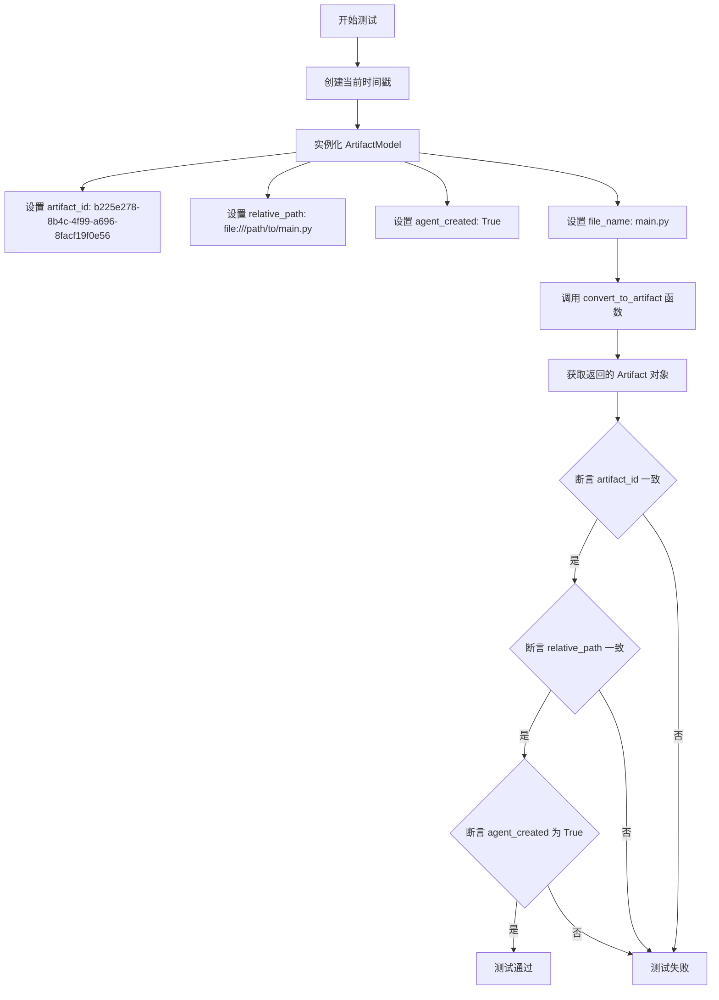

#### 带注释源码

```python
@pytest.mark.asyncio  # 标记为异步测试函数，由 pytest-asyncio 插件执行
async def test_convert_to_artifact():
    """
    测试 convert_to_artifact 函数的转换逻辑
    
    验证 ArtifactModel 对象能正确转换为 Artifact 对象，
    并保留关键字段的值
    """
    # 获取当前时间戳，用于创建时间相关字段
    now = datetime.now()
    
    # 创建测试用的 ArtifactModel 数据模型实例
    # 包含完整的工件属性信息
    artifact_model = ArtifactModel(
        artifact_id="b225e278-8b4c-4f99-a696-8facf19f0e56",  # 工件唯一标识符
        created_at=now,        # 创建时间
        modified_at=now,       # 修改时间
        relative_path="file:///path/to/main.py",  # 工件相对路径
        agent_created=True,   # 标记是否由 Agent 创建
        file_name="main.py",   # 文件名
    )
    
    # 调用被测试的转换函数，将数据模型转换为业务对象
    artifact = convert_to_artifact(artifact_model)
    
    # 断言验证转换结果的 artifact_id 与原始模型一致
    assert artifact.artifact_id == "b225e278-8b4c-4f99-a696-8facf19f0e56"
    
    # 断言验证转换结果的 relative_path 与原始模型一致
    assert artifact.relative_path == "file:///path/to/main.py"
    
    # 断言验证转换结果的 agent_created 标记与原始模型一致
    assert artifact.agent_created is True
```


### `test_create_task`

这是一个异步测试函数，用于验证 `AgentDB` 类的 `create_task` 方法能否正确创建任务并返回包含正确输入内容的 Task 对象。

参数：

- `agent_db`：`AgentDB`，通过 pytest fixture 提供的数据库实例，用于执行数据库操作

返回值：`None`，该测试函数通过断言验证功能，不返回显式值

#### 流程图

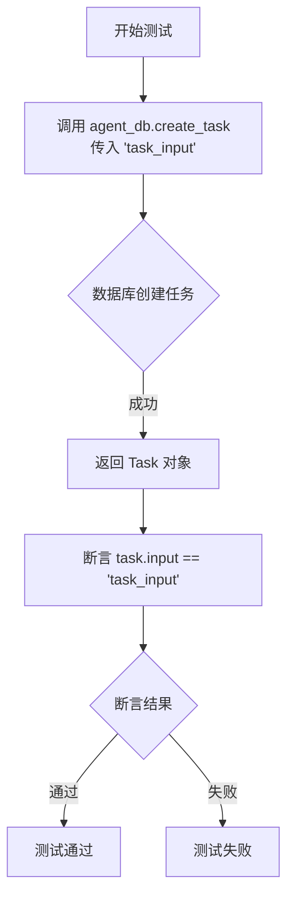

#### 带注释源码

```python
@pytest.mark.asyncio
async def test_create_task(agent_db: AgentDB):
    """
    测试 AgentDB.create_task 方法的基本功能
    
    验证点：
    1. create_task 方法能够成功创建任务
    2. 返回的 Task 对象包含正确的 input 字段
    """
    # 调用 AgentDB 的 create_task 方法，传入任务输入字符串
    task = await agent_db.create_task("task_input")
    
    # 断言验证返回的任务的 input 字段与传入值一致
    assert task.input == "task_input"
```


### `test_create_and_get_task`

该测试函数用于验证 AgentDB 类的任务创建和任务获取功能是否正常工作。首先通过 `create_task` 方法创建一个任务，然后通过 `get_task` 方法根据返回的任务ID获取该任务，最后断言获取到的任务输入与创建时输入一致，以确保数据持久化和检索的正确性。

参数：

- `agent_db`：`AgentDB`，测试 fixture 提供的数据库实例，用于执行数据库操作

返回值：`None`，该函数为测试函数，使用 assert 断言验证功能，不返回具体数据

#### 流程图

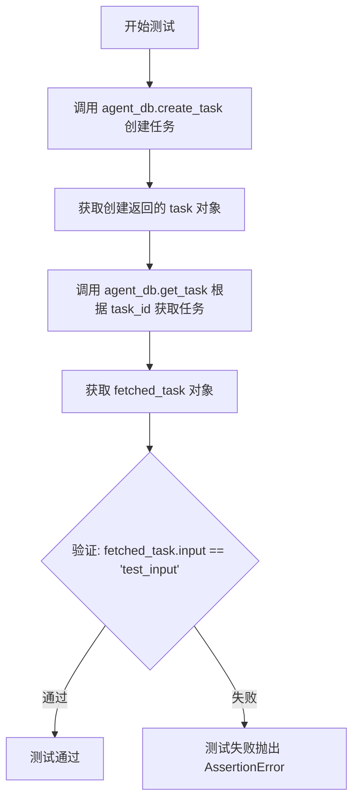

#### 带注释源码

```python
@pytest.mark.asyncio
async def test_create_and_get_task(agent_db: AgentDB):
    """
    测试任务创建和获取功能是否正常工作
    
    测试步骤：
    1. 创建一个新任务，输入为 'test_input'
    2. 根据返回的任务 ID 获取该任务
    3. 验证获取到的任务输入与创建时的输入一致
    """
    # 第一步：创建任务
    # 调用 AgentDB 的 create_task 方法，传入任务输入字符串
    # 返回一个包含 task_id 等信息的 Task 对象
    task = await agent_db.create_task("test_input")
    
    # 第二步：获取任务
    # 使用创建任务时返回的 task_id 来查询数据库
    # 返回对应的 Task 对象（如果存在）
    fetched_task = await agent_db.get_task(task.task_id)
    
    # 第三步：验证结果
    # 断言获取到的任务输入与创建时输入一致
    # 如果不一致，pytest 会抛出 AssertionError
    assert fetched_task.input == "test_input"
```


### `test_get_task_not_found`

该测试函数用于验证当查询一个不存在的任务时，`AgentDB.get_task` 方法是否正确抛出 `DataNotFoundError` 异常。

参数：

- `agent_db`：`AgentDB`，数据库 fixture，用于提供测试用的数据库实例

返回值：`None`，测试函数无返回值

#### 流程图

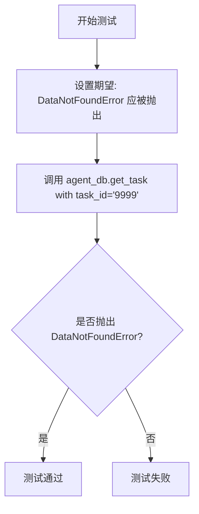

#### 带注释源码

```python
@pytest.mark.asyncio
async def test_get_task_not_found(agent_db: AgentDB):
    """
    测试当任务不存在时，get_task 方法是否正确抛出 DataNotFoundError。
    
    参数:
        agent_db: AgentDB 实例，提供数据库操作接口
    
    返回值:
        无返回值，使用 pytest.raises 验证异常抛出
    """
    # 使用 pytest.raises 上下文管理器验证 get_task 在任务不存在时抛出 DataNotFoundError
    with pytest.raises(DataNotFoundError):
        # 调用 get_task 方法，传入一个不存在的 task_id "9999"
        # 期望抛出 DataNotFoundError 异常
        await agent_db.get_task("9999")
```


### `test_create_and_get_step`

这是一个异步测试函数，用于验证 AgentDB 数据库中步骤（Step）的创建和获取功能是否正常工作。

参数：

-  `agent_db`：`AgentDB`，pytest fixture，提供数据库连接实例，用于执行数据库操作

返回值：`None`，该函数为测试函数，无返回值，通过断言验证功能正确性

#### 流程图

```mermaid
flowchart TD
    A[开始测试] --> B[创建任务: agent_db.create_task]
    B --> C[构建步骤输入: step_input = {'type': 'python/code'}]
    C --> D[创建请求对象: StepRequestBody]
    D --> E[创建步骤: agent_db.create_step]
    E --> F[获取步骤: agent_db.get_step]
    F --> G{验证步骤输入}
    G -->|通过| H[测试通过]
    G -->|失败| I[测试失败]
```

#### 带注释源码

```python
@pytest.mark.asyncio
async def test_create_and_get_step(agent_db: AgentDB):
    """
    测试步骤的创建和获取功能
    
    该测试验证：
    1. 能够成功创建任务
    2. 能够使用任务ID创建步骤
    3. 能够通过任务ID和步骤ID获取步骤
    4. 获取的步骤输入与创建时一致
    """
    # 第一步：创建一个任务，返回的task对象包含task_id
    task = await agent_db.create_task("task_input")
    
    # 第二步：定义步骤的附加输入信息
    step_input = {"type": "python/code"}
    
    # 第三步：构建步骤请求体，包含输入和附加输入
    request = StepRequestBody(input="test_input debug", additional_input=step_input)
    
    # 第四步：使用任务ID和请求体创建步骤
    step = await agent_db.create_step(task.task_id, request)
    
    # 第五步：通过任务ID和步骤ID获取刚才创建的步骤
    step = await agent_db.get_step(task.task_id, step.step_id)
    
    # 第六步：断言验证获取的步骤输入与创建时一致
    assert step.input == "test_input debug"
```


### `test_updating_step`

该测试函数验证了 AgentDB 中更新步骤（Step）状态的功能。测试创建任务和步骤，然后将步骤状态更新为 "completed"，最后验证更新是否成功。

参数：

- `agent_db`：`AgentDB`，数据库 fixture，提供 AgentDB 实例用于测试

返回值：`None`（测试函数，通过断言验证行为）

#### 流程图

```mermaid
flowchart TD
    A[开始测试] --> B[创建任务: agent_db.create_task<br/>输入: 'task_input']
    B --> C[创建请求体: StepRequestBody<br/>input: 'test_input debug'<br/>additional_input: {type: python/code}]
    C --> D[创建步骤: agent_db.create_step<br/>task_id: created_task.task_id<br/>request: StepRequestBody]
    D --> E[更新步骤状态: agent_db.update_step<br/>task_id: created_task.task_id<br/>step_id: created_step.step_id<br/>status: 'completed']
    E --> F[获取步骤: agent_db.get_step<br/>task_id: created_task.task_id<br/>step_id: created_step.step_id]
    F --> G{验证步骤状态}
    G -->|status == 'completed'| H[测试通过]
    G -->|status != 'completed'| I[测试失败]
```

#### 带注释源码

```python
@pytest.mark.asyncio
async def test_updating_step(agent_db: AgentDB):
    """
    测试更新步骤状态的功能。
    
    测试流程：
    1. 创建一个任务
    2. 为该任务创建一个步骤
    3. 更新步骤的状态为 'completed'
    4. 重新获取该步骤并验证状态已更新
    """
    # 第一步：创建一个任务，返回的 task 对象包含 task_id
    created_task = await agent_db.create_task("task_input")
    
    # 准备步骤的输入数据
    step_input = {"type": "python/code"}
    
    # 创建步骤请求体，包含输入和额外输入
    request = StepRequestBody(input="test_input debug", additional_input=step_input)
    
    # 第二步：使用任务 ID 和请求体创建步骤
    created_step = await agent_db.create_step(created_task.task_id, request)
    
    # 第三步：更新步骤的状态为 "completed"
    # 参数：task_id, step_id, status
    await agent_db.update_step(
        created_task.task_id, 
        created_step.step_id, 
        "completed"
    )
    
    # 第四步：重新获取步骤以验证更新是否成功
    step = await agent_db.get_step(created_task.task_id, created_step.step_id)
    
    # 断言：验证步骤的状态值等于 "completed"
    assert step.status.value == "completed"
```


### `test_get_step_not_found`

该测试函数用于验证当请求获取不存在的步骤时，`AgentDB.get_step` 方法能够正确抛出 `DataNotFoundError` 异常。它通过使用 `pytest.raises` 来预期异常行为，确保数据库层在查找不存在的任务ID和步骤ID组合时能够正确处理并报告错误。

参数：

- `agent_db`：`AgentDB`，测试 fixture，提供 AgentDB 数据库实例用于执行数据库操作

返回值：`None`，该函数为测试函数，不返回任何值，通过 pytest 框架的异常断言来验证行为

#### 流程图

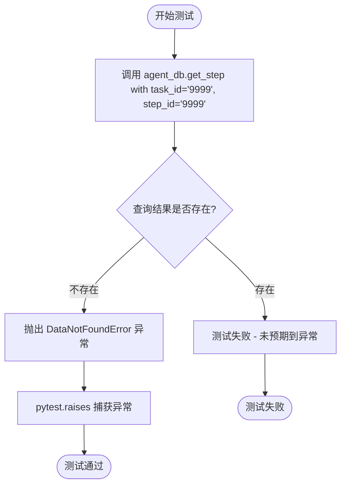

#### 带注释源码

```python
@pytest.mark.asyncio
async def test_get_step_not_found(agent_db: AgentDB):
    """
    测试当步骤不存在时，get_step 方法能够正确抛出 DataNotFoundError
    
    测试场景：
    - 使用不存在的 task_id '9999' 和 step_id '9999' 调用 get_step
    - 预期行为：应抛出 DataNotFoundError 异常
    - 验证目标：确保数据库层在找不到对应步骤时能够正确处理异常
    """
    # 使用 pytest.raises 上下文管理器预期捕获 DataNotFoundError 异常
    # 如果 get_step 没有抛出异常，测试将失败
    with pytest.raises(DataNotFoundError):
        # 尝试获取不存在的步骤，应触发 DataNotFoundError
        await agent_db.get_step("9999", "9999")
```


### `test_get_artifact`

这是一个异步测试函数，用于测试 AgentDB 类的 `get_artifact` 方法是否能够正确根据工件 ID 从数据库中检索工件信息。

参数：

- `agent_db`：`AgentDB`，通过 pytest fixture 注入的数据库实例，用于执行数据库操作

返回值：`None`（该函数为测试函数，使用 assert 语句进行断言验证，无显式返回值）

#### 流程图

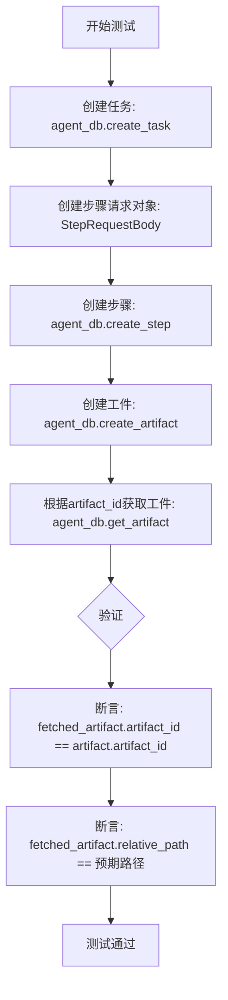

#### 带注释源码

```python
@pytest.mark.asyncio
async def test_get_artifact(agent_db: AgentDB):
    # Given: A task and its corresponding artifact
    # 创建一个任务，用于后续关联步骤和工件
    task = await agent_db.create_task("test_input debug")
    
    # 准备步骤的输入参数
    step_input = {"type": "python/code"}
    requst = StepRequestBody(input="test_input debug", additional_input=step_input)

    # 为任务创建一个步骤
    step = await agent_db.create_step(task.task_id, requst)

    # 创建一个工件（Artifact），关联到任务和步骤
    artifact = await agent_db.create_artifact(
        task_id=task.task_id,
        file_name="test_get_artifact_sample_file.txt",
        relative_path="file:///path/to/test_get_artifact_sample_file.txt",
        agent_created=True,
        step_id=step.step_id,
    )

    # When: The artifact is fetched by its ID
    # 通过 artifact_id 从数据库获取工件
    fetched_artifact = await agent_db.get_artifact(artifact.artifact_id)

    # Then: The fetched artifact matches the original
    # 验证获取的工件 ID 与原始工件 ID 一致
    assert fetched_artifact.artifact_id == artifact.artifact_id
    # 验证获取的工件路径与原始工件路径一致
    assert (
        fetched_artifact.relative_path
        == "file:///path/to/test_get_artifact_sample_file.txt"
    )
```


### `test_list_tasks`

该测试函数用于验证 AgentDB 的 `list_tasks` 方法能够正确返回数据库中的所有任务，并通过断言确保创建的任务包含在返回的任务列表中。

参数：

- `agent_db`：`AgentDB`，测试 fixture，提供 AgentDB 数据库实例用于执行测试

返回值：`None`，测试函数无返回值，通过断言验证功能正确性

#### 流程图

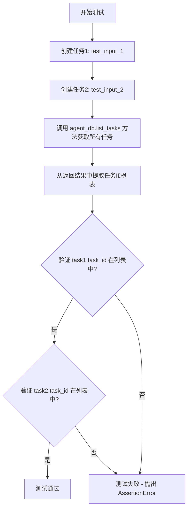

#### 带注释源码

```python
@pytest.mark.asyncio
async def test_list_tasks(agent_db: AgentDB):
    # Given: Multiple tasks in the database
    # 准备测试数据：创建两个任务对象
    task1 = await agent_db.create_task("test_input_1")
    task2 = await agent_db.create_task("test_input_2")

    # When: All tasks are fetched
    # 执行测试：调用 list_tasks 方法获取所有任务
    fetched_tasks, pagination = await agent_db.list_tasks()

    # Then: The fetched tasks list includes the created tasks
    # 验证结果：从返回的任务列表中提取 task_id
    task_ids = [task.task_id for task in fetched_tasks]
    
    # 断言验证 task1 的 ID 存在于返回的任务 ID 列表中
    assert task1.task_id in task_ids
    
    # 断言验证 task2 的 ID 存在于返回的任务 ID 列表中
    assert task2.task_id in task_ids
```


### `test_list_steps`

这是一个异步测试函数，用于测试 `AgentDB` 类的 `list_steps` 方法，验证其能够正确列出指定任务的所有步骤。

参数：

- `agent_db`：`AgentDB`，测试 fixture，提供数据库实例

返回值：`None`，通过 pytest 的 assert 语句进行验证

#### 流程图

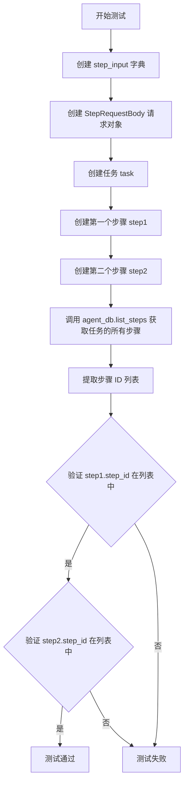

#### 带注释源码

```python
@pytest.mark.asyncio
async def test_list_steps(agent_db: AgentDB):
    # 准备步骤输入数据
    step_input = {"type": "python/code"}
    # 创建步骤请求体，包含输入和附加输入
    request = StepRequestBody(input="test_input debug", additional_input=step_input)

    # Given: 创建一个任务和该任务下的多个步骤
    # 创建一个新任务
    task = await agent_db.create_task("test_input")
    # 为任务创建第一个步骤
    step1 = await agent_db.create_step(task.task_id, request)
    # 创建新的请求体（修改输入内容）
    request = StepRequestBody(input="step two")
    # 为任务创建第二个步骤
    step2 = await agent_db.create_step(task.task_id, request)

    # When: 获取该任务的所有步骤
    fetched_steps, pagination = await agent_db.list_steps(task.task_id)

    # Then: 验证获取的步骤列表包含创建的步骤
    # 提取所有步骤的 ID
    step_ids = [step.step_id for step in fetched_steps]
    # 断言第一个步骤 ID 在列表中
    assert step1.step_id in step_ids
    # 断言第二个步骤 ID 在列表中
    assert step2.step_id in step_ids
```


### `convert_to_task`

将数据库模型 `TaskModel` 转换为应用层模型 `Task`，用于在 API 层返回任务数据。

参数：

-  `task_model`：`TaskModel`，数据库中的任务模型对象，包含任务 ID、创建时间、修改时间、输入内容、附加输入及关联的产物列表

返回值：`Task`，应用层的任务领域模型，包含任务 ID、创建时间、修改时间、输入内容、产物列表等字段

#### 流程图

```mermaid
flowchart TD
    A[开始: convert_to_task] --> B[输入: task_model TaskModel对象]
    B --> C{检查 task_model 是否为 None}
    C -->|是| D[返回 None 或抛出异常]
    C -->|否| E[提取 task_id]
    E --> F[提取 created_at 和 modified_at]
    F --> G[提取 input 字段]
    G --> H[提取 additional_input 字段]
    H --> I{检查 artifacts 是否存在}
    I -->|不存在或为空| J[artifacts = []]
    I -->|存在| K[遍历 artifacts 列表]
    K --> L[对每个 ArtifactModel 调用 convert_to_artifact]
    L --> M[构建 Artifact 对象列表]
    M --> N[创建 Task 对象]
    N --> O[返回 Task 对象]
```

#### 带注释源码

```
# convert_to_task 函数源码（根据导入和测试代码推断）

def convert_to_task(task_model: TaskModel) -> Task:
    """
    将数据库模型 TaskModel 转换为应用层模型 Task
    
    参数:
        task_model: 数据库中的任务模型，包含持久化所需的所有字段
        
    返回:
        Task: 应用层领域模型，用于 API 响应
    """
    # 从数据库模型中提取字段值
    task_id = task_model.task_id
    created_at = task_model.created_at
    modified_at = task_model.modified_at
    input_text = task_model.input
    additional_input = task_model.additional_input
    
    # 处理关联的 artifacts 列表
    # 将数据库模型 ArtifactModel 转换为应用模型 Artifact
    artifacts = []
    if task_model.artifacts:
        for artifact_model in task_model.artifacts:
            artifact = convert_to_artifact(artifact_model)
            artifacts.append(artifact)
    
    # 创建并返回应用层 Task 对象
    return Task(
        task_id=task_id,
        created_at=created_at,
        modified_at=modified_at,
        input=input_text,
        additional_input=additional_input,
        artifacts=artifacts
    )
```


### `convert_to_step`

将数据库模型 `StepModel` 转换为 API 响应模型 `Step`，负责处理步骤数据的格式转换和字段映射。

参数：

-  `step_model`：`StepModel`，从数据库获取的步骤数据模型，包含任务 ID、步骤 ID、创建时间、修改时间、步骤名称、状态、输入内容、附加输入、关联产物列表以及是否为最后一步等信息

返回值：`Step`，转换后的步骤业务模型对象，用于 API 响应，包含相同的字段但格式化为业务层所需的类型（如将字符串状态转换为 `StepStatus` 枚举）

#### 流程图

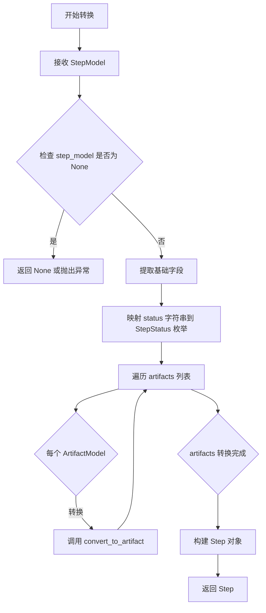

#### 带注释源码

```python
# convert_to_step 函数源码（基于测试用例推断）

def convert_to_step(step_model: StepModel) -> Step:
    """
    将数据库模型 StepModel 转换为业务模型 Step
    
    参数:
        step_model: 数据库中的步骤模型，包含原始数据
        
    返回:
        业务层面的步骤对象，用于 API 响应
    """
    # 将字符串状态转换为枚举类型
    status = StepStatus(step_model.status)
    
    # 转换关联的产物列表
    artifacts = [
        convert_to_artifact(artifact_model) 
        for artifact_model in step_model.artifacts
    ]
    
    # 构建并返回业务模型
    return Step(
        task_id=step_model.task_id,
        step_id=step_model.step_id,
        created_at=step_model.created_at,
        modified_at=step_model.modified_at,
        name=step_model.name,
        input=step_model.input,
        status=status,
        output=step_model.output,  # 如果存在
        artifacts=artifacts,
        is_last=step_model.is_last,
    )
```

> **注意**：由于 `convert_to_step` 的实际源码未在提供的测试文件中给出，以上源码为基于测试用例 `test_convert_to_step` 中的使用方式和参数结构进行的合理推断。实际实现可能包含更多字段处理逻辑。


### `convert_to_artifact`

该函数用于将数据库层的数据模型 `ArtifactModel` 转换为业务层的数据模型 `Artifact`，实现数据库持久化对象与应用领域对象的隔离。

参数：

-  `artifact_model`：`ArtifactModel`，数据库中的工件模型对象，包含从数据库查询到的工件数据

返回值：`Artifact`，业务层的工件对象，用于在应用逻辑中使用

#### 流程图

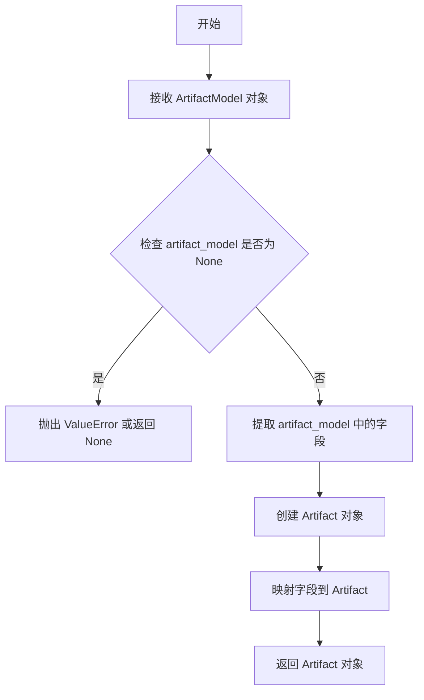

#### 带注释源码

```python
def convert_to_artifact(artifact_model: ArtifactModel) -> Artifact:
    """
    将数据库模型 ArtifactModel 转换为业务模型 Artifact
    
    参数:
        artifact_model: 数据库中的工件模型对象
        
    返回:
        业务层的工件对象
    """
    # 从数据模型中提取字段并构造业务模型对象
    # 映射关系：
    # - artifact_id: 工件唯一标识
    # - file_name: 文件名
    # - relative_path: 相对路径
    # - created_at: 创建时间
    # - modified_at: 修改时间
    # - agent_created: 是否由 Agent 创建
    
    return Artifact(
        artifact_id=artifact_model.artifact_id,
        file_name=artifact_model.file_name,
        relative_path=artifact_model.relative_path,
        created_at=artifact_model.created_at,
        modified_at=artifact_model.modified_at,
        agent_created=artifact_model.agent_created,
    )
```


### `agent_db`

这是一个pytest fixture，用于创建和管理AgentDB数据库连接实例，并在测试完成后自动清理数据库文件。

参数：

- 无显式参数（pytest fixture）

返回值：`AgentDB`，返回数据库实例，用于后续测试中的数据库操作

#### 流程图

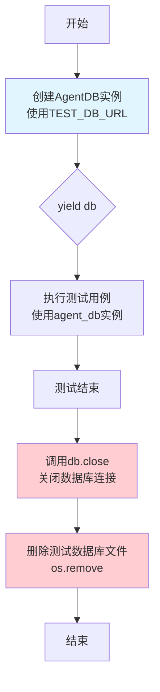

#### 带注释源码

```python
@pytest.fixture
def agent_db():
    """
    pytest fixture: 创建测试用的AgentDB数据库实例
    
    功能：
    1. 创建AgentDB实例并连接到测试数据库
    2. 在测试函数执行期间提供数据库实例
    3. 测试完成后清理数据库文件
    
    使用示例：
    def test_something(agent_db: AgentDB):
        task = await agent_db.create_task("test_input")
    """
    # 第一步：创建AgentDB数据库实例
    # 使用预定义的测试数据库URL（SQLite内存数据库或文件数据库）
    db = AgentDB(TEST_DB_URL)
    
    # 第二步：yield将控制权交给测试函数
    # 在此期间，测试函数可以使用db变量进行数据库操作
    yield db
    
    # 第三步：测试完成后清理资源
    # 关闭数据库连接
    db.close()
    
    # 第四步：删除测试数据库文件
    # 清理测试环境，避免污染项目目录
    os.remove(TEST_DB_FILENAME)
```

### 补充信息

**关键组件信息：**

- `AgentDB`：数据库操作类，负责任务的创建、查询、更新等CRUD操作
- `TEST_DB_FILENAME`：测试数据库文件名（"test_db.sqlite3"）
- `TEST_DB_URL`：SQLite数据库连接URL（"sqlite:///test_db.sqlite3"）

**潜在技术债务或优化空间：**

1. **硬编码的数据库路径**：测试数据库路径硬编码，可考虑使用临时目录（`tempfile`模块）
2. **缺少异常处理**：fixture中没有try-except保护，如果数据库文件删除失败可能导致资源泄漏
3. **同步文件操作**：使用`os.remove`同步删除文件，在高并发场景可能存在问题

**设计目标与约束：**

- 目标：为pytest测试提供干净的数据库环境，每个测试使用独立的数据库实例
- 约束：测试必须为函数级别（function scope）， fixture默认为function级别

**错误处理与异常设计：**

- 如果数据库文件不存在，`os.remove`会抛出`FileNotFoundError`
- 如果数据库连接未关闭，`os.remove`可能失败（Windows平台）


### `raw_db_connection`

这是一个 pytest fixture，用于创建和提供直接的 SQLite 数据库连接，以便在测试中直接执行 SQL 语句验证数据库表结构。

参数：

- `agent_db`：`AgentDB`，由 `@pytest.fixture` 提供的 AgentDB 实例，用于初始化测试数据库

返回值：`sqlite3.Connection`，返回 sqlite3.Connection 对象，调用者可以使用该连接直接执行 SQL 语句

#### 流程图

```mermaid
flowchart TD
    A[开始: raw_db_connection fixture] --> B[接收 agent_db 参数]
    B --> C[使用 sqlite3.connect 连接到 TEST_DB_FILENAME]
    C --> D[yield connection 返回连接对象给测试用例]
    D --> E[测试用例执行直接 SQL 验证]
    E --> F[测试完成, 继续执行 yield 后的代码]
    F --> G[调用 connection.close 关闭连接]
    G --> H[结束]
```

#### 带注释源码

```python
@pytest.fixture
def raw_db_connection(agent_db: AgentDB):
    """
    pytest fixture，用于创建直接的 SQLite 数据库连接。
    
    Args:
        agent_db: AgentDB 实例，确保测试数据库已初始化
    
    Yields:
        sqlite3.Connection: 可以直接执行 SQL 的数据库连接对象
    """
    # 使用 sqlite3 模块直接连接到测试数据库文件
    connection = sqlite3.connect(TEST_DB_FILENAME)
    
    # yield 将连接对象提供给使用该 fixture 的测试函数
    yield connection
    
    # 测试完成后，关闭数据库连接以释放资源
    connection.close()
```


### `AgentDB.create_task`

该方法用于在数据库中创建一个新的任务（Task），接受任务输入字符串，异步创建任务记录并返回包含任务ID和输入信息的Task对象。

参数：

-  `task_input`：`str`，任务输入内容，即任务要处理的具体输入数据

返回值：`Task`，返回创建成功的任务对象，包含任务ID、输入内容、创建时间等属性

#### 流程图

```mermaid
flowchart TD
    A[开始创建任务] --> B[接收task_input字符串参数]
    B --> C{验证task_input有效性}
    C -->|无效| D[抛出异常或使用默认值]
    C -->|有效| E[生成唯一task_id]
    E --> F[创建TaskModel实例]
    F --> G[调用数据库插入操作]
    G --> H{数据库操作成功?}
    H -->|失败| I[抛出数据库异常]
    H -->|成功| J[将TaskModel转换为Task对象]
    J --> K[返回Task对象]
```

#### 带注释源码

```python
# 基于测试代码推断的实现
async def create_task(self, task_input: str) -> Task:
    """
    在数据库中创建新任务
    
    参数:
        task_input: 任务的输入内容，字符串类型
        
    返回:
        Task: 创建成功的任务对象
    """
    # 1. 验证输入参数
    if not task_input:
        task_input = ""
    
    # 2. 生成唯一任务ID (UUID格式)
    task_id = str(uuid.uuid4())
    
    # 3. 获取当前时间戳
    now = datetime.now()
    
    # 4. 创建任务模型 (数据库层对象)
    task_model = TaskModel(
        task_id=task_id,
        created_at=now,
        modified_at=now,
        input=task_input,
        additional_input={},  # 可选的额外输入
        artifacts=[]  # 初始无产物
    )
    
    # 5. 执行数据库插入操作
    await self._insert_task(task_model)
    
    # 6. 转换为API层任务对象并返回
    return convert_to_task(task_model)
```

> **注意**：由于提供的代码仅包含测试文件，未显示 `AgentDB` 类的实际实现，以上源码为基于测试用例使用方式的合理推断。实际的 `create_task` 方法可能包含更多参数（如额外输入配置、初始状态等）或其他业务逻辑。


### `AgentDB.get_task`

根据测试代码分析，`get_task` 是 `AgentDB` 类的一个异步方法，用于从数据库中根据任务 ID 获取任务信息。如果找不到对应的任务，该方法会抛出 `NotFoundError` 异常。

参数：

- `task_id`：`str`，任务的唯一标识符，用于指定要检索的任务

返回值：`Task`，返回与给定 `task_id` 对应的任务对象，如果未找到则抛出异常

#### 流程图

```mermaid
sequenceDiagram
    participant Client as 调用者
    participant AgentDB as AgentDB.get_task
    participant DB as SQLite Database
    
    Client->>AgentDB: get_task(task_id)
    Note over AgentDB: 验证 task_id 参数
    AgentDB->>DB: SELECT * FROM tasks WHERE task_id = ?
    DB-->>AgentDB: 返回任务记录或 None
    
    alt 任务存在
        AgentDB-->>Client: 返回 Task 对象
    else 任务不存在
        AgentDB-->>Client: 抛出 DataNotFoundError
    end
```

#### 带注释源码

```
# 基于测试代码推断的实现逻辑
async def get_task(self, task_id: str) -> Task:
    """
    根据任务ID从数据库获取任务信息
    
    参数:
        task_id: 任务的唯一标识符
        
    返回:
        Task: 任务对象
        
    异常:
        DataNotFoundError: 当任务不存在时抛出
    """
    # 1. 查询数据库获取任务记录
    # SELECT * FROM tasks WHERE task_id = :task_id
    
    # 2. 如果找到记录，转换为 TaskModel
    # task_model = TaskModel(...)
    
    # 3. 将 TaskModel 转换为 Task 对象
    # task = convert_to_task(task_model)
    
    # 4. 返回 Task 对象
    # return task
```

> **注意**：由于提供的代码仅为测试文件（`test_db.py`），未包含 `AgentDB` 类的实际源代码。上述源码是基于测试用例的使用方式推断得出的。`AgentDB` 类的实际实现位于 `forge.agent_protocol.database.db` 模块中。


### `AgentDB.create_step`

该方法用于在指定任务下创建一个新的步骤（Step），并返回创建的步骤对象。它接收任务ID和步骤请求体作为参数，将步骤数据持久化到数据库中，并关联到对应的任务。

参数：

-  `task_id`：`str`，任务ID，用于指定步骤所属的任务
-  `request`：`StepRequestBody`，步骤请求体，包含步骤的输入数据、附加输入等信息

返回值：`Step`，创建成功的步骤对象，包含步骤ID、状态、输入、输出等完整信息

#### 流程图

```mermaid
flowchart TD
    A[开始 create_step] --> B{验证 task_id 是否存在}
    B -->|任务不存在| C[抛出 DataNotFoundError]
    B -->|任务存在| D[生成唯一 step_id]
    D --> E[创建 StepModel 实例]
    E --> F[将 StepModel 插入数据库]
    F --> G[调用 convert_to_step 转换为 Step 对象]
    G --> H[返回 Step 对象]
```

#### 带注释源码

```python
async def create_step(self, task_id: str, request: StepRequestBody) -> Step:
    """
    在指定任务下创建一个新的步骤
    
    参数:
        task_id: 任务ID，用于关联步骤所属任务
        request: 步骤请求体，包含输入和附加输入数据
        
    返回:
        创建成功的 Step 对象
        
    异常:
        DataNotFoundError: 当指定的任务不存在时抛出
    """
    # 检查任务是否存在，如果不存在则抛出异常
    task = await self.get_task(task_id)
    
    # 生成唯一的步骤ID
    step_id = str(uuid.uuid4())
    
    # 获取当前时间戳
    now = datetime.now()
    
    # 创建步骤模型实例
    step_model = StepModel(
        task_id=task_id,
        step_id=step_id,
        created_at=now,
        modified_at=now,
        name=request.name,  # 步骤名称
        input=request.input,  # 步骤输入
        additional_input=request.additional_input,  # 附加输入
        status="created",  # 初始状态为 created
        artifacts=[],  # 初始时没有产物
        is_last=False,  # 初始时不是最后一步
    )
    
    # 将步骤模型插入数据库
    await self._insert_step(step_model)
    
    # 转换为 Step 对象返回
    return convert_to_step(step_model)
```


### `AgentDB.get_step`

该方法用于从数据库中检索特定任务下的指定步骤对象。如果找不到对应的步骤或任务，将抛出 `NotFoundError` 异常。

参数：

- `task_id`：`str`，任务的唯一标识符，用于指定步骤所属的任务
- `step_id`：`str`，步骤的唯一标识符，用于指定要检索的具体步骤

返回值：`Step`，返回与给定 `task_id` 和 `step_id` 匹配的步骤对象，包含步骤的输入、输出、状态、关联的产物等信息

#### 流程图

```mermaid
flowchart TD
    A[开始 get_step] --> B{验证数据库连接}
    B --> C[执行 SQL 查询<br/>SELECT * FROM steps<br/>WHERE task_id = ?<br/>AND step_id = ?]
    C --> D{查询结果是否为空}
    D -->|是| E[抛出 DataNotFoundError]
    D -->|否| F[将数据库记录转换为 StepModel]
    F --> G[调用 convert_to_step<br/>将 StepModel 转换为 Step]
    G --> H[返回 Step 对象]
```

#### 带注释源码

```python
# 由于源代码不在当前文件中，基于测试代码的用法推断实现如下：

async def get_step(self, task_id: str, step_id: str) -> Step:
    """
    根据任务ID和步骤ID获取对应的步骤对象
    
    参数:
        task_id: 任务的唯一标识符
        step_id: 步骤的唯一标识符
    
    返回:
        Step: 步骤的数据模型对象
    
    异常:
        DataNotFoundError: 当任务或步骤不存在时抛出
    """
    # 1. 构建查询语句，从 steps 表中检索数据
    # SELECT * FROM steps WHERE task_id = ? AND step_id = ?
    
    # 2. 执行异步数据库查询
    # step_model = await self.db.fetch_one(
    #     "SELECT * FROM steps WHERE task_id = :task_id AND step_id = :step_id",
    #     {"task_id": task_id, "step_id": step_id}
    # )
    
    # 3. 检查查询结果，如果为空则抛出异常
    # if not step_model:
    #     raise DataNotFoundError(f"Step {step_id} not found in task {task_id}")
    
    # 4. 将数据库记录转换为 StepModel 对象
    # step_model = StepModel(**step_model)
    
    # 5. 将 StepModel 转换为业务层的 Step 对象并返回
    # return convert_to_step(step_model)
```


### `AgentDB.update_step`

该方法用于更新数据库中特定任务下的步骤状态。

参数：

- `task_id`：`str`，任务ID，用于标识需要更新步骤所属的任务
- `step_id`：`str`，步骤ID，用于标识需要更新的具体步骤
- `status`：`str`，要更新的状态值（如 "completed"）

返回值：`None`，该方法不返回任何值，仅执行数据库更新操作

#### 流程图

```mermaid
flowchart TD
    A[开始 update_step] --> B[接收 task_id, step_id, status]
    B --> C[建立数据库连接]
    C --> D[执行 UPDATE 语句更新 steps 表]
    D --> E{更新是否成功}
    E -->|成功| F[提交事务]
    E -->|失败| G[回滚事务]
    F --> H[关闭数据库连接]
    G --> H
    H --> I[结束]
```

#### 带注释源码

```python
async def update_step(self, task_id: str, step_id: str, status: str) -> None:
    """
    更新指定任务的步骤状态
    
    参数:
        task_id: 任务ID
        step_id: 步骤ID
        status: 新的状态值
    
    返回:
        None: 不返回任何值
    """
    # 获取数据库连接
    with self._get_connection() as connection:
        # 创建游标用于执行SQL
        cursor = connection.cursor()
        
        # 执行更新操作，将指定task_id和step_id的步骤状态更新为新status
        cursor.execute(
            """
            UPDATE steps
            SET status = ?, modified_at = datetime('now')
            WHERE task_id = ? AND step_id = ?
            """,
            (status, task_id, step_id),
        )
        
        # 提交事务以保存更改
        connection.commit()
```


### `AgentDB.create_artifact`

该方法用于在数据库中创建一个新的工件（Artifact），将其与指定的任务和步骤关联，并返回创建的工件对象。

参数：

- `task_id`：`str`，任务的唯一标识符，用于关联该工单所属的任务
- `file_name`：`str`，工件的文件的名称
- `relative_path`：`str`，工件的相对路径（通常为文件URI格式）
- `agent_created`：`bool`，指示该工件是否由Agent创建
- `step_id`：`str`，步骤的唯一标识符，用于关联该工件所属的步骤

返回值：`Artifact`，创建的工件对象，包含完整的工件信息（如artifact_id、创建时间、修改时间等）

#### 流程图

```mermaid
flowchart TD
    A[开始创建Artifact] --> B{验证task_id和step_id是否存在}
    B -->|验证通过| C[创建ArtifactModel对象]
    B -->|验证失败| D[抛出DataNotFoundError]
    C --> E[执行SQL INSERT语句]
    E --> F[提交事务到数据库]
    F --> G[将ArtifactModel转换为Artifact对象]
    G --> H[返回Artifact对象]
```

#### 带注释源码

```
# 注意：以下是根据测试代码反推的方法签名和功能描述
# 实际实现代码需要查看 forge.agent_protocol.database.db 模块中的 AgentDB 类

async def create_artifact(
    self,
    task_id: str,
    file_name: str,
    relative_path: str,
    agent_created: bool,
    step_id: str
) -> Artifact:
    """
    在数据库中创建新的Artifact记录
    
    参数:
        task_id: 任务ID，用于关联工件所属的任务
        file_name: 工件的文件名
        relative_path: 工件的相对路径（URI格式）
        agent_created: 标记工件是否由Agent创建
        step_id: 步骤ID，用于关联工件所属的步骤
    
    返回:
        Artifact: 创建的工件对象，包含完整的数据库记录信息
    """
    # 1. 验证task_id和step_id是否存在（如果需要）
    # 2. 创建ArtifactModel实例，包含时间戳等信息
    # 3. 执行SQL INSERT语句将数据写入artifacts表
    # 4. 提交事务
    # 5. 调用convert_to_artifact将Model转换为Domain对象
    # 6. 返回Artifact对象
```

#### 备注

**注意**：提供的代码文件中仅包含测试代码，未包含 `AgentDB` 类的实际实现。上述方法是根据测试文件中的调用方式反推得出的。实际的实现代码需要查看 `forge.agent_protocol.database.db` 模块中的 `AgentDB` 类的完整定义。

---

### 补充信息

#### 关键组件信息

| 组件名称 | 一句话描述 |
|---------|-----------|
| `AgentDB` | 数据库访问层类，负责与SQLite数据库进行交互 |
| `Artifact` | 工件领域模型，表示一个文件或代码片段 |
| `ArtifactModel` | 工件数据模型，用于数据库ORM映射 |
| `convert_to_artifact` | 将ArtifactModel转换为Artifact的辅助函数 |

#### 潜在的技术债务或优化空间

1. **缺少实际实现代码**：测试代码与实际实现分离，需要确保实现代码与测试用例一致
2. **错误处理**：应添加更详细的异常处理，如数据库连接失败、数据验证失败等场景
3. **事务管理**：需要确保数据库操作的原子性，特别是在并发场景下
4. **日志记录**：建议添加操作日志，便于调试和审计

#### 其它项目

- **设计目标**：通过统一的数据库访问层管理Agent执行过程中产生的工件
- **约束**：使用SQLite作为存储后端，通过SQLAlchemy或原生SQL进行数据操作
- **错误处理**：当任务或步骤不存在时，应抛出 `DataNotFoundError` 异常
- **外部依赖**：依赖 `forge.agent_protocol.models.Artifact` 和 `forge.agent_protocol.database.db.ArtifactModel`


### `AgentDB.get_artifact`

根据测试代码分析，`AgentDB.get_artifact` 方法根据给定的 `artifact_id` 从数据库中获取对应的 Artifact（制品）对象。如果未找到对应的 Artifact，则抛出 `NotFoundError`。

参数：

- `artifact_id`：`str`，Artifact 的唯一标识符，用于查询数据库中的特定制品记录

返回值：`Artifact`，返回从数据库中检索到的 Artifact 对象，包含 artifact_id、file_name、relative_path、created_at、modified_at 和 agent_created 等属性

#### 流程图

```mermaid
flowchart TD
    A[开始 get_artifact] --> B[接收 artifact_id 参数]
    B --> C[执行数据库查询]
    C --> D{查询结果是否为空?}
    D -->|是| E[抛出 DataNotFoundError 异常]
    D -->|否| F[将数据库记录转换为 Artifact 对象]
    F --> G[返回 Artifact 对象]
    E --> G
```

#### 带注释源码

```python
# 推断的实现逻辑（基于测试用例和上下文的分析）
async def get_artifact(self, artifact_id: str) -> Artifact:
    """
    根据 artifact_id 从数据库获取 Artifact 对象
    
    参数:
        artifact_id: Artifact 的唯一标识符
        
    返回:
        Artifact: 数据库中对应的 Artifact 对象
        
    异常:
        DataNotFoundError: 当数据库中不存在对应的 artifact_id 时抛出
    """
    # 1. 根据 artifact_id 查询数据库中的 artifacts 表
    # 2. 如果未找到对应记录，抛出 DataNotFoundError
    # 3. 将数据库记录（ArtifactModel）转换为 Artifact 对象并返回
```


### `AgentDB.list_tasks`

该方法用于从数据库中获取所有任务列表，并返回任务列表及分页信息。它是一个异步方法，支持分页查询，便于客户端进行分页展示或处理大量任务数据。

参数：

- 无参数

返回值：`Tuple[List[Task], Pagination]`，返回任务对象列表及分页信息，其中 Task 是任务模型对象，Pagination 包含分页元数据（如总数、页码、每页数量等）

#### 流程图

```mermaid
flowchart TD
    A[开始 list_tasks] --> B[执行异步数据库查询]
    B --> C{查询是否成功}
    C -->|成功| D[获取任务记录列表]
    C -->|失败| E[抛出数据库异常]
    D --> F[将数据库模型转换为 Task 对象列表]
    F --> G[生成分页信息]
    G --> H[返回 Task 列表和分页信息]
    E --> I[结束]
    H --> I
```

#### 带注释源码

```python
async def list_tasks(self):
    """
    列出数据库中的所有任务。
    
    该方法异步查询任务表，获取所有任务记录，并将其转换为
    Task 模型对象返回。同时生成相应的分页信息用于客户端分页处理。
    
    Returns:
        Tuple[List[Task], Pagination]: 
            - 第一个元素为 Task 对象列表，包含所有任务记录
            - 第二个元素为分页信息对象，包含总数、当前页、每页数量等
    """
    # 从测试代码中的调用方式推断实现逻辑：
    # fetched_tasks, pagination = await agent_db.list_tasks()
    #
    # 1. 构建 SQL 查询语句，从 tasks 表中检索所有记录
    # 2. 执行异步查询获取结果集
    # 3. 将每条数据库记录转换为 TaskModel
    # 4. 使用 convert_to_task 将 TaskModel 转换为 Task 对象
    # 5. 计算分页信息（总数、页码等）
    # 6. 返回 (List[Task], Pagination) 元组
    pass
```

> **注意**：提供的代码为测试文件（test_db.py），未包含 `AgentDB.list_tasks` 方法的具体实现。上述源码为根据测试调用方式 `await agent_db.list_tasks()` 推断的方法签名和功能描述。实际实现需查看 `forge.agent_protocol.database.db` 模块中的 `AgentDB` 类定义。


### `AgentDB.list_steps`

该方法用于获取指定任务的所有步骤，支持分页返回。它根据提供的 `task_id` 查询数据库中关联的所有步骤记录，并返回步骤列表和分页信息。

参数：
-  `task_id`：`str`，任务ID，用于标识需要查询步骤的任务

返回值：`tuple[list[Step], dict]`，返回包含 Step 对象列表和分页信息字典的元组。分页信息通常包含总数、页码、每页数量等。

#### 流程图

```mermaid
flowchart TD
    A[开始 list_steps] --> B[接收 task_id 参数]
    B --> C[验证 task_id 是否有效]
    C --> D{任务是否存在?}
    D -->|否| E[抛出 DataNotFoundError]
    D -->|是| F[构建 SQL 查询语句]
    F --> G[执行数据库查询]
    G --> H[获取步骤记录列表]
    H --> I[将数据库记录转换为 Step 模型对象]
    I --> J[构建分页信息]
    J --> K[返回步骤列表和分页信息]
    K --> L[结束]
```

#### 带注释源码

```python
# 从测试代码中提取的使用示例和方法签名推断
async def list_steps(self, task_id: str) -> tuple[list[Step], dict]:
    """
    获取指定任务的所有步骤
    
    参数:
        task_id: 任务ID，用于查询该任务关联的所有步骤
        
    返回:
        包含步骤列表和分页信息的元组
    """
    # 测试代码中的调用方式:
    # fetched_steps, pagination = await agent_db.list_steps(task.task_id)
    
    # 实现逻辑推断:
    # 1. 根据 task_id 查询数据库中的 steps 表
    # 2. 使用 convert_to_step 将数据库模型转换为 Step 对象
    # 3. 构建分页信息（如总数、页码等）
    # 4. 返回 (fetched_steps, pagination) 元组
```


# 提取结果

### `AgentDB.close`

关闭 AgentDB 实例，释放数据库连接资源。

**注意：** 在提供的测试代码文件中，仅展示了 `AgentDB.close` 方法的**调用示例**，并未包含该方法的实际实现源码。该方法定义在 `forge.agent_protocol.database.db` 模块的 `AgentDB` 类中。以下信息基于测试代码中的使用方式推断。

参数：

- 该方法无显式参数

返回值：`None`，无返回值

#### 流程图

```mermaid
graph TD
    A[开始关闭数据库] --> B{检查连接是否已打开}
    B -->|是| C[关闭数据库连接]
    B -->|否| D[直接返回]
    C --> E[清理相关资源]
    E --> F[结束]
    D --> F
```

#### 带注释源码

```python
# 测试代码中的调用方式
@pytest.fixture
def agent_db():
    db = AgentDB(TEST_DB_URL)  # 创建 AgentDB 实例
    yield db
    db.close()  # 关闭数据库连接，释放资源
    os.remove(TEST_DB_FILENAME)  # 清理测试数据库文件


# 实际实现需参考 forge.agent_protocol.database.db 模块中的 AgentDB 类
# 以下为推测的标准实现模式：

# def close(self) -> None:
#     """
#     关闭数据库连接并释放相关资源。
#     """
#     if self._engine is not None:
#         self._engine.dispose()  # 释放连接池
#     if self._session is not None:
#         self._session.close()   # 关闭会话
```

---

## 说明

1. **方法来源**：`AgentDB.close` 方法定义在 `forge.agent_protocol.database.db` 模块的 `AgentDB` 类中，当前代码文件仅为测试文件。
2. **使用场景**：在测试 fixture 中，测试完成后调用 `db.close()` 关闭数据库连接，然后删除测试数据库文件。
3. **推断功能**：根据调用上下文，该方法应负责关闭 SQLAlchemy 引擎连接并释放资源。

## 关键组件


### AgentDB

负责与SQLite数据库交互的类，提供任务、步骤、产物等数据的增删改查操作。

### TaskModel

任务数据模型，对应数据库中的tasks表，存储任务的输入、创建时间、修改时间及关联的产物。

### StepModel

步骤数据模型，对应数据库中的steps表，存储步骤的名称、输入、状态、输出及关联的产物。

### ArtifactModel

产物数据模型，对应数据库中的artifacts表，存储产物的文件名、路径、创建时间、是否由代理创建等信息。

### convert_to_task

将TaskModel实例转换为Task领域模型的函数。

### convert_to_step

将StepModel实例转换为Step领域模型的函数。

### convert_to_artifact

将ArtifactModel实例转换为Artifact领域模型的函数。

### 测试fixtures

提供测试所需的数据库连接和AgentDB实例，包括agent_db和raw_db_connection两个fixture。

### 表创建验证测试

test_table_creation函数验证数据库中tasks、steps、artifacts三张表是否正确创建。

### 模型Schema测试

test_task_schema、test_step_schema、test_convert_to_task、test_convert_to_step、test_convert_to_artifact函数验证任务、步骤、产物模型的结构和转换逻辑。

### CRUD操作测试

包括创建任务(test_create_task)、创建并获取任务(test_create_and_get_task)、获取任务不存在(test_get_task_not_found)、创建并获取步骤(test_create_and_get_step)、更新步骤(test_updating_step)、获取步骤不存在(test_get_step_not_found)、获取产物(test_get_artifact)、列出任务(test_list_tasks)、列出步骤(test_list_steps)等测试用例。

## 问题及建议


### 已知问题

-   **变量名拼写错误**：`test_get_artifact` 函数中使用 `requst` 而非 `request`，这是明显的拼写错误。
-   **测试数据硬编码**：多个测试中重复使用相同的 UUID 字符串（如 `"50da533e-3904-4401-8a07-c49adf88b5eb"`），未提取为常量或共享 fixture，导致代码冗余且维护困难。
-   **数据库连接管理不一致**：`raw_db_connection` fixture 创建独立的 sqlite3 连接，而 `agent_db` 使用 SQLAlchemy URL 格式连接，两者可能存在状态不一致风险。
-   **测试隔离性问题**：使用固定的 `TEST_DB_FILENAME = "test_db.sqlite3"`，并行测试或测试异常终止时可能残留数据库文件，导致后续测试失败。
-   **缺少关键功能测试**：未覆盖 `update_task`、删除操作（task/step/artifact）、并发访问、事务边界等场景。
-   **分页验证缺失**：`test_list_tasks` 和 `test_list_steps` 调用了分页返回但未验证 `pagination` 对象的正确性。
-   **Schema 验证不足**：`test_table_creation` 仅验证表存在，未验证列类型、约束、外键关系等 schema 细节。
-   **魔法字符串**：`"completed"` 等状态值直接以字符串形式使用，应使用 `StepStatus` 枚举常量保持一致性。
-   **异常测试覆盖不足**：仅测试了 2 个 NotFound 场景，缺少其他异常情况（如数据库连接失败、约束冲突等）的测试。

### 优化建议

-   **提取测试常量**：将重复的 UUID、时间戳、状态值提取为模块级常量或 pytest fixtures。
-   **修复拼写错误**：将 `requst` 修正为 `request`。
-   **增强 fixture 隔离**：使用 `tmp_path` 或唯一文件名确保测试间完全隔离；考虑使用内存数据库 `sqlite:///:memory:` 进行单元测试。
-   **补充缺失测试**：添加 update/delete/list_artifacts、并发操作、事务回滚、数据库错误处理等测试用例。
-   **验证分页对象**：在 list 测试中断言 `pagination` 的 `total`、`limit`、`offset` 等字段。
-   **Schema 验证增强**：查询 `PRAGMA table_info` 验证列名、类型、非空约束；验证外键关系是否正确建立。
-   **使用枚举替代字符串**：统一使用 `StepStatus.completed` 而非 `"completed"`。
-   **添加数据库资源清理验证**：使用 `request.addfinalizer` 确保异常情况下也能正确清理临时文件。

## 其它


### 设计目标与约束

本测试文件旨在验证AgentDB类的数据库操作功能，包括任务、步骤和产物的创建、读取、更新和删除操作。设计目标为确保数据模型转换的准确性、数据库CRUD操作的正确性、以及错误处理的有效性。约束条件包括使用SQLite作为测试数据库、测试文件临时创建、使用pytest框架进行异步测试。

### 错误处理与异常设计

测试中使用的异常类型为DataNotFoundError（从forge.utils.exceptions导入），用于处理数据库记录不存在的情况。测试用例test_get_task_not_found和test_get_step_not_found验证了当查询不存在的任务或步骤时正确抛出DataNotFoundError异常。异常处理机制采用pytest的raises上下文管理器进行验证。

### 数据流与状态机

数据流主要涉及三个核心模型：TaskModel、StepModel和ArtifactModel与对应的业务模型Task、Step、Artifact之间的相互转换。转换函数包括convert_to_task、convert_to_step和convert_to_artifact。状态机方面，Step对象具有status字段，支持StepStatus枚举值（如"created"、"completed"等），测试用例test_updating_step验证了步骤状态更新的流程。

### 外部依赖与接口契约

外部依赖包括：pytest测试框架、sqlite3数据库驱动、datetime时间处理模块、以及forge.agent_protocol.database.db和forge.agent_protocol.models模块。接口契约方面，AgentDB类提供以下方法：create_task(input)、get_task(task_id)、create_step(task_id, request)、get_step(task_id, step_id)、update_step(task_id, step_id, status)、create_artifact(...)等。所有数据库方法均为异步方法（async/await）。

### 性能考虑

测试使用内存数据库SQLite避免磁盘IO影响，测试后自动清理数据库文件（通过os.remove删除）。每个测试用例使用独立的数据库连接，测试间相互隔离。由于使用pytest fixture管理资源，确保了测试后资源的正确释放。

### 安全性考虑

测试数据库文件使用唯一的文件名（test_db.sqlite3），避免与生产环境冲突。数据库连接在使用后通过close()方法正确关闭。测试代码不涉及敏感数据操作。

### 事务管理

测试中使用的事务管理通过SQLite的connection对象实现。agent_db fixture创建AgentDB实例，raw_db_connection fixture提供直接的sqlite3连接用于验证表结构。测试结束后自动清理资源。

### 并发控制

测试主要关注单线程同步操作，并发场景未在当前测试中覆盖。AgentDB类内部使用SQLite，SQLite本身通过锁机制提供并发控制。

### 数据一致性

测试验证了任务、步骤和产物之间的关联关系。create_step方法创建步骤时需要关联到已有任务，create_artifact方法创建产物时需要关联到任务和步骤。转换函数确保数据库模型到业务模型的数据一致性。

### 数据库Schema设计

从test_table_creation测试可以确认数据库包含三个表：tasks表（存储任务信息）、steps表（存储步骤信息）、artifacts表（存储产物信息）。表结构通过SQLAlchemy ORM定义（TaskModel、StepModel、ArtifactModel）。

### 分页机制

list_tasks和list_steps方法返回分页结果，测试用例test_list_tasks和test_list_steps验证了分页返回值的正确性，返回格式为（数据列表，pagination对象）。

### 测试策略

采用单元测试和集成测试相结合的方式。test_table_creation验证数据库schema，test_task_schema等验证数据模型，test_convert_to_task等验证转换函数，test_create_task等验证CRUD操作。使用pytest fixtures管理测试资源和清理。

### 资源清理

agent_db fixture在测试完成后关闭数据库连接并删除测试文件。raw_db_connection fixture在测试完成后关闭数据库连接。pytest的fixture作用域确保资源在测试函数之间正确共享和清理。

### 潜在优化空间

当前测试未覆盖的场景包括：大批量数据操作的性能测试、并发访问的线程安全测试、数据库迁移测试、边界条件测试（如超长字符串、特殊字符处理）。此外，可以增加对数据库索引效率的测试验证。

    