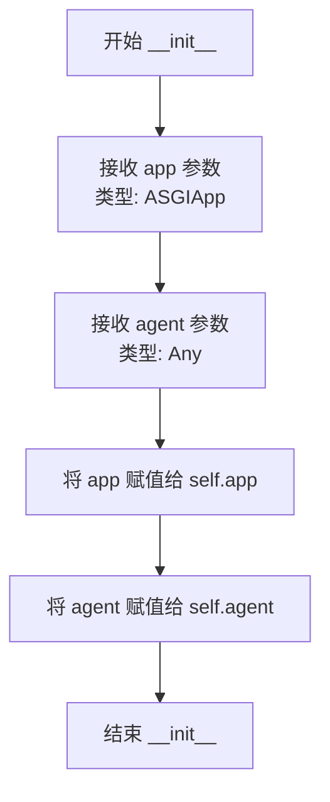
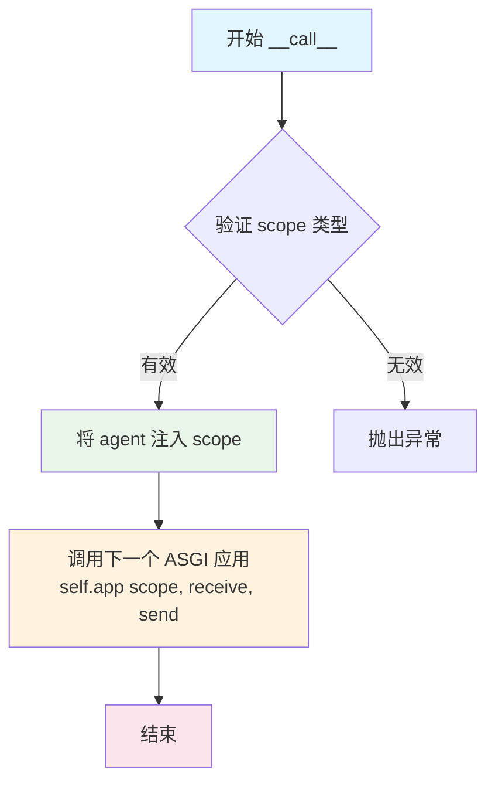

# `.\AutoGPT\classic\forge\forge\agent_protocol\middlewares.py` 详细设计文档

这是一个Starlette中间件类，通过实现ASGI协议将agent实例注入到HTTP请求的scope字典中，使得在FastAPI的路由处理函数中可以通过request['agent']访问到agent实例，实现请求级别的agent共享。

## 整体流程

```mermaid
graph TD
    A[HTTP请求进入] --> B[AgentMiddleware.__call__]
    B --> C[将agent注入到scope字典]
    C --> D[await self.app(scope, receive, send)]
    D --> E[继续传递给下游ASGI应用]
    E --> F[请求处理完成]
```

## 类结构

```
AgentMiddleware (Starlette中间件类)
└── 实现了 ASGI 协议的 __call__ 方法
```

## 全局变量及字段


### `app`
    
ASGI应用实例，由FastAPI自动注入

类型：`ASGIApp`
    


### `agent`
    
要注入到请求scope的agent实例

类型：`Any`
    


### `AgentMiddleware.self.app`
    
ASGI应用实例，由FastAPI自动注入

类型：`ASGIApp`
    


### `AgentMiddleware.self.agent`
    
要注入到请求scope的agent实例

类型：`Any`
    
    

## 全局函数及方法


### `AgentMiddleware.__init__`

初始化中间件，保存app和agent引用，将传入的ASGI应用和代理实例保存为类的实例变量，以便在后续的请求处理中使用。

参数：

-  `app`：`ASGIApp`，FastAPI 应用实例，由 FastAPI 自动注入
-  `agent`：`Any`，要注入到请求作用域中的代理实例

返回值：`None`，无返回值（`__init__` 方法不返回任何内容）

#### 流程图



#### 带注释源码

```python
def __init__(self, app: ASGIApp, agent):
    """
    初始化 AgentMiddleware 实例。

    Args:
        app: FastAPI 应用实例，由 FastAPI 自动注入。
        agent: 要注入到请求作用域中的代理实例。

    Examples:
        >>> from fastapi import FastAPI, Request
        >>> from agent_protocol.agent import Agent
        >>> from agent_protocol.middlewares import AgentMiddleware
        >>> app = FastAPI()
        >>> @app.get("/")
        >>> async def root(request: Request):
        >>>     agent = request["agent"]
        >>>     task = agent.db.create_task("Do something.")
        >>>     return {"task_id": a.task_id}
        >>> agent = Agent()
        >>> app.add_middleware(AgentMiddleware, agent=agent)
    """
    # 保存 ASGI 应用实例到实例变量，供后续 __call__ 方法使用
    self.app = app
    # 保存代理实例到实例变量，以便在请求作用域中注入
    self.agent = agent
```


### `AgentMiddleware.__call__`

这是 ASGI 中间件的核心方法，实现了 ASGI 协议接口。该方法将 agent 实例注入到请求的 scope 中，然后转发请求到下一个 ASGI 应用程序，实现了请求上下文的扩展功能。

参数：

- `scope`：`dict`，ASGI 作用域，包含请求的上下文信息（如路径、方法、请求头、查询参数等）
- `receive`：`Callable[[], Awaitable[dict]]`，ASGI 接收消息的异步回调函数，用于接收客户端发送的请求体数据
- `send`：`Callable[[dict], Awaitable[None]]`，ASGI 发送消息的异步回调函数，用于向客户端发送响应数据

返回值：`None`，ASGI 中间件不直接返回值，而是通过 `send` 回调函数发送响应

#### 流程图



#### 带注释源码

```python
async def __call__(self, scope, receive, send):
    """
    ASGI 协议调用接口，将 agent 注入 scope 后转发请求。
    
    这是 ASGI 中间件的标准接口方法，由 ASGI 服务器（如 Uvicorn、Hypercorn）
    在处理每个请求时调用。该方法充当代理角色，在请求流程中注入 agent 实例，
    然后将控制权传递给下一个 ASGI 应用程序。
    
    Args:
        scope: ASGI 作用域字典，包含请求的元数据和环境信息
        receive: 异步可调用对象，用于接收请求体数据
        send: 异步可调用对象，用于发送响应数据
    
    Returns:
        None: 不直接返回值，通过 send 回调发送响应
    
    Example:
        >>> # FastAPI 自动调用此方法处理请求
        >>> # 请求进入时，scope['agent'] 已被注入
        >>> # 后续的路由处理函数可以通过 request["agent"] 访问
    """
    
    # 步骤 1: 将 agent 实例注入到请求 scope 中
    # 这样后续的请求处理器可以通过 scope["agent"] 访问 agent 实例
    # 这是实现请求级别 agent 共享的核心机制
    scope["agent"] = self.agent
    
    # 步骤 2: 转发请求到下一个 ASGI 应用程序
    # 将修改后的 scope（已包含 agent）和原始的 receive/send 传递下去
    # 下一个中间件或路由处理函数将接收到包含 agent 的 scope
    await self.app(scope, receive, send)
```

## 关键组件


### AgentMiddleware 类

用于将 Agent 实例注入到 ASGI 请求 scope 中的中间件类，实现 ASGI 协议接口。

### __init__ 方法

初始化中间件，接收 ASGI 应用和 Agent 实例，并将它们存储为实例属性。

### __call__ 方法

实现 ASGI 协议的处理方法，在请求时将 agent 实例添加到 scope 字典中，然后转发给下一个 ASGI 应用。

### ASGIApp 类型

来自 starlette.types 的类型注解，表示符合 ASGI 协议的应用 callable。

### scope 字典

ASGI 协议中的请求上下文字典，用于在中间件链中传递共享数据。

### receive 和 send 参数

ASGI 协议的消息接收和发送回调函数，用于处理请求和响应。


## 问题及建议


### 已知问题

- **缺少类型注解**：`__init__` 方法的 `agent` 参数缺少类型注解，影响代码可读性和IDE支持
- **无错误处理**：`__call__` 方法未包含异常处理逻辑，中间件执行失败时会导致请求直接崩溃
- **键名硬编码**：scope 键名 `"agent"` 写死，若请求 scope 中已存在同名键会造成覆盖，引发难以追踪的bug
- **无生命周期管理**：缺少 agent 实例的初始化和销毁逻辑，无法保证资源正确释放
- **文档示例错误**：示例代码中变量名不一致，使用了 `a.task_id` 但实际变量名为 `task`
- **无并发安全保证**：未说明 agent 实例是否线程安全，在高并发场景下可能存在状态共享问题

### 优化建议

- 为 `agent` 参数添加类型注解，如 `agent: Any` 或更具体的类型
- 在 `__call__` 方法中添加 try-except 块处理异常，提升中间件健壮性
- 提供可配置的 scope 键名参数，支持自定义且避免命名冲突，如 `scope_key: str = "agent"`
- 考虑实现 `__aenter__` 和 `__aexit__` 方法或提供生命周期钩子，管理 agent 资源
- 修正文档示例中的变量名错误
- 添加对 agent 实例是否为协程的判断逻辑，确保异步兼容性

## 其它


### 设计目标与约束

本中间件的设计目标是在 FastAPI/Starlette 应用中，将 Agent 实例注入到每个请求的 scope 中，使得路由处理函数可以通过 `request["agent"]` 访问该实例。约束条件：1) 必须与 ASGI 协议兼容；2) 依赖 FastAPI 的中间件注入机制；3) agent 实例在应用生命周期内保持单例。

### 错误处理与异常设计

本中间件本身不处理业务逻辑错误，异常由下游的请求处理函数或 ASGI 应用捕获。如果 agent 实例为 None 或未正确初始化，可能导致下游代码访问 `scope["agent"]` 时出现 KeyError，建议在应用启动时进行参数校验。

### 数据流与状态机

请求流程：1) 客户端发送 HTTP 请求；2) FastAPI 调用中间件 `__call__` 方法；3) 中间件将 agent 注入到 scope 字典；4) 调用下一个 ASGI 应用；5) 路由处理函数通过 Request 对象访问 agent；6) 响应返回客户端。无复杂状态机设计。

### 外部依赖与接口契约

依赖项：1) `starlette.types.ASGIApp` - ASGI 应用接口；2) `agent` - 自定义 Agent 实例，需具备业务方法（如 `db.create_task`）。接口契约：agent 对象需支持通过 `scope["agent"]` 访问，且在请求周期内保持可用。

### 性能考虑

中间件开销极低，仅执行字典赋值操作。agent 实例在应用启动时创建，请求处理时共享复用，无额外内存开销。建议避免在中间件中执行耗时操作。

### 安全性考虑

agent 实例被注入到所有请求的 scope 中，需确保：1) agent 不包含敏感信息或已做好隔离；2) 下游代码正确验证 agent 可用性；3) 考虑添加 agent 访问权限控制机制。

### 并发与线程安全

本中间件为 ASGI 应用，天然支持并发。agent 实例在多协程间共享，需确保 Agent 类本身是协程安全的。由于仅进行 scope 赋值操作，中间件本身无竞态条件。

### 兼容性考虑

兼容 Starlette 和 FastAPI 0.100+ 版本。要求 Python 3.7+ 以支持字典解包语法（虽然当前代码未使用）。ASGI 规范版本：HTTP 和 WebSocket 协议。

### 测试策略

建议测试：1) 中间件正确将 agent 注入 scope；2) 多并发请求下 agent 可正确访问；3) agent 为 None 时的行为；4) 与 FastAPI 路由集成测试。可使用 `pytest` + `httpx` 或 `starlette.testclient`。

### 使用示例与扩展

基础用例如代码注释所示。扩展方向：1) 添加条件注入（仅特定路径）；2) 支持多 agent 实例按路由分发；3) 添加 agent 生命周期管理；4) 集成日志与监控。


    