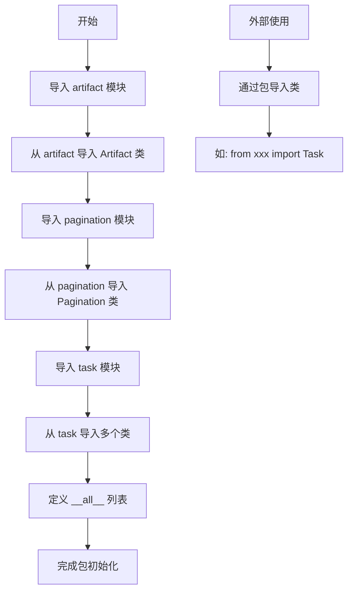

# `.\AutoGPT\classic\forge\forge\agent_protocol\models\__init__.py` 详细设计文档

这是一个数据模型的包初始化文件，它从子模块（artifact、pagination、task）中导入各种数据模型类，并通过 __all__ 列表统一导出，形成一个清晰的公共API接口供外部使用。

## 整体流程



## 类结构

```

```

## 全局变量及字段


### `__all__`
    
定义了模块的公共API接口，列出所有允许被外部导入的类和函数

类型：`list`
    


    

## 全局函数及方法


## 关键组件


### Artifact

表示任务执行过程中产生的工件/文件对象，用于管理任务的输出产物

### Pagination

分页组件，用于处理列表查询时的分页逻辑，支持大规模数据的分页加载

### Task

核心任务实体，代表一个完整的工作单元，包含任务的基本信息和状态管理

### Step

任务步骤实体，表示任务执行过程中的单个步骤，支持步骤级别的状态追踪

### StepStatus

步骤状态枚举，定义步骤的可能状态（如pending、running、completed、failed等）

### TaskRequestBody

任务请求体，用于创建或更新任务时的数据结构封装

### StepRequestBody

步骤请求体，用于创建或更新步骤时的数据结构封装

### TaskListResponse

任务列表响应，包含任务集合及分页信息的响应对象

### TaskStepsListResponse

任务步骤列表响应，包含指定任务的所有步骤及分页信息的响应对象

### TaskArtifactsListResponse

任务工件列表响应，包含指定任务的所有工件及分页信息的响应对象


## 问题及建议


### 已知问题

-   **缺乏模块级文档字符串**：该 `__init__.py` 文件没有模块文档说明，不清楚该模块的用途和职责
-   **直接重导出无封装**：所有类直接从子模块导入并重新导出，未进行任何抽象或封装，导致子模块接口变化会直接影响使用者
-   **手动维护 `__all__` 列表**：导出列表需要手动维护，容易遗漏或多余，且无法自动同步子模块变化
-   **缺少错误处理**：如果子模块不存在或导入失败，会直接抛出 `ImportError`，缺乏优雅的错误提示
-   **缺乏版本控制**：未提供模块版本信息，无法追踪兼容性
-   **无类型注解**：模块级别缺少类型提示，不利于静态分析和IDE支持

### 优化建议

-   添加模块级文档字符串，说明该模块为任务与Artifact管理相关的数据模型集合
-   考虑使用 `__getattr__` 实现动态导入，减少手动维护 `__all__` 的工作量和同步成本
-   添加可选依赖的异常处理，使用 `try-except` 包装导入语句，提供更友好的错误信息
-   在模块级别添加 `__version__` 变量来管理版本
-   考虑提供版本兼容性检查或废弃警告机制
-   如有需要，可添加常用的组合类型或工厂方法，提升API易用性


## 其它


### 设计目标与约束

本模块作为任务与工件管理系统的Python客户端SDK，提供对任务(step)、工件(artifact)等核心资源的CRUD操作接口。设计目标包括：1) 提供类型安全的API封装；2) 支持分页查询；3) 与异步任务系统解耦。约束方面，仅支持Python 3.8+环境，依赖标准库及项目内部模块。

### 错误处理与异常设计

本模块本身未定义自定义异常，错误处理依赖于调用方。由于导入的类来自内部模块(artifact、pagination、task)，若这些模块抛出异常，应在调用层捕获并处理。建议在SDK层面统一封装API错误(如网络超时、认证失败、资源不存在)为自定义异常类，继承自Exception或requests模块的异常体系。

### 数据流与状态机

数据流主要遵循：外部调用→SDK类方法→HTTP请求→解析响应→返回模型对象。TaskStatus枚举定义了任务状态流转(待定义具体状态值)。分页(Pagination)贯穿列表查询场景，包含页码、每页数量、总计数等状态信息。

### 外部依赖与接口契约

本模块直接依赖内部模块：artifact.Artifact、pagination.Pagination、task模块下的多个数据模型类。间接依赖可能包括：1) HTTP客户端库(如requests或httpx)用于实际API调用；2) pydantic或dataclass用于数据验证。接口契约方面，外部调用方通过导入SDK类并实例化使用，传入TaskRequestBody等请求对象，获取TaskListResponse等响应对象。

### 性能考虑

模块本身为轻量级导入，未包含性能敏感逻辑。潜在优化点：1) 对于大批量数据查询，考虑流式处理或生成器模式；2) Pagination可支持游标分页以提升大数据集性能；3) 考虑缓存机制以减少重复查询。

### 安全性考虑

本模块不直接处理敏感信息，但SDK使用者应注意：1) API认证凭证的安全存储；2) 敏感数据(如工件内容)的加密传输；3) 防止请求伪造攻击。建议在文档中明确安全使用规范。

### 测试策略

建议测试覆盖：1) 单元测试：各数据模型类的序列化/反序列化；2) 集成测试：模拟API响应进行完整流程测试；3) 边界测试：空数据、分页边界、异常响应处理。可使用unittest/pytest框架及requests-mock等模拟库。

### 版本控制和兼容性

遵循语义化版本号(MAJOR.MINOR.PATCH)。当前版本号未显式体现。建议：1) 在__init__.py或独立version.py中定义版本；2) 重大API变更递增MAJOR版本；3) 新增非废弃功能递增MINOR版本；4) Bug修复递增PATCH版本。保持对Python 3.8+的向后兼容。

### 使用示例

```python
from my_sdk import Task, TaskRequestBody, TaskListResponse

# 创建任务请求
request_body = TaskRequestBody(name="example_task", description="test")

# 列表查询
response = Task.list(page=1, page_size=10)
for task in response.items:
    print(task.id, task.name)
```

### 配置与扩展点

可通过环境变量或配置文件设置：1) API基础URL；2) 超时时间；3) 重试策略。扩展点包括：1) 自定义HTTP客户端注入；2) 拦截器机制(请求/响应日志)；3) 插件化支持更多资源类型。

    