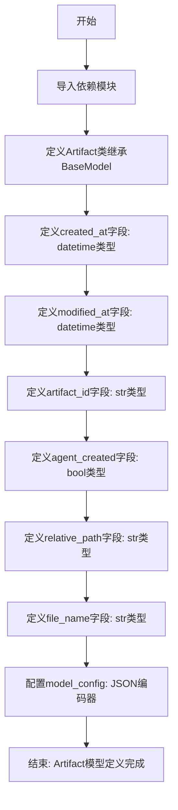
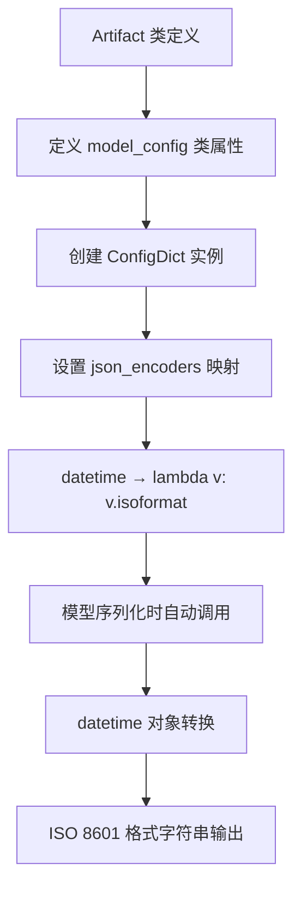
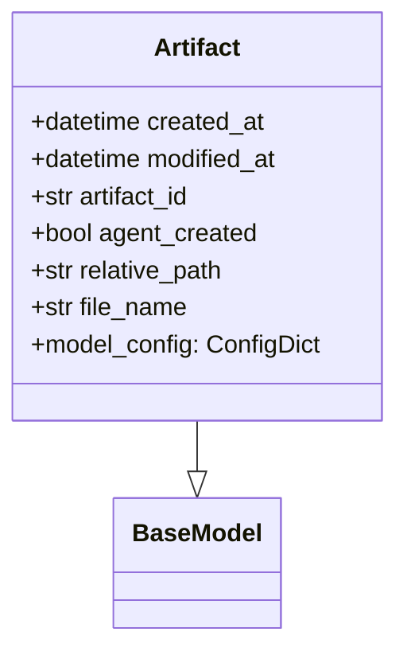

# `.\AutoGPT\classic\forge\forge\agent_protocol\models\artifact.py` 详细设计文档

该代码定义了一个名为Artifact的Pydantic数据模型，用于表示工件（artifact）的基本信息，包含创建时间、修改时间、工件ID、是否由agent创建、相对路径和文件名等属性，并配置了datetime类型的JSON序列化方式。

## 整体流程



## 类结构

```
BaseModel (pydantic.abstract_base.abstract_base)
└── Artifact (工件数据模型)
```

## 全局变量及字段


### `Artifact.created_at`
    
工件的创建时间

类型：`datetime`
    


### `Artifact.modified_at`
    
工件的修改时间

类型：`datetime`
    


### `Artifact.artifact_id`
    
工件的唯一标识符

类型：`str`
    


### `Artifact.agent_created`
    
工件是否由agent创建

类型：`bool`
    


### `Artifact.relative_path`
    
工件在agent工作空间中的相对路径

类型：`str`
    


### `Artifact.file_name`
    
工件的文件名

类型：`str`
    


### `Artifact.model_config`
    
模型配置属性（继承自BaseModel），用于定义JSON编码器等配置

类型：`ConfigDict`
    
    

## 全局函数及方法


### `Artifact.model_config`

模型配置属性，定义了 Pydantic BaseModel 的全局配置，包括 JSON 编码器的自定义行为，用于将 datetime 对象序列化为 ISO 8601 格式字符串。

参数：

- 无自定义参数（继承自 Pydantic BaseModel 的 model_config）

返回值：`ConfigDict`，返回包含 JSON 编码器配置的配置字典对象

#### 流程图



#### 带注释源码

```python
from datetime import datetime

from pydantic import BaseModel, ConfigDict, Field


class Artifact(BaseModel):
    """Pydantic 模型类，用于表示工件/文件对象"""
    
    created_at: datetime = Field(
        description="The creation datetime of the task.",
        examples=["2023-01-01T00:00:00Z"],
    )
    modified_at: datetime = Field(
        description="The modification datetime of the task.",
        examples=["2023-01-01T00:00:00Z"],
    )
    artifact_id: str = Field(
        description="ID of the artifact.",
        examples=["b225e278-8b4c-4f99-a696-8facf19f0e56"],
    )
    agent_created: bool = Field(
        description="Whether the artifact has been created by the agent.",
        examples=[False],
    )
    relative_path: str = Field(
        description="Relative path of the artifact in the agents workspace.",
        examples=["/my_folder/my_other_folder/"],
    )
    file_name: str = Field(
        description="Filename of the artifact.",
        examples=["main.py"],
    )

    # 模型配置属性：定义 Pydantic 序列化行为
    # json_encoders 指定自定义的 JSON 编码转换器
    # 此处配置 datetime 类型使用 isoformat() 方法转换为字符串
    model_config = ConfigDict(
        json_encoders={datetime: lambda v: v.isoformat()},
    )
```

## 关键组件


### 一段话描述

该代码定义了一个 Pydantic 数据模型 `Artifact`，用于表示工作空间中的工件（文件），包含创建/修改时间、ID、是否由 Agent 创建、相对路径和文件名等元数据信息，并配置了 datetime 类型的 JSON 序列化方式。

### 文件的整体运行流程

该代码为单文件定义模块，无需执行流程。定义后的 `Artifact` 类可被其他模块导入并实例化，用于验证和序列化工件元数据。

### 类的详细信息

#### Artifact 类

**类字段：**

| 字段名称 | 类型 | 描述 |
|---------|------|------|
| created_at | datetime | 工件的创建时间 |
| modified_at | datetime | 工件的修改时间 |
| artifact_id | str | 工件的唯一标识符 |
| agent_created | bool | 标记该工件是否由 Agent 创建 |
| relative_path | str | 工件在 Agent 工作空间中的相对路径 |
| file_name | str | 工件的文件名 |

**类方法：**

该类继承自 Pydantic 的 `BaseModel`，未定义自定义方法，所有行为继承自父类。

**mermaid 流程图：**



**带注释源码：**

```python
from datetime import datetime

from pydantic import BaseModel, ConfigDict, Field


class Artifact(BaseModel):
    """表示工作空间中工件/文件的数据模型"""
    
    created_at: datetime = Field(
        description="The creation datetime of the task.",
        examples=["2023-01-01T00:00:00Z"],
    )
    modified_at: datetime = Field(
        description="The modification datetime of the task.",
        examples=["2023-01-01T00:00:00Z"],
    )
    artifact_id: str = Field(
        description="ID of the artifact.",
        examples=["b225e278-8b4c-4f99-a696-8facf19f0e56"],
    )
    agent_created: bool = Field(
        description="Whether the artifact has been created by the agent.",
        examples=[False],
    )
    relative_path: str = Field(
        description="Relative path of the artifact in the agents workspace.",
        examples=["/my_folder/my_other_folder/"],
    )
    file_name: str = Field(
        description="Filename of the artifact.",
        examples=["main.py"],
    )

    # 配置模型行为：datetime 序列化为 ISO 格式字符串
    model_config = ConfigDict(
        json_encoders={datetime: lambda v: v.isoformat()},
    )
```

### 关键组件信息

### Pydantic BaseModel

Pydantic 基础模型类，提供数据验证、序列化和反序列化功能。

### Field 函数

Pydantic 字段装饰器，用于定义字段的元数据，包括描述信息和示例值。

### ConfigDict 配置对象

用于配置 Pydantic 模型的运行时行为，本例中用于自定义 JSON 编码器。

### datetime 类型

Python 标准库日期时间类型，用于存储创建和修改时间戳。

### model_config JSON 编码器

自定义 datetime 对象的序列化逻辑，将 datetime 转换为 ISO 格式字符串。

### 潜在的技术债务或优化空间

1. **字段验证缺失**：当前仅使用基本的 Field 定义，缺少对字段值的验证规则（如 artifact_id 的 UUID 格式验证、relative_path 的路径格式验证）。
2. **缺乏业务逻辑**：该类仅作为数据传输对象（DTO），可考虑添加属性方法（property）如 `full_path` 拼接完整路径。
3. **示例值重复**：datetime 字段的示例值硬编码为固定字符串，可考虑动态生成。
4. **缺少索引标记**：若用于数据库存储，应为 artifact_id 添加索引相关配置。

### 其它项目

**设计目标与约束：**
- 目标：定义标准化的工件元数据结构
- 约束：依赖 Pydantic 库，需保持与 Pydantic v2 的兼容性

**错误处理与异常设计：**
- 继承 Pydantic 的内置验证机制，字段类型不匹配或值不符合约束时抛出 ValidationError

**数据流与状态机：**
- 该类为静态数据结构，无状态机设计；数据流方向为 JSON/字典 → Artifact 实例 → JSON 序列化输出

**外部依赖与接口契约：**
- 依赖 `pydantic` >= 2.0 和 Python `datetime` 模块
- 提供 `.model_dump_json()` 方法用于 JSON 序列化输出


## 问题及建议


### 已知问题

-   **字段验证不足**：`artifact_id` 未验证UUID格式，`relative_path` 和 `file_name` 缺乏路径格式校验
-   **datetime时区处理不明确**：未指定datetime为aware还是naive，可能导致时区相关问题
-   **model_config配置过时**：Pydantic v2中`json_encoders`已弃用，应使用`json_serializer`
-   **业务逻辑缺失**：未验证`created_at`与`modified_at`的时间逻辑关系（modified_at应不早于created_at）
-   **相对路径示例矛盾**：示例值为`/my_folder/my_other_folder/`（绝对路径格式），但字段描述为"relative path"

### 优化建议

-   **添加字段验证器**：使用`field_validator`验证`artifact_id`为有效UUID格式，验证`relative_path`和`file_name`的格式合法性
-   **明确时区处理**：使用`datetime[timezone]`类型提示，或在ConfigDict中设置`ser_json_tz=True`统一时区处理
-   **更新Pydantic配置**：将`json_encoders`替换为`json_serializer`
-   **添加业务逻辑验证**：实现`model_validator`验证时间字段的逻辑关系
-   **统一路径示例**：修正`relative_path`示例为相对路径格式，或根据实际用途调整为`Path`类型
-   **考虑字段类型优化**：将`file_name`和`relative_path`考虑使用`Path`类型以获得更好的类型安全和路径操作能力

## 其它


### 设计目标与约束

本代码的核心目标是定义一个标准化的Artifact（工件）数据模型，用于在系统中表示文件的元数据信息。该模型基于Pydantic框架，利用其内置的数据验证和序列化能力，确保数据的一致性和完整性。设计约束包括：必须遵循Pydantic v2的API规范，datetime字段需要支持ISO格式序列化，模型需要兼容JSON数据格式的导入导出。

### 错误处理与异常设计

该模型本身不直接处理业务逻辑错误，错误处理主要依赖Pydantic框架的验证机制。当传入的字段类型不符合定义时，Pydantic会抛出ValidationError。datetime字段的序列化通过自定义json_encoders处理，确保格式转换的一致性。模型层面的异常主要包括：数据类型不匹配、必填字段缺失、格式验证失败等。

### 数据流与状态机

Artifact对象作为数据模型，主要参与数据的输入、验证、序列化和反序列化流程。数据流方向为：外部JSON/字典输入 → Pydantic验证 → 模型实例化 → JSON序列化输出。模型本身不维护状态机，其状态由created_at和modified_at两个时间戳字段记录。

### 外部依赖与接口契约

本代码依赖两个外部库：pydantic（提供数据验证和模型定义能力）和datetime（Python标准库）。接口契约方面，该模型需要接收符合以下规范的数据：created_at和modified_at为ISO格式datetime字符串，artifact_id为UUID格式字符串，agent_created为布尔值，relative_path和file_name为字符串类型。输出时datetime字段会自动转换为ISO格式字符串。

### 配置与扩展性

模型通过model_config配置了自定义的JSON编码器，支持datetime对象的ISO格式序列化。ConfigDict使用了pydantic的现代配置方式（pydantic v2），保留了未来扩展的可能性。Field参数中包含description和examples，提供了良好的API文档支持，便于自动化文档生成和代码提示。

### 使用场景与集成点

该Artifact模型通常用于：工作流系统中记录agent生成的文件信息、文件管理系统中作为文件元数据的载体、任务追踪系统中关联任务与产出物。集成点包括：与数据库ORM模型映射、与API请求/响应序列化集成、与消息队列数据传输格式兼容。

### 版本兼容性说明

该代码使用Pydantic v2的API，包括ConfigDict和Field的新用法。与Pydantic v1不兼容，v1使用的是class Config形式。datetime的json_encoders配置也是v2的新写法，v1使用json_encoders类属性。Python版本要求至少为3.7以支持dataclass和类型注解。


    