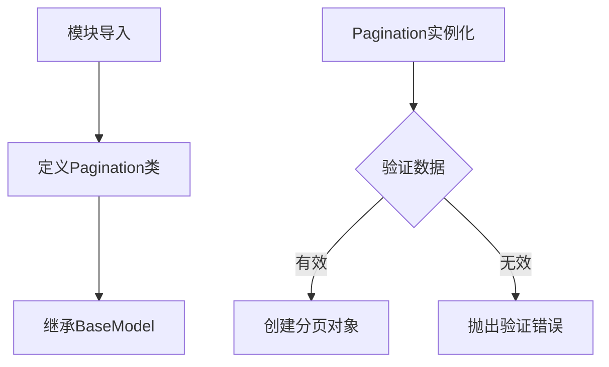
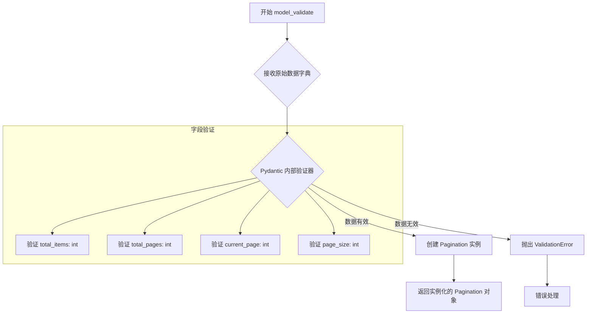
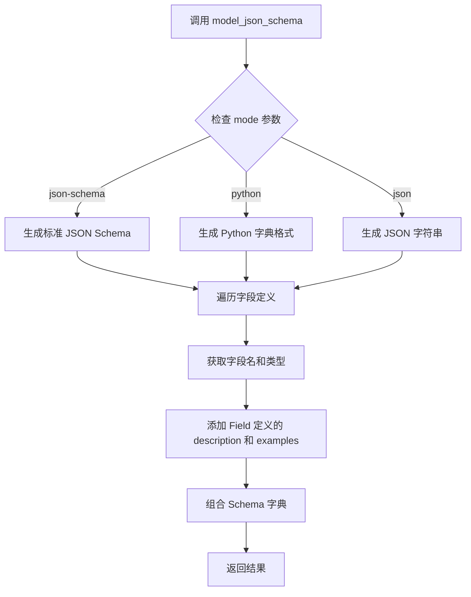

# `.\AutoGPT\classic\forge\forge\agent_protocol\models\pagination.py` 详细设计文档

该文件定义了一个用于分页信息的Pydantic数据模型类 Pagination，包含总条目数、总页数、当前页码和每页条目数四个字段，用于在API响应中传递分页元数据。

## 整体流程



## 类结构

```
BaseModel (pydantic基类)
└── Pagination (分页数据模型)
```

## 全局变量及字段


### `Pagination`
    
分页模型，用于表示分页信息

类型：`class`
    


### `Pagination.total_items`
    
总条目数

类型：`int`
    


### `Pagination.total_pages`
    
总页数

类型：`int`
    


### `Pagination.current_page`
    
当前页码

类型：`int`
    


### `Pagination.page_size`
    
每页条目数

类型：`int`
    
    

## 全局函数及方法


### `Pagination.model_dump()`

将 Pydantic 模型实例序列化为 Python 字典对象的方法。该方法继承自 Pydantic 的 BaseModel 基类，用于将当前分页对象的所有字段及其值导出为字典格式，支持多种序列化选项（如别名处理、排除/包含字段等）。

参数：

- `self`：`Pagination`，隐式参数，当前 Pagination 实例本身
- `mode`：`str`，可选，序列化模式。`'python'` 返回 Python 原生类型（默认），`'json'` 返回 JSON 兼容类型，`'legacy'` 兼容旧版本行为
- `exclude`：`AbstractSet[str] | Mapping[Any, Any]`，可选，需要排除的字段集合或字典映射
- `include`：`AbstractSet[str] | Mapping[Any, Any]`，可选，需要包含的字段集合或字典映射
- `by_alias`：`bool`，可选，是否使用字段别名作为键（默认 `False`）
- `exclude_unset`：`bool`，可选，是否排除未设置值的字段（默认 `False`）
- `exclude_defaults`：`bool`，可选，是否排除使用默认值的字段（默认 `False`）
- `exclude_none`：`bool`，可选，是否排除值为 `None` 的字段（默认 `False`）
- `round_trip`：`bool`，可选，是否启用往返序列化校验（默认 `False`）
- `context`：`dict[str, Any]`，可选，传递给自定义序列化器的额外上下文

返回值：`dict[str, Any]`，返回一个包含模型所有字段及其值的字典对象

#### 流程图

```mermaid
flowchart TD
    A[调用 model_dump 方法] --> B{检查序列化模式 mode}
    B -->|json| C[转换为JSON兼容类型]
    B -->|python| D[保持Python原生类型]
    B -->|legacy| E[使用旧版序列化逻辑]
    
    C --> F{by_alias?}
    D --> F
    E --> F
    
    F -->|True| G[使用字段别名作为键]
    F -->|False[使用原始字段名作为键]
    
    G --> H{处理排除/包含规则}
    H -->|exclude| I[移除指定字段]
    H -->|include| J[只保留指定字段]
    H -->|无| K[保留所有字段]
    
    I --> L{处理特殊值}
    J --> L
    K --> L
    
    L -->|exclude_unset| M[移除未赋值字段]
    L -->|exclude_defaults| N[移除默认值字段]
    L -->|exclude_none| O[移除None值字段]
    L -->|无| P[不做额外处理]
    
    M --> Q[返回字典]
    N --> Q
    O --> Q
    P --> Q
    
    Q --> R[结束]
```

#### 带注释源码

```python
# Pydantic BaseModel 中的 model_dump() 方法源码结构示例
# 实际实现位于 pydantic.main 模块中

def model_dump(
    self,
    *,
    mode: str = "python",          # 序列化模式：'python' | 'json' | 'legacy'
    exclude: AbstractSet[str] | Mapping[Any, Any] = None,  # 排除的字段
    include: AbstractSet[str] | Mapping[Any, Any] = None,  # 包含的字段
    by_alias: bool = False,        # 是否使用别名作为键
    exclude_unset: bool = False,   # 排除未设置的字段
    exclude_defaults: bool = False, # 排除默认值的字段
    exclude_none: bool = False,    # 排除None值的字段
    round_trip: bool = False,      # 往返校验
    context: dict[str, Any] = None, # 额外上下文
) -> dict[str, Any]:
    """
    将模型实例序列化为字典
    
    Args:
        self: 当前模型实例
        mode: 序列化模式
            - 'python': 返回Python原生类型（dict, list, int, str等）
            - 'json': 返回JSON兼容类型（所有值都会经过json.dumps转换）
            - 'legacy': 兼容旧版本行为
        exclude: 需要排除的字段集合或映射
        include: 需要包含的字段集合或映射
        by_alias: 是否使用字段别名作为字典键
        exclude_unset: 是否排除未显式设置值的字段
        exclude_defaults: 是否排除使用默认值的字段
        exclude_none: 是否排除值为None的字段
        round_trip: 是否进行往返序列化校验
        context: 传递给序列化器的额外上下文
    
    Returns:
        包含模型字段和值的字典对象
    """
    # 1. 获取所有字段定义
    fields = self.model_fields
    
    # 2. 根据 include/exclude 规则过滤字段
    # 3. 遍历每个字段，获取其值
    # 4. 根据 mode 参数进行类型转换
    # 5. 应用 by_alias 规则确定字典键名
    # 6. 根据 exclude_unset/exclude_defaults/exclude_none 过滤
    # 7. 返回最终的字典
    
    # 示例返回结果:
    # {
    #     "total_items": 42,
    #     "total_pages": 97,
    #     "current_page": 1,
    #     "page_size": 25
    # }
    
    # 使用示例:
    # pagination = Pagination(total_items=42, total_pages=97, current_page=1, page_size=25)
    # pagination.model_dump()
    # # 输出: {'total_items': 42, 'total_pages': 97, 'current_page': 1, 'page_size': 25}
    #
    # pagination.model_dump(by_alias=True, exclude_none=True)
    # # 输出: {'totalItems': 42, 'totalPages': 97, 'currentPage': 1, 'pageSize': 25}
```


### `Pagination.model_validate()`

从字典或类似字典的数据验证并创建 Pagination 实例的类方法（继承自 Pydantic BaseModel）。该方法接收原始数据字典，根据模型定义进行类型验证和转换，并返回一个有效的 Pagination 实例。如果数据不符合模型定义，将抛出验证错误。

参数：

-  `data`：`dict` 或 `Any`，需要验证的字典数据或类似字典的对象，包含分页相关的原始数据
-  `*args`：可变位置参数，继承自父类 BaseModel.model_validate() 的额外参数
-  `**kwargs`：可变关键字参数，继承自父类 BaseModel.model_validate() 的额外关键字参数

返回值：`Pagination`，验证并实例化后的分页对象，包含了经验证的 total_items、total_pages、current_page 和 page_size 字段

#### 流程图



#### 带注释源码

```python
from pydantic import BaseModel, Field


class Pagination(BaseModel):
    """
    分页信息模型类，继承自 Pydantic BaseModel。
    用于表示分页查询结果的元数据信息。
    """
    
    # 总条目数字段，类型为整数
    total_items: int = Field(
        description="Total number of items.",  # 字段描述：总条目数
        examples=[42]  # 示例值：42
    )
    
    # 总页数字段，类型为整数
    total_pages: int = Field(
        description="Total number of pages.",  # 字段描述：总页数
        examples=[97]  # 示例值：97
    )
    
    # 当前页码字段，类型为整数
    current_page: int = Field(
        description="Current_page page number.",  # 字段描述：当前页码
        examples=[1]  # 示例值：1
    )
    
    # 每页条目数字段，类型为整数
    page_size: int = Field(
        description="Number of items per page.",  # 字段描述：每页条目数
        examples=[25]  # 示例值：25
    )


# 使用示例：
# valid_data = {
#     "total_items": 100,
#     "total_pages": 10,
#     "current_page": 1,
#     "page_size": 10
# }
# pagination = Pagination.model_validate(valid_data)
# # 或使用 model_validate_json 从 JSON 字符串验证
# pagination = Pagination.model_validate_json(json_string)
```


### `Pagination.model_json_schema`

获取 Pagination 类的 JSON Schema 表示，用于描述分页数据结构的标准 JSON Schema。

参数：

- `mode`：`Literal['python', 'json', 'json-schema']`，指定输出模式，默认为 'json-schema'，'python' 返回 Python 字典，'json' 返回 JSON 字符串
- `title`：`Optional[str]`，可选的 schema 标题
- `description`：`Optional[str]`，可选的 schema 描述
- `by_alias`：`bool`，是否使用别名，默认为 True
- `ref_template`：`str`，引用模板，默认为 '{model}.{field}'
- `schema_generator`：`Type[GenerateJsonSchema]`，JSON Schema 生成器类

返回值：`Dict[str, Any]`，返回 Pagination 模型的 JSON Schema 字典表示

#### 流程图



#### 带注释源码

```python
from pydantic import BaseModel, Field
from typing import Dict, Any, Literal, Optional, Type
from pydantic.json_schema import GenerateJsonSchema


class Pagination(BaseModel):
    """
    分页模型定义
    
    用于表示分页信息的标准数据结构，包含总数、页数、当前页和每页大小
    """
    total_items: int = Field(description="Total number of items.", examples=[42])
    total_pages: int = Field(description="Total number of pages.", examples=[97])
    current_page: int = Field(description="Current_page page number.", examples=[1])
    page_size: int = Field(description="Number of items per page.", examples=[25])

    def model_json_schema(
        cls,
        mode: Literal['python', 'json', 'json-schema'] = 'json-schema',
        title: Optional[str] = None,
        description: Optional[str] = None,
        by_alias: bool = True,
        ref_template: str = '{model}.{field}',
        schema_generator: Type[GenerateJsonSchema] = GenerateJsonSchema,
        # ... 更多可选参数
    ) -> Dict[str, Any]:
        """
        生成此模型的 JSON Schema
        
        Pydantic BaseModel 的内置方法，自动收集所有字段的 type、description、examples 等信息，
        生成符合 JSON Schema 标准的字典结构，用于 API 文档生成、请求验证等场景。
        
        Returns:
            Dict[str, Any]: 包含以下关键结构的字典:
                - type: "object"
                - properties: 各字段的 schema 定义
                - required: 必填字段列表
                - description: 模型描述 (如果有)
        """
        # 内部实现由 Pydantic 框架提供
        pass
```

## 关键组件


### Pagination 类

分页数据模型，用于封装分页查询结果的相关信息，包括总条目数、总页数、当前页码和每页大小。

### total_items 字段

总条目数，表示查询结果的总数量，用于客户端了解数据规模。

### total_pages 字段

总页数，基于总条目数和每页大小计算得出，用于分页导航。

### current_page 字段

当前页码，表示当前所在的页数，从1开始计数。

### page_size 字段

每页大小，定义每页显示的条目数量，用于分页计算。


## 问题及建议


### 已知问题

-   **字段描述错误**: `current_page`字段的description存在拼写错误，写成了"Current_page page number"，应改为"Current page number"
-   **缺少数据验证**: 没有对分页数据的合理性进行验证，如`current_page`应在1到`total_pages`之间、`page_size`应大于0、`total_items`应大于等于0等
-   **缺少一致性校验**: 没有验证`total_pages`与`total_items`和`page_size`之间的数学一致性（如`total_pages`应该等于`ceil(total_items / page_size)`）
-   **缺少默认值**: 所有字段都没有默认值，在实例化时必须提供全部四个参数，不够灵活

### 优化建议

-   **修复描述文字**: 将`current_page`的description修正为"Current page number."
-   **添加Pydantic验证器**: 使用`Field`的`gt`、`ge`、`le`等参数添加数值范围约束，或使用`validator`装饰器添加业务逻辑验证
-   **添加计算属性**: 可以添加一个计算属性或类方法，根据`total_items`和`page_size`自动计算`total_pages`
-   **提供默认值或可选字段**: 根据实际业务需求，为某些字段提供合理的默认值或将部分字段设为可选
-   **添加正整数约束**: 考虑使用`Field(gt=0)`确保`page_size`和`total_items`为正整数
-   **增强文档注释**: 为类添加docstring，说明该模型用于API分页响应

## 其它


### 设计目标与约束

本模块旨在提供标准化的分页数据模型，支持RESTful API的分页响应结构。设计约束包括：字段类型必须为整数（int），所有字段均为必填，当前页码不能超过总页数，每页大小需在合理范围内（通常1-100）。

### 错误处理与异常设计

本模型使用Pydantic内置的验证机制，当传入无效数据时自动抛出ValidationError。验证规则包括：total_items和total_pages必须>=0，current_page必须>=1，page_size必须>=1。当current_page大于total_pages时，视为无效状态。

### 数据流与状态机

数据流从数据库查询结果或业务逻辑层传入，经过本模型验证后输出标准的分页响应结构。状态转换：初始状态（空分页）→数据填充状态→序列化输出状态。

### 外部依赖与接口契约

核心依赖为pydantic>=2.0。接口契约：接收字典或关键字参数构造实例，输出为字典或JSON格式。示例输入：{"total_items":100,"total_pages":4,"current_page":1,"page_size":25}。

### 性能考虑

本模型为轻量级数据类，验证开销极低。序列化性能依赖Pydantic内部实现，在常规API场景下可忽略不计。

### 安全性考虑

本模型仅包含整数类型字段，无敏感信息泄露风险。需确保外部输入经过适当清理后再传入模型。

### 兼容性考虑

当前版本基于Pydantic v2设计，不兼容Pydantic v1。字段命名遵循Python snake_case规范，便于Python生态集成。

### 测试策略

建议测试用例包括：正常构造实例、边界值验证（0和1）、超出范围值验证、类型错误验证、JSON序列化/反序列化、示例值验证。

### 使用示例

```python
# 构造分页对象
pagination = Pagination(
    total_items=100,
    total_pages=4,
    current_page=1,
    page_size=25
)

# 转换为字典
pagination_dict = pagination.model_dump()

# 转换为JSON
pagination_json = pagination.model_dump_json()
```

### 版本历史和变更记录

v1.0.0（初始版本）：创建基础分页模型，包含4个核心字段及Pydantic Field描述和示例值。


    