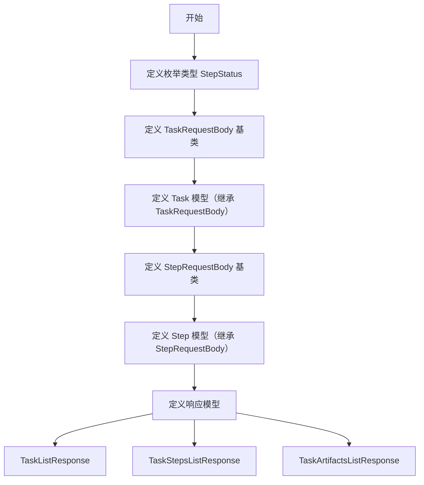

# `.\AutoGPT\classic\forge\forge\agent_protocol\models\task.py` 详细设计文档

定义了任务和步骤的数据模型，使用Pydantic框架进行数据验证和序列化，包含Task、Step及其请求/响应模型，用于API数据传输和状态管理。

## 整体流程



## 类结构

```
TaskRequestBody (基类)
├── Task (继承 TaskRequestBody)
└── StepRequestBody (基类)
    └── Step (继承 StepRequestBody)
StepStatus (枚举类)
TaskListResponse (响应类)
TaskStepsListResponse (响应类)
TaskArtifactsListResponse (响应类)
```

## 全局变量及字段


### `TaskRequestBody.input`
    
Input prompt for the task.

类型：`str`
    


### `TaskRequestBody.additional_input`
    
Additional input parameters for the task.

类型：`dict[str, Any]`
    


### `Task.created_at`
    
The creation datetime of the task.

类型：`datetime`
    


### `Task.modified_at`
    
The modification datetime of the task.

类型：`datetime`
    


### `Task.task_id`
    
The ID of the task.

类型：`str`
    


### `Task.artifacts`
    
A list of artifacts that the task has produced.

类型：`list[Artifact]`
    


### `StepRequestBody.name`
    
The name of the task step.

类型：`Optional[str]`
    


### `StepRequestBody.input`
    
Input prompt for the step.

类型：`str`
    


### `StepRequestBody.additional_input`
    
Additional input parameters for the step.

类型：`dict[str, Any]`
    


### `Step.created_at`
    
The creation datetime of the task.

类型：`datetime`
    


### `Step.modified_at`
    
The modification datetime of the task.

类型：`datetime`
    


### `Step.task_id`
    
The ID of the task this step belongs to.

类型：`str`
    


### `Step.step_id`
    
The ID of the task step.

类型：`str`
    


### `Step.name`
    
The name of the task step.

类型：`Optional[str]`
    


### `Step.status`
    
The status of the task step.

类型：`StepStatus`
    


### `Step.output`
    
Output of the task step.

类型：`Optional[str]`
    


### `Step.additional_output`
    
Additional output data from the task step.

类型：`Optional[dict[str, Any]]`
    


### `Step.artifacts`
    
A list of artifacts that the step has produced.

类型：`list[Artifact]`
    


### `Step.is_last`
    
Whether this is the last step in the task.

类型：`bool`
    


### `TaskListResponse.tasks`
    
A list of tasks.

类型：`Optional[List[Task]]`
    


### `TaskListResponse.pagination`
    
Pagination information for the task list.

类型：`Optional[Pagination]`
    


### `TaskStepsListResponse.steps`
    
A list of task steps.

类型：`Optional[List[Step]]`
    


### `TaskStepsListResponse.pagination`
    
Pagination information for the step list.

类型：`Optional[Pagination]`
    


### `TaskArtifactsListResponse.artifacts`
    
A list of artifacts.

类型：`Optional[List[Artifact]]`
    


### `TaskArtifactsListResponse.pagination`
    
Pagination information for the artifact list.

类型：`Optional[Pagination]`
    
    

## 全局函数及方法


## 关键组件


### TaskRequestBody

任务请求体模型，定义创建任务所需的最小输入信息，包含输入提示和额外输入参数。

### Task

任务完整模型，继承自TaskRequestBody，封装任务的完整生命周期信息，包括创建时间、修改时间、唯一标识ID以及关联的产物列表。

### StepRequestBody

步骤请求体模型，定义创建步骤所需的输入信息，包含可选的步骤名称、输入提示和额外输入参数。

### StepStatus

步骤状态枚举类，定义步骤的三种生命周期状态：创建（created）、运行中（running）、已完成（completed）。

### Step

步骤完整模型，继承自StepRequestBody，封装单个步骤的完整信息，包括关联的任务ID、步骤唯一标识、状态、输出内容以及产物列表，并标记是否为最后一步。

### TaskListResponse

任务列表响应模型，包含任务列表和分页信息，用于批量查询任务场景。

### TaskStepsListResponse

步骤列表响应模型，包含步骤列表和分页信息，用于批量查询某任务下的步骤场景。

### TaskArtifactsListResponse

产物列表响应模型，包含产物列表和分页信息，用于批量查询任务或步骤关联的产物场景。

### Pagination

分页组件，用于支持大规模数据的分页查询，提供翻页所需的元数据信息。

### Artifact

产物模型，被Task和Step引用，用于表示任务执行过程中产生的数据制品。


## 问题及建议


### 已知问题

- **字段重复定义冗余**：`Step`类继承自`StepRequestBody`，但又重复定义了`name`字段（第81-85行），导致代码冗余且容易造成维护问题
- **示例数据与类型不匹配**：`Task.artifacts`字段类型为`list[Artifact]`，但示例数据（第35-38行）却使用了UUID字符串列表；`Step.status`类型为`StepStatus`枚举，但示例使用了字符串"created"
- **响应类设计不一致**：`TaskListResponse`、`TaskStepsListResponse`、`TaskArtifactsListResponse`中使用`Optional[List[T]]`模式，但通常空列表是更合理的默认行为，而非None
- **缺少字段验证**：未对`task_id`和`step_id`进行格式验证（如UUID格式），未验证`created_at`应早于或等于`modified_at`
- **JSON编码器重复配置**：`Task`和`Step`类都单独定义了相同的`json_encoders`配置（第42-44行、第95-97行），未提取为共享配置
- **字段描述不一致**：`Step.additional_output`字段（第75行）缺少`Field`描述，与其他字段风格不一致
- **继承设计不合理**：`Task`继承`TaskRequestBody`、`Step`继承`StepRequestBody`的设计模糊了请求模型和实体模型的边界，可能导致未来需求变更时的耦合问题

### 优化建议

- 移除`Step`类中重复的`name`字段定义，保留继承自父类的定义
- 修正`artifacts`字段的示例数据为`Artifact`对象实例，或调整类型为`list[str]`以匹配UUID语义
- 将响应类中的`Optional[List[T]]`改为`List[T]`，空列表作为默认值
- 添加Pydantic验证器或使用`pydantic-uuid`等扩展对ID字段进行格式验证
- 创建基类或混入类统一管理`datetime`的JSON编码配置
- 为`Step.additional_output`添加`Field`描述以保持一致性
- 考虑使用组合而非继承来分离请求模型和实体模型，或者建立清晰的基类层次结构

## 其它


### 设计目标与约束

本模块旨在定义任务和步骤的数据模型，为任务管理系统提供统一的数据结构和接口规范。设计目标包括：1）通过Pydantic提供运行时数据验证，确保数据完整性；2）支持任务的创建、执行状态跟踪和结果存储；3）支持步骤的递进式执行和状态管理；4）提供分页机制以支持大规模数据查询。约束条件包括：Python 3.9+环境、依赖pydantic v2.x版本、datetime对象采用ISO 8601格式序列化。

### 错误处理与异常设计

数据验证错误由Pydantic自动处理，会返回详细的字段验证错误信息。必填字段（如input）缺失时抛出ValidationError；字符串长度不满足min_length=1时触发验证错误；枚举值不在StepStatus定义范围内时拒绝接受。所有datetime字段要求符合ISO 8601格式，否则解析失败。模型在接收额外未定义字段时默认忽略（model_config中未显式设置extra配置）。

### 数据流与状态机

任务状态流转：创建任务后生成task_id和created_at时间戳，执行过程中modified_at持续更新，任务完成后可关联多个Artifact对象。步骤状态机：初始状态为StepStatus.created，执行为running，完成时转为completed。步骤之间通过is_last标记确定是否为最后一步，支持链式任务执行。数据流向为：TaskRequestBody → Task（补充系统字段）→ 存储；StepRequestBody → Step（补充系统字段）→ 存储。

### 外部依赖与接口契约

核心依赖包括：pydantic（数据验证与序列化）、datetime（时间处理）、typing（类型注解）、enum（枚举定义）。外部模块依赖：Artifact类（来自.artifact模块）和Pagination类（来自.pagination模块），需确保这两个模块已实现并导出相应的数据模型。接口契约方面：所有模型均支持dict()和json()转换；datetime字段自动序列化为ISO 8601字符串；列表字段提供default_factory确保非空；Optional字段在未赋值时返回None。

### 安全性考虑

模型本身不直接处理敏感数据，但input和output字段可能包含用户提供的敏感信息。建议在API层面对这些字段进行脱敏处理或加密传输。additional_input和additional_output字段使用dict[str, Any]类型，需在应用层验证其内容结构，防止注入恶意数据结构。

### 性能要求与约束

模型设计遵循轻量化原则，避免冗余字段。datetime字段使用Python内置datetime对象而非字符串存储以优化计算性能。列表字段使用default_factory而非可变默认值，防止共享引用问题。Artifact列表在Task和Step中均为可选且默认空列表，避免不必要的内存占用。

### 兼容性设计

采用Pydantic v2的ConfigDict配置，与v1的Config类保持差异。model_config采用字典形式便于动态配置。datetime序列化使用lambda函数自定义编码器，确保与JSON标准的兼容性。所有示例值（examples）遵循字段定义的类型约束，便于API文档生成和接口测试。

### 配置与扩展性

模型通过Field的default、default_factory、description和examples参数提供丰富的元数据配置。additional_input和additional_output字段设计为dict[str, Any]类型，允许灵活扩展业务自定义字段。Artifact列表支持扩展多种产物类型（如文件、图片、模型等）。StepStatus枚举可通过继承Enum扩展新的步骤状态。

### 测试策略

单元测试应覆盖：各模型实例化与验证、必填字段缺失时的错误捕获、枚举值有效性验证、datetime序列化格式、Optional字段默认值、列表字段default_factory行为、模型间继承关系（Task继承TaskRequestBody、Step继承StepRequestBody）。集成测试需验证与Artifact和Pagination模块的协同工作。

### 版本与变更管理

当前版本为初始设计，未定义显式版本号。建议后续在模块级别添加__version__变量。breaking changes包括：字段类型变更、必填字段增减、枚举值修改。向后兼容的变更可新增Optional字段或扩展枚举值。变更记录应保存于CHANGELOG.md。

### 部署相关

本模块为纯数据模型定义，无运行时依赖外部服务。部署时需确保Python环境包含pydantic库。建议使用虚拟环境管理依赖，版本约束可写入requirements.txt或pyproject.toml。Docker部署时基础镜像推荐使用python:3.9-slim或更高版本。


    