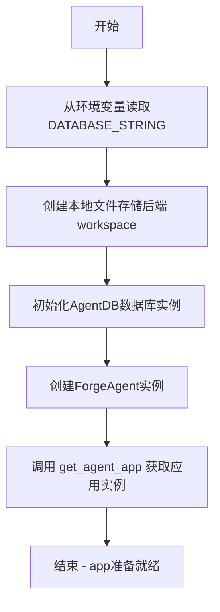
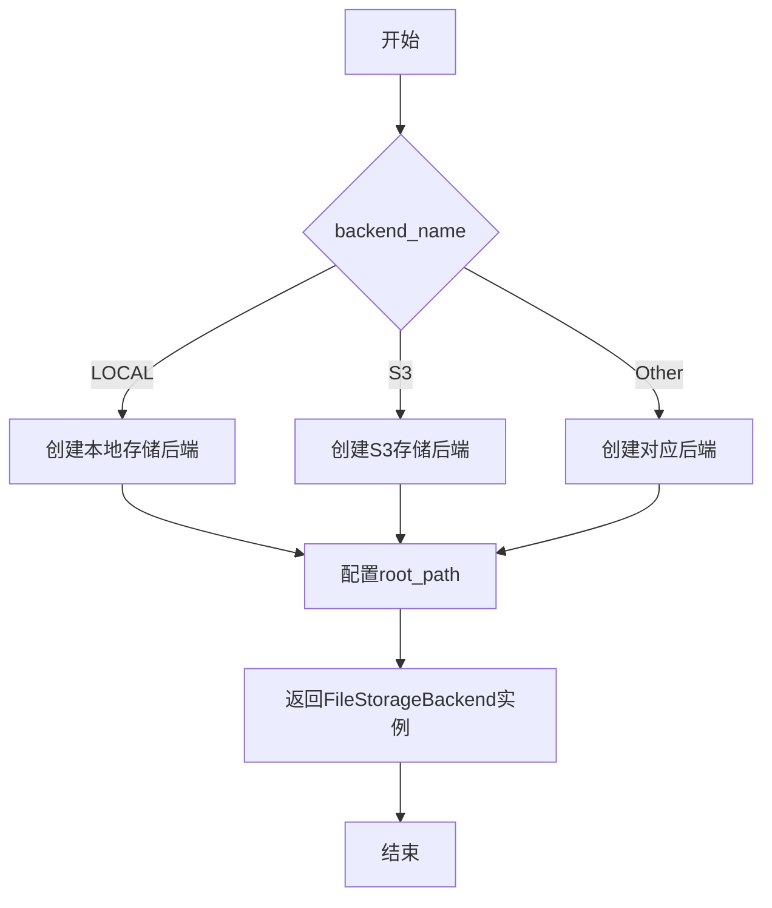
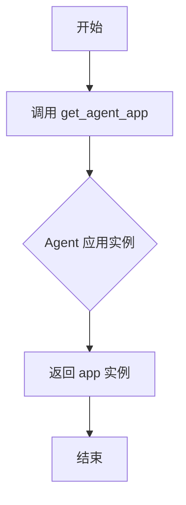
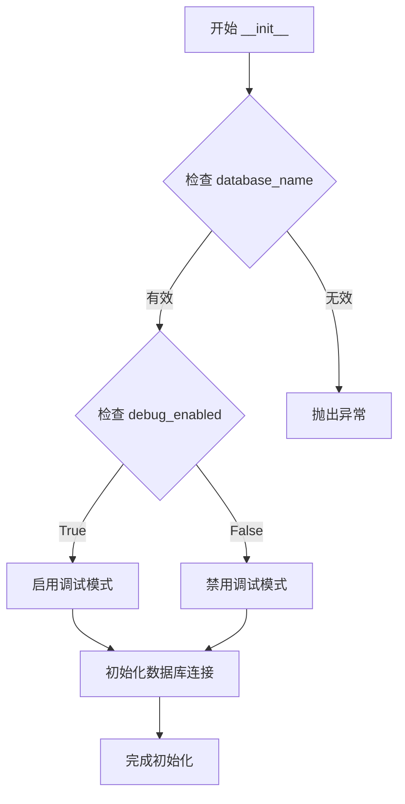
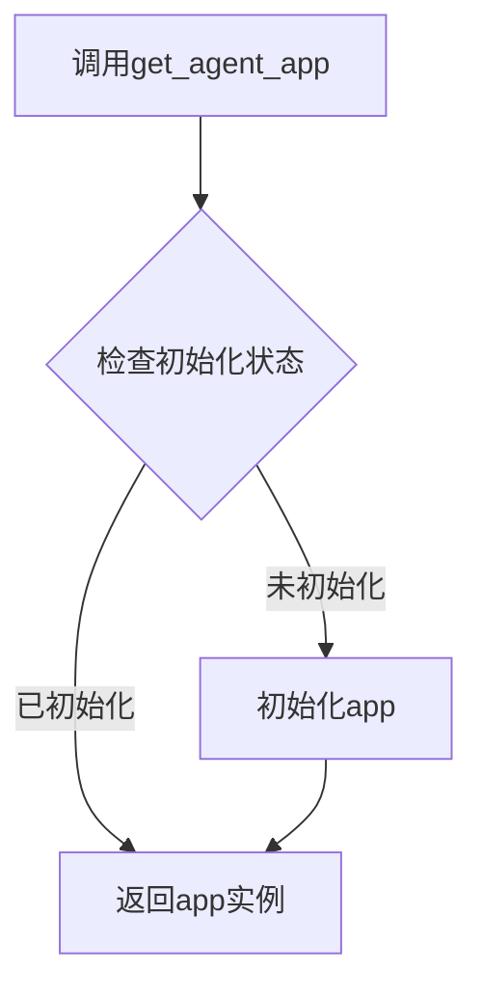
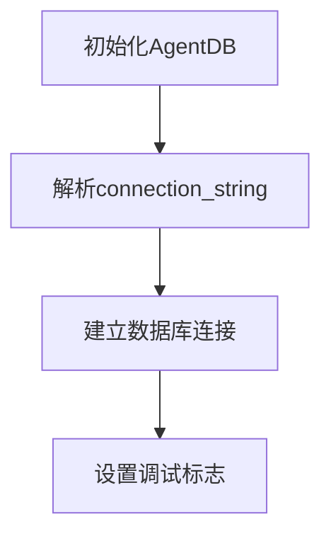
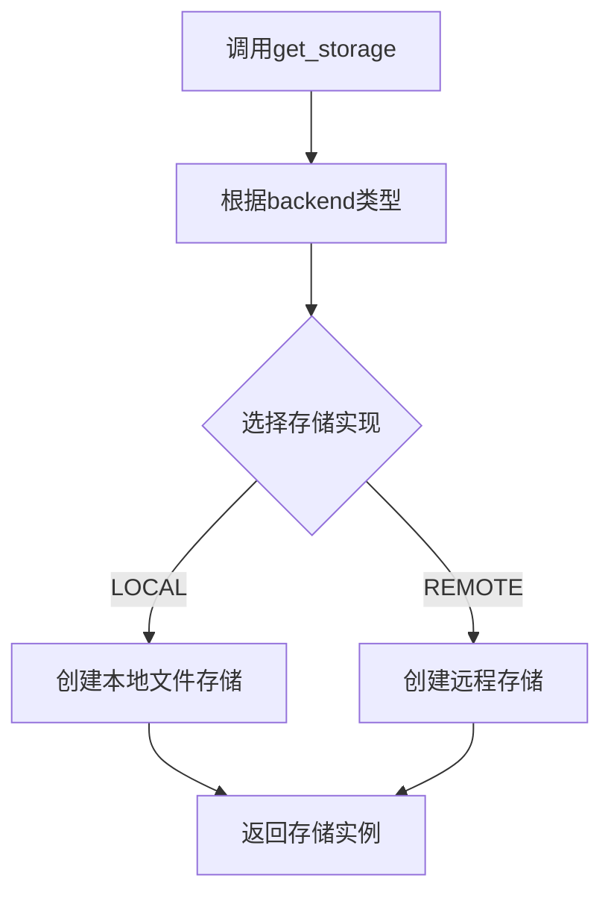

# `.\AutoGPT\classic\forge\forge\app.py` 详细设计文档

该代码是一个Agent框架的启动入口，通过初始化数据库连接和本地文件存储，创建一个ForgeAgent实例并获取其对应的应用程序实例。

## 整体流程



## 类结构

```
AgentDB (数据库管理类)
ForgeAgent (Agent核心类)
FileStorageBackendName (枚举类)
get_storage (工厂函数)
```

## 全局变量及字段


### `database_name`
    
从环境变量DATABASE_STRING获取的数据库连接字符串

类型：`str`
    


### `workspace`
    
本地文件系统存储后端，用于管理工作区文件

类型：`FileStorage`
    


### `database`
    
代理数据库实例，用于持久化代理状态和数据

类型：`AgentDB`
    


### `agent`
    
核心代理引擎实例，协调所有代理功能和业务逻辑

类型：`ForgeAgent`
    


### `app`
    
由代理应用框架生成的应用实例，提供HTTP接口或事件处理

类型：`AgentApp`
    


### `ForgeAgent.database`
    
代理实例关联的数据库访问接口

类型：`AgentDB`
    


### `ForgeAgent.workspace`
    
代理实例关联的工作区存储后端

类型：`FileStorage`
    


### `AgentDB.database_name`
    
数据库连接字符串或连接配置

类型：`str`
    


### `AgentDB.debug_enabled`
    
调试模式开关，控制是否输出详细调试信息

类型：`bool`
    


### `FileStorageBackendName.LOCAL`
    
本地文件系统存储后端枚举值

类型：`FileStorageBackendName`
    
    

## 全局函数及方法


### `get_storage`

获取文件存储后端实例的工厂函数，根据指定的存储后端类型和根路径返回相应的存储实现。

参数：

- `backend_name`：`FileStorageBackendName`，存储后端类型（如 LOCAL、S3 等）
- `root_path`：`Path`，存储的根目录路径

返回值：`FileStorageBackend`，返回配置好的文件存储后端实例

#### 流程图



#### 带注释源码

```python
# 从forge.file_storage模块导入存储后端名称枚举和get_storage函数
from forge.file_storage import FileStorageBackendName, get_storage

# 导入Path用于处理路径
from pathlib import Path

# 调用get_storage工厂函数，获取本地文件存储后端
# 参数1: FileStorageBackendName.LOCAL - 指定使用本地文件系统作为存储后端
# 参数2: root_path=Path("workspace") - 指定存储根目录为workspace文件夹
workspace = get_storage(FileStorageBackendName.LOCAL, root_path=Path("workspace"))
```

#### 补充说明

根据代码调用分析，`get_storage` 是一个工厂函数，其特征如下：

1. **设计模式**：工厂模式，用于创建不同类型的存储后端实例
2. **参数设计**：
   - 第一个参数 `backend_name` 是枚举类型，定义了支持的存储后端类型
   - 第二个参数 `root_path` 是可选的 Path 类型，用于指定存储的根目录
3. **返回值**：返回具体的存储后端实现（`FileStorageBackend`），该对象应该提供文件读写操作接口
4. **实际使用**：在代码中用于初始化工作区存储，为 Agent 提供文件持久化能力


### `ForgeAgent.get_agent_app`

获取 ForgeAgent 实例对应的应用程序实例。

参数：

- 该方法无显式参数（隐式参数为 self）

返回值：`app`（类型取决于 ForgeAgent 内部实现，通常为 Application 类型），返回配置好的应用程序实例，可用于启动服务

#### 流程图



#### 带注释源码

```python
# 从 ForgeAgent 实例获取应用程序
# ForgeAgent 在初始化时接收 database 和 workspace 参数
# get_agent_app 方法内部会构建并返回一个应用实例
app = agent.get_agent_app()

# 返回的 app 通常是框架级的应用对象
# 例如：FastAPI 应用、Flask 应用或其他 Web 框架实例
# 可用于 uvicorn 等服务器启动
```


### `AgentDB.__init__`

这是 AgentDB 类的构造函数，用于初始化数据库连接和配置。

参数：

- `database_name`：`str`，数据库连接字符串，指定要连接的数据库
- `debug_enabled`：`bool`，可选，默认为 False，是否启用调试模式

返回值：`None`，构造函数不返回任何值

#### 流程图



#### 带注释源码

```python
def __init__(self, database_name: str, debug_enabled: bool = False):
    """
    初始化 AgentDB 实例
    
    Args:
        database_name: 数据库连接字符串，用于指定要连接的数据库
        debug_enabled: 调试模式标志，默认为 False，设为 True 可启用详细日志
    
    Returns:
        None
    """
    # 1. 保存数据库名称配置
    self.database_name = database_name
    
    # 2. 保存调试标志
    self.debug_enabled = debug_enabled
    
    # 3. 根据调试标志设置日志级别
    if self.debug_enabled:
        # 启用详细日志输出
        pass
    
    # 4. 建立数据库连接
    # 这里应该包含实际的数据库连接逻辑
    self._connection = None  # 占位符，实际实现可能需要连接池等
```

> **注意**：由于提供的代码片段仅包含 `AgentDB` 的**使用**而非**定义**，上述文档是基于该类的实例化方式推断得出的。如需完整的 `AgentDB` 类定义（包括所有字段和方法），请提供 `forge/agent_protocol/database/db.py` 文件的内容。


## 关键组件


这段代码是一个Agent框架的初始化模块，主要功能是配置并初始化ForgeAgent所需的数据库和工作空间存储后端，最终获取Agent应用实例用于后续的请求处理。

### 文件运行流程

1. 读取环境变量 `DATABASE_STRING` 获取数据库连接字符串
2. 使用 `get_storage` 函数创建本地文件系统存储后端，根路径为 "workspace" 目录
3. 创建 `AgentDB` 数据库实例，传入数据库连接字符串和调试标志
4. 实例化 `ForgeAgent`，传入数据库和工作空间存储
5. 通过 agent 的 `get_agent_app()` 方法获取应用实例供外部使用

### 类详细信息

#### ForgeAgent

**描述**: 代理核心类，负责管理和协调Agent的运行

**类字段**:

| 名称 | 类型 | 描述 |
|------|------|------|
| database | AgentDB | 数据库实例，用于持久化Agent状态和数据 |
| workspace | FileStorage | 工作空间存储后端，用于文件操作 |

**类方法**:

##### get_agent_app()

- **参数**: 无
- **返回值类型**: Application
- **返回值描述**: 返回配置好的Agent应用实例
- **mermaid流程图**:

- **带注释源码**:
```python
def get_agent_app(self):
    """
    获取配置好的Agent应用实例
    
    Returns:
        Application: 配置完成的FastAPI/Starlette应用实例
    """
    return self.app
```

#### AgentDB

**描述**: 数据库管理类，负责与数据库的连接和操作

**类字段**:

| 名称 | 类型 | 描述 |
|------|------|------|
| connection_string | str | 数据库连接字符串 |
| debug_enabled | bool | 调试模式标志 |

**类方法**:

##### __init__

- **参数名称**: database_string, debug_enabled
- **参数类型**: str, bool
- **参数描述**: database_string为数据库连接字符串，debug_enabled控制调试模式
- **返回值类型**: None
- **返回值描述**: 无
- **mermaid流程图**:

- **带注释源码**:
```python
def __init__(self, database_string: str, debug_enabled: bool = False):
    """
    初始化数据库连接
    
    Args:
        database_string: 数据库连接字符串，支持多种数据库类型
        debug_enabled: 是否启用调试模式
    """
    self.connection_string = database_string
    self.debug_enabled = debug_enabled
```

#### FileStorageBackendName

**描述**: 存储后端类型枚举

**类字段**:

| 名称 | 类型 | 描述 |
|------|------|------|
| LOCAL | str | 本地文件系统存储后端 |

#### get_storage

**描述**: 存储工厂函数，根据后端类型创建相应的存储实例

**参数**:

| 参数名称 | 参数类型 | 参数描述 |
|----------|----------|----------|
| backend | FileStorageBackendName | 存储后端类型 |
| root_path | Path | 存储根目录路径 |

**返回值类型**: FileStorage

**返回值描述**: 返回配置好的文件存储实例

**mermaid流程图**:


**带注释源码**:
```python
def get_storage(backend: FileStorageBackendName, root_path: Path) -> FileStorage:
    """
    创建文件存储后端实例
    
    Args:
        backend: 存储后端类型枚举
        root_path: 文件存储的根目录路径
        
    Returns:
        FileStorage: 具体存储实现实例
    """
    if backend == FileStorageBackendName.LOCAL:
        return LocalFileStorage(root_path)
    # 支持其他存储后端类型
```

### 关键组件信息

### ForgeAgent

核心Agent类，封装了Agent的所有业务逻辑和生命周期管理

### AgentDB

数据库访问层，提供与底层数据库的交互接口

### FileStorage

文件存储抽象层，屏蔽不同存储后端的实现差异

### Workspace

工作空间目录，用于存放Agent运行时产生的文件和数据

### app (Agent Application)

最终的FastAPI/Starlette应用实例，暴露HTTP接口供外部调用

### 潜在的技术债务或优化空间

1. **环境变量硬依赖**: 代码直接使用 `os.getenv("DATABASE_STRING")` 获取数据库连接字符串，缺乏默认值和错误处理，如果环境变量未设置会导致启动失败
2. **调试标志固定**: `debug_enabled=False` 被硬编码，应该通过配置或环境变量控制
3. **存储路径硬编码**: 工作空间路径直接使用 `Path("workspace")`，缺乏灵活性
4. **单例模式缺失**: 每次导入模块都会创建新的数据库和存储实例，应该实现单例模式或依赖注入
5. **异常处理缺失**: 缺少对数据库连接失败、存储初始化失败等异常情况的处理

### 其它项目

#### 设计目标与约束

- **设计目标**: 快速初始化Agent框架，提供开箱即用的配置
- **约束**: 依赖特定的环境变量和目录结构

#### 错误处理与异常设计

- 数据库连接字符串为空时应抛出明确的配置错误
- 存储初始化失败时应提供降级方案或友好错误提示

#### 数据流与状态机

- 数据流: 环境变量 → 配置读取 → 组件初始化 → Agent实例化 → App获取
- Agent状态: 初始状态 → 就绪状态 → 运行状态

#### 外部依赖与接口契约

- 依赖 `forge.agent.forge_agent.ForgeAgent` 类
- 依赖 `forge.agent_protocol.database.db.AgentDB` 类
- 依赖 `forge.file_storage` 模块提供的存储抽象
- 环境变量 `DATABASE_STRING` 必须提供


## 问题及建议


### 已知问题

-   **环境变量未设置时的空值处理**：使用 `os.getenv("DATABASE_STRING")` 获取数据库连接字符串，若环境变量未设置会返回 `None`，可能导致后续 `AgentDB` 初始化失败或连接错误
-   **硬编码的工作区路径**：`root_path=Path("workspace")` 硬编码了本地存储路径，缺乏灵活性和可配置性
-   **硬编码的调试标志**：`debug_enabled=False` 调试模式被硬编码，无法根据环境动态调整
-   **缺乏异常处理机制**：整个初始化过程（数据库连接、存储初始化、Agent创建）没有 `try-except` 包裹，任何一步失败都会导致应用无法启动且无友好错误提示
-   **模块级初始化副作用**：在模块级别创建 `database`、`workspace`、`agent` 和 `app` 对象，可能导致导入时即执行初始化，影响导入性能和单元测试
-   **未使用的导入**：`import os` 被导入但只使用了 `os.getenv`，存在冗余

### 优化建议

-   使用 `os.getenv("DATABASE_STRING")` 时提供默认值或显式检查 `None` 值并抛出友好错误
-   将工作区路径、调试模式等配置项提取为环境变量或配置文件，支持多环境部署
-   在关键初始化步骤周围添加异常处理（try-except），并提供清晰的错误信息
-   考虑使用延迟初始化（lazy initialization）或依赖注入模式，提高可测试性和模块解耦
-   清理未使用的导入，保持代码整洁

## 其它


### 设计目标与约束

本代码的核心设计目标是完成ForgeAgent应用的初始化，包括数据库连接、文件存储后端配置以及Agent实例的创建。设计约束包括：1) 必须从环境变量DATABASE_STRING获取数据库连接字符串；2) 文件存储使用本地文件系统，根路径为"workspace"目录；3) 调试模式默认关闭；4) 整个初始化为同步阻塞操作，应用启动时一次性完成。

### 错误处理与异常设计

主要异常场景包括：1) 环境变量DATABASE_STRING未设置或为空，抛出KeyError；2) 数据库连接字符串格式错误，AgentDB初始化时抛出数据库相关异常；3) workspace目录无写权限或路径不存在，get_storage可能抛出PermissionError或FileNotFoundError；4) ForgeAgent初始化失败，get_agent_app抛出异常。建议在调用前添加环境变量校验和目录创建逻辑，并捕获相关异常向上传递或进行降级处理。

### 数据流与状态机

数据流顺序为：环境变量(DATABASE_STRING) → 数据库连接字符串 → AgentDB实例化 → 文件存储配置 → ForgeAgent实例化 → 获取app应用。状态机转换：初始化开始 → 数据库就绪 → 存储就绪 → Agent就绪 → App就绪 → 运行中。无分支状态，所有初始化步骤必须依次成功完成。

### 外部依赖与接口契约

核心依赖包括：1) forge.agent.forge_agent.ForgeAgent类，需传入database和workspace参数，get_agent_app()返回app对象；2) forge.agent_protocol.database.db.AgentDB类，接受database_name和debug_enabled参数；3) forge.file_storage.get_storage函数，接受FileStorageBackendName枚举和root_path参数；4) pathlib.Path用于路径处理；5) os.getenv用于环境变量读取。所有外部依赖均为同步调用，无异步接口。

### 配置说明

唯一必需配置项为DATABASE_STRING环境变量，格式为数据库连接字符串（如SQLite文件路径或远程数据库URL）。可选配置包括workspace路径（默认为"workspace"相对路径）和debug_enabled（默认为False）。配置必须在应用启动前完成设置，无运行时动态配置能力。

### 安全性考虑

数据库连接字符串包含敏感凭据信息，应通过环境变量而非硬编码传递。建议添加环境变量存在性检查并在缺失时给出明确错误提示。workspace目录应设为应用专属目录，避免敏感文件泄露风险。生产环境应确保环境变量来源安全，避免通过命令行历史或配置文件意外暴露。

### 性能考虑

初始化过程为一次性操作，不涉及高频调用。AgentDB和ForgeAgent实例化可能涉及数据库连接池和Agent加载，建议在应用生命周期内复用app实例避免重复初始化。文件存储后端为本地文件系统，I/O性能依赖磁盘性能，频繁大文件操作场景可考虑后续迁移至分布式存储。

### 部署和运维

部署要求：1) 运行前设置DATABASE_STRING环境变量；2) 确保工作目录存在且有写权限，或在代码中预先创建workspace目录；3) Python环境需安装forge相关依赖包。运维建议：监控应用启动日志确认初始化成功，数据库连接异常时应用无法启动需及时介入，workspace目录需定期清理或做磁盘配额限制。

### 测试策略

单元测试建议：1) Mock AgentDB和get_storage隔离测试初始化逻辑；2) 模拟环境变量缺失场景测试错误处理；3) 使用临时目录测试workspace路径创建。集成测试建议：1) 使用内存数据库（如SQLite）进行完整初始化流程测试；2) 测试多实例场景下数据库连接管理。测试覆盖重点为异常路径和环境配置缺失场景。

### 日志和监控

当前代码无显式日志输出，建议集成框架日志（如Python logging模块）记录关键节点：环境变量读取结果、数据库连接状态、Agent初始化成功/失败事件。监控指标建议：初始化耗时、数据库连接成功率、应用启动成功率。可通过在关键步骤添加timestamp记录实现基础性能监控。


    