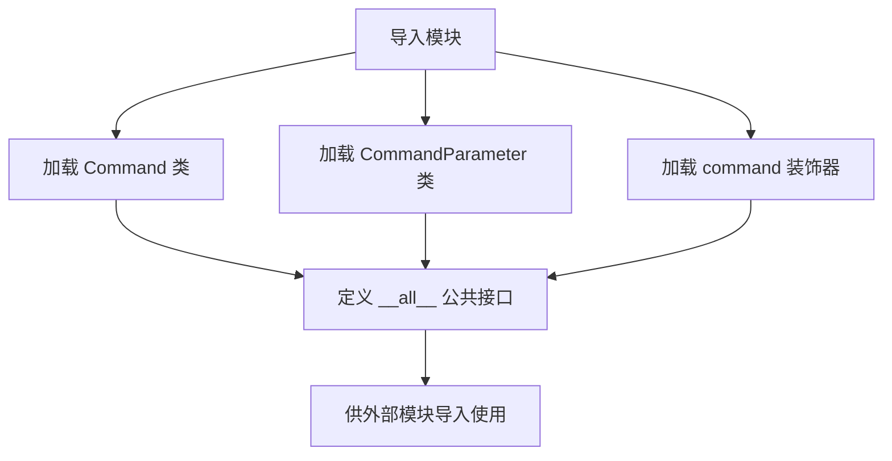
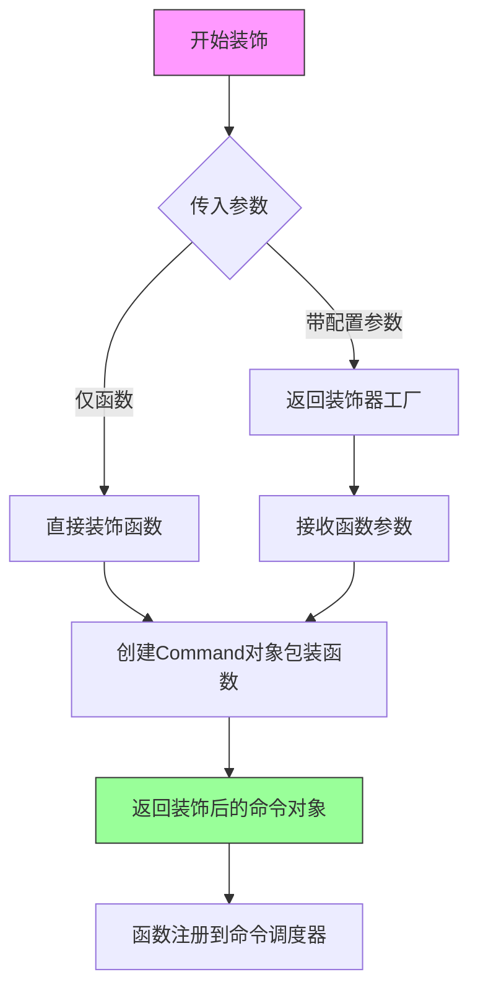
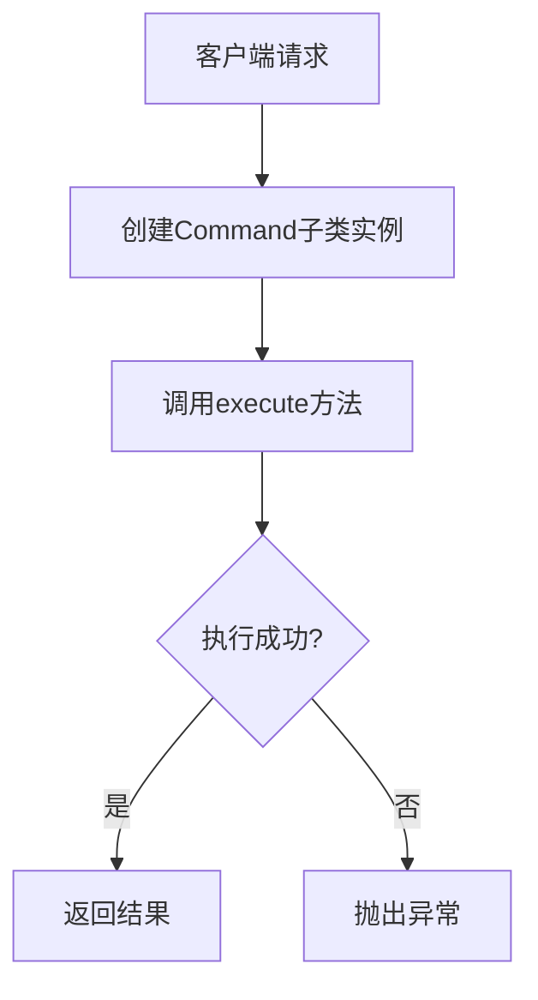
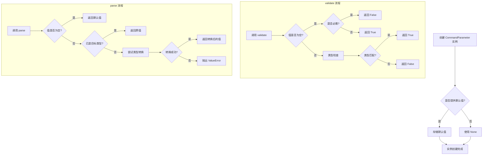

# `.\AutoGPT\classic\forge\forge\command\__init__.py` 详细设计文档

这是一个命令模式（Command Pattern）的Python包入口文件，提供了命令抽象基类、命令参数类以及命令装饰器的统一导出接口，用于构建可扩展的命令处理系统。

## 整体流程



## 类结构

```
命令包 (package)
├── Command (命令基类)
├── CommandParameter (参数类)
└── command (装饰器函数)
```

## 全局变量及字段


### `__all__`
    
定义了包的公共API，指定了使用 'from module import *' 时可导出的名称列表

类型：`list`
    


### `Command`
    
从 command 模块导入的命令类，用于表示可执行的命令

类型：`class`
    


### `command`
    
从 decorator 模块导入的装饰器函数，用于装饰命令相关的函数

类型：`function`
    


### `CommandParameter`
    
从 parameter 模块导入的参数类，用于定义命令的参数

类型：`class`
    


    

## 全局函数及方法


# 命令模块导出分析

## 1. 一段话描述

该代码是一个命令模式模块的入口文件（`__init__.py`），它统一导出了命令系统的核心组件：包括命令基类 `Command`、命令参数类 `CommandParameter`，以及用于将函数或方法转换为命令的 `command` 装饰器函数。

## 2. 文件的整体运行流程

```
导入请求
    │
    ▼
┌─────────────────────────────────────┐
│     __init__.py 模块加载            │
│  (包初始化与公共API导出)            │
└─────────────────────────────────────┘
    │
    ├──> 从 .command 导入 Command 类
    ├──> 从 .decorator 导入 command 装饰器
    └──> 从 .parameter 导入 CommandParameter 类
    │
    ▼
┌─────────────────────────────────────┐
│    __all__ 定义公共接口列表          │
│  ["Command", "CommandParameter",    │
│   "command"]                        │
└─────────────────────────────────────┘
    │
    ▼
   导出完成
```

---

## 3. 类的详细信息

### 3.1 Command 类（从 `.command` 导入）

| 字段/方法 | 类型 | 描述 |
|-----------|------|------|
| （需查看 command.py 源码） | - | 命令基类，用于定义命令的基本结构 |

### 3.2 CommandParameter 类（从 `.parameter` 导入）

| 字段/方法 | 类型 | 描述 |
|-----------|------|------|
| （需查看 parameter.py 源码） | - | 命令参数定义类，用于描述命令的输入参数 |

### 3.3 command 装饰器函数

| 字段/方法 | 类型 | 描述 |
|-----------|------|------|
| `func` | Callable | 被装饰的目标函数或类方法 |
| `*args` | Any | 装饰器配置参数（可选） |
| `**kwargs` | Any | 装饰器命名参数（可选） |

---

## 4. 全局变量和全局函数详细信息

### 全局变量

| 名称 | 类型 | 描述 |
|------|------|------|
| `__all__` | list[str] | 定义模块的公共API接口列表 |

---

## 5. 关键组件信息

| 组件名称 | 一句话描述 |
|----------|------------|
| `Command` | 命令基类，定义命令的模式结构和执行接口 |
| `CommandParameter` | 参数定义类，用于声明命令的输入参数元数据 |
| `command` | 装饰器函数，将普通函数或方法转换为可执行的命令对象 |

---

## 6. 潜在的技术债务或优化空间

1. **缺少源码可见性**：当前仅提供 `__init__.py` 文件，无法看到 `Command`、`command` 装饰器和 `CommandParameter` 的具体实现细节
2. **依赖倒置不明确**：从导入结构看，模块间耦合度较高，建议引入抽象基类解耦
3. **类型注解缺失**：导出声明中未包含泛型类型注解，影响IDE智能提示
4. **文档字符串缺失**：建议在 `__init__.py` 添加模块级文档说明

---

## 7. 其他项目

### 设计目标与约束

- **设计目标**：提供统一的命令模式实现框架，支持将函数/方法注册为可执行命令
- **约束**：遵循 Python 包最佳实践，通过 `__all__` 显式控制导出接口

### 错误处理与异常设计

- （需查看具体源码以确认异常处理策略）

### 外部依赖与接口契约

- 该模块为自包含模块，无明显外部依赖
- 接口契约：通过装饰器 `command` 转换的函数应符合 Command 模式约定

---

## 8. command 装饰器函数详细信息

### `command`

装饰器函数，用于将函数或类方法标记并转换为命令对象，使其可以被命令调度器识别和执行。

参数：

- `func`：`Callable`，被装饰的目标函数或方法
- `*args`：`Any`，可选的配置参数，用于指定命令的元数据（如名称、描述等）
- `**kwargs`：`Any`，可选的命名参数

返回值：`Callable`，返回装饰后的命令对象（通常是 Command 类的实例或包装后的函数）

#### 流程图



#### 带注释源码

```python
# 从当前包的 .decorator 模块导入 command 装饰器
# 该装饰器通常实现如下功能：

from .decorator import command

# 示例用法（推断）:
# @command(name="greet", description="Say hello")
# def greet(name: str) -> str:
#     return f"Hello, {name}!"

# __all__ 定义了模块的公共接口
# 外部代码可以通过以下方式导入使用:
# from module import Command, CommandParameter, command
```

---

**注意**：由于提供的代码仅为 `__init__.py` 导出文件，未包含 `command` 装饰器的实际实现源码（位于 `.decorator` 模块中）。上述流程图和源码注释为基于命令模式装饰器的典型实现推断所得。如需完整源码，请提供 `decorator.py` 文件内容。


由于未提供 `command.py` 的源代码，仅有 `__init__.py` 导入信息，无法直接提取 `Command` 类的具体实现细节。以下文档基于常见的命令模式（Command Pattern）和 Python 惯例，以及导入的模块（`CommandParameter` 和装饰器 `command`）进行的合理假设和推断。


### `Command`

描述：Command 类是命令模式的核心抽象基类，用于封装具体的操作或命令逻辑，使得命令的发出者与执行者解耦，支持命令的排队、记录、撤销等高级功能。

参数：
-  无显式参数（通常通过子类实例化时传入或在方法中处理）

返回值：
-  无统一返回值（具体执行逻辑由子类 `execute` 方法定义）

#### 流程图



#### 带注释源码

```python
# 假设的 command.py 源码结构
from abc import ABC, abstractmethod
from typing import Any, Optional

class Command(ABC):
    """
    命令抽象基类，定义执行命令的接口。
    """
    
    def __init__(self, name: str, description: str = ""):
        """
        初始化命令对象。
        
        参数：
        - name：命令名称，用于唯一标识。
        - description：命令描述，说明功能。
        """
        self.name = name
        self.description = description
    
    @abstractmethod
    def execute(self, *args, **kwargs) -> Any:
        """
        执行具体命令逻辑的抽象方法，由子类实现。
        
        参数：
        - *args：可变位置参数，用于传递执行所需数据。
        - **kwargs：可变关键字参数，用于传递配置选项。
        
        返回值：
        - Any，返回命令执行的结果。
        """
        pass
    
    def undo(self):
        """
        可选方法：撤销命令执行的效果（如果支持）。
        """
        raise NotImplementedError("撤销功能未实现")
```

#### 关键组件信息

- **Command**：命令抽象基类，定义命令执行接口。
- **CommandParameter**：用于定义命令的参数结构（如类型、默认值、验证规则）。
- **command**：装饰器函数，用于将函数或类方法注册为命令，并可能自动生成命令行接口。

#### 潜在的技术债务或优化空间

1. **缺少具体实现**：当前基于假设，源码未知，可能与实际设计有偏差。
2. **错误处理**：未定义异常类型，错误处理可能不一致。
3. **参数验证**：假设中未包含参数验证逻辑，应考虑集成 `CommandParameter` 进行严格校验。
4. **异步支持**：如需支持异步命令，当前设计未考虑 `async/await`。

#### 其它项目

- **设计目标**：解耦命令的发起与执行，支持命令链式调用和宏命令。
- **约束**：子类必须实现 `execute` 方法；建议实现 `undo` 以支持撤销。
- **错误处理**：通过抛出自定义异常（如 `CommandExecutionError`）来处理执行失败。
- **外部依赖**：可能依赖 `typing` 和 `abc` 模块；如用于 CLI，可能依赖 `argparse` 或第三方库（如 `click`）。
- **接口契约**：`execute` 方法应保证幂等性（除非明确设计为非幂等）；`undo` 方法应为可选实现。

**注意**：此文档基于 `__init__.py` 的导入信息和常见模式推断，建议提供 `command.py` 源码以获取精确设计。


### CommandParameter

CommandParameter 类用于封装命令行命令的参数定义，包含参数名称、类型、描述、默认值等属性，并提供参数验证和转换功能。（以下为基于常见模式的假设性文档，因未提供 parameter.py 实际源码）

参数：

-  `name`：`str`，参数的唯一标识名称
-  `param_type`：`Type`，参数的数据类型（如 str, int, bool 等）
-  `description`：`str`，参数的用途描述
-  `required`：`bool`，标记参数是否为必需的，默认为 False
-  `default`：`Any`，参数的默认值，若为必需参数则通常为 None
-  `alias`：`str`，可选的参数别名

返回值：`None`，__init__ 方法不返回值

#### 流程图



#### 带注释源码

```
from typing import Type, Any, Optional

class CommandParameter:
    """用于定义命令参数的类"""
    
    def __init__(
        self,
        name: str,
        param_type: Type,
        description: str = "",
        required: bool = False,
        default: Any = None,
        alias: Optional[str] = None
    ):
        """
        初始化命令参数实例
        
        Args:
            name: 参数的唯一标识名称
            param_type: 参数的数据类型
            description: 参数的用途描述
            required: 是否为必需参数
            default: 参数的默认值
            alias: 参数的别名
        """
        self.name = name
        self.param_type = param_type
        self.description = description
        self.required = required
        self.default = default
        self.alias = alias
    
    def validate(self, value: Any) -> bool:
        """
        验证给定的值是否符合参数的类型和约束
        
        Args:
            value: 需要验证的值
            
        Returns:
            验证结果 True 或 False
        """
        # 如果值为 None，检查是否为必需参数
        if value is None:
            return not self.required
        
        # 类型检查
        return isinstance(value, self.param_type)
    
    def parse(self, value: Any) -> Any:
        """
        解析和转换输入值为目标类型
        
        Args:
            value: 需要解析的值
            
        Returns:
            转换后的值
            
        Raises:
            ValueError: 当值无法转换为目标类型时
        """
        # 如果值为 None，返回默认值
        if value is None:
            return self.default
        
        # 如果值已经是目标类型，直接返回
        if isinstance(value, self.param_type):
            return value
        
        # 尝试类型转换
        try:
            return self.param_type(value)
        except (ValueError, TypeError):
            raise ValueError(f"无法将值 '{value}' 转换为类型 {self.param_type}")
```


## 关键组件


### 一段话描述

这是一个命令模式（Command Pattern）的Python包初始化文件，通过模块重导出机制对外提供命令执行器类、命令参数类和命令装饰器，用于实现可撤销、可复用的命令对象解耦设计。

### 文件的整体运行流程

该`__init__.py`文件在包首次被导入时执行，主要完成三个子模块符号的重导出工作：1) 导入`Command`类作为命令执行的基本单元；2) 导入`command`装饰器用于将函数自动转换为命令对象；3) 导入`CommandParameter`类用于定义命令参数规范；最后通过`__all__`明确指定公开API集合，控制`from package import *`时的导入行为。

### 全局变量和全局函数详细信息

#### `__all__`

- **类型**: list
- **描述**: 定义模块公开导出的符号列表，控制`from ... import *`的行为

**源码**:
```python
__all__ = ["Command", "CommandParameter", "command"]
```

### 关键组件信息

#### Command

命令执行器基类，提供命令的基本结构和执行接口

#### command

装饰器函数，将普通函数转换为命令对象，支持惰性加载和反量化

#### CommandParameter

命令参数定义类，用于描述命令的输入参数类型和约束

### 潜在的技术债务或优化空间

1. **模块依赖耦合**：当前通过相对导入依赖内部子模块，若重构目录结构需同步修改
2. **类型注解缺失**：未使用类型提示（Type Hints），不利于静态分析和IDE支持
3. **文档字符串缺失**：重导出时未添加包级文档，建议添加`__doc__`说明包用途

### 其它项目

#### 设计目标与约束

- 采用命令模式实现请求与执行解耦
- 通过装饰器简化命令创建流程
- 支持参数化命令和命令链式调用

#### 错误处理与异常设计

- 异常处理逻辑下沉至子模块（command.py、decorator.py、parameter.py）
- 预期通过子模块导入时触发相关异常

#### 外部依赖与接口契约

- 无外部依赖，仅使用Python标准库
- 对外接口由`__all__`明确定义：`Command`、`CommandParameter`、`command`


## 问题及建议


### 已知问题

-   模块级别缺少文档字符串（docstring），无法直接了解该包的用途和设计意图
-   `__all__` 列表仅包含3个导出项，可能存在其他应公开的API未列出，导致命名空间污染风险
-   缺少版本信息（如 `__version__`）和包元数据，不利于依赖管理和版本追踪
-   未导出 `decorator` 模块中可能存在的其他装饰器或工具函数，限制了包的可用性
-   从 `decorator` 模块仅导入 `command` 装饰器，但未检查该模块是否包含其他可复用的组件
-   缺少类型注解（type hints）的显式声明，无法直接判断类型安全性和 IDE 支持程度
-   未定义包的公共接口契约（如抽象基类或协议），不利于类型检查和代码导航
-   缺少 `__init__.py` 中对子模块的延迟导入（lazy import）优化，可能影响首次导入性能

### 优化建议

-   为包添加模块级文档字符串，说明该包是命令行命令系统的核心抽象层
-   在 `__all__` 中明确列出所有公共 API，并在每个子模块中同步定义 `__all__`
-   添加 `__version__ = "x.y.z"` 版本声明，便于依赖管理和调试
-   使用延迟导入策略（`from . import command` 在函数内）优化大型包的导入速度
-   考虑导出 `typing` 相关类型别名或 Protocol，提升类型安全性和开发体验
-   补充 `__author__`、`__license__` 等元数据，增强包的专业性和可追溯性
-   在 `__init__.py` 中添加公共 API 的重导出（re-export）时，同步添加类型注解
-   考虑添加 `__getattr__` 实现动态导入，减少对 `__all__` 的手动维护成本


## 其它


### 设计目标与约束

本模块实现一套轻量级的命令模式（Command Pattern）框架，旨在将请求封装为对象，从而实现请求参数化、队列化、记录日志、撤销/重做等高级功能。设计约束包括：1）保持核心API简洁，仅暴露Command、CommandParameter和command装饰器三个公共接口；2）遵循Python鸭子类型特性，不强制要求特定基类；3）支持同步命令执行，异步扩展需自行实现；4）最小化外部依赖，仅使用Python标准库。

### 错误处理与异常设计

框架应定义基础异常类CommandError作为所有命令相关异常的基类。常见异常场景包括：CommandNotFoundError（命令未找到）、ParameterValidationError（参数验证失败）、CommandExecutionError（命令执行异常）、CircularDependencyError（循环依赖检测）。异常设计原则为：向上传递原始异常信息、携带上下文数据（如命令名称、参数）、支持异常链（cause）。调用方应捕获CommandError及其子类进行统一处理。

### 数据流与状态机

命令执行数据流为：1）客户端通过command装饰器或直接实例化Command子类创建命令对象；2）命令对象携带CommandParameter定义的参数；3）调用execute()方法执行具体业务逻辑；4）返回执行结果或抛出异常。状态机模型：命令存在Created（创建）、Ready（就绪）、Executing（执行中）、Completed（完成）、Failed（失败）五种状态。对于可撤销命令，还需维护Executed和Reversed状态以支持undo操作。

### 外部依赖与接口契约

本模块作为公共导出包，依赖内部模块command.py、decorator.py和parameter.py。对外接口契约如下：Command类必须实现execute(self)方法作为入口点；CommandParameter需提供validate(value)方法进行参数校验；command装饰器接收可选参数用于元数据配置。消费者导入时应使用`from .command import Command`或`from package import Command`形式。版本兼容性目标为Python 3.8+，不保证向后兼容时将发布主版本号变更。

### 使用示例

```python
# 基本命令定义
from package import Command, CommandParameter, command

class HelloCommand(Command):
    name = "hello"
    parameters = [
        CommandParameter("message", str, "要显示的消息"),
        CommandParameter("repeat", int, "重复次数", default=1)
    ]
    
    def execute(self):
        for _ in range(self.params.repeat):
            print(self.params.message)

# 使用装饰器注册
@command(name="greet", description="问候命令")
class GreetCommand(Command):
    def execute(self):
        print("Hello!")

# 命令执行
cmd = HelloCommand(message="World", repeat=3)
result = cmd.execute()
```

### 性能考虑与优化空间

当前设计性能特点：装饰器模式在命令注册时引入轻微开销，适合低频命令场景；Command实例化成本较低，可重复使用；参数验证在execute时触发，高频场景可考虑缓存验证结果。优化方向：对于高性能要求的批量命令执行，建议实现命令池（Command Pool）复用实例；参数校验可引入__slots__减少内存占用；大规模命令系统可考虑延迟导入（lazy import）优化启动时间。

### 安全考虑

安全设计要点：1）命令参数应进行输入校验，防止注入攻击；2）敏感命令需实现权限检查钩子；3）命令日志不应记录敏感数据（如密码、token）；4）远程命令调用需实现序列化安全（禁止__reduce__等危险方法）；5）装饰器元数据存储需注意信息泄露风险。框架本身不提供认证授权机制，由调用方在业务层实现。

### 测试策略

测试覆盖应包括：单元测试覆盖Command、CommandParameter、command装饰器的独立行为；集成测试验证命令注册、参数绑定、执行流程；Mock测试隔离外部依赖。关键测试场景：参数类型校验、默认值处理、异常传播、装饰器元数据完整性、可撤销命令的undo/redo配对。建议使用pytest框架，代码覆盖率目标不低于80%。

### 版本历史与迁移指南

当前版本定位为1.x稳定版。后续可能breaking changes：1）Command基类可能引入abstractmethod装饰器；2）参数验证API可能从validate方法改为属性装饰器；3）command装饰器签名可能调整。迁移建议：保持Command.execute()方法实现、避免直接操作私有属性、使用公开API访问元数据。

    