# `.\AutoGPT\classic\forge\forge\command\command.py` 详细设计文档

一个通用的命令封装类，实现了描述符协议，用于将函数方法封装为可执行的命令对象，支持参数验证、异步判断、实例绑定和字符串表示，适用于命令模式（Command Pattern）的实现。

## 整体流程

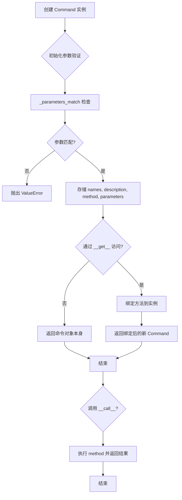

## 类结构

```
Command (泛型命令类)
├── __init__ (初始化)
├── is_async (异步属性)
├── _parameters_match (参数验证)
├── __call__ (可调用接口)
├── __str__ (字符串表示)
└── __get__ (描述符协议)
```

## 全局变量及字段


### `P`
    
参数规范类型变量，用于参数规范

类型：`ParamSpec`
    


### `CO`
    
命令输出类型变量

类型：`TypeVar`
    


### `_CP`
    
命令提供者类型变量，绑定到 CommandProvider

类型：`TypeVar`
    


### `Command.names`
    
命令名称列表

类型：`list[str]`
    


### `Command.description`
    
命令功能描述

类型：`str`
    


### `Command.method`
    
实际执行的命令方法

类型：`Callable`
    


### `Command.parameters`
    
参数模式定义

类型：`list[CommandParameter]`
    
    

## 全局函数及方法


### `inspect.iscoroutinefunction`

`inspect.iscoroutinefunction` 是 Python 标准库 `inspect` 模块中的一个函数，用于检查给定的方法或函数是否为协程函数（async function）。在代码中，该函数被用于 `Command` 类的 `is_async` 属性，以判断命令所包装的方法是否为异步方法。

参数：

- `obj`：`Callable`，任意可调用对象（函数、方法或类），用于检查该对象是否为协程函数

返回值：`bool`，如果 `obj` 是协程函数则返回 `True`，否则返回 `False`

#### 流程图

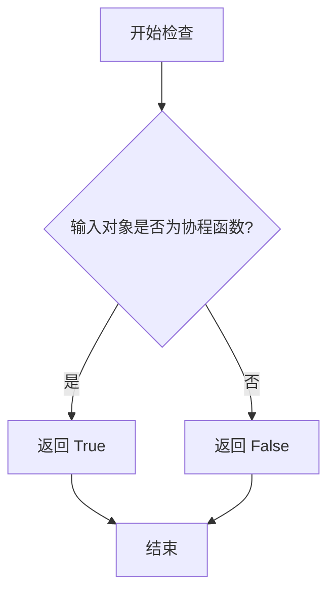

#### 带注释源码

```python
# inspect.iscoroutinefunction 的实现机制（伪代码）
# 这是一个 Python 标准库的 C 实现函数，以下是其逻辑概述：

def iscoroutinefunction(obj):
    """检查对象是否为协程函数（async def 定义的函数）
    
    参数:
        obj: 任意可调用对象
        
    返回:
        bool: 如果对象是协程函数返回 True，否则返回 False
    """
    # 实际实现位于 Python 的 C 源码中 (Objects/genobject.c)
    # 通过检查对象的 CO_COROUTINE 标志位来判断
    # 
    # 在 Command 类中的使用示例:
    # 
    # class Command(Generic[P, CO]):
    #     @property
    #     def is_async(self) -> bool:
    #         return inspect.iscoroutinefunction(self.method)
    #         # self.method 是被包装的 Callable 对象
    #         # 如果该方法是 async def 定义的，则返回 True
    #         # 否则返回 False
    #
    # 用途:
    # - 用于运行时判断命令是否需要异步执行
    # - 帮助框架决定如何调用该命令（同步调用 vs 异步调用）
    pass
```

#### 在 `Command` 类中的实际使用

```python
class Command(Generic[P, CO]):
    """A class representing a command."""
    
    # ... 其他代码 ...
    
    @property
    def is_async(self) -> bool:
        """检查命令方法是否为协程函数
        
        该属性通过 inspect.iscoroutinefunction 检查被包装的 method 对象，
        判断其是否为 async def 定义的协程函数。
        
        返回:
            bool: 如果 method 是协程函数返回 True，否则返回 False
        """
        return inspect.iscoroutinefunction(self.method)
    
    # ... 其他代码 ...
```


## 1. 代码概述

这段代码定义了一个通用的 `Command` 泛型类，用于封装可执行的命令方法。该类实现了描述符协议（Descriptor Protocol），支持将带有参数模式的函数包装为标准化命令对象，提供命令名称、描述、参数验证和异步检测等功能，主要用于构建命令驱动架构（如 CLI 工具或 Agent 指令系统）。

## 2. 文件运行流程

当导入 `Command` 类时，Python 会加载类定义并初始化泛型参数。在实际使用中，首先通过 `__init__` 方法创建命令实例并验证参数匹配性；然后可以通过 `__call__` 方法直接调用底层方法，或通过 `__get__` 描述符方法将命令绑定到特定实例；`is_async` 属性用于检测命令是否异步执行，`__str__` 方法提供人类可读的命令表示。

## 3. 类详细信息

### 3.1 类字段

| 名称 | 类型 | 描述 |
|------|------|------|
| `name` (文档中为 `names`) | `list[str]` | 命令的多个名称（支持别名） |
| `description` | `str` | 命令功能的简要描述 |
| `method` | `Callable[Concatenate[_CP, P], CO]` | 被封装的可执行方法 |
| `parameters` | `list[CommandParameter]` | 命令参数模式列表 |

### 3.2 类方法

#### 3.2.1 `Command.__init__`

**描述**：构造函数，初始化命令实例并验证参数匹配性。

**参数**：
- `names`：`list[str]`，命令名称列表（支持多个别名）
- `description`：`str`，命令功能描述
- `method`：`Callable[Concatenate[_CP, P], CO]`，被封装的可执行方法
- `parameters`：`list[CommandParameter]`，[命令参数模式列表]

**返回值**：`None`，构造函数无返回值

**流程图**：

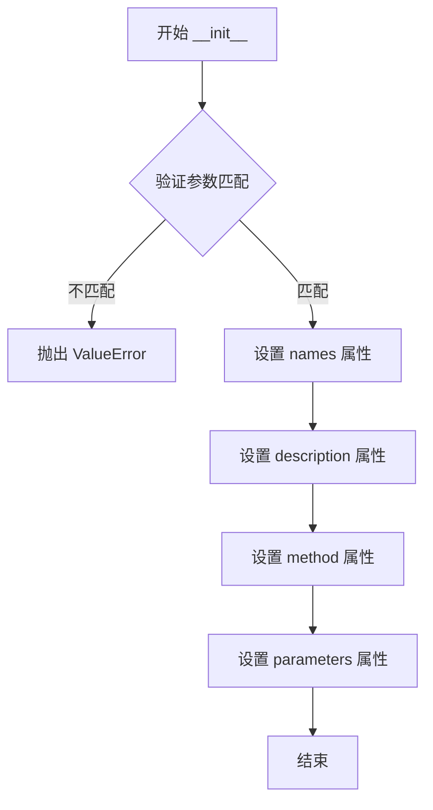

**带注释源码**：

```python
def __init__(
    self,
    names: list[str],
    description: str,
    method: Callable[Concatenate[_CP, P], CO],
    parameters: list[CommandParameter],
):
    # 检查所有参数是否已提供
    if not self._parameters_match(method, parameters):
        raise ValueError(
            f"Command {names[0]} has different parameters than provided schema"
        )
    self.names = names
    self.description = description
    # 方法技术上有一个 `self` 参数，但由于 Python 内部传递，我们可以忽略它
    self.method = cast(Callable[P, CO], method)
    self.parameters = parameters
```

---

#### 3.2.2 `Command.is_async` (property)

**描述**：属性方法，判断底层方法是否为异步函数。

**参数**：无

**返回值**：`bool`，如果底层方法是协程函数返回 `True`，否则返回 `False`

**流程图**：

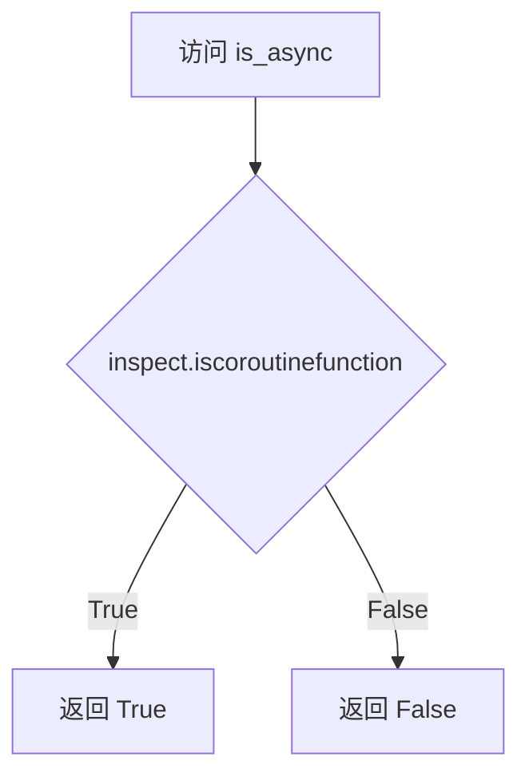

**带注释源码**：

```python
@property
def is_async(self) -> bool:
    """检查底层方法是否为异步函数"""
    return inspect.iscoroutinefunction(self.method)
```

---

#### 3.2.3 `Command._parameters_match`

**描述**：私有方法，验证函数签名中的参数与提供的参数模式是否匹配。

**参数**：
- `func`：`Callable`，待验证的可调用对象
- `parameters`：`list[CommandParameter]`，[命令参数模式列表]

**返回值**：`bool`，如果参数名称匹配返回 `True`，否则返回 `False`

**流程图**：

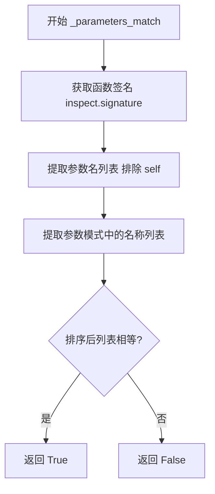

**带注释源码**：

```python
def _parameters_match(
    self, func: Callable, parameters: list[CommandParameter]
) -> bool:
    # 获取函数的签名
    signature = inspect.signature(func)
    # 提取参数名称，对于方法忽略 'self'
    func_param_names = [
        param.name
        for param in signature.parameters.values()
        if param.name != "self"
    ]
    names = [param.name for param in parameters]
    # 检查排序后的名称列表是否相等
    return sorted(func_param_names) == sorted(names)
```

---

#### 3.2.4 `Command.__call__`

**描述**：使命令实例可调用，直接转发调用到底层方法。

**参数**：
- `*args`：`P.args`，可变位置参数
- `**kwargs`：`P.kwargs`，可变关键字参数

**返回值**：`CO`，底层方法的返回值

**流程图**：

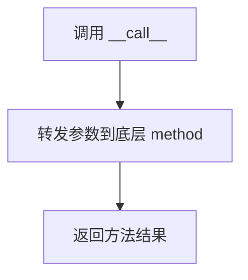

**带注释源码**：

```python
def __call__(self, *args: P.args, **kwargs: P.kwargs) -> CO:
    """使 Command 实例可调用"""
    return self.method(*args, **kwargs)
```

---

#### 3.2.5 `Command.__str__`

**描述**：返回人类可读的命令表示，包含命令名称、描述和参数信息。

**参数**：无

**返回值**：`str`，命令的字符串表示

**流程图**：

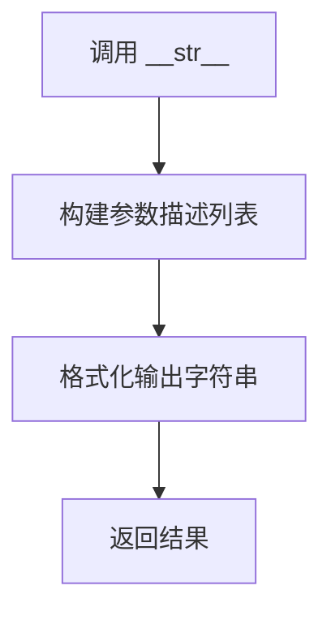

**带注释源码**：

```python
def __str__(self) -> str:
    params = [
        f"{param.name}: "
        + ("%s" if param.spec.required else "Optional[%s]")
        % (param.spec.type.value if param.spec.type else "Any")
        for param in self.parameters
    ]
    return (
        f"{self.names[0]}: {self.description.rstrip('.')}. "
        f"Params: ({', '.join(params)})"
    )
```

---

#### 3.2.6 `Command.__get__`

**描述**：实现描述符协议，使命令可以在类属性级别访问并绑定到实例。

**参数**：
- `instance`：`Optional[_CP]`，访问属性的实例对象
- `owner`：`type`，所属类

**返回值**：绑定到实例的新 `Command` 对象，或原始命令对象（类级别访问时）

**流程图**：

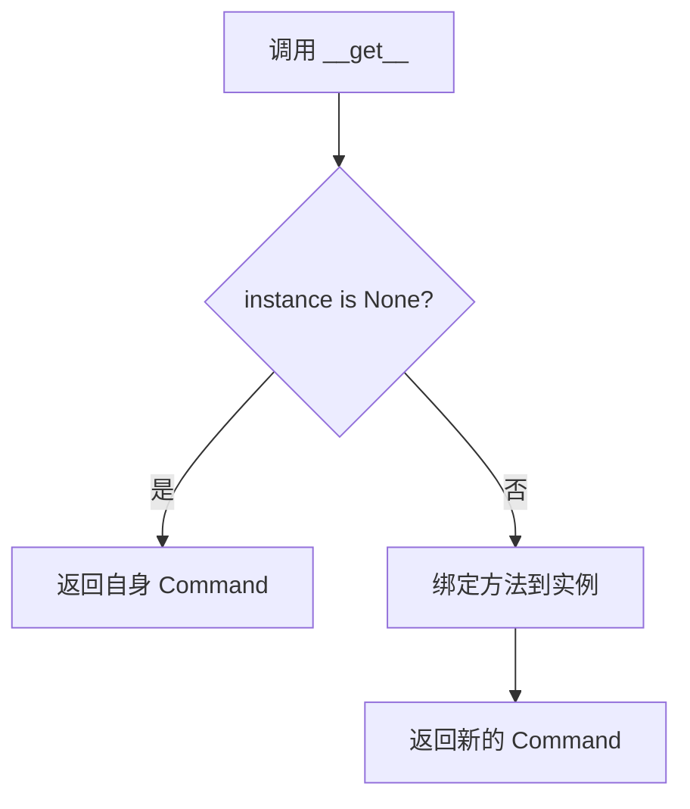

**带注释源码**：

```python
def __get__(self, instance, owner):
    if instance is None:
        # 在类级别访问，而非实例级别
        return self
    # 将方法绑定到实例
    return Command(
        self.names,
        self.description,
        self.method.__get__(instance, owner),
        self.parameters,
    )
```

---

## 4. 全局变量和类型定义

| 名称 | 类型 | 描述 |
|------|------|------|
| `P` | `ParamSpec` | 参数规格，用于保留可调用对象的参数签名 |
| `CO` | `TypeVar` | 命令输出类型变量 |
| `_CP` | `TypeVar` | 命令提供者类型变量，绑定至 `CommandProvider` |

## 5. 关键组件信息

| 组件名称 | 一句话描述 |
|----------|------------|
| `Command` | 泛型命令封装类，支持参数验证和描述符协议 |
| `CommandParameter` | 命令参数模式定义类（外部依赖） |
| `CommandProvider` | 命令提供者协议接口（外部依赖） |
| `inspect` 模块 | Python 标准库，用于检测函数签名和异步特性 |
| `Callable[Concatenate[_CP, P], CO]` | 带有隐藏 self 参数的方法类型 |

## 6. 潜在技术债务与优化空间

1. **类型转换安全性**：`cast(Callable[P, CO], method)` 强制转换可能隐藏类型错误，建议使用 `functools.partial` 或更严格的类型检查
2. **参数匹配逻辑**：当前仅比较参数名称排序，未考虑参数类型、默认值或顺序，建议增强验证逻辑
3. **缺少缓存机制**：重复调用 `_parameters_match` 会进行重复签名解析，可在 `__init__` 中缓存结果
4. **错误信息不够详细**：抛出 `ValueError` 时未显示具体哪些参数不匹配，调试困难
5. **缺少线程安全**：多线程环境下对实例属性的访问可能存在竞态条件
6. **文档完善**：类文档字符串中 `name` 属性实际为 `names`，存在不一致

## 7. 其他项目

### 7.1 设计目标与约束

- **泛型设计**：使用 `ParamSpec` 和 `TypeVar` 保留完整的函数签名信息
- **自描述性**：通过 `__str__` 方法提供人类可读的命令表示
- **描述符模式**：支持在类属性上直接使用命令对象

### 7.2 错误处理与异常设计

- `ValueError`：当函数参数与提供的模式不匹配时抛出
- 异常信息包含命令名称，但缺少具体不匹配参数详情

### 7.3 数据流与状态机

- **命令创建阶段**：验证参数匹配并存储元数据
- **命令调用阶段**：通过 `__call__` 转发至底层方法
- **实例绑定阶段**：通过 `__get__` 实现描述符协议，支持实例方法调用

### 7.4 外部依赖与接口契约

| 依赖项 | 用途 |
|--------|------|
| `inspect` | 获取函数签名和检测异步函数 |
| `CommandParameter` | 定义命令参数的模式和约束 |
| `CommandProvider` | 命令提供者的抽象协议 |
| `typing.Concatenate` | 表示带有隐藏首个参数的方法类型 |


### `cast`

`cast` 是 Python `typing` 模块提供的类型强制转换函数，用于在类型检查时将一个值强制转换为指定的类型。该函数本身不执行任何运行时转换，仅作为类型检查器的提示，帮助开发者明确表达意图的类型转换。

参数：

- `typ`：`Type[_T]`，目标类型，要将值转换成的类型
- `val`：任意类型，要进行强制转换的值

返回值：`_T`，转换后的值，类型为指定的目标类型

#### 流程图

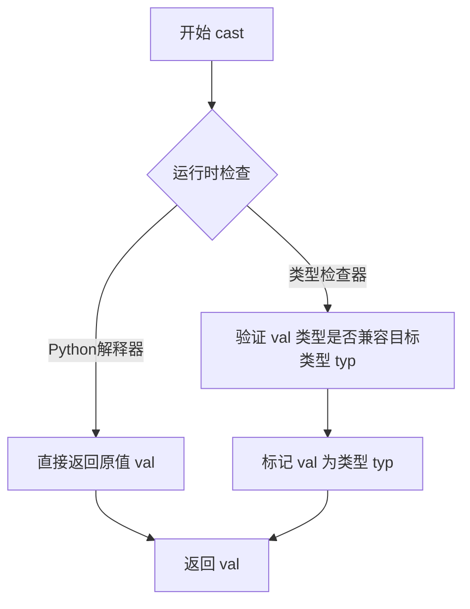

#### 带注释源码

```python
# 在 Command 类初始化方法中的使用
self.method = cast(Callable[P, CO], method)
```

**完整上下文源码：**

```python
def __init__(
    self,
    names: list[str],
    description: str,
    method: Callable[Concatenate[_CP, P], CO],
    parameters: list[CommandParameter],
):
    # 检查所有参数是否提供
    if not self._parameters_match(method, parameters):
        raise ValueError(
            f"Command {names[0]} has different parameters than provided schema"
        )
    self.names = names
    self.description = description
    # 方法技术上有一个 `self` 参数，但由于 Python 内部传递它，我们可以忽略。
    # cast 用于将 method 的类型从 Callable[Concatenate[_CP, P], CO] 
    # 转换为 Callable[P, CO]，因为 Command 类已经绑定了 _CP（CommandProvider 实例）
    self.method = cast(Callable[P, CO], method)
    self.parameters = parameters
```

**使用说明：**

在这个代码中，`cast` 的使用是为了解决类型声明与实际使用场景不匹配的问题：

1. **问题背景**：`method` 参数的类型是 `Callable[Concatenate[_CP, P], CO]`，这表示方法需要接收一个 `_CP` 类型的实例作为第一个参数，再加上 `P` 类型的参数。

2. **使用目的**：当 `Command` 类通过 `__get__` 方法绑定到具体实例时，`method` 已经被绑定，此时它的签名变为 `Callable[P, CO]`。使用 `cast` 告诉类型检查器可以将已绑定的方法视为 `Callable[P, CO]` 类型。

3. **运行时行为**：`cast` 在运行时不执行任何转换，只是返回原始的 `method` 值。这是一种静态类型检查的技巧，不影响运行时行为。


### Command.__init__

`Command` 类的构造函数，负责初始化命令对象的名称、描述、执行方法和参数列表。它会验证提供的参数模式与函数签名是否匹配，确保命令定义的准确性。

参数：

- `names`：`list[str]`，命令名称列表，用于标识命令的多个名称别名
- `description`：`str`，命令的简短描述，说明命令的功能
- `method`：`Callable[Concatenate[_CP, P], CO]`，命令执行的方法或函数，包含泛型类型参数以支持不同的参数和返回类型
- `parameters`：`list[CommandParameter]`，命令参数的模式定义列表，描述每个参数的规范

返回值：`None`，构造函数无返回值，用于初始化对象状态

#### 流程图

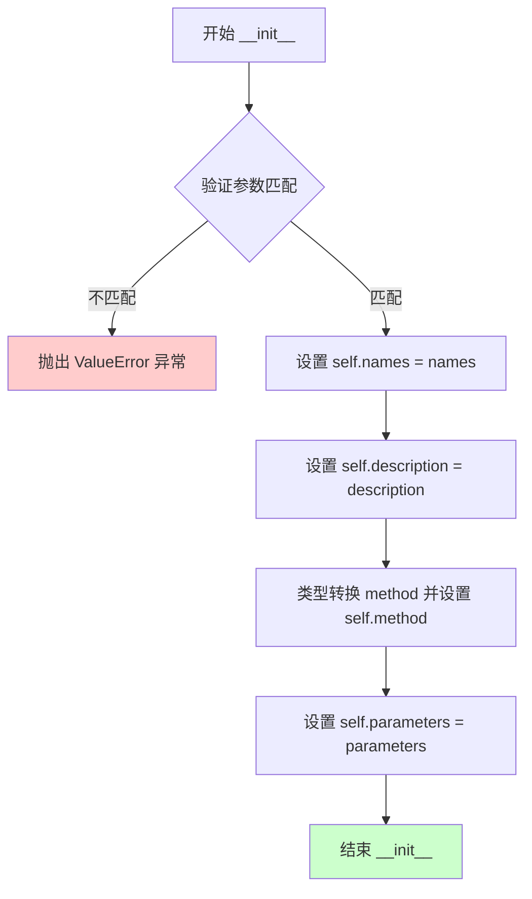

#### 带注释源码

```python
def __init__(
    self,
    names: list[str],
    description: str,
    method: Callable[Concatenate[_CP, P], CO],
    parameters: list[CommandParameter],
):
    # Check if all parameters are provided
    # 验证传入的参数模式与方法签名是否匹配
    if not self._parameters_match(method, parameters):
        # 如果不匹配，抛出 ValueError 异常并说明错误原因
        raise ValueError(
            f"Command {names[0]} has different parameters than provided schema"
        )
    
    # 存储命令名称列表（支持多个别名）
    self.names = names
    
    # 存储命令的功能描述
    self.description = description
    
    # Method technically has a `self` parameter, but we can ignore that
    # since Python passes it internally.
    # 将方法进行类型转换，移除第一个 _CP 参数类型，保留 P 和 CO 类型
    self.method = cast(Callable[P, CO], method)
    
    # 存储命令的参数模式定义列表
    self.parameters = parameters
```


### `Command.is_async`

该属性用于判断当前命令的方法是否为异步函数（协程函数）。它通过 Python 内置的 `inspect.iscoroutinefunction` 函数检查底层方法是否带有 `async def` 定义，并返回布尔值。

参数：

- `self`：`Command`，隐式参数，表示命令实例本身

返回值：`bool`，如果命令方法是异步协程函数返回 `True`，否则返回 `False`

#### 流程图

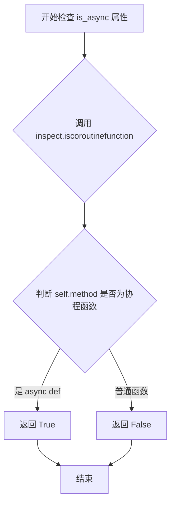

#### 带注释源码

```python
@property
def is_async(self) -> bool:
    """检查命令方法是否为异步函数。
    
    该属性通过 Python 的 inspect 模块来判断底层方法是否使用
    async def 定义，从而确定该命令在执行时是否需要 await。
    
    Returns:
        bool: 如果方法是通过 async def 定义的协程函数返回 True，
              否则返回 False。
    """
    return inspect.iscoroutinefunction(self.method)
```


### `Command._parameters_match`

该方法用于验证给定函数的参数列表是否与提供的命令参数模式匹配，通过比较函数签名中的参数名称与 CommandParameter 列表中的参数名称来判断。

参数：

- `func`：`Callable`，需要验证的函数或方法对象
- `parameters`：`list[CommandParameter]` ，已定义的命令参数模式列表

返回值：`bool`，如果函数参数名称与提供的参数模式名称匹配返回 `True`，否则返回 `False`

#### 流程图

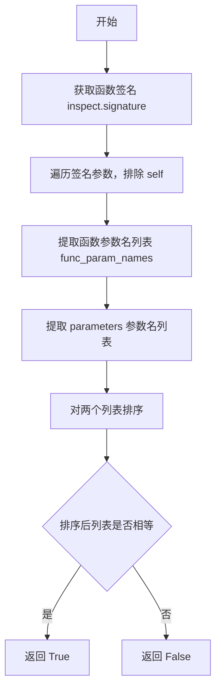

#### 带注释源码

```python
def _parameters_match(
    self, func: Callable, parameters: list[CommandParameter]
) -> bool:
    """检查函数参数是否与提供的参数模式匹配。
    
    通过比较函数签名中的参数名与 CommandParameter 列表中的参数名
    来验证两者是否一致（忽略顺序）。
    
    Args:
        func: 要验证的函数或方法对象
        parameters: 提供的 CommandParameter 列表
    
    Returns:
        bool: 如果参数名匹配返回 True，否则返回 False
    """
    # 获取被检查函数的签名对象
    signature = inspect.signature(func)
    
    # 从函数签名中提取参数名列表，排除 'self'（适用于实例方法）
    func_param_names = [
        param.name
        for param in signature.parameters.values()
        if param.name != "self"
    ]
    
    # 从 CommandParameter 列表中提取参数名
    names = [param.name for param in parameters]
    
    # 排序后比较两个名称列表，返回比较结果
    # 使用排序可以忽略参数顺序，只关注参数名称是否一致
    return sorted(func_param_names) == sorted(names)
```


### `Command.__call__`

使 `Command` 实例可调用，将调用请求委托给内部存储的 `method`（被绑定的方法），实现类似函数的行为。

参数：

- `*args: P.args`：可变位置参数，类型由 ParamSpec P 定义，用于传递给底层方法的位置参数
- `**kwargs: P.kwargs`：可变关键字参数，类型由 ParamSpec P 定义，用于传递给底层方法的关键字参数

返回值：`CO`，命令输出类型，由 TypeVar CO 定义，表示底层方法执行后返回的结果类型

#### 流程图

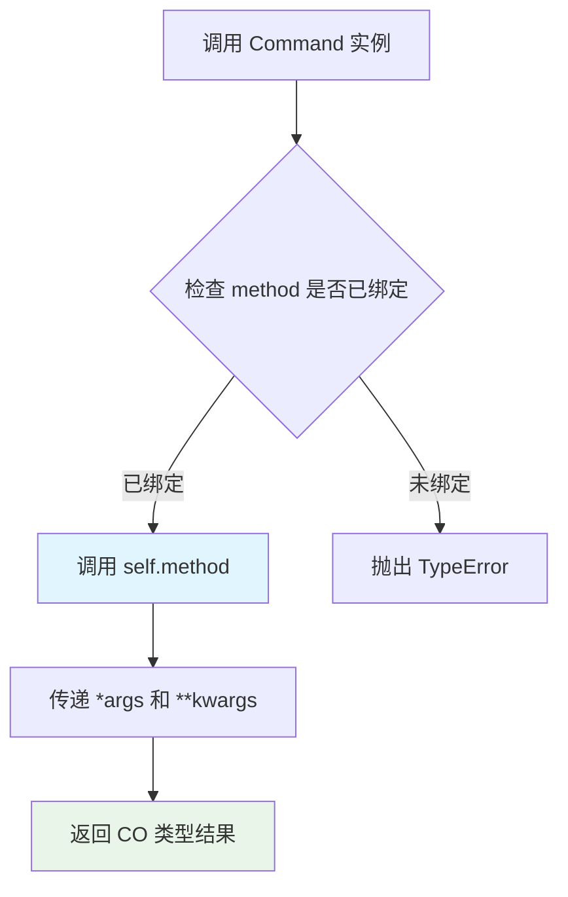

#### 带注释源码

```python
def __call__(self, *args: P.args, **kwargs: P.kwargs) -> CO:
    """使 Command 实例可调用的魔术方法。
    
    当实例被调用时，将参数直接传递给内部存储的 method（已绑定的可调用对象）。
    由于 Command 类实现了 __get__ 描述器协议，当访问 instance.command 时，
    会返回绑定到该实例的 Command 对象，此时 self.method 已经被正确绑定，
    因此这里只需要传递 P 类型的参数。
    
    Args:
        *args: 可变位置参数，由 ParamSpec P 定义类型约束
        **kwargs: 可变关键字参数，由 ParamSpec P 定义类型约束
    
    Returns:
        CO: 底层方法执行后返回的结果，类型由 TypeVar CO 约束
    
    Raises:
        TypeError: 如果 method 未绑定到实例（通常由 __get__ 描述器处理）
    """
    return self.method(*args, **kwargs)
```


### `Command.__str__`

该方法生成命令的人类可读字符串表示形式，包含命令名称、描述和格式化后的参数信息。

参数：

- `self`：`Command`，调用该方法的 Command 实例本身

返回值：`str`，命令的字符串表示，格式为“{命令名}: {描述}. Params: ({参数列表})”

#### 流程图

```mermaid
flowchart TD
    A[Start __str__] --> B[Initialize empty params list]
    B --> C{For each param in self.parameters}
    C --> D{Is param.spec.required?}
    D -->|Yes| E[Format: param.name: type]
    D -->|No| F[Format: Optional[type]]
    E --> G{param.spec.type exists?}
    F --> G
    G -->|Yes| H[Use param.spec.type.value]
    G -->|No| I[Use 'Any']
    H --> J[Add formatted string to params list]
    I --> J
    J --> K{More params?}
    K -->|Yes| C
    K -->|No| L[Join params with ', ']
    L --> M[Format final string: name: description. Params: (params)]
    M --> N[Return string]
    N --> O[End]
```

#### 带注释源码

```
def __str__(self) -> str:
    """Generate a human-readable string representation of the Command.
    
    Returns:
        str: A formatted string containing command name, description, and parameters.
    """
    # Build a list of parameter strings by iterating through all parameters
    params = [
        # Format: "param_name: Type" for required params
        # Format: "param_name: Optional[Type]" for optional params
        f"{param.name}: "
        + ("%s" if param.spec.required else "Optional[%s]")
        % (param.spec.type.value if param.spec.type else "Any")
        for param in self.parameters
    ]
    # Construct final string: "{command_name}: {description}. Params: ({params})"
    # description.rstrip('.') removes trailing period from description if present
    return (
        f"{self.names[0]}: {self.description.rstrip('.')}. "
        f"Params: ({', '.join(params)})"
    )
```


### Command.__get__

这是 Python 描述符协议的实现方法，用于实现命令的实例绑定。当在类级别访问时返回命令本身；当通过实例访问时，将方法绑定到该实例并返回一个新的 Command 对象。

参数：

- `self`：`Command`，当前的 Command 实例
- `instance`：`object | None`，访问描述符的实例对象（如果是类级别访问则为 None）
- `owner`：`type`，拥有描述符的类（即 Command 所在的类）

返回值：`Command`，返回命令对象（类级别访问返回原对象，实例访问返回绑定方法的新对象）

#### 流程图

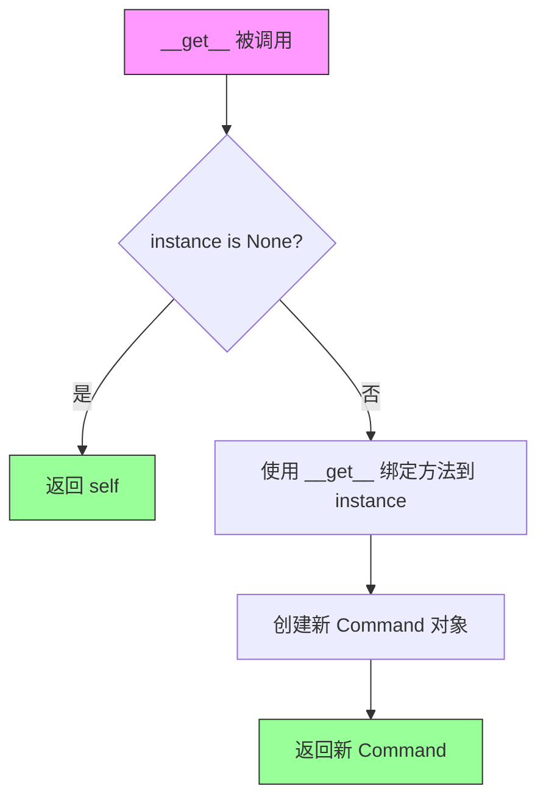

#### 带注释源码

```python
def __get__(self, instance, owner):
    """实现描述符协议，支持命令的实例绑定。
    
    当通过类访问时返回自身，通过实例访问时返回绑定该实例的方法。
    这使得 Command 可以作为类的描述符属性，实现类似方法的调用方式。
    
    Args:
        instance: 访问描述符的实例，类级别访问时为 None
        owner: 拥有描述符的类
    
    Returns:
        类级别访问返回 self，实例访问返回绑定方法的新 Command 对象
    """
    if instance is None:
        # Accessed on the class, not an instance
        # 类级别访问（如 Command.name）时，返回描述符本身
        return self
    # Bind the method to the instance
    # 实例访问时，使用 Python 的方法绑定机制将方法绑定到实例
    # 创建一个新的 Command，方法已绑定到指定实例
    return Command(
        self.names,
        self.description,
        self.method.__get__(instance, owner),
        self.parameters,
    )
```

## 关键组件


### Command 类

核心命令类，封装了命令的名称、描述、执行方法和参数信息，支持同步和异步命令执行，并实现描述符协议以绑定到实例。

### _parameters_match 方法

验证函数签名中的参数名称与提供的 CommandParameter 列表是否匹配，确保命令定义与实际函数签名一致。

### is_async 属性

通过 inspect 模块检查底层方法是否为协程函数，以确定命令的异步执行特性。

### __get__ 描述符方法

实现描述符协议，使 Command 实例能够绑定到对象实例，返回绑定方法的新 Command 对象。

### __call__ 方法

将命令调用转发到底层方法，支持直接调用 Command 实例作为可调用对象。

### __str__ 方法

生成命令的可读字符串表示，包含命令名称、描述和格式化后的参数信息。

### CommandParameter 依赖

依赖外部的 CommandParameter 类来定义命令的参数模式，支持必选和可选参数的类型规范。

### 类型参数 P, CO, _CP

使用泛型参数 P 用于参数规格、CO 用于命令输出类型、_CP 绑定到 CommandProvider 协议。


## 问题及建议


### 已知问题

-   **异步处理不完整**：`__call__` 方法未区分同步和异步方法，当 `is_async` 为 `True` 时直接调用 `self.method` 会返回协程对象而非执行结果，调用方无法直接获取返回值。
-   **参数验证过于宽松**：`_parameters_match` 仅比较参数名称集合（忽略顺序和类型），未验证参数类型、默认值和顺序，可能导致运行时参数映射错误。
-   **类型安全风险**：使用 `cast(Callable[P, CO], method)` 强制转换绕过了类型检查，隐藏了实际类型不匹配的风险。
-   **性能开销**：`is_async` 每次调用都执行 `inspect.iscoroutinefunction` 检查，未缓存结果；`_parameters_match` 每次实例化都重新获取函数签名。
-   **错误信息不明确**：参数不匹配时仅抛出通用 `ValueError`，未包含具体哪些参数缺失或多余。
-   **描述符实现不完善**：`__get__` 返回新创建的 `Command` 对象时，未复用原对象的参数列表引用，可能导致意外的副作用。

### 优化建议

-   在 `__call__` 中添加异步分支处理，或提供 `execute` 方法显式区分异步执行逻辑。
-   增强 `_parameters_match` 验证逻辑：比较参数顺序、类型注解（若存在），并提供详细的差异报告。
-   移除 `cast` 调用，通过泛型约束或类型守卫确保类型安全。
-   使用 `@functools.cached_property` 缓存 `is_async` 结果，或在 `__init__` 时预先计算并存储。
-   将 `inspect.signature` 结果缓存，避免重复反射开销。
-   在 `ValueError` 中包含具体的参数差异信息，如缺失参数、多余参数列表。
-   在 `__get__` 中复用 `self.parameters` 而非重新传递引用，确保引用一致性。


## 其它


### 设计目标与约束

本类设计目标是为框架提供一个类型安全的命令抽象层，支持同步和异步方法的统一封装，同时通过描述符协议实现方法的实例绑定。核心约束包括：1）方法签名必须与提供的参数模式匹配；2）泛型参数P使用ParamSpec以保持类型提示的完整性；3）命令名称支持多个别名（通过names列表）；4）必须兼容CommandProvider接口的实现类。

### 错误处理与异常设计

主要异常场景：1）参数不匹配时抛出ValueError，详细说明命令名称和参数差异；2）类型检查在初始化时进行，使用inspect.signature获取函数签名并与提供的CommandParameter列表对比；3）不支持的参数类型或可选参数处理通过CommandParameter的spec.required和spec.type属性控制。

### 外部依赖与接口契约

依赖项：1）typing模块的Callable、Generic、ParamSpec、TypeVar等泛型工具；2）inspect模块用于获取函数签名和判断异步函数；3）forge.agent.protocols中的CommandProvider接口（_CP的类型上界）；4）本模块的CommandParameter类。接口契约：method参数必须是可调用对象，parameters必须是CommandParameter实例列表，names至少包含一个元素。

### 线程安全与并发考虑

该类本身不包含共享状态，线程安全性取决于method所指向的实际函数。__get__描述符方法每次调用会创建新的Command实例绑定到特定实例，属于轻量级操作。注意：is_async属性基于method的原始函数判断，绑定后仍能正确识别异步特性。

### 序列化与反序列化

当前实现不支持直接序列化。__str__方法提供了命令的文本描述，可用于日志和调试。序列化时需要额外处理：1）method属性无法直接序列化；2）需要保存names、description和parameters；3）反序列化时需要通过工厂函数重新绑定method。

### 性能考虑

1）_parameters_match在初始化时调用，签名检查有一定性能开销，但仅执行一次；2）is_async属性每次访问都调用inspect.iscoroutinefunction，可考虑缓存结果；3）__str__方法在字符串格式化时遍历parameters列表，时间复杂度O(n)。

### 兼容性说明

1）使用from __future__ import annotations支持PEP 563延迟注解；2）Python 3.9+可使用内置types.GenericAlias；3）要求Python版本支持ParamSpec（Python 3.10+完全支持，3.9可通过from __future__ import annotations部分支持）。


    