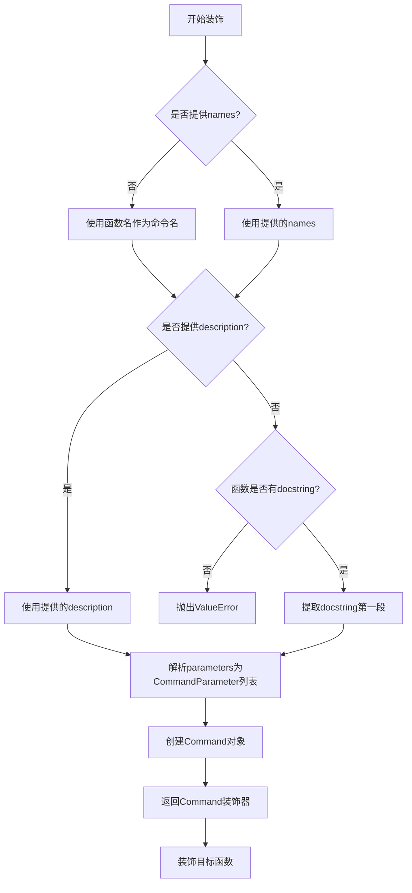
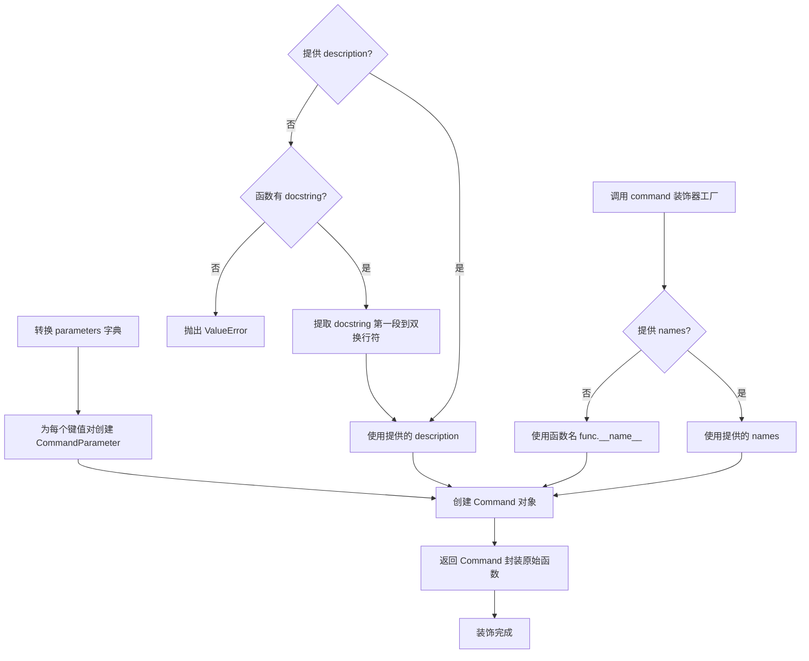
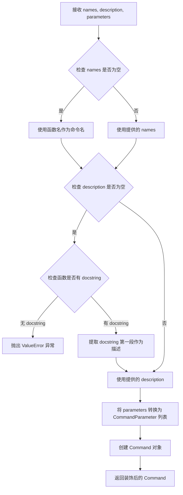

# `.\AutoGPT\classic\forge\forge\command\decorator.py` 详细设计文档

这是一个命令装饰器模块，通过@command装饰器将普通函数转换为Command对象，支持自定义命令名称、描述和JSON Schema格式的参数定义，用于构建命令行或API命令系统。

## 整体流程



## 类结构

```
Command (外部导入)
├── CommandParameter (外部导入)
└── command (本模块装饰器函数)
```

## 全局变量及字段


### `_CP`
    
类型变量，用于约束命令装饰器中命令类的类型参数，限制其类型必须实现 CommandProvider 协议

类型：`TypeVar`
    


    

## 全局函数及方法


### `command`

这是一个装饰器工厂函数，用于将Python函数转换为`Command`对象，支持自定义命令名称、描述和JSON Schema格式的参数定义。

#### 文件的整体运行流程

1. 调用`command()`装饰器工厂，传入可选的`names`、`description`和`parameters`参数
2. 返回一个`decorator`闭包函数
3. 当装饰器应用于目标函数时：
   - 自动提取函数名作为备用命令名称
   - 从函数的docstring中提取描述（如果未提供）
   - 将parameters字典转换为`CommandParameter`对象列表
   - 创建并返回`Command`实例，封装原始函数及其元数据

#### 参数

- `names`：`list[str] = []`，命令名称列表，若未提供则使用函数名
- `description`：`Optional[str] = None`，命令描述，若未提供则从函数docstring提取
- `parameters`：`dict[str, JSONSchema] = {}`，参数字典，键为参数名，值为JSON Schema规范

#### 返回值

`Callable[[Callable[Concatenate[_CP, P], CO]], Command[P, CO]]`，返回一个装饰器函数，接收被装饰的函数并返回`Command`对象

#### 流程图



#### 带注释源码

```python
import re
from typing import Callable, Concatenate, Optional, TypeVar

# 导入Command相关的协议和模型
from forge.agent.protocols import CommandProvider
from forge.models.json_schema import JSONSchema

# 从当前包导入Command相关类
from .command import CO, Command, CommandParameter, P

# 类型变量，表示任何CommandProvider的子类
_CP = TypeVar("_CP", bound=CommandProvider)


def command(
    names: list[str] = [],           # 命令名称列表，可选
    description: Optional[str] = None,  # 命令描述，可选
    parameters: dict[str, JSONSchema] = {},  # 参数JSON Schema映射，可选
) -> Callable[[Callable[Concatenate[_CP, P], CO]], Command[P, CO]]:
    """
    The command decorator is used to make a Command from a function.

    Args:
        names (list[str]): The names of the command.
            If not provided, the function name will be used.
        description (str): A brief description of what the command does.
            If not provided, the docstring until double line break will be used
            (or entire docstring if no double line break is found)
        parameters (dict[str, JSONSchema]): The parameters of the function
            that the command executes.
    """

    def decorator(func: Callable[Concatenate[_CP, P], CO]) -> Command[P, CO]:
        """
        装饰器内部函数，实际执行装饰逻辑
        参数:
            func: 被装饰的函数，第一个参数必须是CommandProvider类型
        返回:
            Command对象封装了原始函数及其元数据
        """
        # 获取函数的文档字符串
        doc = func.__doc__ or ""
        
        # 如果没有提供names，使用函数名作为命令名称
        command_names = names or [func.__name__]
        
        # 如果没有提供description，从docstring提取
        if not (command_description := description):
            # 检查函数是否有docstring
            if not func.__doc__:
                raise ValueError("Description is required if function has no docstring")
            
            # 使用正则表达式将多个空白字符替换为单个空格
            # 然后按双换行符分割，取第一部分作为描述
            command_description = re.sub(r"\s+", " ", doc.split("\n\n")[0].strip())

        # 将parameters字典转换为CommandParameter对象列表
        typed_parameters = [
            CommandParameter(
                name=param_name,    # 参数名称
                spec=spec,          # JSON Schema规范
            )
            for param_name, spec in parameters.items()
        ]

        # 使用Command类封装函数及其元数据
        command = Command(
            names=command_names,           # 命令名称列表
            description=command_description,  # 命令描述
            method=func,                   # 原始函数
            parameters=typed_parameters,   # 参数列表
        )

        return command  # 返回构建的Command对象

    return decorator  # 返回装饰器函数
```

#### 关键组件信息

| 组件名称 | 一句话描述 |
|---------|-----------|
| `CommandProvider` | 命令提供者的抽象协议接口 |
| `Command` | 封装可执行命令及其元数据的核心类 |
| `CommandParameter` | 表示命令参数的模型类，包含名称和JSON Schema规范 |
| `JSONSchema` | JSON Schema类型定义，用于描述参数结构 |
| `P` | 命令参数的类型变量 |
| `CO` | 命令输出（返回值）的类型变量 |

#### 潜在的技术债务或优化空间

1. **可变默认参数问题**：`names`和`parameters`使用可变默认参数（`[]`和`{}`），这可能导致意外的状态共享，建议改为`None`并在函数内检查
2. **正则表达式编译**：在循环中每次调用`re.sub`可以预先编译正则表达式以提高性能
3. **类型推断局限**：使用`Concatenate[_CP, P]`限制了第一个参数必须是`CommandProvider`类型，缺乏灵活性
4. **错误处理不足**：仅检查docstring存在性，未验证JSON Schema的有效性
5. **文档提取逻辑简化**：使用简单的`\n\n`分割，可能无法处理嵌套代码块或特殊格式的docstring

#### 其它项目

**设计目标与约束**

- 设计目标：提供一种声明式的方式来定义Agent命令，将普通Python函数转换为可被发现和执行的命令对象
- 约束：被装饰的函数第一个参数必须是`CommandProvider`类型

**错误处理与异常设计**

- 当未提供`description`且函数无`docstring`时，抛出`ValueError`
- 未对`parameters`中的JSON Schema进行有效性验证

**数据流与状态机**

- 数据流：输入函数和元数据 → 转换/提取 → 封装为Command对象 → 返回
- 无状态机设计，纯函数式转换

**外部依赖与接口契约**

- 依赖：`forge.agent.protocols.CommandProvider`、`forge.models.json_schema.JSONSchema`、本地`.command`模块
- 契约：装饰器返回`Command[P, CO]`对象，被装饰函数需符合`Callable[Concatenate[_CP, P], CO]`签名


### `command`

这是一个命令装饰器函数，用于将普通函数转换为 `Command` 对象，支持自定义命令名称、描述和参数规范。

参数：

- `names`：`list[str]`，命令名称列表，默认为空列表，将使用函数名作为命令名
- `description`：`Optional[str]`，命令描述，默认为 None，将从函数 docstring 中提取
- `parameters`：`dict[str, JSONSchema]`，命令参数规范字典，默认为空字典

返回值：`Callable[[Callable[Concatenate[_CP, P], CO]], Command[P, CO]]`，返回一个装饰器函数，该装饰器接收一个函数并返回 `Command` 对象

#### 流程图



#### 带注释源码

```python
import re
from typing import Callable, Concatenate, Optional, TypeVar

from forge.agent.protocols import CommandProvider
from forge.models.json_schema import JSONSchema

from .command import CO, Command, CommandParameter, P

# 定义类型变量 _CP，约束为 CommandProvider 的子类
_CP = TypeVar("_CP", bound=CommandProvider)


def command(
    names: list[str] = [],           # 命令名称列表，默认使用函数名
    description: Optional[str] = None,  # 命令描述，默认从 docstring 提取
    parameters: dict[str, JSONSchema] = {},  # 参数规范字典
) -> Callable[[Callable[Concatenate[_CP, P], CO]], Command[P, CO]]:
    """
    The command decorator is used to make a Command from a function.

    Args:
        names (list[str]): The names of the command.
            If not provided, the function name will be used.
        description (str): A brief description of what the command does.
            If not provided, the docstring until double line break will be used
            (or entire docstring if no double line break is found)
        parameters (dict[str, JSONSchema]): The parameters of the function
            that the command executes.
    """

    def decorator(func: Callable[Concatenate[_CP, P], CO]) -> Command[P, CO]:
        # 获取函数的 docstring，如果不存在则为空字符串
        doc = func.__doc__ or ""
        
        # 如果没有提供 names，则使用函数名作为命令名
        command_names = names or [func.__name__]
        
        # 如果没有提供 description，则从 docstring 中提取
        if not (command_description := description):
            # 检查函数是否有 docstring
            if not func.__doc__:
                raise ValueError("Description is required if function has no docstring")
            # 将 docstring 中的空白字符替换为单个空格，取第一段（双换行符前）
            command_description = re.sub(r"\s+", " ", doc.split("\n\n")[0].strip())

        # 将 parameters 字典转换为 CommandParameter 对象列表
        typed_parameters = [
            CommandParameter(
                name=param_name,
                spec=spec,
            )
            for param_name, spec in parameters.items()
        ]

        # 创建 Command 对象，包装原始函数
        command = Command(
            names=command_names,
            description=command_description,
            method=func,
            parameters=typed_parameters,
        )

        return command

    return decorator
```

## 关键组件


### command 装饰器

核心组件，将Python函数转换为Command对象的装饰器，支持通过元数据配置命令名称、描述和参数。

### 参数解析与默认值处理

处理装饰器的三个可选参数：names（命令名称列表）、description（命令描述）、parameters（参数规范字典），并为缺失参数提供默认值逻辑。

### Docstring 解析组件

从函数的`__doc__`中提取命令描述，使用正则表达式将双换行符前的文本标准化为单行描述，支持无描述时的错误抛出。

### CommandParameter 构造

将JSONSchema规范的参数字典转换为CommandParameter对象列表，用于构建Command的参数元数据。

### Command 对象构造

整合命令名称、描述、原始函数和参数列表，创建完整的Command对象并返回。

### 类型变量与泛型约束

使用TypeVar定义`_CP`类型变量，绑定至CommandProvider协议，确保装饰器函数第一个参数类型符合命令提供者规范。


## 问题及建议


### 已知问题

-   **可变默认参数陷阱**：`names: list[str] = []` 和 `parameters: dict[str, JSONSchema] = {}` 使用可变默认参数，在多次调用时会共享同一对象，可能导致意外的状态修改
-   **正则表达式未预编译**：`re.sub(r"\s+", " ", ...)` 每次装饰器调用都会重新编译正则表达式，影响性能
-   **类型变量定义缺失**：`P` 和 `CO` 类型变量在使用处没有明确导入或定义，依赖外部上下文，类型安全不足
-   **docstring 解析逻辑冗余**：先检查 `func.__doc__` 又在 `not command_description` 块中再次检查，逻辑可简化
-   **参数验证缺失**：未验证 `names` 列表是否为空、`parameters` 字典是否包含无效的 JSONSchema 对象
-   **缺少函数签名自动提取**：手动传递 `parameters` 参数，未实现从函数签名自动提取参数类型信息

### 优化建议

-   使用 `None` 作为默认值，并在函数体内初始化空列表/字典，或使用不可变序列
-   将正则表达式 `r"\s+"` 预编译为模块级常量：`re.compile(r"\s+")`
-   在模块顶部或类型定义区域明确声明 `P` 和 `CO` 类型变量的泛型约束
-   简化 docstring 解析逻辑，统一处理空值和空字符串的情况
-   添加参数验证逻辑，确保 `names` 非空且 `parameters` 符合预期格式
-   考虑使用 `inspect` 模块从函数签名自动提取参数信息，减少手动传递参数的负担

## 其它


### 设计目标与约束

该装饰器的主要设计目标是将Python函数转换为可执行的命令对象，支持命令名称自定义、描述自动提取和参数类型定义。约束包括：description参数与函数docstring二选一、parameters的key必须与函数实际参数名匹配、装饰器仅支持第一个参数为CommandProvider类型的函数。

### 错误处理与异常设计

当函数既没有提供description参数也没有docstring时，抛出ValueError异常，提示"Description is required if function has no docstring"。如果names列表为空，则使用函数名作为默认命令名。若parameters字典中的键与函数实际参数名不匹配，可能导致Command对象创建后调用时出错。

### 外部依赖与接口契约

该模块依赖以下外部组件：`re`模块用于docstring解析、`typing`模块用于类型注解、`forge.agent.protocols.CommandProvider`协议作为第一个参数类型约束、`forge.models.json_schema.JSONSchema`作为参数规范类型、`.command`模块中的`CO`、`Command`、`CommandParameter`、`P`类。装饰器返回类型为`Command[P, CO]`，其中P为参数元组类型，CO为返回值类型。

### 性能考虑

该装饰器在函数定义时执行一次创建Command对象，不涉及运行时性能开销。docstring解析使用正则表达式`\s+`替换，可能在大段docstring场景下有微小开销，但总体性能可控。

### 安全性考虑

该装饰器本身不直接处理敏感数据，但需要注意Command对象中存储的description可能包含函数实现细节。建议用户在使用时确保docstring不泄露敏感信息。parameters中的JSONSchema应避免包含敏感默认值。

### 兼容性考虑

该代码使用Python 3.9+的类型注解语法（如`list[str]`），需要Python 3.9及以上版本。装饰器设计遵循开闭原则，可通过扩展`command`函数参数支持更多功能。

### 使用示例

```python
from forge.agent.protocols import CommandProvider

class MyAgent(CommandProvider):
    pass

@command(names=["greet", "hello"], description="Greet the user")
def greet_command(agent: MyAgent, name: str) -> str:
    """Greet a user by name.
    
    Args:
        name: The name of the user to greet.
    
    Returns:
        A greeting message.
    """
    return f"Hello, {name}!"
```

### 测试策略

应覆盖以下测试场景：提供names和description时使用提供值、不提供description时使用docstring第一段、不提供description且无docstring时抛出ValueError、names为空时使用函数名、parameters正确转换为CommandParameter列表、装饰器返回的Command对象可正常调用。

### 配置与扩展性

当前装饰器参数固定，如需扩展支持更多元数据（如命令分组、权限要求、超时设置等），建议通过**kwargs或额外配置类实现。Command类的扩展不影响该装饰器核心逻辑。

### 版本历史与变更记录

初始版本支持names、description、parameters三个核心配置项，实现从函数到Command对象的转换逻辑。


    