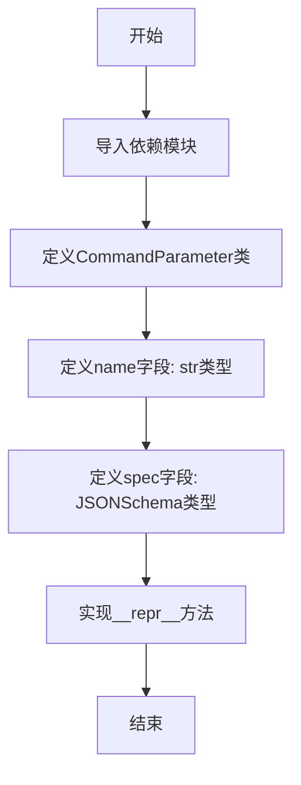
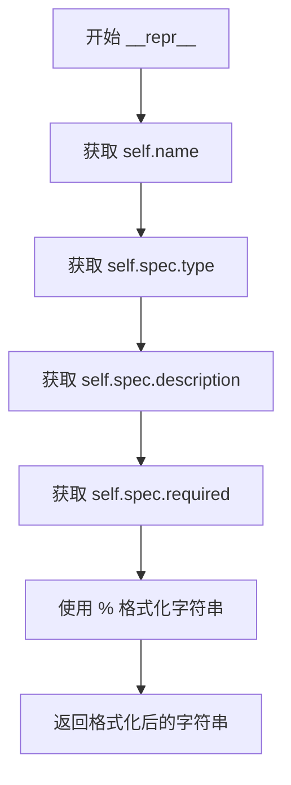

# `.\AutoGPT\classic\forge\forge\command\parameter.py` 详细设计文档

这是一个命令参数模型类，继承自Pydantic的BaseModel，用于定义命令参数的名称和JSON Schema规范，支持参数的类型、描述和必需性验证。

## 整体流程



## 类结构

```
CommandParameter (命令参数模型)
├── BaseModel (Pydantic基类)
│   └── CommandParameter
```

## 全局变量及字段


### `CommandParameter.name`
    
参数名称

类型：`str`
    


### `CommandParameter.spec`
    
参数的JSON Schema规范

类型：`JSONSchema`
    
    

## 全局函数及方法


### `CommandParameter.__repr__`

该方法返回 CommandParameter 类的字符串表示形式，用于调试和日志输出。它将对象的 name、spec.type、spec.description 和 spec.required 属性格式化为可读的字符串。

参数：

- `self`：`CommandParameter`，隐式参数，表示当前 CommandParameter 实例

返回值：`str`，返回格式化的字符串，形式为 `CommandParameter('name', 'type', 'description', required)`

#### 流程图



#### 带注释源码

```python
def __repr__(self):
    """
    返回 CommandParameter 类的字符串表示形式
    
    该方法重写了 Pydantic BaseModel 的默认 __repr__ 行为，
    提供更详细的调试信息，包括参数名称、类型、描述和是否必需。
    
    Returns:
        str: 格式化的字符串，示例：CommandParameter('param_name', 'string', '参数描述', True)
    """
    return "CommandParameter('%s', '%s', '%s', %s)" % (
        self.name,              # 参数名称
        self.spec.type,         # JSONSchema 类型（如 string, integer 等）
        self.spec.description,  # JSONSchema 描述信息
        self.spec.required,     # 是否必需的布尔值
    )
```

## 关键组件


### CommandParameter 类

命令参数模型类，继承自 Pydantic 的 BaseModel，用于表示一个命令的参数定义，包含参数名称和 JSON Schema 规范。

### JSONSchema 依赖

从 forge.models.json_schema 导入的 JSON Schema 模型，用于定义命令参数的规范结构，包括类型、描述等信息。

### __repr__ 方法

自定义的字符串表示方法，用于返回命令参数的格式化字符串表示，包含参数名称、类型、描述和必需状态。


## 问题及建议


### 已知问题

-   **字段验证不足**：`name` 字段缺少长度限制和格式验证（如不允许空字符串、特殊字符等）
-   **缺少文档字符串**：类本身没有类级别的文档说明，缺乏对业务含义的解释
-   **`__repr__` 方法实现不够健壮**：使用硬编码的 % 格式化且直接访问 `spec.type`、`spec.description` 等属性，若 `spec` 为 None 或属性缺失会导致 AttributeError
-   **缺少模型配置**：未使用 Pydantic 的 `ConfigDict` 或 `model_config` 进行配置（如严格模式、别名处理等）
-   **未定义比较方法**：缺少 `__eq__`、`__hash__` 等方法，在需要对象比较或作为字典键时可能不符合预期
-   **外部依赖不明确**：`JSONSchema` 类型依赖外部模块 `forge.models.json_schema`，但代码中未做类型检查或导入验证

### 优化建议

-   为 `name` 字段添加 Pydantic 验证器约束，如 `@field_validator`、`Field` 配置最小/最大长度
-   为类添加 docstring 说明业务用途和字段含义
-   重构 `__repr__` 使用 f-string 或 `model_dump_json()`，并添加异常处理
-   考虑添加 `model_config = ConfigDict(...)` 以启用严格模式或其他行为
-   如需比较功能，实现 `__eq__` 和 `__hash__` 方法
-   添加类型检查或运行时验证确保 `JSONSchema` 依赖可用


## 其它


### 设计目标与约束

本类旨在为命令行系统提供参数定义的能力，通过pydantic的BaseModel实现自动数据验证。设计约束包括：name字段必须为非空字符串，spec字段必须为有效的JSONSchema对象。该类不可被继承扩展（未设置config或allow_mutation），确保实例的不可变性。

### 错误处理与异常设计

由于继承自pydantic.BaseModel，验证错误由pydantic处理。当name不是字符串或spec不是有效的JSONSchema时，会抛出ValidationError。__repr__方法不涉及复杂逻辑，理论上不会抛出异常，但建议在spec字段为None时添加防御性检查。

### 数据流与状态机

该类作为数据容器，不涉及状态机或复杂数据流。创建CommandParameter实例时，输入name和spec，经过pydantic验证后存储。数据流为：外部输入 → pydantic验证 → 实例化 → 字符串表示（通过__repr__）。

### 外部依赖与接口契约

主要依赖pydantic库和forge.models.json_schema模块。接口契约方面：构造函数接受name(str)和spec(JSONSchema)两个参数，返回CommandParameter实例。__repr__返回格式化字符串，不支持动态修改字段。

### 序列化与反序列化设计

继承自pydantic.BaseModel，默认支持dict()、json()等序列化方法。序列化时输出{"name": "...", "spec": {...}}格式。可以通过model_dump()和model_dump_json()进行深度控制。

### 性能考虑

该类非常轻量，性能开销主要来自pydantic的验证机制。对于大量实例创建场景，建议使用model_validate或直接构造函数。__repr__方法每次调用都会格式化字符串，如需频繁调用建议缓存。

### 安全性考虑

该类本身不直接处理敏感数据，但name和spec字段内容取决于用户输入。建议对spec中的description等文本进行XSS过滤（如果后续用于Web展示）。JSONSchema的解析和验证由forge.models.json_schema模块负责。

### 测试策略

建议测试用例包括：正常创建实例、name类型错误、spec类型错误、spec为None的情况、__repr__输出格式验证、序列化/反序列化往返测试。Mock JSONSchema对象进行单元测试。

### 使用示例

```python
from forge.models.json_schema import JSONSchema
param = CommandParameter(name="input_file", spec=JSONSchema(type="string", description="输入文件路径"))
print(param)  # 输出: CommandParameter('input_file', 'string', '输入文件路径', None)
```

    