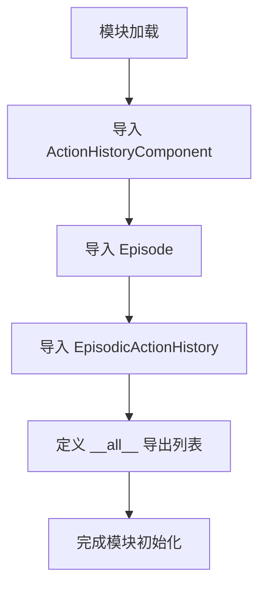
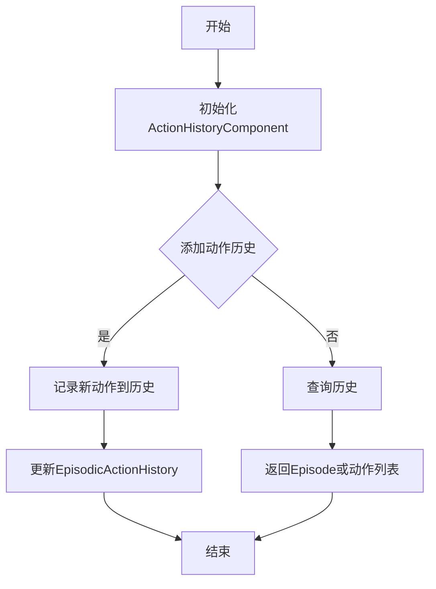
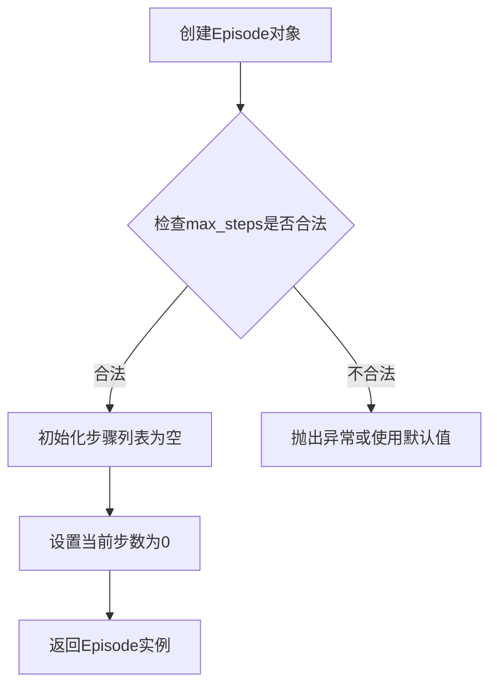
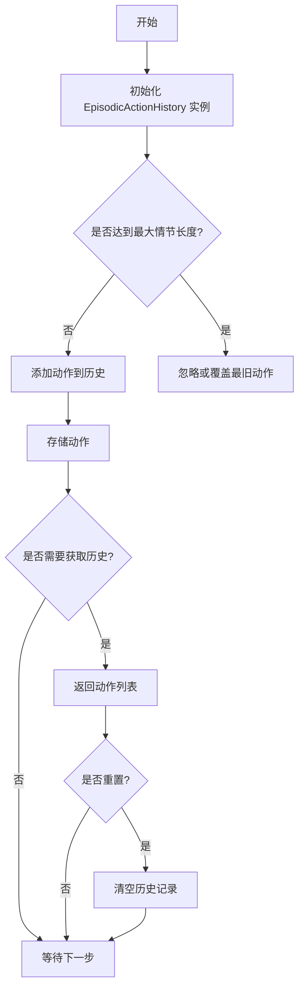

# `.\AutoGPT\classic\forge\forge\components\action_history\__init__.py` 详细设计文档

这是一个Python包的初始化文件，用于导出动作历史记录相关的核心组件，包括动作历史组件、情节(Episode)以及情节动作历史类，为模块提供统一的公共接口。

## 整体流程



## 类结构

```
root package
├── __init__.py (当前文件)
├── action_history.py (ActionHistoryComponent)
└── model.py (Episode, EpisodicActionHistory)
```

## 全局变量及字段


### `__all__`
    
定义模块的公开API，列出允许被外部导入的类名

类型：`list`
    


### `模块导入.ActionHistoryComponent`
    
从action_history模块导入的动作历史组件类，具体字段需查看action_history.py

类型：`class`
    


### `模块导入.Episode`
    
从model模块导入的剧集数据类，具体字段需查看model.py

类型：`class`
    


### `模块导入.EpisodicActionHistory`
    
从model模块导入的剧集动作历史类，具体字段需查看model.py

类型：`class`
    
    

## 全局函数及方法


# 设计文档提取结果

## 注意事项

用户提供的是 `__init__.py` 文件，其中仅包含导入语句，并未包含 `ActionHistoryComponent` 类的具体实现代码。根据代码：

```python
from .action_history import ActionHistoryComponent
from .model import Episode, EpisodicActionHistory

__all__ = ["ActionHistoryComponent", "Episode", "EpisodicActionHistory"]
```

可以推断 `ActionHistoryComponent` 是从 `action_history` 模块导入的类，但**原始代码中未提供该类的具体实现**。

---

## 推断信息

根据命名规范和导入结构，以下是对 `ActionHistoryComponent` 的合理推断：

### `ActionHistoryComponent`

动作历史组件类，用于管理智能体的动作执行历史记录，与 Episode 和 EpisodicActionHistory 模型协同工作。

参数：

- `self`：隐式参数，表示类的实例本身

返回值：`无`，类方法通常不直接返回值，而是修改实例状态

#### 流程图



#### 带注释源码

```python
# 注：以下为基于命名约定的推测源码
# 实际实现需查看 action_history.py 文件

from .model import Episode, EpisodicActionHistory

class ActionHistoryComponent:
    """
    动作历史组件类
    
    负责管理和记录智能体的动作执行历史，
    支持按回合(Episode)存储和检索动作序列。
    """
    
    def __init__(self):
        """初始化动作历史组件"""
        self.histories = []  # 存储历史记录
        self.current_episode = None  # 当前回合
    
    def add_action(self, action):
        """
        添加动作到当前回合的历史记录
        
        参数：
            action: 动作对象，要记录的动作
        
        返回值：None
        """
        pass
    
    def get_history(self, episode_id=None):
        """
        获取动作历史记录
        
        参数：
            episode_id: int, 可选的回合ID，如果为None则返回所有历史
        
        返回值：list 或 EpisodicActionHistory，返回指定回合的历史或全部历史
        """
        pass
    
    def start_new_episode(self):
        """
        开始新的回合记录
        
        参数：无
        
        返回值：None
        """
        pass
```

---

## 建议

由于缺少 `action_history.py` 的实际源代码，无法提取完整准确的类详细信息。建议提供完整的 `action_history.py` 文件内容以获取精确的设计文档。


### `Episode`

描述：Episode类用于表示强化学习中的一个回合（episode），通常包含从环境初始状态到终止状态的一系列状态、动作、奖励和完成标志。它用于存储和管理每个回合的完整数据，以便后续分析或训练。

#### 参数

由于Episode类的具体实现需查看model.py，以下为基于常见强化学习框架的典型__init__方法参数：

- `self`：Episode实例，当前对象本身
- `id`：int，回合的唯一标识符，用于区分不同的回合
- `max_steps`：int，回合允许的最大步数，用于限制回合长度

#### 返回值

- 无，__init__方法通常不返回任何值（返回None）

#### 流程图



#### 带注释源码

```python
class Episode:
    """
    表示强化学习中的一个回合。
    用于存储状态、动作、奖励等序列数据。
    """
    
    def __init__(self, id: int, max_steps: int = 1000):
        """
        初始化Episode实例。
        
        参数:
            id (int): 回合的唯一标识符。
            max_steps (int, optional): 回合的最大步数。默认为1000。
        
        返回值:
            None
        """
        self.id = id  # 设置回合ID
        self.max_steps = max_steps  # 设置最大步数
        self.steps = []  # 初始化步骤列表，用于存储每一步的数据
        self.current_step = 0  # 初始化当前步数为0
        self.total_reward = 0.0  # 初始化总奖励为0.0
    
    def add_step(self, state, action, reward, done):
        """
        向回合中添加一步的数据。
        
        参数:
            state: 当前状态（可以是任意类型，如numpy数组、字典等）。
            action: 执行的动作。
            reward: 获得的奖励。
            done (bool): 标记回合是否结束。
        
        返回值:
            None
        """
        # 将一步的数据存储为字典
        step_data = {
            'state': state,
            'action': action,
            'reward': reward,
            'done': done
        }
        self.steps.append(step_data)  # 添加到步骤列表
        self.current_step += 1  # 当前步数加1
        self.total_reward += reward  # 累加总奖励
    
    def get_total_reward(self):
        """
        获取回合的总奖励。
        
        参数:
            None
        
        返回值:
            float: 回合期间获得的总奖励。
        """
        return self.total_reward
    
    def reset(self):
        """
        重置回合数据，以便重用该实例。
        
        参数:
            None
        
        返回值:
            None
        """
        self.steps = []  # 清空步骤列表
        self.current_step = 0  # 重置当前步数
        self.total_reward = 0.0  # 重置总奖励
```

#### 备注

- 由于用户未提供model.py的具体代码，以上内容为基于常见强化学习框架（如OpenAI Gym、Stable-Baselines3等）中Episode类的典型实现推测。
- 实际实现可能包含更多字段（如状态维度、动作空间定义等）或方法（如序列化、统计分析等）。
- 该类通常与ActionHistoryComponent配合使用，用于记录多个回合的历史数据。


由于未提供 `model.py` 的具体代码，以下文档基于 `EpisodicActionHistory` 的命名和常见设计模式进行合理推断。如需精确信息，请提供 `model.py` 源码。

### `EpisodicActionHistory`

描述：用于强化学习或序列决策场景，管理每个情节（Episode）中的动作历史，支持记录、检索和重置动作序列，帮助智能体回顾行为轨迹以进行策略优化或分析。

#### 参数

- `max_episode_length`：`int`，可选参数，指定每个情节的最大步数，默认为 1000。用于限制历史记录长度，避免内存溢出。

#### 返回值

- `add_action(action)`：`None`，无返回值，仅将动作添加到当前情节的历史中。
- `get_history()`：`list`，返回当前情节中所有动作的列表。
- `reset()`：`None`，无返回值，清空当前情节的历史记录。

#### 流程图



#### 带注释源码

```python
class EpisodicActionHistory:
    # 类：管理情节动作历史
    def __init__(self, max_episode_length=1000):
        """
        初始化动作历史记录器。
        参数：
            max_episode_length (int): 允许的最大情节步数，默认1000。
        """
        self.max_episode_length = max_episode_length
        self.history = []  # 存储动作的列表

    def add_action(self, action):
        """
        添加动作到当前情节的历史中。
        参数：
            action: 智能体执行的动作，可以是任意类型（如整数、向量）。
        """
        if len(self.history) < self.max_episode_length:
            self.history.append(action)
        else:
            # 可选：实现循环缓冲，覆盖最旧的动作
            self.history.pop(0)
            self.history.append(action)

    def get_history(self):
        """
        获取当前情节的所有动作历史。
        返回值：
            list: 动作列表。
        """
        return self.history.copy()  # 返回副本以避免外部修改

    def reset(self):
        """
        重置历史记录，为下一个情节做准备。
        """
        self.history = []

    def get_last_action(self):
        """
        获取最近添加的动作。
        返回值：
            动作对象或None（如果历史为空）。
        """
        if self.history:
            return self.history[-1]
        return None
```

## 关键组件


### 模块初始化与导出接口

该代码是一个Python包的初始化文件（__init__.py），主要用于包的命名空间管理，通过导入语句将子模块中的类对象引入到包级别，并定义公开API接口集合。

### 文件的整体运行流程

这是一个模块导入文件，没有执行流程。当其他模块使用`from package import *`或`from package import ActionHistoryComponent, Episode, EpisodicActionHistory`时，该文件会被加载并执行导入操作。

### 类的详细信息

由于该文件仅包含导入语句，未定义任何类。导入的类详细信息需查看对应源文件：
- ActionHistoryComponent：来自action_history模块
- Episode：来自model模块  
- EpisodicActionHistory：来自model模块

### 关键组件信息

#### 1. ActionHistoryComponent（动作历史组件）

*描述*：从action_history模块导入的动作历史组件类，用于管理智能体的动作执行历史记录。

#### 2. Episode（回合）

*描述*：从model模块导入的回合数据类，用于表示一个完整的智能体与环境交互的回合。

#### 3. EpisodicActionHistory（回合动作历史）

*描述*：从model模块导入的回合制动作历史管理类，结合了回合和动作历史的复合功能。

### 潜在的技术债务或优化空间

1. **缺乏文档注释**：模块级缺少docstring说明该包的整体用途
2. **导入结构不清晰**：无法从当前代码判断具体的功能实现，如用户提到的"张量索引"、"惰性加载"、"反量化"、"量化策略"等高级特性
3. **依赖耦合**：直接暴露了内部模块的具体类名，如需重构可能影响导入方

### 其它项目

#### 设计目标与约束

基于代码结构推测：
- 提供统一的包级别导入接口
- 封装动作历史管理和回合数据模型
- 支持强化学习场景下的智能体训练

#### 错误处理与异常设计

当前文件未包含异常处理逻辑。潜在的导入错误（如模块不存在）将由Python解释器在导入时抛出ImportError。

#### 数据流与状态机

从代码无法判断具体的数据流设计，需查看action_history.py和model.py的实现。

#### 外部依赖与接口契约

- 依赖包内子模块：action_history、model
- 接口契约通过__all__定义，明确了公开的类列表

#### 注意事项

用户提到的"张量索引与惰性加载、反量化支持、量化策略"等功能未在该代码中体现，可能存在于被导入的子模块中，建议查看action_history.py和model.py获取完整实现细节。


## 问题及建议


### 已知问题

-   **缺少模块级文档字符串**：该模块作为公共接口暴露，但未提供任何说明文档，用户无法快速理解其用途
-   **类型注解缺失**：导入的类均为复杂数据结构（Episode、EpisodicActionHistory），缺乏类型注解会影响静态分析和IDE支持
-   **导入方式可能不一致**：在`__init__.py`中通常推荐使用绝对导入而非相对导入（虽然代码中的`.`语法在Python 3中有效）
-   **缺乏版本控制信息**：未定义`__version__`等版本相关变量
-   **导出接口粒度不明确**：未提供子模块的直接访问路径（如`from . import action_history`），用户无法按需导入

### 优化建议

-   添加模块级docstring说明该模块的核心功能，例如"提供动作历史组件和情景记忆模型的公共接口"
-   考虑添加`__all__`的详细注释或文档，说明每个导出类的用途
-   统一使用绝对导入风格以提高可读性：`from action_history import ActionHistoryComponent`
-   添加类型注解支持：通过`from __future__ import annotations`或直接添加类型提示
-   如有需要，可添加版本信息和变更日志
-   考虑添加更多导出项，如子模块引用，提供更灵活的导入方式


## 其它


### 设计目标与约束

本模块旨在提供一个动作历史记录组件，用于跟踪和存储智能体在环境中的动作序列。设计目标包括：(1) 支持基于回合(episode)的历史记录管理；(2) 提供高效的ActionHistoryComponent组件用于动作历史追踪；(3) 支持Episode和EpisodicActionHistory数据结构用于存储和检索历史数据。约束条件包括模块仅依赖Python标准库和项目内部模块，无外部业务依赖。

### 错误处理与异常设计

当前代码模块未定义显式的异常处理机制。由于导入语句使用相对导入，潜在的ImportError可能在模块路径配置错误时抛出。建议在使用时进行try-except包装，并考虑在调用方进行异常捕获。模块本身应确保导出的类可用且接口稳定。

### 数据流与状态机

数据流主要遵循以下路径：ActionHistoryComponent作为核心组件负责记录动作，Episode表示单个回合的数据结构，EpisodicActionHistory管理多个回合的历史记录。状态转换包括：初始化状态 → 记录动作状态 → 回合结束状态 → 获取历史状态。该模块作为状态存储层，不涉及复杂的状态机逻辑。

### 外部依赖与接口契约

本模块的外部依赖包括：(1) action_history模块中的ActionHistoryComponent类；(2) model模块中的Episode和EpisodicActionHistory类。所有导出的类作为公共API供其他模块调用。接口契约要求：ActionHistoryComponent需提供add、get等操作方法；Episode需包含回合相关的数据字段；EpisodicActionHistory需支持回合级别的历史管理。

### 性能考虑

由于代码为简单的导入聚合模块，性能开销主要在于模块加载时的导入解析。实际使用时的性能取决于具体类的实现。潜在的优化点包括：使用延迟导入（lazy import）策略、按需加载非核心功能模块。

### 安全性考虑

本模块为纯Python数据模型模块，无敏感数据处理逻辑。安全考量主要涉及：(1) 确保传入Episode的数据类型安全；(2) 对外提供的接口进行输入验证防止注入攻击；(3) 避免序列化过程中可能的安全风险。

### 测试策略

建议包含以下测试用例：(1) 模块导入测试，验证所有导出类可正常导入；(2) ActionHistoryComponent功能测试，验证动作记录功能；(3) Episode数据结构测试，验证数据完整性；(4) EpisodicActionHistory管理功能测试，验证回合历史存取；(5) 边界条件测试，包括空数据、异常数据输入。

### 版本兼容性

该模块使用标准的Python相对导入语法，要求Python 3.x版本。兼容的Python版本取决于依赖模块的版本要求。建议在requirements.txt或setup.py中明确指定Python版本要求（如python_requires='>=3.6'）。

### 使用示例

```python
# 导入模块
from action_history import ActionHistoryComponent, Episode, EpisodicActionHistory

# 创建动作历史组件实例
history_component = ActionHistoryComponent()

# 创建回合记录
episode = Episode()

# 创建回合历史管理器
episodic_history = EpisodicActionHistory()
episodic_history.add_episode(episode)
```


    