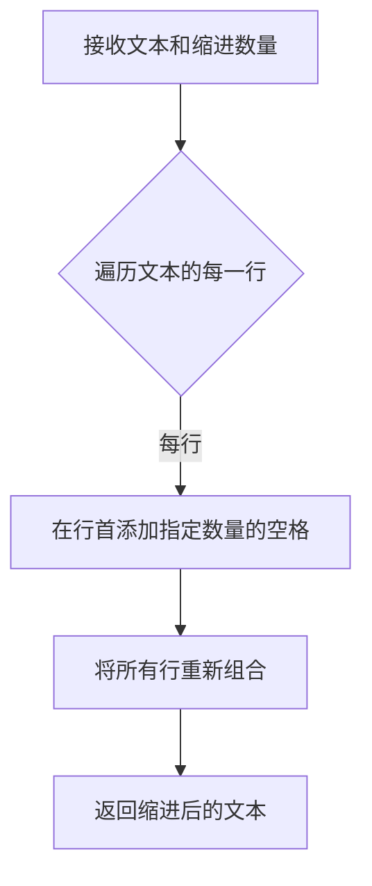
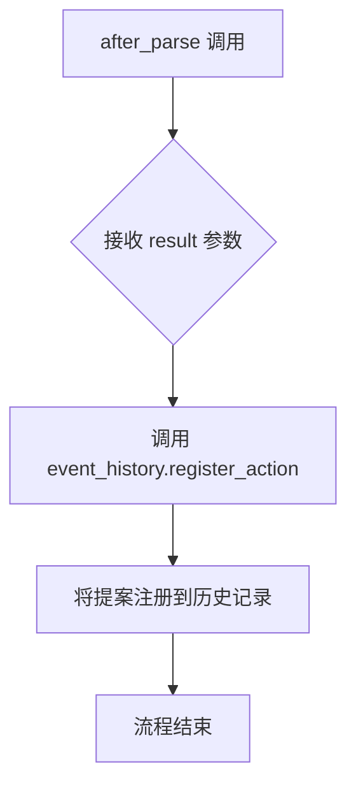
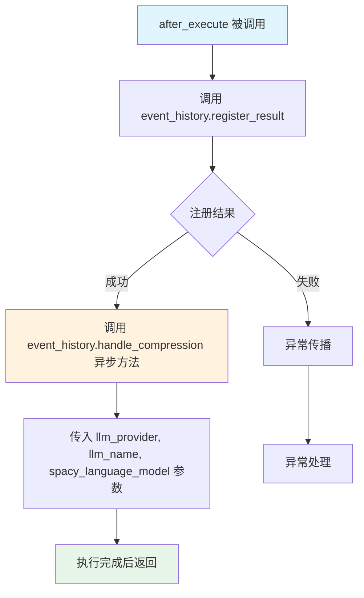
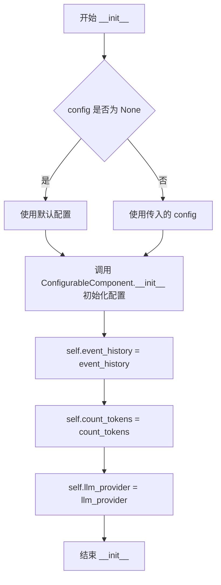
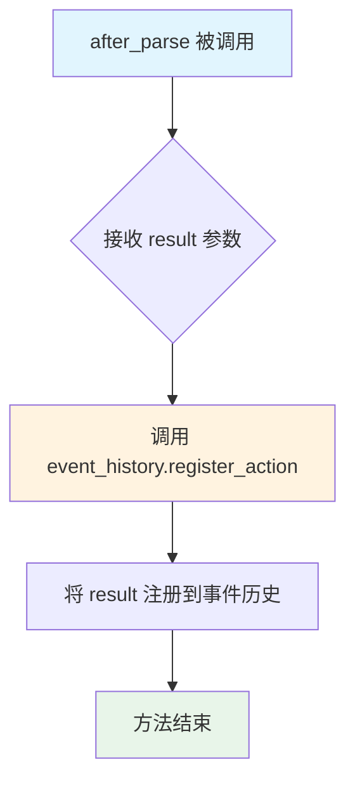
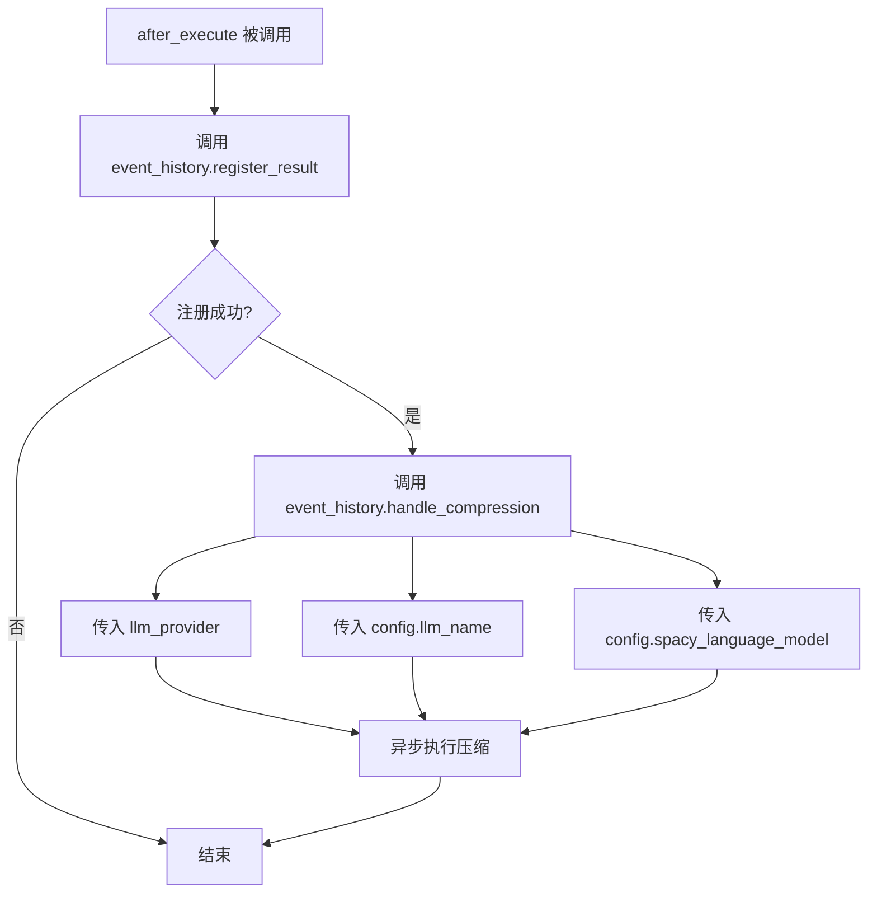
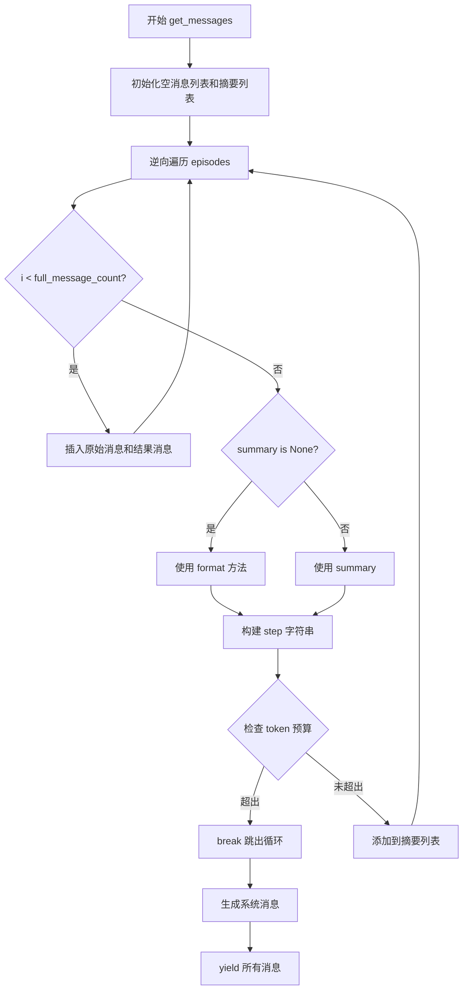

# `.\AutoGPT\classic\forge\forge\components\action_history\action_history.py` 详细设计文档

该代码实现了一个动作历史管理组件(ActionHistoryComponent)，用于跟踪Agent执行过程中的事件历史，并通过配置化的压缩策略生成步骤摘要，支持令牌限制和多种消息格式输出。

## 整体流程

```mermaid
graph TD
    A[初始化 ActionHistoryComponent] --> B[配置加载]
    B --> C{调用 get_messages()}
    C --> D[遍历历史事件]
    D --> E{是否在 full_message_count 范围内?}
    E -- 是 --> F[使用完整格式消息]
    E -- 否 --> G{是否存在摘要?}
    G -- 是 --> H[使用摘要内容]
    G -- 否 --> I[使用格式化内容]
    H --> J{令牌数超限?}
    I --> J
    F --> J
    J -- 是 --> K[停止添加摘要]
    J -- 否 --> L[添加到摘要列表]
    L --> M[生成系统消息]
    M --> N[yield 所有消息]
    N --> O{触发 after_parse}
    O --> P[调用 event_history.register_action]
    P --> Q{触发 after_execute}
    Q --> R[调用 event_history.register_result]
    R --> S[调用 handle_compression]
```

## 类结构

```
ActionHistoryConfiguration (Pydantic BaseModel)
└── ActionHistoryComponent (复合接口实现类)
    ├── MessageProvider (接口)
    ├── AfterParse (接口)
    ├── AfterExecute (接口)
    └── ConfigurableComponent (配置组件基类)
```

## 全局变量及字段


### `messages`
    
存储待返回的聊天消息列表

类型：`list[ChatMessage]`
    


### `step_summaries`
    
存储步骤摘要的列表，用于构建历史进度摘要

类型：`list[str]`
    


### `tokens`
    
当前已使用的token数量计数器

类型：`int`
    


### `n_episodes`
    
事件历史中的总episode数量

类型：`int`
    


### `step_summaries_fmt`
    
格式化后的步骤摘要字符串

类型：`str`
    


### `ActionHistoryConfiguration.llm_name`
    
用于压缩历史的LLM模型名称

类型：`ModelName`
    


### `ActionHistoryConfiguration.max_tokens`
    
生成历史消息的最大token数

类型：`int`
    


### `ActionHistoryConfiguration.spacy_language_model`
    
用于摘要分块的spacy语言模型

类型：`str`
    


### `ActionHistoryConfiguration.full_message_count`
    
包含的最新非摘要消息数量

类型：`int`
    


### `ActionHistoryComponent.event_history`
    
事件历史记录

类型：`EpisodicActionHistory[AnyProposal]`
    


### `ActionHistoryComponent.count_tokens`
    
token计数函数

类型：`Callable[[str], int]`
    


### `ActionHistoryComponent.llm_provider`
    
LLM提供者

类型：`MultiProvider`
    
    

## 全局函数及方法


根据代码分析，`indent` 是从 `forge.llm.prompting.utils` 模块导入的工具函数。由于给定的代码中只包含该函数的导入和使用，并未包含其实际定义，我将基于代码中的使用方式来提取相关信息。

---

### `indent`

用于对文本的每一行增加指定数量的缩进字符，常用于格式化多行字符串以保持代码块的可读性。

#### 参数

- `text`：`str`，需要缩进的文本内容
- `prefix`：`int`，指定在每一行前面添加的空格数量（代码中使用的是 2）

#### 返回值

`str`，返回缩进后的文本内容

#### 流程图



#### 带注释源码

```
# indent 函数的实现（在 forge.llm.prompting.utils 模块中）
# 此为基于代码使用方式的推断实现

def indent(text: str, prefix: int = 2) -> str:
    """
    给文本的每一行添加指定数量的缩进
    
    参数:
        text: 需要缩进的原始文本
        prefix: 每行添加的空格数量，默认为 2
        
    返回:
        缩进后的文本字符串
    """
    # 按换行符分割文本为行
    lines = text.split('\n')
    # 创建缩进前缀（2个空格）
    indent_prefix = ' ' * prefix
    # 对每一行添加缩进（空行除外，保持原始格式）
    indented_lines = [
        f"{indent_prefix}{line}" if line else line 
        for line in lines
    ]
    # 重新组合为单个字符串
    return '\n'.join(indented_lines)
```

---

### 代码中的实际使用示例

在 `ActionHistoryComponent` 类中：

```python
# 在 get_messages 方法中
step_content = indent(episode.format(), 2).strip()

# 在 _compile_progress 方法中
step_content = indent(episode.format(), 2).strip()
```

这里的 `indent` 函数用于将 `episode.format()` 生成的文本每行增加 2 个空格的缩进，然后使用 `.strip()` 去除首尾空白字符，用于构建步骤摘要的格式化输出。


### `ActionHistoryComponent.get_messages`

这是一个生成器方法，用于从事件历史中构建聊天消息列表。它会遍历已执行的动作历史，为最近的几个步骤返回完整的消息格式，对于更早的步骤则返回摘要格式，并在达到最大token限制时停止，确保生成的消息总 token 数不超过配置阈值。

参数：该方法无显式参数（除了隐式的 `self`）

返回值：`Iterator[ChatMessage]`，一个生成 ChatMessage 对象的迭代器，用于向 LLM 提供上下文历史

#### 流程图

```mermaid
flowchart TD
    A[开始 get_messages] --> B[初始化变量: messages, step_summaries, tokens, n_episodes]
    B --> C{遍历反转的 episodes}
    C -->|i < full_message_count| D[使用完整格式: episode.action.raw_message]
    D --> E[如果 result 存在, 创建 result_message 并插入]
    E --> C
    C -->|i >= full_message_count| F{episode.summary is None}
    F -->|是| G[使用 indent(episode.format(), 2).strip()]
    F -->|否| H[使用 episode.summary]
    G --> I[构建 step 字符串: '* Step {n_episodes-i}: {step_content}']
    H --> I
    I --> J{检查 token 限制}
    J -->|tokens + step_tokens > max_tokens| K[break 跳出循环]
    J -->|否则| L[将 step 添加到 step_summaries 头部]
    L --> C
    C --> M{遍历完成?}
    M -->|是| N{step_summaries 不为空?}
    N -->|是| O[格式化 step_summaries 为字符串]
    O --> P[yield ChatMessage.system with 摘要]
    N -->|否| Q[yield from messages]
    P --> Q
    Q --> R[结束]
```

#### 带注释源码

```python
def get_messages(self) -> Iterator[ChatMessage]:
    """生成包含历史步骤的聊天消息迭代器"""
    messages: list[ChatMessage] = []  # 存储完整的消息对象
    step_summaries: list[str] = []     # 存储步骤摘要字符串
    tokens: int = 0                    # 当前累计的 token 数量
    n_episodes = len(self.event_history.episodes)  # 总 episodes 数量

    # Include a summary for all except a few latest steps
    # 遍历反转的事件历史（从最新到最旧）
    for i, episode in enumerate(reversed(self.event_history.episodes)):
        # Use full format for a few steps, summary or format for older steps
        # 对于最近的几个步骤，使用完整格式
        if i < self.config.full_message_count:
            # 插入最新的消息到列表头部
            messages.insert(0, episode.action.raw_message)
            # 累加 token 计数（Hack: 直接转字符串计算）
            tokens += self.count_tokens(str(messages[0]))
            # 如果有执行结果，为其创建结果消息
            if episode.result:
                result_message = self._make_result_message(episode, episode.result)
                messages.insert(1, result_message)
                tokens += self.count_tokens(str(result_message))  # HACK
            continue
        # 对于更早的步骤，使用摘要或格式化内容
        elif episode.summary is None:
            # 使用缩进格式化 episode 内容
            step_content = indent(episode.format(), 2).strip()
        else:
            step_content = episode.summary

        # 构建步骤字符串，格式为 "* Step N: {content}"
        step = f"* Step {n_episodes - i}: {step_content}"

        # 如果配置了最大 token 数，则进行限制检查
        if self.config.max_tokens and self.count_tokens:
            step_tokens = self.count_token
```


### `ActionHistoryComponent.after_parse`

这是一个回调方法，在解析器完成提案解析后被调用，用于将解析结果注册到事件历史记录中，以便后续追踪和压缩处理。

参数：

- `result`：`AnyProposal`，解析器返回的提案对象，包含了待执行的行动计划

返回值：`None`，无返回值，仅执行副作用操作

#### 流程图



#### 带注释源码

```python
def after_parse(self, result: AnyProposal) -> None:
    """在解析完成后调用的回调方法，将解析结果注册到事件历史中。
    
    该方法是 AfterParse 协议的实现，在 Agent 解析用户请求并生成提案后被调用。
    它负责将提案记录到事件历史中，以便后续的 after_execute 可以关联执行结果。
    
    参数:
        result: 解析器生成的提案对象，包含了待执行的工具调用信息
        
    返回值:
        None: 无返回值，结果通过修改 self.event_history 的状态体现
    """
    self.event_history.register_action(result)
```


### `ActionHistoryComponent.after_execute`

这是一个异步回调方法，在动作执行完成后被框架自动调用。该方法负责将执行结果注册到事件历史中，并触发异步的历史记录压缩流程，以管理不断增长的历史数据。

参数：

- `result`：`ActionResult`，表示动作执行的结果，包含执行状态、输出内容或错误信息

返回值：`None`，该方法为异步方法，不返回任何值

#### 流程图



#### 带注释源码

```python
async def after_execute(self, result: ActionResult) -> None:
    """在动作执行完成后被调用的异步回调方法。
    
    Args:
        result: 动作执行的结果，包含状态、输出或错误信息
    """
    # 步骤1: 将执行结果注册到事件历史记录中
    # 这会更新当前episode的结果字段
    self.event_history.register_result(result)
    
    # 步骤2: 异步执行历史记录压缩
    # 根据配置的LLM模型和spacy语言模型对历史进行压缩，
    # 以控制token使用量并保持上下文窗口的有效性
    await self.event_history.handle_compression(
        self.llm_provider,        # 多提供者LLM实例，用于生成压缩摘要
        self.config.llm_name,     # 配置中指定的模型名称
        self.config.spacy_language_model  # 用于分块的spacy语言模型
    )
```


### `ActionHistoryComponent._make_result_message`

将动作执行结果转换为聊天消息的静态工具方法，根据结果状态（成功/错误/其他）生成不同格式的 `ChatMessage`。

参数：

- `episode`：`Episode`，执行动作的事件记录，包含原始消息和工具调用信息
- `result`：`ActionResult`，动作执行的结果，包含状态、输出、错误等信息

返回值：`ChatMessage`，根据执行结果生成的用户消息或工具结果消息

#### 流程图

```mermaid
flowchart TD
    A[开始: _make_result_message] --> B{result.status == 'success'?}
    B -->|是| C{episode.action.raw_message.tool_calls 存在?}
    C -->|是| D[创建 ToolResultMessage]
    C -->|否| E[创建 ChatMessage.user<br/>格式: {tool_name} returned: ...]
    B -->|否| F{result.status == 'error'?}
    F -->|是| G{episode.action.raw_message.tool_calls 存在?}
    G -->|是| H[创建 ToolResultMessage<br/>is_error=True]
    G -->|否| I[创建 ChatMessage.user<br/>格式: {tool_name} raised an error: ...]
    F -->|否| J[创建 ChatMessage.user<br/>返回 result.feedback]
    D --> K[结束: 返回 ChatMessage]
    E --> K
    H --> K
    I --> K
    J --> K
```

#### 带注释源码

```python
@staticmethod
def _make_result_message(episode: Episode, result: ActionResult) -> ChatMessage:
    """
    将动作执行结果转换为聊天消息
    
    参数:
        episode: 执行动作的事件记录，包含原始消息和工具调用信息
        result: 动作执行的结果，包含状态、输出、错误等信息
    
    返回:
        ChatMessage: 根据执行结果生成的用户消息或工具结果消息
    """
    # 处理成功状态
    if result.status == "success":
        # 检查是否存在工具调用（有tool_calls说明是工具调用）
        if episode.action.raw_message.tool_calls:
            # 返回结构化的工具结果消息，包含tool_call_id用于关联
            return ToolResultMessage(
                content=str(result.outputs),  # 将输出转换为字符串
                tool_call_id=episode.action.raw_message.tool_calls[0].id,  # 关联原始工具调用
            )
        else:
            # 没有工具调用时，返回用户消息格式
            # 根据输出是否包含换行符决定格式化方式
            output_formatted = (
                f"```\n{result.outputs}\n```"  # 多行输出用代码块
                if "\n" in str(result.outputs)
                else f"`{result.outputs}`"  # 单行输出用行内代码
            )
            return ChatMessage.user(
                f"{episode.action.use_tool.name} returned: " + output_formatted
            )
    
    # 处理错误状态
    elif result.status == "error":
        if episode.action.raw_message.tool_calls:
            # 错误消息格式：原因 + 错误详情
            return ToolResultMessage(
                content=f"{result.reason}\n\n{result.error or ''}".strip(),
                is_error=True,  # 标记为错误消息
                tool_call_id=episode.action.raw_message.tool_calls[0].id,
            )
        else:
            return ChatMessage.user(
                f"{episode.action.use_tool.name} raised an error: ```\n"
                f"{result.reason}\n"
                "```"
            )
    
    # 处理其他状态（如 feedback）
    else:
        return ChatMessage.user(result.feedback)
```


### `ActionHistoryComponent._compile_progress`

该方法用于将事件历史中的多个 Episode 编译为一个格式化的进度摘要字符串，支持根据 token 数量限制来截断内容。

参数：

- `episode_history`：`list[Episode[AnyProposal]]`，要编译进度的 episode 列表
- `max_tokens`：`Optional[int]`（可选），生成进度摘要的最大 token 数量限制
- `count_tokens`：`Optional[Callable[[str], int]]`（可选），用于计算字符串 token 数量的回调函数

返回值：`str`，编译后的进度摘要字符串，格式为多行步骤列表

#### 流程图

```mermaid
flowchart TD
    A[Start _compile_progress] --> B{max_tokens is set<br/>and count_tokens is None?}
    B -->|Yes| C[Raise ValueError<br/>"count_tokens is required<br/>if max_tokens is set"]
    B -->|No| D[Initialize: steps = [], tokens = 0<br/>n_episodes = len(episode_history)]
    D --> E[Iterate episodes in reversed order]
    E --> F{i &lt; config.full_message_count<br/>or episode.summary is None?}
    F -->|Yes| G[step_content = indent<br/>(episode.format(), 2).strip()]
    F -->|No| H[step_content = episode.summary]
    G --> I[step = f"* Step {n_episodes - i}:<br/>{step_content}"]
    H --> I
    I --> J{max_tokens and count_tokens<br/>are set?}
    J -->|Yes| K[step_tokens = count_tokens(step)]
    J -->|No| L[steps.insert(0, step)]
    K --> M{tokens + step_tokens<br/>> max_tokens?}
    M -->|Yes| N[Break loop]
    M -->|No| O[tokens += step_tokens]
    O --> L
    L --> P{More episodes to<br/>process?}
    P -->|Yes| E
    P -->|No| Q[Return "\n\n".join(steps)]
    C --> R[End]
    N --> Q
```

#### 带注释源码

```python
def _compile_progress(
    self,
    episode_history: list[Episode[AnyProposal]],
    max_tokens: Optional[int] = None,
    count_tokens: Optional[Callable[[str], int]] = None,
) -> str:
    """Compiles a progress summary from the given episode history.

    Args:
        episode_history: List of episodes to compile progress from.
        max_tokens: Optional maximum token limit for the output.
        count_tokens: Optional callable to count tokens in a string.

    Returns:
        A formatted string containing the progress steps.

    Raises:
        ValueError: If max_tokens is set but count_tokens is not provided.
    """
    # 验证参数：如果设置了 max_tokens，则必须提供 count_tokens
    if max_tokens and not count_tokens:
        raise ValueError("count_tokens is required if max_tokens is set")

    # 初始化步骤列表和 token 计数器
    steps: list[str] = []
    tokens: int = 0
    # 获取总 episode 数量用于编号
    n_episodes = len(episode_history)

    # 逆序遍历 episodes（从最新到最旧）
    for i, episode in enumerate(reversed(episode_history)):
        # 判断使用完整格式还是摘要：
        # - 如果是最近的几个步骤（i < full_message_count），使用完整格式
        # - 如果 episode 没有摘要（summary is None），使用完整格式
        # - 否则使用摘要内容
        if i < self.config.full_message_count or episode.summary is None:
            step_content = indent(episode.format(), 2).strip()
        else:
            step_content = episode.summary

        # 格式化为步骤字符串 "* Step {编号}: {内容}"
        step = f"* Step {n_episodes - i}: {step_content}"

        # 如果设置了 token 限制，则进行 token 计算和截断判断
        if max_tokens and count_tokens:
            step_tokens = count_tokens(step)
            # 如果添加此步骤会超过 token 限制，则停止添加更多步骤
            if tokens + step_tokens > max_tokens:
                break
            # 累加 token 数量
            tokens += step_tokens

        # 将步骤插入到列表开头（保持正序）
        steps.insert(0, step)

    # 将所有步骤用双换行符连接成最终字符串
    return "\n\n".join(steps)
```


### `ActionHistoryComponent.__init__`

该方法是 `ActionHistoryComponent` 类的构造函数，负责初始化组件的核心依赖项，包括事件历史记录、token计数回调、LLM提供者以及可选的配置对象。

参数：

-  `event_history`：`EpisodicActionHistory[AnyProposal]`，用于存储和管理智能体执行过程中的事件历史记录
-  `count_tokens`：`Callable[[str], int]`，用于计算字符串token数量的回调函数，用于控制历史摘要的token开销
-  `llm_provider`：`MultiProvider`，LLM多提供者实例，用于调用大语言模型进行历史压缩
-  `config`：`Optional[ActionHistoryConfiguration]`，[可选] 组件配置对象，包含LLM名称、token上限、语言模型等配置项

返回值：`None`，构造函数不返回任何值

#### 流程图



#### 带注释源码

```python
def __init__(
    self,
    event_history: EpisodicActionHistory[AnyProposal],
    count_tokens: Callable[[str], int],
    llm_provider: MultiProvider,
    config: Optional[ActionHistoryConfiguration] = None,
) -> None:
    """
    初始化 ActionHistoryComponent 实例。

    参数:
        event_history: EpisodicActionHistory 实例，管理智能体执行的历史记录
        count_tokens: 回调函数，接受字符串返回 token 数量，用于预算控制
        llm_provider: MultiProvider 实例，提供大语言模型调用能力
        config: 可选的配置对象，若为 None 则使用默认配置
    """
    # 调用父类 ConfigurableComponent 的初始化方法
    # 设置配置类并初始化配置（使用传入的 config 或默认值）
    ConfigurableComponent.__init__(self, config)
    
    # 存储事件历史记录引用，用于后续追踪智能体的执行步骤
    self.event_history = event_history
    
    # 存储 token 计数回调，用于计算消息和摘要的 token 消耗
    self.count_tokens = count_tokens
    
    # 存储 LLM 提供者，用于在执行后调用模型进行历史压缩
    self.llm_provider = llm_provider
```


### `ActionHistoryComponent.get_messages`

该方法迭代事件历史，将最近的若干步骤（由 `full_message_count` 配置）以完整格式返回，其余步骤则以摘要形式呈现，并在达到令牌数量限制时停止，以生成包含历史进度的聊天消息迭代器。

参数：无（仅含隐式参数 `self`）

返回值：`Iterator[ChatMessage]` - 返回聊天消息的迭代器，包含系统消息（步骤摘要）和用户/工具消息（完整步骤信息）

#### 流程图

```mermaid
flowchart TD
    A([开始 get_messages]) --> B[初始化变量<br/>messages: list[ChatMessage]<br/>step_summaries: list[str]<br/>tokens: int = 0]
    B --> C[n_episodes = len&#40;event_history.episodes&#41;]
    C --> D[遍历 event_history.episodes<br/>按反向顺序]
    D --> E{i < config.full_message_count?}
    E -->|是| F[获取 episode.action.raw_message]
    F --> G[tokens += count_tokens&#40;str&#40;message&#41;&#41;]
    G --> H{episode.result 存在?}
    H -->|是| I[调用 _make_result_message<br/>生成结果消息]
    I --> J[tokens += count_tokens&#40;str&#40;result&#41;&#41;]
    H -->|否| K[继续下一轮]
    J --> K
    K --> L{继续遍历?}
    L -->|是| D
    E -->|否| M{episode.summary is None?}
    M -->|是| N[step_content = indent&#40;episode.format&#40;&#41;, 2&#41;.strip&#40;&#41;]
    M -->|否| O[step_content = episode.summary]
    N --> P[step = f"* Step {n_episodes - i}: {step_content}"]
    O --> P
    P --> Q{max_tokens 且 count_tokens 存在?}
    Q -->|是| R[step_tokens = count_tokens&#40;step&#41;]
    R --> S{tokens + step_tokens > max_tokens?}
    S -->|是| T[break 跳出循环]
    S -->|否| U[tokens += step_tokens<br/>step_summaries.insert&#40;0, step&#41;]
    Q -->|否| U
    U --> L
    T --> V{step_summaries 非空?}
    V -->|是| W[生成系统消息<br/>包含步骤摘要]
    W --> X[yield ChatMessage.system&#40;...&#41;]
    V -->|否| Y[yield from messages]
    X --> Y
    Y --> Z([结束 Iterator])
    
    style A fill:#e1f5fe
    style Z fill:#e1f5fe
    style T fill:#ffcdd2
    style X fill:#c8e6c9
```

#### 带注释源码

```python
def get_messages(self) -> Iterator[ChatMessage]:
    """
    从事件历史中生成聊天消息迭代器。
    
    该方法执行以下操作：
    1. 遍历事件历史中的所有剧集（episode）
    2. 对于最近的 full_message_count 个剧集，保留完整的原始消息格式
    3. 对于更早的剧集，使用摘要（summary）或格式化内容
    4. 根据 max_tokens 配置限制生成的消息总令牌数
    5. 最终生成一个系统消息包含步骤摘要，然后逐个产出完整消息
    
    返回:
        Iterator[ChatMessage]: 包含历史进度信息的聊天消息迭代器
    """
    # 初始化空列表用于存储消息和步骤摘要，以及令牌计数器
    messages: list[ChatMessage] = []
    step_summaries: list[str] = []
    tokens: int = 0
    
    # 获取事件历史中的总剧集数量，用于生成步骤编号
    n_episodes = len(self.event_history.episodes)

    # 反向遍历事件历史，从最新到最旧
    for i, episode in enumerate(reversed(self.event_history.episodes)):
        # 判断当前剧集是否在保留完整消息的范围内
        if i < self.config.full_message_count:
            # 最新的几个步骤：使用完整的原始消息格式
            messages.insert(0, episode.action.raw_message)
            
            # 累加消息的令牌数（此处有HACK注释，表明实现可能不够优化）
            tokens += self.count_tokens(str(messages[0]))  # HACK
            
            # 如果剧集有执行结果，生成对应的结果消息
            if episode.result:
                result_message = self._make_result_message(episode, episode.result)
                # 插入到消息列表的前端（紧跟原始消息之后）
                messages.insert(1, result_message)
                # 累加结果消息的令牌数
                tokens += self.count_tokens(str(result_message))  # HACK
            
            # 跳过当前循环，继续处理下一个（更早的）剧集
            continue
        
        # 对于超出完整消息范围的剧集，检查是否有摘要
        elif episode.summary is None:
            # 无摘要时，使用格式化方法生成内容，并进行缩进处理
            step_content = indent(episode.format(), 2).strip()
        else:
            # 有摘要时，直接使用摘要内容
            step_content = episode.summary

        # 构建步骤字符串，格式为 "* Step N: 内容"
        step = f"* Step {n_episodes - i}: {step_content}"

        # 如果配置了最大令牌数限制，则进行检查
        if self.config.max_tokens and self.count_tokens:
            # 计算当前步骤的令牌数
            step_tokens = self.count_tokens(step)
            
            # 检查累加后是否超过最大令牌数限制
            if tokens + step_tokens > self.config.max_tokens:
                # 超过限制，跳出循环，不再添加更多步骤
                break
            
            # 未超限时，累加令牌数并将步骤添加到摘要列表
            tokens += step_tokens
            step_summaries.insert(0, step)

    # 如果存在步骤摘要，生成系统级别的汇总消息
    if step_summaries:
        # 将多个步骤摘要用双换行符连接
        step_summaries_fmt = "\n\n".join(step_summaries)
        
        # 生成系统消息，包含任务进度说明和步骤摘要
        yield ChatMessage.system(
            f"## Progress on your Task so far\n"
            "Here is a summary of the steps that you have executed so far, "
            "use this as your consideration for determining the next action!\n"
            f"{step_summaries_fmt}"
        )

    # 最后，逐一产出保留完整格式的消息
    yield from messages
```


### `ActionHistoryComponent.after_parse`

该方法实现了 `AfterParse` 协议，在代理完成对输入的解析后被调用，负责将解析得到的提案（Proposal）注册到事件历史记录中，以便后续执行和追踪。

参数：

- `result`：`AnyProposal`，解析后得到的提案对象，包含代理计划执行的动作信息

返回值：`None`，该方法不返回任何值

#### 流程图



#### 带注释源码

```python
def after_parse(self, result: AnyProposal) -> None:
    """
    在解析阶段完成后被调用，将解析结果注册到事件历史中。
    
    该方法实现了 AfterParse 协议，作为回调函数在代理完成
    对用户输入的解析后执行，负责记录代理计划执行的动作提案。
    
    参数:
        result: AnyProposal - 解析后得到的提案对象，包含代理
                     计划执行的动作相关信息（如工具调用、参数等）
    
    返回:
        None - 该方法不返回任何值，仅执行副作用（注册动作）
    
    示例:
        >>> # 在代理解析用户输入后调用
        >>> component.after_parse(proposal)
    """
    # 将解析结果（提案）注册到事件历史中
    # 这会创建一个新的 Episode 记录，包含该动作的原始消息
    self.event_history.register_action(result)
```


### `ActionHistoryComponent.after_execute`

该方法是一个异步回调函数，在动作执行完成后被调用。它负责将执行结果注册到事件历史中，并触发基于 LLM 的历史压缩流程，以控制历史记录的大小并保持关键信息。

参数：

- `result`：`ActionResult`，动作执行后的结果对象，包含执行状态（success/error）、输出内容、错误原因等信息

返回值：`None`，无返回值（异步 void 方法）

#### 流程图



#### 带注释源码

```python
async def after_execute(self, result: ActionResult) -> None:
    """在动作执行完成后调用的异步回调方法。
    
    该方法执行两个核心操作：
    1. 将执行结果注册到事件历史记录中
    2. 触发历史压缩流程以优化历史记录的大小
    
    参数:
        result: ActionResult 对象，包含动作执行的结果信息
               - status: 执行状态 (success/error)
               - outputs: 执行输出内容
               - reason: 错误原因 (如适用)
               - error: 错误详情 (如适用)
               - feedback: 用户反馈 (如适用)
    """
    # 第一步：将执行结果注册到事件历史中
    # 这会创建一个新的 Episode 或更新现有 Episode 的结果字段
    self.event_history.register_result(result)
    
    # 第二步：执行历史压缩流程
    # 这是一个异步操作，会根据配置的 LLM 模型和语言模型
    # 对历史记录进行压缩处理，以控制 token 使用量
    await self.event_history.handle_compression(
        self.llm_provider,      # LLM 提供者，用于生成压缩摘要
        self.config.llm_name,   # LLM 模型名称 (如 GPT-3)
        self.config.spacy_language_model  # spaCy 语言模型，用于分块
    )
```


### `ActionHistoryComponent._make_result_message`

该方法是一个静态工具方法，用于根据 ActionResult 的执行状态（success、error 或其他）生成对应的 ChatMessage。当执行成功时，若存在 tool_calls 则返回 ToolResultMessage，否则返回格式化的用户消息；当执行失败时，返回错误信息；若状态既非成功也非错误，则返回反馈内容。

参数：

- `episode`：`Episode`，包含动作的原始消息和相关信息，用于获取 tool_call_id 和工具名称
- `result`：`ActionResult`，包含执行结果的状态（status）、输出（outputs）、错误原因（reason）、错误详情（error）和反馈（feedback）

返回值：`ChatMessage`，根据 result.status 生成的不同类型的聊天消息

#### 流程图

```mermaid
flowchart TD
    A[开始] --> B{result.status == 'success'?}
    B -->|Yes| C{episode.action.raw_message.tool_calls 存在?}
    B -->|No| D{result.status == 'error'?}
    
    C -->|Yes| E[创建 ToolResultMessage]
    C -->|No| F[创建 ChatMessage.user<br/>格式: {工具名} returned: 输出]
    
    E --> G[返回 ChatMessage]
    F --> G
    
    D -->|Yes| H{episode.action.raw_message.tool_calls 存在?}
    D -->|No| I[创建 ChatMessage.user<br/>返回 result.feedback]
    
    H -->|Yes| J[创建 ToolResultMessage<br/>is_error=True]
    H -->|No| K[创建 ChatMessage.user<br/>格式: {工具名} raised an error]
    
    J --> G
    K --> G
    I --> G
```

#### 带注释源码

```python
@staticmethod
def _make_result_message(episode: Episode, result: ActionResult) -> ChatMessage:
    """
    根据执行结果生成对应的聊天消息。
    
    参数:
        episode: 包含动作原始消息的Episode对象，用于获取tool_call_id和工具名称
        result: ActionResult对象，包含执行状态、输出、错误等信息
    
    返回:
        ChatMessage: 根据result.status生成的不同类型的聊天消息
    """
    # 处理成功状态
    if result.status == "success":
        # 检查是否存在tool_calls（代表是通过工具调用返回的结果）
        if episode.action.raw_message.tool_calls:
            # 返回结构化的工具结果消息，包含输出内容和tool_call_id
            return ToolResultMessage(
                content=str(result.outputs),
                tool_call_id=episode.action.raw_message.tool_calls[0].id,
            )
        else:
            # 没有tool_calls时，返回用户消息格式
            # 根据输出是否包含换行符决定格式化方式
            output_str = (
                f"```\n{result.outputs}\n```"
                if "\n" in str(result.outputs)
                else f"`{result.outputs}`"
            )
            return ChatMessage.user(
                f"{episode.action.use_tool.name} returned: " + output_str
            )
    
    # 处理错误状态
    elif result.status == "error":
        # 检查是否存在tool_calls
        if episode.action.raw_message.tool_calls:
            # 返回错误类型的工具结果消息，包含错误原因和错误详情
            return ToolResultMessage(
                content=f"{result.reason}\n\n{result.error or ''}".strip(),
                is_error=True,
                tool_call_id=episode.action.raw_message.tool_calls[0].id,
            )
        else:
            # 没有tool_calls时，返回用户消息格式的错误信息
            return ChatMessage.user(
                f"{episode.action.use_tool.name} raised an error: ```\n"
                f"{result.reason}\n"
                "```"
            )
    
    # 处理其他状态（如feedback）
    else:
        # 直接返回反馈内容的用户消息
        return ChatMessage.user(result.feedback)
```


### `ActionHistoryComponent._compile_progress`

该方法用于将给定的episode历史记录编译为格式化的进度摘要字符串，支持基于token数量的截断功能。它通过反向遍历episode列表，为每个episode生成带编号的步骤描述，并根据最大token限制决定是否停止添加更早的步骤。

参数：

- `self`：`ActionHistoryComponent`，类的实例本身，包含配置信息和事件历史
- `episode_history`：`list[Episode[AnyProposal]]`，需要编译的episode历史记录列表
- `max_tokens`：`Optional[int]`，可选的最大token数量限制，用于控制输出长度
- `count_tokens`：`Optional[Callable[[str], int]]`，可选的token计数回调函数，用于计算每个步骤的token数

返回值：`str`，返回格式化后的步骤摘要字符串，多个步骤之间用双换行符分隔

#### 流程图

```mermaid
flowchart TD
    A[开始 _compile_progress] --> B{max_tokens 存在但 count_tokens 为空?}
    B -->|是| C[抛出 ValueError: count_tokens is required if max_tokens is set]
    B -->|否| D[初始化 steps: list[str] = [], tokens: int = 0]
    D --> E[n_episodes = len(episode_history)]
    E --> F[反向遍历 episode_history]
    F --> G{i < self.config.full_message_count 或 episode.summary 为空?}
    G -->|是| H[step_content = indent(episode.format(), 2).strip]
    G -->|否| I[step_content = episode.summary]
    H --> J[step = f"* Step {n_episodes - i}: {step_content}"]
    I --> J
    J --> K{max_tokens 和 count_tokens 都存在?}
    K -->|是| L[step_tokens = count_tokens(step)]
    K -->|否| N[steps.insert(0, step)]
    L --> M{tokens + step_tokens > max_tokens?}
    M -->|是| O[break 退出循环]
    M -->|否| P[tokens += step_tokens]
    P --> N
    N --> Q{还有更多 episode?}
    Q -->|是| F
    Q -->|否| R[返回 "\n\n".join(steps)]
    O --> R
    C --> R
```

#### 带注释源码

```python
def _compile_progress(
    self,
    episode_history: list[Episode[AnyProposal]],
    max_tokens: Optional[int] = None,
    count_tokens: Optional[Callable[[str], int]] = None,
) -> str:
    """Compiles the episode history into a formatted progress summary string.
    
    Args:
        episode_history: List of Episode objects to compile into progress steps.
        max_tokens: Optional maximum token limit for the output.
        count_tokens: Optional callable to count tokens in a string.
    
    Returns:
        A formatted string containing the progress steps separated by double newlines.
    
    Raises:
        ValueError: If max_tokens is provided but count_tokens is not.
    """
    # 如果设置了最大token数但没有提供计数函数，则抛出异常
    if max_tokens and not count_tokens:
        raise ValueError("count_tokens is required if max_tokens is set")

    # 初始化步骤列表和token计数器
    steps: list[str] = []
    tokens: int = 0
    # 获取总episode数量用于生成步骤编号
    n_episodes = len(episode_history)

    # 反向遍历episode历史，从最新的开始
    for i, episode in enumerate(reversed(episode_history)):
        # 对于最近的几个episode或者没有summary的episode，使用完整格式
        # full_message_count 定义了多少个最新的episode使用完整格式
        if i < self.config.full_message_count or episode.summary is None:
            # indent 函数将格式化的内容缩进2个空格
            step_content = indent(episode.format(), 2).strip()
        else:
            # 较老的episode使用摘要内容
            step_content = episode.summary

        # 构建步骤字符串，格式为 "* Step N: <内容>"
        step = f"* Step {n_episodes - i}: {step_content}"

        # 如果提供了token限制，则计算当前步骤的token数
        if max_tokens and count_tokens:
            step_tokens = count_tokens(step)
            # 检查添加此步骤是否会超过最大token限制
            if tokens + step_tokens > max_tokens:
                # 超过限制，停止添加更早的步骤
                break
            tokens += step_tokens

        # 将步骤插入到列表开头（因为是反向遍历）
        steps.insert(0, step)

    # 将所有步骤用双换行符连接成最终字符串
    return "\n\n".join(steps)
```

## 关键组件


### 一段话描述

该代码实现了一个动作历史管理组件（ActionHistoryComponent），通过跟踪智能体的执行 episode 历史，结合 token 预算限制生成摘要消息，为 LLM 提供上下文感知的能力，同时支持通过 LLM 进行历史压缩以优化上下文长度。

### 文件的整体运行流程

1. **初始化阶段**：组件接收事件历史对象、token 计数函数、LLM 提供者和可选配置
2. **消息生成阶段**（`get_messages` 方法）：
   - 逆向遍历 episode 历史
   - 对最近的 N 条记录使用完整格式消息
   - 对较早的记录生成摘要或使用已有摘要
   - 检查 token 预算，超出则截断
   - 生成系统消息包含进度摘要
3. **动作注册阶段**（`after_parse` 回调）：将解析结果注册到历史中
4. **结果处理阶段**（`after_execute` 异步回调）：注册执行结果，触发历史压缩

### 类的详细信息

#### ActionHistoryConfiguration 类

**类字段：**
| 字段名 | 类型 | 描述 |
|--------|------|------|
| llm_name | ModelName | 用于压缩历史的 LLM 模型名称 |
| max_tokens | int | 生成历史消息的最大 token 数 |
| spacy_language_model | str | 用于摘要分块的 spacy 语言模型 |
| full_message_count | int | 保留完整格式消息的最新步骤数 |

#### ActionHistoryComponent 类

**类字段：**
| 字段名 | 类型 | 描述 |
|--------|------|------|
| event_history | EpisodicActionHistory[AnyProposal] | 存储 episode 历史的容器 |
| count_tokens | Callable[[str], int] | 用于计算字符串 token 数的函数 |
| llm_provider | MultiProvider | LLM 提供者，用于历史压缩 |
| config | ActionHistoryConfiguration | 配置对象 |

**类方法：**

##### __init__
- **参数：**
  - `event_history`: EpisodicActionHistory[AnyProposal] - 事件历史容器
  - `count_tokens`: Callable[[str], int] - token 计数回调
  - `llm_provider`: MultiProvider - LLM 提供者
  - `config`: Optional[ActionHistoryConfiguration] - 可选配置
- **返回值**：None
- **描述**：构造函数，初始化组件依赖

##### get_messages
- **参数**：无
- **返回值**：Iterator[ChatMessage] - 聊天消息迭代器
- **描述**：生成包含历史摘要和完整消息的迭代器，用于 LLM 上下文
- **mermaid 流程图**：

- **源码**：
```python
def get_messages(self) -> Iterator[ChatMessage]:
    messages: list[ChatMessage] = []
    step_summaries: list[str] = []
    tokens: int = 0
    n_episodes = len(self.event_history.episodes)

    # Include a summary for all except a few latest steps
    for i, episode in enumerate(reversed(self.event_history.episodes)):
        # Use full format for a few steps, summary or format for older steps
        if i < self.config.full_message_count:
            messages.insert(0, episode.action.raw_message)
            tokens += self.count_tokens(str(messages[0]))  # HACK
            if episode.result:
                result_message = self._make_result_message(episode, episode.result)
                messages.insert(1, result_message)
                tokens += self.count_tokens(str(result_message))  # HACK
            continue
        elif episode.summary is None:
            step_content = indent(episode.format(), 2).strip()
        else:
            step_content = episode.summary

        step = f"* Step {n_episodes - i}: {step_content}"

        if self.config.max_tokens and self.count_tokens:
            step_tokens = self.count_tokens(step)
            if tokens + step_tokens > self.config.max_tokens:
                break
            tokens += step_tokens

        step_summaries.insert(0, step)

    if step_summaries:
        step_summaries_fmt = "\n\n".join(step_summaries)
        yield ChatMessage.system(
            f"## Progress on your Task so far\n"
            "Here is a summary of the steps that you have executed so far, "
            "use this as your consideration for determining the next action!\n"
            f"{step_summaries_fmt}"
        )

    yield from messages
```

##### after_parse
- **参数：**
  - `result`: AnyProposal - 解析结果
- **返回值**：None
- **描述**：解析后回调，将动作注册到历史中

##### after_execute
- **参数：**
  - `result`: ActionResult - 执行结果
- **返回值**：None（async 方法）
- **描述**：执行后回调，注册结果并触发历史压缩

##### _make_result_message（静态方法）
- **参数：**
  - `episode`: Episode - Episode 对象
  - `result`: ActionResult - 执行结果
- **返回值**：ChatMessage - 格式化后的结果消息
- **描述**：根据结果状态生成用户或工具结果消息
- **源码**：
```python
@staticmethod
def _make_result_message(episode: Episode, result: ActionResult) -> ChatMessage:
    if result.status == "success":
        return (
            ToolResultMessage(
                content=str(result.outputs),
                tool_call_id=episode.action.raw_message.tool_calls[0].id,
            )
            if episode.action.raw_message.tool_calls
            else ChatMessage.user(
                f"{episode.action.use_tool.name} returned: "
                + (
                    f"```\n{result.outputs}\n```"
                    if "\n" in str(result.outputs)
                    else f"`{result.outputs}`"
                )
            )
        )
    elif result.status == "error":
        return (
            ToolResultMessage(
                content=f"{result.reason}\n\n{result.error or ''}".strip(),
                is_error=True,
                tool_call_id=episode.action.raw_message.tool_calls[0].id,
            )
            if episode.action.raw_message.tool_calls
            else ChatMessage.user(
                f"{episode.action.use_tool.name} raised an error: ```\n"
                f"{result.reason}\n"
                "```"
            )
        )
    else:
        return ChatMessage.user(result.feedback)
```

##### _compile_progress
- **参数：**
  - `episode_history`: list[Episode[AnyProposal]] - Episode 列表
  - `max_tokens`: Optional[int] - 最大 token 数
  - `count_tokens`: Optional[Callable[[str], int]] - token 计数函数
- **返回值**：str - 编译后的进度字符串
- **描述**：编译步骤进度为字符串，支持 token 预算限制（未在主流程中使用，可能是遗留代码）

### 关键组件信息

| 组件名称 | 一句话描述 |
|----------|------------|
| Token 预算管理 | 通过 max_tokens 限制历史消息长度，超出时自动截断旧摘要 |
| 历史压缩机制 | 通过 LLM 调用将长历史压缩为摘要，平衡上下文长度与信息量 |
| 双重消息策略 | 对最近 N 条使用完整消息格式，较早的使用摘要，优化信息密度 |
| Episode 逆向遍历 | 逆序处理历史，从最新到最旧构建消息列表 |
| 回调钩子架构 | 实现 AfterParse 和 AfterExecute 协议，自动追踪状态变化 |

### 潜在的技术债务或优化空间

1. **硬编码的 HACK 注释**：代码中存在 `# HACK` 注释，直接将 ChatMessage 转为字符串计算 token，这是不稳定的实现方式，应考虑 ChatMessage 本身的 token 计算方法
2. **重复代码**：`get_messages` 和 `_compile_progress` 方法有高度相似的逻辑，应该提取公共方法避免重复
3. **未使用的方法**：`_compile_progress` 方法未被调用，可能是遗留代码或计划中的功能
4. **同步/异步混合**：`_make_result_message` 是静态方法但处理的是异步上下文中的数据，设计不够一致
5. **配置默认值**：spacy 语言模型默认使用 "en_core_web_sm"，对小资源环境可能过大，且没有验证模型是否可用

### 其它项目

#### 设计目标与约束
- **目标**：为 LLM 提供有限上下文窗口内的历史信息摘要
- **约束**：依赖 token 计数函数和 LLM 提供者的可用性

#### 错误处理与异常设计
- 当 `max_tokens` 设置但 `count_tokens` 未提供时，`_compile_progress` 会抛出 ValueError
- 压缩失败时（LLM 调用异常）应在 `handle_compression` 中处理，但代码中未体现

#### 数据流与状态机
- 数据流：`User Action` → `after_parse` → `event_history.register_action` → `LLM Execution` → `after_execute` → `event_history.register_result` → `handle_compression`
- 状态转换：`Action` → `Result` → `Summary`

#### 外部依赖与接口契约
- 依赖 `EpisodicActionHistory` 的 episodes 属性和 `register_action/register_result/handle_compression` 方法
- 依赖 `MultiProvider` 进行 LLM 调用压缩历史
- 依赖 `count_tokens` 回调函数进行 token 预算计算
- 实现 `MessageProvider`, `AfterParse`, `AfterExecute`, `ConfigurableComponent` 协议


## 问题及建议


### 已知问题

-   **代码重复**：`get_messages()` 方法和 `_compile_progress()` 方法存在大量重复逻辑，两者都在迭代 episodes 并构建步骤字符串，应该提取公共逻辑。
-   **令牌计算的 Hack**：代码中存在 `# HACK` 注释，表明 `self.count_tokens(str(messages[0]))` 和 `self.count_tokens(str(result_message))` 的令牌计算方式不准确或不优雅。
-   **配置检查不一致**：在 `get_messages()` 中使用 `if self.config.max_tokens and self.count_tokens:`，而在 `_compile_progress()` 中使用 `if max_tokens and not count_tokens:`，逻辑不统一且容易出错。
-   **O(n) 操作性能问题**：`messages.insert(0, ...)` 和 `step_summaries.insert(0, ...)` 在列表开头插入元素是 O(n) 操作，在大量 episodes 情况下可能导致性能问题。
-   **缺少异常处理**：`handle_compression` 是异步调用但在 `after_execute` 中没有 try-catch 块，如果压缩失败会导致整个流程中断。
-   **方法职责过多**：`get_messages()` 方法超过 60 行，包含多个职责：迭代历史、构建消息、令牌计算、条件判断等，违反单一职责原则。
-   **类型注解不一致**：类定义中使用 `Episode[AnyProposal]` 但某些地方使用 `Episode`，泛型使用不够严格。
-   **配置默认值逻辑问题**：当 `max_tokens=0` 时，`if self.config.max_tokens` 会返回 False，导致跳过令牌限制检查，但这可能不是预期行为。

### 优化建议

-   **提取公共方法**：将迭代 episodes 构建步骤的核心逻辑提取为私有方法，如 `_build_steps_from_episodes()`，避免代码重复。
-   **移除 Hack**：重新设计令牌计算逻辑，考虑使用消息对象本身而不是将其转换为字符串。
-   **统一配置检查**：将配置检查逻辑统一为 `if max_tokens is not None and count_tokens is not None:` 的形式，避免 0 值被误判。
-   **优化插入操作**：使用 `collections.deque` 替代 list 的 `insert(0, ...)` 操作，或者在最后统一 reverse。
-   **添加异常处理**：在 `after_execute` 中添加 try-except 块处理 `handle_compression` 的异常，确保单个 episode 的压缩失败不会影响整体流程。
-   **拆分方法**：将 `get_messages()` 拆分为多个小方法，如 `_build_full_messages()`、`_build_summaries()`、`_calculate_tokens()` 等。
-   **严格化类型注解**：确保所有泛型使用一致，如统一使用 `Episode[AnyProposal]`。
-   **改进配置验证**：在 `ActionHistoryConfiguration` 中使用 Pydantic 的 `Field` 添加更严格的验证，如 `gt=0` 约束。

## 其它


### 设计目标与约束

本组件的核心设计目标是维护对话代理的长期记忆能力，通过跟踪和摘要历史交互步骤，使代理能够在多轮对话中保持上下文连续性。主要设计约束包括：1) 使用token数量作为历史记录压缩的主要触发条件，平衡信息完整性与内存占用；2) 保留最近N个步骤的完整信息以确保近期上下文的精确性；3) 依赖外部LLM进行历史摘要生成，组件本身不包含摘要生成逻辑。

### 错误处理与异常设计

1. **参数校验错误**：在`_compile_progress`方法中，如果设置了`max_tokens`但未提供`count_tokens`函数，将抛出`ValueError`，明确要求两者必须配套使用。
2. **Token计数失败**：代码中存在"HACK"注释标记的重复token计数操作，可能导致计数不准确；当`count_tokens`函数抛出异常时，当前实现无try-catch保护，可能导致整个消息生成流程中断。
3. **LLM压缩失败**：在`handle_compression`调用中未实现显式的异常处理，若LLM调用失败（如网络超时、提供商错误），异常将直接向上传播，可能导致调用方对话流程中断。
4. **消息生成异常**：`_make_result_message`方法假设`episode.action.raw_message.tool_calls`存在，但在某些场景下该属性可能为None或空列表，当前实现对索引访问有保护但逻辑分支较多，易遗漏边界情况。

### 数据流与状态机

组件的工作流程分为三个主要状态：**消息生成态**、**动作注册态**和**结果处理态**。

消息生成态由`get_messages()`方法触发，流程如下：遍历历史episode，对于最近`full_message_count`个episode，插入完整的原始消息和结果消息；对于更早的episode，优先使用已存在的摘要，若无摘要则格式化整个episode内容；实时监控累计token数量，一旦超过`max_tokens`阈值则停止添加摘要步骤；最终yield系统消息（包含所有摘要步骤）和用户/助手消息。

动作注册态由`after_parse(result)`方法触发，将解析得到的提案对象注册到`event_history`中，等待后续执行。

结果处理态由`after_execute(result)`异步方法触发，首先将执行结果注册到历史记录，然后调用`handle_compression`方法尝试对最老的未压缩episode进行压缩，该过程依赖外部LLMProvider。

### 外部依赖与接口契约

**直接依赖的外部模块**：
- `forge.agent.components.ConfigurableComponent`：配置组件基类，提供配置注入和管理能力
- `forge.agent.protocols.AfterExecute, AfterParse`：执行后和解析后回调协议，定义组件在Agent生命周期中的钩子点
- `forge.agent.protocols.MessageProvider`：消息提供者协议，要求实现`get_messages()`方法
- `forge.llm.providers.MultiProvider`：多LLM提供者，用于调用外部语言模型进行历史压缩
- `forge.llm.providers.schema.ToolResultMessage`：工具结果消息格式，用于构造工具调用返回
- `pydantic.BaseModel`：配置数据模型基类，用于配置验证和序列化
- `spacy`：语言模型依赖，用于基于语言特征的历史分块（非直接调用，通过配置传递）

**接口契约**：
- `get_messages()`: 返回Iterator[ChatMessage]，调用方应能处理任意数量的消息迭代
- `after_parse(result)`: 参数为AnyProposal类型，无返回值，调用方不依赖其返回值
- `after_execute(result)`: 异步方法，参数为ActionResult，调用方应等待其完成以确保状态一致性

### 配置管理

配置通过`ActionHistoryConfiguration` Pydantic模型定义，包含四个配置项：
- `llm_name`: 指定用于压缩的LLM模型名称，默认GPT-3.5
- `max_tokens`: 压缩后历史消息的最大token数，默认1024
- `spacy_language_model`: 用于摘要分块的spacy模型，默认en_core_web_sm
- `full_message_count`: 保留完整格式的最近步骤数，默认4

配置在初始化时注入，支持运行时通过`configure`方法更新配置对象。

### 性能考虑

1. **Token重复计算**：代码中同一消息被计数两次（注释标记为HACK），当消息较长时可能显著影响性能
2. **列表插入操作**：使用`list.insert(0, item)`在列表头部插入，在消息数量较多时O(n)复杂度可能导致性能问题，建议改用deque
3. **同步迭代**：遍历历史使用同步迭代器，在episode数量极大时可能阻塞事件循环
4. **延迟计算**：消息生成采用生成器模式，支持延迟计算和内存优化

### 安全性考虑

1. **敏感信息泄露**：历史记录可能包含用户输入、API密钥等敏感信息，在日志或错误消息中应避免暴露完整内容
2. **LLM注入风险**：历史摘要直接拼接后作为系统提示输入，存在提示注入风险，应考虑对用户生成的内容进行过滤或转义
3. **工具调用ID暴露**：ToolResultMessage中直接使用`tool_call_id`，需确保该ID不会泄露系统内部结构信息

### 测试策略建议

1. **单元测试**：针对`_compile_progress`、`_make_result_message`等纯方法进行输入输出验证
2. **集成测试**：模拟`event_history`和`llm_provider`，验证完整的消息生成流程
3. **边界测试**：测试空历史、单episode、多episode超过max_tokens等边界场景
4. **性能测试**：验证大规模历史记录下的响应时间和内存占用

### 并发与线程安全

组件本身不维护内部可变状态，主要依赖注入的`event_history`对象。`after_execute`方法为异步实现，可并发调用，但`event_history.register_result`和`handle_compression`可能存在竞态条件，需要外部确保线程安全或使用锁机制。

    