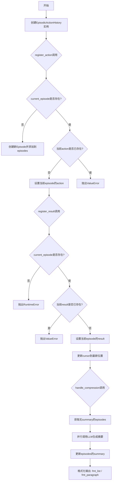
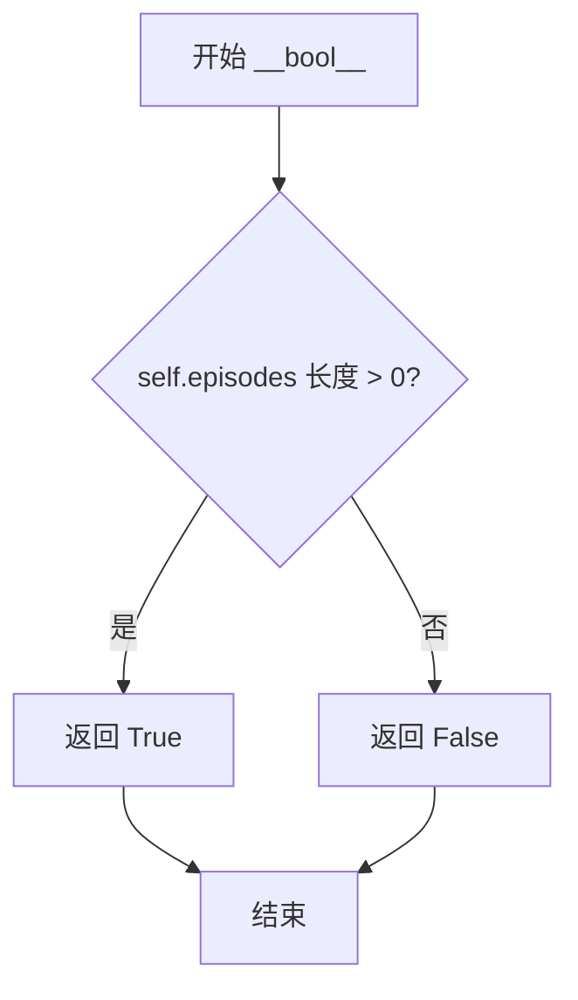
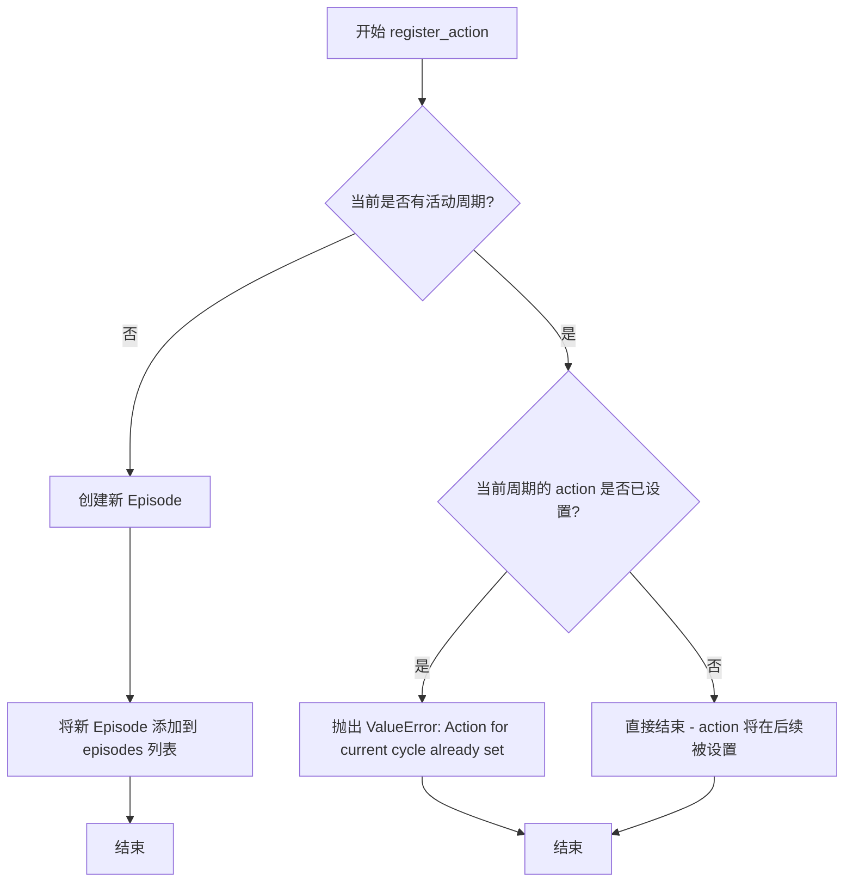
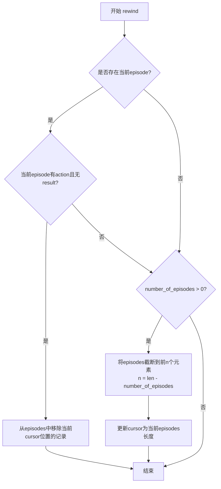
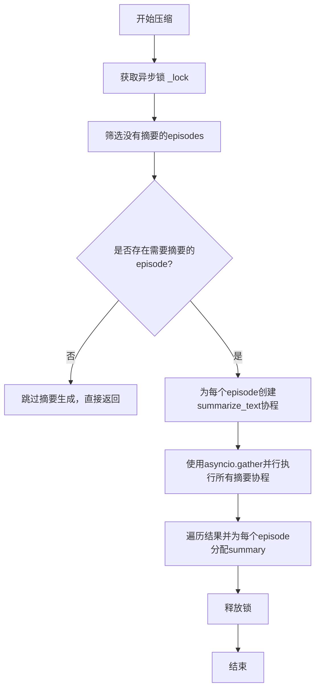
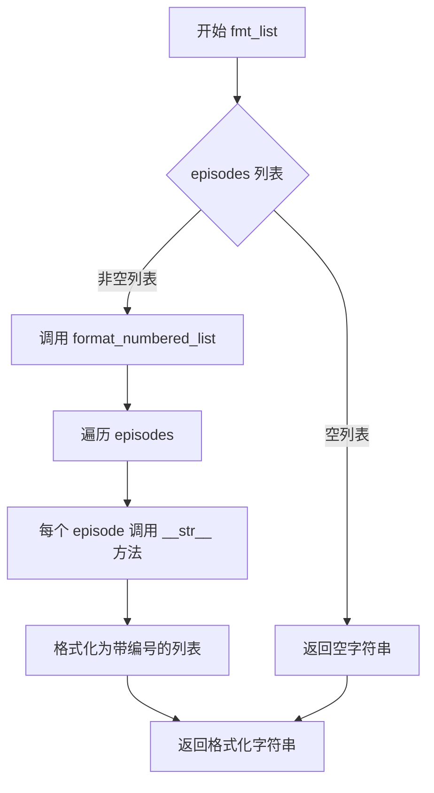

# `.\AutoGPT\classic\forge\forge\components\action_history\model.py` 详细设计文档

该代码实现了一个动作历史管理系统，包含Episode（单次动作记录）和EpisodicActionHistory（动作历史容器）两个核心类，用于追踪智能体(Agent)的动作执行、结果记录和历史压缩，支持动作注册、结果关联、历史回滚和基于LLM的摘要压缩功能。

## 整体流程



## 类结构

```
Episode (Pydantic BaseModel)
├── 字段: action, result, summary
└── 方法: format(), __str__()
EpisodicActionHistory (Pydantic BaseModel)
├── 字段: episodes, cursor, _lock
├── 属性: current_episode
└── 方法: __getitem__, __len__, __bool__, register_action, register_result, rewind, handle_compression, fmt_list, fmt_paragraph
```

## 全局变量及字段


### `_lock`
    
私有实例变量，异步锁用于并发控制

类型：`asyncio.Lock`
    


### `compress_instruction`
    
局部变量，压缩指令字符串，用于指导LLM如何压缩文本为一行

类型：`str`
    


### `Episode.action`
    
智能体执行的动作提案

类型：`AnyProposal`
    


### `Episode.result`
    
动作执行结果

类型：`ActionResult | None`
    


### `Episode.summary`
    
LLM生成的摘要

类型：`str | None`
    


### `EpisodicActionHistory.episodes`
    
动作历史记录列表

类型：`list[Episode[AnyProposal]]`
    


### `EpisodicActionHistory.cursor`
    
当前游标位置

类型：`int`
    


### `EpisodicActionHistory._lock`
    
异步锁用于并发控制

类型：`asyncio.Lock`
    
    

## 全局函数及方法


### `Episode.format()`

将 Episode 对象格式化为可读的多行字符串，包含执行的操作、推理过程、执行状态以及结果信息。

参数： 无（该方法为实例方法，隐式接收 `self` 参数）

返回值：`str`，格式化后的可读字符串，包含操作名称、推理、状态和结果详情

#### 流程图

```mermaid
flowchart TD
    A[开始 format] --> B[构建操作行: Executed `{self.action.use_tool}`]
    B --> C{self.action.thoughts 是否为 ModelWithSummary}
    C -->|是| D[调用 _r.summary 获取摘要]
    C -->|否| E[直接使用 _r]
    D --> F[构建推理行: - **Reasoning:** "{reasoning}"]
    E --> F
    F --> G{self.result 是否存在}
    G -->|否| H[添加状态: did_not_finish]
    G -->|是| I{self.result.status}
    I -->|success| J[格式化结果并添加输出行]
    I -->|error| K[添加错误原因和错误信息]
    I -->|interrupted_by_human| L[添加人类反馈]
    H --> M[返回格式化字符串]
    J --> M
    K --> M
    L --> M
```

#### 带注释源码

```
def format(self):
    # 1. 初始化步骤字符串，包含执行的操作名称
    step = f"Executed `{self.action.use_tool}`\n"
    
    # 2. 处理推理过程：根据 thoughts 是否实现了 ModelWithSummary 接口
    #    来决定是获取摘要还是直接使用原始内容
    reasoning = (
        _r.summary()  # 如果实现了 ModelWithSummary 接口，调用 summary() 方法
        if isinstance(_r := self.action.thoughts, ModelWithSummary)
        else _r  # 否则直接使用原始 thoughts 对象
    )
    
    # 3. 添加推理行，使用 Markdown 引用格式
    step += f'- **Reasoning:** "{reasoning}"\n'
    
    # 4. 添加执行状态行：如果有结果则使用结果状态，否则标记为 'did_not_finish'
    step += (
        "- **Status:** "
        f"`{self.result.status if self.result else 'did_not_finish'}`\n"
    )
    
    # 5. 根据结果状态进行不同的处理
    if self.result:
        if self.result.status == "success":
            # 成功状态：将结果转换为字符串
            result = str(self.result)
            # 如果结果包含换行符，则进行缩进处理
            result = "\n" + indent(result) if "\n" in result else result
            # 添加输出行
            step += f"- **Output:** {result}"
        
        elif self.result.status == "error":
            # 错误状态：添加错误原因
            step += f"- **Reason:** {self.result.reason}\n"
            # 如果有错误详情，也一并添加
            if self.result.error:
                step += f"- **Error:** {self.result.error}\n"
        
        elif self.result.status == "interrupted_by_human":
            # 被人类中断状态：添加反馈信息
            step += f"- **Feedback:** {self.result.feedback}\n"
    
    # 6. 返回格式化后的字符串
    return step
```


### `Episode.__str__`

返回 Episode 对象的简洁字符串表示，包含已执行的操作工具名称及其结果。

参数：无（仅包含隐式 `self` 参数）

返回值：`str`，返回格式为 "Executed `{tool_name}`: {result}." 或 "Executed `{tool_name}`." 的字符串

#### 流程图

```mermaid
flowchart TD
    A[开始 __str__] --> B[构建 executed_action 字符串<br/>f"Executed `{self.action.use_tool}`"]
    C{self.result 是否存在} -->|是| D[构建 action_result 字符串<br/>f": {self.result}"]
    C -->|否| E[构建 action_result 字符串<br/>"."]
    D --> F[拼接字符串 executed_action + action_result]
    E --> F
    F --> G[返回结果字符串]
```

#### 带注释源码

```python
def __str__(self) -> str:
    """返回 Episode 的简洁字符串表示。
    
    格式: "Executed `{tool_name}`: {result}." 或 "Executed `{tool_name}`."
    用于快速查看动作执行结果。
    
    Returns:
        str: 包含工具名称和执行结果的字符串
    """
    # 1. 获取已执行的动作工具名称，格式化为字符串
    executed_action = f"Executed `{self.action.use_tool}`"
    
    # 2. 判断是否存在结果：有结果则格式化为 ": {result}"，否则为 "."
    action_result = f": {self.result}" if self.result else "."
    
    # 3. 拼接并返回完整的字符串表示
    return executed_action + action_result
```


### `EpisodicActionHistory.current_episode`

获取当前未完成的 episode。如果所有 episode 都已完成（即 cursor 已到达列表末尾），则返回 `None`。

参数：无

返回值：`Episode[AnyProposal] | None`，返回当前未完成的 episode 实例；如果没有未完成的 episode（例如所有 episode 都已处理完毕），则返回 `None`。

#### 流程图

```mermaid
flowchart TD
    A[开始] --> B{检查 cursor == len(self)}
    B -->|是| C[返回 None]
    B -->|否| D[返回 self.episodes[self.cursor]]
    C --> E[结束]
    D --> E
```

#### 带注释源码

```python
@property
def current_episode(self) -> Episode[AnyProposal] | None:
    """获取当前未完成的 episode。
    
    如果 cursor 已经移动到 episodes 列表的末尾，说明没有正在进行的 episode，
    返回 None。否则返回 cursor 位置所指向的 episode。
    """
    # 如果游标已经到达列表末尾，说明当前没有正在进行的 episode
    if self.cursor == len(self):
        return None
    
    # 返回当前游标位置的 episode（即当前未完成的 episode）
    return self[self.cursor]
```


### `EpisodicActionHistory.__getitem__`

获取 `EpisodicActionHistory` 容器中指定索引位置的 `Episode` 对象，支持使用整数索引访问历史记录中的单个 episode。

参数：

- `key`：`int`，要访问的 episode 索引位置，基于 Python 列表索引规则

返回值：`Episode[AnyProposal]`，返回指定索引位置的 Episode 对象，若索引超出范围则抛出 `IndexError`

#### 流程图

```mermaid
flowchart TD
    A[调用 __getitem__ 方法] --> B{检查索引是否有效}
    B -->|有效| C[返回 self.episodes[key]]
    B -->|无效| D[抛出 IndexError]
    C --> E[返回 Episode 对象]
```

#### 带注释源码

```python
def __getitem__(self, key: int) -> Episode[AnyProposal]:
    """通过整数索引获取对应的 Episode 对象。
    
    这是一个特殊方法（dunder method），使得 EpisodicActionHistory
    实例支持类似列表的索引访问语法，例如 history[0]。
    
    参数:
        key: int - 要访问的 episode 在列表中的索引位置
        
    返回:
        Episode[AnyProposal] - 指定索引位置的 Episode 对象
        
    异常:
        IndexError: 当索引超出 episodes 列表范围时抛出
    """
    return self.episodes[key]  # 直接委托给内部 episodes 列表的索引操作
```

---

### 完整类上下文：`EpisodicActionHistory`

#### 类描述

`EpisodicActionHistory` 是一个通用容器类，用于存储和管理 AI Agent 执行过程中的动作历史记录（episodes）。它维护了一个 Episode 列表，并提供游标（cursor）机制来跟踪当前处理的周期，支持动作注册、结果记录、历史回滚和压缩等功能。

#### 类字段

- `episodes`：`list[Episode[AnyProposal]]`，存储所有历史 episode 的列表，默认为空列表
- `cursor`：`int`，当前游标位置，指向下一个要处理的 episode 索引，默认为 0
- `_lock`：`asyncio.Lock`，异步锁，用于在并发场景下保护状态一致性

#### 类方法

| 方法名 | 功能描述 |
|--------|----------|
| `current_episode` | 属性方法，返回当前游标指向的 episode，若游标超出范围则返回 None |
| `__getitem__` | 通过整数索引获取指定 episode |
| `__len__` | 返回 episodes 列表的长度 |
| `__bool__` | 返回历史记录是否非空 |
| `register_action` | 注册一个新的动作到当前 episode |
| `register_result` | 为当前 episode 注册执行结果 |
| `rewind` | 将历史记录回滚到指定数量的周期之前 |
| `handle_compression` | 异步方法，使用 LLM 压缩每个 episode 的内容生成摘要 |
| `fmt_list` | 将历史记录格式化为带编号的列表字符串 |
| `fmt_paragraph` | 将历史记录格式化为带步骤编号的段落字符串 |

---

### 关键组件信息

| 组件名称 | 描述 |
|----------|------|
| `Episode` | 模型类，表示单个动作-结果对，包含动作、结果和可选摘要 |
| `ActionResult` | 表示动作执行结果的模型类 |
| `AnyProposal` | 泛型类型，表示任意类型的动作提案 |
| `asyncio.Lock` | 异步锁，用于保护并发访问时的状态一致性 |

---

### 潜在的技术债务或优化空间

1. **`__getitem__` 方法缺少边界检查**：当前实现直接委托给列表索引，若传入负数索引或超出范围会抛出原生 `IndexError`，建议封装为更友好的异常处理或返回 `None`。

2. **缺少切片支持**：当前只实现了 `__getitem__(self, key: int)`，未实现切片功能（`key: slice`），限制了 `history[1:3]` 等用法。

3. **游标与列表长度的不变性未保证**：虽然 `cursor` 通常不应超过 `episodes` 长度，但在某些边界情况下（如直接操作 `episodes` 列表）可能导致不一致。

---

### 其它项目

#### 设计目标与约束

- **泛型设计**：`EpisodicActionHistory` 使用 `Generic[AnyProposal]` 支持不同类型的动作提案
- **不可变性**：通过 Pydantic `BaseModel` 提供数据验证和序列化能力
- **并发安全**：使用 `asyncio.Lock` 保护压缩等并发操作

#### 错误处理与异常设计

- `register_action`：若当前周期已有动作则抛出 `ValueError`
- `register_result`：若无当前周期动作则抛出 `RuntimeError`，若已存在结果则抛出 `ValueError`
- `__getitem__`：索引无效时抛出原生 `IndexError`

#### 数据流与状态机

`EpisodicActionHistory` 采用游标机制跟踪状态转换：
- **空闲状态**：`cursor == len(episodes)`，无当前 episode
- **动作已注册**：`current_episode.action` 已设置，`result` 为 `None`
- **结果已注册**：`current_episode.result` 已设置，`cursor` 更新为 `len(episodes)`

#### 外部依赖与接口契约

- 依赖 `pydantic.BaseModel` 进行数据建模
- 依赖 `asyncio` 进行异步操作
- `handle_compression` 方法依赖外部 LLM 提供商和 spacy 模型进行文本摘要


### `EpisodicActionHistory.__len__`

返回 `EpisodicActionHistory` 中记录的 episode 数量，用于支持 Python 的内置 `len()` 函数。

参数：无（`self` 为隐式参数，表示类的实例）

返回值：`int`，返回 episode 列表的长度，即已记录的行动历史条目数量

#### 流程图

```mermaid
flowchart TD
    A[开始 __len__] --> B{检查 self.episodes}
    B --> C[返回 len(self.episodes)]
    C --> D[结束]
    
    style A fill:#e1f5fe
    style C fill:#c8e6c9
    style D fill:#ffcdd2
```

#### 带注释源码

```python
def __len__(self) -> int:
    """返回 episode 列表的长度。
    
    这是一个 Python 魔术方法（dunder method），使得可以通过内置 len()
    函数获取 EpisodicActionHistory 实例中记录的 episode 数量。
    
    Returns:
        int: 当前历史记录中的 episode 数量
    """
    return len(self.episodes)
```


### `EpisodicActionHistory.__bool__`

该方法实现了 Python 的布尔值判定协议，使 `EpisodicActionHistory` 对象可以在布尔上下文中使用，用于判断历史记录中是否存在任何 episode。

参数：无（该方法仅接受隐式参数 `self`）

返回值：`bool`，如果历史记录中至少包含一个 episode 则返回 `True`，否则返回 `False`

#### 流程图



#### 带注释源码

```python
def __bool__(self) -> bool:
    """判断历史记录容器是否包含任何 episode。
    
    该方法实现了 Python 的魔术方法 __bool__，使得 EpisodicActionHistory
    实例可以在布尔上下文中使用（例如 if history: 语句）。
    
    Returns:
        bool: 如果 episodes 列表中存在至少一个 episode 返回 True，
             否则返回 False。
    """
    return len(self.episodes) > 0
```


### `EpisodicActionHistory.register_action`

注册动作提案到动作历史记录中。该方法用于在执行动作前将其记录到当前周期（episode）中，如果当前没有活动的周期则创建新周期，如果已有动作则抛出异常。

参数：

- `action`：`AnyProposal`，要注册的动作提案对象，包含待执行的动作信息

返回值：`None`，无返回值，仅修改内部状态

#### 流程图



#### 带注释源码

```python
def register_action(self, action: AnyProposal) -> None:
    """Register an action proposal to the action history.
    
    This method records an action into the current episode of the action
    history. If no current episode exists (cursor at end), a new episode
    is created. If an episode exists but already has an action set, it
    raises a ValueError to prevent duplicate actions.
    
    Args:
        action: The action proposal to register
        
    Raises:
        ValueError: If an action for the current cycle is already set
    """
    # Check if there is a current active episode
    # current_episode returns None when cursor is at the end (len(self))
    if not self.current_episode:
        # No active episode, create a new one with the action and no result yet
        self.episodes.append(Episode(action=action, result=None))
        # Assert ensures we have a valid current episode after append
        assert self.current_episode
    # If there is a current episode, check if action is already set
    elif self.current_episode.action:
        # Prevent overwriting an existing action in the current cycle
        raise ValueError("Action for current cycle already set")
```


### `EpisodicActionHistory.register_result`

该方法用于将动作执行的结果注册到当前的动作历史记录中，同时更新游标位置以指向下一个待执行的周期。

参数：

- `result`：`ActionResult`，要注册的动作执行结果，包含执行状态、输出、错误信息等

返回值：`None`，无返回值，仅更新内部状态

#### 流程图

```mermaid
flowchart TD
    A[开始 register_result] --> B{self.current_episode 是否存在?}
    B -->|否| C[抛出 RuntimeError: 没有action无法注册result]
    B -->|是| D{self.current_episode.result 是否已有值?}
    D -->|是| E[抛出 ValueError: 当前cycle已注册result]
    D -->|否| F[设置 self.current_episode.result = result]
    F --> G[设置 self.cursor = len(self.episodes)]
    G --> H[结束]
```

#### 带注释源码

```python
def register_result(self, result: ActionResult) -> None:
    """注册动作执行结果到当前episode
    
    将给定ActionResult对象关联到当前正在处理的episode中，
    并将游标cursor移动到历史记录末尾，表示当前周期已完成。
    
    参数:
        result: ActionResult - 动作执行的结果对象，包含status/output/error等字段
    """
    # 检查是否存在当前episode（必须有对应的action才能注册result）
    if not self.current_episode:
        raise RuntimeError("Cannot register result for cycle without action")
    # 检查当前episode是否已有result（避免重复注册）
    elif self.current_episode.result:
        raise ValueError("Result for current cycle already set")

    # 将result写入当前episode
    self.current_episode.result = result
    # 将游标移动到episodes列表末尾，表示进入下一周期
    self.cursor = len(self.episodes)
```


### `EpisodicActionHistory.rewind`

回滚历史记录到指定数量的周期之前，用于撤销未完成的操作或恢复到历史的某个时间点。

参数：

- `number_of_episodes`：`int`，要回滚的周期数，默认为 0。当设置为 0 时，仅重置当前周期（即删除尚未完成的当前记录）。

返回值：`None`，该方法直接修改实例状态，无返回值。

#### 流程图



#### 带注释源码

```python
def rewind(self, number_of_episodes: int = 0) -> None:
    """Resets the history to an earlier state.

    Params:
        number_of_cycles (int): The number of cycles to rewind. Default is 0.
            When set to 0, it will only reset the current cycle.
    """
    # 检查是否存在当前episode（即cursor未指向末尾）
    # 如果当前有未完成的操作记录，需要清理
    if self.current_episode:
        # 判断当前记录是否处于"已开始但未完成"的状态
        # 即已有action但尚未注册result
        if self.current_episode.action and not self.current_episode.result:
            # 从历史记录中删除这个不完整的周期
            self.episodes.pop(self.cursor)

    # 如果指定了要回滚的周期数
    if number_of_episodes > 0:
        # 通过切片操作截断episodes列表
        # 保留除最后number_of_episodes个之外的所有记录
        self.episodes = self.episodes[:-number_of_episodes]
        
        # 将cursor重置到列表末尾（指向最后一个有效episode之后的位置）
        self.cursor = len(self.episodes)
```


### `EpisodicActionHistory.handle_compression`

异步压缩历史记录中的每个episode，使用LLM为没有摘要的episodes生成摘要。

参数：

- `llm_provider`：`MultiProvider`，用于调用LLM的提供者实例
- `model_name`：`ModelName`，指定用于摘要生成的模型名称
- `spacy_model`：`str`，用于文本处理的spacy模型名称

返回值：`None`，无返回值（异步方法）

#### 流程图



#### 带注释源码

```python
async def handle_compression(
    self,
    llm_provider: MultiProvider,
    model_name: ModelName,
    spacy_model: str,
) -> None:
    """Compresses each episode in the action history using an LLM.

    This method iterates over all episodes in the action history without a summary,
    and generates a summary for them using an LLM.
    """
    # 定义压缩指令，用于指导LLM如何压缩文本
    compress_instruction = (
        "The text represents an action, the reason for its execution, "
        "and its result. "
        "Condense the action taken and its result into one line. "
        "Preserve any specific factual information gathered by the action."
    )
    
    # 使用异步锁确保线程安全的并发访问
    async with self._lock:
        # 筛选出所有没有摘要的episodes
        episodes_to_summarize = [ep for ep in self.episodes if ep.summary is None]

        # 为每个需要摘要的episode创建summarize_text协程
        summarize_coroutines = [
            summarize_text(
                episode.format(),  # 获取episode格式化的文本
                instruction=compress_instruction,  # 传入压缩指令
                llm_provider=llm_provider,  # LLM提供者
                model_name=model_name,  # 模型名称
                spacy_model=spacy_model,  # spacy模型
            )
            for episode in episodes_to_summarize
        ]
        
        # 并行执行所有摘要协程
        summaries = await asyncio.gather(*summarize_coroutines)

        # 将生成的摘要分配给对应的episode
        for episode, (summary, _) in zip(episodes_to_summarize, summaries):
            episode.summary = summary
```


### `EpisodicActionHistory.fmt_list`

将动作历史中的所有剧集（episodes）格式化为带编号的列表字符串，便于人类可读地展示完整的执行历史。

参数：

- （无参数）

返回值：`str`，返回格式化后的带编号列表字符串，其中每个剧集通过 `format_numbered_list` 函数转换为带序号的条目。

#### 流程图



#### 带注释源码

```python
def fmt_list(self) -> str:
    """将动作历史格式化为带编号的列表输出。
    
    该方法内部调用 format_numbered_list 工具函数，
    将 self.episodes 中的每个 Episode 对象转换为带序号的字符串表示。
    
    Returns:
        str: 格式化后的带编号列表字符串，每个条目对应一个动作剧集
    """
    # 调用 forge.llm.prompting.utils.format_numbered_list 函数
    # 传入 episodes 列表，自动遍历并添加编号前缀
    return format_numbered_list(self.episodes)
```


### `EpisodicActionHistory.fmt_paragraph`

将动作历史中的所有事件格式化为一个段落，每个事件作为步骤标题和格式化内容。

参数：此方法无显式参数（`self` 为隐式参数）

返回值：`str`，返回由双换行符分隔的多步骤段落字符串

#### 流程图

```mermaid
flowchart TD
    A([开始]) --> B[初始化空列表 steps]
    B --> C{遍历 episodes}
    C -->|每个 episode| D[i = 当前索引 + 1]
    D --> E[生成步骤字符串: '### Step {i}: {episode.format()}\n']
    E --> F[将步骤添加到 steps 列表]
    F --> C
    C -->|遍历完成| G[用 '\n\n' 连接所有步骤]
    G --> H([返回段落字符串])
```

#### 带注释源码

```
def fmt_paragraph(self) -> str:
    """将所有 episodes 格式化为一个段落字符串"""
    steps: list[str] = []  # 初始化用于存储每个步骤的字符串列表

    # 遍历所有 episodes，使用 enumerate 从 1 开始计数
    for i, episode in enumerate(self.episodes, 1):
        # 构造步骤字符串，包含步骤编号和 episode 的格式化内容
        step = f"### Step {i}: {episode.format()}\n"
        
        # 将当前步骤添加到步骤列表中
        steps.append(step)

    # 将所有步骤用双换行符连接成最终的段落并返回
    return "\n\n".join(steps)
```

## 关键组件


### Episode 类

动作执行记录的数据模型，封装了一次动作执行的所有信息，包括动作内容、执行结果和LLM生成的摘要。用于在动作历史中存储单个步骤的完整上下文。

### EpisodicActionHistory 类

动作历史的容器管理类，提供状态管理、并发控制、摘要压缩等功能。通过游标机制追踪当前执行位置，支持历史回溯和批量摘要生成。

### handle_compression 异步方法

批量摘要压缩功能，使用 asyncio.gather 并行调用 LLM 对历史动作进行压缩 summarization。实现了对多个 episode 的批量处理，提升性能。

### rewind 历史回溯方法

提供历史状态回滚功能，支持部分回溯（当前未完成周期）和完整回溯（指定数量的历史周期）。用于处理执行失败时的状态恢复。

### asyncio.Lock 并发控制

使用异步锁保护压缩操作，确保多并发场景下的线程安全。防止多个协程同时修改历史记录导致的状态不一致。

### cursor 游标机制

通过整数游标追踪当前执行位置，实现对历史记录的顺序访问和状态推进。配合 current_episode 属性实现惰性加载当前周期。

### format 格式化方法

将 Episode 转换为 Markdown 格式的步骤描述，包含动作名称、推理过程、执行状态和输出结果。支持多种结果状态的格式化展示。

### register_action / register_result 注册方法

动作和结果的注册接口，维护历史记录的状态转换。包含状态校验，防止重复注册或非法状态转换。

### fmt_list / fmt_paragraph 格式化方法

提供两种不同的历史输出格式：编号列表格式和段落格式。用于不同场景下的历史记录展示需求。


## 问题及建议


### 已知问题

-   **Lock 实例化时机问题**：`asyncio.Lock()` 在类属性处实例化，而非 `__init__` 方法中。这可能导致在某些环境下锁的行为不可预测，且无法为每个实例创建独立的锁。
-   **`format` 方法中的变量引用问题**：代码使用 `isinstance(_r := self.action.thoughts, ModelWithSummary)` 的 walrus 运算符，但在某些代码路径下 `_r` 可能未被正确赋值即被使用（如 `self.action.thoughts` 为 `None` 时），虽然 Python 会短路求值，但逻辑可读性差。
-   **rewind 方法参数名不一致**：文档字符串中参数名为 `number_of_cycles`，而实际方法签名为 `number_of_episodes`，导致文档与实现不匹配。
-   **缺少对 `action.thoughts` 为 `None` 的防御性检查**：在 `format` 方法中直接访问 `self.action.thoughts`，若该字段为 `None` 会导致 `isinstance` 检查失败或后续逻辑异常。
-   **压缩方法无分页或批量限制**：`handle_compression` 一次性加载所有无摘要的剧集并并行调用 LLM，当历史记录很长时可能导致内存溢出或 LLM API 超时。

### 优化建议

-   **将锁移至 `__init__` 方法**：在实例初始化时创建独立的 `asyncio.Lock()`，确保每个 `EpisodicActionHistory` 实例有独立的同步机制。
-   **重构 `format` 方法**：显式检查 `self.action.thoughts` 是否存在，使用更清晰的条件判断替代隐式的短路求值逻辑，提升可读性和可维护性。
-   **修正文档字符串**：统一 `rewind` 方法的参数名称，建议改为 `number_of_episodes` 以与方法签名保持一致。
-   **添加批量处理限制**：在 `handle_compression` 中实现分页或限制单次处理的剧集数量（例如每次最多处理 50 条），避免一次性生成大量 LLM 调用，可考虑添加配置选项或分块处理。
-   **增强错误处理**：在 `register_action` 和 `register_result` 方法中添加更完善的异常处理，例如捕获 `AttributeError` 以应对 `action` 或 `result` 属性不存在的情况。
-   **考虑解耦压缩逻辑**：将 LLM 压缩逻辑抽取为独立的策略类或函数，提升 `EpisodicActionHistory` 类的单一职责原则。

## 其它


### 设计目标与约束

**设计目标：**
- 提供一个线程安全的动作历史记录容器，用于存储代理执行的动作及其执行结果
- 支持动作历史的遍历、查询和状态回溯
- 提供动作历史的压缩功能，通过 LLM 将长历史压缩为摘要以节省内存
- 支持将历史格式化为列表或段落形式供展示使用

**设计约束：**
- 必须继承 Pydantic 的 `BaseModel` 以支持序列化/反序列化
- 必须支持泛型 `AnyProposal`，以适配不同类型的动作提案
- 动作历史采用光标（cursor）模式，支持单向遍历
- 压缩操作必须使用异步方式以提高性能
- 必须保证多线程环境下的数据一致性

### 错误处理与异常设计

**主要异常场景：**

1. **重复注册动作** - 当 `current_episode` 已存在 `action` 时，调用 `register_action` 抛出 `ValueError("Action for current cycle already set")`

2. **无动作注册结果** - 当 `current_episode` 为 `None` 时，调用 `register_result` 抛出 `RuntimeError("Cannot register result for cycle without action")`

3. **重复注册结果** - 当 `current_episode.result` 已存在时，调用 `register_result` 抛出 `ValueError("Result for current cycle already set")`

4. **无效的光标访问** - 当 `cursor` 越界时，`__getitem__` 会抛出 Pydantic 的 `ValidationError`

**异常处理原则：**
- 显式异常：使用明确的异常类型和错误消息，便于调用方理解和处理
- 前置条件检查：在修改状态前进行充分验证，避免非法状态
- 错误传播：底层错误（如 LLM 调用失败）通过 `asyncio.gather` 的默认行为传播

### 数据流与状态机

**核心状态机：**

```
[空闲状态] 
    │
    ▼
[动作已注册] ──register_action()──▶ [结果待定]
    │                                   │
    │                              register_result()
    │                                   │
    ▼                                   ▼
[已完成当前周期] ◀─────── cursor 移动 ───────── [历史记录]
```

**状态转换规则：**
- `空闲状态` → `动作已注册`：调用 `register_action` 且当前无正在进行的周期
- `动作已注册` → `已完成当前周期`：调用 `register_result` 成功注册结果
- `已完成当前周期` → `空闲状态`：`cursor` 移动到下一位置，等待下一个动作
- 任意状态 → `历史回溯`：调用 `rewind` 方法回退到指定历史位置

**数据流转方向：**
1. 用户通过 `register_action(action)` 注册动作提案
2. 系统创建新的 `Episode` 并挂载到 `episodes` 列表
3. 执行动作后，用户通过 `register_result(result)` 记录执行结果
4. `cursor` 自动移动到最新位置
5. 可选的压缩流程通过 `handle_compression` 并行生成摘要

### 外部依赖与接口契约

**直接依赖：**

| 依赖模块 | 用途 | 接口契约 |
|---------|------|---------|
| `pydantic.BaseModel` | 数据模型基类 | 提供序列化、验证、JSON 转换 |
| `pydantic.Field` | 字段定义 | 用于定义默认工厂 |
| `asyncio.Lock` | 异步锁 | 保证压缩操作的线程安全 |
| `forge.content_processing.text.summarize_text` | 文本摘要生成 | 异步函数，输入文本和指令，输出摘要 |
| `forge.llm.prompting.utils.format_numbered_list` | 列表格式化 | 输入列表，返回格式化字符串 |
| `forge.llm.prompting.utils.indent` | 文本缩进 | 输入文本，返回缩进后的文本 |
| `forge.llm.providers.multi.ModelName` | 模型名称枚举 | LLM 模型标识 |
| `forge.models.action.ActionResult` | 动作结果模型 | 包含 status、reason、error、feedback 等字段 |
| `forge.models.action.AnyProposal` | 提案类型 | 泛型类型参数，表示任意提案类型 |
| `forge.models.utils.ModelWithSummary` | 带摘要的模型 | 提供 `summary()` 方法 |

**接口契约说明：**

1. **MultiProvider** - LLM 提供商接口，需支持异步调用
2. **ActionResult** - 必须包含 `status` 属性，值为 "success" | "error" | "interrupted_by_human"
3. **AnyProposal** - 必须包含 `use_tool` 和 `thoughts` 属性
4. **ModelWithSummary** - 必须实现 `summary()` 方法返回字符串

### 性能考虑

**当前实现特点：**

1. **并行压缩** - 使用 `asyncio.gather` 并行执行多个摘要任务，提升批量压缩效率
2. **惰性计算** - `current_episode` 属性使用 `@property`，每次调用时重新计算
3. **锁粒度** - 仅在压缩操作时加锁，不阻塞正常的注册和查询操作

**潜在性能瓶颈：**

1. **O(n) 遍历** - `__len__` 和 `__bool__` 每次都计算 `len(self.episodes)`，可考虑缓存
2. **同步锁竞争** - 高并发场景下 `asyncio.Lock` 可能成为瓶颈
3. **内存占用** - 完整的动作历史保存在内存中，大规模场景需依赖压缩或持久化

### 安全性考虑

**当前安全措施：**

1. **输入验证** - Pydantic 自动验证 `action` 和 `result` 的类型和格式
2. **不可变性** - `Episode` 字段默认不可变，通过 Pydantic 约束
3. **沙箱隔离** - 无直接的文件系统或网络操作

**潜在安全风险：**

1. **LLM 注入** - `summarize_text` 调用的指令来自代码本身，但用户输入的动作和结果可能被利用
2. **敏感信息泄露** - 动作历史可能包含敏感数据，压缩后的摘要需注意脱敏
3. **泛型类型安全** - `AnyProposal` 运行时类型检查有限，需依赖调用方保证类型正确

### 可扩展性设计

**当前扩展点：**

1. **泛型支持** - 通过 `Generic[AnyProposal]` 支持任意提案类型
2. **压缩策略** - `handle_compression` 方法可被重写以实现自定义压缩逻辑
3. **格式化输出** - `format()`、`fmt_list()`、`fmt_paragraph()` 方法可扩展

**扩展方向建议：**

1. **持久化支持** - 可扩展支持将历史保存到数据库或文件系统
2. **过滤与搜索** - 可添加按时间、状态、工具类型过滤的能力
3. **版本迁移** - 可添加 schema 版本管理，支持历史数据的升级迁移

### 测试策略建议

**单元测试重点：**

1. **状态转换测试** - 验证 `register_action` → `register_result` 的完整流程
2. **异常场景测试** - 验证各种错误情况下的异常抛出
3. **回溯功能测试** - 验证 `rewind` 方法的正确性
4. **并发测试** - 验证多线程环境下压缩操作的正确性

**集成测试重点：**

1. **LLM 集成** - 测试 `handle_compression` 与实际 LLM 的交互
2. **序列化测试** - 测试 Pydantic 模型的 JSON 序列化/反序列化
3. **完整流程** - 测试从动作注册到结果记录再到格式化的完整链路

### 配置管理

**当前配置项：**

| 配置项 | 来源 | 说明 |
|--------|------|------|
| `spacy_model` | 方法参数 | 用于文本处理的 spaCy 模型名称 |
| `model_name` | 方法参数 | LLM 模型标识 |
| `compress_instruction` | 代码硬编码 | 压缩指令模板 |

**配置化建议：**

1. 压缩指令可抽取为配置项，支持多语言/多场景定制
2. 可添加配置项控制是否启用自动压缩、压缩触发阈值等
3. 可添加日志级别配置，控制调试信息输出

### 版本兼容性

**Pydantic 版本兼容性：**
- 代码使用 `from __future__ import annotations` 支持 PEP 563 延迟注解
- 使用 Pydantic v2 语法（`Field(default_factory=...)`）
- 需确保使用 Pydantic v2 及以上版本

**Python 版本兼容性：**
- 使用 `typing.TYPE_CHECKING` 需 Python 3.5+
- 使用 `|` 联合类型语法需 Python 3.10+（已在 `__future__` 中启用）
- 使用泛型 `Generic[AnyProposal]` 需 Python 3.9+

**未来迁移考虑：**

1. 若迁移到 Pydantic v3，需检查兼容性
2. 若需支持 Python 3.8，需将 `|` 联合类型改用 `Union[]`
3. 泛型参数建议使用 `TypeVar` 显式定义而非 `AnyProposal`

### 监控与日志

**当前实现：**
- 代码中无显式日志记录
- 无监控指标暴露
- 错误通过异常机制传播

**监控建议：**

1. **操作计数** - 记录 `register_action`、`register_result`、`rewind` 调用次数
2. **压缩性能** - 记录压缩耗时、成功/失败次数
3. **历史长度** - 监控 `episodes` 列表长度，预防内存问题
4. **错误率** - 统计各类异常的抛出频率

**日志建议：**

1. 在关键操作点添加 DEBUG 级别日志
2. 在异常抛出前添加 INFO 级别日志说明原因
3. 在压缩完成后添加 INFO 级别日志记录摘要数量

### 部署相关

**部署注意事项：**

1. **依赖管理** - 需安装 `pydantic`、`asyncio`（Python 内置）及相关 forge 模块
2. **运行时环境** - 需 Python 3.9+
3. **并发模型** - 使用 asyncio，需事件循环支持
4. **资源需求** - 压缩操作依赖 LLM，需网络或本地模型支持

**容器化建议：**

1. 基础镜像使用 Python 3.9+ slim 版本
2. 安装 spaCy 模型（通过 `spacy_model` 参数指定）
3. 确保网络访问 LLM 端点或挂载本地模型


    