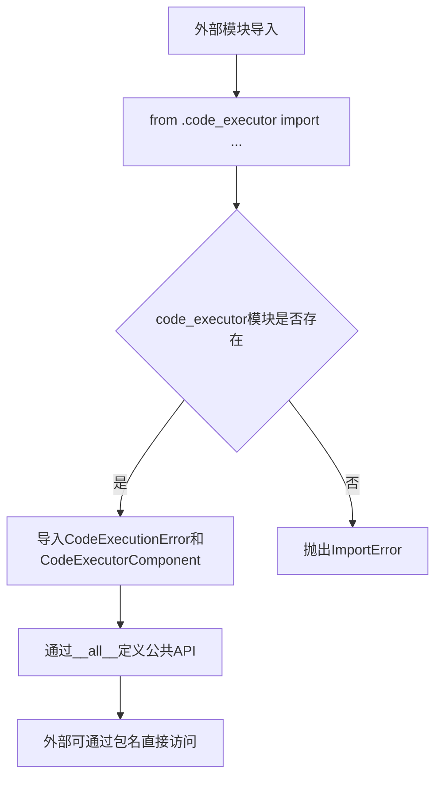

# `.\AutoGPT\classic\forge\forge\components\code_executor\__init__.py` 详细设计文档

这是一个Python包的初始化文件（__init__.py），作为code_executor模块的公共入口点，负责导出代码执行相关的错误处理类CodeExecutionError和核心执行组件CodeExecutorComponent，供外部模块导入使用。

## 整体流程



## 类结构

```
code_executor包
└── __init__.py (包初始化/导出模块)
    └── code_executor.py (实际实现模块，未在当前文件中展示)
```

## 全局变量及字段


### `CodeExecutionError`
    
代码执行过程中产生的错误异常类

类型：`class`
    


### `CodeExecutorComponent`
    
代码执行器组件，用于执行代码并返回执行结果

类型：`class`
    


### `__all__`
    
定义模块的公共接口，明确列出可被外部导入的符号

类型：`list`
    


    

## 全局函数及方法


## 关键组件


### CodeExecutionError

从code_executor模块导入的异常类，用于表示代码执行过程中发生的错误。

### CodeExecutorComponent

从code_executor模块导入的组件类，负责代码的执行和管理功能。


## 问题及建议


### 已知问题

-   **缺少模块文档**: 该模块没有文档字符串（docstring），无法了解其具体用途和设计意图
-   **重新导出缺乏价值**: 该文件仅作为 `code_executor` 模块的重新导出层，未添加任何额外抽象或加工，可能造成不必要的模块分层
-   **依赖隐式**: 对 `CodeExecutionError` 和 `CodeExecutorComponent` 的依赖是隐式的，调用方无法从该文件中获取更多类型信息或使用指导
-   **无版本控制**: 缺少对导出组件的版本管理或兼容性说明

### 优化建议

-   **添加模块文档**: 在文件顶部添加模块级文档字符串，说明该模块的职责、版本要求及使用场景
-   **评估架构必要性**: 评估该重新导出层是否必要；若仅为中转，建议直接引用 `code_executor` 模块以减少维护成本
-   **增强类型注解**: 可考虑使用 `from __future__ import annotations` 或显式类型注解提升代码可读性
-   **导出更多组件**: 若该模块承担"公共API"角色，应确保 `__all__` 包含所有需要暴露的接口，避免意外导出内部实现
-   **添加重导出说明**: 可在注释中说明为何需要此层导出（如统一命名空间、版本抽象等），便于后续维护者理解设计意图


## 其它


### 设计目标与约束

该代码执行器组件的核心设计目标是提供一个安全、可控的代码执行环境，支持在沙箱环境中执行用户提交的代码，并捕获执行过程中的各类异常。设计约束包括：必须隔离代码执行环境以防止恶意代码影响主机系统；执行超时机制需要严格控制，以防止无限循环或资源耗尽；需要支持多种编程语言的代码执行（虽然当前实现主要针对Python）。

### 错误处理与异常设计

CodeExecutionError作为自定义异常类，用于封装代码执行过程中可能出现的各类错误场景。该异常类需要继承自Python的BaseException或Exception，并包含错误码、错误消息、堆栈跟踪等关键信息。异常设计应遵循以下原则：区分可恢复错误和不可恢复错误；提供足够的上下文信息便于调试；支持异常链式传递以保留原始错误信息。错误码应采用统一的枚举或常量类进行管理，便于调用方进行精确的错误处理和用户提示。

### 数据流与状态机

代码执行的数据流如下：接收源代码字符串 → 语法验证 → 沙箱环境准备 → 代码加载 → 代码执行 → 结果收集 → 环境清理。组件应维护明确的生命周期状态，包括：初始状态（Idle）、执行中状态（Executing）、成功状态（Success）、失败状态（Failed）、超时状态（Timeout）、清理状态（Cleaning）。状态转换需要加锁保护，确保并发场景下的状态一致性。状态机实现应支持事件监听，便于外部系统监控执行进度。

### 外部依赖与接口契约

主要依赖包括：Python解释器环境（用于执行Python代码）、沙箱隔离库（如pyminifier、execjs或其他沙箱方案）、超时控制机制（signal或threading实现）、可能的容器化技术（Docker用于更强的隔离）。接口契约方面，CodeExecutorComponent应提供execute(source_code, language, timeout)方法作为核心执行入口，返回执行结果或抛出CodeExecutionError；CodeExecutionError应实现标准异常接口并提供get_error_code()、get_details()等扩展方法。

### 安全性设计

代码执行器的安全性至关重要。设计要点包括：最小权限原则，代码应在受限权限下执行；资源限制，限制内存使用、CPU时间、文件系统访问、网络访问等；输入验证，对源代码进行长度限制、危险代码模式检测；审计日志，记录所有代码执行请求和结果；沙箱逃逸防护，防范恶意代码利用Python特性突破隔离。

### 性能考量与优化空间

性能设计考虑：代码缓存机制，对重复代码进行缓存避免重复解析；连接池管理，如涉及外部执行环境应使用连接池；异步执行，支持非阻塞执行以提高吞吐量；资源回收，确保执行完成后立即释放资源。优化空间：当前可能缺少缓存机制；并发执行支持可能不足；缺乏执行结果的部分缓存机制。

### 配置与扩展性

组件应支持灵活配置：执行超时时间、可使用内存限制、允许访问的模块白名单/黑名单、日志级别、执行环境参数等。扩展性设计：支持自定义执行器实现（Strategy模式）、支持钩子函数（执行前验证、执行后清理）、支持多语言执行器的注册机制。

### 测试策略

单元测试应覆盖：CodeExecutionError异常的各种场景测试、CodeExecutorComponent基本功能测试、状态转换测试、超时处理测试。集成测试应覆盖：与沙箱环境的集成测试、异常场景的端到端测试、性能和压力测试、安全性测试（逃逸检测）。

### 版本兼容性

需要明确支持的Python版本范围（如Python 3.8+）、与第三方库的兼容性要求、API的版本演进策略（是否遵循语义化版本）、向后兼容性的维护策略。

    