# `.\AutoGPT\classic\forge\forge\components\code_executor\code_executor.py` 详细设计文档

该代码实现了一个代码执行组件，提供在Docker容器中执行Python代码以及在本地执行Shell命令的能力，支持白名单/黑名单安全控制，通过单次使用的容器实现代码隔离执行。

## 整体流程

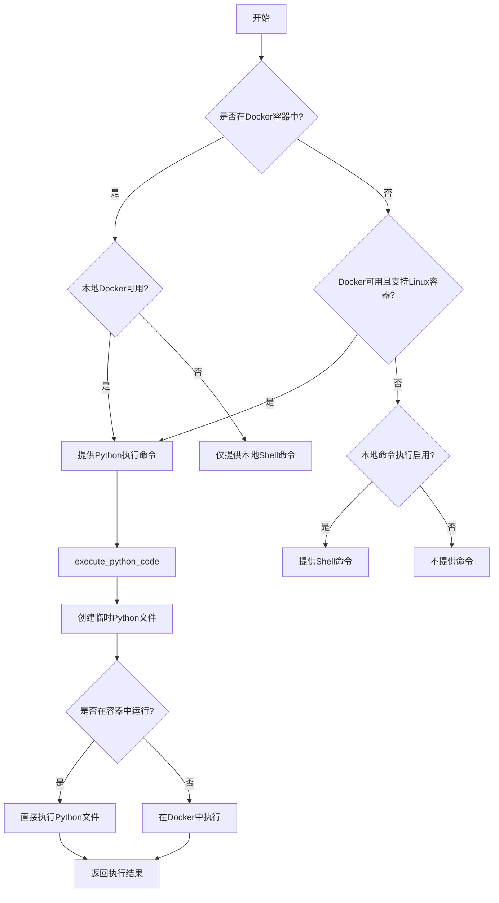

## 类结构

```
CodeExecutionError (异常类)
CodeExecutorConfiguration (配置类)
CodeExecutorComponent (主组件类)
    └── CommandProvider (协议)
    └── ConfigurableComponent (可配置组件)
```

## 全局变量及字段


### `logger`
    
获取当前模块的logger实例，用于记录代码执行过程中的日志信息

类型：`logging.Logger`
    


### `CodeExecutorConfiguration.execute_local_commands`
    
是否启用本地命令执行

类型：`bool`
    


### `CodeExecutorConfiguration.shell_command_control`
    
shell命令控制模式(allowlist/denylist)

类型：`Literal[allowlist, denylist]`
    


### `CodeExecutorConfiguration.shell_allowlist`
    
允许的shell命令列表

类型：`list[str]`
    


### `CodeExecutorConfiguration.shell_denylist`
    
禁止的shell命令列表

类型：`list[str]`
    


### `CodeExecutorConfiguration.docker_container_name`
    
Docker容器名称

类型：`str`
    


### `CodeExecutorComponent.config`
    
配置对象

类型：`CodeExecutorConfiguration`
    


### `CodeExecutorComponent.workspace`
    
工作区文件存储

类型：`FileStorage`
    
    

## 全局函数及方法


### `we_are_running_in_a_docker_container`

该函数用于检测当前代码是否在 Docker 容器环境中运行，通过检查特定文件 `/.dockerenv` 是否存在来判断。

参数： 无

返回值：`bool`，如果当前运行在 Docker 容器中返回 `True`，否则返回 `False`

#### 流程图

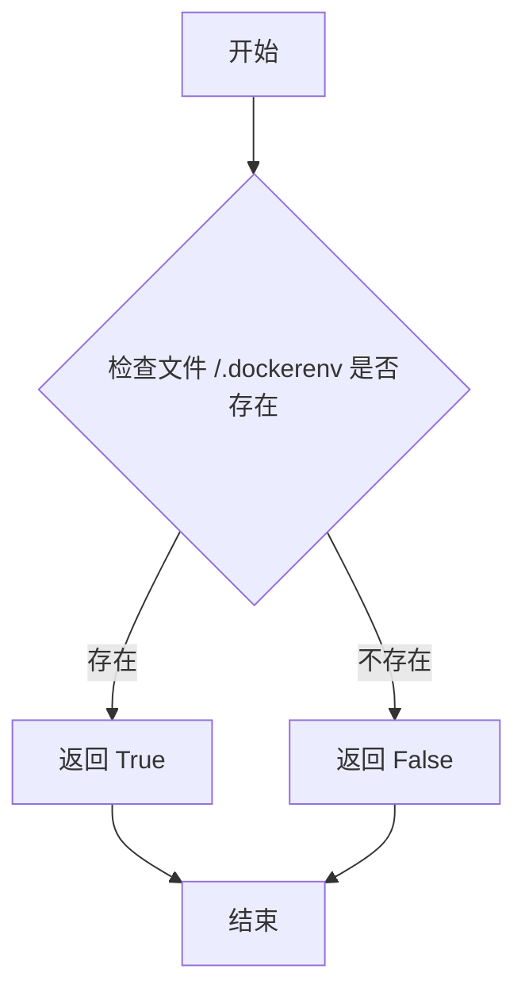

#### 带注释源码

```python
def we_are_running_in_a_docker_container() -> bool:
    """Check if we are running in a Docker container

    Returns:
        bool: True if we are running in a Docker container, False otherwise
    """
    # Docker 容器启动时会在根目录创建 /.dockerenv 文件
    # 通过检查该文件是否存在来判断当前是否运行在容器中
    return os.path.exists("/.dockerenv")
```


### `is_docker_available`

检查 Docker 是否可用且支持 Linux 容器

参数：
- （无参数）

返回值：`bool`，如果 Docker 可用且支持 Linux 容器则返回 True，否则返回 False

#### 流程图

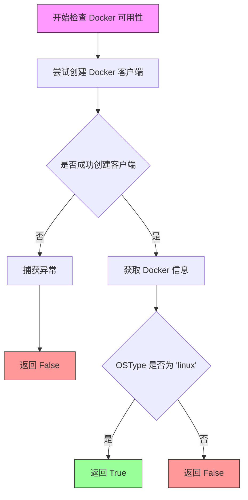

#### 带注释源码

```python
def is_docker_available() -> bool:
    """Check if Docker is available and supports Linux containers
    
    Returns:
        bool: True if Docker is available and supports Linux containers, False otherwise
    """
    try:
        # 使用 docker SDK 从环境变量创建 Docker 客户端
        # 该客户端会尝试连接本地的 Docker daemon
        client = docker.from_env()
        
        # 获取 Docker daemon 的系统信息
        docker_info = client.info()
        
        # 检查 Docker 容器类型是否为 Linux
        # 只有 Linux 容器才支持代码执行功能
        return docker_info["OSType"] == "linux"
    except Exception:
        # 捕获所有异常（包括连接失败、权限问题、Docker 未安装等）
        # 返回 False 表示 Docker 不可用
        return False
```


### `CodeExecutionError`

继承自 `CommandExecutionError` 的自定义异常类，用于表示代码执行过程中发生的错误。

#### 流程图

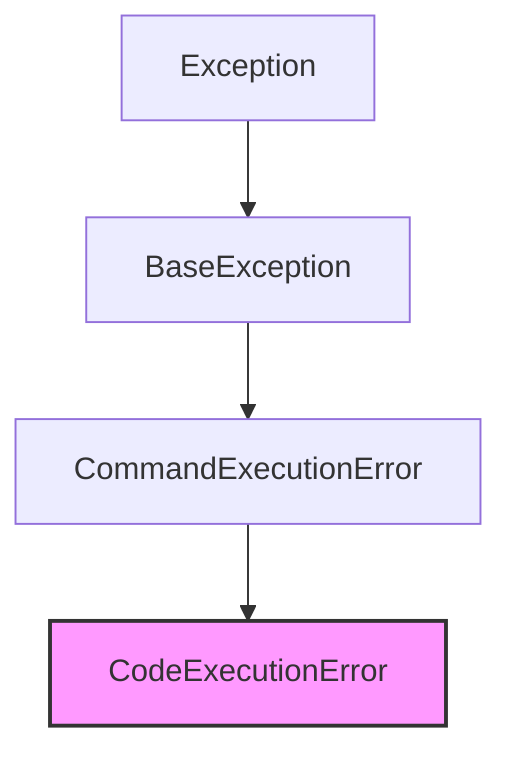

#### 带注释源码

```python
class CodeExecutionError(CommandExecutionError):
    """The operation (an attempt to run arbitrary code) returned an error"""
```

---

**说明**：

- **类字段**：无（仅继承父类字段）
- **类方法**：无（仅继承父类方法）
- **类型**：继承自 `CommandExecutionError` 的自定义异常类
- **用途**：当执行任意代码（Python 代码或 Shell 命令）发生错误时抛出此异常。在代码中有多处使用，例如：
  - `execute_python_file` 方法中，当 Python 脚本执行返回非零退出码时抛出
  - `_run_python_code_in_docker` 方法中，当 Docker 容器内执行 Python 脚本失败时抛出
- **继承关系**：`CodeExecutionError` → `CommandExecutionError` → 更高层的异常基类


### `CodeExecutorComponent.__init__`

该方法是 `CodeExecutorComponent` 类的构造函数，用于初始化代码执行器组件。它接受工作区存储对象和可选的配置对象，设置容器名称（添加随机后缀以避免冲突），并记录 Docker 和本地命令执行的状态信息。

参数：

- `workspace`：`FileStorage`，工作区存储对象，用于管理代码文件的读写
- `config`：`Optional[CodeExecutorConfiguration]`，可选的配置对象，用于配置代码执行器的行为

返回值：`None`，构造函数不返回任何值

#### 流程图

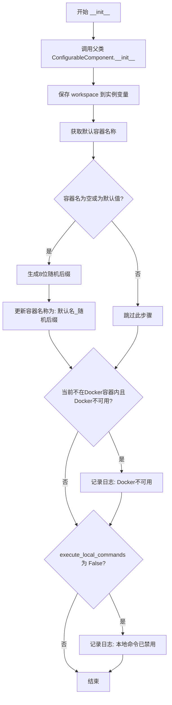

#### 带注释源码

```python
def __init__(
    self,
    workspace: FileStorage,
    config: Optional[CodeExecutorConfiguration] = None,
):
    """初始化 CodeExecutorComponent 实例
    
    Args:
        workspace: FileStorage 实例，提供对工作区文件的访问
        config: 可选的 CodeExecutorConfiguration 配置对象
    """
    # 调用父类的初始化方法，设置配置
    ConfigurableComponent.__init__(self, config)
    # 保存工作区引用到实例变量，供后续方法使用
    self.workspace = workspace

    # Change container name if it's empty or default to prevent different agents
    # from using the same container
    # 获取配置中 docker_container_name 字段的默认值
    default_container_name = self.config.model_fields[
        "docker_container_name"
    ].default
    # 如果容器名为空或者是默认值，则添加随机后缀以避免不同代理使用同一容器
    if (
        not self.config.docker_container_name
        or self.config.docker_container_name == default_container_name
    ):
        # 生成8位小写字母随机字符串
        random_suffix = "".join(random.choices(string.ascii_lowercase, k=8))
        # 更新容器名称为: 默认名_随机后缀
        self.config.docker_container_name = (
            f"{default_container_name}_{random_suffix}"
        )

    # 检查是否在Docker容器内运行且Docker是否可用
    if not we_are_running_in_a_docker_container() and not is_docker_available():
        # 记录日志：Docker不可用或不支持Linux容器，代码执行命令将不可用
        logger.info(
            "Docker is not available or does not support Linux containers. "
            "The code execution commands will not be available."
        )

    # 检查是否启用本地shell命令执行
    if not self.config.execute_local_commands:
        # 记录日志：本地shell命令已禁用
        logger.info(
            "Local shell commands are disabled. To enable them,"
            " set EXECUTE_LOCAL_COMMANDS to 'True' in your config file."
        )
```


### `CodeExecutorComponent.get_commands`

该方法是一个迭代器方法，用于获取当前环境下可用的代码执行命令。根据运行时环境（是否在 Docker 容器中、Docker 是否可用）以及配置参数（是否允许本地命令执行），动态返回不同的命令迭代器。

参数：

- 该方法无参数（仅包含隐式参数 `self`）

返回值：`Iterator[Command]`，返回可用命令的迭代器

#### 流程图

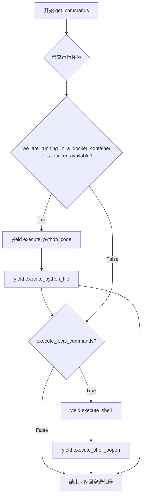

#### 带注释源码

```python
def get_commands(self) -> Iterator[Command]:
    """Get the available commands for code execution.
    
    Yields:
        Command: Available commands based on the execution environment
                 and configuration settings.
    
    Returns:
        Iterator[Command]: An iterator over the available command objects
    """
    # 检查当前是否在 Docker 容器中运行，或者 Docker 是否可用
    if we_are_running_in_a_docker_container() or is_docker_available():
        # 提供 Python 代码执行命令（在 Docker 容器中运行）
        yield self.execute_python_code
        yield self.execute_python_file

    # 检查配置是否允许本地 shell 命令执行
    if self.config.execute_local_commands:
        # 提供本地 shell 命令执行命令
        yield self.execute_shell
        yield self.execute_shell_popen
```


### `CodeExecutorComponent.execute_python_code`

在单次使用的Docker容器中创建并执行Python文件，返回代码的STDOUT输出。如果代码需要生成任何需要捕获的数据，请使用print语句。

参数：

- `code`：`str`，要运行的Python代码

返回值：`str`，代码运行时的STDOUT捕获内容

#### 流程图

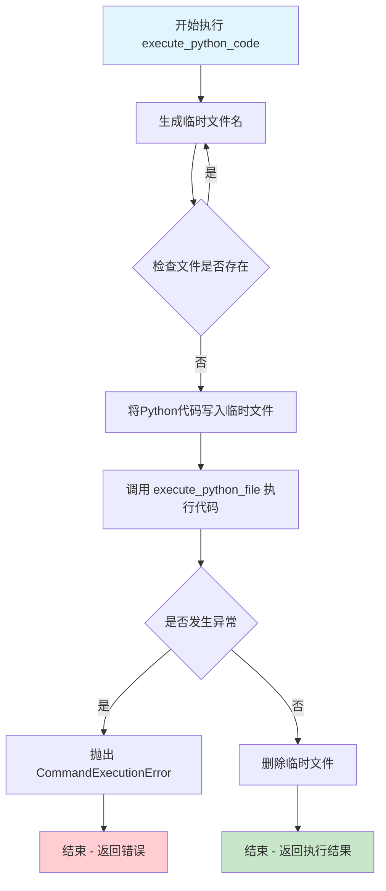

#### 带注释源码

```python
@command(
    ["execute_python_code"],
    "Executes the given Python code inside a single-use Docker container"
    " with access to your workspace folder",
    {
        "code": JSONSchema(
            type=JSONSchema.Type.STRING,
            description="The Python code to run",
            required=True,
        ),
    },
)
async def execute_python_code(self, code: str) -> str:
    """
    Create and execute a Python file in a Docker container
    and return the STDOUT of the executed code.

    If the code generates any data that needs to be captured,
    use a print statement.

    Args:
        code (str): The Python code to run.
        agent (Agent): The Agent executing the command.

    Returns:
        str: The STDOUT captured from the code when it ran.
    """

    # 生成唯一的临时文件名，避免与现有文件冲突
    temp_path = ""
    while True:
        # 生成随机字符串创建临时文件名
        temp_path = f"temp{self._generate_random_string()}.py"
        # 检查文件是否已存在
        if not self.workspace.exists(temp_path):
            break
    
    # 将传入的Python代码写入临时文件
    await self.workspace.write_file(temp_path, code)

    try:
        # 调用execute_python_file方法执行临时文件中的代码
        return self.execute_python_file(temp_path)
    except Exception as e:
        # 捕获执行过程中的异常，重新抛出为CommandExecutionError
        raise CommandExecutionError(*e.args)
    finally:
        # 不管成功还是失败，最后都删除临时文件以清理workspace
        self.workspace.delete_file(temp_path)
```


### `CodeExecutorComponent.execute_python_file`

在 Docker 容器中执行现有的 Python 文件，并返回执行输出。如果应用程序已运行在 Docker 容器内，则直接执行 Python 文件；否则，创建一个新的 Docker 容器并在容器中运行该文件。

参数：

- `filename`：`str | Path`，要执行的 Python 文件名
- `args`：`list[str] = []`，传递给 Python 脚本的命令行参数

返回值：`str`，文件的执行输出

#### 流程图

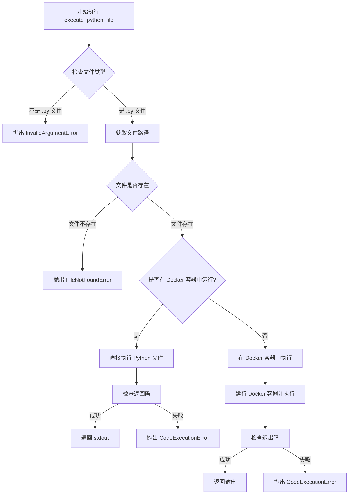

#### 带注释源码

```python
@command(
    ["execute_python_file"],
    "Execute an existing Python file inside a single-use Docker container"
    " with access to your workspace folder",
    {
        "filename": JSONSchema(
            type=JSONSchema.Type.STRING,
            description="The name of the file to execute",
            required=True,
        ),
        "args": JSONSchema(
            type=JSONSchema.Type.ARRAY,
            description="The (command line) arguments to pass to the script",
            required=False,
            items=JSONSchema(type=JSONSchema.Type.STRING),
        ),
    },
)
def execute_python_file(self, filename: str | Path, args: list[str] = []) -> str:
    """Execute a Python file in a Docker container and return the output

    Args:
        filename (Path): The name of the file to execute
        args (list, optional): The arguments with which to run the python script

    Returns:
        str: The output of the file
    """
    # 记录执行日志
    logger.info(f"Executing python file '{filename}'")

    # 验证文件类型：仅允许 .py 文件
    if not str(filename).endswith(".py"):
        raise InvalidArgumentError("Invalid file type. Only .py files are allowed.")

    # 获取文件的完整路径
    file_path = self.workspace.get_path(filename)
    
    # 检查文件是否存在于工作区中
    if not self.workspace.exists(file_path):
        # 模拟命令行错误响应，使 LLM 更容易理解
        raise FileNotFoundError(
            f"python: can't open file '{filename}': "
            f"[Errno 2] No such file or directory"
        )

    # 判断是否已在 Docker 容器中运行
    if we_are_running_in_a_docker_container():
        logger.debug(
            "App is running in a Docker container; "
            f"executing {file_path} directly..."
        )
        # 挂载工作区并执行 Python 文件
        with self.workspace.mount() as local_path:
            # 使用 subprocess 直接运行 Python 脚本
            result = subprocess.run(
                ["python", "-B", str(file_path.relative_to(self.workspace.root))]
                + args,
                capture_output=True,
                encoding="utf8",
                cwd=str(local_path),
            )
            # 返回码为 0 表示执行成功
            if result.returncode == 0:
                return result.stdout
            else:
                # 执行失败，抛出错误
                raise CodeExecutionError(result.stderr)

    # 未在 Docker 容器中运行，使用 Docker 容器执行
    logger.debug("App is not running in a Docker container")
    return self._run_python_code_in_docker(file_path, args)
```


### `CodeExecutorComponent.validate_command`

验证命令行是否允许执行以及是否可以在 shell 中运行。该方法根据配置的白名单或黑名单规则检查命令，并始终禁止在 shell 中执行以防止模型绕过命令过滤器。

参数：

- `self`：`CodeExecutorComponent`，方法所属的类实例
- `command_line`：`str`，要验证的命令行字符串

返回值：`tuple[bool, bool]`，第一个 bool 表示命令是否允许执行，第二个 bool 表示命令是否可以在 shell 中执行

#### 流程图

```mermaid
flowchart TD
    A[开始 validate_command] --> B{command_line 是否为空}
    B -->|是| C[返回 (False, False)]
    B -->|否| D[使用 shlex.split 提取命令名称]
    D --> E{shell_command_control 配置}
    E -->|allowlist| F{command_name 在 shell_allowlist 中}
    E -->|denylist| G{command_name 不在 shell_denylist 中}
    E -->|其他| H[返回 (True, True)]
    F -->|是| I[返回 (True, False)]
    F -->|否| J[返回 (False, False)]
    G -->|是| K[返回 (True, False)]
    G -->|否| L[返回 (False, False)]
```

#### 带注释源码

```python
def validate_command(self, command_line: str) -> tuple[bool, bool]:
    """Check whether a command is allowed and whether it may be executed in a shell.

    If shell command control is enabled, we disallow executing in a shell, because
    otherwise the model could circumvent the command filter using shell features.

    Args:
        command_line (str): The command line to validate
        config (Config): The app config including shell command control settings

    Returns:
        bool: True if the command is allowed, False otherwise
        bool: True if the command may be executed in a shell, False otherwise
    """
    # 检查命令行是否为空，如果为空则不允许执行且不允许使用 shell
    if not command_line:
        return False, False

    # 使用 shlex.split 解析命令行，提取第一个词作为命令名称
    # shlex.split 可以正确处理引号和转义字符
    command_name = shlex.split(command_line)[0]

    # 根据配置的控制模式进行验证
    if self.config.shell_command_control == "allowlist":
        # 白名单模式：命令必须在白名单中才允许执行
        # 始终返回 False 表示不允许在 shell 中执行（防止绕过过滤器）
        return command_name in self.config.shell_allowlist, False
    elif self.config.shell_command_control == "denylist":
        # 黑名单模式：命令不在黑名单中就允许执行
        # 始终返回 False 表示不允许在 shell 中执行
        return command_name not in self.config.shell_denylist, False
    else:
        # 未配置控制模式时，默认允许执行且允许使用 shell
        return True, True
```


### `CodeExecutorComponent.execute_shell`

执行一条Shell命令并返回命令的输出结果。该方法首先验证命令是否在允许列表或不在禁止列表中，然后切换到工作空间目录（如需要），执行命令，最后恢复原始工作目录并返回包含标准输出和标准错误的格式化结果。

参数：

- `command_line`：`str`，要执行的命令行命令

返回值：`str`，命令执行后的输出结果，包含STDOUT和STDERR部分

#### 流程图

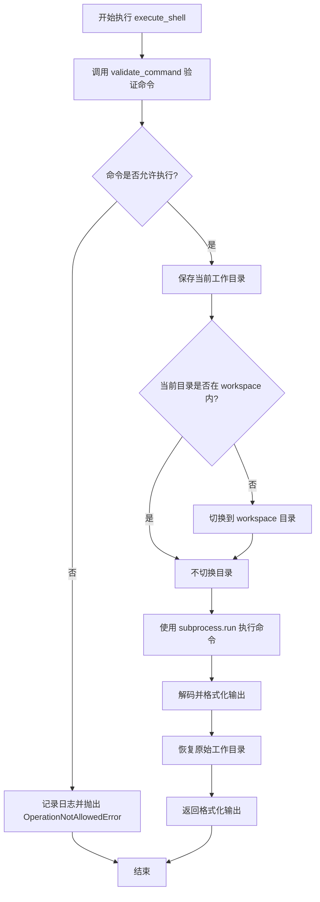

#### 带注释源码

```python
@command(
    ["execute_shell"],
    "Execute a Shell Command, non-interactive commands only",
    {
        "command_line": JSONSchema(
            type=JSONSchema.Type.STRING,
            description="The command line to execute",
            required=True,
        )
    },
)
def execute_shell(self, command_line: str) -> str:
    """Execute a shell command and return the output

    Args:
        command_line (str): The command line to execute

    Returns:
        str: The output of the command
    """
    # 第一步：验证命令是否允许执行
    # 检查命令是否在白名单中（如果使用白名单模式）
    # 或检查命令是否不在黑名单中（如果使用黑名单模式）
    allow_execute, allow_shell = self.validate_command(command_line)
    
    # 如果命令不允许执行，记录日志并抛出异常
    if not allow_execute:
        logger.info(f"Command '{command_line}' not allowed")
        raise OperationNotAllowedError("This shell command is not allowed.")

    # 第二步：保存当前工作目录，以便执行完成后恢复
    current_dir = Path.cwd()
    
    # 第三步：检查并切换到工作空间目录
    # 如果当前目录不在工作空间根目录下，则切换到工作空间
    if not current_dir.is_relative_to(self.workspace.root):
        os.chdir(self.workspace.root)

    # 记录要执行的命令和当前工作目录
    logger.info(
        f"Executing command '{command_line}' in working directory '{os.getcwd()}'"
    )

    # 第四步：执行命令
    # 根据 allow_shell 决定是否使用 shell 执行
    # allow_shell=False 时，使用 shlex.split 分割命令并以列表形式传递
    result = subprocess.run(
        command_line if allow_shell else shlex.split(command_line),
        capture_output=True,
        shell=allow_shell,
    )
    
    # 第五步：格式化输出，包含 STDOUT 和 STDERR
    output = f"STDOUT:\n{result.stdout.decode()}\nSTDERR:\n{result.stderr.decode()}"

    # 第六步：恢复原始工作目录
    # 确保不影响后续操作的目录环境
    os.chdir(current_dir)

    # 返回格式化后的输出
    return output
```


### `CodeExecutorComponent.execute_shell_popen`

该方法用于执行非交互式Shell命令，通过`subprocess.Popen`启动子进程并返回进程ID的描述信息，适用于需要在后台执行命令但不关心输出结果的场景。

参数：

- `command_line`：`str`，要执行的命令行命令

返回值：`str`，返回关于进程已启动及其进程ID的英文描述，格式为`"Subprocess started with PID:'{pid}'"`

#### 流程图

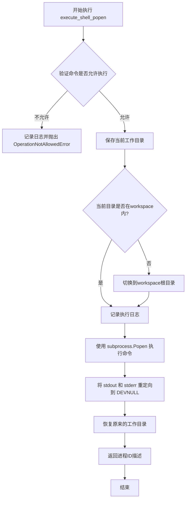

#### 带注释源码

```python
@command(
    ["execute_shell_popen"],
    "Execute a Shell Command, non-interactive commands only",
    {
        "command_line": JSONSchema(
            type=JSONSchema.Type.STRING,
            description="The command line to execute",
            required=True,
        )
    },
)
def execute_shell_popen(self, command_line: str) -> str:
    """Execute a shell command with Popen and returns an english description
    of the event and the process id

    Args:
        command_line (str): The command line to execute

    Returns:
        str: Description of the fact that the process started and its id
    """
    # 验证命令是否在白名单/黑名单中，允许执行且允许shell模式
    allow_execute, allow_shell = self.validate_command(command_line)
    
    # 如果命令不被允许，记录日志并抛出操作不允许异常
    if not allow_execute:
        logger.info(f"Command '{command_line}' not allowed")
        raise OperationNotAllowedError("This shell command is not allowed.")

    # 保存当前工作目录，以便执行完成后恢复
    current_dir = Path.cwd()
    
    # Change dir into workspace if necessary
    # 如果当前目录不在workspace根目录下，则切换到workspace目录
    if not current_dir.is_relative_to(self.workspace.root):
        os.chdir(self.workspace.root)

    # 记录命令执行日志
    logger.info(
        f"Executing command '{command_line}' in working directory '{os.getcwd()}'"
    )

    # 将输出重定向到DEVNULL，不显示命令输出
    do_not_show_output = subprocess.DEVNULL
    
    # 使用Popen启动子进程执行命令
    process = subprocess.Popen(
        # 如果允许shell模式，直接执行命令字符串；否则使用shlex.split分割
        command_line if allow_shell else shlex.split(command_line),
        shell=allow_shell,
        stdout=do_not_show_output,
        stderr=do_not_show_output,
    )

    # 恢复原来的工作目录
    os.chdir(current_dir)

    # 返回进程启动信息和进程ID
    return f"Subprocess started with PID:'{str(process.pid)}'"
```


### `CodeExecutorComponent._run_python_code_in_docker`

在 Docker 容器中运行 Python 脚本，方法会检查或创建容器、确保镜像存在，然后在容器内执行指定的 Python 文件并返回执行结果。

参数：

- `filename`：`str | Path`，要执行的 Python 文件路径或文件名
- `args`：`list[str]`，传递给 Python 脚本的命令行参数列表

返回值：`str`，容器中执行 Python 代码后的标准输出（STDOUT）

#### 流程图

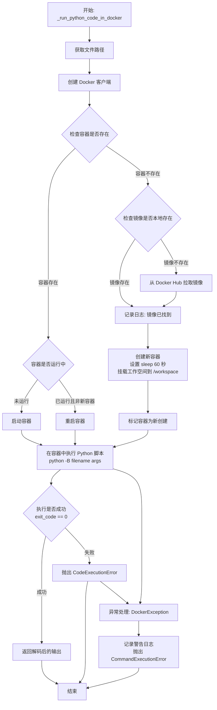

#### 带注释源码

```python
def _run_python_code_in_docker(self, filename: str | Path, args: list[str]) -> str:
    """Run a Python script in a Docker container
    
    在 Docker 容器中运行 Python 脚本。
    该方法负责管理 Docker 容器的生命周期：检查现有容器、
    必要时拉取镜像、创建容器、在其中执行 Python 代码，
    并返回执行结果。
    
    Args:
        filename: 要执行的 Python 文件路径
        args: 传递给脚本的命令行参数
    
    Returns:
        str: 容器执行后的标准输出
    """
    # 1. 将传入的 filename 转换为工作空间中的绝对路径
    file_path = self.workspace.get_path(filename)
    
    try:
        # 2. 创建 Docker 客户端连接
        client = docker.from_env()
        
        # 3. 定义要使用的 Docker 镜像名称
        image_name = "python:3-alpine"
        
        # 4. 标记新创建的容器，用于后续判断是否需要重启
        container_is_fresh = False
        
        # 5. 获取配置中指定的容器名称
        container_name = self.config.docker_container_name
        
        # 6. 挂载工作空间到本地路径，获得可访问的目录
        with self.workspace.mount() as local_path:
            try:
                # 7. 尝试获取已存在的容器
                container: DockerContainer = client.containers.get(container_name)
            except NotFound:
                # 8. 容器不存在，检查镜像是否已本地存在
                try:
                    client.images.get(image_name)
                    logger.debug(f"Image '{image_name}' found locally")
                except ImageNotFound:
                    # 9. 镜像不存在，从 Docker Hub 拉取
                    logger.info(
                        f"Image '{image_name}' not found locally,"
                        " pulling from Docker Hub..."
                    )
                    # 使用低级 API 流式拉取镜像并输出进度
                    low_level_client = docker.APIClient()
                    for line in low_level_client.pull(
                        image_name, stream=True, decode=True
                    ):
                        status = line.get("status")
                        progress = line.get("progress")
                        if status and progress:
                            logger.info(f"{status}: {progress}")
                        elif status:
                            logger.info(status)

                # 10. 创建新容器，sleep 60 秒防止永久挂起
                logger.debug(f"Creating new {image_name} container...")
                container: DockerContainer = client.containers.run(
                    image_name,
                    ["sleep", "60"],  # 最大 60 秒，防止永久挂起
                    volumes={
                        # 将本地工作空间挂载到容器的 /workspace 目录
                        str(local_path.resolve()): {
                            "bind": "/workspace",
                            "mode": "rw",
                        }
                    },
                    working_dir="/workspace",
                    stderr=True,
                    stdout=True,
                    detach=True,
                    name=container_name,
                )
                # 标记为新创建的容器
                container_is_fresh = True

            # 11. 确保容器处于运行状态
            if not container.status == "running":
                # 容器未运行，启动它
                container.start()
            elif not container_is_fresh:
                # 容器已在运行但不是新创建的，重启它以确保干净状态
                container.restart()

            # 12. 在容器中执行 Python 脚本
            logger.debug(f"Running {file_path} in container {container.name}...")
            exec_result = container.exec_run(
                [
                    "python",
                    "-B",  # -B 抑制 .pyc 文件生成
                    file_path.relative_to(self.workspace.root).as_posix(),
                ]
                + args,
                stderr=True,
                stdout=True,
            )

            # 13. 检查执行结果
            if exec_result.exit_code != 0:
                # 执行失败，抛出异常
                raise CodeExecutionError(exec_result.output.decode("utf-8"))

            # 14. 执行成功，返回解码后的输出
            return exec_result.output.decode("utf-8")

    except DockerException as e:
        # 15. 处理 Docker 异常，如 Docker 未安装或未运行
        logger.warning(
            "Could not run the script in a container. "
            "If you haven't already, please install Docker: "
            "https://docs.docker.com/get-docker/"
        )
        raise CommandExecutionError(f"Could not run the script in a container: {e}")
```


### `CodeExecutorComponent._generate_random_string`

生成一个指定长度的随机字母数字字符串，用于创建唯一的临时文件名或容器名称。

参数：

- `length`：`int`，随机字符串的长度，默认为 8

返回值：`str`，生成的随机字符串

#### 流程图

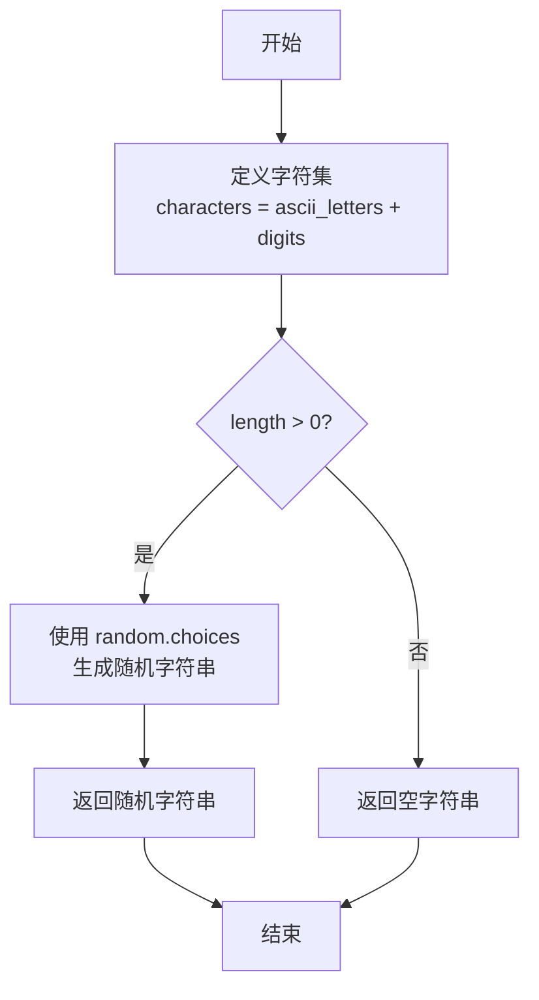

#### 带注释源码

```python
def _generate_random_string(self, length: int = 8):
    """
    生成一个指定长度的随机字母数字字符串
    
    Args:
        length (int, optional): 随机字符串的长度，默认为 8
        
    Returns:
        str: 生成的随机字符串
    """
    # 创建包含所有字母和数字的字符集
    # ascii_letters 包含 a-z 和 A-Z，digits 包含 0-9
    characters = string.ascii_letters + string.digits
    
    # 使用 random.choices 从字符集中随机选择字符
    # k=length 指定生成的字符串长度
    random_string = "".join(random.choices(characters, k=length))
    
    return random_string
```

## 关键组件


### Docker容器管理

在Docker容器中执行Python代码的完整生命周期管理，包括镜像拉取、容器创建、启动、运行和清理

### 代码执行器配置

使用Pydantic定义的配置模型，管理本地命令执行、Docker容器名称、shell命令白名单/黑名单等选项

### 命令验证系统

基于白名单或黑名单机制验证shell命令是否允许执行的逻辑，支持allowlist和denylist两种控制模式

### Python代码执行器

在隔离的Docker容器或本地环境中执行Python代码和Python文件，支持命令行参数传递

### Shell命令执行器

执行本地shell命令的组件，支持两种模式：直接返回输出和通过Popen异步执行并返回进程ID

### 工作空间集成

与FileStorage组件集成，管理临时文件创建、文件写入、路径解析和目录切换


## 问题及建议


### 已知问题

- **异常处理不当**：在 `execute_python_code` 中，`raise CommandExecutionError(*e.args)` 如果 `e.args` 为空会导致无参数的异常抛出，信息丢失；在 `execute_python_file` 中直接捕获 Exception 并重新抛出，丢失堆栈上下文
- **Docker 容器资源泄漏**：`_run_python_code_in_docker` 方法创建容器后没有在 finally 块中清理容器，容器可能持续运行占用资源；容器使用 "sleep 60" 保活但异常情况下不会自动终止
- **命令验证不完整**：`validate_command` 仅验证命令名称，不验证参数部分，攻击者可能通过命令参数绕过 allowlist/denylist 限制
- **subprocess 安全风险**：`execute_shell` 和 `execute_shell_popen` 在 `allow_shell=True` 时使用 `shell=True` 执行命令，存在命令注入风险
- **类型标注缺失**：`_generate_random_string` 方法缺少返回类型注解
- **代码重复**：`execute_shell` 和 `execute_shell_popen` 存在大量重复的目录切换和验证逻辑
- **Docker 客户端重复创建**：多处直接调用 `docker.from_env()` 创建新的 Docker 客户端，没有复用连接
- **异步/同步不一致**：`execute_python_code` 是 async 方法，但其调用的 `execute_python_file` 是同步方法，设计不一致

### 优化建议

- 添加 Docker 容器自动清理机制，在执行完成后停止并移除容器，或使用容器生命周期管理器
- 完善命令验证逻辑，对完整命令字符串（包括参数）进行验证，或使用 shlex.split 后对命令和参数分别验证
- 考虑使用 `subprocess.run` 的 `shell=False` 模式并配合 `shlex.split` 解析命令，避免 shell 注入风险
- 缓存 Docker 客户端实例或使用单例模式，避免重复创建连接
- 将 `execute_shell` 和 `execute_shell_popen` 的公共逻辑提取为私有方法，如 `_prepare_workspace_directory()`
- 统一异步设计：要么全部使用同步方法，要么将 `execute_python_file` 也改为 async
- 为 `_generate_random_string` 添加返回类型注解 `-> str`
- 考虑使用上下文管理器模式管理 Docker 容器生命周期，确保异常情况下也能正确清理资源
- 添加 Docker 镜像预拉取机制，避免首次执行时长时间等待


## 其它


### 设计目标与约束

**设计目标：**
- 提供安全、可控的代码执行环境，支持Python代码和Shell命令的隔离执行
- 支持本地执行和Docker容器内执行两种模式
- 通过白名单/黑名单机制控制Shell命令的执行权限
- 为AI Agent提供可用的代码执行能力，同时防止恶意操作

**设计约束：**
- 仅支持Linux容器（Docker OSType为"linux"）
- 仅支持Python 3环境
- Docker容器内执行时最大超时时间为60秒
- 本地Shell命令执行为非交互式
- 不支持Windows环境

### 错误处理与异常设计

**异常层次结构：**
- `CodeExecutionError`：继承自`CommandExecutionError`，用于代码执行过程中的一般错误
- `InvalidArgumentError`：用于参数验证失败（如文件类型错误）
- `OperationNotAllowedError`：用于Shell命令未被授权执行
- 标准异常如`FileNotFoundError`被直接抛出或包装后抛出

**错误处理策略：**
- Docker不可用时记录日志并禁用相关命令，而非抛出异常
- 配置验证在初始化阶段完成
- Shell命令执行前进行权限校验，未授权命令抛出`OperationNotAllowedError`
- 文件操作失败时模仿命令行错误信息格式，便于LLM理解

### 数据流与状态机

**主要数据流：**
1. **Python代码执行流程：**
   - 生成临时Python文件 → 写入工作区 → 调用`execute_python_file` → Docker/本地执行 → 返回stdout → 删除临时文件

2. **Shell命令执行流程：**
   - 接收命令字符串 → 校验权限（白名单/黑名单） → 执行subprocess → 返回输出

**状态转换：**
- Docker容器：NotFound → Created → Running（必要时Restart）
- 执行模式：根据运行环境在Docker执行和本地执行间切换

### 外部依赖与接口契约

**外部依赖：**
- `docker` Python库：Docker API交互
- `pydantic`库：配置模型验证
- `subprocess`模块：本地命令执行
- `forge.agent.components.ConfigurableComponent`：组件基类
- `forge.command.Command`：命令定义装饰器
- `forge.file_storage.FileStorage`：文件存储抽象
- `forge.utils.exceptions`：基础异常类

**接口契约：**
- `CommandProvider`协议：提供`get_commands()`方法返回命令迭代器
- `ConfigurableComponent`协议：接受配置并管理配置生命周期
- `Command`装饰器：注册命令名称、描述和参数schema

### 安全性考虑

- Shell命令执行采用白名单/黑名单双模式控制
- Docker容器隔离执行防止影响宿主机
- 容器名称添加随机后缀防止多Agent共享同一容器
- 限制容器最大运行时间为60秒防止永久挂起
- 本地执行时限制工作目录在workspace范围内
- 仅允许执行.py文件类型
- Shell模式下禁用shell特征防止绕过命令过滤器

### 性能考虑

- Docker镜像采用轻量级`python:3-alpine`
- 容器使用sleep 60而非永久运行，超时后自动清理
- 本地执行时使用`subprocess.run`同步等待结果
- Popen模式提供异步执行能力，命令启动后立即返回PID
- 临时文件执行后立即清理避免积累

### 兼容性考虑

- 支持Python 3.8+（基于类型注解语法）
- 兼容Docker API 1.24+
- 兼容pydantic v2
- 运行环境检测支持Linux和类Unix系统
- 路径处理使用`pathlib.Path`保证跨平台兼容性
- 文件编码统一使用UTF-8

### 配置管理

**配置模型：** `CodeExecutorConfiguration`
- `execute_local_commands`：布尔值，默认False，启用本地Shell命令
- `shell_command_control`：枚举值，允许/拒绝列表模式
- `shell_allowlist`：允许的命令列表
- `shell_denylist`：拒绝的命令列表
- `docker_container_name`：容器名称，默认`agent_sandbox`

**配置验证：**
- 容器名为空或为默认值时自动添加随机后缀
- Docker不可用时自动降级为本地执行或禁用功能

### 生命周期管理

**组件初始化：**
- 检查Docker可用性并记录日志
- 检查是否运行在容器内
- 配置容器名称随机化
- 根据配置注册可用命令

**容器生命周期：**
- 首次执行时创建容器并启动
- 容器停止时自动重启
- 容器异常时记录警告并抛出异常

**资源清理：**
- 临时Python文件在执行完成后立即删除
- 容器超时自动退出
- workspace目录临时挂载使用上下文管理器自动清理

    