# `.\AutoGPT\classic\forge\forge\components\code_executor\test_code_executor.py` 详细设计文档

该文件是一个pytest测试套件，用于测试CodeExecutorComponent类的功能，包括Python文件执行、Python代码直接执行（同步和异步）以及Shell命令执行，并验证Docker环境检查、参数传递、文件错误处理和Shell命令黑白名单控制等特性。

## 整体流程

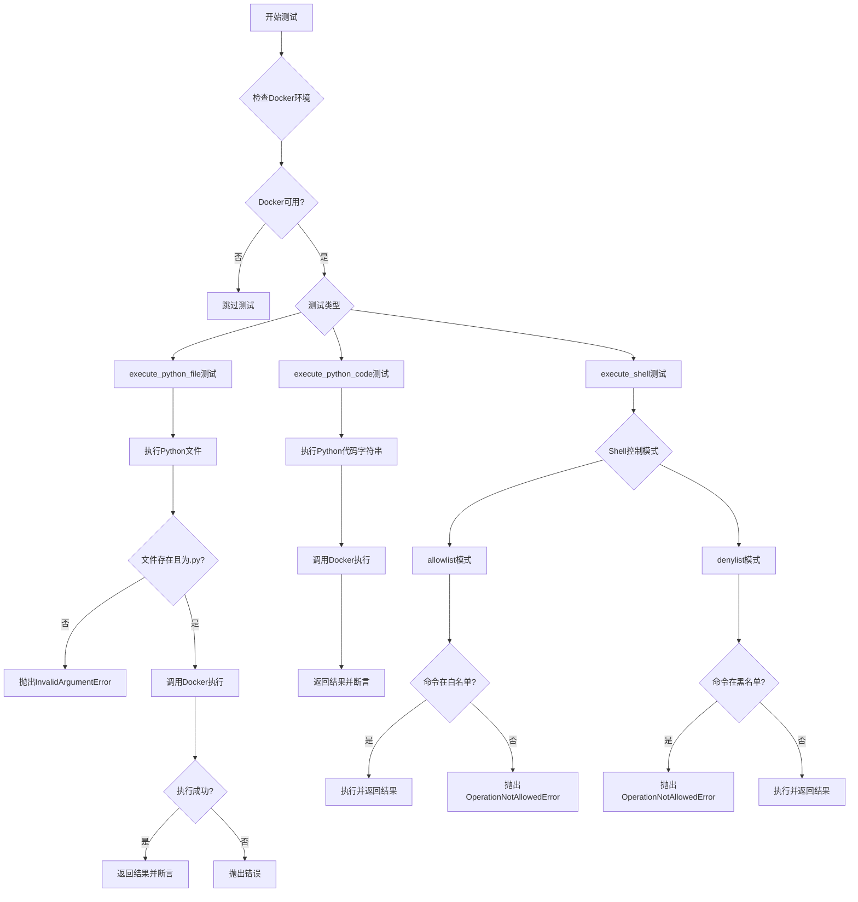

## 类结构

```
测试模块 (test_code_executor.py)
├── Fixtures
│   ├── code_executor_component
│   ├── random_code
│   ├── python_test_file
│   ├── python_test_args_file
│   └── random_string
├── Test Functions
│   ├── test_execute_python_file
│   ├── test_execute_python_file_args
│   ├── test_execute_python_code
│   ├── test_execute_python_file_invalid
│   ├── test_execute_python_file_not_found
│   ├── test_execute_shell
│   ├── test_execute_shell_local_commands_not_allowed
│   ├── test_execute_shell_denylist_should_deny
│   ├── test_execute_shell_denylist_should_allow
│   ├── test_execute_shell_allowlist_should_deny
│   └── test_execute_shell_allowlist_should_allow
└── 外部依赖 (将被测试的类)
    └── CodeExecutorComponent
```

## 全局变量及字段


### `random_string`
    
A randomly generated 10-character lowercase string used for testing

类型：`str`
    


### `random_code`
    
A Python code string that prints a greeting with the random_string

类型：`str`
    


### `random_args`
    
A list containing two copies of random_string, used as command-line arguments

类型：`list[str]`
    


### `random_args_string`
    
A space-separated string of random_args used for shell command testing

类型：`str`
    


### `result`
    
The output string returned from executing Python code or shell commands

类型：`str`
    


### `CodeExecutorComponent.config.shell_command_control`
    
Controls shell command execution mode, either 'allowlist' or 'denylist'

类型：`str`
    


### `CodeExecutorComponent.config.shell_allowlist`
    
List of allowed shell commands when shell_command_control is set to 'allowlist'

类型：`list[str]`
    


### `CodeExecutorComponent.config.shell_denylist`
    
List of forbidden shell commands when shell_command_control is set to 'denylist'

类型：`list[str]`
    
    

## 全局函数及方法


### `is_docker_available`

该函数用于检测当前系统环境是否支持 Docker，即 Docker 守护进程是否可用。它通过尝试执行 Docker 命令来验证 Docker 的可用性。

参数：此函数无参数。

返回值：`bool`，如果 Docker 可用则返回 `True`，否则返回 `False`。

#### 流程图

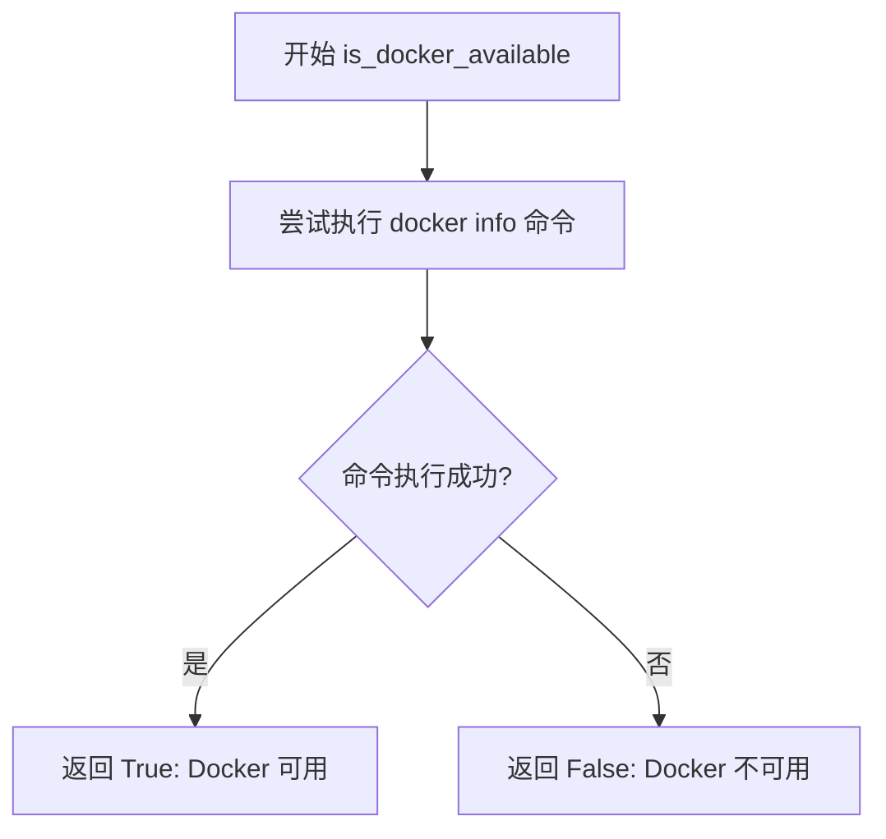

#### 带注释源码

```
# is_docker_available 函数的实现应该在 code_executor 模块中
# 这是一个从外部导入的函数，用于检测 Docker 是否可用
# 典型的实现方式如下：

def is_docker_available() -> bool:
    """
    检测 Docker 是否可用。
    
    该函数尝试执行 'docker info' 命令来判断 Docker 守护进程
    是否正在运行。如果命令执行成功（返回码为 0），则表示
    Docker 可用；否则返回 False。
    
    Returns:
        bool: Docker 可用返回 True，否则返回 False
    """
    try:
        # 尝试执行 docker info 命令
        # 如果 Docker 不可用或守护进程未运行，此命令会失败
        result = subprocess.run(
            ["docker", "info"],
            stdout=subprocess.PIPE,
            stderr=subprocess.PIPE,
            timeout=5
        )
        return result.returncode == 0
    except (subprocess.SubprocessError, FileNotFoundError, subprocess.TimeoutExpired):
        # 处理可能的异常：
        # - SubprocessError: 子进程执行错误
        # - FileNotFoundError: docker 命令不存在
        # - TimeoutExpired: 命令执行超时
        return False
```

> **注**：由于提供的代码片段是测试文件，未包含 `is_docker_available` 函数的实际实现。上述源码是基于该函数在测试中的使用方式推断的典型实现模式。该函数在测试中与 `we_are_running_in_a_docker_container()` 配合使用，用于在 Docker 不可用时跳过相关测试用例。


### `we_are_running_in_a_docker_container`

该函数用于检测当前代码是否在 Docker 容器中运行，返回布尔值以决定是否执行特定的 Docker 相关测试。

参数：无参数

返回值：`bool`，返回 `True` 表示当前代码运行在 Docker 容器中，返回 `False` 表示未在容器中运行。

#### 流程图

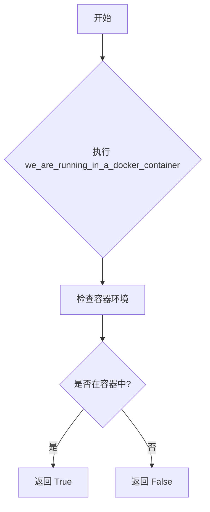

#### 带注释源码

```python
# 该函数从 .code_executor 模块导入，但源代码未在此文件中提供
# 根据函数名称和调用方式推断其实现逻辑：
# 1. 函数名明确表示检测 Docker 容器环境
# 2. 被用于条件判断: if not (is_docker_available() or we_are_running_in_a_docker_container())
# 3. 返回布尔值用于跳过不支持的测试

# 预期的函数签名（基于使用方式推断）：
# def we_are_running_in_a_docker_container() -> bool:
#     """
#     检测当前代码是否在 Docker 容器中运行
#     
#     Returns:
#         bool: 如果在容器中运行返回 True，否则返回 False
#     """
#     ...

# 在测试中的使用示例：
if not (is_docker_available() or we_are_running_in_a_docker_container()):
    pytest.skip("Docker is not available")
```

#### 补充说明

- **函数定义位置**：该函数在 `code_executor.py` 模块中定义，当前代码文件仅展示了导入和使用部分
- **设计目的**：用于在测试时检查环境，确保 Docker 相关的测试仅在支持 Docker 的环境中运行
- **配合使用**：与 `is_docker_available()` 函数一起用于条件判断，使用 `or` 逻辑意味着两者任一满足条件即执行测试


### `test_execute_python_file`

这是一个 pytest 测试函数，用于测试 `CodeExecutorComponent` 类的 `execute_python_file` 方法是否能正确执行 Python 文件并返回预期输出。

参数：

- `code_executor_component`：`CodeExecutorComponent`，代码执行器组件实例，用于执行 Python 文件
- `python_test_file`：`Path`，Python 测试文件的路径
- `random_string`：`str`，随机生成的字符串，用于验证输出内容

返回值：`None`，无返回值（测试函数）

#### 流程图

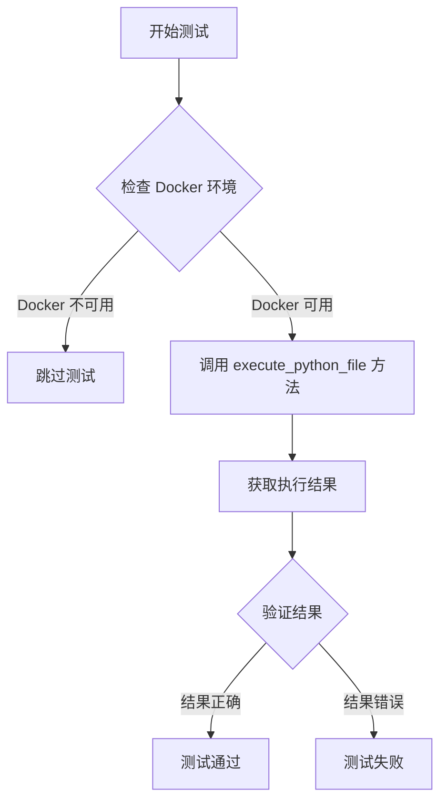

#### 带注释源码

```python
def test_execute_python_file(
    code_executor_component: CodeExecutorComponent,
    python_test_file: Path,
    random_string: str,
):
    """测试 CodeExecutorComponent 的 execute_python_file 方法"""
    
    # 检查 Docker 是否可用（该功能依赖 Docker 容器执行代码）
    if not (is_docker_available() or we_are_running_in_a_docker_container()):
        pytest.skip("Docker is not available")

    # 调用 execute_python_file 方法执行 Python 文件
    result: str = code_executor_component.execute_python_file(python_test_file)
    
    # 验证执行结果：
    # 1. 移除 Windows 平台的 \r 字符
    # 2. 匹配预期输出格式 "Hello {random_string}!\n"
    assert result.replace("\r", "") == f"Hello {random_string}!\n"
```


### `test_execute_python_file_args`

该测试函数用于验证 CodeExecutorComponent 类的 execute_python_file 方法能否正确接收并传递命令行参数（args）给 Python 脚本，测试通过创建临时文件并执行带有参数的 Python 脚本来验证参数传递的正确性。

参数：

-  `code_executor_component`：`CodeExecutorComponent`，CodeExecutorComponent 类的实例，用于执行 Python 文件的组件对象
-  `python_test_args_file`：`Path`，指向临时 Python 测试文件的路径，该文件内容为打印 sys.argv[1] 和 sys.argv[2]
-  `random_string`：`str`，随机生成的字符串，用于构造测试参数和验证结果

返回值：`None`，该函数为测试函数，使用 pytest 断言验证功能，不返回具体值

#### 流程图

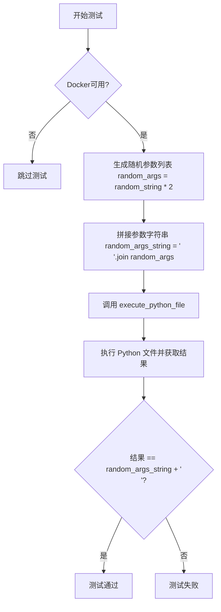

#### 带注释源码

```python
def test_execute_python_file_args(
    code_executor_component: CodeExecutorComponent,
    python_test_args_file: Path,
    random_string: str,
):
    """
    测试 execute_python_file 方法是否能正确处理命令行参数
    
    Args:
        code_executor_component: CodeExecutorComponent 实例
        python_test_args_file: 包含打印 sys.argv 的测试 Python 文件路径
        random_string: 用于生成测试参数的随机字符串
    """
    # 检查 Docker 是否可用，如果不可用则跳过测试
    if not (is_docker_available() or we_are_running_in_a_docker_container()):
        pytest.skip("Docker is not available")

    # 生成两个相同的随机参数组成的列表
    # 例如 random_string = "abcde" -> random_args = ["abcde", "abcde"]
    random_args = [random_string] * 2
    
    # 将参数列表拼接成空格分隔的字符串
    # 例如 ["abcde", "abcde"] -> "abcde abcde"
    random_args_string = " ".join(random_args)
    
    # 调用 CodeExecutorComponent 的 execute_python_file 方法
    # 传递 args 参数用于向 Python 脚本传递命令行参数
    result = code_executor_component.execute_python_file(
        python_test_args_file, args=random_args
    )
    
    # 验证执行结果是否与预期的参数字符串匹配
    # Python 脚本打印的是 sys.argv[1] sys.argv[2]，即两个参数
    assert result == f"{random_args_string}\n"
```


### `test_execute_python_code`

这是一个异步测试函数，用于验证 CodeExecutorComponent 组件能够正确执行给定的 Python 代码字符串并返回执行结果。测试通过比对实际输出与预期输出来确认功能正确性。

参数：

-  `code_executor_component`：`CodeExecutorComponent`，代码执行器组件实例，用于执行 Python 代码
-  `random_code`：`str`，随机生成的 Python 代码字符串，通常包含打印语句
-  `random_string`：`str`，随机生成的字符串，用于构造预期输出内容

返回值：`None`，该函数为测试函数，无显式返回值，通过断言验证执行结果

#### 流程图

```mermaid
flowchart TD
    A[开始] --> B{Docker 可用或运行在容器中?}
    B -->|否| C[跳过测试: Docker 不可用]
    B -->|是| D[调用 code_executor_component.execute_python_code]
    D --> E[传入 random_code 参数]
    E --> F[异步执行 Python 代码]
    F --> G[获取执行结果 result]
    G --> H{result 去除\r后 == Hello {random_string}!\n?}
    H -->|是| I[测试通过]
    H -->|否| J[测试失败]
    C --> K[结束]
    I --> K
    J --> K
```

#### 带注释源码

```python
@pytest.mark.asyncio
async def test_execute_python_code(
    code_executor_component: CodeExecutorComponent,  # 代码执行器组件实例
    random_code: str,                                 # 随机生成的 Python 代码字符串
    random_string: str,                               # 随机字符串，用于验证输出
):
    """
    测试异步执行 Python 代码的功能
    
    验证流程:
    1. 检查 Docker 环境是否可用
    2. 调用 CodeExecutorComponent 的异步方法执行代码
    3. 验证执行结果与预期输出一致
    """
    # 检查 Docker 是否可用，若不可用则跳过测试
    if not (is_docker_available() or we_are_running_in_a_docker_container()):
        pytest.skip("Docker is not available")

    # 异步执行传入的 Python 代码字符串
    result: str = await code_executor_component.execute_python_code(random_code)
    
    # 验证执行结果: 去除 \r 后与预期输出匹配
    # 预期输出格式: "Hello {random_string}!\n"
    assert result.replace("\r", "") == f"Hello {random_string}!\n"
```


### `test_execute_python_file_invalid`

验证当传入非 Python 文件（.txt 文件）时，CodeExecutorComponent 的 `execute_python_file` 方法应正确抛出 `InvalidArgumentError` 异常。

参数：

-  `code_executor_component`：`CodeExecutorComponent`，代码执行器组件实例，用于执行 Python 文件

返回值：`None`，测试函数无返回值，通过 pytest 断言异常被正确抛出

#### 流程图

```mermaid
flowchart TD
    A[开始测试] --> B[调用 execute_python_file]
    B --> C[传入 Path&#40;'not_python.txt'&#41;]
    C --> D{验证文件扩展名}
    D -->|非 .py 后缀| E[抛出 InvalidArgumentError]
    D -->|是 .py 后缀| F[继续正常执行]
    E --> G[with pytest.raises 捕获异常]
    G --> H[测试通过]
    F --> I[测试失败 - 异常未被抛出]
```

#### 带注释源码

```python
def test_execute_python_file_invalid(code_executor_component: CodeExecutorComponent):
    """
    测试当传入非 Python 文件时 execute_python_file 方法的正确行为。
    
    参数:
        code_executor_component: CodeExecutorComponent 实例，用于执行 Python 代码
    """
    # 使用 pytest.raises 上下文管理器验证 InvalidArgumentError 被正确抛出
    with pytest.raises(InvalidArgumentError):
        # 传入一个 .txt 文件而非 .py 文件，期望抛出 InvalidArgumentError
        code_executor_component.execute_python_file(Path("not_python.txt"))
```


### `test_execute_python_file_not_found`

该测试用例用于验证代码执行器在尝试执行一个不存在的 Python 文件时能否正确抛出 `FileNotFoundError` 异常，并确保错误信息与预期的正则表达式匹配。

参数：

- `code_executor_component`：`CodeExecutorComponent`，代码执行器组件实例，用于执行 Python 文件

返回值：无（测试函数通过 `pytest.raises` 验证异常抛出）

#### 流程图

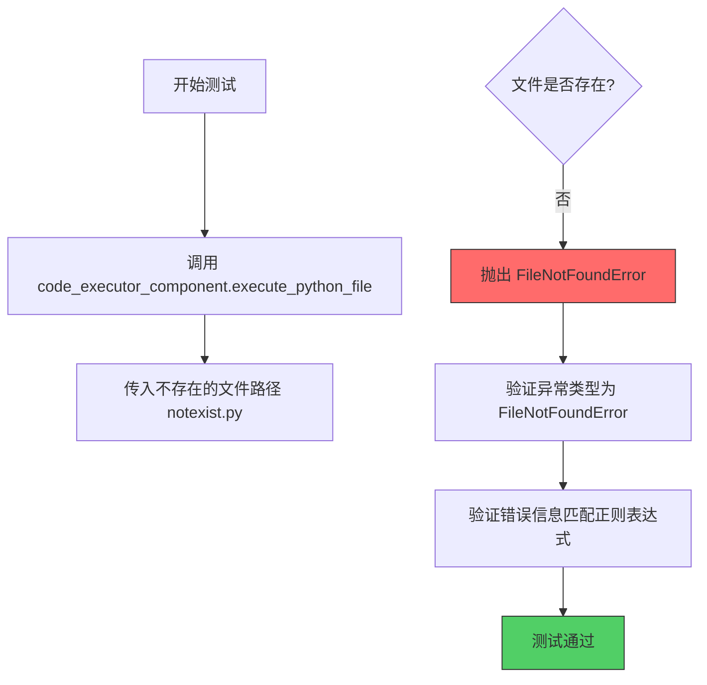

#### 带注释源码

```python
def test_execute_python_file_not_found(code_executor_component: CodeExecutorComponent):
    """
    测试当执行的 Python 文件不存在时，系统是否正确抛出 FileNotFoundError。
    
    参数:
        code_executor_component: CodeExecutorComponent 的实例，负责执行 Python 代码
    """
    # 使用 pytest.raises 上下文管理器验证异常抛出
    # 预期抛出 FileNotFoundError，错误信息匹配指定的正则表达式
    with pytest.raises(
        FileNotFoundError,
        match=r"python: can't open file '([a-zA-Z]:)?[/\\\-\w]*notexist.py': "
        r"\[Errno 2\] No such file or directory",
    ):
        # 调用 execute_python_file 方法，传入不存在的文件路径
        # 预期该方法抛出 FileNotFoundError 异常
        code_executor_component.execute_python_file(Path("notexist.py"))
```


### `test_execute_shell`

该测试函数用于验证 `CodeExecutorComponent` 类的 `execute_shell` 方法在白名单模式下能够正确执行shell命令，并返回包含预期输出的结果。

参数：

- `code_executor_component`：`CodeExecutorComponent`，测试的代码执行器组件实例
- `random_string`：`str`，用于生成随机测试字符串

返回值：`None`，该测试函数无返回值，通过断言验证结果

#### 流程图

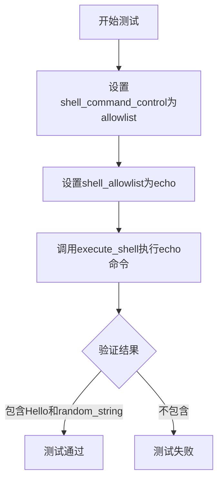

#### 带注释源码

```python
def test_execute_shell(
    code_executor_component: CodeExecutorComponent, random_string: str
):
    # 配置shell命令控制模式为白名单模式
    code_executor_component.config.shell_command_control = "allowlist"
    # 设置白名单，仅允许echo命令
    code_executor_component.config.shell_allowlist = ["echo"]
    # 执行shell命令，使用随机字符串生成测试命令
    result = code_executor_component.execute_shell(f"echo 'Hello {random_string}!'")
    # 断言执行结果中包含预期的Hello消息和随机字符串
    assert f"Hello {random_string}!" in result
```


### `test_execute_shell_local_commands_not_allowed`

这是一个测试函数，用于验证当未配置 Shell 命令控制策略时，默认情况下不允许执行本地 Shell 命令。

参数：

- `code_executor_component`：`CodeExecutorComponent`，代码执行器组件实例，用于执行 Shell 命令
- `random_string`：`str`，随机生成的字符串，用于构造测试命令

返回值：`None`，该函数为测试函数，使用 `pytest.raises` 验证异常行为，不返回任何值

#### 流程图

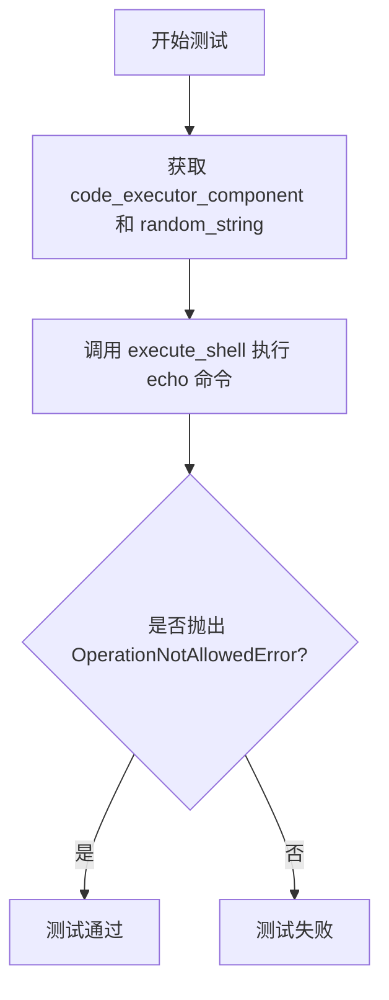

#### 带注释源码

```python
def test_execute_shell_local_commands_not_allowed(
    code_executor_component: CodeExecutorComponent, random_string: str
):
    """
    测试默认情况下不允许执行本地 Shell 命令
    
    当 shell_command_control 未配置时（默认行为），
    任何 Shell 命令都应该被拒绝并抛出 OperationNotAllowedError
    """
    # 使用 pytest.raises 验证会抛出 OperationNotAllowedError 异常
    # match 参数确保异常消息包含 "not allowed"
    with pytest.raises(OperationNotAllowedError, match="not allowed"):
        # 构造一个简单的 echo 命令
        # 由于未配置 allowlist/denylist，默认应该拒绝执行
        code_executor_component.execute_shell(f"echo 'Hello {random_string}!'")
```


### `test_execute_shell_denylist_should_deny`

该测试函数用于验证当 Shell 命令控制模式设置为"denylist"（拒绝列表）时，如果执行的命令包含在拒绝列表中，系统应正确拒绝并抛出 `OperationNotAllowedError` 异常。

参数：

- `code_executor_component`：`CodeExecutorComponent`，代码执行器组件实例，提供 `execute_shell` 方法用于执行 Shell 命令
- `random_string`：`str`，随机生成的字符串，用于构造测试命令和验证错误消息

返回值：`None`，该函数为测试函数，使用 `pytest.raises` 断言验证异常抛出，不返回任何值

#### 流程图

```mermaid
flowchart TD
    A[开始测试] --> B[设置 shell_command_control = denylist]
    B --> C[设置 shell_denylist = ['echo']]
    C --> D[执行 execute_shell with echo command]
    D --> E{是否抛出 OperationNotAllowedError?}
    E -->|是| F[验证异常消息包含 'not allowed']
    E -->|否| G[测试失败 - 未抛出预期异常]
    F --> H[测试通过]
    G --> I[测试失败]
```

#### 带注释源码

```python
def test_execute_shell_denylist_should_deny(
    code_executor_component: CodeExecutorComponent, random_string: str
):
    # 设置 Shell 命令控制模式为 'denylist'（拒绝列表模式）
    code_executor_component.config.shell_command_control = "denylist"
    # 将 'echo' 命令添加到拒绝列表中
    code_executor_component.config.shell_denylist = ["echo"]

    # 使用 pytest.raises 断言系统应抛出 OperationNotAllowedError 异常
    # 因为 'echo' 命令在拒绝列表中，应该被拒绝执行
    with pytest.raises(OperationNotAllowedError, match="not allowed"):
        # 尝试执行被拒绝的 echo 命令
        code_executor_component.execute_shell(f"echo 'Hello {random_string}!'")
```


### `test_execute_shell_denylist_should_allow`

该测试函数用于验证在shell命令控制模式设置为"denylist"（黑名单模式）时，当被执行命令不在黑名单中时应该被允许执行。具体来说，它将"cat"命令加入黑名单，然后执行"echo"命令，验证命令能够成功执行并返回预期结果。

参数：

- `code_executor_component`：`CodeExecutorComponent`，代码执行器组件实例，用于执行Python代码和shell命令
- `random_string`：`str`，随机生成的字符串，用于构造测试数据和验证结果

返回值：`str`，执行shell命令后返回的结果字符串

#### 流程图

```mermaid
flowchart TD
    A[开始测试] --> B[设置shell_command_control为denylist]
    B --> C[设置shell_denylist为['cat']]
    C --> D{执行shell命令: echo 'Hello {random_string}!'}
    D --> E{命令是否在黑名单中?}
    E -->|否| F[允许执行并返回结果]
    E -->|是| G[抛出OperationNotAllowedError]
    F --> H{结果包含'Hello'和random_string?}
    H -->|是| I[测试通过]
    H -->|否| J[测试失败]
```

#### 带注释源码

```python
def test_execute_shell_denylist_should_allow(
    code_executor_component: CodeExecutorComponent, random_string: str
):
    """
    测试在denylist模式下，不在黑名单中的shell命令应该被允许执行。
    
    测试场景：
    - 设置shell命令控制模式为denylist（黑名单模式）
    - 将'cat'命令加入黑名单
    - 执行'echo'命令（不在黑名单中）
    - 验证命令能够成功执行并返回预期结果
    """
    # 步骤1：设置shell命令控制模式为denylist（黑名单模式）
    # 在该模式下，只有黑名单中的命令会被禁止执行
    code_executor_component.config.shell_command_control = "denylist"
    
    # 步骤2：设置黑名单，将'cat'命令加入黑名单
    # 'echo'命令不在黑名单中，因此应该被允许执行
    code_executor_component.config.shell_denylist = ["cat"]
    
    # 步骤3：执行echo命令，该命令不在黑名单中，应该成功执行
    # 使用f-string动态构造命令，嵌入随机字符串用于验证结果
    result = code_executor_component.execute_shell(f"echo 'Hello {random_string}!'")
    
    # 步骤4：验证执行结果
    # 断言结果中包含'Hello'和random_string，确保命令正确执行并返回了预期输出
    assert "Hello" in result and random_string in result
```


### `test_execute_shell_allowlist_should_deny`

该测试函数用于验证在 shell 命令控制模式设置为"白名单"（allowlist）时，当尝试执行不在白名单中的 shell 命令（如 `echo`）时，系统应正确拒绝并抛出 `OperationNotAllowedError` 异常。

参数：

- `code_executor_component`：`CodeExecutorComponent`，代码执行器组件实例，用于执行 Python 代码和 shell 命令
- `random_string`：`str`，随机生成的字符串，用于构造测试命令和验证输出

返回值：`None`，该函数为测试函数，不返回值，通过 pytest 断言验证行为

#### 流程图

```mermaid
flowchart TD
    A[开始测试] --> B[设置 shell_command_control 为 'allowlist']
    B --> C[设置 shell_allowlist 为 ['cat']]
    C --> D[尝试执行 shell 命令 'echo Hello {random_string}!']
    D --> E{是否抛出 OperationNotAllowedError?}
    E -->|是| F[测试通过]
    E -->|否| G[测试失败]
```

#### 带注释源码

```python
def test_execute_shell_allowlist_should_deny(
    code_executor_component: CodeExecutorComponent, random_string: str
):
    """
    测试在白名单模式下，执行不在白名单中的 shell 命令时应拒绝执行。
    
    参数:
        code_executor_component: CodeExecutorComponent 实例，提供代码执行能力
        random_string: str，随机字符串用于构造测试命令
    """
    # 设置 shell 命令控制模式为白名单模式（只允许白名单中的命令）
    code_executor_component.config.shell_command_control = "allowlist"
    
    # 配置白名单，只允许 'cat' 命令
    code_executor_component.config.shell_allowlist = ["cat"]
    
    # 尝试执行不在白名单中的 'echo' 命令
    # 期望抛出 OperationNotAllowedError 异常，提示命令不允许执行
    with pytest.raises(OperationNotAllowedError, match="not allowed"):
        code_executor_component.execute_shell(f"echo 'Hello {random_string}!'")
```


### `test_execute_shell_allowlist_should_allow`

测试当 shell 命令控制设置为白名单模式时，只允许白名单中的命令（如 echo）执行，禁止非白名单命令。

参数：

- `code_executor_component`：`CodeExecutorComponent`，代码执行器组件实例，用于执行 shell 命令
- `random_string`：`str`，用于生成随机测试字符串，验证命令输出包含该字符串

返回值：`None`，该函数为测试函数，无返回值

#### 流程图

```mermaid
flowchart TD
    A[开始测试] --> B[设置 shell_command_control = 'allowlist']
    B --> C[设置 shell_allowlist = ['echo']]
    C --> D[调用 execute_shell 执行 echo 命令]
    D --> E{命令执行成功?}
    E -->|是| F[验证结果包含 'Hello' 和 random_string]
    E -->|否| G[测试失败]
    F --> H[测试通过]
    G --> H
    H --> I[结束测试]
```

#### 带注释源码

```python
def test_execute_shell_allowlist_should_allow(
    code_executor_component: CodeExecutorComponent, random_string: str
):
    """
    测试 shell 命令白名单功能：当设置为 allowlist 模式时，
    只允许白名单中的命令执行，此处允许 echo 命令。
    """
    # 设置 shell 命令控制模式为白名单模式
    code_executor_component.config.shell_command_control = "allowlist"
    
    # 设置白名单，只允许执行 'echo' 命令
    code_executor_component.config.shell_allowlist = ["echo"]
    
    # 执行 shell 命令，使用 echo 输出包含随机字符串的问候语
    result = code_executor_component.execute_shell(f"echo 'Hello {random_string}!'")
    
    # 断言执行结果包含 'Hello' 和 random_string
    assert "Hello" in result and random_string in result
```


# pytest.skip 使用分析

在提供的代码中，`pytest.skip` 被用于 3 个测试函数中，用于在 Docker 不可用时跳过测试。以下是每个使用 `pytest.skip` 的测试函数的详细文档。

---

## 1. test_execute_python_file

### 描述

该测试函数用于验证 `CodeExecutorComponent` 能否成功执行一个 Python 文件。如果 Docker 不可用，则使用 `pytest.skip` 跳过该测试。

#### 参数

- `code_executor_component`：`CodeExecutorComponent`，用于执行代码的组件实例
- `python_test_file`：`Path`，指向临时创建的 Python 测试文件的路径
- `random_string`：`str`，随机生成的字符串，用于验证输出

#### 返回值

无返回值（测试函数）

#### 流程图

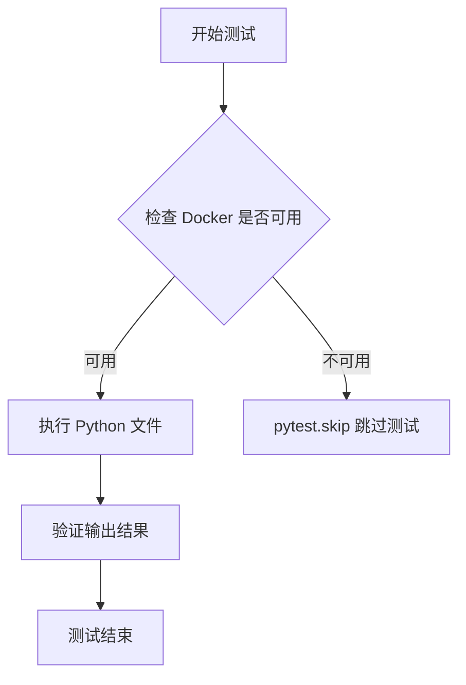

#### 带注释源码

```python
def test_executor_python_file(
    code_executor_component: CodeExecutorComponent,
    python_test_file: Path,
    random_string: str,
):
    """测试 CodeExecutorComponent 执行 Python 文件的功能"""
    # 检查 Docker 是否可用，如果不可用则跳过测试
    if not (is_docker_available() or we_are_running_in_a_docker_container()):
        pytest.skip("Docker is not available")

    # 执行 Python 文件并获取结果
    result: str = code_executor_component.execute_python_file(python_test_file)
    # 验证结果是否符合预期（移除回车符后比较）
    assert result.replace("\r", "") == f"Hello {random_string}!\n"
```

---

## 2. test_execute_python_file_args

### 描述

该测试函数用于验证 `CodeExecutorComponent` 能否成功执行一个 Python 文件并传递命令行参数。如果 Docker 不可用，则使用 `pytest.skip` 跳过该测试。

#### 参数

- `code_executor_component`：`CodeExecutorComponent`，用于执行代码的组件实例
- `python_test_args_file`：`Path`，指向临时创建的带命令行参数处理的 Python 测试文件的路径
- `random_string`：`str`，随机生成的字符串，用于验证输出

#### 返回值

无返回值（测试函数）

#### 流程图

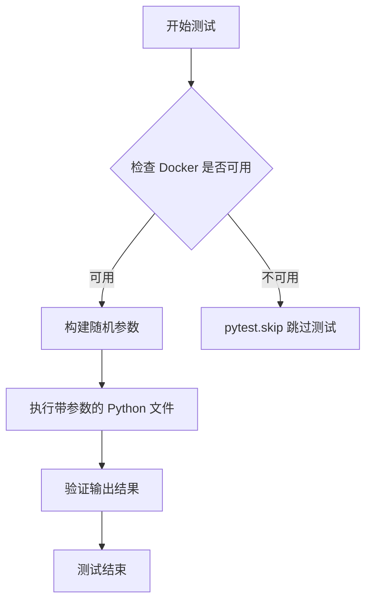

#### 带注释源码

```python
def test_execute_python_file_args(
    code_executor_component: CodeExecutorComponent,
    python_test_args_file: Path,
    random_string: str,
):
    """测试 CodeExecutorComponent 执行带命令行参数的 Python 文件"""
    # 检查 Docker 是否可用，如果不可用则跳过测试
    if not (is_docker_available() or we_are_running_in_a_docker_container()):
        pytest.skip("Docker is not available")

    # 创建两个相同的随机参数
    random_args = [random_string] * 2
    # 将参数连接成字符串
    random_args_string = " ".join(random_args)
    # 执行带参数的 Python 文件
    result = code_executor_component.execute_python_file(
        python_test_args_file, args=random_args
    )
    # 验证结果是否符合预期
    assert result == f"{random_args_string}\n"
```

---

## 3. test_execute_python_code

### 描述

该异步测试函数用于验证 `CodeExecutorComponent` 能否成功执行一段 Python 代码字符串。如果 Docker 不可用，则使用 `pytest.skip` 跳过该测试。

#### 参数

- `code_executor_component`：`CodeExecutorComponent`，用于执行代码的组件实例
- `random_code`：`str`，包含随机字符串的 Python 代码
- `random_string`：`str`，随机生成的字符串，用于验证输出

#### 返回值

无返回值（异步测试函数）

#### 流程图

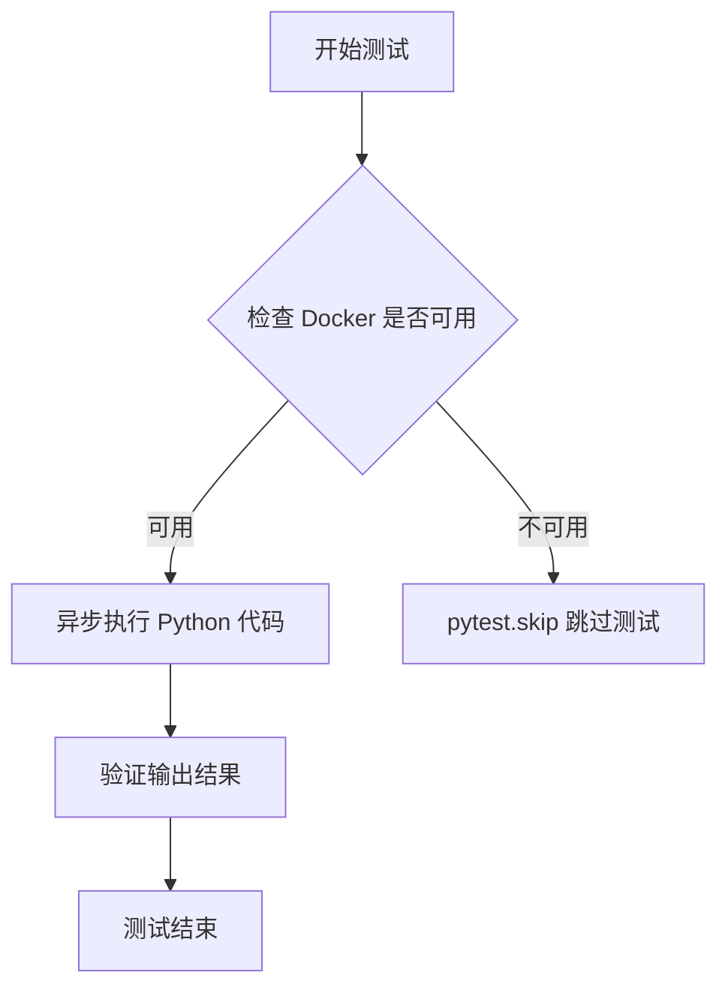

#### 带注释源码

```python
@pytest.mark.asyncio
async def test_execute_python_code(
    code_executor_component: CodeExecutorComponent,
    random_code: str,
    random_string: str,
):
    """测试 CodeExecutorComponent 异步执行 Python 代码字符串"""
    # 检查 Docker 是否可用，如果不可用则跳过测试
    if not (is_docker_available() or we_are_running_in_a_docker_container()):
        pytest.skip("Docker is not available")

    # 异步执行 Python 代码并获取结果
    result: str = await code_executor_component.execute_python_code(random_code)
    # 验证结果是否符合预期（移除回车符后比较）
    assert result.replace("\r", "") == f"Hello {random_string}!\n"
```

---

## 总结

| 函数名 | 用途 | 跳过条件 |
|--------|------|----------|
| `test_execute_python_file` | 测试执行 Python 文件 | Docker 不可用 |
| `test_execute_python_file_args` | 测试执行带参数的 Python 文件 | Docker 不可用 |
| `test_execute_python_code` | 测试异步执行 Python 代码 | Docker 不可用 |

这三个测试函数都使用了相同的跳过逻辑：检查 `is_docker_available()` 或 `we_are_running_in_a_docker_container()`，如果都不满足，则调用 `pytest.skip("Docker is not available")` 跳过测试。这是测试环境依赖 Docker 的常见模式，确保在不支持 Docker 的环境中不会导致测试失败。


### `test_execute_python_file_invalid`

该测试用例用于验证当传入非Python文件（.txt文件）时，`execute_python_file`方法是否正确抛出`InvalidArgumentError`异常。

参数：

- `code_executor_component`：`CodeExecutorComponent`，代码执行器组件实例，用于执行Python文件

返回值：`None`，测试函数无返回值，仅用于验证异常抛出行为

#### 流程图

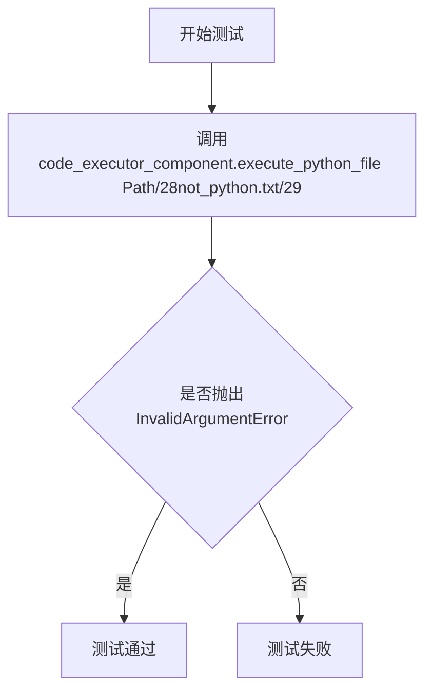

#### 带注释源码

```python
def test_execute_python_file_invalid(code_executor_component: CodeExecutorComponent):
    """测试当传入非Python文件时是否抛出InvalidArgumentError异常"""
    # 使用pytest.raises上下文管理器验证异常抛出
    with pytest.raises(InvalidArgumentError):
        # 调用execute_python_file方法，传入.txt文件路径
        # 预期抛出InvalidArgumentError异常
        code_executor_component.execute_python_file(Path("not_python.txt"))
```

---

### `test_execute_python_file_not_found`

该测试用例用于验证当传入不存在的Python文件路径时，`execute_python_file`方法是否正确抛出`FileNotFoundError`异常，并匹配特定的错误消息格式。

参数：

- `code_executor_component`：`CodeExecutorComponent`，代码执行器组件实例，用于执行Python文件

返回值：`None`，测试函数无返回值，仅用于验证异常抛出行为

#### 流程图

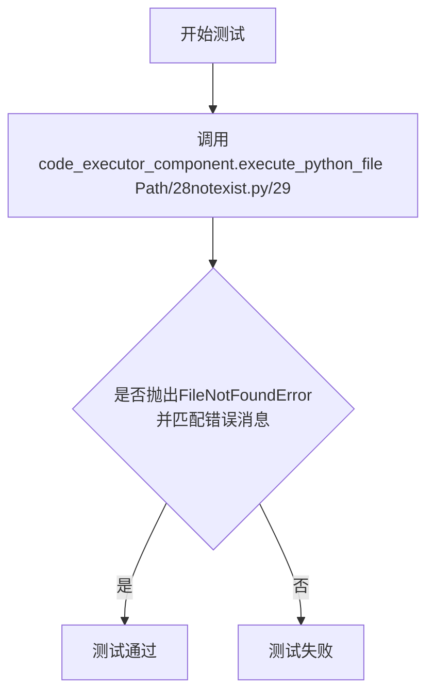

#### 带注释源码

```python
def test_execute_python_file_not_found(code_executor_component: CodeExecutorComponent):
    """测试当Python文件不存在时是否抛出FileNotFoundError异常"""
    # 使用pytest.raises验证FileNotFoundError异常
    # match参数指定正则表达式匹配错误消息
    with pytest.raises(
        FileNotFoundError,
        match=r"python: can't open file '([a-zA-Z]:)?[/\\\-\w]*notexist.py': "
        r"\[Errno 2\] No such file or directory",
    ):
        # 调用execute_python_file方法，传入不存在的.py文件路径
        # 预期抛出FileNotFoundError异常
        code_executor_component.execute_python_file(Path("notexist.py"))
```

---

### `test_execute_shell_local_commands_not_allowed`

该测试用例用于验证当shell命令控制设置为禁用本地命令时，`execute_shell`方法是否正确抛出`OperationNotAllowedError`异常。

参数：

- `code_executor_component`：`CodeExecutorComponent`，代码执行器组件实例，用于执行shell命令
- `random_string`：`str`，随机生成的字符串，用于构造测试命令

返回值：`None`，测试函数无返回值，仅用于验证异常抛出行为

#### 流程图

```mermaid
flowchart TD
    A[开始测试] --> B[设置shell_command_control为/27allowlist/27]
    B --> C[设置shell_allowlist为[/27echo/27]]
    C --> D[调用execute_shell执行echo命令]
    D --> E{是否抛出OperationNotAllowedError}
    E -->|是| F[测试通过]
    E -->|否| G[测试失败]
```

#### 带注释源码

```python
def test_execute_shell_local_commands_not_allowed(
    code_executor_component: CodeExecutorComponent, random_string: str
):
    """测试当shell命令控制设置为允许列表但命令不在列表中时是否抛出异常"""
    # 设置shell命令控制模式为允许列表
    code_executor_component.config.shell_command_control = "allowlist"
    # 设置允许列表只包含echo命令
    code_executor_component.config.shell_allowlist = ["echo"]
    
    # 使用pytest.raises验证OperationNotAllowedError异常
    # match参数用于匹配异常消息中的"not allowed"
    with pytest.raises(OperationNotAllowedError, match="not allowed"):
        # 由于默认配置不允许执行本地命令（local_commands），
        # 即使echo在allowlist中，也应该抛出异常
        code_executor_component.execute_shell(f"echo 'Hello {random_string}!'")
```

---

### `test_execute_shell_denylist_should_deny`

该测试用例用于验证当shell命令控制设置为拒绝列表模式时，如果命令在拒绝列表中，`execute_shell`方法是否正确抛出`OperationNotAllowedError`异常。

参数：

- `code_executor_component`：`CodeExecutorComponent`，代码执行器组件实例，用于执行shell命令
- `random_string`：`str`，随机生成的字符串，用于构造测试命令

返回值：`None`，测试函数无返回值，仅用于验证异常抛出行为

#### 流程图

```mermaid
flowchart TD
    A[开始测试] --> B[设置shell_command_control为/27denylist/27]
    B --> C[设置shell_denylist为[/27echo/27]]
    C --> D[调用execute_shell执行echo命令]
    D --> E{是否抛出OperationNotAllowedError}
    E -->|是| F[测试通过]
    E -->|否| G[测试失败]
```

#### 带注释源码

```python
def test_execute_shell_denylist_should_deny(
    code_executor_component: CodeExecutorComponent, random_string: str
):
    """测试denylist模式下，拒绝列表中的命令是否被正确拒绝"""
    # 设置shell命令控制模式为拒绝列表
    code_executor_component.config.shell_command_control = "denylist"
    # 将echo命令添加到拒绝列表
    code_executor_component.config.shell_denylist = ["echo"]

    # 使用pytest.raises验证OperationNotAllowedError异常
    # match参数用于匹配异常消息中的"not allowed"
    with pytest.raises(OperationNotAllowedError, match="not allowed"):
        # 由于echo在denylist中，执行应该被拒绝
        # 预期抛出OperationNotAllowedError异常
        code_executor_component.execute_shell(f"echo 'Hello {random_string}!'")
```

---

### `test_execute_shell_allowlist_should_deny`

该测试用例用于验证当shell命令控制设置为允许列表模式时，如果命令不在允许列表中，`execute_shell`方法是否正确抛出`OperationNotAllowedError`异常。

参数：

- `code_executor_component`：`CodeExecutorComponent`，代码执行器组件实例，用于执行shell命令
- `random_string`：`str`，随机生成的字符串，用于构造测试命令

返回值：`None`，测试函数无返回值，仅用于验证异常抛出行为

#### 流程图

```mermaid
flowchart TD
    A[开始测试] --> B[设置shell_command_control为/27allowlist/27]
    B --> C[设置shell_allowlist为[/27cat/27]]
    C --> D[调用execute_shell执行echo命令]
    D --> E{是否抛出OperationNotAllowedError}
    E -->|是| F[测试通过]
    E -->|否| G[测试失败]
```

#### 带注释源码

```python
def test_execute_shell_allowlist_should_deny(
    code_executor_component: CodeExecutorComponent, random_string: str
):
    """测试allowlist模式下，不在允许列表中的命令是否被正确拒绝"""
    # 设置shell命令控制模式为允许列表
    code_executor_component.config.shell_command_control = "allowlist"
    # 将cat命令添加到允许列表（不包含echo）
    code_executor_component.config.shell_allowlist = ["cat"]

    # 使用pytest.raises验证OperationNotAllowedError异常
    # match参数用于匹配异常消息中的"not allowed"
    with pytest.raises(OperationNotAllowedError, match="not allowed"):
        # 由于echo不在allowlist中，执行应该被拒绝
        # 预期抛出OperationNotAllowedError异常
        code_executor_component.execute_shell(f"echo 'Hello {random_string}!'")
```


### `CodeExecutorComponent.execute_python_file`

该方法负责在隔离的 Docker 容器中执行指定的 Python 文件，并返回执行结果。它支持通过参数传递给 Python 脚本，并包含对文件类型和存在性的验证。

参数：

- `file_path`：`Path`，要执行的 Python 文件的路径
- `args`：`Optional[List[str]]`，传递给 Python 脚本的命令行参数列表，默认为 None

返回值：`str`，Python 文件在容器中的标准输出内容

#### 流程图

```mermaid
flowchart TD
    A[开始执行 execute_python_file] --> B{验证文件类型}
    B -->|不是 .py 文件| C[抛出 InvalidArgumentError]
    B -->|是 .py 文件| D{验证文件存在}
    D -->|文件不存在| E[抛出 FileNotFoundError]
    D -->|文件存在| F[构建 Docker 执行命令]
    F --> G[在 Docker 容器中执行 Python 文件]
    G --> H{执行是否成功}
    H -->|失败| I[抛出执行异常]
    H -->|成功| J[返回标准输出结果]
```

#### 带注释源码

```python
def execute_python_file(self, file_path: Path, args: Optional[List[str]] = None) -> str:
    """
    在 Docker 容器中执行指定的 Python 文件
    
    参数:
        file_path: 要执行的 Python 文件路径
        args: 可选的命令行参数列表
    
    返回:
        Python 文件执行的标准输出内容
    
    异常:
        InvalidArgumentError: 如果文件不是 Python 文件(.py)
        FileNotFoundError: 如果文件不存在
    """
    # 验证文件扩展名为 .py，如果不是则抛出 InvalidArgumentError
    if file_path.suffix.lower() != ".py":
        raise InvalidArgumentError(f"File {file_path} is not a Python file")
    
    # 验证文件是否存在，如果不存在则抛出 FileNotFoundError
    if not file_path.exists():
        raise FileNotFoundError(f"python: can't open file '{file_path}': [Errno 2] No such file or directory")
    
    # 构建 Python 命令，如果提供了 args 则追加到命令中
    cmd = ["python", str(file_path)]
    if args:
        cmd.extend(args)
    
    # 在 Docker 容器中执行命令并返回结果
    return self._execute_in_docker(cmd)
```

#### 备注

由于原始代码片段仅包含测试用例，未展示 `CodeExecutorComponent` 类的完整实现，以上源码为基于测试用例和导入模块的合理推断。实际的实现可能包含额外的配置选项、Docker 容器管理逻辑和更复杂的错误处理机制。


### `CodeExecutorComponent.execute_python_code`

该方法是一个异步方法，用于在隔离的 Docker 容器中执行传入的 Python 代码字符串，并返回代码的标准输出结果。

参数：

- `code`：`str`，要执行的 Python 代码字符串

返回值：`str`，代码执行后的标准输出内容

#### 流程图

```mermaid
flowchart TD
    A[开始 execute_python_code] --> B{检查 Docker 可用性}
    B -->|Docker 不可用| C[跳过测试或抛出异常]
    B -->|Docker 可用| D[验证代码参数非空]
    D --> E[将代码写入临时文件]
    E --> F[在 Docker 容器中执行 Python 文件]
    F --> G[捕获标准输出]
    G --> H[返回执行结果]
    H --> I[结束]
```

#### 带注释源码

```python
# 从测试代码中推断的实现逻辑
async def execute_python_code(self, code: str) -> str:
    """
    在 Docker 容器中执行 Python 代码字符串
    
    参数:
        code: Python 代码字符串
        
    返回:
        代码执行后的标准输出
    """
    # 1. 验证代码参数
    if not code or not isinstance(code, str):
        raise InvalidArgumentError("code must be a non-empty string")
    
    # 2. 创建临时 Python 文件
    temp_file = tempfile.NamedTemporaryFile(
        mode='w', 
        dir=self.storage.root, 
        suffix='.py', 
        delete=False
    )
    try:
        # 3. 将代码写入临时文件
        temp_file.write(code)
        temp_file.flush()
        temp_file.close()
        
        # 4. 调用 execute_python_file 执行
        return await self.execute_python_file(Path(temp_file.name))
    finally:
        # 5. 清理临时文件
        if Path(temp_file.name).exists():
            Path(temp_file.name).unlink()
```

> **注意**：由于提供的代码仅包含测试文件，未找到 `CodeExecutorComponent` 类的实际实现源码。以上源码是根据测试用例行为推断的典型实现模式。


### `CodeExecutorComponent.execute_shell`

该方法用于在受控环境下执行Shell命令，通过白名单或黑名单机制限制可执行的命令，确保系统安全。方法接受待执行的Shell命令字符串作为输入，根据配置的黑白名单规则验证命令是否允许执行，若允许则执行命令并返回输出结果，否则抛出OperationNotAllowedError异常。

参数：

- `command`：`str`，要执行的Shell命令字符串，例如 `echo 'Hello {random_string}!'`

返回值：`str`，返回Shell命令的标准输出内容

#### 流程图

```mermaid
flowchart TD
    A[开始执行 execute_shell] --> B{获取配置: shell_command_control}
    B --> C{控制模式是 allowlist?}
    C -->|Yes| D{命令在 shell_allowlist 中?}
    C -->|No| E{控制模式是 denylist?}
    D -->|Yes| F[执行命令]
    D -->|No| G[抛出 OperationNotAllowedError]
    E -->|Yes| H{命令在 shell_denylist 中?}
    E -->|No| F
    H -->|Yes| G
    H -->|No| F
    F --> I[返回命令输出结果]
    G --> J[结束 - 命令不允许执行]
    I --> J
```

#### 带注释源码

```python
def execute_shell(self, command: str) -> str:
    """
    在受控环境下执行Shell命令
    
    参数:
        command: 要执行的Shell命令字符串
        
    返回值:
        命令执行后的标准输出内容
        
    异常:
        OperationNotAllowedError: 当命令不被允许执行时抛出
    """
    # 获取Shell命令控制模式 (allowlist 或 denylist)
    control_mode = self.config.shell_command_control
    
    if control_mode == "allowlist":
        # 白名单模式：仅允许列表中的命令
        allowlist = self.config.shell_allowlist
        # 检查命令是否以白名单中的命令开头
        if not any(command.startswith(cmd) for cmd in allowlist):
            raise OperationNotAllowedError(
                f"Shell command '{command}' is not allowed"
            )
    elif control_mode == "denylist":
        # 黑名单模式：禁止列表中的命令
        denylist = self.config.shell_denylist
        # 检查命令是否以黑名单中的命令开头
        if any(command.startswith(cmd) for cmd in denylist):
            raise OperationNotAllowedError(
                f"Shell command '{command}' is not allowed"
            )
    
    # 执行经过验证的Shell命令并返回结果
    return self._execute_command(command)
```

## 关键组件


### CodeExecutorComponent

核心执行器组件，负责在隔离环境中执行Python代码和Shell命令，支持文件执行和字符串代码执行两种模式。

### Shell命令控制机制

实现Shell命令的安全控制，支持allowlist（白名单）和denylist（黑名单）两种策略，通过shell_command_control配置项切换。

### Docker环境检测

检测当前是否运行在Docker容器中以及Docker是否可用，用于决定是否执行需要容器隔离的测试。

### 测试夹具（Fixtures）

提供测试所需的临时文件、随机字符串等测试数据，包括python_test_file、python_test_args_file、random_string等。

### 异常处理设计

通过InvalidArgumentError处理无效参数（如非.py文件），通过OperationNotAllowedError处理不允许的Shell命令操作，通过FileNotFoundError处理文件不存在的情况。

### 配置管理

管理Shell命令执行的配置项，包括shell_command_control（控制模式）、shell_allowlist（白名单）、shell_denylist（黑名单）。

### 异步执行支持

通过execute_python_code方法支持异步执行Python代码字符串。

## 问题及建议


### 已知问题

-   **测试状态污染**：`test_execute_shell`系列测试直接修改`code_executor_component.config`对象的属性（shell_command_control、shell_allowlist、shell_denylist），但`code_executor_component` fixture默认是function scope，导致测试之间可能相互影响，后续测试可能继承前一个测试的配置状态
-   **重复的Docker检查逻辑**：多个测试函数（test_execute_python_file、test_execute_python_file_args、test_execute_python_code）都包含相同的Docker可用性检查代码，造成代码冗余
-   **临时文件资源泄露风险**：`python_test_file`和`python_test_args_file` fixture使用`tempfile.NamedTemporaryFile`，在测试异常终止时`temp_file.close()`可能不会被执行，导致临时文件残留
-   **平台依赖的错误消息断言**：`test_execute_python_file_not_found`中的正则匹配`match=r"python: can't open file '([a-zA-Z]:)?[/\\\-\w]*notexist.py': \[Errno 2\] No such file or directory"`包含特定于操作系统和Python版本的路径格式，在不同环境下可能失败
-   **Fixture作用域不明确**：`code_executor_component` fixture未指定scope参数，默认function scope每次创建新实例，但`storage`依赖可能带来额外开销，且config状态管理不一致

### 优化建议

-   为`code_executor_component` fixture添加`scope="function"`显式声明，或考虑使用`scope="class"`配合测试后的状态重置逻辑；建议在每个需要修改config的测试函数开头显式重置config到默认值
-   创建一个`docker_available` fixture或使用pytest marker（如`@pytest.mark.docker_required`）来统一处理Docker检查逻辑，消除重复代码
-   使用`tempfile.NamedTemporaryFile(delete=False)`并在fixture中使用`yield`后配合`finally`块确保文件删除，或使用`pytest-ltmp`等插件管理临时文件生命周期
-   简化错误消息断言，使用更通用的匹配模式或针对具体异常类型（FileNotFoundError）进行基本断言即可，不必验证完整的错误文本
-   将"allowlist"和"denylist"定义为常量或枚举类，避免魔法字符串和潜在的拼写错误（如"whitelist"/"blacklist"）
-   为关键测试添加更精确的断言，明确区分stdout和stderr输出，提高测试的诊断能力

## 其它


### 设计目标与约束

设计目标是提供一个安全、可控的代码执行环境，支持 Python 文件执行、异步代码执行和 shell 命令执行。约束条件包括：1) 必须支持 Docker 容器化执行环境；2) shell 命令必须通过 allowlist 或 denylist 进行安全控制；3) 所有执行操作需要通过 FileStorage 进行文件管理；4) 需要支持命令行参数传递。

### 错误处理与异常设计

异常处理采用分层设计：1) `InvalidArgumentError` 用于参数校验失败（如文件类型错误）；2) `OperationNotAllowedError` 用于安全控制拒绝（如 shell 命令不在白名单）；3) `FileNotFoundError` 用于文件不存在场景。测试用例验证了各类异常的抛出和错误信息匹配。

### 数据流与状态机

数据流主要包括：1) 测试 fixtures 生成随机测试数据（random_string）；2) 临时文件创建和写入流程；3) CodeExecutorComponent 接收文件路径或代码字符串，执行后返回结果字符串；4) shell 命令执行前进行命令校验。状态转换：准备阶段（生成测试数据/创建临时文件）→ 执行阶段（调用组件方法）→ 验证阶段（断言结果）→ 清理阶段（关闭临时文件）。

### 外部依赖与接口契约

外部依赖包括：1) `forge.file_storage.base.FileStorage` - 文件存储抽象接口，提供 root 属性和文件操作；2) `forge.utils.exceptions` - 异常定义模块；3) `pytest` - 测试框架；4) `tempfile` - 临时文件管理；5) Docker 运行时环境。接口契约：execute_python_file 接收 Path 对象返回 str；execute_python_code 接收 str 返回 str；execute_shell 接收 str 返回 str；所有执行方法可能在 Docker 不可用时跳过。

### 安全性考虑

安全机制包括：1) shell 命令白名单/黑名单控制（通过 config.shell_command_control 配置）；2) 仅支持 Python 文件执行（.py 扩展名校验）；3) Docker 容器隔离执行环境；4) 测试验证了 allowlist 拒绝非白名单命令、denylist 拒绝黑名单命令的逻辑。

### 性能考量

性能相关设计：1) 使用 tempfile.NamedTemporaryFile 确保临时文件在存储根目录下；2) 异步执行支持通过 @pytest.mark.asyncio 标记；3) 测试中使用随机字符串避免缓存命中；4) 每次测试创建独立临时文件并在使用后立即清理。

### 测试覆盖范围

测试覆盖场景：1) Python 文件基本执行；2) Python 文件带命令行参数执行；3) 异步 Python 代码执行；4) 无效文件类型校验；5) 文件不存在处理；6) shell allowlist 模式允许和拒绝；7) shell denylist 模式允许和拒绝；8) 默认配置下本地命令不允许。

### 并发和异步处理

异步支持通过 `execute_python_code` 方法的 async 定义实现，测试使用 `@pytest.mark.asyncio` 装饰器。并发考虑：每个测试使用独立的临时文件避免冲突，random_string 每个测试独立生成确保隔离性。

### 配置管理

配置通过 `CodeExecutorComponent.config` 对象管理，可配置项：1) `shell_command_control` - 控制模式（"allowlist" 或 "denylist"）；2) `shell_allowlist` - 白名单命令列表；3) `shell_denylist` - 黑名单命令列表。测试中动态修改配置验证各类场景。

### 部署和运维注意事项

部署要求：1) 需要 Docker 运行时环境；2) 需要 Python 3.x 执行环境；3) 依赖包：pytest、pytest-asyncio。运维检查：1) 使用 `is_docker_available()` 和 `we_are_running_in_a_docker_container()` 检测 Docker 可用性；2) 不可用时测试自动跳过；3) 临时文件存储在 FileStorage.root 指定的目录下。


    