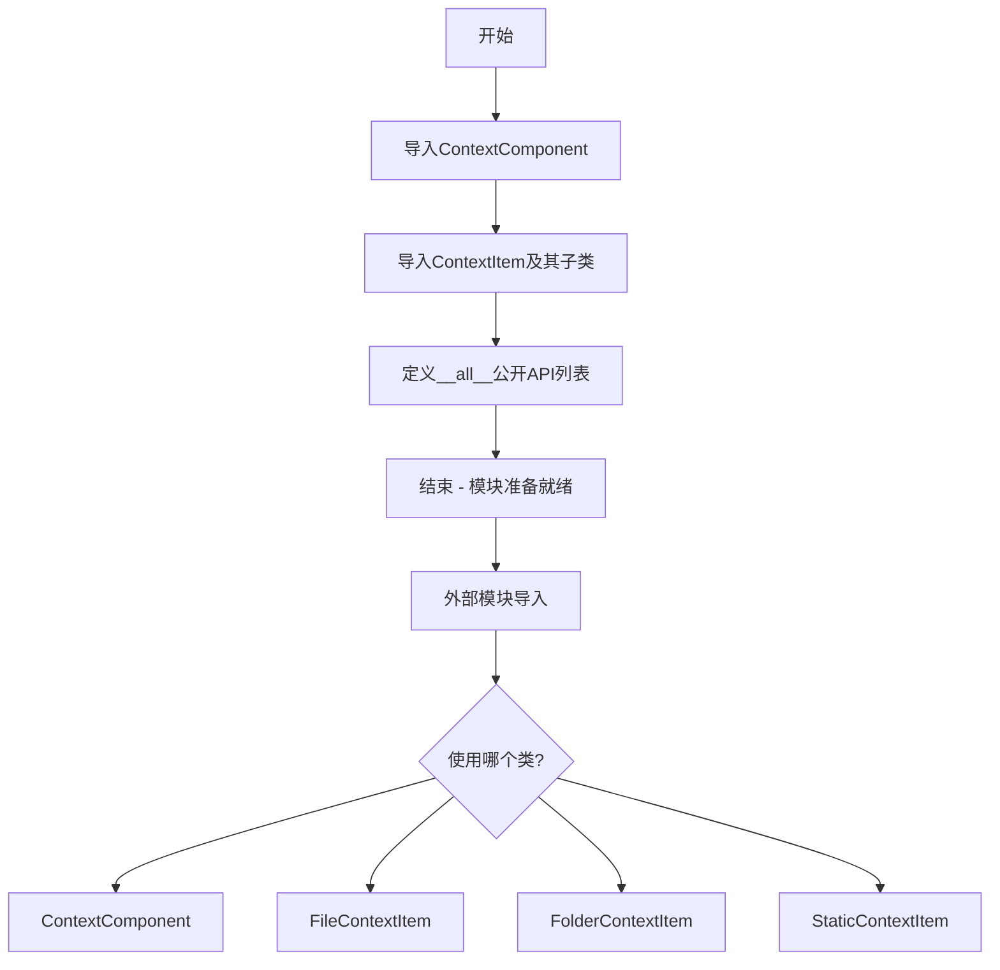

# `.\AutoGPT\classic\forge\forge\components\context\__init__.py` 详细设计文档

这是一个Python包的初始化文件，主要用于组织和导出上下文相关的组件和类，包括ContextComponent基类和三种具体的上下文项实现（FileContextItem、FolderContextItem、StaticContextItem），为上层提供统一的模块导入接口。

## 整体流程



## 类结构

```
ContextComponent (抽象基类)
├── ContextItem (抽象基类)
│   ├── FileContextItem
│   ├── FolderContextItem
│   └── StaticContextItem
```

## 全局变量及字段


### `__all__`
    
定义模块公开导出的符号列表，控制from module import *时的导出内容

类型：`list[str]`
    


    

## 全局函数及方法


## 关键组件


### 概述

该代码是一个Python包的初始化模块，通过公共API接口导出上下文管理相关的核心类和组件，主要包括ContextComponent、ContextItem及其子类（FileContextItem、FolderContextItem、StaticContextItem），用于提供文件和文件夹等资源的上下文管理功能。

### 文件运行流程

该模块在包首次被导入时执行，主要完成以下工作：
1. 从.context模块导入ContextComponent类
2. 从.context_item模块导入ContextItem及其三个子类
3. 通过__all__列表定义包的公共导出接口

### 关键组件信息

### ContextComponent

上下文组件基类，提供上下文管理的基础抽象

### ContextItem

上下文项抽象基类，定义上下文项的通用接口和行为规范

### FileContextItem

文件上下文项，用于封装单个文件的上下文信息

### FolderContextItem

文件夹上下文项，用于封装文件夹的上下文信息

### StaticContextItem

静态上下文项，用于封装静态内容的上下文信息

### 潜在技术债务与优化空间

1. 当前模块仅为导入导出层，缺少实际业务逻辑的实现
2. 依赖的具体子模块（.context和.context_item）未在当前代码中展示，需要确保这些模块的实现完整性
3. 建议添加类型注解以增强代码的可维护性和IDE支持
4. 缺少版本控制和变更日志机制

### 设计目标与约束

- 设计目标：提供统一的上下文管理公共接口
- 约束：遵循Python包的组织规范，通过__all__控制公开API

### 错误处理与异常设计

当前模块未定义具体的异常处理逻辑，异常处理依赖于具体子模块的实现

### 外部依赖与接口契约

- 依赖：.context和.context_item两个子模块
- 接口契约：通过__all__定义导出类列表，外部模块应从该包导入而非直接访问子模块


## 问题及建议


### 已知问题

- 缺少模块级文档字符串，无法快速了解该模块的业务定位和用途
- 无版本信息管理，缺乏版本追踪机制
- 无导入错误处理，当依赖模块（context/context_item）缺失时会导致整个包不可用
- 缺少类型注解，降低了静态检查工具的效率
- __all__ 列表虽然存在，但未包含对导出内容的注释说明

### 优化建议

- 添加模块级 docstring，说明该模块在系统中的职责和定位
- 考虑添加 `__version__` 变量便于版本管理
- 使用 try-except 包装导入语句，提供更友好的导入错误提示
- 考虑添加类型注解提升代码可维护性
- 可在 __all__ 中添加注释说明各导出类的用途，或在模块 docstring 中统一说明


## 其它


### 设计目标与约束

本模块作为上下文管理系统的公共导出接口模块，主要目标是统一对外提供ContextComponent、ContextItem及其子类（FileContextItem、FolderContextItem、StaticContextItem）的访问入口。设计约束包括：保持与Python标准库的兼容性、遵循PEP 8命名规范、确保模块间的松耦合依赖关系。本模块采用相对导入（relative import）方式，仅作为接口聚合层，不包含具体业务逻辑实现，所有具体功能由导入的子模块提供。

### 错误处理与异常设计

由于本模块仅包含导入和导出语句，不涉及运行时业务逻辑，原则上不抛出业务异常。若导入的子模块（.context或.context_item）不存在或导入失败，将触发Python原生的ImportError异常。建议调用方在导入本模块时使用try-except捕获ImportError，以处理可能的模块缺失或循环依赖问题。模块级别的__all__定义确保了精确的公开API控制，避免暴露内部实现细节。

### 数据流与状态机

本模块作为数据流的静态传递层，不涉及运行时状态管理。数据流方向为：调用方导入本模块 → 获取ContextComponent或ContextItem相关类 → 实例化具体上下文项对象 → 由ContextComponent统一管理。状态转换由ContextComponent类内部实现管理，本模块不参与状态机的定义。若需要了解具体的状态转换流程，应查阅.context模块中ContextComponent的实现细节。

### 外部依赖与接口契约

本模块的直接外部依赖包括：.context模块（提供ContextComponent类）和.context_item模块（提供ContextItem及其子类）。接口契约方面：ContextComponent需提供上下文项的添加、移除、查询等管理方法；ContextItem作为基类定义上下文项的通用接口；FileContextItem、FolderContextItem、StaticContextItem分别实现文件、文件夹、静态类型上下文项的具体逻辑。所有公开导出的类均遵循统一的导入路径，调用方应通过本模块统一导入，避免直接访问子模块。

### 模块初始化流程

模块初始化时，Python解释器首先执行import语句，依次加载.context和.context_item子模块，然后执行__all__列表的赋值操作。初始化顺序为：① 加载.context_item模块（因为.context可能依赖它） → ② 加载.context模块 → ③ 执行本模块的__all__赋值。若存在循环依赖，可能导致导入顺序问题，但当前代码结构相对简单，循环依赖风险较低。模块初始化完成后，__all__中列出的类可供外部通过from context import ContextComponent形式导入使用。

### 版本兼容性与迁移指南

本模块代码仅使用Python 3标准语法，无版本特定特性，理论上支持Python 3.6及以上版本。迁移指南：若未来需要添加新的上下文项类型，应在.context_item模块中实现新类，并在本模块的__all__列表中添加导出，同时更新本文档的类详细信息部分。若移除某个导出类，需确保该类的所有调用方已完成迁移，避免破坏性变更。建议在版本迭代中保持__all__的稳定性，作为模块的公共契约。

### 性能考虑与资源管理

由于本模块不包含运行时逻辑，性能开销仅存在于模块首次导入时的子模块加载过程。资源管理方面，由子模块负责具体资源的生命周期管理，本模块不持有任何资源实例。内存占用极低，主要为模块对象的元数据开销。若在高频导入场景下考虑性能优化，可采用延迟导入（lazy import）策略，将部分导入操作延迟到实际使用时，但当前代码规模下无需此优化。


    