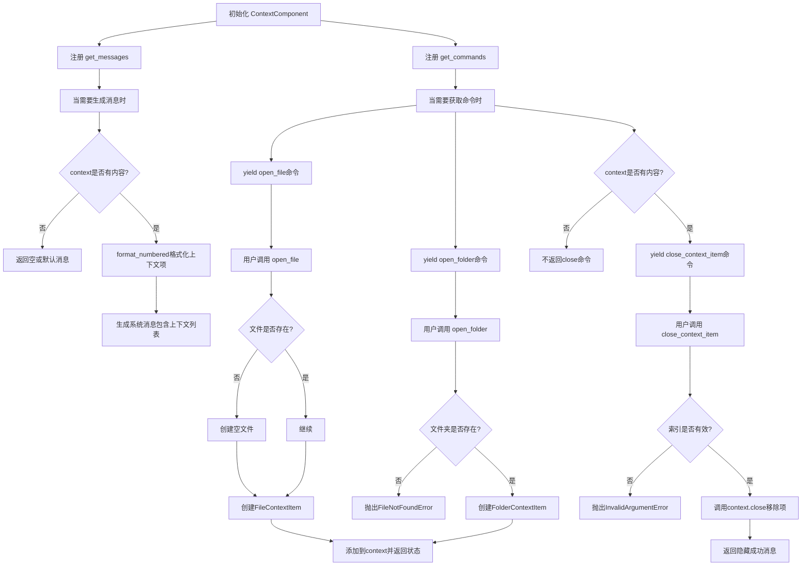
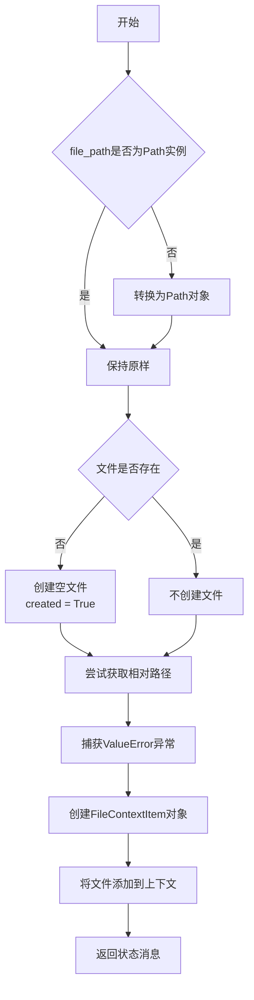
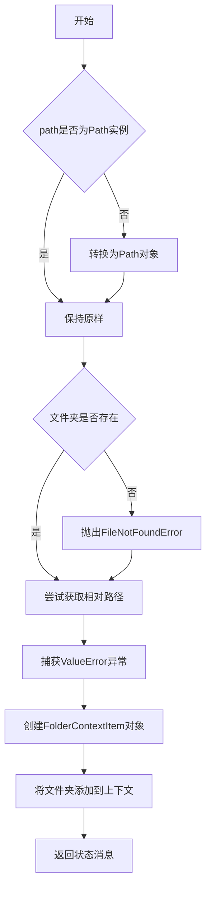
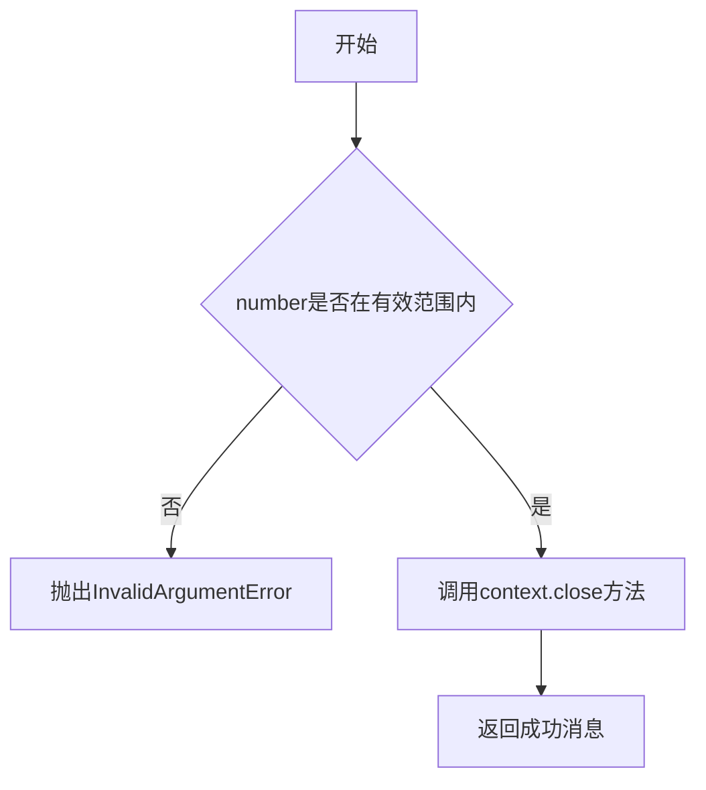
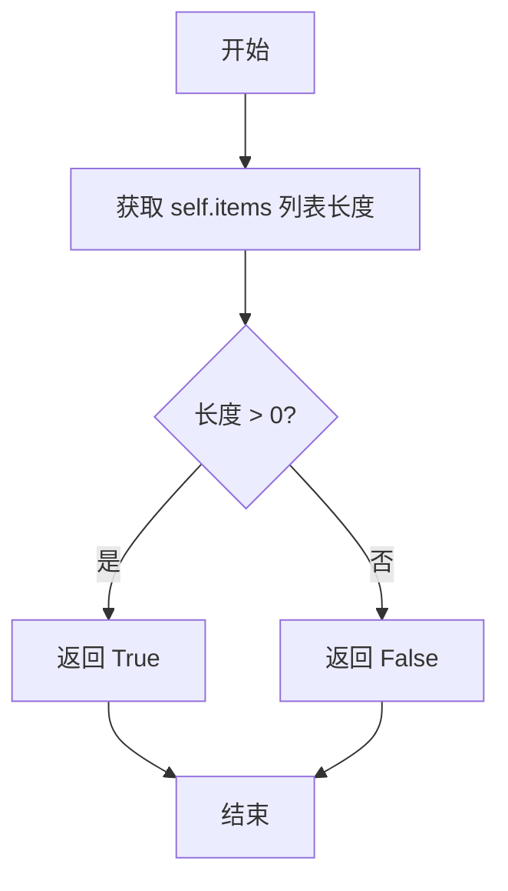
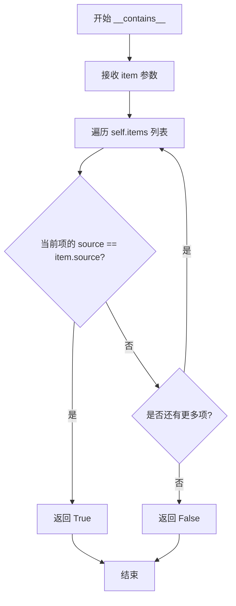
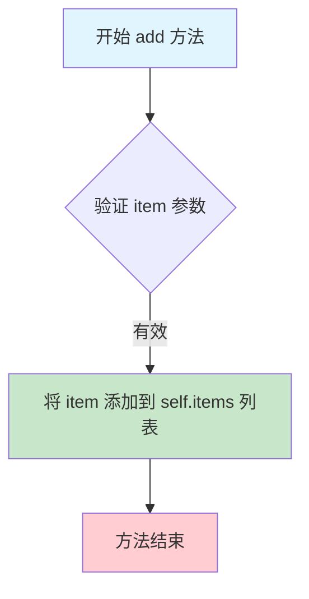
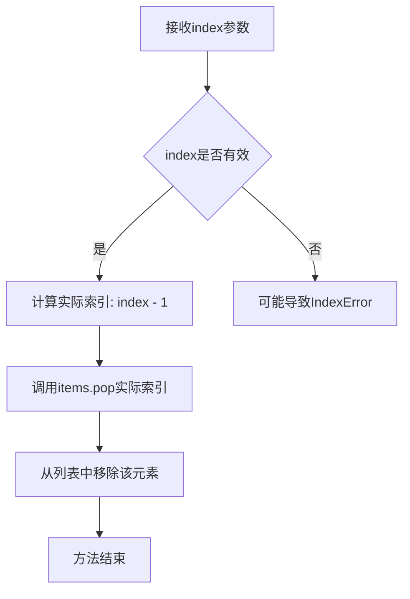
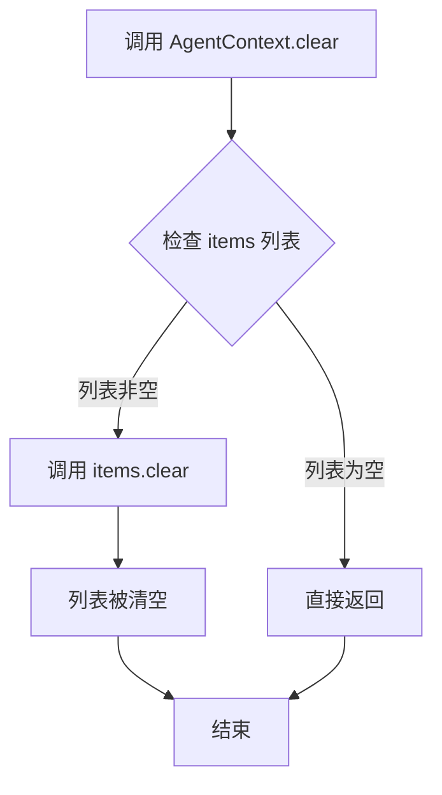
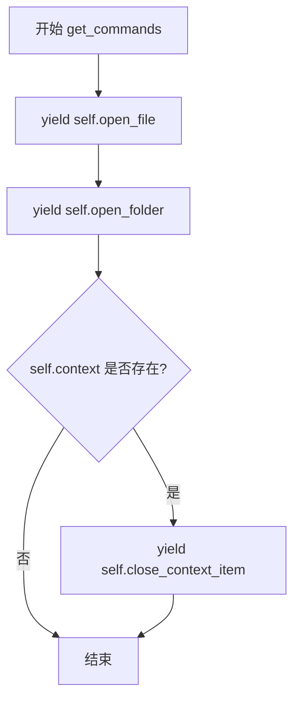

# `.\AutoGPT\classic\forge\forge\components\context\context.py` 详细设计文档

该代码实现了一个上下文管理系统，允许AI代理在对话过程中保持文件和文件夹的打开状态，通过AgentContext管理上下文项集合，并通过ContextComponent提供打开文件、打开文件夹和隐藏上下文项的命令接口。

## 整体流程



## 类结构

```
AgentContext (pydantic.BaseModel)
└── ContextComponent (MessageProvider, CommandProvider)
    ├── 依赖: FileStorage (workspace)
    └── 依赖: AgentContext (context)
```

## 全局变量及字段


### `AgentContext.items`
    
存储上下文项目的列表，使用类型鉴别器区分不同类型的上下文项

类型：`list[Annotated[ContextItem, Field(discriminator='type')]]`
    


### `ContextComponent.context`
    
管理文件或文件夹等上下文项目的容器实例

类型：`AgentContext`
    


### `ContextComponent.workspace`
    
提供文件操作接口的工作区存储实例，用于文件/文件夹的读写和存在性检查

类型：`FileStorage`
    
    

## 全局函数及方法


### `ContextComponent.open_file`

打开文件以便编辑或继续查看，如果文件不存在则创建它。

参数：

-  `file_path`：`str | Path`，要打开的文件的路径

返回值：`str`，表示发生的情况的状态消息

#### 流程图



#### 带注释源码

```python
@command(
    parameters={
        "file_path": JSONSchema(
            type=JSONSchema.Type.STRING,
            description="The path of the file to open",
            required=True,
        )
    }
)
async def open_file(self, file_path: str | Path) -> str:
    """Opens a file for editing or continued viewing;
    creates it if it does not exist yet.
    Note: If you only need to read or write a file once,
    use `write_to_file` instead.

    Args:
        file_path (str | Path): The path of the file to open

    Returns:
        str: A status message indicating what happened
    """
    # 如果file_path不是Path实例，则转换为Path对象
    if not isinstance(file_path, Path):
        file_path = Path(file_path)

    created = False
    # 如果文件不存在，则创建空文件
    if not self.workspace.exists(file_path):
        await self.workspace.write_file(file_path, "")
        created = True

    # 尝试将文件路径转换为相对于工作区的相对路径
    with contextlib.suppress(ValueError):
        file_path = file_path.relative_to(self.workspace.root)

    # 创建FileContextItem并添加到上下文
    file = FileContextItem(path=file_path)
    self.context.add(file)
    # 返回状态消息
    return (
        f"File {file_path}{' created,' if created else ''} has been opened"
        " and added to the context ✅"
    )
```

---

### `ContextComponent.open_folder`

打开一个文件夹以跟踪其内容。

参数：

-  `path`：`str | Path`，要打开的文件夹的路径

返回值：`str`，表示发生的情况的状态消息

#### 流程图



#### 带注释源码

```python
@command(
    parameters={
        "path": JSONSchema(
            type=JSONSchema.Type.STRING,
            description="The path of the folder to open",
            required=True,
        )
    }
)
def open_folder(self, path: str | Path) -> str:
    """Open a folder to keep track of its content

    Args:
        path (str | Path): The path of the folder to open

    Returns:
        str: A status message indicating what happened
    """
    # 如果path不是Path实例，则转换为Path对象
    if not isinstance(path, Path):
        path = Path(path)

    # 检查文件夹是否存在，不存在则抛出异常
    if not self.workspace.exists(path):
        raise FileNotFoundError(
            f"open_folder {path} failed: no such file or directory"
        )

    # 尝试将路径转换为相对于工作区的相对路径
    with contextlib.suppress(ValueError):
        path = path.relative_to(self.workspace.root)

    # 创建FolderContextItem并添加到上下文
    folder = FolderContextItem(path=path)
    self.context.add(folder)
    return f"Folder {path} has been opened and added to the context ✅"
```

---

### `ContextComponent.close_context_item`

隐藏打开的文件、文件夹或其他上下文项目，以节省 tokens。

参数：

-  `number`：`int`，要隐藏的上下文项目的基于1的索引

返回值：`str`，表示操作成功的状态消息

#### 流程图



#### 带注释源码

```python
@command(
    parameters={
        "number": JSONSchema(
            type=JSONSchema.Type.INTEGER,
            description="The 1-based index of the context item to hide",
            required=True,
        )
    }
)
def close_context_item(self, number: int) -> str:
    """Hide an open file, folder or other context item, to save tokens.

    Args:
        number (int): The 1-based index of the context item to hide

    Returns:
        str: A status message indicating what happened
    """
    # 检查索引是否在有效范围内
    if number > len(self.context.items) or number == 0:
        raise InvalidArgumentError(f"Index {number} out of range")

    # 关闭指定索引的上下文项目
    self.context.close(number)
    return f"Context item {number} hidden ✅"
```


### `AgentContext.__bool__`

该方法实现 Python 对象的布尔值转换接口，使 `AgentContext` 实例可以在布尔上下文中使用（如 `if context:` 语句），通过判断内部列表是否包含元素来返回 `True` 或 `False`。

参数：
- 无参数（`self` 为隐式参数，表示类的实例）

返回值：`bool`，当上下文列表包含至少一个项目时返回 `True`，否则返回 `False`

#### 流程图



#### 带注释源码

```python
def __bool__(self) -> bool:
    """实现 Python 布尔值转换协议，使对象可以在布尔上下文中使用。
    
    当 AgentContext 包含至少一个上下文项时返回 True，否则返回 False。
    这允许直接使用 'if context:' 来判断上下文是否为空。
    
    Returns:
        bool: 上下文列表是否包含项目
    """
    return len(self.items) > 0
```


### `AgentContext.__contains__`

实现 Python 的 `in` 运算符支持，用于检查给定的上下文项是否已存在于当前 AgentContext 的上下文中。通过比较上下文项的 `source` 属性来判断是否已存在。

参数：

-  `item`：`ContextItem`，要检查是否存在于上下文中的上下文项

返回值：`bool`，如果存在返回 `True`，否则返回 `False`

#### 流程图



#### 带注释源码

```python
def __contains__(self, item: ContextItem) -> bool:
    """检查给定的上下文项是否已存在于上下文中。
    
    实现 Python 的 in 运算符支持，允许使用 'item in context' 语法。
    通过比较上下文项的 source 属性来判断是否已存在相同来源的项。
    
    Args:
        item (ContextItem): 要检查的上下文项
        
    Returns:
        bool: 如果存在返回 True，否则返回 False
    """
    # 使用 any() 遍历列表，检查是否有任何一项的 source 与给定 item 的 source 相同
    # 这种方式在找到第一个匹配项后会立即返回，避免不必要的遍历
    return any([i.source == item.source for i in self.items])
```


### `AgentContext.add`

将指定的上下文项（ContextItem）添加到上下文列表中。

参数：

- `item`：`ContextItem`，需要添加到上下文的文件或文件夹项

返回值：`None`，无返回值

#### 流程图



#### 带注释源码

```python
def add(self, item: ContextItem) -> None:
    """将上下文项添加到上下文列表中。
    
    Args:
        item: 要添加的上下文项（FileContextItem 或 FolderContextItem）
        
    Returns:
        None: 此方法不返回任何值，直接修改内部状态
    """
    # 将传入的 item 对象追加到 items 列表的末尾
    # items 是 AgentContext 类的字段，类型为 list[ContextItem]
    self.items.append(item)
```


### `AgentContext.close`

该方法用于从上下文项目列表中移除指定索引位置的上下文项，通过将用户输入的1-based索引转换为0-based索引后调用列表的`pop`方法实现元素的删除。

参数：

- `index`：`int`，要关闭的上下文项的1-based索引（用户视角的编号，从1开始）

返回值：`None`，无返回值，仅执行副作用操作（修改items列表）

#### 流程图



#### 带注释源码

```python
def close(self, index: int) -> None:
    """从上下文中移除指定索引位置的上下文项。
    
    注意：用户传入的是1-based索引（从1开始计数），
    而Python列表使用的是0-based索引（从0开始计数），
    因此需要将index减1后再传给pop方法。
    
    Args:
        index: 用户视角的1-based索引，即用户在列表中看到的项目编号
               例如：用户想要关闭列表中的第1个项目，传入index=1
    
    Returns:
        None: 此方法直接修改self.items列表，无返回值
    """
    self.items.pop(index - 1)  # 将1-based索引转换为0-based索引后移除元素
```


### `AgentContext.clear`

清除 AgentContext 实例中所有上下文项目，重置上下文状态。

参数：
- 无

返回值：`None`，无返回值描述

#### 流程图



#### 带注释源码

```python
def clear(self) -> None:
    """清除所有上下文项目"""
    self.items.clear()  # 调用列表的 clear 方法，清空 items 列表中的所有元素
```

---

#### AgentContext 类的完整信息

**类描述**：`AgentContext` 是一个 Pydantic 模型类，用于管理上下文项目的集合，支持添加、关闭、清除和格式化上下文项。

**类字段**：

- `items`：`list[Annotated[ContextItem, Field(discriminator="type")]]`，存储上下文项目的列表，使用 discriminator 区分不同类型的 ContextItem

**类方法**：

- `__bool__`：判断上下文是否包含项目
- `__contains__`：检查特定项目是否已存在
- `add`：添加上下文项目
- `close`：根据索引关闭（移除）指定项目
- `clear`：清除所有上下文项目
- `format_numbered`：格式化输出上下文项目列表

---

#### 关键组件信息

| 组件名称 | 描述 |
|---------|------|
| AgentContext | 上下文项目管理器，负责维护打开的文件/文件夹列表 |
| ContextItem | 上下文项目基类，包含源路径等信息 |
| FileContextItem | 文件类型上下文项 |
| FolderContextItem | 文件夹类型上下文项 |
| ContextComponent | 提供消息和命令的组件，整合 AgentContext 与系统交互 |

---

#### 潜在技术债务或优化空间

1. **clear 方法缺乏验证**：当前 clear 方法直接清空列表，没有提供回调或事件通知机制，调用方无法感知清空操作
2. **索引处理**：close 方法使用 `index - 1` 进行转换，可能导致边界情况混淆，建议统一索引规则
3. **类型安全**：items 列表使用 discriminator，但 clear 方法不区分类型直接清空，缺乏细粒度控制

---

#### 其它项目

**设计目标与约束**：
- AgentContext 作为 Pydantic 模型，确保数据验证和序列化能力
- 采用列表存储项目，保持插入顺序

**错误处理与异常设计**：
- clear 方法不抛出异常，保证幂等性（重复调用安全）

**数据流**：
- clear 操作影响 ContextComponent 的消息生成，当上下文为空时，`get_messages` 不会生成系统消息

**外部依赖**：
- 依赖 pydantic 的 BaseModel 和 Field
- 依赖 ContextItem 及其子类实现项目类型管理


### `AgentContext.format_numbered`

将上下文项列表格式化为带编号的字符串列表，每个项通过双换行符分隔，便于在提示中展示。

参数：

- `workspace`：`FileStorage`，工作区存储，用于格式化上下文项

返回值：`str`，返回带编号的上下文项列表，格式为"序号. 格式化内容"，项之间用双换行符分隔

#### 流程图

```mermaid
flowchart TD
    A[开始 format_numbered] --> B{检查 items 是否为空}
    B -->|否| C[创建空列表]
    B -->|是| D[返回空字符串]
    C --> E[enumerate 枚举 items, 从 1 开始]
    E --> F[对每个 ContextItem 调用 c.fmt(workspace)]
    F --> G[格式化为 '{i}. {格式化内容}']
    G --> H[收集到列表中]
    H --> I{还有更多 items?}
    I -->|是| E
    I -->|否| J[用 '\n\n' 连接所有项]
    J --> K[返回结果字符串]
```

#### 带注释源码

```python
def format_numbered(self, workspace: FileStorage) -> str:
    """将上下文项格式化为带编号的字符串列表
    
    Args:
        workspace: FileStorage 实例，用于格式化每个上下文项
        
    Returns:
        str: 带编号的格式化字符串，项之间用双换行符分隔
    """
    # 使用列表推导式枚举所有上下文项，从 1 开始编号
    # 对每个项调用 fmt(workspace) 方法进行格式化
    # 最后用双换行符连接所有格式化后的项
    return "\n\n".join(
        [f"{i}. {c.fmt(workspace)}" for i, c in enumerate(self.items, 1)]
    )
```


### `ContextComponent.get_messages`

该方法是 `ContextComponent` 类的核心方法之一，用于生成包含当前上下文中文件和文件夹列表的系统消息。当存在上下文项时，它会生成一条系统消息，列出所有已打开的文件和文件夹，并提供如何隐藏上下文项的说明。

参数：
- （无，仅使用 `self` 实例）

返回值：`Iterator[ChatMessage]`，返回一个迭代器，包含一个系统消息对象，该消息包含格式化的上下文列表和使用 `hide_context_item` 命令的说明

#### 流程图


#### 带注释源码

```python
def get_messages(self) -> Iterator[ChatMessage]:
    """生成包含当前上下文项的系统消息迭代器。
    
    当 context 对象存在且包含上下文项时，生成一个系统消息，
    消息内容包含格式化的上下文列表以及如何隐藏上下文项的说明。
    
    Returns:
        Iterator[ChatMessage]: 包含上下文信息的系统消息迭代器
    """
    # 检查 context 是否存在（非空）
    if self.context:
        # 调用 format_numbered 方法格式化上下文中所有项为带编号的字符串
        # 该方法会遍历 context.items 并调用每个 item 的 fmt 方法
        formatted_context = self.context.format_numbered(self.workspace)
        
        # 构建系统消息内容，包含：
        # 1. Context 标题
        # 2. 格式化的上下文列表
        # 3. 关于如何使用 hide_context_item 命令隐藏不再需要的上下项目的说明
        message_content = (
            "## Context\n"
            f"{formatted_context}\n\n"
            "When a context item is no longer needed and you are not done yet, "
            "you can hide the item by specifying its number in the list above "
            "to `hide_context_item`."
        )
        
        # 使用 ChatMessage.system 工厂方法创建系统消息并 yield 返回
        # 由于返回类型是 Iterator，这里使用 yield 生成器模式
        yield ChatMessage.system(message_content)
    
    # 如果 context 不存在或为空，则不产生任何消息
    # 这是一个惰性计算，符合 MessageProvider 接口的设计
```


### `ContextComponent.get_commands`

该方法用于获取当前上下文组件中所有可用的命令。它返回一个迭代器，包含打开文件、打开文件夹以及在有上下文项时关闭上下文项的命令。

参数： 无

返回值：`Iterator[Command]` 一个迭代器，包含当前上下文组件中可用的命令对象。

#### 流程图



#### 带注释源码

```python
def get_commands(self) -> Iterator[Command]:
    """获取当前上下文组件中所有可用的命令。
    
    该方法实现了 CommandProvider 接口，返回一个命令迭代器。
    命令包括：打开文件、打开文件夹，以及在有上下文项时额外提供关闭上下文项的命令。
    
    Returns:
        Iterator[Command]: 包含可用命令的迭代器
    """
    # 始终提供打开文件的命令，允许用户打开或创建文件
    yield self.open_file
    
    # 始终提供打开文件夹的命令，允许用户追踪文件夹内容
    yield self.open_folder
    
    # 仅当存在上下文项时才提供关闭命令，节省命令列表空间
    if self.context:
        yield self.close_context_item
```


### `ContextComponent.open_file`

打开一个文件以便编辑或继续查看，如果文件不存在则创建它。

参数：

- `file_path`：`str | Path`，要打开的文件路径

返回值：`str`，表示发生了什么的状态消息

#### 流程图

```mermaid
flowchart TD
    A[开始] --> B{file_path 是否为 Path 类型?}
    B -->|是| C[保持不变]
    B -->|否| D[转换为 Path 对象]
    D --> C
    C --> E{文件是否存在?}
    E -->|是| F[不创建文件, created = False]
    E -->|否| G[写入空内容到文件, created = True]
    G --> F
    F --> H{能否转换为相对路径?}
    H -->|是| I[转换为相对于 workspace.root 的相对路径]
    H -->|否| J[保持绝对路径]
    J --> K
    I --> K
    K --> L[创建 FileContextItem 对象]
    L --> M[将 file 添加到 context]
    M --> N{created 为 True?}
    N -->|是| O[返回 'File {path} created, has been opened and added to the context ✅']
    N -->|否| P[返回 'File {path} has been opened and added to the context ✅']
    O --> Q[结束]
    P --> Q
```

#### 带注释源码

```python
@command(
    parameters={
        "file_path": JSONSchema(
            type=JSONSchema.Type.STRING,
            description="The path of the file to open",
            required=True,
        )
    }
)
async def open_file(self, file_path: str | Path) -> str:
    """Opens a file for editing or continued viewing;
    creates it if it does not exist yet.
    Note: If you only need to read or write a file once,
    use `write_to_file` instead.

    Args:
        file_path (str | Path): The path of the file to open

    Returns:
        str: A status message indicating what happened
    """
    # 如果 file_path 不是 Path 对象，则转换为 Path 对象
    if not isinstance(file_path, Path):
        file_path = Path(file_path)

    # 标记文件是否被创建
    created = False
    # 检查文件是否存在，如果不存在则创建空文件
    if not self.workspace.exists(file_path):
        await self.workspace.write_file(file_path, "")
        created = True

    # 尝试将文件路径转换为相对于工作区根目录的相对路径
    # 使用 contextlib.suppress 忽略 ValueError 异常（当路径无法转换为相对路径时）
    with contextlib.suppress(ValueError):
        file_path = file_path.relative_to(self.workspace.root)

    # 创建 FileContextItem 对象来表示打开的文件
    file = FileContextItem(path=file_path)
    # 将文件添加到上下文中
    self.context.add(file)
    # 返回状态消息，根据文件是否被创建返回不同的消息
    return (
        f"File {file_path}{' created,' if created else ''} has been opened"
        " and added to the context ✅"
    )
```


### `ContextComponent.open_folder`

打开一个文件夹以保持对其内容的跟踪，并将其添加到上下文中。

参数：

-  `path`：`str | Path`，要打开的文件夹路径

返回值：`str`，表示操作结果的状态消息

#### 流程图

```mermaid
flowchart TD
    A[开始 open_folder] --> B{path 是否为 Path 类型}
    B -->|否| C[将 path 转换为 Path 对象]
    B -->|是| D{workspace.exists(path)}
    C --> D
    D -->|不存在| E[抛出 FileNotFoundError: open_folder {path} failed: no such file or directory]
    D -->|存在| F{尝试将 path 转为相对路径}
    F -->|成功| G[path = path.relative_to(workspace.root)]
    F -->|失败| H[忽略异常，保持原路径]
    G --> I
    H --> I
    I[创建 FolderContextItem 对象] --> J[调用 context.add 添加到上下文]
    J --> K[返回成功消息: Folder {path} has been opened and added to the context ✅]
    K --> L[结束]
    E --> L
```

#### 带注释源码

```python
@command(
    parameters={
        "path": JSONSchema(
            type=JSONSchema.Type.STRING,
            description="The path of the folder to open",
            required=True,
        )
    }
)
def open_folder(self, path: str | Path) -> str:
    """Open a folder to keep track of its content

    Args:
        path (str | Path): The path of the folder to open

    Returns:
        str: A status message indicating what happened
    """
    # 如果 path 不是 Path 对象，则转换为 Path 对象
    if not isinstance(path, Path):
        path = Path(path)

    # 检查路径是否存在于工作区中，如果不存在则抛出 FileNotFoundError
    if not self.workspace.exists(path):
        raise FileNotFoundError(
            f"open_folder {path} failed: no such file or directory"
        )

    # 尝试将路径转换为相对于工作区根目录的相对路径
    # 如果转换失败（如路径不在工作区内），则忽略异常保持原路径
    with contextlib.suppress(ValueError):
        path = path.relative_to(self.workspace.root)

    # 创建 FolderContextItem 对象来表示打开的文件夹
    folder = FolderContextItem(path=path)
    
    # 将文件夹添加到上下文中进行跟踪
    self.context.add(folder)
    
    # 返回成功消息，确认文件夹已打开并添加到上下文
    return f"Folder {path} has been opened and added to the context ✅"
```


### `ContextComponent.close_context_item`

隐藏（关闭）一个已打开的文件、文件夹或其他上下文项，以节省 token 消耗。

参数：

- `number`：`int`，上下文项的 1-based 索引（即用户看到的编号，从 1 开始）

返回值：`str`，表示操作结果的状态消息

#### 流程图

```mermaid
flowchart TD
    A[开始] --> B{验证索引有效性}
    B -->|number > len(context.items) 或 number == 0| C[抛出 InvalidArgumentError]
    B -->|索引有效| D[调用 context.close(number)]
    D --> E[返回成功消息: 'Context item {number} hidden ✅']
    C --> F[结束]
    E --> F
```

#### 带注释源码

```python
@command(
    parameters={
        "number": JSONSchema(
            type=JSONSchema.Type.INTEGER,
            description="The 1-based index of the context item to hide",
            required=True,
        )
    }
)
def close_context_item(self, number: int) -> str:
    """Hide an open file, folder or other context item, to save tokens.

    Args:
        number (int): The 1-based index of the context item to hide

    Returns:
        str: A status message indicating what happened
    """
    # 边界检查：验证索引是否在有效范围内
    # 有效范围：1 <= number <= len(context.items)
    if number > len(self.context.items) or number == 0:
        # 索引无效时抛出自定义参数错误异常
        raise InvalidArgumentError(f"Index {number} out of range")

    # 调用 AgentContext 的 close 方法移除指定索引的上下文项
    # 注意：内部实现会将 1-based 索引转换为 0-based
    self.context.close(number)

    # 返回操作成功的状态消息，包含 emoji 反馈
    return f"Context item {number} hidden ✅"
```

## 关键组件


### AgentContext

上下文容器类，负责管理上下文项列表。提供添加、关闭、清除和格式化上下文项的方法，支持布尔判断和成员检查操作。

### ContextComponent

核心组件，集成MessageProvider和CommandProvider接口。负责将打开的文件/文件夹作为上下文提供给LLM，并暴露相关命令供AI代理调用。

### open_file 命令

异步命令，用于打开文件进行编辑或查看。自动创建不存在的文件，将其转换为相对路径，并添加到上下文管理器中。

### open_folder 命令

同步命令，用于打开文件夹并跟踪其内容。验证文件夹存在后，将文件夹项添加到上下文管理器。

### close_context_item 命令

用于隐藏打开的文件、文件夹或其他上下文项以节省token。通过1-based索引指定要隐藏的项。

### FileContextItem & FolderContextItem

上下文项的数据模型，分别表示打开的文件和文件夹，用于存储路径和格式信息。


## 问题及建议


### 已知问题

-   `__contains__` 方法使用列表推导式 `[...]` 而非生成器表达式 `any(...)`，造成不必要的内存开销
-   `close` 方法接收1-based索引但内部使用 `index - 1` 转换为0-based，调用逻辑不清晰且容易混淆
-   `open_file` 方法缺少对 `workspace.write_file` 失败的异常处理，可能导致文件已创建但上下文未添加的不一致状态
-   `open_folder` 仅检查路径是否存在，未验证是否为有效目录，可能导致误用
-   `close_context_item` 仅检查上限 `number > len(self.context.items)`，未处理负数情况
-   `open_file` 与 `open_folder` 方法签名不一致，前者为 `async` 后者为同步方法，设计不统一

### 优化建议

-   将 `any([i.source == item.source for i in self.items])` 改为 `any(i.source == item.source for i in self.items)` 使用生成器表达式
-   统一索引处理逻辑，文档化1-based索引约定或改为0-based索引避免转换混淆
-   为 `open_file` 添加 try-except 异常处理，确保文件创建与上下文添加的原子性
-   在 `open_folder` 中添加 `path.is_dir()` 验证，确保打开的是有效目录
-   在 `close_context_item` 起始处添加 `if number < 0: raise InvalidArgumentError(...)` 负数检查
-   统一 `open_file` 和 `open_folder` 为同步或异步方法，建议保持一致性
-   考虑添加重复文件检查逻辑，防止同一文件被多次添加到上下文

## 其它


### 设计目标与约束

**设计目标：**
该组件（ContextComponent）的核心目标是为AI Agent提供文件和文件夹的上下文管理能力，允许在Agent的对话上下文中保持多个文件和文件夹处于"打开"状态，以便Agent可以跨多次交互持续访问和编辑这些文件内容，从而减少重复打开文件的开销并提高Agent的工作效率。

**设计约束：**
1. 必须实现`MessageProvider`和`CommandProvider`接口以集成到Agent系统中
2. 上下文项（ContextItem）必须支持类型区分（通过Pydantic discriminator）
3. 所有文件路径操作需尽量转换为相对路径以保证可移植性
4. 异步操作仅用于文件创建（open_file），其他操作保持同步以简化逻辑

### 错误处理与异常设计

**异常类型：**
- `FileNotFoundError`：当`open_folder`操作的路径不存在时抛出
- `InvalidArgumentError`：当`close_context_item`的索引超出范围时抛出
- `ValueError`：当路径无法转换为相对路径时（被contextlib.suppress捕获并忽略）

**错误处理策略：**
- `open_file`：不存在的文件会被自动创建，不会抛出异常
- `open_folder`：路径不存在时显式抛出`FileNotFoundError`
- `close_context_item`：索引为0或超出范围时抛出`InvalidArgumentError`
- 路径转换失败时使用`contextlib.suppress`静默忽略，保持绝对路径

### 数据流与状态机

**数据流：**
```
用户/Agent调用命令
       ↓
ContextComponent处理命令
       ↓
修改AgentContext.items列表
       ↓
get_messages()将上下文格式化为系统消息
       ↓
Agent接收包含上下文提示的消息
```

**状态转换：**
- `AgentContext.items`：从空列表 → 添加项 → 移除项 → 清空
- 文件状态：不存在 → 已创建并打开 → （可选）关闭
- 文件夹状态：已存在 → 打开 → （可选）关闭

### 外部依赖与接口契约

**依赖的外部模块：**
| 模块名 | 用途 |
|--------|------|
| `forge.agent.protocols` | 实现`CommandProvider`和`MessageProvider`接口 |
| `forge.command` | 命令装饰器和Command类 |
| `forge.file_storage.base.FileStorage` | 文件存储抽象接口 |
| `forge.llm.providers.ChatMessage` | LLM消息模型 |
| `forge.models.json_schema.JSONSchema` | JSON Schema定义 |
| `forge.utils.exceptions.InvalidArgumentError` | 参数错误异常 |
| `.context_item` | 上下文项模型定义 |

**接口契约：**
- `MessageProvider.get_messages()`: 返回`Iterator[ChatMessage]`，无参数
- `CommandProvider.get_commands()`: 返回`Iterator[Command]`，无参数
- `AgentContext.add(item)`: 参数为`ContextItem`，无返回值
- `AgentContext.close(index)`: 参数为1-based索引，无返回值
- `FileStorage.exists(path)`: 检查路径是否存在
- `FileStorage.write_file(path, content)`: 异步写入文件

### 安全性考虑

1. **路径遍历攻击风险**：`open_file`和`open_folder`未验证路径是否在workspace根目录内，恶意输入可能访问workspace外的文件
2. **敏感信息泄露**：上下文格式化后直接发送给LLM，需确保不包含敏感路径信息
3. **空文件创建**：`open_file`会自动创建空文件，可能被滥用

### 性能考虑

1. **上下文膨胀风险**：无限制添加上下文项会导致token消耗增加，应考虑限制数量
2. **格式化开销**：`format_numbered`在每次`get_messages`时重新格式化，可考虑缓存
3. **文件读取**：当前实现不读取文件内容，仅存储路径，避免了大文件性能问题

### 并发与线程安全

1. `AgentContext.items`是普通list，非线程安全
2. 多线程环境下对context的并发修改可能导致数据不一致
3. `open_file`是async方法但`workspace.write_file`调用需要确认其线程安全性

### 配置与扩展性

**当前无显式配置项**，但可通过以下方式扩展：
1. 添加最大上下文项数量限制（配置项）
2. 添加上下文项过期时间
3. 支持自定义ContextItem类型（通过discriminator扩展）
4. 添加上下文持久化支持（保存/恢复上下文状态）

### 测试策略

**单元测试：**
- 测试`AgentContext`的add/close/clear/contains方法
- 测试`ContextComponent`的命令方法（open_file/open_folder/close_context_item）
- 测试路径转换逻辑

**集成测试：**
- 测试与FileStorage的交互
- 测试上下文格式化输出
- 测试命令注册到Agent系统

**边界测试：**
- 空上下文场景
- 索引边界值（0、负数、超出范围）
- 不存在的文件/文件夹路径

### 版本兼容性

1. 代码使用Python 3.10+的类型注解（`|`联合类型）
2. 依赖Pydantic v2（使用`Field(discriminator=...)`语法）
3. 依赖`typing_extensions.Annotated`（Python 3.9以下需要）
4. 建议最低Python版本：3.10

### 使用示例

```python
# 创建workspace和context
workspace = LocalFileStorage(Path("./workspace"))
agent_context = AgentContext()

# 创建ContextComponent实例
context_component = ContextComponent(workspace, agent_context)

# 打开文件
result = await context_component.open_file("example.py")
print(result)  # File example.py created, has been opened and added to the context ✅

# 打开文件夹
result = context_component.open_folder("src")
print(result)  # Folder src has been opened and added to the context ✅

# 获取上下文消息
messages = list(context_component.get_messages())
print(messages[0].content)  # 包含格式化的上下文列表

# 关闭上下文项
result = context_component.close_context_item(1)
print(result)  # Context item 1 hidden ✅
```

### 关键设计决策记录

1. **为什么使用Pydantic BaseModel？** - 利用其验证和序列化能力，支持discriminator实现多态
2. **为什么open_file是async而open_folder是sync？** - open_file需要写入文件（可能是I/O密集型），open_folder仅做状态管理
3. **为什么使用1-based索引？** - 更符合人类习惯（从1开始计数），但内部存储使用0-based
4. **为什么使用contextlib.suppress？** - 路径转换失败时静默处理，保持向后兼容


    