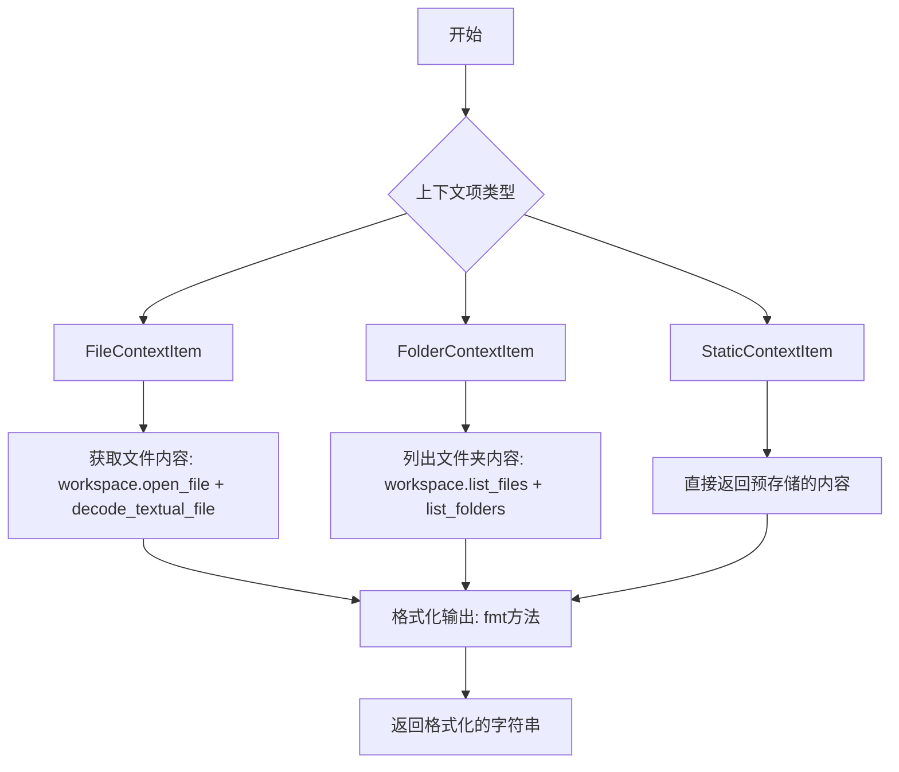
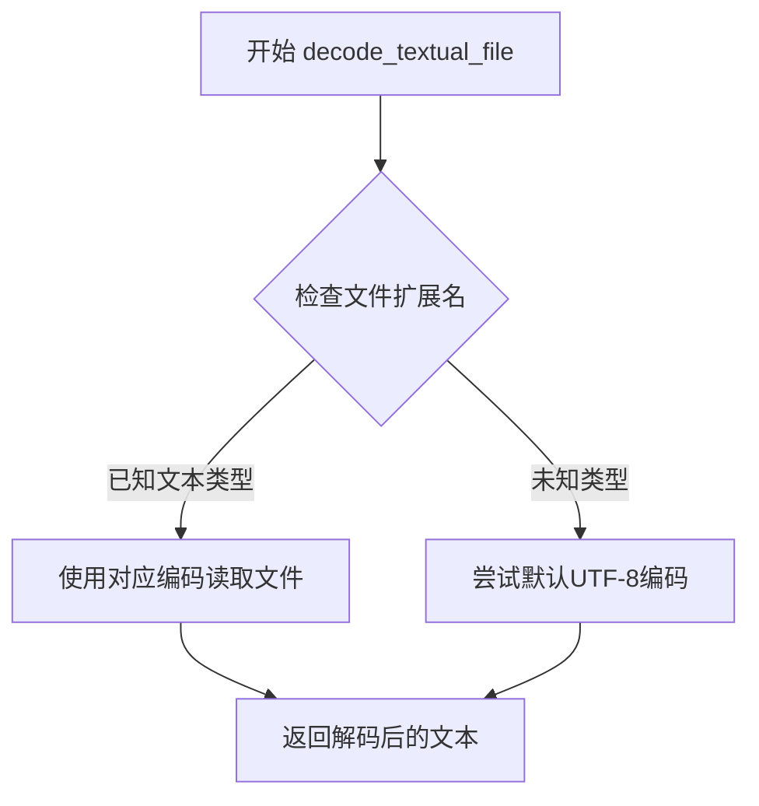
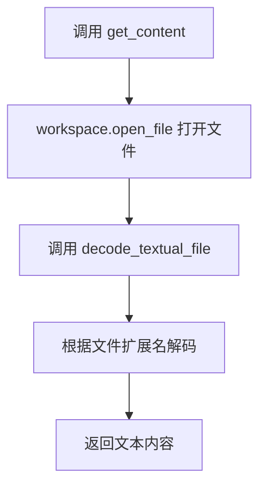
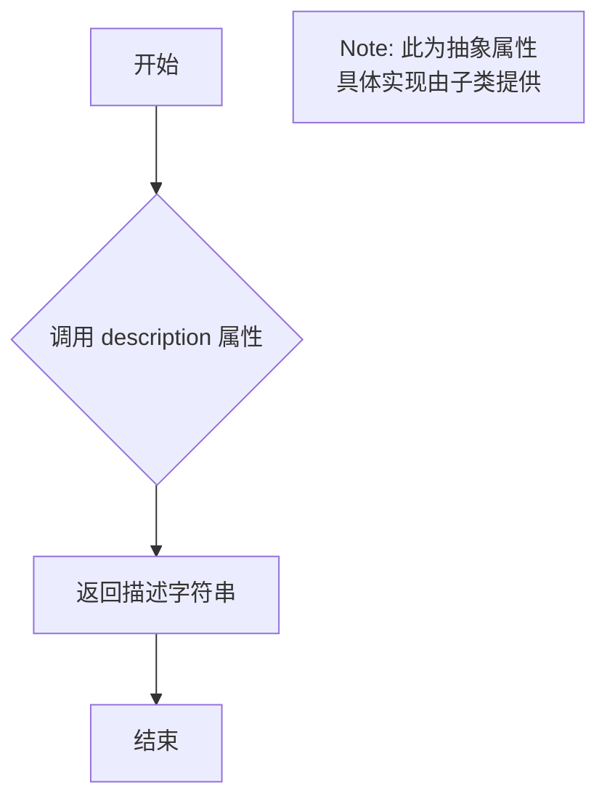
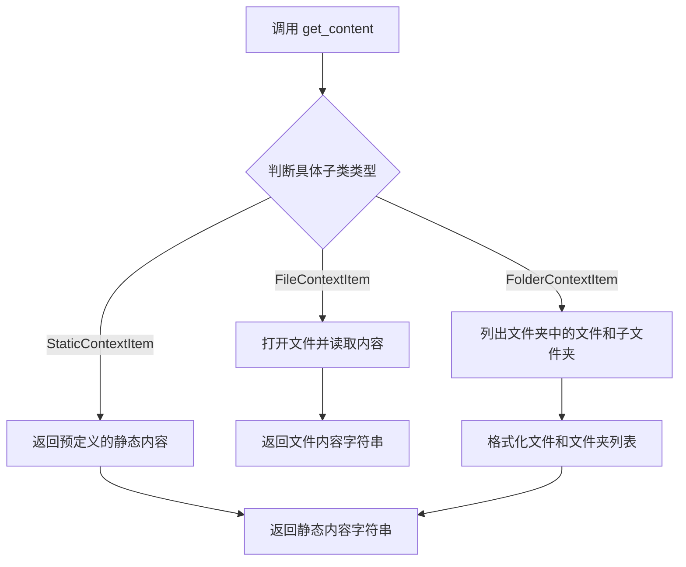
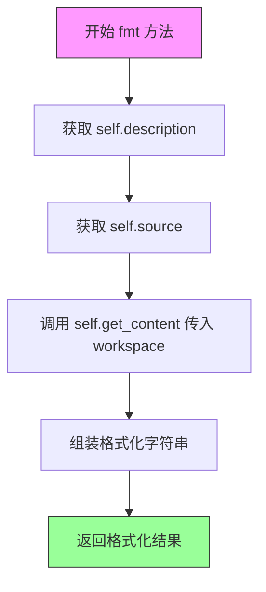
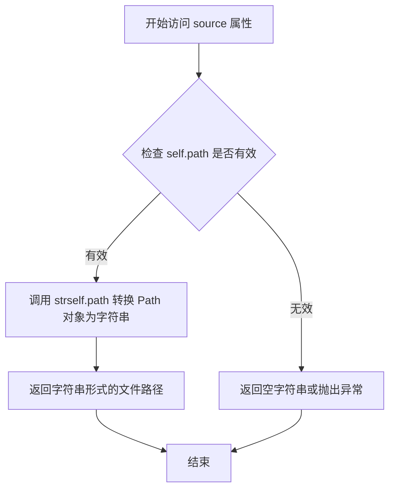
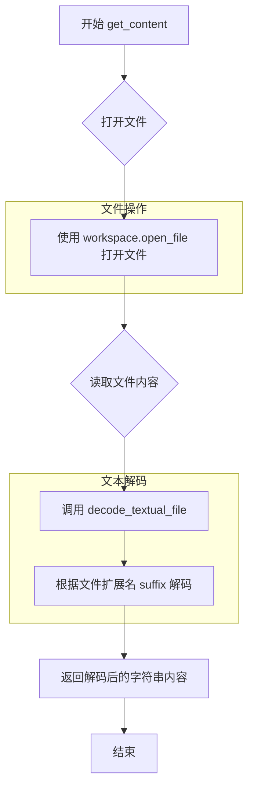
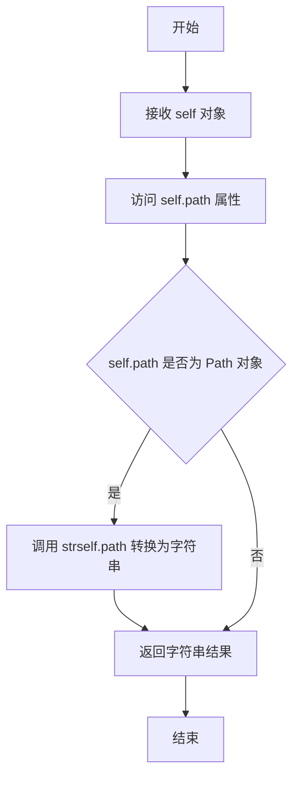
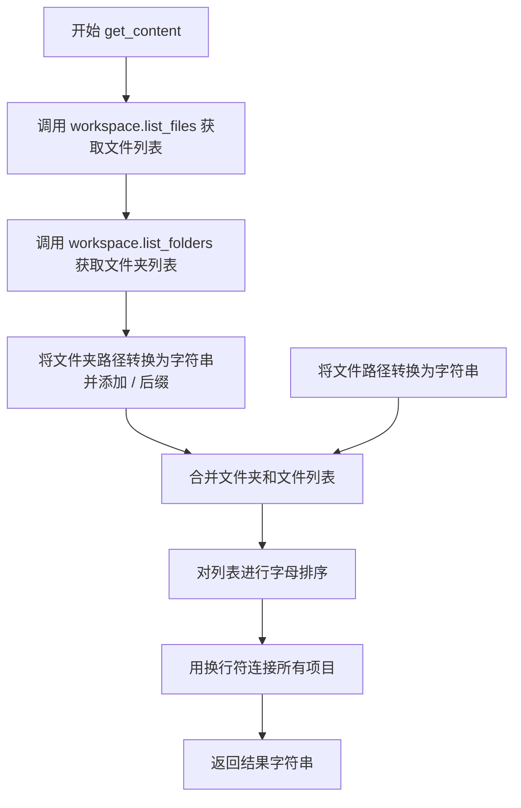

# `.\AutoGPT\classic\forge\forge\components\context\context_item.py` 详细设计文档

这是一个上下文项管理系统，定义了多种类型的上下文项（文件、文件夹、静态内容），用于在AI编程助手中表示和获取不同来源的上下文内容，并提供统一的接口进行内容检索和格式化展示。

## 整体流程



## 类结构

```
BaseContextItem (抽象基类)
├── FileContextItem (文件上下文项)
├── FolderContextItem (文件夹上下文项)
└── StaticContextItem (静态上下文项)
```

## 全局变量及字段


### `logger`
    
模块级别的日志记录器，用于记录运行时信息

类型：`logging.Logger`
    


### `ContextItem`
    
上下文项的联合类型，表示文件、文件夹或静态内容之一

类型：`FileContextItem | FolderContextItem | StaticContextItem`
    


### `FileContextItem.path`
    
文件的绝对或相对路径

类型：`Path`
    


### `FileContextItem.type`
    
类型标识，固定为'file'表示文件类型上下文项

类型：`Literal['file']`
    


### `FolderContextItem.path`
    
文件夹的绝对或相对路径

类型：`Path`
    


### `FolderContextItem.type`
    
类型标识，固定为'folder'表示文件夹类型上下文项

类型：`Literal['folder']`
    


### `StaticContextItem.item_description/description`
    
静态上下文项的描述信息

类型：`str`
    


### `StaticContextItem.item_source/source`
    
静态上下文项的来源位置，可为空

类型：`Optional[str]`
    


### `StaticContextItem.item_content/content`
    
静态上下文项的实际内容

类型：`str`
    


### `StaticContextItem.type`
    
类型标识，固定为'static'表示静态内容上下文项

类型：`Literal['static']`
    
    

## 全局函数及方法


### `decode_textual_file`

这是一个从 `forge.utils.file_operations` 模块导入的外部函数，用于将文件内容解码为文本格式。代码中通过 `FileContextItem.get_content` 方法调用此函数来处理文件内容读取。

**注意**：该函数在当前代码文件中仅被导入和使用，其完整源码定义在 `forge.utils.file_operations` 模块中，以下信息基于代码调用方式的推断。

参数：

-  `file`：文件对象（打开的文件句柄），从 `workspace.open_file()` 返回
-  `file_extension`：字符串，从 `Path.suffix` 获取，表示文件扩展名（如 `.py`、`.txt` 等）
-  `logger`：日志记录器，用于记录解码过程中的日志信息

返回值：字符串，返回解码后的文件内容文本

#### 流程图



#### 带注释源码

```python
# 该函数定义位于 forge.utils.file_operations 模块
# 以下为调用方的使用方式推断

def decode_textual_file(file, file_extension: str, logger):
    """
    解码文本文件内容
    
    参数:
        file: 文件对象 - 已打开的文件句柄
        file_extension: str - 文件扩展名，用于确定编码格式
        logger: Logger - 日志记录器实例
    
    返回:
        str: 解码后的文件内容
    """
    # 基于文件扩展名选择适当的编码
    # 例如：.py, .txt, .md 等使用 UTF-8
    # 二进制文件可能会有不同的处理逻辑
    pass
```

---

### `FileContextItem.get_content`

`FileContextItem` 类的方法，用于获取文件的文本内容。

参数：

-  `workspace`：`FileStorage` 对象，提供文件访问接口

返回值：字符串，返回文件的解码内容

#### 流程图



#### 带注释源码

```python
def get_content(self, workspace: FileStorage) -> str:
    """
    获取文件的文本内容
    
    参数:
        workspace: FileStorage - 文件存储接口，用于打开和读取文件
    
    返回:
        str: 解码后的文件内容字符串
    """
    # 使用上下文管理器打开文件
    # 参数: 文件路径, 模式"r"(读取), True(文本模式)
    with workspace.open_file(self.path, "r", True) as file:
        # 调用 decode_textual_file 解码文件内容
        # 传入: 文件对象, 文件扩展名, 日志记录器
        return decode_textual_file(file, self.path.suffix, logger)
```


### `BaseContextItem.description`

该属性是 `BaseContextItem` 抽象基类中定义的抽象属性，用于返回上下文项的描述信息。所有继承该抽象类的具体实现类（如 `FileContextItem`、`FolderContextItem`、`StaticContextItem`）都必须实现此属性，以提供各自的描述文本。

参数：该属性为类属性（property），无需额外参数。

- `self`：`BaseContextItem`，隐式参数，表示当前上下文项实例

返回值：`str`，返回对上下文项的描述文本

#### 流程图



#### 带注释源码

```python
class BaseContextItem(ABC):
    @property
    @abstractmethod
    def description(self) -> str:
        """Description of the context item"""
        ...

    # 抽象基类，定义了上下文项的接口规范
    # 子类必须实现 description 属性以提供具体描述
```


### `BaseContextItem.source`

这是一个抽象属性，用于获取上下文项的源位置标识。子类实现该属性以返回具体的来源信息（如文件路径或文件夹路径）。

参数：无（属性访问无需参数）

返回值：`Optional[str]`，返回表示上下文项源位置的字符串，如果不可用则返回 `None`。

#### 流程图

```mermaid
flowchart TD
    A[访问 source 属性] --> B{子类实现?}
    B -->|FileContextItem| C[返回 str(self.path)]
    B -->|FolderContextItem| D[返回 str(self.path)]
    B -->|StaticContextItem| E[返回 item_source 字段值]
    C --> F[返回字符串或 None]
    D --> F
    E --> F
```

#### 带注释源码

```python
@property
@abstractmethod
def source(self) -> Optional[str]:
    """A string indicating the source location of the context item"""
    ...
```

**说明：**

- `@property`：将方法定义为属性，允许使用 `obj.source` 方式访问
- `@abstractmethod`：声明为抽象方法，要求子类必须实现
- 返回类型 `Optional[str]`：返回字符串或 `None`
- 子类实现：
  - `FileContextItem.source`：返回文件路径字符串
  - `FolderContextItem.source`：返回文件夹路径字符串
  - `StaticContextItem`：通过 `item_source` 字段提供（使用 Pydantic Field 别名）


### `BaseContextItem.get_content`

获取上下文项所表示的内容，具体实现由子类提供。

参数：

- `workspace`：`FileStorage`，用于访问工作区文件的存储接口

返回值：`str`，返回上下文项所表示的内容

#### 流程图



#### 带注释源码

```python
@abstractmethod
def get_content(self, workspace: FileStorage) -> str:
    """
    获取上下文项所表示的内容
    
    这是一个抽象方法，具体实现由子类提供：
    - FileContextItem: 读取文件内容
    - FolderContextItem: 列出文件夹中的文件和子文件夹
    - StaticContextItem: 返回预定义的静态内容
    
    Args:
        workspace: FileStorage 实例，用于访问工作区文件
        
    Returns:
        str: 上下文项所表示的内容
    """
    ...
```


### `BaseContextItem.fmt`

该方法将上下文项的描述、来源和内容格式化为带代码块标记的字符串，便于在日志或调试输出中展示。

参数：

- `self`：隐式参数，`BaseContextItem` 实例本身
- `workspace`：`FileStorage`，文件存储接口，用于读取上下文项的实际内容

返回值：`str`，返回格式化的字符串，格式为`描述 (source: 来源)\n\`\`\`\n内容\n\`\`\``

#### 流程图



#### 带注释源码

```python
def fmt(self, workspace: FileStorage) -> str:
    """
    格式化上下文项为字符串表示
    
    参数:
        workspace: FileStorage 实例，用于访问工作区文件存储
        
    返回:
        格式化的字符串，包含描述、来源和内容
    """
    # 使用 f-string 组装格式化字符串，包含：
    # 1. 描述信息 (self.description)
    # 2. 来源位置 (self.source)
    # 3. 内容 (通过 self.get_content 获取)
    # 使用 Markdown 代码块语法包裹内容
    return (
        f"{self.description} (source: {self.source})\n"
        "```\n"
        f"{self.get_content(workspace)}\n"
        "```"
    )
```


### `FileContextItem.description`

这是一个属性方法（property），返回当前文件上下文的描述字符串，用于标识该上下文项代表的是哪个文件的内容。描述格式为 "The current content of the file '{文件路径}'"。

参数：

- 无参数（这是一个属性 getter 方法）

返回值：`str`，返回描述文件内容的字符串，格式为 "The current content of the file '{self.path}'"，其中 `{self.path}` 是文件的完整路径。

#### 流程图

```mermaid
flowchart TD
    A[开始] --> B{访问 description 属性}
    B --> C[获取 self.path]
    C --> D[构建描述字符串<br/>f"The current content of the file '{self.path}'"]
    D --> E[返回描述字符串]
    E --> F[结束]
```

#### 带注释源码

```python
@property
def description(self) -> str:
    """返回当前文件上下文的描述信息"""
    # 返回格式化的文件描述字符串，包含完整的文件路径
    # 格式: "The current content of the file '{self.path}'"
    # self.path 类型为 Path，表示文件的完整路径
    return f"The current content of the file '{self.path}'"
```


### `FileContextItem.source`

该属性用于返回文件上下文项的源代码位置，以字符串形式表示文件的路径。它实现了 `BaseContextItem` 抽象类中定义的 `source` 属性，提供了一个统一的接口来获取上下文项的来源信息。

参数：此属性为只读属性，无参数

返回值：`str`，返回文件路径的字符串表示形式，即 `self.path` 转换为字符串后的结果，用于标识该上下文项对应的源文件位置

#### 流程图



#### 带注释源码

```python
@property
def source(self) -> str:
    """
    返回文件上下文项的源代码位置
    
    该属性实现了 BaseContextItem 抽象类中的 source 属性，
    返回文件路径的字符串表示形式，用于标识该上下文项的来源。
    
    Returns:
        str: 文件的完整路径字符串，格式为文件系统路径表示法
    """
    return str(self.path)
```


### `FileContextItem.get_content`

该方法用于获取指定文件的文本内容，通过打开文件并使用文件扩展名进行适当的文本解码后返回文件内容。

参数：

- `workspace`：`FileStorage`，用于访问工作空间中文件的对象，提供 `open_file` 方法来读取文件

返回值：`str`，返回文件解码后的文本内容

#### 流程图



#### 带注释源码

```python
def get_content(self, workspace: FileStorage) -> str:
    """
    获取文件的文本内容。
    
    Args:
        workspace: FileStorage 实例，用于访问工作空间中的文件
        
    Returns:
        str: 解码后的文件文本内容
    """
    # 使用 workspace 打开文件，参数分别为：文件路径、读取模式("r")、是否同步(True)
    with workspace.open_file(self.path, "r", True) as file:
        # 调用 decode_textual_file 函数，根据文件扩展名(self.path.suffix)
        # 对文件内容进行适当的文本解码，并使用 logger 记录日志
        return decode_textual_file(file, self.path.suffix, logger)
```


### `FolderContextItem.description`

描述：`FolderContextItem` 类的 `description` 属性，用于返回当前文件夹在工作空间中的描述信息。

参数：

- （无参数，这是一个属性 getter）

返回值：`str`，返回描述文件夹内容的字符串，格式为 `"The contents of the folder '{self.path}' in the workspace"`。

#### 流程图

```mermaid
flowchart TD
    A[开始] --> B{执行 description 属性 getter}
    B --> C[返回格式化字符串]
    C --> D["返回: \"The contents of the folder '{self.path}' in the workspace\""]
    D --> E[结束]
```

#### 带注释源码

```python
@property
def description(self) -> str:
    """返回文件夹的描述信息
    
    Returns:
        str: 描述文件夹内容的字符串，格式为 "The contents of the folder '{self.path}' in the workspace"
    """
    return f"The contents of the folder '{self.path}' in the workspace"
```


### `FolderContextItem.source`

该属性是 `FolderContextItem` 类的只读属性，用于返回当前上下文项（文件夹）的源位置，以字符串形式表示。

参数：无（仅包含隐式参数 `self`）

返回值：`str`，返回文件夹路径的字符串表示形式。

#### 流程图



#### 带注释源码

```python
@property
def source(self) -> str:
    """
    返回文件夹的源路径位置
    
    该属性实现自 BaseContextItem 抽象基类，
    用于标识当前上下文项的来源位置。
    对于文件夹类型的上下文项，来源即为文件夹路径本身。
    
    Returns:
        str: 文件夹路径的字符串表示形式
    """
    return str(self.path)
```


### `FolderContextItem.get_content`

该方法获取指定文件夹的内容列表，包括该文件夹中的所有子文件夹（以 "/" 结尾）和文件，并返回按字母排序的字符串表示。

参数：

- `self`：`FolderContextItem` 实例，当前上下文项对象
- `workspace`：`FileStorage`，文件系统存储接口，用于访问工作区中的文件和文件夹

返回值：`str`，返回文件夹内容的字符串表示，每行一个项目（文件夹以 "/" 结尾），按字母顺序排序

#### 流程图



#### 带注释源码

```python
def get_content(self, workspace: FileStorage) -> str:
    """
    获取文件夹的内容列表
    
    Args:
        workspace: FileStorage 实例，用于访问工作区文件系统
        
    Returns:
        str: 包含文件夹中所有文件和子文件夹的字符串，每行一个项目
    """
    # 获取指定路径下的所有文件，并将 Path 对象转换为字符串
    files = [str(p) for p in workspace.list_files(self.path)]
    
    # 获取指定路径下的所有文件夹，并为每个文件夹路径添加 "/" 后缀以示区分
    folders = [f"{str(p)}/" for p in workspace.list_folders(self.path)]
    
    # 合并文件夹和文件列表，文件夹在前，文件在后
    items = folders + files
    
    # 按字母顺序排序以确保一致的输出顺序
    items.sort()
    
    # 用换行符连接所有项目并返回
    return "\n".join(items)
```

## 关键组件


### BaseContextItem（抽象基类）

定义上下文项目的接口规范，提供了描述、来源和内容获取的抽象方法，以及格式化输出的具体实现。

### FileContextItem（文件上下文项）

表示工作区中的单个文件，通过文件路径读取并解码文件内容，支持多种文件类型的文本解析。

### FolderContextItem（文件夹上下文项）

表示工作区中的文件夹，列出文件夹内所有子文件夹和文件，并按字母排序返回列表内容。

### StaticContextItem（静态上下文项）

表示预定义的静态内容，通过别名机制映射描述、来源和内容字段，适用于外部传入的上下文数据。

### ContextItem（类型联合）

将三种具体上下文项类型联合为统一类型，支持基于文件、文件夹和静态内容的上下文抽象。

### FileStorage 依赖抽象

通过依赖注入的 `workspace: FileStorage` 参数解耦文件操作逻辑，便于单元测试和存储后端替换。

### decode_textual_file 工具函数

根据文件后缀调用不同的解码策略，支持多种文本文件格式的读取处理。


## 问题及建议


### 已知问题

-   **StaticContextItem 缺少抽象方法实现**：StaticContextItem 继承自 BaseContextItem，但没有实现 description、source 和 get_content 三个抽象成员。虽然使用了 Pydantic 的 Field alias，但实际调用这些属性时会导致运行时错误或返回 None。
-   **类型注解不一致**：BaseContextItem 中 source 属性定义为 `Optional[str]`，但在 FileContextItem 和 FolderContextItem 中实现为 `str`，缺少 Optional 包装。
-   **缺少错误处理**：get_content 方法未处理可能出现的异常，如文件不存在、权限不足、文件解码失败等情况，会直接向上抛出未处理的异常。
-   **硬编码的类型字面量**："file"、"folder"、"static" 三个类型标识符在代码中硬编码，缺乏统一的常量定义，不利于后期维护和扩展。
-   **日志记录不足**：仅在 decode_textual_file 时传递了 logger，但文件打开、列表文件夹等操作失败时没有相应的日志记录。

### 优化建议

-   **实现 StaticContextItem 的抽象方法**：为 StaticContextItem 添加 description、source 属性的实现，以及 get_content 方法的直接返回 item_content。
-   **统一类型注解**：在子类中将 source 属性返回值类型统一为 `Optional[str]`，与抽象基类保持一致。
-   **添加异常处理**：在 get_content 方法中添加 try-except 块，捕获并处理文件操作异常，同时记录错误日志。
-   **提取类型常量**：定义一个枚举或常量类来统一管理类型字面量，如 `class ContextItemType(str, Enum): FILE = "file" ...`。
-   **增强日志记录**：在关键操作点（如打开文件、列出目录）添加适当的日志记录，便于调试和监控。

## 其它


### 设计目标与约束

本模块旨在提供一种统一的抽象机制，用于表示和获取不同来源的上下文内容（文件、文件夹、静态内容），使得AI代理或工具能够获取工作区中的相关信息作为上下文输入。设计约束包括：必须继承自ABC以支持多态、必须实现`get_content`方法以获取实际内容、必须使用Pydantic进行数据验证、所有上下文项必须能够格式化为Markdown格式供LLM使用。

### 错误处理与异常设计

本模块本身不捕获异常，异常由调用方处理。对于`FileContextItem`，读取文件时可能抛出`FileNotFoundError`、`PermissionError`或`UnicodeDecodeError`，这些异常由`workspace.open_file`和`decode_textual_file`抛出。对于`FolderContextItem`，列出文件或文件夹时可能抛出`PermissionError`。`StaticContextItem`依赖Pydantic验证，若`item_description`、`item_source`或`item_content`字段缺失或类型错误，将抛出`ValidationError`。

### 数据流与状态机

数据流如下：调用方创建具体的`ContextItem`子类实例（`FileContextItem`、`FolderContextItem`或`StaticContextItem`），然后调用`fmt`方法格式化输出。`fmt`方法内部调用`get_content`获取实际内容，`get_content`方法接收`FileStorage`实例作为参数，通过该实例访问文件系统。整个过程是同步的，无状态机设计。

### 外部依赖与接口契约

本模块依赖以下外部组件：`pydantic.BaseModel`用于数据模型和验证；`FileStorage`抽象基类（来自`forge.file_storage.base`），必须实现`open_file`、`list_files`、`list_folders`方法；`decode_textual_file`工具函数（来自`forge.utils.file_operations`），用于根据文件扩展名解码文件内容；`logging`模块用于日志记录。

### 性能考虑

当前实现每次调用`get_content`都会重新读取文件或列出目录，对于频繁调用的场景可能存在性能瓶颈。建议在调用方实现缓存机制。`FolderContextItem`的`get_content`会将所有文件和文件夹加载到内存中，对于包含大量文件的目录可能存在内存压力。

### 安全性考虑

`FileContextItem`通过`workspace.open_file`访问文件，应确保`workspace`已进行权限控制，防止越权访问。`path`参数未进行路径遍历攻击防护（如防止`../../etc/passfile`），建议在`FileStorage`实现层进行路径验证。`StaticContextItem`的`item_content`字段无大小限制，可能导致内存问题。

### 可测试性

模块设计具有较好的可测试性：`BaseContextItem`是抽象类，便于使用Mock对象测试；`FileStorage`是抽象接口，便于注入Mock实现；各方法职责单一，易于单元测试。建议为每个ContextItem子类编写单元测试，验证`description`、`source`和`get_content`方法的正确性。

### 配置管理

本模块无独立配置项，配置依赖注入的`FileStorage`实例和日志配置。`StaticContextItem`支持通过别名`description`、`source`、`content`进行初始化，提供了灵活性。

### 扩展性设计

模块遵循开闭原则，便于扩展：新增上下文项类型只需继承`BaseContextItem`并实现抽象方法；`ContextItem`类型联合可扩展支持更多变体；`fmt`方法格式固定，但可继承修改格式逻辑。扩展点包括：支持URL上下文项、支持数据库查询结果上下文项、支持命令输出上下文项等。


    