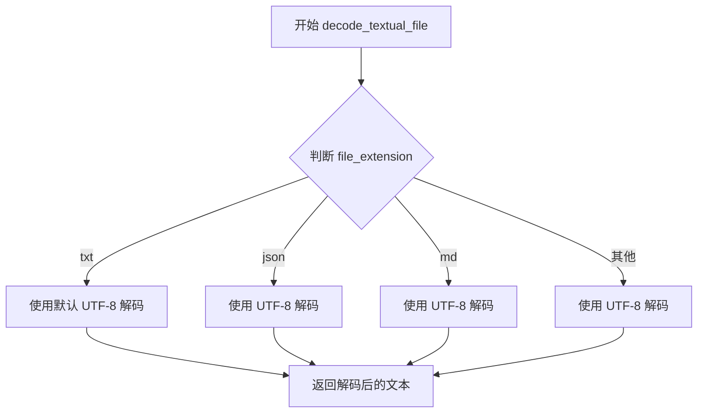
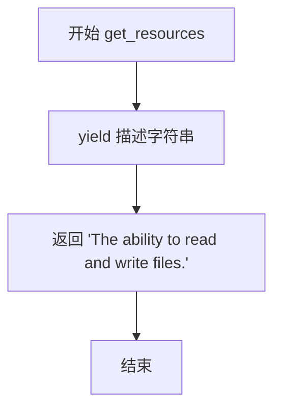
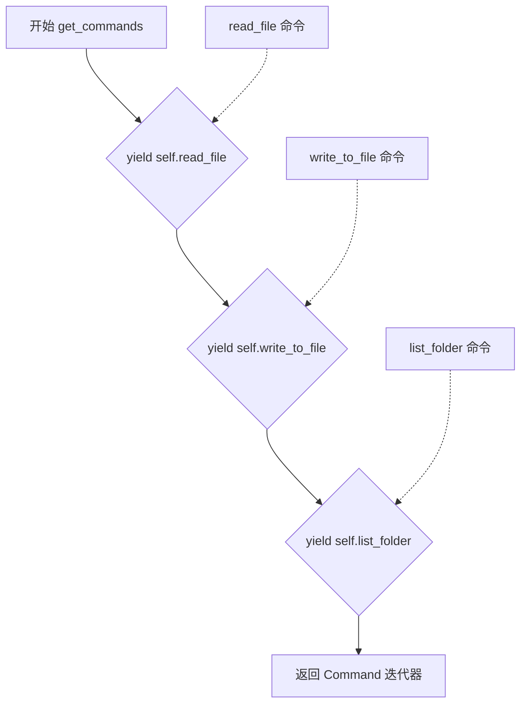
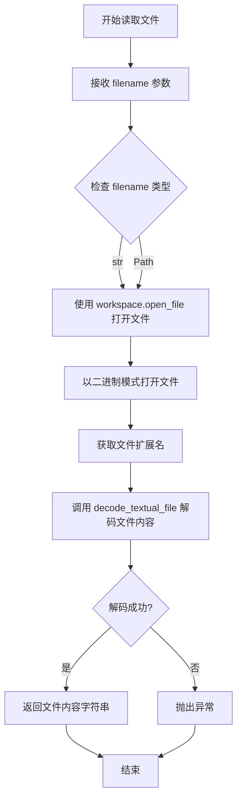
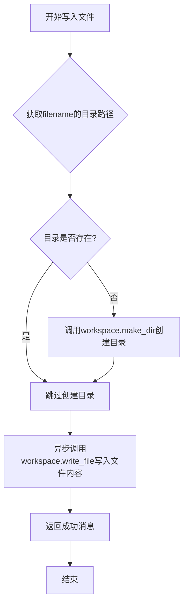
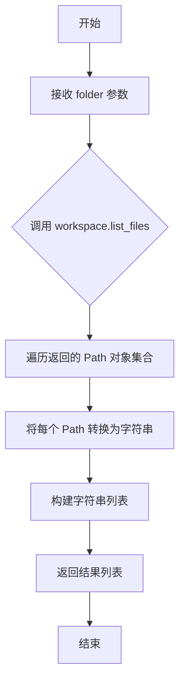

# `.\AutoGPT\classic\forge\forge\components\file_manager\file_manager.py` 详细设计文档

A file manager component that handles agent state persistence and workspace file operations (read, write, list), providing CLI commands for file manipulation within an agent framework.

## 整体流程

```mermaid
graph TD
    A[初始化 FileManagerComponent] --> B{config provided?}
    B -- 否 --> C[生成默认路径: agents/{agent_id}/ 和 workspace]
    B -- 是 --> D[使用提供的配置]
    C --> E[创建 storage 和 workspace FileStorage 实例]
    D --> E
    E --> F[等待命令调用]
    F --> G[read_file 调用]
    F --> H[write_to_file 调用]
    F --> I[list_folder 调用]
    G --> J[打开文件并解码内容]
    H --> K{目录存在?}
    K -- 否 --> L[创建目录]
    K -- 是 --> M[写入文件]
    L --> M
    M --> N[返回成功消息]
    I --> O[递归列出文件夹内容]
    F --> P[save_state 调用]
    P --> Q{save_as_id?}
    Q -- 是 --> R[创建新目录并复制工作区]
    Q -- 否 --> S[保存到当前存储路径]
```

## 类结构

```
FileManagerConfiguration (Pydantic BaseModel)
└── FileManagerComponent (DirectiveProvider, CommandProvider, ConfigurableComponent)
    ├── STATE_FILE (类常量)
    ├── __init__ (构造方法)
    ├── save_state (异步状态保存)
    ├── get_resources (资源提供者)
    ├── get_commands (命令提供者)
    ├── read_file (读取文件命令)
    ├── write_to_file (写入文件命令)
    └── list_folder (列出文件夹命令)
```

## 全局变量及字段


### `logger`
    
模块级日志记录器

类型：`logging.Logger`
    


### `FileManagerConfiguration.storage_path`
    
代理文件存储路径

类型：`str`
    


### `FileManagerConfiguration.workspace_path`
    
代理工作区路径

类型：`str`
    


### `FileManagerComponent.config_class`
    
配置类类型

类型：`Type[FileManagerConfiguration]`
    


### `FileManagerComponent.STATE_FILE`
    
状态文件名常量

类型：`str`
    


### `FileManagerComponent.agent_state`
    
代理状态对象

类型：`BaseAgentSettings`
    


### `FileManagerComponent.storage`
    
代理相关文件存储

类型：`FileStorage`
    


### `FileManagerComponent.workspace`
    
工作区文件存储

类型：`FileStorage`
    


### `FileManagerComponent._file_storage`
    
原始文件存储实例

类型：`FileStorage`
    
    

## 全局函数及方法


### `decode_textual_file`

该函数用于将文件对象根据其文件扩展名解码为文本内容，支持多种文本格式（如 .txt、.json、.md 等），并通过日志记录器提供调试信息。

参数：

- `file`：文件对象，需要解码的原始文件内容（通常为二进制模式打开的文件对象）
- `file_extension`：字符串，表示文件的扩展名（如 `.txt`、`.json`、`.md` 等），用于确定解码格式
- `logger`：Logger 实例，用于记录解码过程中的日志信息

返回值：字符串，返回解码后的文本内容

#### 流程图



> **注意**：由于 `decode_textual_file` 函数的实际实现代码未在提供的代码片段中展示，上述流程图和源码为基于函数调用方式的推断。实际实现可能包含更复杂的编码检测逻辑和错误处理机制。

#### 带注释源码

```python
# 由于源码未在提供的代码中显示，以下为基于调用方式的推断
# 实际实现请参考 forge/utils/file_operations.py 源文件

def decode_textual_file(file, file_extension: str, logger):
    """
    解码文本文件
    
    参数:
        file: 文件对象（二进制模式打开）
        file_extension: 文件扩展名（如 .txt, .json）
        logger: 日志记录器
    
    返回:
        str: 解码后的文本内容
    """
    # 根据文件扩展名确定编码方式
    encoding = "utf-8"  # 默认使用 UTF-8
    
    # 尝试解码文件内容
    try:
        content = file.read().decode(encoding)
        logger.debug(f"Successfully decoded {file_extension} file")
        return content
    except UnicodeDecodeError:
        # 如果 UTF-8 解码失败，尝试其他编码
        logger.warning(f"UTF-8 decode failed, trying fallback encoding")
        # ... 错误处理逻辑
```

#### 关键组件信息

| 组件名称 | 描述 |
|---------|------|
| `file` 参数 | 二进制模式打开的文件对象 |
| `file_extension` 参数 | 用于确定解码格式的文件扩展名 |
| `logger` 参数 | 用于记录解码过程日志的 Logger 实例 |
| 返回值 | 解码后的字符串内容 |

#### 潜在的技术债务或优化空间

1. **编码检测不完善**：当前实现可能仅依赖文件扩展名判断编码，建议增加编码自动检测机制（如 chardet 库）
2. **错误处理缺失**：解码失败时应提供更详细的错误信息和建议的解决方案
3. **支持的格式有限**：可考虑支持更多文本格式（如 XML、YAML 等）

#### 其它项目

- **设计目标**：提供统一的文本文件解码接口，简化文件读取操作
- **约束**：依赖文件扩展名确定解码方式，需要调用方保证扩展名的准确性
- **错误处理**：应处理常见的编码错误（如 UnicodeDecodeError），并提供fallback机制
- **外部依赖**：无特殊外部依赖，仅使用标准库和日志模块


### `FileManagerComponent.__init__`

初始化 FileManagerComponent 实例，验证代理状态，创建文件存储和 workspace 配置，并初始化相关的存储对象。

参数：

- `file_storage`：`FileStorage`，用于文件存储的实例
- `agent_state`：`BaseAgentSettings`，代理的当前状态配置
- `config`：`Optional[FileManagerConfiguration]`，可选的文件管理器配置，默认为 None

返回值：`None`，构造函数无返回值

#### 流程图

```mermaid
flowchart TD
    A[开始 __init__] --> B{检查 agent_state.agent_id 是否存在}
    B -->|否| C[抛出 ValueError: Agent must have an ID.]
    B -->|是| D{检查 config 是否为 None}
    D -->|是| E[构建默认路径]
    E --> E1[storage_path = agents/{agent_id}/]
    E --> E2[workspace_path = agents/{agent_id}/workspace]
    E1 --> F[创建 FileManagerConfiguration]
    E2 --> F
    F --> G[调用 ConfigurableComponent.__init__]
    D -->|否| H[直接调用 ConfigurableComponent.__init__]
    G --> I[初始化存储对象]
    H --> I
    I --> J[self.storage = file_storage.clone_with_subroot]
    J --> K[self.workspace = file_storage.clone_with_subroot]
    K --> L[self._file_storage = file_storage]
    L --> M[结束]
```

#### 带注释源码

```python
def __init__(
    self,
    file_storage: FileStorage,
    agent_state: BaseAgentSettings,
    config: Optional[FileManagerConfiguration] = None,
):
    """Initialise the FileManagerComponent.
    Either `agent_id` or `config` must be provided.

    Args:
        file_storage (FileStorage): The file storage instance to use.
        state (BaseAgentSettings): The agent's state.
        config (FileManagerConfiguration, optional): The configuration for
        the file manager. Defaults to None.
    """
    # 验证代理必须具有 ID，否则抛出异常
    if not agent_state.agent_id:
        raise ValueError("Agent must have an ID.")

    # 保存代理状态引用
    self.agent_state = agent_state

    # 如果未提供配置，则使用默认路径创建配置
    if not config:
        # 构建默认存储路径：agents/{agent_id}/
        storage_path = f"agents/{self.agent_state.agent_id}/"
        # 构建默认工作区路径：agents/{agent_id}/workspace
        workspace_path = f"agents/{self.agent_state.agent_id}/workspace"
        # 调用父类 ConfigurableComponent 初始化，传入新创建的配置对象
        ConfigurableComponent.__init__(
            self,
            FileManagerConfiguration(
                storage_path=storage_path, workspace_path=workspace_path
            ),
        )
    else:
        # 如果提供了配置，直接使用该配置初始化父类
        ConfigurableComponent.__init__(self, config)

    # 使用文件存储的 clone_with_subroot 方法创建代理专属的存储对象
    # 用于存储代理相关文件（如状态、日志等）
    self.storage = file_storage.clone_with_subroot(self.config.storage_path)
    """Agent-related files, e.g. state, logs.
    Use `workspace` to access the agent's workspace files."""
    
    # 创建工作区存储对象，用于代理可访问的文件读写
    self.workspace = file_storage.clone_with_subroot(self.config.workspace_path)
    """Workspace that the agent has access to, e.g. for reading/writing files.
    Use `storage` to access agent-related files, e.g. state, logs."""
    
    # 保存原始文件存储引用，用于跨目录操作（如保存状态到其他位置）
    self._file_storage = file_storage
```


### `FileManagerComponent.save_state`

保存代理的数据和状态。根据 `save_as_id` 参数决定保存到指定路径还是默认路径。

参数：

-  `save_as_id`：`Optional[str]`，可选参数，指定保存状态的代理ID。如果提供，则将状态保存到新的代理目录下；否则保存到当前代理的默认存储路径。

返回值：`None`，无返回值描述。

#### 流程图

```mermaid
flowchart TD
    A[开始 save_state] --> B{save_as_id 是否存在?}
    B -->|是| C[创建目录 agents/{save_as_id}]
    C --> D[写入状态文件到 agents/{save_as_id}/state.json]
    D --> E[复制工作空间到 agents/{save_as_id}/workspace]
    E --> F[结束]
    B -->|否| G[写入状态文件到默认存储路径 storage/state.json]
    G --> F
```

#### 带注释源码

```python
async def save_state(self, save_as_id: Optional[str] = None) -> None:
    """Save the agent's data and state.
    
    如果提供了 save_as_id，则将状态保存到新的代理目录下；
    否则保存到当前代理的默认存储路径。
    
    Args:
        save_as_id (Optional[str]): 可选的代理ID，用于指定保存路径
    """
    # 检查是否指定了保存ID
    if save_as_id:
        # 1. 创建新代理目录
        self._file_storage.make_dir(f"agents/{save_as_id}")
        
        # 2. 将代理状态写入 state.json 文件
        # 使用 model_dump_json() 将状态序列化为JSON格式
        await self._file_storage.write_file(
            f"agents/{save_as_id}/{self.STATE_FILE}",  # 拼接完整路径
            self.agent_state.model_dump_json(),         # 序列化状态对象
        )
        
        # 3. 复制整个工作空间到新目录
        # 保留工作空间中的所有文件
        self._file_storage.copy(
            self.config.workspace_path,               # 源路径：当前工作空间
            f"agents/{save_as_id}/workspace",          # 目标路径：新代理工作空间
        )
    else:
        # 未指定 save_as_id 时，保存到默认存储路径
        # 使用 self.storage 而非 self._file_storage
        await self.storage.write_file(
            self.storage.root / self.STATE_FILE,       # 拼接默认存储根目录和状态文件名
            self.agent_state.model_dump_json()         # 序列化状态对象
        )
```


### FileManagerComponent.get_resources

该方法是 FileManagerComponent 类的一个简单工具方法，用于向系统注册该组件所提供的资源能力。它通过生成器模式返回一个迭代器，告知系统该文件管理器组件具有读取和写入文件的能力。

参数：无

返回值：`Iterator[str]`，返回对组件所提供资源的描述迭代器，本例中为描述文件读写能力的字符串。

#### 流程图



#### 带注释源码

```python
def get_resources(self) -> Iterator[str]:
    """获取该组件提供的资源能力描述。
    
    此方法实现了 DirectiveProvider 协议，用于向系统声明
    该文件管理器组件能够提供的资源/能力。
    
    Returns:
        Iterator[str]: 一个迭代器，包含组件能力描述字符串。
                      当前描述为"The ability to read and write files."
    """
    yield "The ability to read and write files."
```


### `FileManagerComponent.get_commands`

该方法返回一个命令迭代器，提供文件读取、写入和列表三个核心操作命令，供 Agent 调用以执行文件系统操作。

参数： 无

返回值：`Iterator[Command]` ，返回一个迭代器，包含三个命令对象：read_file（读取文件）、write_to_file（写入文件）、list_folder（列出文件夹内容）

#### 流程图



#### 带注释源码

```python
def get_commands(self) -> Iterator[Command]:
    """获取可用的命令列表

    Returns:
        Iterator[Command]: 包含文件操作命令的迭代器
    """
    # 提供读取文件的命令
    yield self.read_file
    # 提供写入文件的命令
    yield self.write_to_file
    # 提供列出文件夹内容的命令
    yield self.list_folder
```

---

### 附：相关命令详情

#### `FileManagerComponent.read_file`

- **参数**：
  - `filename`：`str | Path`，要读取的文件路径
- **返回值**：`str`，文件内容

#### `FileManagerComponent.write_to_file`

- **参数**：
  - `filename`：`str | Path`，要写入的文件路径
  - `contents`：`str`，要写入的内容
- **返回值**：`str`，操作结果消息

#### `FileManagerComponent.list_folder`

- **参数**：
  - `folder`：`str | Path`，要列出的文件夹路径
- **返回值**：`list[str]`，文件夹中的文件路径列表


### `FileManagerComponent.read_file`

读取文件并返回文件内容。该方法接受文件名作为参数，使用工作区（workspace）打开文件，并根据文件扩展名解码文本内容，最后返回文件内容字符串。

参数：

- `filename`：`str | Path`，要读取的文件路径

返回值：`str`，文件的内容

#### 流程图



#### 带注释源码

```python
@command(
    parameters={
        "filename": JSONSchema(
            type=JSONSchema.Type.STRING,
            description="The path of the file to read",
            required=True,
        )
    },
)
def read_file(self, filename: str | Path) -> str:
    """Read a file and return the contents

    Args:
        filename (str): The name of the file to read

    Returns:
        str: The contents of the file
    """
    # 使用 workspace 打开文件，以二进制模式读取
    # workspace 是 FileStorage 实例，指向 agents/{agent_id}/workspace
    file = self.workspace.open_file(filename, binary=True)
    
    # 根据文件扩展名解码文本内容
    # decode_textual_file 会根据扩展名选择合适的解码方式
    # 例如：.json -> JSON, .yaml -> YAML, 纯文本 -> 直接读取
    content = decode_textual_file(file, os.path.splitext(filename)[1], logger)

    # 返回解码后的文件内容
    return content
```


### `FileManagerComponent.write_to_file`

将内容异步写入指定文件，如果文件所在目录不存在则先创建目录，写入成功后返回操作结果消息。

参数：

- `filename`：`str | Path`，要写入的文件路径
- `contents`：`str`，要写入文件的内容

返回值：`str`，操作结果消息，格式为"File {filename} has been written successfully."

#### 流程图



#### 带注释源码

```python
@command(
    ["write_file", "create_file"],
    "Write a file, creating it if necessary. "
    "If the file exists, it is overwritten.",
    {
        "filename": JSONSchema(
            type=JSONSchema.Type.STRING,
            description="The name of the file to write to",
            required=True,
        ),
        "contents": JSONSchema(
            type=JSONSchema.Type.STRING,
            description="The contents to write to the file",
            required=True,
        ),
    },
)
async def write_to_file(self, filename: str | Path, contents: str) -> str:
    """Write contents to a file

    Args:
        filename (str): The name of the file to write to
        contents (str): The contents to write to the file

    Returns:
        str: A message indicating success or failure
    """
    # 提取文件所在目录路径
    if directory := os.path.dirname(filename):
        # 如果目录不存在则创建，确保写入前目录结构完整
        self.workspace.make_dir(directory)
    # 异步写入文件内容到工作区
    await self.workspace.write_file(filename, contents)
    # 返回操作成功的结果消息
    return f"File {filename} has been written successfully."
```


### `FileManagerComponent.list_folder`

列出指定文件夹中的所有文件（递归遍历），返回文件路径的字符串列表。

参数：

- `folder`：`str | Path`，要列出文件的文件夹路径

返回值：`list[str]`，包含文件夹中所有文件路径的字符串列表

#### 流程图



#### 带注释源码

```python
@command(
    parameters={
        "folder": JSONSchema(
            type=JSONSchema.Type.STRING,
            description="The folder to list files in",
            required=True,
        )
    },
)
def list_folder(self, folder: str | Path) -> list[str]:
    """Lists files in a folder recursively

    Args:
        folder (str): The folder to search in

    Returns:
        list[str]: A list of files found in the folder
    """
    # 调用 workspace 对象的 list_files 方法获取文件夹中的所有文件
    # list_files 返回一个迭代器，包含 Path 对象
    # 使用列表推导式将每个 Path 对象转换为字符串并返回
    return [str(p) for p in self.workspace.list_files(folder)]
```

## 关键组件


### FileManagerConfiguration

配置类，定义文件管理器的存储路径和工作区路径

### FileManagerComponent

核心组件，集成指令提供者和命令提供者，支持代理状态管理和工作区文件操作

### 状态管理模块

save_state 方法实现代理状态的持久化，支持保存为新ID或更新当前状态

### 文件操作命令

read_file、write_to_file、list_folder 三个命令实现Workspace文件的读写和列表功能

### Workspace 隔离机制

通过 clone_with_subroot 方法创建独立的存储实例，隔离代理文件与工作区文件

### 配置初始化逻辑

支持自动生成路径和自定义配置两种初始化方式，确保 agent_id 必须存在


## 问题及建议


### 已知问题

- **异步方法设计不一致**: `read_file` 和 `list_folder` 是同步方法，但 `write_to_file` 是异步方法。在异步框架中使用同步文件I/O可能阻塞事件循环，影响整体性能。
- **异常处理缺失**: `read_file`、`write_to_file`、`list_folder` 和 `save_state` 方法均缺少异常处理逻辑，文件操作失败时可能导致未捕获的异常中断执行流程。
- **资源泄漏风险**: `workspace.open_file()` 返回的文件对象未显式关闭（未使用上下文管理器），可能导致文件句柄泄漏。
- **硬编码路径前缀**: `agents/` 路径前缀在代码中多处硬编码（`save_state` 方法和 `__init__` 方法），若需修改需要改动多处，降低了可维护性。
- **状态保存验证不足**: `save_state` 方法在保存状态前未验证 `agent_state` 的合法性，且复制 workspace 时未检查源路径是否存在，可能导致静默失败。
- **类型混合使用**: 方法参数接受 `str | Path` 但内部处理时统一按字符串处理，类型一致性不够理想，且 `os.path.dirname` 和 `os.path.splitext` 对 Path 对象处理可能产生意外结果。
- **配置 frozen 语义矛盾**: `FileManagerConfiguration` 的 `frozen=False` 与 Pydantic 默认行为相反，注释解释是为防止配置变更不反映到文件存储，但这种设计容易引起混淆。

### 优化建议

- **统一异步模式**: 将 `read_file` 和 `list_folder` 改为异步方法，或在异步上下文中使用 `asyncio.to_thread` 包装同步文件操作。
- **添加异常处理**: 为所有文件操作添加 try-except 块，捕获 `FileNotFoundError`、`PermissionError`、`OSError` 等可能异常，并返回有意义的错误信息。
- **使用上下文管理器**: 使用 `with` 语句或 async with 上下文管理器管理文件资源，确保资源正确释放。
- **提取路径前缀常量**: 将 `agents/` 路径前缀提取为配置项或类常量，减少硬编码。
- **添加状态保存验证**: 在 `save_state` 前验证 `agent_state` 有效性，检查 workspace 路径存在性后再执行复制操作。
- **统一类型处理**: 参数类型统一使用 `Path`，内部处理时显式转换为字符串，避免类型混合带来的潜在问题。
- **重新评估 frozen 配置**: 考虑使用 `frozen=True` 并提供显式的配置更新方法，使设计意图更清晰。

## 其它


### 设计目标与约束

该组件的设计目标是为Agent提供统一的文件管理能力，包括状态持久化和工作区文件操作。约束包括：1) 必须提供Agent ID才能初始化；2) 配置对象不可变以确保与文件存储的一致性；3) 文件操作需支持异步写入以提高性能；4) 存储路径和工作区路径必须分开以隔离不同类型的文件。

### 错误处理与异常设计

主要异常场景包括：1) 初始化时若未提供Agent ID则抛出ValueError；2) 文件读取失败时返回空字符串或特定错误消息；3) 写入文件时若目录不存在则自动创建；4) 文件存储操作异常应向上传播由调用方处理。组件本身不处理文件存储的底层异常，仅通过logger记录错误日志。

### 数据流与状态机

核心数据流包括：1) 初始化流程：接收FileStorage实例和Agent状态，创建storage和workspace两个子路径；2) 状态保存流程：调用save_state方法将agent_state序列化为JSON并写入state.json文件；3) 状态恢复流程：通过FileStorage的read_file方法读取state.json并反序列化；4) 文件操作流程：read_file/write_to_file/list_folder命令通过workspace对象操作文件。状态机涉及文件存储的创建、读取、更新、删除四种基本状态转换。

### 外部依赖与接口契约

依赖的外部组件包括：1) FileStorage：提供文件存储抽象，需实现clone_with_subroot、open_file、write_file、make_dir、copy、list_files等方法；2) BaseAgentSettings：Agent状态模型，需包含agent_id字段和model_dump_json方法；3) ConfigurableComponent：配置管理基类；4) Command：命令装饰器；5) JSONSchema：命令参数模式定义；6) decode_text_operations：文本文件解码工具。组件实现了DirectiveProvider和CommandProvider协议以集成到Agent系统中。

### 性能考虑与优化空间

当前实现存在以下优化点：1) save_state方法中复制整个workspace目录在大文件场景下性能较差，可考虑增量备份或硬链接；2) 文件操作均为同步或异步单个文件操作，缺乏批量操作支持；3) workspace和storage使用clone_with_subroot可能产生额外的文件系统开销；4) list_folder返回完整文件列表，大目录可能导致内存压力，建议增加分页或流式返回机制。

### 安全性考虑

安全考量包括：1) 路径遍历防护：write_to_file和read_file应验证filename不包含恶意路径遍历序列（如../）；2) 文件类型限制：可根据需求限制可读写文件类型；3) 权限控制：workspace和storage路径应与Agent ID绑定防止越权访问；4) 内容安全：对写入内容进行扫描防止恶意代码注入。

### 并发与线程安全

组件本身不维护共享状态，线程安全主要依赖FileStorage实现。save_state和write_to_file为异步方法，在并发场景下需确保：1) 同一文件的并发写入不会导致数据损坏；2) 状态保存操作应原子性执行。建议在FileStorage层面实现文件锁机制。

### 生命周期管理

组件生命周期包括：1) 初始化阶段：创建storage和workspace子路径；2) 运行阶段：响应文件操作命令；3) 状态持久化：定期或按需调用save_state；4) 销毁阶段：无显式资源释放，依赖Python垃圾回收。注意workspace和storage对象在组件销毁时应确保所有文件句柄已关闭。

### 测试策略建议

测试应覆盖：1) 单元测试：验证read_file、write_to_file、list_folder方法的正确性；2) 集成测试：与不同FileStorage实现的配合；3) 边界条件测试：空文件、大文件、特殊字符文件名、路径遍历攻击；4) 并发测试：多线程/多任务场景下的状态一致性；5) 异常测试：文件不存在、磁盘空间不足、权限错误等场景。

### 兼容性考虑

向后兼容性：1) STATE_FILE文件名变更需考虑旧版本状态迁移；2) 配置字段变更应保持向后兼容。系统兼容性：1) 路径分隔符在不同操作系统上的处理；2) 文件编码问题，特别是非UTF-8编码的文本文件处理。


    