# `.\AutoGPT\classic\forge\forge\components\file_manager\test_file_manager.py` 详细设计文档

这是一个pytest测试文件，用于测试FileManagerComponent类的文件管理功能，包括文件的读写、列表浏览和错误处理等核心操作。

## 整体流程

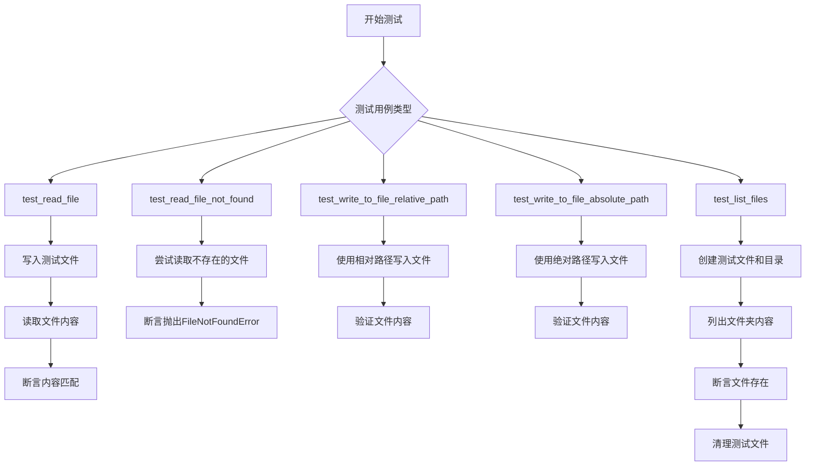

## 类结构

```
FileManagerComponent (文件管理器组件)
├── BaseAgentSettings (基础智能体设置)
├── FileStorage (文件存储)
└── Path (路径对象)
```

## 全局变量及字段


### `file_content`
    
测试用的文件内容字符串，包含换行符

类型：`str`
    


### `test_file_name`
    
测试文件的名称，值为 'test_file.txt' 的 Path 对象

类型：`Path`
    


### `test_file_path`
    
测试文件的完整路径，由 storage.get_path 生成

类型：`Path`
    


### `test_directory`
    
测试目录的完整路径，由 storage.get_path('test_directory') 生成

类型：`Path`
    


### `test_nested_file`
    
嵌套测试文件的完整路径，由 storage.get_path('nested/test_file.txt') 生成

类型：`Path`
    


### `file_a_name`
    
测试文件A的名称，值为 'file_a.txt'

类型：`str`
    


### `file_b_name`
    
测试文件B的名称，值为 'file_b.txt'

类型：`str`
    


### `non_existent_file`
    
不存在的文件名，用于测试异常场景，值为 'non_existent_file.txt'

类型：`str`
    


### `new_content`
    
写入测试文件的新内容字符串

类型：`str`
    


### `content`
    
从文件中读取的内容字符串

类型：`str`
    


### `FileManagerComponent.storage`
    
文件存储实例，用于管理文件的读写操作

类型：`FileStorage`
    


### `FileManagerComponent.settings`
    
代理设置，包含代理ID、名称和描述信息

类型：`BaseAgentSettings`
    
    

## 全局函数及方法


# FileManagerComponent 测试文件详细设计文档

## 1. 核心功能概述

该文件是一个pytest测试套件，用于验证`FileManagerComponent`类的文件管理功能，包括文件读取、写入、列出目录内容等核心操作，并通过多个测试用例确保组件在正常场景和异常场景下的正确性。

## 2. 文件整体运行流程

```
┌─────────────────────────────────────────────────────────────────┐
│                      pytest 测试执行流程                         │
├─────────────────────────────────────────────────────────────────┤
│  1. 收集测试 (pytest discovery)                                  │
│         ↓                                                       │
│  2. 执行 fixture 初始化                                          │
│     - file_content: 创建测试文件内容                             │
│     - storage: 提供 FileStorage 实例                            │
│     - file_manager_component: 初始化 FileManagerComponent       │
│     - test_file_name/path/directory: 创建测试路径               │
│         ↓                                                       │
│  3. 执行各个测试用例                                             │
│     - test_read_file: 测试文件读取                              │
│     - test_read_file_not_found: 测试文件不存在场景              │
│     - test_write_to_file_relative_path: 测试相对路径写入       │
│     - test_write_to_file_absolute_path: 测试绝对路径写入       │
│     - test_list_files: 测试目录文件列表                        │
│         ↓                                                       │
│  4. 清理测试环境 (teardown)                                      │
└─────────────────────────────────────────────────────────────────┘
```

## 3. 类详细信息

### 3.1 FileManagerComponent (外部依赖类)

**描述**: 文件管理器组件，负责文件的读写和目录列表操作

**字段**:
- `workspace`: `Any`，工作空间对象，提供底层文件操作能力

**方法** (根据测试用例推断):
- `read_file(filename: str) -> str`: 读取文件内容
- `write_to_file(path: Path | str, content: str) -> None`: 写入文件内容
- `list_folder(path: str) -> list[str]`: 列出目录下的文件

### 3.2 BaseAgentSettings (外部依赖类)

**描述**: 代理基础配置类

**字段** (根据测试用例推断):
- `agent_id`: `str`，代理唯一标识
- `name`: `str`，代理名称
- `description`: `str`，代理描述

### 3.3 FileStorage (外部依赖类)

**描述**: 文件存储抽象层，提供路径管理等基础功能

**方法**:
- `get_path(path: str | Path) -> Path`: 获取完整文件路径

## 4. 全局变量和函数详细信息

### 4.1 Fixture 函数

#### `file_content`

- **类型**: `pytest.fixture`
- **参数**: 无
- **返回值**: `str`，测试文件内容 `"This is a test file.\n"`
- **描述**: 提供测试用的文件内容字符串

```python
@pytest.fixture()
def file_content():
    return "This is a test file.\n"
```

#### `file_manager_component`

- **类型**: `pytest.fixture`
- **参数**: `storage: FileStorage`
- **返回值**: `FileManagerComponent`，配置好的文件管理器组件实例
- **描述**: 创建并返回一个配置了测试代理的FileManagerComponent实例

```python
@pytest.fixture
def file_manager_component(storage: FileStorage):
    return FileManagerComponent(
        storage,
        BaseAgentSettings(
            agent_id="TestAgent", name="TestAgent", description="Test Agent description"
        ),
    )
```

#### `test_file_name`

- **类型**: `pytest.fixture`
- **参数**: 无
- **返回值**: `Path`，测试文件名路径对象
- **描述**: 提供测试使用的文件名

```python
@pytest.fixture()
def test_file_name():
    return Path("test_file.txt")
```

#### `test_file_path`

- **类型**: `pytest.fixture`
- **参数**: `test_file_name: Path`, `storage: FileStorage`
- **返回值**: `Path`，完整的测试文件路径
- **描述**: 通过storage获取测试文件的完整路径

```python
@pytest.fixture
def test_file_path(test_file_name: Path, storage: FileStorage):
    return storage.get_path(test_file_name)
```

#### `test_directory`

- **类型**: `pytest.fixture`
- **参数**: `storage: FileStorage`
- **返回值**: `Path`，测试目录路径
- **描述**: 提供测试目录的完整路径

```python
@pytest.fixture()
def test_directory(storage: FileStorage):
    return storage.get_path("test_directory")
```

#### `test_nested_file`

- **类型**: `pytest.fixture`
- **参数**: `storage: FileStorage`
- **返回值**: `Path`，嵌套测试文件路径
- **描述**: 提供嵌套目录中测试文件的完整路径

```python
@pytest.fixture()
def test_nested_file(storage: FileStorage):
    return storage.get_path("nested/test_file.txt")
```

### 4.2 测试函数

#### `test_read_file`

- **名称**: `test_read_file`
- **参数**:
  - `test_file_path`: `Path`，测试文件的完整路径
  - `file_content`: `str`，预期文件内容
  - `file_manager_component`: `FileManagerComponent`，被测组件
- **返回值**: `None` (async test)
- **描述**: 验证文件读取功能是否正确返回文件内容
- **流程图**:

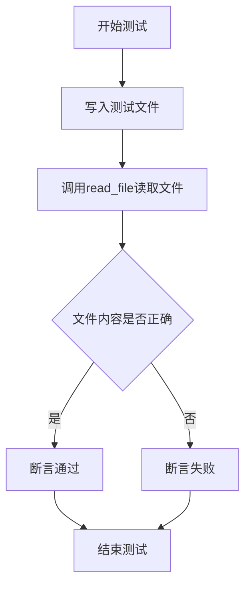

- **带注释源码**:

```python
@pytest.mark.asyncio
async def test_read_file(
    test_file_path: Path,
    file_content,
    file_manager_component: FileManagerComponent,
):
    # 步骤1: 使用workspace.write_file写入测试内容到文件
    await file_manager_component.workspace.write_file(test_file_path.name, file_content)
    # 步骤2: 调用FileManagerComponent的read_file方法读取文件
    content = file_manager_component.read_file(test_file_path.name)
    # 步骤3: 验证读取内容与写入内容一致（处理\r换行符差异）
    assert content.replace("\r", "") == file_content
```

#### `test_read_file_not_found`

- **名称**: `test_read_file_not_found`
- **参数**:
  - `file_manager_component`: `FileManagerComponent`，被测组件
- **返回值**: `None`
- **描述**: 验证读取不存在的文件时抛出FileNotFoundError异常
- **流程图**:

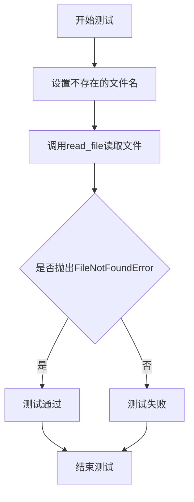

- **带注释源码**:

```python
def test_read_file_not_found(file_manager_component: FileManagerComponent):
    # 定义一个不存在的文件名
    filename = "does_not_exist.txt"
    # 使用pytest.raises验证读取不存在的文件时抛出FileNotFoundError
    with pytest.raises(FileNotFoundError):
        file_manager_component.read_file(filename)
```

#### `test_write_to_file_relative_path`

- **名称**: `test_write_to_file_relative_path`
- **参数**:
  - `test_file_name`: `Path`，测试文件名
  - `file_manager_component`: `FileManagerComponent`，被测组件
- **返回值**: `None` (async test)
- **描述**: 验证使用相对路径写入文件的功能
- **流程图**:

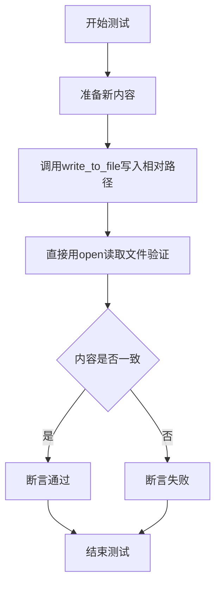

- **带注释源码**:

```python
@pytest.mark.asyncio
async def test_write_to_file_relative_path(
    test_file_name: Path, file_manager_component: FileManagerComponent
):
    # 准备新的文件内容
    new_content = "This is new content.\n"
    # 使用相对路径调用write_to_file方法写入文件
    await file_manager_component.write_to_file(test_file_name, new_content)
    # 直接用Python内置open函数读取文件验证写入结果
    with open(
        file_manager_component.workspace.get_path(test_file_name), "r", encoding="utf-8"
    ) as f:
        content = f.read()
    # 断言写入的内容与预期一致
    assert content == new_content
```

#### `test_write_to_file_absolute_path`

- **名称**: `test_write_to_file_absolute_path`
- **参数**:
  - `test_file_path`: `Path`，测试文件完整路径
  - `file_manager_component`: `FileManagerComponent`，被测组件
- **返回值**: `None` (async test)
- **描述**: 验证使用绝对路径写入文件的功能
- **流程图**:

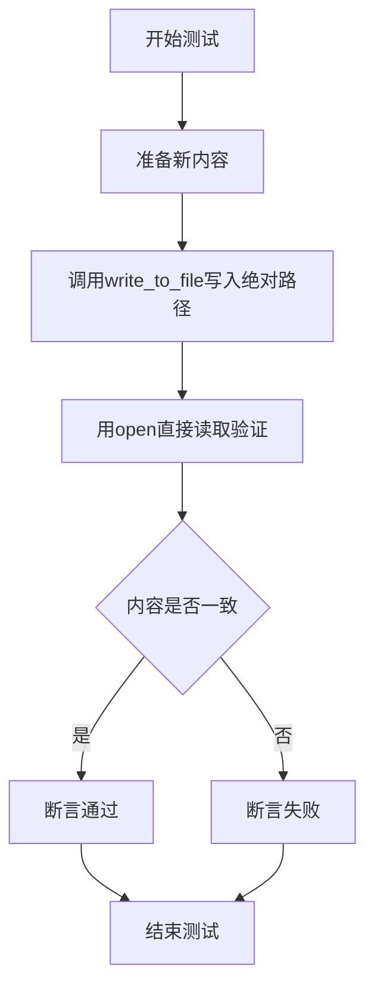

- **带注释源码**:

```python
@pytest.mark.asyncio
async def test_write_to_file_absolute_path(
    test_file_path: Path, file_manager_component: FileManagerComponent
):
    # 准备新的文件内容
    new_content = "This is new content.\n"
    # 使用绝对路径调用write_to_file方法写入文件
    await file_manager_component.write_to_file(test_file_path, new_content)
    # 使用绝对路径直接用open读取文件
    with open(test_file_path, "r", encoding="utf-8") as f:
        content = f.read()
    # 断言写入的内容与预期一致
    assert content == new_content
```

#### `test_list_files`

- **名称**: `test_list_files`
- **参数**:
  - `file_manager_component`: `FileManagerComponent`，被测组件
- **返回值**: `None` (async test)
- **描述**: 验证列出目录文件功能，包括子目录文件，并测试不存在文件时的处理
- **流程图**:

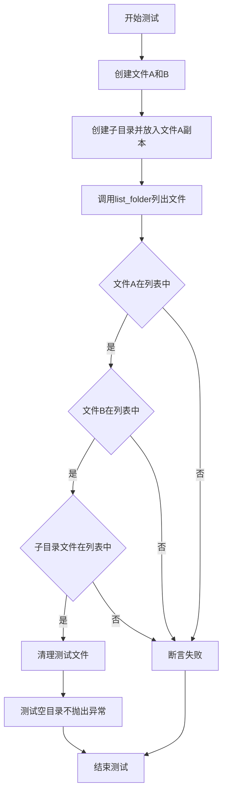

- **带注释源码**:

```python
@pytest.mark.asyncio
async def test_list_files(file_manager_component: FileManagerComponent):
    # 创建测试用的两个文件A和B
    file_a_name = "file_a.txt"
    file_b_name = "file_b.txt"
    test_directory = Path("test_directory")

    # 写入文件A和文件B的内容
    await file_manager_component.workspace.write_file(file_a_name, "This is file A.")
    await file_manager_component.workspace.write_file(file_b_name, "This is file B.")

    # 创建一个子目录并在子目录中放置文件A的副本
    file_manager_component.workspace.make_dir(test_directory)
    await file_manager_component.workspace.write_file(
        test_directory / file_a_name, "This is file A in the subdirectory."
    )

    # 调用list_folder获取目录文件列表
    files = file_manager_component.list_folder(".")
    # 验证根目录的文件A和文件B都在列表中
    assert file_a_name in files
    assert file_b_name in files
    # 验证子目录中的文件A也在列表中（使用os.path.join构建完整路径）
    assert os.path.join(test_directory, file_a_name) in files

    # 清理：删除所有创建的测试文件
    file_manager_component.workspace.delete_file(file_a_name)
    file_manager_component.workspace.delete_file(file_b_name)
    file_manager_component.workspace.delete_file(test_directory / file_a_name)
    file_manager_component.workspace.delete_dir(test_directory)

    # 场景2: 测试列出空目录或不存在的目录不应抛出异常
    non_existent_file = "non_existent_file.txt"
    files = file_manager_component.list_folder("")
    # 验证不存在的文件不在列表中
    assert non_existent_file not in files
```

## 5. 关键组件信息

| 组件名称 | 描述 |
|---------|------|
| `FileManagerComponent` | 文件管理器核心组件，提供文件读写和目录列表功能 |
| `BaseAgentSettings` | 代理配置类，用于初始化FileManagerComponent |
| `FileStorage` | 文件存储抽象层，提供路径管理和存储抽象 |
| `workspace` | 工作空间对象，底层文件操作的实际执行者 |

## 6. 潜在技术债务与优化空间

### 6.1 测试代码层面

1. **重复清理逻辑**: `test_list_files`中包含大量手动清理代码，建议使用pytest的fixture的teardown机制或`yield`fixture模式自动清理
2. **硬编码路径分隔符**: 使用`os.path.join`而非`pathlib`的`/`操作符，与其他代码风格不一致
3. **测试数据重复**: 文件内容字符串在多处重复定义，应提取为常量或共享fixture

### 6.2 组件设计层面

1. **异常类型单一**: 仅测试了`FileNotFoundError`，建议补充其他异常场景测试（如权限错误、磁盘空间不足等）
2. **缺乏并发测试**: 多个异步测试之间可能存在资源竞争，建议添加并发写入/读取的压力测试
3. **路径处理不一致**: 同时支持相对路径和绝对路径，但未明确文档说明优先级和转换逻辑

### 6.3 测试覆盖度

1. **缺少边界条件测试**: 空文件、超大文件、特殊字符文件名等边界情况未覆盖
2. **缺少性能基准**: 未包含文件操作性能的基准测试

## 7. 其它项目信息

### 7.1 设计目标与约束

- **目标**: 确保FileManagerComponent能够正确执行基本的文件CRUD操作
- **约束**: 
  - 使用pytest框架和async/await异步测试模式
  - 依赖外部的FileStorage和workspace进行底层文件操作

### 7.2 错误处理与异常设计

| 场景 | 预期异常 | 测试覆盖 |
|------|---------|---------|
| 读取不存在的文件 | `FileNotFoundError` | ✅ test_read_file_not_found |
| 写入路径异常 | - | ❌ 未覆盖 |
| 目录权限不足 | - | ❌ 未覆盖 |
| 磁盘空间不足 | - | ❌ 未覆盖 |

### 7.3 数据流与状态机

```
写入流程:
  用户输入 → write_to_file() → workspace.write_file() → 文件系统
  
读取流程:
  文件系统 → workspace.read_file() → read_file() → 用户输出
  
列表流程:
  用户输入 → list_folder() → workspace.list_dir() → 文件列表
```

### 7.4 外部依赖与接口契约

| 依赖模块 | 导入路径 | 用途 |
|---------|---------|------|
| pytest | `import pytest` | 测试框架和fixture管理 |
| FileManagerComponent | `. import FileManagerComponent` | 被测组件 |
| BaseAgentSettings | `from forge.agent.base import BaseAgentSettings` | 配置类 |
| FileStorage | `from forge.file_storage import FileStorage` | 存储抽象层 |


### `FileManagerComponent`

这是一个文件管理组件，用于在代理的工作空间中执行文件的读取、写入和列表操作，提供与文件系统交互的接口。

参数：

- `storage`：`FileStorage`，文件存储后端
- `settings`：`BaseAgentSettings`，代理的设置信息

返回值：`FileManagerComponent`，返回文件管理组件的实例

#### 流程图

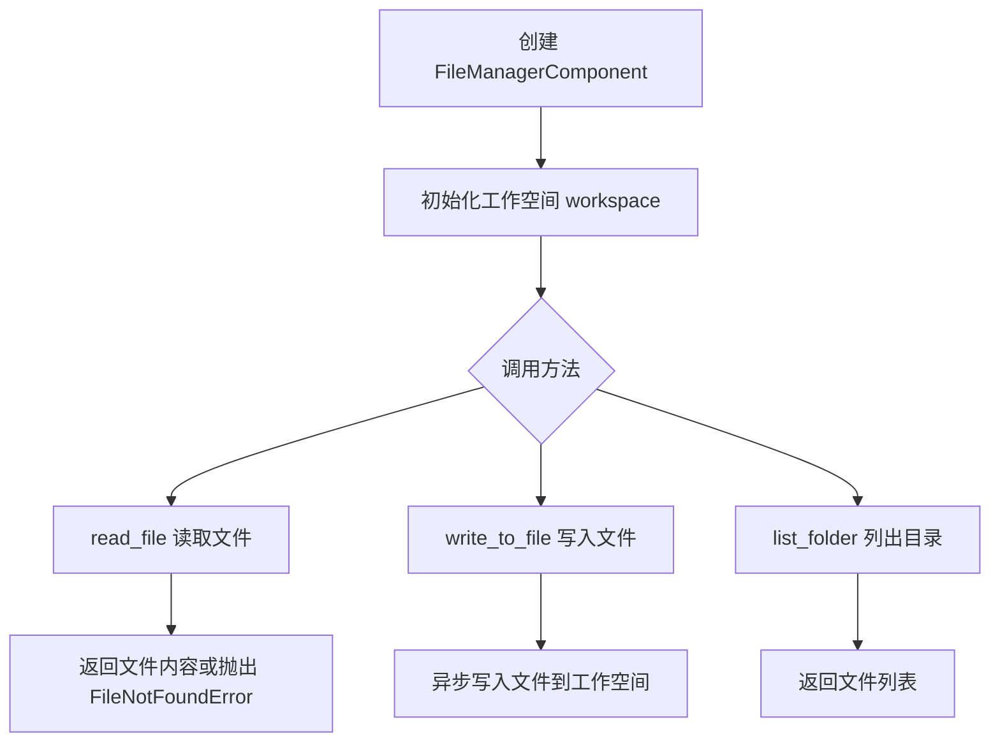

#### 带注释源码

```python
# 这是一个 pytest fixture，用于创建 FileManagerComponent 实例
# 参数：storage: FileStorage - 文件存储后端
# 返回：FileManagerComponent 实例
@pytest.fixture
def file_manager_component(storage: FileStorage):
    return FileManagerComponent(
        storage,
        BaseAgentSettings(
            agent_id="TestAgent", 
            name="TestAgent", 
            description="Test Agent description"
        ),
    )
```

### `FileManagerComponent.read_file`

从工作空间读取指定文件的内容。

参数：

- `filename`：`str`，要读取的文件名或相对路径

返回值：`str`，返回文件内容字符串

#### 流程图

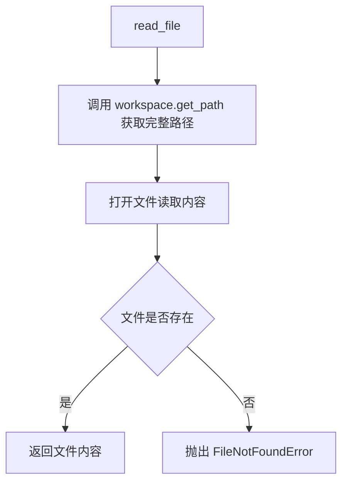

#### 带注释源码

```python
# 从工作空间读取文件内容
# 参数：filename - 文件名或相对路径
# 返回：文件内容字符串
content = file_manager_component.read_file(test_file_path.name)
```

### `FileManagerComponent.write_to_file`

将内容异步写入指定文件。

参数：

- `filename`：`str` 或 `Path`，要写入的文件名或路径
- `content`：`str`，要写入的内容

返回值：`None`（异步操作）

#### 流程图

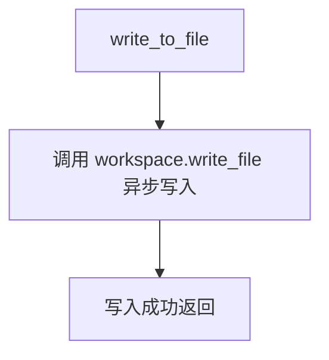

#### 带注释源码

```python
# 异步写入文件到工作空间
# 参数：filename - 文件名或路径, content - 要写入的内容
# 返回：None（异步操作）
await file_manager_component.write_to_file(test_file_name, new_content)
```

### `FileManagerComponent.list_folder`

列出指定目录下的所有文件和子目录。

参数：

- `folder_path`：`str`，目录路径（如 "." 表示当前目录）

返回值：`List[str]`，返回文件路径列表

#### 流程图

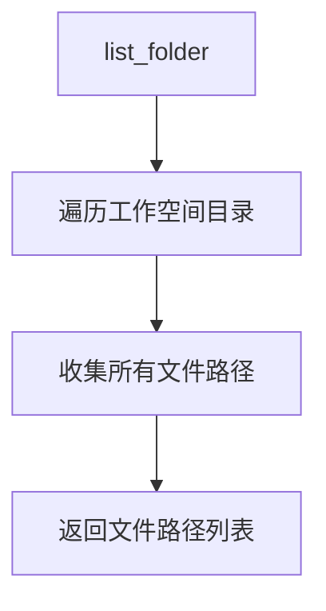

#### 带注释源码

```python
# 列出目录中的文件
# 参数：folder_path - 目录路径
# 返回：文件路径列表
files = file_manager_component.list_folder(".")
```

---

## 完整类信息

### `FileManagerComponent` 类

**描述**：文件管理组件，提供代理工作空间中的文件操作能力

**类字段**：

- `workspace`：工作空间对象，提供底层文件操作
- `agent_id`：代理ID标识

**类方法**：

| 方法名 | 功能描述 |
|--------|----------|
| `read_file` | 读取工作空间中的文件内容 |
| `write_to_file` | 异步写入内容到文件 |
| `list_folder` | 列出目录下的所有文件 |


### `test_file_name`

这是一个 pytest fixture，用于提供一个测试文件的文件名路径对象（Path 对象），供其他测试用例使用。

参数：
- （无参数）

返回值：`Path`，返回一个 Path 对象，表示名为 "test_file.txt" 的文件路径

#### 流程图

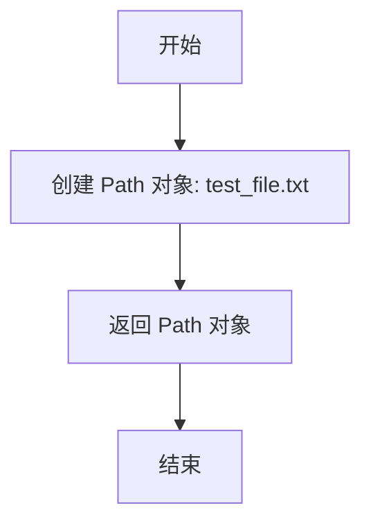

#### 带注释源码

```python
@pytest.fixture()
def test_file_name():
    """
    pytest fixture: 提供测试文件名路径
    
    创建一个 Path 对象表示测试文件的名称，供其他测试用例
    在创建文件、写入文件等操作时使用。
    
    返回值:
        Path: 包含测试文件名 'test_file.txt' 的 Path 对象
    """
    return Path("test_file.txt")
```

---

### 补充说明

#### 关键组件信息

| 组件名称 | 一句话描述 |
|---------|-----------|
| `Path` | Python pathlib 模块中的路径对象，用于跨平台路径操作 |

#### 潜在技术债务与优化空间

1. **缺乏类型注解**：虽然 fixture 返回 `Path` 类型，但 fixture 本身没有显式的返回类型注解（Python 3.9+ 可使用 `-> Path`）
2. **硬编码文件名**：文件名 "test_file.txt" 硬编码在 fixture 中，如果需要不同文件名的测试用例，需要创建新的 fixture

#### 其它项目

- **设计目标**：为测试套件提供可复用的测试文件路径对象
- **错误处理**：无错误处理，这是简单的数据 fixture
- **外部依赖**：`pathlib.Path`（Python 标准库）


### `test_file_path`

这是一个 pytest fixture，用于生成测试文件的完整路径。它接收测试文件名和存储实例作为参数，通过存储的 `get_path` 方法返回文件的完整路径。

参数：

- `test_file_name`：`Path`，测试文件的名称（仅包含文件名的 Path 对象）
- `storage`：`FileStorage`，文件存储服务实例，用于获取文件的完整路径

返回值：`Path`，返回文件的完整路径对象

#### 流程图

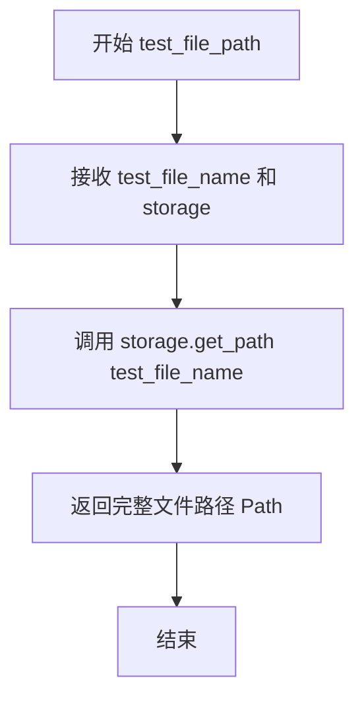

#### 带注释源码

```python
@pytest.fixture
def test_file_path(test_file_name: Path, storage: FileStorage):
    """
    pytest fixture: 生成测试文件的完整路径
    
    参数:
        test_file_name: Path - 测试文件的文件名（不含路径）
        storage: FileStorage - 文件存储服务实例
    
    返回:
        Path - 测试文件的完整路径
    """
    return storage.get_path(test_file_name)
```


### `test_directory`

这是一个 pytest fixture，用于创建并返回测试目录的路径对象。

参数：

- `storage`：`FileStorage`，文件存储管理器实例，用于获取路径

返回值：`Path`，测试目录的路径对象

#### 流程图

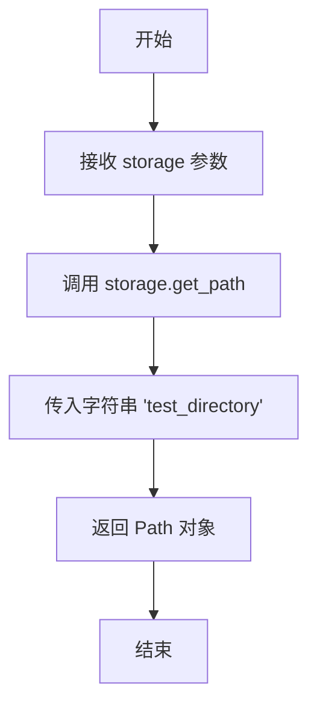

#### 带注释源码

```python
@pytest.fixture()
def test_directory(storage: FileStorage):
    """
    pytest fixture: 创建测试目录路径
    
    参数:
        storage: FileStorage 实例，用于获取文件存储路径
        
    返回值:
        Path 对象，指向测试目录 'test_directory'
    """
    return storage.get_path("test_directory")
```


### `test_nested_file`

这是一个pytest fixture，用于提供嵌套测试文件的路径对象。

参数：

- `storage`：`FileStorage`，存储实例，用于获取文件路径

返回值：`Path`，返回嵌套测试文件 "nested/test_file.txt" 的路径对象

#### 流程图

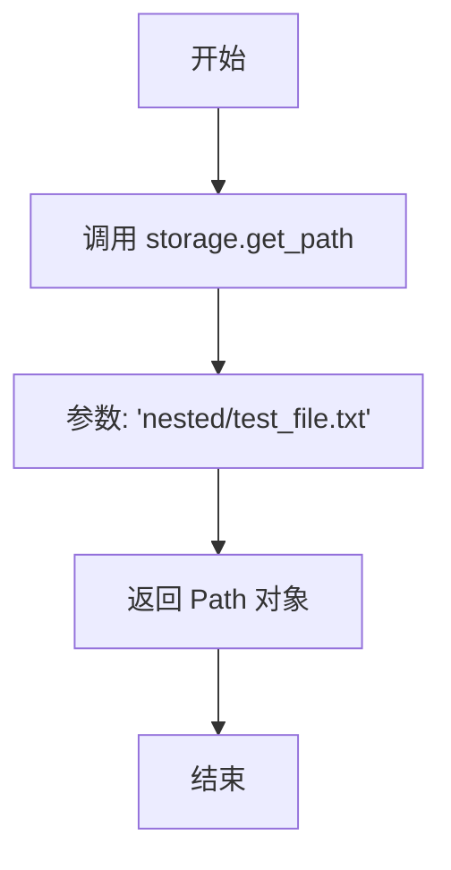

#### 带注释源码

```python
@pytest.fixture()
def test_nested_file(storage: FileStorage):
    """
    pytest fixture: 提供嵌套测试文件的路径
    
    参数:
        storage: FileStorage 实例，用于获取文件系统路径
        
    返回:
        Path: 指向 'nested/test_file.txt' 的路径对象
    """
    return storage.get_path("nested/test_file.txt")
```


### `test_read_file`

这是一个异步测试函数，用于验证 `FileManagerComponent` 的文件读取功能是否正确工作。测试通过向工作区写入文件，然后使用 `read_file` 方法读取文件内容，并断言读取的内容与写入的内容一致。

参数：

- `test_file_path`：`Path`，测试文件的路径对象，表示要操作的文件位置
- `file_content`：`str`，测试用的文件内容，由 fixture 提供
- `file_manager_component`：`FileManagerComponent`，文件管理器组件实例，用于执行文件操作

返回值：`None`，测试函数无返回值，通过 assert 语句进行验证

#### 流程图

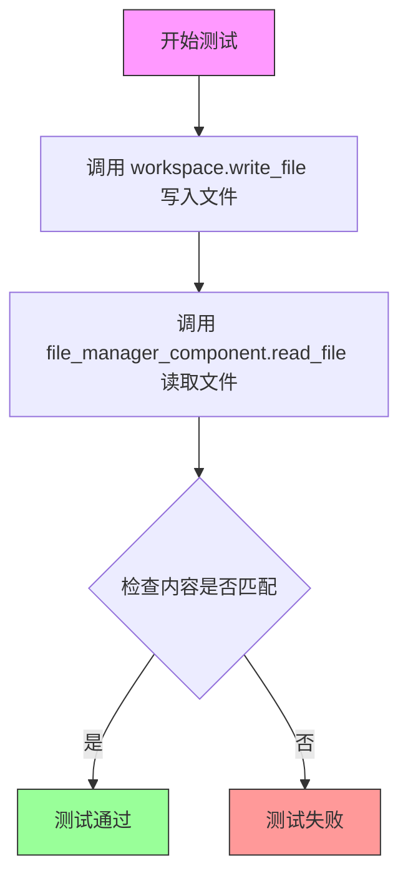

#### 带注释源码

```python
@pytest.mark.asyncio
async def test_read_file(
    test_file_path: Path,          # 测试文件的路径对象
    file_content,                   # 预期的文件内容（来自 fixture）
    file_manager_component: FileManagerComponent,  # 文件管理器组件实例
):
    """
    测试 FileManagerComponent.read_file 方法的基本功能
    
    测试流程：
    1. 向工作区写入测试文件
    2. 使用 read_file 方法读取文件内容
    3. 验证读取的内容与写入的内容一致（处理不同操作系统的换行符差异）
    """
    # 步骤1：向工作区写入测试文件
    # 使用 test_file_path.name 获取文件名（不含路径），写入 file_content 内容
    await file_manager_component.workspace.write_file(test_file_path.name, file_content)
    
    # 步骤2：调用 file_manager_component 的 read_file 方法读取文件
    # 传入文件名（不含路径）作为参数
    content = file_manager_component.read_file(test_file_path.name)
    
    # 步骤3：断言验证
    # 使用 replace("\r", "") 处理 Windows 系统的 CRLF 换行符
    # 确保在不同操作系统下测试都能通过
    assert content.replace("\r", "") == file_content
```


### `test_read_file_not_found`

该测试函数用于验证 `FileManagerComponent` 的 `read_file` 方法在尝试读取不存在的文件时是否正确抛出 `FileNotFoundError` 异常。

参数：

- `file_manager_component`：`FileManagerComponent`，文件管理器组件实例，用于执行文件读取操作

返回值：`None`，测试函数无返回值，通过 pytest 的上下文管理器验证异常

#### 流程图

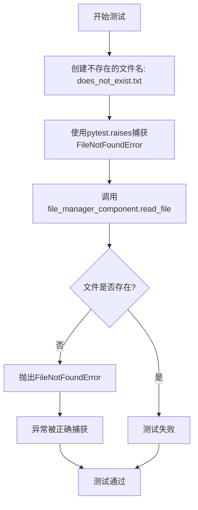

#### 带注释源码

```python
def test_read_file_not_found(file_manager_component: FileManagerComponent):
    """
    测试当读取不存在的文件时,read_file方法应抛出FileNotFoundError异常。
    
    参数:
        file_manager_component: FileManagerComponent的实例,提供文件管理功能
    """
    # 定义一个不存在的文件名,用于触发FileNotFoundError
    filename = "does_not_exist.txt"
    
    # 使用pytest.raises上下文管理器验证异常被正确抛出
    with pytest.raises(FileNotFoundError):
        # 调用read_file方法尝试读取不存在的文件
        # 预期会抛出FileNotFoundError,如果未抛出则测试失败
        file_manager_component.read_file(filename)
```


### `test_write_to_file_relative_path`

该测试函数用于验证 `FileManagerComponent` 能够使用相对路径将内容成功写入文件，通过调用 `write_to_file` 方法并验证写入后的文件内容是否与预期一致。

参数：

- `test_file_name`：`Path`，测试用的相对文件名（Path对象）
- `file_manager_component`：`FileManagerComponent`，文件管理器组件实例，用于执行文件写入操作

返回值：`None`，无返回值（测试函数）

#### 流程图

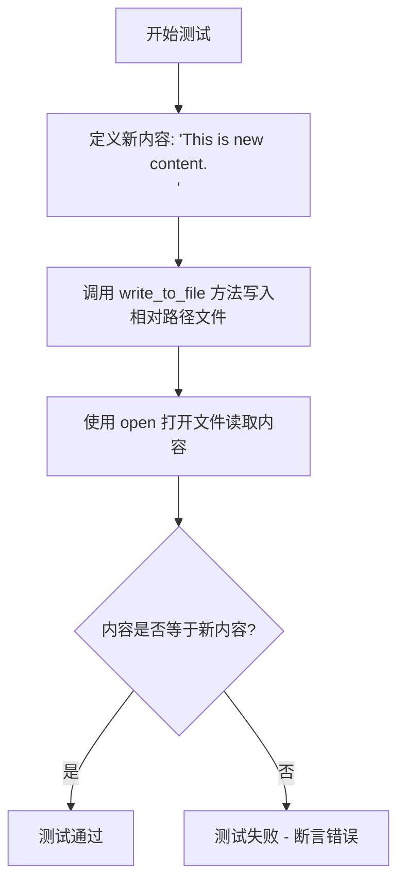

#### 带注释源码

```python
@pytest.mark.asyncio
async def test_write_to_file_relative_path(
    test_file_name: Path, file_manager_component: FileManagerComponent
):
    # 定义测试用的新内容
    new_content = "This is new content.\n"
    
    # 调用 file_manager_component 的 write_to_file 方法
    # 传入相对路径 (test_file_name) 和新内容
    # 该方法应该将内容写入到相对于工作区的文件中
    await file_manager_component.write_to_file(test_file_name, new_content)
    
    # 使用标准 Python open 函数打开文件进行读取
    # 通过 workspace.get_path 获取文件的完整路径
    with open(
        file_manager_component.workspace.get_path(test_file_name), "r", encoding="utf-8"
    ) as f:
        # 读取文件内容
        content = f.read()
    
    # 断言写入的内容与读取的内容一致
    # 验证相对路径写入功能是否正常工作
    assert content == new_content
```


### `test_write_to_file_absolute_path`

该测试函数用于验证 FileManagerComponent 能够正确地将内容写入使用绝对路径指定的文件。它通过异步调用 `write_to_file` 方法写入新内容，然后直接使用 Python 内置的 `open` 函数读取文件并验证内容是否与预期一致，从而确保文件写入功能的正确性。

参数：

- `test_file_path`：`Path`，测试文件的绝对路径
- `file_manager_component`：`FileManagerComponent`，文件管理器组件实例，用于执行文件写入操作

返回值：`None`，该函数为异步测试函数，不返回任何值

#### 流程图

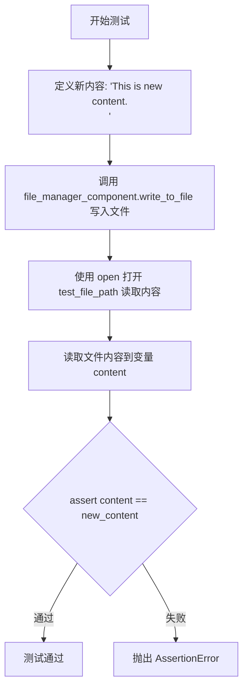

#### 带注释源码

```python
@pytest.mark.asyncio
async def test_write_to_file_absolute_path(
    test_file_path: Path,  # 测试文件的绝对路径（Path对象）
    file_manager_component: FileManagerComponent  # 文件管理器组件实例
):
    """
    测试使用绝对路径写入文件的功能
    
    该测试验证：
    1. write_to_file 方法能够正确处理绝对路径
    2. 写入的内容与预期内容一致
    """
    # 定义要写入的新内容
    new_content = "This is new content.\n"
    
    # 异步调用文件管理器组件的 write_to_file 方法写入文件
    # 传入绝对路径 test_file_path 和新内容
    await file_manager_component.write_to_file(test_file_path, new_content)
    
    # 使用 Python 内置的 open 函数以只读模式打开文件
    # 使用绝对路径 test_file_path 进行验证读取
    with open(test_file_path, "r", encoding="utf-8") as f:
        # 读取文件全部内容
        content = f.read()
    
    # 断言验证：读取的内容必须与写入的内容完全一致
    # 如果不一致会抛出 AssertionError 导致测试失败
    assert content == new_content
```


### `test_list_files`

该测试函数用于验证 `FileManagerComponent` 类的 `list_folder` 方法，能够正确列出当前目录中的文件、子目录中的文件，并确保在查找不存在的文件时不会抛出异常。

参数：

- `file_manager_component`：`FileManagerComponent`，用于管理文件的组件实例，提供文件读写和目录列表功能

返回值：`None`，该函数为测试函数，无返回值

#### 流程图

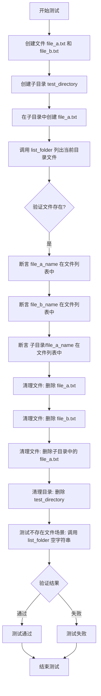

#### 带注释源码

```python
@pytest.mark.asyncio
async def test_list_files(file_manager_component: FileManagerComponent):
    """测试 list_folder 方法列出文件和子目录中文件的功能"""
    
    # 准备测试文件名和目录名
    file_a_name = "file_a.txt"
    file_b_name = "file_b.txt"
    test_directory = Path("test_directory")

    # 在工作区创建两个测试文件
    await file_manager_component.workspace.write_file(file_a_name, "This is file A.")
    await file_manager_component.workspace.write_file(file_b_name, "This is file B.")

    # 创建一个子目录，并在子目录中放置 file_a 的副本
    file_manager_component.workspace.make_dir(test_directory)
    await file_manager_component.workspace.write_file(
        test_directory / file_a_name, "This is file A in the subdirectory."
    )

    # 调用 list_folder 列出当前目录下的所有文件
    files = file_manager_component.list_folder(".")
    
    # 验证根目录下的文件在列表中
    assert file_a_name in files
    assert file_b_name in files
    
    # 验证子目录中的文件也在列表中（包含完整路径）
    assert os.path.join(test_directory, file_a_name) in files

    # ========== 清理阶段 ==========
    # 删除在测试过程中创建的所有文件和目录
    
    # 删除根目录下的测试文件
    file_manager_component.workspace.delete_file(file_a_name)
    file_manager_component.workspace.delete_file(file_b_name)
    
    # 删除子目录中的文件
    file_manager_component.workspace.delete_file(test_directory / file_a_name)
    
    # 删除子目录
    file_manager_component.workspace.delete_dir(test_directory)

    # ========== 边界情况测试 ==========
    # 测试查找不存在的文件时不会抛出异常
    
    # 使用空字符串路径调用 list_folder
    non_existent_file = "non_existent_file.txt"
    files = file_manager_component.list_folder("")
    
    # 验证不存在的文件不在结果列表中
    assert non_existent_file not in files
```


### `FileManagerComponent.read_file`

该方法用于从工作空间读取指定文件的内容，并返回文件内容字符串。如果文件不存在，则抛出 `FileNotFoundError` 异常。

参数：

- `filename`：`str`，要读取的文件名或相对路径（基于工作空间根目录）

返回值：`str`，返回文件的内容（字符串形式）

#### 流程图

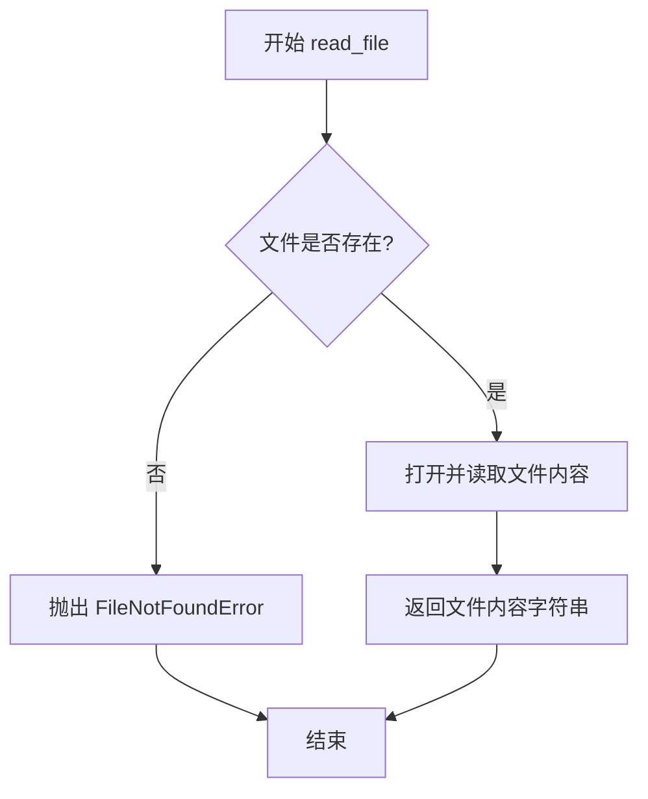

#### 带注释源码

```python
# 从测试用例中推断的方法签名和行为
def read_file(self, filename: str) -> str:
    """
    读取指定文件的内容。
    
    参数:
        filename: 文件名或相对路径（相对于工作空间根目录）
        
    返回:
        文件内容的字符串
        
    异常:
        FileNotFoundError: 当文件不存在时抛出
    """
    # 获取文件的完整路径
    file_path = self.workspace.get_path(filename)
    
    # 尝试打开并读取文件
    try:
        with open(file_path, 'r', encoding='utf-8') as f:
            content = f.read()
        return content
    except FileNotFoundError:
        # 文件不存在时抛出异常
        raise FileNotFoundError(f"File '{filename}' not found in workspace")
```

> **注意**：由于提供的代码仅为测试文件，未包含 `FileManagerComponent` 类的实际实现，上述源码是根据测试用例行为推断得出的。测试用例 `test_read_file` 和 `test_read_file_not_found` 展示了该方法的预期行为。


### `FileManagerComponent.write_to_file`

将指定内容写入到给定路径的文件中，支持相对路径和绝对路径。

参数：

- `file_path`：Union[Path, str]，要写入的文件路径，可以是相对路径或绝对路径
- `content`：str，要写入文件的内容

返回值：`Awaitable[None]`，异步操作，无返回值（写入操作完成）

#### 流程图

```mermaid
flowchart TD
    A[开始写入文件] --> B{检查文件路径类型}
    B -->|相对路径| C[使用 workspace 解析完整路径]
    B -->|绝对路径| D[直接使用绝对路径]
    C --> E[调用 workspace 的 write_file 方法]
    D --> E
    E --> F[异步写入文件内容]
    F --> G[结束]
```

#### 带注释源码

```python
# 从测试代码推断的方法签名（实际实现未在代码中给出）
async def write_to_file(self, file_path: Union[Path, str], content: str) -> None:
    """
    将内容写入到指定路径的文件中
    
    参数:
        file_path: 文件路径，支持相对路径（如 "test_file.txt"）和绝对路径（如 Path("test_file.txt")）
        content: 要写入的文件内容
    
    返回:
        无返回值，异步操作
    
    注意:
        - 该方法是异步的，需要使用 await 调用
        - 支持相对路径和绝对路径
        - 相对路径会通过 workspace 解析
        - 绝对路径直接使用
    """
    # 测试代码中的调用方式：
    # await file_manager_component.write_to_file(test_file_name, new_content)
    # await file_manager_component.write_to_file(test_file_path, new_content)
    
    # 内部实现可能是通过 self.workspace.write_file() 来完成实际写入
    await self.workspace.write_file(file_path, content)
```


### `FileManagerComponent.list_folder`

该方法用于列出指定目录中的所有文件和子目录，返回包含文件路径的列表。

参数：

-  `path`：`str`，要列出的目录路径，支持相对路径（如 "." 表示当前目录）和空字符串（表示根目录或工作区根目录）

返回值：`List[str]`，返回目录中所有文件和子目录的路径列表

#### 流程图

```mermaid
flowchart TD
    A[开始 list_folder] --> B{验证 path 参数}
    B -->|有效| C[调用底层存储/工作区 API 列出目录内容}
    B -->|无效| D[返回空列表或抛出异常]
    C --> E[返回文件路径列表]
    E --> F[结束]
```

#### 带注释源码

```python
# 注意：以下是基于测试用例推断的源代码结构
# 实际实现可能有所不同

def list_folder(self, path: str) -> List[str]:
    """
    列出指定目录中的所有文件和子目录
    
    参数:
        path: 目录路径，支持相对路径
              "." 表示当前工作目录
              "" 可能表示根目录或工作区根目录
    
    返回:
        包含所有文件路径的列表
    
    示例:
        files = component.list_folder(".")      # 列出当前目录
        files = component.list_folder("")       # 列出根目录
    """
    # 1. 验证路径参数
    # 2. 调用 workspace 或 storage 的底层 API
    # 3. 获取目录内容并格式化为路径列表返回
    pass
```

#### 备注

由于提供的代码仅包含测试文件，未包含 `FileManagerComponent` 类的实际实现源码，以上内容基于测试用例 `test_list_files` 的行为推断：

- 当传入 `"."` 时，返回当前目录下的文件列表（包括子目录中的文件）
- 当传入 `""` 时，返回根目录的内容（可能为空列表）
- 该方法不会抛出异常，即使目录为空或不存在也应返回空列表


### `FileManagerComponent.workspace`

该属性返回文件管理器的工作空间对象，用于提供文件存储和管理的底层操作能力，支持文件的读写、目录创建、文件列表获取及文件删除等功能。

参数： 无（这是一个属性而非方法）

返回值：`FileStorage`，工作空间对象，提供文件系统的基本操作接口

#### 流程图

```mermaid
flowchart TD
    A[访问 FileManagerComponent.workspace 属性] --> B{工作空间是否已初始化}
    B -->|已初始化| C[返回现有工作空间对象]
    B -->|未初始化| D[创建新的工作空间对象]
    D --> C
    C --> E[调用工作空间方法: write_file/get_path/make_dir/delete_file/delete_dir]
```

#### 带注释源码

```python
# FileManagerComponent 类中 workspace 属性的典型实现模式
# （基于测试代码中的使用方式推断）

class FileManagerComponent:
    def __init__(self, storage: FileStorage, settings: BaseAgentSettings):
        self.storage = storage
        self.settings = settings
        # workspace 属性返回存储对象，用于文件操作
        self._workspace = storage  # 或其他工作空间实现
    
    @property
    def workspace(self):
        """
        获取工作空间对象
        
        返回:
            FileStorage: 提供文件系统操作的工作空间实例
                     支持方法:
                     - write_file(filename, content): 写入文件
                     - get_path(path): 获取文件路径
                     - make_dir(directory): 创建目录
                     - delete_file(filename): 删除文件
                     - delete_dir(directory): 删除目录
        """
        return self._workspace
    
    # 组件的其他方法使用 workspace 属性进行文件操作
    async def write_to_file(self, filename, content):
        # 使用 workspace.write_file 写入文件
        await self.workspace.write_file(filename, content)
    
    def read_file(self, filename):
        # 使用 workspace 读取文件
        return self.workspace.read_file(filename)
    
    def list_folder(self, path):
        # 使用 workspace 列出目录内容
        return self.workspace.list_folder(path)
```

#### 使用示例（来自测试代码）

```python
# 测试代码中 workspace 的使用方式

# 写入文件
await file_manager_component.workspace.write_file(file_a_name, "This is file A.")

# 获取路径
file_manager_component.workspace.get_path(test_file_name)

# 创建目录
file_manager_component.workspace.make_dir(test_directory)

# 删除文件
file_manager_component.workspace.delete_file(file_a_name)

# 删除目录
file_manager_component.workspace.delete_dir(test_directory)
```

## 关键组件


### 核心功能概述

该代码是一个针对 FileManagerComponent 类的 pytest 测试套件，验证文件管理器组件的文件读取、写入、列表浏览等核心功能，支持相对路径和绝对路径操作，并包含错误处理测试。

### 文件整体运行流程

测试文件通过 pytest 框架执行，首先定义多个 fixtures 提供测试所需的依赖资源（FileStorage、FileManagerComponent 实例、测试文件路径等），然后按顺序执行 6 个测试用例：test_read_file 验证文件读取功能，test_read_file_not_found 验证文件不存在时的异常抛出，test_write_to_file_relative_path 验证相对路径写入，test_write_to_file_absolute_path 验证绝对路径写入，test_list_files 验证目录列表功能。每个测试用例执行前后通过 fixture 或代码内清理测试产生的临时文件。

### 类详细信息

#### FileManagerComponent 类

该类为被测试的核心组件，负责文件操作管理。

**类字段：**

- workspace: FileStorage 类型，文件存储工作空间
- settings: BaseAgentSettings 类型，代理配置信息

**类方法：**

- read_file(filename: str) -> str
  - 参数：filename - 要读取的文件名（字符串）
  - 返回值：文件内容字符串
  - 功能：读取指定文件并返回内容

- write_to_file(filename: Union[str, Path], content: str) -> None
  - 参数：filename - 文件名或路径，content - 写入内容
  - 返回值：无
  - 功能：将内容写入指定文件

- list_folder(folder_path: str) -> List[str]
  - 参数：folder_path - 文件夹路径
  - 返回值：文件路径列表
  - 功能：列出指定目录下的所有文件

### 关键组件信息

#### FileStorage

文件存储抽象层，提供底层文件系统操作接口，包括 get_path、write_file、delete_file、make_dir、delete_dir 等方法。

#### BaseAgentSettings

代理配置类，包含 agent_id、name、description 等属性，用于初始化 FileManagerComponent。

#### 测试 Fixtures

- file_content: 提供测试文件内容
- file_manager_component: 创建 FileManagerComponent 实例
- test_file_name: 测试文件名
- test_file_path: 测试文件完整路径
- test_directory: 测试目录路径
- test_nested_file: 嵌套测试文件路径

### 潜在技术债务与优化空间

1. **硬编码路径分隔符**: 使用 `os.path.join` 进行路径拼接，可考虑使用 pathlib 统一处理
2. **重复的文件清理逻辑**: test_list_files 中的清理代码重复，可提取为 fixture 的 teardown 逻辑
3. **缺乏异步测试覆盖**: read_file 方法未使用 async，但 workspace.write_file 是异步的，可能存在 API 使用不一致
4. **异常处理测试覆盖不足**: 仅测试了 FileNotFoundError，其他异常类型（如权限错误、磁盘空间不足）未覆盖

### 其他项目

#### 设计目标与约束

- 测试目标：验证 FileManagerComponent 的文件读写列表功能正确性
- 约束：依赖 FileStorage 和 BaseAgentSettings 两个外部组件

#### 错误处理与异常设计

- 读取不存在的文件时抛出 FileNotFoundError
- list_folder 对不存在的文件返回空列表而非抛出异常

#### 外部依赖与接口契约

- FileStorage: 提供文件系统的持久化能力
- BaseAgentSettings: 提供组件运行时配置
- pytest: 测试框架依赖


## 问题及建议


### 已知问题

-   **测试隔离不足**：`test_list_files` 中手动进行文件清理，如果测试在删除前抛出异常，会产生脏数据残留，应使用 fixture 的 teardown 机制或 pytest 的 `yield` 模式
-   **文件句柄未关闭**：`test_write_to_file_relative_path` 和 `test_write_to_file_absolute_path` 中直接使用 `open()` 打开文件读取，未使用上下文管理器，可能导致资源泄漏
-   **换行符处理掩盖问题**：`test_read_file` 中使用 `replace("\r", "")` 隐藏了实际的换行符问题，可能导致在 Windows 环境下行为不一致
-   **硬编码路径分隔符**：在 `test_list_files` 中混用了 `os.path.join` 和 Path 对象的 `/` 运算符，降低了跨平台兼容性
-   **测试重复**：`test_write_to_file_relative_path` 和 `test_write_to_file_absolute_path` 逻辑几乎完全相同，仅路径格式不同，可合并为参数化测试
-   **异常场景覆盖不足**：仅测试了读取不存在文件的异常，未覆盖写入到不存在目录、删除不存在的文件等边界情况

### 优化建议

-   将文件清理逻辑移至 fixture 的 teardown 或使用 `yield` 模式确保清理执行
-   使用 `with open(...) as f:` 上下文管理器管理文件资源
-   明确测试预期行为，若需要跨平台换行符处理，应在被测代码中统一处理，而非在测试中补偿
-   统一使用 Path 对象处理路径，避免混用 os.path 和 Path
-   使用 `@pytest.mark.parametrize` 合并相对路径和绝对路径的测试用例
-   增加更多异常场景测试，如写入到不存在的父目录、权限问题、并发写入冲突等

## 其它


### 设计目标与约束

该代码的测试目标是验证 FileManagerComponent 类的核心文件管理功能，包括文件读写、目录列表和错误处理。设计约束包括：使用异步 I/O 操作（pytest.mark.asyncio）、依赖外部的 FileStorage 和 BaseAgentSettings 组件、测试环境隔离（通过 fixture 创建独立的测试文件）。

### 错误处理与异常设计

测试用例覆盖了关键异常场景：FileNotFoundError 在读取不存在的文件时被抛出并被 pytest.raises 捕获。write_to_file 方法需处理相对路径和绝对路径的差异。list_folder 返回空列表而非抛出异常表示文件不存在。所有文件操作后需进行清理以避免测试污染。

### 数据流与状态机

测试数据流：Fixture 创建测试文件/目录 → 调用 FileManagerComponent 方法 → 验证文件内容/目录列表 → 清理资源。状态转换：文件创建（write） → 内容验证（read/list） → 资源释放（delete）。

### 外部依赖与接口契约

依赖导入：FileManagerComponent（本地模块）、BaseAgentSettings（forge.agent.base）、FileStorage（forge.file_storage）、pytest（测试框架）。接口契约：workspace.write_file(filename, content) 返回异步操作、read_file(filename) 返回文件内容字符串、list_folder(path) 返回文件路径列表、workspace.get_path() 返回 Path 对象。

### 性能考虑

测试使用了 @pytest.mark.asyncio 标记支持异步执行，write_file 为异步方法但 read_file 为同步方法。批量文件操作（list_folder）未使用流式处理，大目录可能存在性能瓶颈。

### 安全性考虑

测试中使用 utf-8 编码处理文件内容，避免编码问题。未测试路径遍历攻击（如 ../../../etc/passwd）。文件操作未验证权限控制。

### 并发与异步处理

test_read_file 和 test_write_to_file 系列使用 async/await 模式。file_manager_component.read_file() 为同步方法，与写入的异步方法不对称。测试未覆盖并发写入同一文件的场景。

### 资源管理

测试通过 fixture 依赖注入 FileStorage，自动管理测试目录。手动清理：delete_file、delete_dir 调用。缺少 try-finally 块确保异常时资源清理。

### 测试策略

使用 pytest fixture 模式创建测试数据和组件。测试分类：单元测试（read_file/write_to_file）、集成测试（list_folder 与目录操作）。断言策略：内容比较（replace("\r", "") 处理行尾差异）、存在性检查、异常验证。

### 配置管理

BaseAgentSettings 硬编码测试值：agent_id="TestAgent", name="TestAgent"。FileStorage 路径由外部注入。test_directory 和 test_nested_file 使用 storage.get_path() 动态获取。

### 兼容性考虑

测试依赖特定版本的 pytest 和 pytest-asyncio。Path 对象使用 pathlib.Path 需 Python 3.4+。os.path.join 用于跨平台路径拼接。


    