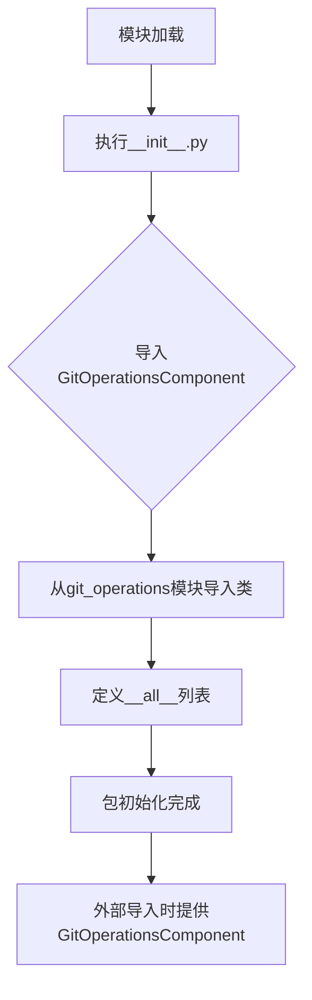

# `.\AutoGPT\classic\forge\forge\components\git_operations\__init__.py` 详细设计文档

这是一个Python包的入口文件，通过相对导入引入GitOperationsComponent类，并将其公开为该包的公共API接口，供外部模块使用。

## 整体流程



## 类结构

```
包根目录
└── __init__.py (包入口文件)
```

## 全局变量及字段


### `__all__`
    
定义模块的公共接口，指定 from module import * 时可导入的成员

类型：`list/tuple`
    


    

## 全局函数及方法


## 关键组件


### 模块概述

该代码文件是一个Python包的初始化模块（__init__.py），主要功能是从git_operations子模块中导入GitOperationsComponent类并将其公开为包的公共API，通过__all__列表明确指定了模块的导出成员。

### 文件运行流程

该文件的执行流程非常直接：当该包被导入时，Python解释器会执行__init__.py文件，首先从.git_operations模块中导入GitOperationsComponent类定义，然后将"GitOperationsComponent"添加到__all__列表中，使其可以通过from package import *的方式被导入。

### 关键组件信息

#### GitOperationsComponent

从.git_operations模块导入的核心组件，具体功能和实现细节需要查看.git_operations模块的源码。该组件应该封装了Git操作相关的功能，可能是用于在量化模型场景中处理Git仓库操作（如模型版本管理、权重文件版本控制等）。

### 潜在技术债务与优化空间

当前__init__.py文件仅作为简单的导入中转站，如果.git_operations模块中的功能较为复杂，可以考虑在此处添加模块级别的文档字符串（docstring）来描述整个包的功能。另外，可以考虑添加版本信息和依赖说明，以便于包的管理和维护。

### 其它项目

- **设计目标**：提供清晰的模块导出接口，遵循Python包的常见实践
- **依赖关系**：依赖于.git_operations模块的存在和其中定义的GitOperationsComponent类
- **错误处理**：如果.git_operations模块不存在或未定义GitOperationsComponent，将抛出ImportError
- **接口契约**：通过__all__明确公开的接口，确保API的稳定性


## 问题及建议


### 已知问题

-   **模块文档缺失**：`__init__.py` 缺少模块级文档字符串（docstring），无法快速了解该包的核心用途和功能定位
-   **元数据缺失**：未定义 `__version__`、`__author__`、`__description__` 等标准包元信息，影响包的可维护性和可追溯性
-   **单一导出限制**：`__all__` 仅导出 `GitOperationsComponent`，若后续包内扩展更多组件（如 `GitConfigComponent`、`GitHooksComponent`），当前结构需频繁修改
-   **无子模块暴露**：未通过相对导入暴露 git_operations 包内的子模块，可能导致外部代码无法直接访问底层功能模块
-   **无初始化逻辑**：缺少包级别的配置、初始化或工厂函数，限制了灵活的组件实例化方式

### 优化建议

-   为 `__init__.py` 添加模块级文档字符串，说明该包负责 Git 操作相关的核心功能
-   参照 PEP 318/PEP 440 标准，添加版本信息和简要描述：
  ```python
  __version__ = "1.0.0"
  __description__ = "Git operations component for version control management"
  ```
-   考虑使用动态 `__all__` 或显式导出多个组件，以支持包的平滑扩展
-   若 git_operations 包包含多个子模块，可添加重导出逻辑以提供统一的入口点
-   引入工厂函数或配置类，封装组件初始化逻辑，提升代码的封装性和可测试性


## 其它


### 设计目标与约束

本模块作为Git操作组件的入口文件，遵循Python模块封装最佳实践，通过__all__显式定义公共接口，实现模块内部实现细节的隐藏。设计目标包括：提供清晰的模块导出接口、遵循PEP 8命名规范、支持未来扩展Git相关功能模块。

### 错误处理与异常设计

由于本文件仅为模块入口文件，不涉及具体业务逻辑，因此错误处理由git_operations模块内部实现。潜在异常包括导入错误（ImportError）——当git_operations模块不存在或存在语法错误时触发。建议调用方使用try-except捕获导入异常。

### 外部依赖与接口契约

本模块依赖git_operations模块中的GitOperationsComponent类。接口契约要求GitOperationsComponent类必须实现Git版本控制相关的核心操作方法。外部依赖还包括Python标准库导入机制。

### 使用示例与集成指南

```python
# 导入方式
from git_operations import GitOperationsComponent

# 使用示例
git_ops = GitOperationsComponent()
# 后续调用相关方法进行Git操作
```

### 模块职责边界

本模块定位为包级别入口点，负责统一导出GitOperationsComponent类，不承担具体业务逻辑。模块职责单一，符合单一职责原则（SRP），便于单元测试和模块替换。

### 版本兼容性说明

本模块兼容Python 3.x版本，使用相对导入语法（from .git_operations import）。建议在Python 3.0+环境中使用，以确保模块导入机制正常工作。


    